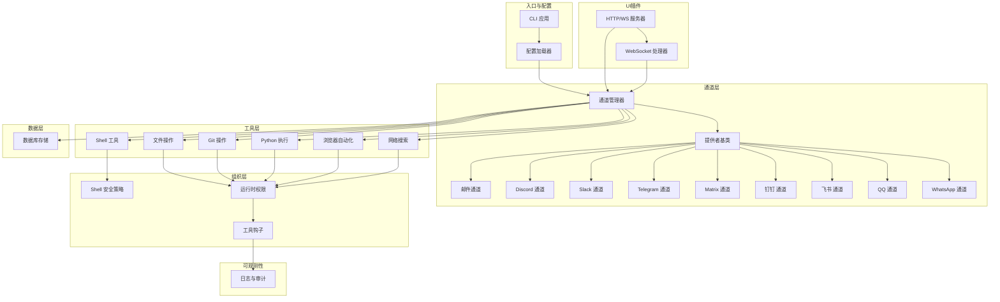
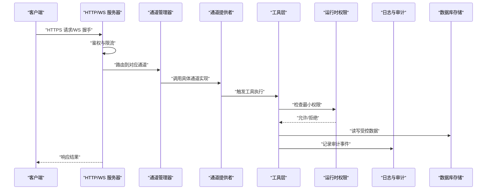
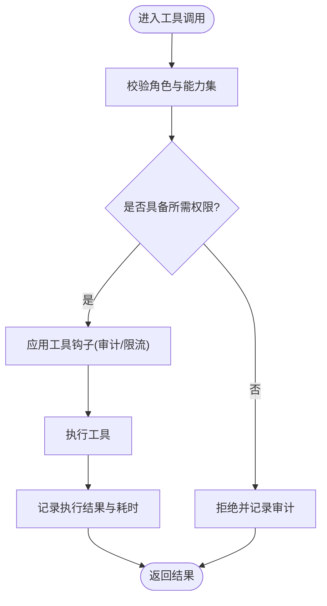
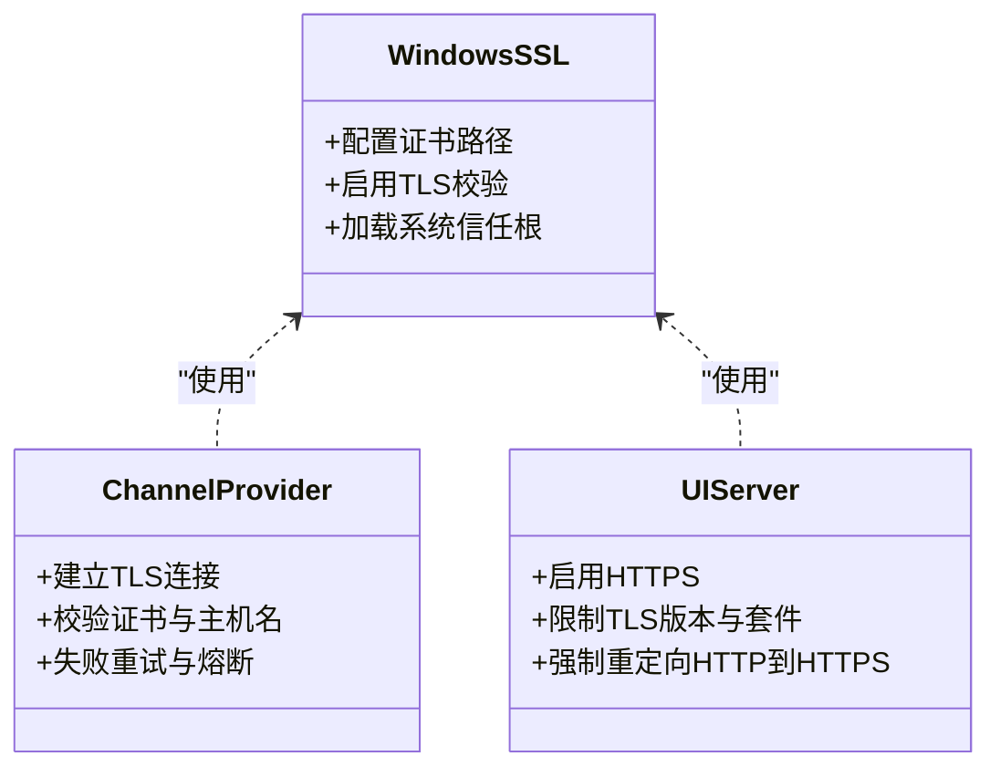
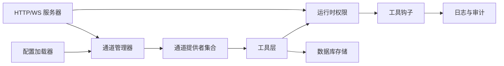

# 安全加固配置

<cite>
**本文引用的文件**   
- [README.md](file://README.md)
- [pyproject.toml](file://pyproject.toml)
- [config/system_config.yaml](file://config/system_config.yaml)
- [config/agent_config.yaml](file://config/agent_config.yaml)
- [config/channel_config.yaml](file://config/channel_config.yaml)
- [opc/core/config.py](file://opc/core/config.py)
- [opc/core/windows_ssl.py](file://opc/core/windows_ssl.py)
- [opc/channels/provider_base.py](file://opc/channels/provider_base.py)
- [opc/channels/manager.py](file://opc/channels/manager.py)
- [opc/channels/email.py](file://opc/channels/email.py)
- [opc/channels/discord.py](file://opc/channels/discord.py)
- [opc/channels/slack.py](file://opc/channels/slack.py)
- [opc/channels/telegram.py](file://opc/channels/telegram.py)
- [opc/channels/matrix.py](file://opc/channels/matrix.py)
- [opc/channels/dingtalk.py](file://opc/channels/dingtalk.py)
- [opc/channels/feishu.py](file://opc/channels/feishu.py)
- [opc/channels/qq.py](file://opc/channels/qq.py)
- [opc/channels/whatsapp.py](file://opc/channels/whatsapp.py)
- [opc/channels/session.py](file://opc/channels/session.py)
- [opc/database/store.py](file://opc/database/store.py)
- [opc/layer4_tools/shell.py](file://opc/layer4_tools/shell.py)
- [opc/layer4_tools/file_ops.py](file://opc/layer4_tools/file_ops.py)
- [opc/layer4_tools/git_ops.py](file://opc/layer4_tools/git_ops.py)
- [opc/layer4_tools/python_exec.py](file://opc/layer4_tools/python_exec.py)
- [opc/layer4_tools/browser.py](file://opc/layer4_tools/browser.py)
- [opc/layer4_tools/web_search.py](file://opc/layer4_tools/web_search.py)
- [opc/layer2_organization/shell_safety.py](file://opc/layer2_organization/shell_safety.py)
- [opc/layer3_agent/runtime_v2/permissions.py](file://opc/layer3_agent/runtime_v2/permissions.py)
- [opc/layer3_agent/runtime_v2/tool_hooks.py](file://opc/layer3_agent/runtime_v2/tool_hooks.py)
- [opc/layer5_memory/approval_allowlist.py](file://opc/layer5_memory/approval_allowlist.py)
- [opc/layer6_observability/opc_logger.py](file://opc/layer6_observability/opc_logger.py)
- [opc/plugins/office_ui/server.py](file://opc/plugins/office_ui/server.py)
- [opc/plugins/office_ui/ws_handler.py](file://opc/plugins/office_ui/ws_handler.py)
- [opc/cli/app.py](file://opc/cli/app.py)
</cite>

## 目录
1. [简介](#简介)
2. [项目结构](#项目结构)
3. [核心组件](#核心组件)
4. [架构总览](#架构总览)
5. [详细组件分析](#详细组件分析)
6. [依赖关系分析](#依赖关系分析)
7. [性能与安全权衡](#性能与安全权衡)
8. [故障排查指南](#故障排查指南)
9. [结论](#结论)
10. [附录](#附录)

## 简介
本指南面向生产环境的OpenOPC部署，聚焦于最小权限、身份与密钥管理、传输加密（HTTPS/TLS）、网络安全边界、日志审计与监控、数据加密存储与传输、常见漏洞防护以及渗透测试建议。文档将结合仓库中的实际实现位置，给出可操作的加固步骤与最佳实践，帮助读者在不改变业务逻辑的前提下提升系统整体安全性。

## 项目结构
OpenOPC采用分层架构：通道层负责外部系统集成；工具层提供执行能力；组织层提供策略与流程控制；内存层持久化状态；可观测性层记录运行指标与日志；UI插件提供Web界面与WebSocket通信。安全相关的关键点包括：
- 配置加载与敏感信息注入
- 通道凭据与证书处理
- 工具执行沙箱与权限控制
- Web服务与WebSocket的安全接入
- 数据库与文件系统的访问控制
- 日志与审计输出

图表来源
- [opc/cli/app.py](file://opc/cli/app.py)
- [opc/core/config.py](file://opc/core/config.py)
- [opc/channels/manager.py](file://opc/channels/manager.py)
- [opc/channels/provider_base.py](file://opc/channels/provider_base.py)
- [opc/channels/email.py](file://opc/channels/email.py)
- [opc/channels/discord.py](file://opc/channels/discord.py)
- [opc/channels/slack.py](file://opc/channels/slack.py)
- [opc/channels/telegram.py](file://opc/channels/telegram.py)
- [opc/channels/matrix.py](file://opc/channels/matrix.py)
- [opc/channels/dingtalk.py](file://opc/channels/dingtalk.py)
- [opc/channels/feishu.py](file://opc/channels/feishu.py)
- [opc/channels/qq.py](file://opc/channels/qq.py)
- [opc/channels/whatsapp.py](file://opc/channels/whatsapp.py)
- [opc/layer4_tools/shell.py](file://opc/layer4_tools/shell.py)
- [opc/layer4_tools/file_ops.py](file://opc/layer4_tools/file_ops.py)
- [opc/layer4_tools/git_ops.py](file://opc/layer4_tools/git_ops.py)
- [opc/layer4_tools/python_exec.py](file://opc/layer4_tools/python_exec.py)
- [opc/layer4_tools/browser.py](file://opc/layer4_tools/browser.py)
- [opc/layer4_tools/web_search.py](file://opc/layer4_tools/web_search.py)
- [opc/layer2_organization/shell_safety.py](file://opc/layer2_organization/shell_safety.py)
- [opc/layer3_agent/runtime_v2/permissions.py](file://opc/layer3_agent/runtime_v2/permissions.py)
- [opc/layer3_agent/runtime_v2/tool_hooks.py](file://opc/layer3_agent/runtime_v2/tool_hooks.py)
- [opc/plugins/office_ui/server.py](file://opc/plugins/office_ui/server.py)
- [opc/plugins/office_ui/ws_handler.py](file://opc/plugins/office_ui/ws_handler.py)
- [opc/database/store.py](file://opc/database/store.py)

章节来源
- [README.md](file://README.md)
- [pyproject.toml](file://pyproject.toml)

## 核心组件
本节聚焦生产环境安全加固的关键组件与落地要点。

- 配置与敏感信息管理
  - 通过配置加载器统一读取YAML配置与环境变量，避免硬编码敏感信息。
  - 对通道凭据（如API密钥、令牌）进行集中管理与最小暴露范围。
  - 在Windows平台使用专用SSL模块以支持系统证书链与TLS设置。

- 通道层安全
  - 各通道提供者继承自统一的提供者基类，便于集中校验输入、限制资源与注入安全上下文。
  - 对外部服务的连接应强制使用TLS，并校验证书有效性。

- 工具层安全
  - Shell、文件、Git、Python执行、浏览器与网络搜索等工具需遵循最小权限原则，限制命令白名单、路径白名单与网络访问范围。
  - 通过运行时权限与工具钩子实施细粒度授权与审计。

- UI插件安全
  - HTTP/WS服务器应启用HTTPS与强认证，限制跨域与请求大小，并对WebSocket消息进行鉴权与速率限制。

- 数据存储安全
  - 数据库连接使用TLS与强密码策略，必要时启用透明加密或字段级加密。
  - 文件系统访问受限于工作目录与只读挂载。

章节来源
- [opc/core/config.py](file://opc/core/config.py)
- [opc/core/windows_ssl.py](file://opc/core/windows_ssl.py)
- [opc/channels/provider_base.py](file://opc/channels/provider_base.py)
- [opc/channels/manager.py](file://opc/channels/manager.py)
- [opc/layer4_tools/shell.py](file://opc/layer4_tools/shell.py)
- [opc/layer4_tools/file_ops.py](file://opc/layer4_tools/file_ops.py)
- [opc/layer4_tools/git_ops.py](file://opc/layer4_tools/git_ops.py)
- [opc/layer4_tools/python_exec.py](file://opc/layer4_tools/python_exec.py)
- [opc/layer4_tools/browser.py](file://opc/layer4_tools/browser.py)
- [opc/layer4_tools/web_search.py](file://opc/layer4_tools/web_search.py)
- [opc/layer2_organization/shell_safety.py](file://opc/layer2_organization/shell_safety.py)
- [opc/layer3_agent/runtime_v2/permissions.py](file://opc/layer3_agent/runtime_v2/permissions.py)
- [opc/layer3_agent/runtime_v2/tool_hooks.py](file://opc/layer3_agent/runtime_v2/tool_hooks.py)
- [opc/plugins/office_ui/server.py](file://opc/plugins/office_ui/server.py)
- [opc/plugins/office_ui/ws_handler.py](file://opc/plugins/office_ui/ws_handler.py)
- [opc/database/store.py](file://opc/database/store.py)

## 架构总览
下图展示从用户到后端的核心调用链，标注了安全控制点（鉴权、TLS、权限、审计）。

图表来源
- [opc/plugins/office_ui/server.py](file://opc/plugins/office_ui/server.py)
- [opc/plugins/office_ui/ws_handler.py](file://opc/plugins/office_ui/ws_handler.py)
- [opc/channels/manager.py](file://opc/channels/manager.py)
- [opc/channels/provider_base.py](file://opc/channels/provider_base.py)
- [opc/layer3_agent/runtime_v2/permissions.py](file://opc/layer3_agent/runtime_v2/permissions.py)
- [opc/layer6_observability/opc_logger.py](file://opc/layer6_observability/opc_logger.py)
- [opc/database/store.py](file://opc/database/store.py)

## 详细组件分析

### 用户权限管理与最小权限原则
- 设计要点
  - 基于角色的访问控制（RBAC）与任务级权限绑定，确保每个会话仅拥有完成目标所需的最小能力。
  - 工具执行前进行权限检查，拒绝越权操作；对高危操作引入审批与白名单机制。
  - 通过工具钩子在关键路径插入审计与拦截逻辑。

- 落地建议
  - 为不同角色定义能力集（如“只读”、“编辑”、“管理员”），并在会话初始化时加载。
  - 对Shell、文件、Git、Python执行等工具增加命令与路径白名单。
  - 对敏感工具调用要求二次确认或审批。

图表来源
- [opc/layer3_agent/runtime_v2/permissions.py](file://opc/layer3_agent/runtime_v2/permissions.py)
- [opc/layer3_agent/runtime_v2/tool_hooks.py](file://opc/layer3_agent/runtime_v2/tool_hooks.py)
- [opc/layer2_organization/shell_safety.py](file://opc/layer2_organization/shell_safety.py)
- [opc/layer5_memory/approval_allowlist.py](file://opc/layer5_memory/approval_allowlist.py)

章节来源
- [opc/layer3_agent/runtime_v2/permissions.py](file://opc/layer3_agent/runtime_v2/permissions.py)
- [opc/layer3_agent/runtime_v2/tool_hooks.py](file://opc/layer3_agent/runtime_v2/tool_hooks.py)
- [opc/layer2_organization/shell_safety.py](file://opc/layer2_organization/shell_safety.py)
- [opc/layer5_memory/approval_allowlist.py](file://opc/layer5_memory/approval_allowlist.py)

### SSL/TLS证书配置与HTTPS访问
- 设计要点
  - 所有外部通道与服务调用必须启用TLS，并严格校验证书链与主机名。
  - Windows平台使用专用SSL模块以适配系统证书存储与策略。
  - UI插件的HTTP/WS服务应强制HTTPS，禁用弱协议与套件。

- 落地建议
  - 在配置中集中管理证书路径与信任根，避免明文写入代码。
  - 定期轮换证书并监控到期时间。
  - 对内部服务间通信启用双向TLS（mTLS）以提升安全性。

图表来源
- [opc/core/windows_ssl.py](file://opc/core/windows_ssl.py)
- [opc/channels/provider_base.py](file://opc/channels/provider_base.py)
- [opc/plugins/office_ui/server.py](file://opc/plugins/office_ui/server.py)

章节来源
- [opc/core/windows_ssl.py](file://opc/core/windows_ssl.py)
- [opc/channels/provider_base.py](file://opc/channels/provider_base.py)
- [opc/plugins/office_ui/server.py](file://opc/plugins/office_ui/server.py)

### API密钥管理与环境变量安全
- 设计要点
  - 所有通道凭据（如Discord、Slack、Telegram、Matrix、钉钉、飞书、QQ、WhatsApp、邮件）应从环境变量或受保护的密钥管理服务注入。
  - 禁止在配置文件或日志中打印敏感信息。

- 落地建议
  - 使用操作系统级密钥存储（如Windows DPAPI、Linux keyring）或云KMS。
  - 在配置加载阶段校验必填项并提供清晰的错误提示。
  - 对密钥进行短期轮换与访问审计。

章节来源
- [config/channel_config.yaml](file://config/channel_config.yaml)
- [config/agent_config.yaml](file://config/agent_config.yaml)
- [config/system_config.yaml](file://config/system_config.yaml)
- [opc/core/config.py](file://opc/core/config.py)
- [opc/channels/discord.py](file://opc/channels/discord.py)
- [opc/channels/slack.py](file://opc/channels/slack.py)
- [opc/channels/telegram.py](file://opc/channels/telegram.py)
- [opc/channels/matrix.py](file://opc/channels/matrix.py)
- [opc/channels/dingtalk.py](file://opc/channels/dingtalk.py)
- [opc/channels/feishu.py](file://opc/channels/feishu.py)
- [opc/channels/qq.py](file://opc/channels/qq.py)
- [opc/channels/whatsapp.py](file://opc/channels/whatsapp.py)
- [opc/channels/email.py](file://opc/channels/email.py)

### 防火墙规则与网络安全最佳实践
- 设计要点
  - 仅开放必要的入站端口（如HTTPS 443），其余端口默认拒绝。
  - 对内部服务间通信使用私有网段与VPC隔离。
  - 对出站访问进行白名单控制，限制DNS与外网API调用。

- 落地建议
  - 使用反向代理（如Nginx/Caddy）终止TLS并做WAF防护。
  - 对WebSocket升级路径进行鉴权与速率限制。
  - 对异常流量与高频访问进行告警与自动封禁。

[本节为通用网络安全建议，不直接分析具体文件]

### 日志审计与安全监控
- 设计要点
  - 对所有鉴权失败、权限拒绝、工具执行与敏感操作进行结构化审计日志。
  - 日志脱敏，避免泄露密钥、令牌与个人信息。
  - 将日志集中收集并开启完整性保护与不可篡改存储。

- 落地建议
  - 使用统一日志格式与分级（INFO/WARN/ERROR/FATAL）。
  - 对关键路径添加追踪ID以便关联分析。
  - 配置SIEM告警规则（如多次失败登录、越权尝试）。

章节来源
- [opc/layer6_observability/opc_logger.py](file://opc/layer6_observability/opc_logger.py)
- [opc/layer3_agent/runtime_v2/tool_hooks.py](file://opc/layer3_agent/runtime_v2/tool_hooks.py)

### 常见安全漏洞防护措施
- 注入与命令执行
  - 对Shell与Python执行进行白名单与参数校验，禁止任意拼接命令。
  - 使用沙箱或受限解释器执行用户脚本。

- 路径遍历与文件泄露
  - 对文件操作进行路径规范化与根目录限制，禁止访问系统敏感目录。
  - 对上传内容进行类型与大小限制，并进行病毒扫描。

- 网络攻击面
  - 对浏览器自动化与网络搜索进行域名白名单与超时限制。
  - 禁用不必要的协议与功能（如FTP、Gopher）。

- 认证与会话
  - 强制强密码策略与多因素认证。
  - 会话令牌短期有效并支持撤销。

章节来源
- [opc/layer4_tools/shell.py](file://opc/layer4_tools/shell.py)
- [opc/layer4_tools/python_exec.py](file://opc/layer4_tools/python_exec.py)
- [opc/layer4_tools/file_ops.py](file://opc/layer4_tools/file_ops.py)
- [opc/layer4_tools/browser.py](file://opc/layer4_tools/browser.py)
- [opc/layer4_tools/web_search.py](file://opc/layer4_tools/web_search.py)

### 渗透测试建议
- 覆盖范围
  - 认证绕过、权限提升、命令注入、路径遍历、SSRF、XSS、CSRF、反序列化、依赖漏洞。
- 方法
  - 黑盒与灰盒结合，使用自动化工具与人工验证。
  - 模拟内网横向移动与外联回连，检验网络隔离与出站控制。
- 报告
  - 按严重等级分类，提供复现步骤与修复建议，跟踪闭环。

[本节为通用渗透测试建议，不直接分析具体文件]

### 数据加密存储与传输安全
- 传输安全
  - 全链路TLS，禁用弱套件与旧版协议。
  - 对内部服务启用mTLS与证书轮换。

- 存储安全
  - 数据库启用透明加密或字段级加密，密钥由KMS管理。
  - 备份数据加密并限制访问。

- 密钥管理
  - 使用受保护的密钥存储，避免明文配置。
  - 定期轮换与审计访问。

章节来源
- [opc/database/store.py](file://opc/database/store.py)
- [opc/core/windows_ssl.py](file://opc/core/windows_ssl.py)
- [opc/core/config.py](file://opc/core/config.py)

## 依赖关系分析
下图展示安全相关组件之间的依赖关系，突出最小权限与审计贯穿各层。

图表来源
- [opc/core/config.py](file://opc/core/config.py)
- [opc/channels/manager.py](file://opc/channels/manager.py)
- [opc/channels/provider_base.py](file://opc/channels/provider_base.py)
- [opc/layer3_agent/runtime_v2/permissions.py](file://opc/layer3_agent/runtime_v2/permissions.py)
- [opc/layer3_agent/runtime_v2/tool_hooks.py](file://opc/layer3_agent/runtime_v2/tool_hooks.py)
- [opc/layer6_observability/opc_logger.py](file://opc/layer6_observability/opc_logger.py)
- [opc/database/store.py](file://opc/database/store.py)
- [opc/plugins/office_ui/server.py](file://opc/plugins/office_ui/server.py)

章节来源
- [opc/core/config.py](file://opc/core/config.py)
- [opc/channels/manager.py](file://opc/channels/manager.py)
- [opc/channels/provider_base.py](file://opc/channels/provider_base.py)
- [opc/layer3_agent/runtime_v2/permissions.py](file://opc/layer3_agent/runtime_v2/permissions.py)
- [opc/layer3_agent/runtime_v2/tool_hooks.py](file://opc/layer3_agent/runtime_v2/tool_hooks.py)
- [opc/layer6_observability/opc_logger.py](file://opc/layer6_observability/opc_logger.py)
- [opc/database/store.py](file://opc/database/store.py)
- [opc/plugins/office_ui/server.py](file://opc/plugins/office_ui/server.py)

## 性能与安全权衡
- TLS开销
  - 启用TLS会带来CPU与延迟开销，建议使用硬件加速与连接池复用。
- 权限检查
  - 细粒度权限会增加调用链长度，可通过缓存与批量校验优化。
- 日志量
  - 高并发下日志可能成为瓶颈，建议异步写入与采样策略。
- 沙箱执行
  - 沙箱会限制性能，建议按需启用与资源配额。

[本节为通用性能建议，不直接分析具体文件]

## 故障排查指南
- 常见问题
  - 证书校验失败：检查证书链、主机名匹配与系统时间。
  - 鉴权失败：核对令牌有效期与作用域。
  - 权限拒绝：查看权限策略与白名单配置。
  - 日志缺失：确认日志级别与输出路径权限。

- 定位步骤
  - 从UI服务器开始，逐步向下至通道与工具层。
  - 使用追踪ID关联请求链路。
  - 对比正常与异常场景的配置差异。

章节来源
- [opc/plugins/office_ui/server.py](file://opc/plugins/office_ui/server.py)
- [opc/plugins/office_ui/ws_handler.py](file://opc/plugins/office_ui/ws_handler.py)
- [opc/layer6_observability/opc_logger.py](file://opc/layer6_observability/opc_logger.py)

## 结论
通过在配置、通道、工具、UI与数据层全面落地最小权限、TLS与审计策略，OpenOPC可在生产环境中显著提升安全性与可观测性。建议持续进行依赖更新、漏洞扫描与渗透测试，形成闭环的安全运营体系。

## 附录
- 参考配置示例路径
  - 系统配置：[config/system_config.yaml](file://config/system_config.yaml)
  - 通道配置：[config/channel_config.yaml](file://config/channel_config.yaml)
  - Agent配置：[config/agent_config.yaml](file://config/agent_config.yaml)
- 入口与依赖
  - 项目说明：[README.md](file://README.md)
  - 构建与依赖：[pyproject.toml](file://pyproject.toml)