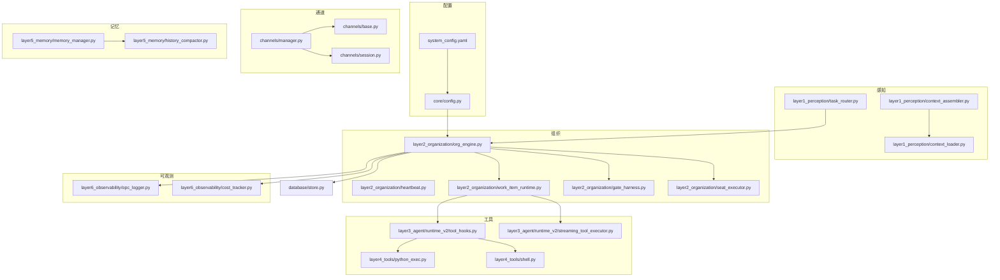
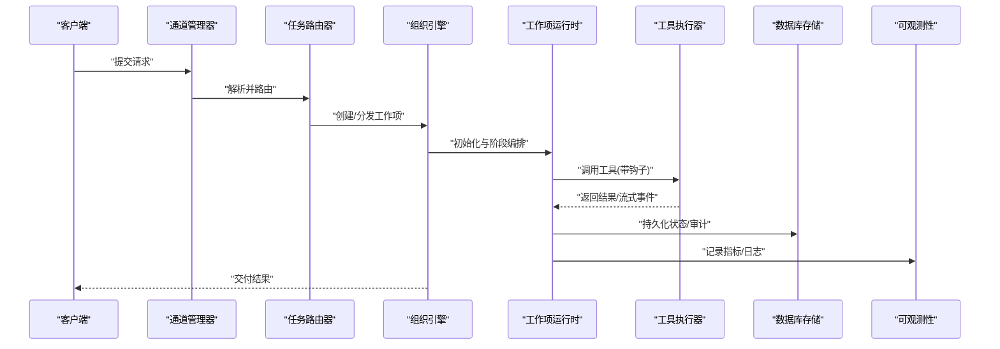
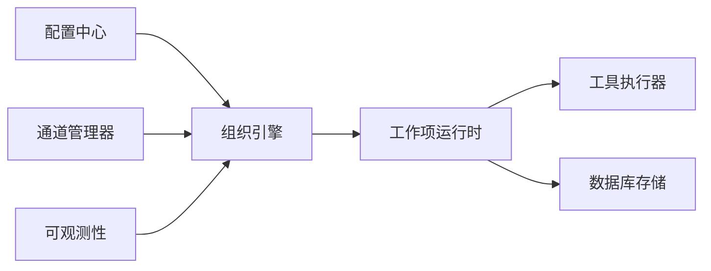

# 性能优化配置

<cite>
**本文引用的文件**   
- [config/system_config.yaml](file://config/system_config.yaml)
- [opc/core/config.py](file://opc/core/config.py)
- [opc/database/store.py](file://opc/database/store.py)
- [opc/layer2_organization/org_engine.py](file://opc/layer2_organization/org_engine.py)
- [opc/layer2_organization/heartbeat.py](file://opc/layer2_organization/heartbeat.py)
- [opc/layer6_observability/opc_logger.py](file://opc/layer6_observability/opc_logger.py)
- [opc/layer6_observability/cost_tracker.py](file://opc/layer6_observability/cost_tracker.py)
- [opc/channels/manager.py](file://opc/channels/manager.py)
- [opc/channels/base.py](file://opc/channels/base.py)
- [opc/channels/session.py](file://opc/channels/session.py)
- [opc/layer3_agent/runtime_v2/tool_hooks.py](file://opc/layer3_agent/runtime_v2/tool_hooks.py)
- [opc/layer3_agent/runtime_v2/streaming_tool_executor.py](file://opc/layer3_agent/runtime_v2/streaming_tool_executor.py)
- [opc/layer4_tools/python_exec.py](file://opc/layer4_tools/python_exec.py)
- [opc/layer4_tools/shell.py](file://opc/layer4_tools/shell.py)
- [opc/layer5_memory/memory_manager.py](file://opc/layer5_memory/memory_manager.py)
- [opc/layer5_memory/history_compactor.py](file://opc/layer5_memory/history_compactor.py)
- [opc/layer1_perception/context_assembler.py](file://opc/layer1_perception/context_assembler.py)
- [opc/layer1_perception/context_loader.py](file://opc/layer1_perception/context_loader.py)
- [opc/layer1_perception/task_router.py](file://opc/layer1_perception/task_router.py)
- [opc/layer2_organization/work_item_runtime.py](file://opc/layer2_organization/work_item_runtime.py)
- [opc/layer2_organization/gate_harness.py](file://opc/layer2_organization/gate_harness.py)
- [opc/layer2_organization/seat_executor.py](file://opc/layer2_organization/seat_executor.py)
- [opc/layer2_organization/reorg_manager.py](file://opc/layer2_organization/reorg_manager.py)
- [opc/layer2_organization/escalation.py](file://opc/layer2_organization/escalation.py)
- [opc/layer2_organization/collaboration_service.py](file://opc/layer2_organization/collaboration_service.py)
- [opc/layer2_organization/comms.py](file://opc/layer2_organization/comms.py)
- [opc/layer2_organization/company_runtime.py](file://opc/layer2_organization/company_runtime.py)
- [opc/layer2_organization/phase.py](file://opc/layer2_organization/phase.py)
- [opc/layer2_organization/work_item_transition.py](file://opc/layer2_organization/work_item_transition.py)
- [opc/layer2_organization/metadata_ownership.py](file://opc/layer2_organization/metadata_ownership.py)
- [opc/layer2_organization/secretary.py](file://opc/layer2_organization/secretary.py)
- [opc/layer2_organization/talent_market.py](file://opc/layer2_organization/talent_market.py)
- [opc/layer2_organization/goal_manager.py](file://opc/layer2_organization/goal_manager.py)
- [opc/layer2_organization/data_acquisition_policy.py](file://opc/layer2_organization/data_acquisition_policy.py)
- [opc/layer2_organization/collaboration_policy.py](file://opc/layer2_organization/collaboration_policy.py)
- [opc/layer2_organization/output_contract.py](file://o pc/layer2_organization/output_contract.py)
- [opc/layer2_organization/prompt_contract.py](file://opc/layer2_organization/prompt_contract.py)
- [opc/layer2_organization/work_item_context_view.py](file://opc/layer2_organization/work_item_context_view.py)
- [opc/layer2_organization/work_item_identity.py](file://opc/layer2_organization/work_item_identity.py)
- [opc/layer2_organization/work_item_links.py](file://opc/layer2_organization/work_item_links.py)
- [opc/layer2_organization/work_item_runtime_invariants.py](file://opc/layer2_organization/work_item_runtime_invariants.py)
- [opc/layer2_organization/session_scoping.py](file://opc/layer2_organization/session_scoping.py)
- [opc/layer2_organization/turn_mode.py](file://opc/layer2_organization/turn_mode.py)
- [opc/layer2_organization/custom_runtime.py](file://opc/layer2_organization/custom_runtime.py)
- [opc/layer2_organization/reactivation_sweeper.py](file://opc/layer2_organization/reactivation_sweeper.py)
- [opc/layer2_organization/phase_hooks.py](file://opc/layer2_organization/phase_hooks.py)
- [opc/layer2_organization/work_item_planner.py](file://opc/layer2_organization/work_item_planner.py)
- [opc/layer2_organization/approval.py](file://opc/layer2_organization/approval.py)
- [opc/layer2_organization/communication.py](file://opc/layer2_organization/communication.py)
- [opc/layer2_organization/company_runtime_profiles.py](file://opc/layer2_organization/company_runtime_profiles.py)
- [opc/layer2_organization/company_runtime_identity.py](file://opc/layer2_organization/company_runtime_identity.py)
- [opc/layer2_organization/org_work_item_planner.py](file://opc/layer2_organization/org_work_item_planner.py)
- [opc/layer2_organization/seat_executor.py](file://opc/layer2_organization/seat_executor.py)
- [opc/layer2_organization/escalation.py](file://opc/layer2_organization/escalation.py)
- [opc/layer2_organization/collaboration_service.py](file://opc/layer2_organization/collaboration_service.py)
- [opc/layer2_organization/comms.py](file://opc/layer2_organization/comms.py)
- [opc/layer2_organization/company_runtime.py](file://opc/layer2_organization/company_runtime.py)
- [opc/layer2_organization/phase.py](file://opc/layer2_organization/phase.py)
- [opc/layer2_organization/work_item_transition.py](file://opc/layer2_organization/work_item_transition.py)
- [opc/layer2_organization/metadata_ownership.py](file://opc/layer2_organization/metadata_ownership.py)
- [opc/layer2_organization/secretary.py](file://opc/layer2_organization/secretary.py)
- [opc/layer2_organization/talent_market.py](file://opc/layer2_organization/talent_market.py)
- [opc/layer2_organization/goal_manager.py](file://opc/layer2_organization/goal_manager.py)
- [opc/layer2_organization/data_acquisition_policy.py](file://opc/layer2_organization/data_acquisition_policy.py)
- [opc/layer2_organization/collaboration_policy.py](file://opc/layer2_organization/collaboration_policy.py)
- [opc/layer2_organization/output_contract.py](file://opc/layer2_organization/output_contract.py)
- [opc/layer2_organization/prompt_contract.py](file://opc/layer2_organization/prompt_contract.py)
- [opc/layer2_organization/work_item_context_view.py](file://opc/layer2_organization/work_item_context_view.py)
- [opc/layer2_organization/work_item_identity.py](file://opc/layer2_organization/work_item_identity.py)
- [layer2_organization/work_item_links.py](file://opc/layer2_organization/work_item_links.py)
- [opc/layer2_organization/work_item_runtime_invariants.py](file://opc/layer2_organization/work_item_runtime_invariants.py)
- [opc/layer2_organization/session_scoping.py](file://opc/layer2_organization/session_scoping.py)
- [opc/layer2_organization/turn_mode.py](file://opc/layer2_organization/turn_mode.py)
- [opc/layer2_organization/custom_runtime.py](file://opc/layer2_organization/custom_runtime.py)
- [opc/layer2_organization/reactivation_sweeper.py](file://opc/layer2_organization/reactivation_sweeper.py)
- [opc/layer2_organization/phase_hooks.py](file://opc/layer2_organization/phase_hooks.py)
- [opc/layer2_organization/work_item_planner.py](file://opc/layer2_organization/work_item_planner.py)
- [opc/layer2_organization/approval.py](file://opc/layer2_organization/approval.py)
- [opc/layer2_organization/communication.py](file://opc/layer2_organization/communication.py)
- [opc/layer2_organization/company_runtime_profiles.py](file://opc/layer2_organization/company_runtime_profiles.py)
- [opc/layer2_organization/company_runtime_identity.py](file://opc/layer2_organization/company_runtime_identity.py)
- [opc/layer2_organization/org_work_item_planner.py](file://opc/layer2_organization/org_work_item_planner.py)
</cite>

## 目录
1. [简介](#简介)
2. [项目结构](#项目结构)
3. [核心组件](#核心组件)
4. [架构总览](#架构总览)
5. [详细组件分析](#详细组件分析)
6. [依赖关系分析](#依赖关系分析)
7. [性能考量](#性能考量)
8. [故障排查指南](#故障排查指南)
9. [结论](#结论)
10. [附录](#附录)

## 简介
本指南面向生产环境的OpenOPC部署，聚焦数据库性能调优、索引策略、内存与缓存、并发与线程池、负载均衡与高可用、监控指标与基准测试、容量规划与扩展性设计，以及慢查询分析与瓶颈定位方法。文档基于仓库中的实际实现进行解读，并提供可操作的配置建议与最佳实践。

## 项目结构
OpenOPC采用分层架构：
- 配置层：集中式YAML配置与运行时配置加载
- 通道层：多渠道接入与会话管理
- 感知层：上下文组装与任务路由
- 组织层：工作项生命周期、阶段流转、编排与治理
- 工具层：外部执行器（Python/Shell等）
- 记忆层：历史压缩与偏好管理
- 可观测层：日志与成本追踪

图表来源
- [config/system_config.yaml](file://config/system_config.yaml)
- [opc/core/config.py](file://opc/core/config.py)
- [opc/channels/manager.py](file://opc/channels/manager.py)
- [opc/channels/base.py](file://opc/channels/base.py)
- [opc/channels/session.py](file://opc/channels/session.py)
- [opc/layer1_perception/context_assembler.py](file://opc/layer1_perception/context_assembler.py)
- [opc/layer1_perception/context_loader.py](file://opc/layer1_perception/context_loader.py)
- [opc/layer1_perception/task_router.py](file://opc/layer1_perception/task_router.py)
- [opc/layer2_organization/org_engine.py](file://opc/layer2_organization/org_engine.py)
- [opc/layer2_organization/heartbeat.py](file://opc/layer2_organization/heartbeat.py)
- [opc/layer2_organization/work_item_runtime.py](file://opc/layer2_organization/work_item_runtime.py)
- [opc/layer2_organization/gate_harness.py](file://opc/layer2_organization/gate_harness.py)
- [opc/layer2_organization/seat_executor.py](file://opc/layer2_organization/seat_executor.py)
- [opc/layer3_agent/runtime_v2/tool_hooks.py](file://opc/layer3_agent/runtime_v2/tool_hooks.py)
- [opc/layer3_agent/runtime_v2/streaming_tool_executor.py](file://opc/layer3_agent/runtime_v2/streaming_tool_executor.py)
- [opc/layer4_tools/python_exec.py](file://opc/layer4_tools/python_exec.py)
- [opc/layer4_tools/shell.py](file://opc/layer4_tools/shell.py)
- [opc/layer5_memory/memory_manager.py](file://opc/layer5_memory/memory_manager.py)
- [opc/layer5_memory/history_compactor.py](file://opc/layer5_memory/history_compactor.py)
- [opc/layer6_observability/opc_logger.py](file://opc/layer6_observability/opc_logger.py)
- [opc/layer6_observability/cost_tracker.py](file://opc/layer6_observability/cost_tracker.py)
- [opc/database/store.py](file://opc/database/store.py)

章节来源
- [config/system_config.yaml](file://config/system_config.yaml)
- [opc/core/config.py](file://opc/core/config.py)
- [opc/database/store.py](file://opc/database/store.py)
- [opc/layer2_organization/org_engine.py](file://opc/layer2_organization/org_engine.py)
- [opc/layer2_organization/heartbeat.py](file://opc/layer2_organization/heartbeat.py)
- [opc/layer6_observability/opc_logger.py](file://opc/layer6_observability/opc_logger.py)
- [opc/layer6_observability/cost_tracker.py](file://opc/layer6_observability/cost_tracker.py)
- [opc/channels/manager.py](file://opc/channels/manager.py)
- [opc/channels/base.py](file://opc/channels/base.py)
- [opc/channels/session.py](file://opc/channels/session.py)
- [opc/layer3_agent/runtime_v2/tool_hooks.py](file://opc/layer3_agent/runtime_v2/tool_hooks.py)
- [opc/layer3_agent/runtime_v2/streaming_tool_executor.py](file://opc/layer3_agent/runtime_v2/streaming_tool_executor.py)
- [opc/layer4_tools/python_exec.py](file://opc/layer4_tools/python_exec.py)
- [opc/layer4_tools/shell.py](file://opc/layer4_tools/shell.py)
- [opc/layer5_memory/memory_manager.py](file://opc/layer5_memory/memory_manager.py)
- [opc/layer5_memory/history_compactor.py](file://opc/layer5_memory/history_compactor.py)
- [opc/layer1_perception/context_assembler.py](file://opc/layer1_perception/context_assembler.py)
- [opc/layer1_perception/context_loader.py](file://opc/layer1_perception/context_loader.py)
- [opc/layer1_perception/task_router.py](file://opc/layer1_perception/task_router.py)
- [opc/layer2_organization/work_item_runtime.py](file://opc/layer2_organization/work_item_runtime.py)
- [opc/layer2_organization/gate_harness.py](file://opc/layer2_organization/gate_harness.py)
- [opc/layer2_organization/seat_executor.py](file://opc/layer2_organization/seat_executor.py)

## 核心组件
- 配置中心：系统级参数通过YAML集中管理，并在应用启动时加载为运行时配置对象，供各层使用。
- 数据库存储：提供统一的持久化接口，承载工作项、会话、审计等数据。
- 组织引擎与工作项运行时：负责任务编排、阶段转换、资源调度与状态一致性。
- 通道管理器与会话：统一接入多通道消息，维护会话上下文与限流。
- 工具执行器与钩子：对Python/Shell等外部执行进行安全隔离与超时控制。
- 记忆与历史压缩：控制上下文大小与历史保留策略，降低内存占用。
- 可观测性：结构化日志与成本追踪，支撑性能分析与容量规划。

章节来源
- [config/system_config.yaml](file://config/system_config.yaml)
- [opc/core/config.py](file://opc/core/config.py)
- [opc/database/store.py](file://opc/database/store.py)
- [opc/layer2_organization/org_engine.py](file://opc/layer2_organization/org_engine.py)
- [opc/layer2_organization/work_item_runtime.py](file://opc/layer2_organization/work_item_runtime.py)
- [opc/channels/manager.py](file://opc/channels/manager.py)
- [opc/channels/session.py](file://opc/channels/session.py)
- [opc/layer3_agent/runtime_v2/tool_hooks.py](file://opc/layer3_agent/runtime_v2/tool_hooks.py)
- [opc/layer3_agent/runtime_v2/streaming_tool_executor.py](file://opc/layer3_agent/runtime_v2/streaming_tool_executor.py)
- [opc/layer4_tools/python_exec.py](file://opc/layer4_tools/python_exec.py)
- [opc/layer4_tools/shell.py](file://opc/layer4_tools/shell.py)
- [opc/layer5_memory/memory_manager.py](file://opc/layer5_memory/memory_manager.py)
- [opc/layer5_memory/history_compactor.py](file://opc/layer5_memory/history_compactor.py)
- [opc/layer6_observability/opc_logger.py](file://opc/layer6_observability/opc_logger.py)
- [opc/layer6_observability/cost_tracker.py](file://opc/layer6_observability/cost_tracker.py)

## 架构总览
下图展示从入口到数据库的关键路径，包括配置加载、任务路由、工作项运行、工具执行与可观测性埋点。

图表来源
- [opc/channels/manager.py](file://opc/channels/manager.py)
- [opc/layer1_perception/task_router.py](file://opc/layer1_perception/task_router.py)
- [opc/layer2_organization/org_engine.py](file://opc/layer2_organization/org_engine.py)
- [opc/layer2_organization/work_item_runtime.py](file://opc/layer2_organization/work_item_runtime.py)
- [opc/layer3_agent/runtime_v2/tool_hooks.py](file://opc/layer3_agent/runtime_v2/tool_hooks.py)
- [opc/layer3_agent/runtime_v2/streaming_tool_executor.py](file://opc/layer3_agent/runtime_v2/streaming_tool_executor.py)
- [opc/database/store.py](file://opc/database/store.py)
- [opc/layer6_observability/opc_logger.py](file://opc/layer6_observability/opc_logger.py)

## 详细组件分析

### 配置与系统参数
- 关键要点
  - 将数据库连接池、I/O并发、超时、重试、限流等参数集中在YAML中管理，便于环境差异化与灰度发布。
  - 在应用启动时加载配置，注入到组织引擎、通道管理器、工具执行器等模块。
- 建议
  - 按环境拆分配置（开发/预发/生产），避免硬编码。
  - 引入配置校验与默认值回退，防止异常配置导致服务不可用。
  - 对敏感参数（如数据库密码）使用环境变量或密钥管理服务。

章节来源
- [config/system_config.yaml](file://config/system_config.yaml)
- [opc/core/config.py](file://opc/core/config.py)

### 数据库性能调优与索引策略
- 连接池与事务
  - 合理设置最大连接数、最小空闲连接、连接超时与获取超时，避免连接风暴。
  - 对写热点路径开启短事务与批量写入，减少锁竞争。
- 读写分离与分片
  - 读多写少场景启用只读副本；热点表考虑水平分片或分区。
- 索引优化
  - 针对高频查询条件建立复合索引，遵循最左前缀原则。
  - 定期分析慢查询，评估覆盖索引与索引选择性。
- 缓冲与页大小
  - 根据工作负载调整缓冲池大小与页大小，平衡内存与I/O。
- 备份与恢复
  - 制定增量与全量备份策略，演练恢复流程。

章节来源
- [opc/database/store.py](file://opc/database/store.py)

### 内存使用优化与缓存配置
- 上下文与历史压缩
  - 限制会话上下文长度，采用滑动窗口与摘要压缩策略，降低峰值内存。
  - 对长对话启用历史压缩，定期清理过期条目。
- 缓存策略
  - 对热数据（如元数据、权限、配置）使用本地或分布式缓存，设置TTL与失效策略。
  - 缓存穿透防护：空值缓存与布隆过滤器。
- 对象复用与零拷贝
  - 重用大型对象（如序列化缓冲区），减少GC压力。

章节来源
- [opc/layer5_memory/memory_manager.py](file://opc/layer5_memory/memory_manager.py)
- [opc/layer5_memory/history_compactor.py](file://opc/layer5_memory/history_compactor.py)
- [opc/layer1_perception/context_assembler.py](file://opc/layer1_perception/context_assembler.py)
- [opc/layer1_perception/context_loader.py](file://opc/layer1_perception/context_loader.py)

### 并发处理与线程池调优
- 通道并发
  - 为每个通道实例配置独立的事件循环与队列，避免跨通道干扰。
  - 设置合理的消费者数量与队列深度，结合背压机制。
- 工具执行
  - 对CPU密集型任务使用进程池，I/O密集型使用线程池；为不同工具类型分配专用池。
  - 严格设置超时与熔断，防止雪崩。
- 工作项并行度
  - 依据工作项粒度与依赖图，动态调整并行度，避免过度并发导致锁争用。

章节来源
- [opc/channels/manager.py](file://opc/channels/manager.py)
- [opc/channels/base.py](file://opc/channels/base.py)
- [opc/channels/session.py](file://opc/channels/session.py)
- [opc/layer3_agent/runtime_v2/tool_hooks.py](file://opc/layer3_agent/runtime_v2/tool_hooks.py)
- [opc/layer3_agent/runtime_v2/streaming_tool_executor.py](file://opc/layer3_agent/runtime_v2/streaming_tool_executor.py)
- [opc/layer4_tools/python_exec.py](file://opc/layer4_tools/python_exec.py)
- [opc/layer4_tools/shell.py](file://opc/layer4_tools/shell.py)
- [opc/layer2_organization/work_item_runtime.py](file://opc/layer2_organization/work_item_runtime.py)

### 负载均衡与高可用
- 无状态服务化
  - 将组织引擎与通道服务无状态化，置于容器编排平台，配合健康检查与滚动升级。
- 会话亲和与粘性
  - 若必须保持会话亲和，使用会话绑定与快速失败转移；优先去亲和以提升弹性。
- 多活与故障转移
  - 数据库主从+自动切换；消息总线多副本；缓存集群模式。
- 限流与降级
  - 入口限流、分级降级、舱壁隔离，保护核心链路。

章节来源
- [opc/layer2_organization/org_engine.py](file://opc/layer2_organization/org_engine.py)
- [opc/layer2_organization/heartbeat.py](file://opc/layer2_organization/heartbeat.py)
- [opc/channels/manager.py](file://opc/channels/manager.py)

### 监控指标与基准测试
- 指标体系
  - 业务：QPS、延迟分布、错误率、吞吐、积压队列长度。
  - 系统：CPU、内存、磁盘IO、网络IO、连接池使用率、锁等待。
  - 应用：工作项阶段耗时、工具调用耗时、上下文大小、历史压缩比。
- 采集与可视化
  - 结构化日志与指标导出，对接时序数据库与看板。
- 基准测试
  - 构建典型工作负载（短/长任务、冷热数据混合），模拟峰值流量，观察SLO达成情况。
  - 持续集成中加入性能回归检测。

章节来源
- [opc/layer6_observability/opc_logger.py](file://opc/layer6_observability/opc_logger.py)
- [opc/layer6_observability/cost_tracker.py](file://opc/layer6_observability/cost_tracker.py)

### 容量规划与扩展性设计
- 容量模型
  - 以“单实例吞吐 × 实例数”为基础，叠加头部冗余与安全系数。
  - 按数据增长预测存储与备份成本。
- 水平扩展
  - 无状态服务横向扩容；有状态组件（DB/缓存）采用分片与复制。
- 弹性伸缩
  - 基于CPU/队列深度/延迟的HPA策略，平滑扩缩容。
- 成本优化
  - 冷热分层存储、按需实例、预留实例与竞价实例组合。

章节来源
- [opc/database/store.py](file://opc/database/store.py)
- [opc/layer2_organization/org_engine.py](file://opc/layer2_organization/org_engine.py)

### 慢查询分析与性能瓶颈定位
- 慢查询捕获
  - 开启数据库慢查询日志，设定阈值，收集SQL与执行计划。
- 执行计划分析
  - 关注全表扫描、临时表、文件排序、锁等待与行锁冲突。
- 热点定位
  - 结合链路追踪与指标，识别热点表、热点键与热点接口。
- 优化闭环
  - 索引优化、SQL改写、批量化、缓存命中提升、异步化改造。

章节来源
- [opc/database/store.py](file://opc/database/store.py)
- [opc/layer6_observability/opc_logger.py](file://opc/layer6_observability/opc_logger.py)

## 依赖关系分析
- 组件耦合
  - 配置中心被广泛依赖，需保证高内聚与低耦合。
  - 组织引擎与工作项运行时强相关，注意边界清晰与接口稳定。
- 外部依赖
  - 数据库、消息总线、缓存、外部工具执行环境。
- 潜在环依赖
  - 通过事件与接口解耦，避免直接循环引用。

图表来源
- [opc/core/config.py](file://opc/core/config.py)
- [opc/layer2_organization/org_engine.py](file://opc/layer2_organization/org_engine.py)
- [opc/layer2_organization/work_item_runtime.py](file://opc/layer2_organization/work_item_runtime.py)
- [opc/layer3_agent/runtime_v2/tool_hooks.py](file://opc/layer3_agent/runtime_v2/tool_hooks.py)
- [opc/database/store.py](file://opc/database/store.py)
- [opc/channels/manager.py](file://opc/channels/manager.py)
- [opc/layer6_observability/opc_logger.py](file://opc/layer6_observability/opc_logger.py)

章节来源
- [opc/core/config.py](file://opc/core/config.py)
- [opc/layer2_organization/org_engine.py](file://opc/layer2_organization/org_engine.py)
- [opc/layer2_organization/work_item_runtime.py](file://opc/layer2_organization/work_item_runtime.py)
- [opc/layer3_agent/runtime_v2/tool_hooks.py](file://opc/layer3_agent/runtime_v2/tool_hooks.py)
- [opc/database/store.py](file://opc/database/store.py)
- [opc/channels/manager.py](file://opc/channels/manager.py)
- [opc/layer6_observability/opc_logger.py](file://opc/layer6_observability/opc_logger.py)

## 性能考量
- 端到端延迟优化
  - 减少串行步骤，合并小事务，利用流式输出与增量更新。
- 资源隔离
  - 将CPU密集与I/O密集任务隔离在不同池，避免相互影响。
- 背压与限流
  - 在通道入口与工具调用处实施限流与退避，保障稳定性。
- 幂等与重试
  - 对外部调用增加幂等键与指数退避重试，避免重复计算。

[本节为通用指导，不直接分析具体文件]

## 故障排查指南
- 常见问题
  - 连接池耗尽：检查最大连接数与泄漏，缩短事务时间。
  - 内存溢出：审查上下文大小与历史压缩策略，调整缓存TTL。
  - 工具执行超时：完善超时与熔断，增加重试上限与告警。
  - 锁等待与死锁：分析热点键与事务顺序，必要时拆分事务。
- 诊断手段
  - 打开详细日志与指标，结合链路追踪定位瓶颈。
  - 使用数据库EXPLAIN分析慢查询，验证索引有效性。
  - 压测复现问题，逐步缩小范围。

章节来源
- [opc/layer6_observability/opc_logger.py](file://opc/layer6_observability/opc_logger.py)
- [opc/database/store.py](file://opc/database/store.py)
- [opc/layer3_agent/runtime_v2/tool_hooks.py](file://opc/layer3_agent/runtime_v2/tool_hooks.py)

## 结论
通过集中式配置、严格的并发与资源隔离、完善的可观测性与容量规划，OpenOPC可在生产环境中获得稳定且高性能的运行表现。建议在上线前完成基准测试与压测，建立常态化性能回归与容量预警机制。

[本节为总结，不直接分析具体文件]

## 附录
- 常用配置项清单（示例字段名，具体取值依环境而定）
  - 数据库：连接池大小、超时、只读副本地址、慢查询阈值
  - 通道：消费者数量、队列深度、限流阈值
  - 工具：线程/进程池大小、超时、重试次数
  - 记忆：上下文长度、历史压缩阈值、TTL
  - 可观测：采样率、指标导出间隔
- 压测场景建议
  - 短任务高并发、长任务低并发、冷热数据混合、突发流量尖峰

[本节为补充信息，不直接分析具体文件]