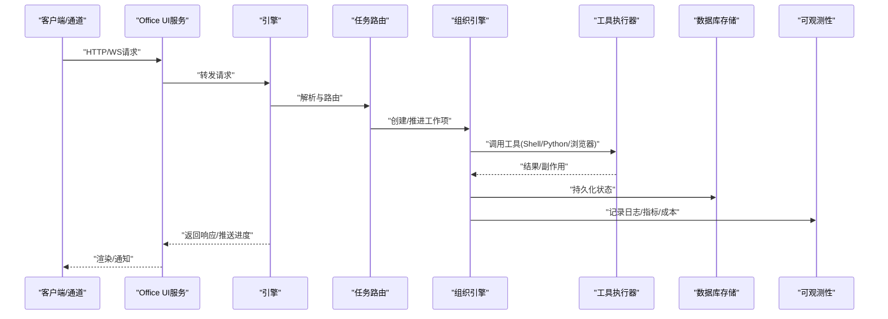

# 生产环境部署

<cite>
**本文引用的文件**   
- [README.md](file://README.md)
- [README.zh-CN.md](file://README.zh-CN.md)
- [pyproject.toml](file://pyproject.toml)
- [config/system_config.yaml](file://config/system_config.yaml)
- [config/agent_config.yaml](file://config/agent_config.yaml)
- [config/channel_config.yaml](file://config/channel_config.yaml)
- [config/company_corporate_config.yaml](file://config/company_corporate_config.yaml)
- [config/llm_config.yaml](file://config/llm_config.yaml)
- [opc/core/config.py](file://opc/core/config.py)
- [opc/database/store.py](file://opc/database/store.py)
- [opc/core/windows_ssl.py](file://opc/core/windows_ssl.py)
- [opc/cli/app.py](file://opc/cli/app.py)
- [opc/engine.py](file://opc/engine.py)
- [opc/presentation/kanban.py](file://opc/presentation/kanban.py)
- [opc/plugins/office_ui/server.py](file://opc/plugins/office_ui/server.py)
- [opc/plugins/office_ui/ws_handler.py](file://opc/plugins/office_ui/ws_handler.py)
- [opc/plugins/office_ui/services/factory.py](file://opc/plugins/office_ui/services/factory.py)
- [opc/plugins/office_ui/services/runtime.py](file://opc/plugins/office_ui/services/runtime.py)
- [opc/plugins/office_ui/services/comms.py](file://opc/plugins/office_ui/services/comms.py)
- [opc/channels/manager.py](file://opc/channels/manager.py)
- [opc/channels/base.py](file://opc/channels/base.py)
- [opc/channels/provider_registry.py](file://opc/channels/provider_registry.py)
- [opc/channels/email.py](file://opc/channels/email.py)
- [opc/channels/dingtalk.py](file://opc/channels/dingtalk.py)
- [opc/channels/discord.py](file://opc/channels/discord.py)
- [opc/channels/slack.py](file://opc/channels/slack.py)
- [opc/channels/telegram.py](file://opc/channels/telegram.py)
- [opc/channels/whatsapp.py](file://opc/channels/whatsapp.py)
- [opc/channels/matrix.py](file://opc/channels/matrix.py)
- [opc/channels/mochat.py](file://opc/channels/mochat.py)
- [opc/channels/session.py](file://opc/channels/session.py)
- [opc/layer0_interaction/message_bus.py](file://opc/layer0_interaction/message_bus.py)
- [opc/layer1_perception/context_assembler.py](file://opc/layer1_perception/context_assembler.py)
- [opc/layer1_perception/task_router.py](file://opc/layer1_perception/task_router.py)
- [opc/layer2_organization/org_engine.py](file://opc/layer2_organization/org_engine.py)
- [opc/layer2_organization/gate_harness.py](file://opc/layer2_organization/gate_harness.py)
- [opc/layer2_organization/heartbeat.py](file://opc/layer2_organization/heartbeat.py)
- [opc/layer3_agent/native_agent.py](file://opc/layer3_agent/native_agent.py)
- [opc/layer3_agent/external_broker.py](file://opc/layer3_agent/external_broker.py)
- [opc/layer4_tools/shell.py](file://opc/layer4_tools/shell.py)
- [opc/layer4_tools/python_exec.py](file://opc/layer4_tools/python_exec.py)
- [opc/layer4_tools/browser.py](file://opc/layer4_tools/browser.py)
- [opc/layer5_memory/markdown_memory.py](file://opc/layer5_memory/markdown_memory.py)
- [opc/layer6_observability/opc_logger.py](file://opc/layer6_observability/opc_logger.py)
- [opc/layer6_observability/cost_tracker.py](file://opc/layer6_observability/cost_tracker.py)
- [scripts/reset_stuck_task.py](file://scripts/reset_stuck_task.py)
</cite>

## 目录
1. [简介](#简介)
2. [项目结构](#项目结构)
3. [核心组件](#核心组件)
4. [架构总览](#架构总览)
5. [详细组件分析](#详细组件分析)
6. [依赖分析](#依赖分析)
7. [性能考虑](#性能考虑)
8. [故障排查指南](#故障排查指南)
9. [结论](#结论)
10. [附录](#附录)

## 简介
本文件面向生产环境，提供OpenOPC的完整部署与运维指南。内容涵盖：
- 服务器硬件要求与操作系统兼容性
- 系统初始化脚本与配置管理方案
- 安全加固（防火墙、SSL证书、用户权限）
- 数据库配置与优化参数调优
- 日志轮转、错误监控与资源监控
- 性能基准测试方法与容量规划建议
- 负载均衡与高可用实施方案
- 数据备份策略与灾难恢复流程

目标是在保障稳定性与安全性的前提下，实现可观测、可扩展、可恢复的生产级运行。

## 项目结构
仓库采用分层架构与插件化设计，核心模块包括：
- 配置中心：集中式YAML配置与运行时加载
- 通道层：多渠道接入（IM、邮件等）
- 引擎与组织编排：任务路由、阶段控制、审批与协作
- 工具层：Shell、Python执行、浏览器自动化等
- 记忆层：Markdown持久化与历史压缩
- 可观测性：结构化日志与成本追踪
- Office UI插件：Web界面与服务端处理

```mermaid
graph TB
subgraph "配置"
SYS["system_config.yaml"]
AG["agent_config.yaml"]
CH["channel_config.yaml"]
LLM["llm_config.yaml"]
CO["company_corporate_config.yaml"]
end
subgraph "入口与进程"
CLI["CLI应用<br/>opc/cli/app.py"]
ENG["引擎<br/>opc/engine.py"]
KAN["看板展示<br/>opc/presentation/kanban.py"]
OUI["Office UI服务<br/>opc/plugins/office_ui/server.py"]
end
subgraph "通道层"
CMGR["通道管理器<br/>opc/channels/manager.py"]
BASE["通道基类<br/>opc/channels/base.py"]
REG["提供者注册表<br/>opc/channels/provider_registry.py"]
EML["email.py"]
DT["dingtalk.py"]
DC["discord.py"]
SL["slack.py"]
TG["telegram.py"]
WA["whatsapp.py"]
MX["matrix.py"]
MC["mochat.py"]
SES["session.py"]
end
subgraph "核心逻辑"
MB["消息总线<br/>opc/layer0_interaction/message_bus.py"]
CA["上下文组装<br/>opc/layer1_perception/context_assembler.py"]
TR["任务路由<br/>opc/layer1_perception/task_router.py"]
OE["组织引擎<br/>opc/layer2_organization/org_engine.py"]
GH["门禁/护栏<br/>opc/layer2_organization/gate_harness.py"]
HB["心跳<br/>opc/layer2_organization/heartbeat.py"]
end
subgraph "Agent与外部代理"
NA["原生Agent<br/>opc/layer3_agent/native_agent.py"]
EB["外部代理Broker<br/>opc/layer3_agent/external_broker.py"]
end
subgraph "工具层"
SH["shell.py"]
PY["python_exec.py"]
BR["browser.py"]
end
subgraph "记忆与可观测性"
MM["markdown_memory.py"]
LOG["opc_logger.py"]
COST["cost_tracker.py"]
end
subgraph "存储"
DB["数据库存储<br/>opc/database/store.py"]
end
SYS --> ENG
AG --> ENG
CH --> CMGR
LLM --> ENG
CO --> ENG
CLI --> ENG
KAN --> ENG
OUI --> ENG
CMGR --> BASE
CMGR --> REG
CMGR --> EML
CMGR --> DT
CMGR --> DC
CMGR --> SL
CMGR --> TG
CMGR --> WA
CMGR --> MX
CMGR --> MC
CMGR --> SES
ENG --> MB
ENG --> CA
ENG --> TR
ENG --> OE
ENG --> GH
ENG --> HB
OE --> NA
OE --> EB
NA --> SH
NA --> PY
NA --> BR
OE --> DB
MM --> DB
LOG --> DB
COST --> DB
```

图表来源
- [config/system_config.yaml](file://config/system_config.yaml)
- [config/agent_config.yaml](file://config/agent_config.yaml)
- [config/channel_config.yaml](file://config/channel_config.yaml)
- [config/llm_config.yaml](file://config/llm_config.yaml)
- [config/company_corporate_config.yaml](file://config/company_corporate_config.yaml)
- [opc/cli/app.py](file://opc/cli/app.py)
- [opc/engine.py](file://opc/engine.py)
- [opc/presentation/kanban.py](file://opc/presentation/kanban.py)
- [opc/plugins/office_ui/server.py](file://opc/plugins/office_ui/server.py)
- [opc/channels/manager.py](file://opc/channels/manager.py)
- [opc/channels/base.py](file://opc/channels/base.py)
- [opc/channels/provider_registry.py](file://opc/channels/provider_registry.py)
- [opc/channels/email.py](file://opc/channels/email.py)
- [opc/channels/dingtalk.py](file://opc/channels/dingtalk.py)
- [opc/channels/discord.py](file://opc/channels/discord.py)
- [opc/channels/slack.py](file://opc/channels/slack.py)
- [opc/channels/telegram.py](file://opc/channels/telegram.py)
- [opc/channels/whatsapp.py](file://opc/channels/whatsapp.py)
- [opc/channels/matrix.py](file://opc/channels/matrix.py)
- [opc/channels/mochat.py](file://opc/channels/mochat.py)
- [opc/channels/session.py](file://opc/channels/session.py)
- [opc/layer0_interaction/message_bus.py](file://opc/layer0_interaction/message_bus.py)
- [opc/layer1_perception/context_assembler.py](file://opc/layer1_perception/context_assembler.py)
- [opc/layer1_perception/task_router.py](file://opc/layer1_perception/task_router.py)
- [opc/layer2_organization/org_engine.py](file://opc/layer2_organization/org_engine.py)
- [opc/layer2_organization/gate_harness.py](file://opc/layer2_organization/gate_harness.py)
- [opc/layer2_organization/heartbeat.py](file://opc/layer2_organization/heartbeat.py)
- [opc/layer3_agent/native_agent.py](file://opc/layer3_agent/native_agent.py)
- [opc/layer3_agent/external_broker.py](file://opc/layer3_agent/external_broker.py)
- [opc/layer4_tools/shell.py](file://opc/layer4_tools/shell.py)
- [opc/layer4_tools/python_exec.py](file://opc/layer4_tools/python_exec.py)
- [opc/layer4_tools/browser.py](file://opc/layer4_tools/browser.py)
- [opc/layer5_memory/markdown_memory.py](file://opc/layer5_memory/markdown_memory.py)
- [opc/layer6_observability/opc_logger.py](file://opc/layer6_observability/opc_logger.py)
- [opc/layer6_observability/cost_tracker.py](file://opc/layer6_observability/cost_tracker.py)
- [opc/database/store.py](file://opc/database/store.py)

章节来源
- [README.md](file://README.md)
- [README.zh-CN.md](file://README.zh-CN.md)
- [pyproject.toml](file://pyproject.toml)

## 核心组件
- 配置加载器：统一读取YAML配置并注入到运行时，支持多环境覆盖与校验。
- 通道管理器：负责多渠道接入的生命周期管理、会话隔离与事件分发。
- 引擎与组织编排：任务路由、阶段推进、审批流、协作策略与门禁检查。
- 工具执行器：Shell、Python执行、浏览器自动化等受控能力。
- 记忆与持久化：Markdown记忆与数据库存储，支持历史压缩与一致性。
- 可观测性：结构化日志、成本追踪与健康心跳。

章节来源
- [opc/core/config.py](file://opc/core/config.py)
- [opc/channels/manager.py](file://opc/channels/manager.py)
- [opc/channels/base.py](file://opc/channels/base.py)
- [opc/channels/provider_registry.py](file://opc/channels/provider_registry.py)
- [opc/layer1_perception/task_router.py](file://opc/layer1_perception/task_router.py)
- [opc/layer2_organization/org_engine.py](file://opc/layer2_organization/org_engine.py)
- [opc/layer2_organization/gate_harness.py](file://opc/layer2_organization/gate_harness.py)
- [opc/layer4_tools/shell.py](file://opc/layer4_tools/shell.py)
- [opc/layer4_tools/python_exec.py](file://opc/layer4_tools/python_exec.py)
- [opc/layer4_tools/browser.py](file://opc/layer4_tools/browser.py)
- [opc/layer5_memory/markdown_memory.py](file://opc/layer5_memory/markdown_memory.py)
- [opc/layer6_observability/opc_logger.py](file://opc/layer6_observability/opc_logger.py)
- [opc/layer6_observability/cost_tracker.py](file://opc/layer6_observability/cost_tracker.py)
- [opc/database/store.py](file://opc/database/store.py)

## 架构总览
OpenOPC在生产环境中通常以“单进程+多通道”或“多进程+反向代理”的方式部署。关键交互如下：
- 客户端通过Office UI或各通道接入
- 请求进入引擎后由任务路由与上下文组装决定执行路径
- 组织引擎驱动阶段流转、审批与协作
- 工具层在受限环境中执行具体动作
- 记忆与可观测性贯穿全链路，状态落盘至数据库

图表来源
- [opc/plugins/office_ui/server.py](file://opc/plugins/office_ui/server.py)
- [opc/plugins/office_ui/ws_handler.py](file://opc/plugins/office_ui/ws_handler.py)
- [opc/engine.py](file://opc/engine.py)
- [opc/layer1_perception/task_router.py](file://opc/layer1_perception/task_router.py)
- [opc/layer2_organization/org_engine.py](file://opc/layer2_organization/org_engine.py)
- [opc/layer4_tools/shell.py](file://opc/layer4_tools/shell.py)
- [opc/layer4_tools/python_exec.py](file://opc/layer4_tools/python_exec.py)
- [opc/layer4_tools/browser.py](file://opc/layer4_tools/browser.py)
- [opc/database/store.py](file://opc/database/store.py)
- [opc/layer6_observability/opc_logger.py](file://opc/layer6_observability/opc_logger.py)
- [opc/layer6_observability/cost_tracker.py](file://opc/layer6_observability/cost_tracker.py)

## 详细组件分析

### 配置管理与初始化
- 配置文件体系
  - system_config.yaml：系统级参数（端口、线程池、超时、存储路径等）
  - agent_config.yaml：Agent行为与能力开关
  - channel_config.yaml：各通道凭据与连接参数
  - llm_config.yaml：大模型提供商与重试策略
  - company_corporate_config.yaml：企业模式与公司治理策略
- 配置加载与校验
  - 使用统一的配置加载器，按优先级合并默认值与环境变量覆盖
  - 启动时进行必要字段校验与类型转换，失败则中止启动
- 初始化脚本要点
  - 创建必要的目录结构与初始配置模板
  - 生成密钥材料（如本地开发用自签名证书）
  - 初始化数据库与索引
  - 预装技能包与默认角色

章节来源
- [config/system_config.yaml](file://config/system_config.yaml)
- [config/agent_config.yaml](file://config/agent_config.yaml)
- [config/channel_config.yaml](file://config/channel_config.yaml)
- [config/llm_config.yaml](file://config/llm_config.yaml)
- [config/company_corporate_config.yaml](file://config/company_corporate_config.yaml)
- [opc/core/config.py](file://opc/core/config.py)

### 安全加固
- 防火墙与网络访问控制
  - 仅开放必要端口（如HTTPS、内部API）
  - 限制来源IP白名单，启用入侵检测与速率限制
- SSL/TLS证书设置
  - 生产环境强制HTTPS，使用可信CA签发的证书
  - Windows平台可使用内置TLS封装模块简化集成
- 用户与进程权限
  - 以最小权限原则运行服务账户
  - 对工具执行沙箱化与命令白名单
  - 文件系统只读挂载敏感目录

章节来源
- [opc/core/windows_ssl.py](file://opc/core/windows_ssl.py)

### 数据库配置与优化
- 存储后端
  - 使用持久化存储接口，支持SQL/NoSQL适配
- 连接池与并发
  - 根据CPU核数与I/O特性调整连接池大小
  - 读写分离与只读副本用于查询负载
- 索引与分片
  - 为高频查询字段建立复合索引
  - 按时间或租户维度分库分表
- 事务与一致性
  - 关键路径使用短事务与幂等写入
  - 冲突重试与补偿机制

章节来源
- [opc/database/store.py](file://opc/database/store.py)

### 日志轮转、错误监控与资源监控
- 日志轮转
  - 基于文件大小与时间的滚动策略
  - 保留周期与压缩归档
- 错误监控
  - 统一异常捕获与上报
  - 告警阈值与降噪规则
- 资源监控
  - CPU、内存、磁盘、网络与队列深度
  - 健康检查端点与探针

章节来源
- [opc/layer6_observability/opc_logger.py](file://opc/layer6_observability/opc_logger.py)
- [opc/layer6_observability/cost_tracker.py](file://opc/layer6_observability/cost_tracker.py)

### 性能基准测试与容量规划
- 基准方法
  - 模拟典型渠道消息吞吐与长任务执行
  - 压测工具链与指标采集
- 容量规划
  - 按QPS、峰值并发、平均延迟与P99延迟评估
  - 水平扩展节点数与垂直扩容阈值
- 优化建议
  - 调整线程池与连接池
  - 缓存热点上下文与结果集
  - 异步化与批处理

章节来源
- [opc/layer1_perception/context_assembler.py](file://opc/layer1_perception/context_assembler.py)
- [opc/layer1_perception/task_router.py](file://opc/layer1_perception/task_router.py)
- [opc/layer2_organization/org_engine.py](file://opc/layer2_organization/org_engine.py)

### 负载均衡与高可用
- 负载均衡
  - 使用七层负载均衡器分发HTTP/WS流量
  - 会话粘性与无状态化改造
- 高可用
  - 多实例部署与自动扩缩容
  - 数据库主从与故障切换
  - 健康检查与优雅停机
- 灰度发布与回滚
  - 蓝绿/金丝雀发布策略
  - 配置与版本对齐

章节来源
- [opc/plugins/office_ui/server.py](file://opc/plugins/office_ui/server.py)
- [opc/plugins/office_ui/ws_handler.py](file://opc/plugins/office_ui/ws_handler.py)

### 数据备份与灾难恢复
- 备份策略
  - 全量+增量组合，定期快照
  - 异地冗余与加密传输
- 恢复演练
  - RTO/RPO目标设定
  - 自动化恢复脚本与验证
- 一致性保证
  - 备份期间的事务冻结或快照一致性
  - 恢复后的完整性校验

章节来源
- [opc/database/store.py](file://opc/database/store.py)

### 通道接入与生命周期
- 通道管理器职责
  - 注册/发现通道提供者
  - 生命周期管理（启动、重连、停止）
  - 会话隔离与事件路由
- 常见通道
  - 邮件、钉钉、Discord、Slack、Telegram、WhatsApp、Matrix、Mochat等
- 会话与会话持久化
  - 会话上下文与状态持久化
  - 断线续传与去重

章节来源
- [opc/channels/manager.py](file://opc/channels/manager.py)
- [opc/channels/base.py](file://opc/channels/base.py)
- [opc/channels/provider_registry.py](file://opc/channels/provider_registry.py)
- [opc/channels/email.py](file://opc/channels/email.py)
- [opc/channels/dingtalk.py](file://opc/channels/dingtalk.py)
- [opc/channels/discord.py](file://opc/channels/discord.py)
- [opc/channels/slack.py](file://opc/channels/slack.py)
- [opc/channels/telegram.py](file://opc/channels/telegram.py)
- [opc/channels/whatsapp.py](file://opc/channels/whatsapp.py)
- [opc/channels/matrix.py](file://opc/channels/matrix.py)
- [opc/channels/mochat.py](file://opc/channels/mochat.py)
- [opc/channels/session.py](file://opc/channels/session.py)

### Office UI服务与WebSocket
- HTTP与WS服务
  - REST API与WebSocket双通道
  - 前端静态资源托管与热更新
- 服务工厂与运行时
  - 按需构建服务实例
  - 运行时上下文注入
- 通信桥接
  - 将UI事件映射到引擎工作项与消息总线

章节来源
- [opc/plugins/office_ui/server.py](file://opc/plugins/office_ui/server.py)
- [opc/plugins/office_ui/ws_handler.py](file://opc/plugins/office_ui/ws_handler.py)
- [opc/plugins/office_ui/services/factory.py](file://opc/plugins/office_ui/services/factory.py)
- [opc/plugins/office_ui/services/runtime.py](file://opc/plugins/office_ui/services/runtime.py)
- [opc/plugins/office_ui/services/comms.py](file://opc/plugins/office_ui/services/comms.py)

### 引擎与组织编排
- 消息总线
  - 解耦事件生产者与消费者
  - 可靠投递与重试
- 上下文组装与任务路由
  - 动态拼装上下文窗口
  - 基于策略的任务分发
- 组织引擎与门禁
  - 阶段机与状态迁移
  - 审批、协作策略与安全检查
- 心跳与存活探测
  - 周期性心跳上报
  - 外部健康检查

章节来源
- [opc/layer0_interaction/message_bus.py](file://opc/layer0_interaction/message_bus.py)
- [opc/layer1_perception/context_assembler.py](file://opc/layer1_perception/context_assembler.py)
- [opc/layer1_perception/task_router.py](file://opc/layer1_perception/task_router.py)
- [opc/layer2_organization/org_engine.py](file://opc/layer2_organization/org_engine.py)
- [opc/layer2_organization/gate_harness.py](file://opc/layer2_organization/gate_harness.py)
- [opc/layer2_organization/heartbeat.py](file://opc/layer2_organization/heartbeat.py)

### Agent与外部代理
- 原生Agent
  - 工具调用与计划执行
  - 子代理与并行执行
- 外部代理Broker
  - 与外部系统对接
  - 身份与权限映射

章节来源
- [opc/layer3_agent/native_agent.py](file://opc/layer3_agent/native_agent.py)
- [opc/layer3_agent/external_broker.py](file://opc/layer3_agent/external_broker.py)

### 工具执行器
- Shell与Python执行
  - 命令白名单与沙箱隔离
  - 输出截断与超时控制
- 浏览器自动化
  - 无头模式与资源限制
  - 截图与附件上传

章节来源
- [opc/layer4_tools/shell.py](file://opc/layer4_tools/shell.py)
- [opc/layer4_tools/python_exec.py](file://opc/layer4_tools/python_exec.py)
- [opc/layer4_tools/browser.py](file://opc/layer4_tools/browser.py)

### 记忆与持久化
- Markdown记忆
  - 可读可编辑的结构化记忆
  - 增量更新与压缩
- 数据库存储
  - 结构化元数据与关系模型
  - 迁移与版本兼容

章节来源
- [opc/layer5_memory/markdown_memory.py](file://opc/layer5_memory/markdown_memory.py)
- [opc/database/store.py](file://opc/database/store.py)

## 依赖分析
- 语言与运行时
  - Python版本与依赖包约束见项目清单
- 外部依赖
  - 数据库驱动、消息中间件、浏览器内核等
- 插件与通道
  - 按需启用，减少攻击面与资源占用

章节来源
- [pyproject.toml](file://pyproject.toml)

## 性能考虑
- 进程与线程
  - 合理设置工作进程数与线程池大小
  - 避免阻塞IO与长时间持有锁
- I/O与缓存
  - 预热常用上下文与模型权重
  - 使用本地缓存与CDN加速静态资源
- 数据库
  - 连接池、索引与慢查询优化
  - 读写分离与只读副本
- 网络
  - 启用HTTP/2与连接复用
  - 合理设置超时与重试退避

[本节为通用指导，不直接分析具体文件]

## 故障排查指南
- 常见问题定位
  - 启动失败：检查配置校验与依赖安装
  - 通道连接失败：核对凭据与网络可达性
  - 任务卡住：使用重置脚本清理僵尸任务
- 诊断手段
  - 查看结构化日志与成本追踪
  - 抓取堆栈与线程快照
  - 收集数据库慢查询与锁等待
- 恢复步骤
  - 重启服务与清理临时状态
  - 回滚配置与版本
  - 触发备份恢复演练

章节来源
- [scripts/reset_stuck_task.py](file://scripts/reset_stuck_task.py)
- [opc/layer6_observability/opc_logger.py](file://opc/layer6_observability/opc_logger.py)
- [opc/layer6_observability/cost_tracker.py](file://opc/layer6_observability/cost_tracker.py)

## 结论
通过合理的硬件选型、严格的配置管理、完善的安全加固、健壮的数据库与可观测性体系，以及完善的备份与灾备流程，OpenOPC可在生产环境中稳定、安全地运行。结合负载均衡与高可用架构，可实现弹性伸缩与持续交付。

[本节为总结性内容，不直接分析具体文件]

## 附录

### 服务器硬件要求与操作系统兼容性
- 推荐最低配置
  - CPU：4核及以上
  - 内存：8GB及以上
  - 磁盘：SSD，预留足够空间用于日志与数据
- 操作系统
  - Linux发行版（主流版本）
  - Windows Server（如需Windows TLS封装）
- 运行时
  - Python版本与依赖包遵循项目清单

章节来源
- [README.md](file://README.md)
- [README.zh-CN.md](file://README.zh-CN.md)
- [pyproject.toml](file://pyproject.toml)
- [opc/core/windows_ssl.py](file://opc/core/windows_ssl.py)

### 系统初始化脚本与配置管理方案
- 初始化步骤
  - 准备目录结构与默认配置
  - 生成密钥与证书
  - 初始化数据库与索引
  - 预装技能与默认角色
- 配置管理
  - 多环境覆盖（开发/测试/生产）
  - 环境变量注入与密钥管理
  - 配置变更审计与回滚

章节来源
- [config/system_config.yaml](file://config/system_config.yaml)
- [config/agent_config.yaml](file://config/agent_config.yaml)
- [config/channel_config.yaml](file://config/channel_config.yaml)
- [config/llm_config.yaml](file://config/llm_config.yaml)
- [config/company_corporate_config.yaml](file://config/company_corporate_config.yaml)
- [opc/core/config.py](file://opc/core/config.py)

### 安全加固措施
- 防火墙
  - 仅开放必要端口，启用白名单与速率限制
- SSL证书
  - 强制HTTPS，使用可信CA签发
  - Windows平台使用内置TLS封装
- 用户权限
  - 最小权限运行账户
  - 工具执行沙箱与命令白名单
  - 敏感目录只读挂载

章节来源
- [opc/core/windows_ssl.py](file://opc/core/windows_ssl.py)

### 数据库配置与优化参数调优
- 连接池与并发
  - 根据负载调整连接池大小
- 索引与分片
  - 高频查询字段建复合索引
  - 按时间或租户分库分表
- 事务与一致性
  - 短事务与幂等写入
  - 冲突重试与补偿

章节来源
- [opc/database/store.py](file://opc/database/store.py)

### 日志轮转、错误监控与资源监控
- 日志轮转
  - 按大小与时间滚动，保留周期与压缩
- 错误监控
  - 统一异常捕获与告警
- 资源监控
  - CPU/内存/磁盘/网络/队列深度
  - 健康检查端点

章节来源
- [opc/layer6_observability/opc_logger.py](file://opc/layer6_observability/opc_logger.py)
- [opc/layer6_observability/cost_tracker.py](file://opc/layer6_observability/cost_tracker.py)

### 性能基准测试方法与容量规划建议
- 基准测试
  - 模拟典型消息与长任务
  - 压测与指标采集
- 容量规划
  - QPS/并发/延迟评估
  - 水平与垂直扩容阈值
- 优化建议
  - 线程池/连接池调优
  - 缓存与异步化

章节来源
- [opc/layer1_perception/context_assembler.py](file://opc/layer1_perception/context_assembler.py)
- [opc/layer1_perception/task_router.py](file://opc/layer1_perception/task_router.py)
- [opc/layer2_organization/org_engine.py](file://opc/layer2_organization/org_engine.py)

### 负载均衡与高可用架构实施方案
- 负载均衡
  - 七层LB分发HTTP/WS
  - 会话粘性与无状态化
- 高可用
  - 多实例与自动扩缩容
  - 数据库主从与故障切换
  - 健康检查与优雅停机
- 灰度发布与回滚
  - 蓝绿/金丝雀策略
  - 配置与版本对齐

章节来源
- [opc/plugins/office_ui/server.py](file://opc/plugins/office_ui/server.py)
- [opc/plugins/office_ui/ws_handler.py](file://opc/plugins/office_ui/ws_handler.py)

### 数据备份策略与灾难恢复流程
- 备份策略
  - 全量+增量，定期快照
  - 异地冗余与加密传输
- 恢复演练
  - RTO/RPO目标
  - 自动化恢复脚本与验证
- 一致性保证
  - 快照一致性
  - 恢复后完整性校验

章节来源
- [opc/database/store.py](file://opc/database/store.py)