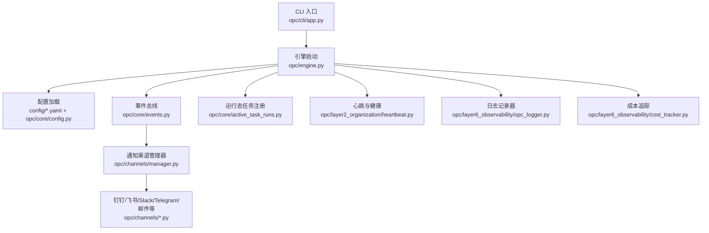
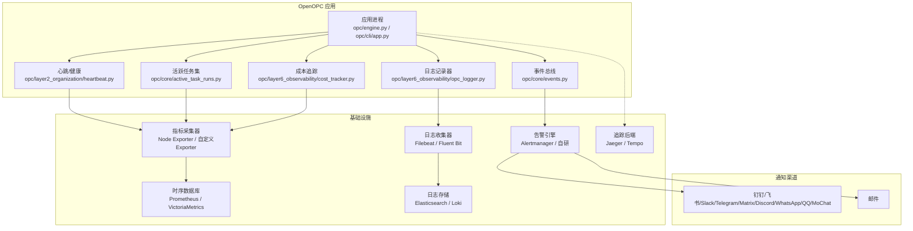
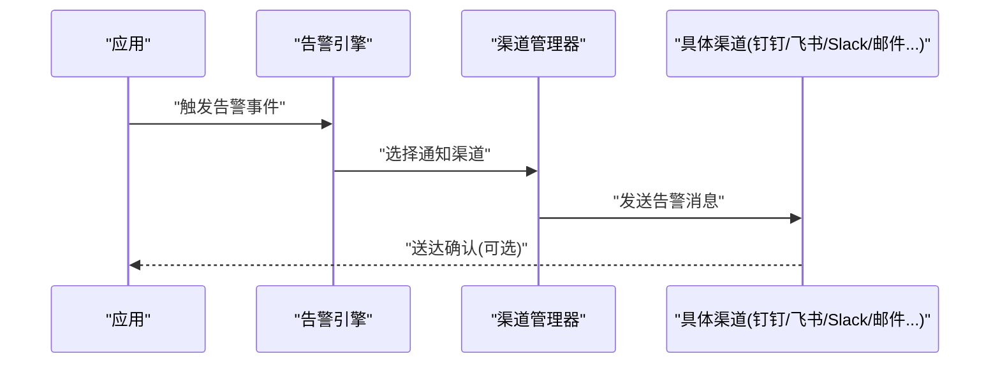
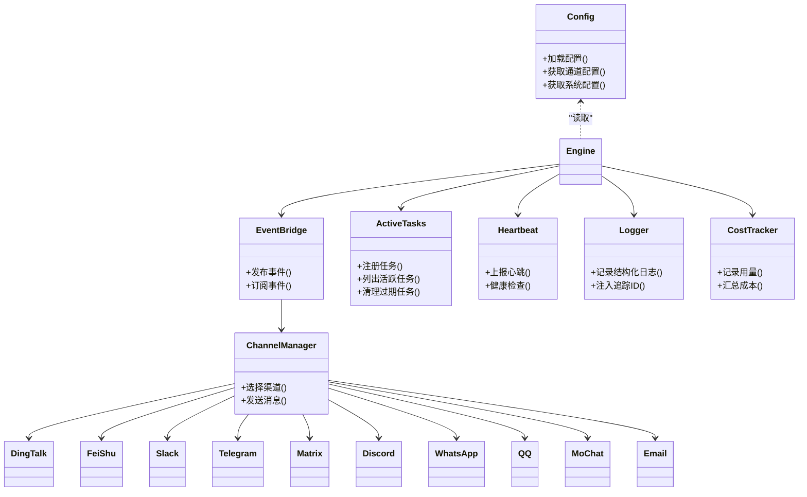

# 监控告警配置

<cite>
**本文引用的文件**   
- [README.md](file://README.md)
- [config/system_config.yaml](file://config/system_config.yaml)
- [config/agent_config.yaml](file://config/agent_config.yaml)
- [config/channel_config.yaml](file://config/channel_config.yaml)
- [opc/core/config.py](file://opc/core/config.py)
- [opc/core/events.py](file://opc/core/events.py)
- [opc/core/worker_envelope.py](file://opc/core/worker_envelope.py)
- [opc/core/active_task_runs.py](file://opc/core/active_task_runs.py)
- [opc/layer2_organization/heartbeat.py](file://opc/layer2_organization/heartbeat.py)
- [opc/layer6_observability/opc_logger.py](file://opc/layer6_observability/opc_logger.py)
- [opc/layer6_observability/cost_tracker.py](file://opc/layer6_observability/cost_tracker.py)
- [opc/channels/provider_base.py](file://opc/channels/provider_base.py)
- [opc/channels/manager.py](file://opc/channels/manager.py)
- [opc/channels/dingtalk.py](file://opc/channels/dingtalk.py)
- [opc/channels/email.py](file://opc/channels/email.py)
- [opc/channels/slack.py](file://opc/channels/slack.py)
- [opc/channels/telegram.py](file://opc/channels/telegram.py)
- [opc/channels/matrix.py](file://opc/channels/matrix.py)
- [opc/channels/discord.py](file://opc/channels/discord.py)
- [opc/channels/whatsapp.py](file://opc/channels/whatsapp.py)
- [opc/channels/qq.py](file://opc/channels/qq.py)
- [opc/channels/mochat.py](file://opc/channels/mochat.py)
- [opc/channels/feishu.py](file://opc/channels/feishu.py)
- [opc/cli/app.py](file://opc/cli/app.py)
- [opc/engine.py](file://opc/engine.py)
</cite>

## 目录
1. [简介](#简介)
2. [项目结构](#项目结构)
3. [核心组件](#核心组件)
4. [架构总览](#架构总览)
5. [详细组件分析](#详细组件分析)
6. [依赖关系分析](#依赖关系分析)
7. [性能考虑](#性能考虑)
8. [故障排查指南](#故障排查指南)
9. [结论](#结论)
10. [附录](#附录)

## 简介
本指南面向生产环境，提供OpenOPC的监控与告警落地方案。内容覆盖：
- 系统指标采集（CPU、内存、磁盘、网络）
- 应用层指标与业务KPI采集方法
- 日志聚合与分析系统配置
- 告警规则定义与通知渠道配置示例
- 分布式追踪与请求链路监控实现
- 成本监控与资源使用分析
- 可视化展示与报表生成

说明：本仓库未内置Prometheus/Grafana等外部监控栈集成代码，但提供了事件、日志、成本追踪与多渠道通知能力。本文基于现有代码给出可落地的集成建议与最佳实践。

## 项目结构
与监控告警相关的关键位置：
- 配置中心：config/*.yaml 与 opc/core/config.py
- 事件总线：opc/core/events.py
- 运行期状态：opc/core/active_task_runs.py、opc/core/worker_envelope.py
- 心跳与健康：opc/layer2_organization/heartbeat.py
- 可观测性：opc/layer6_observability/opc_logger.py、opc/layer6_observability/cost_tracker.py
- 通知渠道：opc/channels/*
- 入口与引擎：opc/cli/app.py、opc/engine.py

图表来源
- [opc/cli/app.py](file://opc/cli/app.py)
- [opc/engine.py](file://opc/engine.py)
- [config/system_config.yaml](file://config/system_config.yaml)
- [config/agent_config.yaml](file://config/agent_config.yaml)
- [config/channel_config.yaml](file://config/channel_config.yaml)
- [opc/core/config.py](file://opc/core/config.py)
- [opc/core/events.py](file://opc/core/events.py)
- [opc/core/active_task_runs.py](file://opc/core/active_task_runs.py)
- [opc/layer2_organization/heartbeat.py](file://opc/layer2_organization/heartbeat.py)
- [opc/layer6_observability/opc_logger.py](file://opc/layer6_observability/opc_logger.py)
- [opc/layer6_observability/cost_tracker.py](file://opc/layer6_observability/cost_tracker.py)
- [opc/channels/manager.py](file://opc/channels/manager.py)
- [opc/channels/dingtalk.py](file://opc/channels/dingtalk.py)
- [opc/channels/email.py](file://opc/channels/email.py)
- [opc/channels/slack.py](file://opc/channels/slack.py)
- [opc/channels/telegram.py](file://opc/channels/telegram.py)
- [opc/channels/matrix.py](file://opc/channels/matrix.py)
- [opc/channels/discord.py](file://opc/channels/discord.py)
- [opc/channels/whatsapp.py](file://opc/channels/whatsapp.py)
- [opc/channels/qq.py](file://opc/channels/qq.py)
- [opc/channels/mochat.py](file://opc/channels/mochat.py)
- [opc/channels/feishu.py](file://opc/channels/feishu.py)

章节来源
- [README.md](file://README.md)
- [config/system_config.yaml](file://config/system_config.yaml)
- [config/agent_config.yaml](file://config/agent_config.yaml)
- [config/channel_config.yaml](file://config/channel_config.yaml)
- [opc/core/config.py](file://opc/core/config.py)
- [opc/core/events.py](file://opc/core/events.py)
- [opc/core/active_task_runs.py](file://opc/core/active_task_runs.py)
- [opc/layer2_organization/heartbeat.py](file://opc/layer2_organization/heartbeat.py)
- [opc/layer6_observability/opc_logger.py](file://opc/layer6_observability/opc_logger.py)
- [opc/layer6_observability/cost_tracker.py](file://opc/layer6_observability/cost_tracker.py)
- [opc/channels/manager.py](file://opc/channels/manager.py)
- [opc/channels/dingtalk.py](file://opc/channels/dingtalk.py)
- [opc/channels/email.py](file://opc/channels/email.py)
- [opc/channels/slack.py](file://opc/channels/slack.py)
- [opc/channels/telegram.py](file://opc/channels/telegram.py)
- [opc/channels/matrix.py](file://opc/channels/matrix.py)
- [opc/channels/discord.py](file://opc/channels/discord.py)
- [opc/channels/whatsapp.py](file://opc/channels/whatsapp.py)
- [opc/channels/qq.py](file://opc/channels/qq.py)
- [opc/channels/mochat.py](file://opc/channels/mochat.py)
- [opc/channels/feishu.py](file://opc/channels/feishu.py)
- [opc/cli/app.py](file://opc/cli/app.py)
- [opc/engine.py](file://opc/engine.py)

## 核心组件
- 配置加载与分发：通过配置文件与配置模块集中管理，便于在容器或主机上以环境变量/挂载方式注入。
- 事件总线：用于跨模块广播关键事件，可作为监控与告警的事件源。
- 运行态任务注册：暴露活跃任务集合，便于采集吞吐、排队、失败率等业务指标。
- 心跳与健康：周期性上报健康状态，适合接入外部健康检查与可用性监控。
- 日志记录器：统一日志输出，便于对接外部日志收集器。
- 成本追踪：记录LLM调用等资源消耗，支撑成本分析与预算控制。
- 通知渠道：支持多平台告警触达，包括企业微信生态、IM与邮件等。

章节来源
- [opc/core/config.py](file://opc/core/config.py)
- [opc/core/events.py](file://opc/core/events.py)
- [opc/core/active_task_runs.py](file://opc/core/active_task_runs.py)
- [opc/layer2_organization/heartbeat.py](file://opc/layer2_organization/heartbeat.py)
- [opc/layer6_observability/opc_logger.py](file://opc/layer6_observability/opc_logger.py)
- [opc/layer6_observability/cost_tracker.py](file://opc/layer6_observability/cost_tracker.py)
- [opc/channels/manager.py](file://opc/channels/manager.py)

## 架构总览
下图展示了从应用内部到外部监控系统的整体数据流：应用产生事件与日志，外部采集器抓取并汇聚，告警引擎评估规则后通过通知渠道触达用户。

图表来源
- [opc/engine.py](file://opc/engine.py)
- [opc/cli/app.py](file://opc/cli/app.py)
- [opc/core/events.py](file://opc/core/events.py)
- [opc/layer6_observability/opc_logger.py](file://opc/layer6_observability/opc_logger.py)
- [opc/layer6_observability/cost_tracker.py](file://opc/layer6_observability/cost_tracker.py)
- [opc/layer2_organization/heartbeat.py](file://opc/layer2_organization/heartbeat.py)
- [opc/core/active_task_runs.py](file://opc/core/active_task_runs.py)
- [opc/channels/manager.py](file://opc/channels/manager.py)

## 详细组件分析

### 系统指标采集（CPU、内存、磁盘、网络）
- 推荐方案：在宿主或容器侧部署系统指标采集器（如Node Exporter），由Prometheus定期抓取。
- OpenOPC侧配合：
  - 将心跳/健康端点暴露为HTTP接口，供外部探针探测存活与就绪。
  - 将活跃任务数、队列长度等导出为自定义指标，便于与系统指标关联分析。
- 采集频率与保留策略：根据集群规模调整抓取间隔与长期存储策略。

章节来源
- [opc/layer2_organization/heartbeat.py](file://opc/layer2_organization/heartbeat.py)
- [opc/core/active_task_runs.py](file://opc/core/active_task_runs.py)

### 应用层指标与业务KPI
- 建议采集的指标类别：
  - 任务类：创建/完成/失败数量、平均耗时、P95/P99延迟、重试次数
  - 会话类：会话数、消息吞吐、上下文大小
  - 工具调用类：成功率、错误码分布、超时率
  - 成本类：Token用量、调用次数、费用估算
- 采集方式：
  - 在关键路径埋点，将指标写入本地计数器/直方图，再由采集器导出。
  - 利用事件总线发布高价值事件，作为KPI计算的数据源。

章节来源
- [opc/core/events.py](file://opc/core/events.py)
- [opc/core/active_task_runs.py](file://opc/core/active_task_runs.py)

### 日志聚合与分析
- 应用日志：通过统一日志记录器输出结构化日志（包含trace_id、span_id、业务键）。
- 采集与存储：使用Filebeat/Fluent Bit收集日志，投递至Loki/Elasticsearch。
- 查询与告警：基于关键字、字段与时间窗口构建检索与告警规则。

章节来源
- [opc/layer6_observability/opc_logger.py](file://opc/layer6_observability/opc_logger.py)

### 告警规则定义与通知渠道
- 告警规则建议：
  - 可用性：心跳失败、进程退出、端口不可达
  - 性能：P99延迟超阈值、错误率突增、队列积压
  - 成本：单位时间费用超预算、异常调用量
- 通知渠道：
  - 支持钉钉、飞书、Slack、Telegram、Matrix、Discord、WhatsApp、QQ、MoChat、邮件等。
  - 通过渠道管理器统一路由，按严重级别与标签选择目标。

图表来源
- [opc/channels/manager.py](file://opc/channels/manager.py)
- [opc/channels/dingtalk.py](file://opc/channels/dingtalk.py)
- [opc/channels/feishu.py](file://opc/channels/feishu.py)
- [opc/channels/slack.py](file://opc/channels/slack.py)
- [opc/channels/telegram.py](file://opc/channels/telegram.py)
- [opc/channels/matrix.py](file://opc/channels/matrix.py)
- [opc/channels/discord.py](file://opc/channels/discord.py)
- [opc/channels/whatsapp.py](file://opc/channels/whatsapp.py)
- [opc/channels/qq.py](file://opc/channels/qq.py)
- [opc/channels/mochat.py](file://opc/channels/mochat.py)
- [opc/channels/email.py](file://opc/channels/email.py)

章节来源
- [config/channel_config.yaml](file://config/channel_config.yaml)
- [opc/channels/provider_base.py](file://opc/channels/provider_base.py)
- [opc/channels/manager.py](file://opc/channels/manager.py)

### 分布式追踪与请求链路监控
- 链路ID：在请求入口处生成trace_id，贯穿子任务与工具调用，并在日志中输出。
- 采样策略：对慢请求与错误请求提高采样率，降低正常流量开销。
- 后端对接：将Span数据发送至Jaeger/Tempo等追踪后端，结合Grafana进行可视化。

章节来源
- [opc/layer6_observability/opc_logger.py](file://opc/layer6_observability/opc_logger.py)

### 成本监控与资源使用分析
- 成本追踪：记录每次LLM调用的用量与费用估算，按会话/任务维度聚合。
- 预算与配额：设置日/周/月预算，超限自动降速或阻断。
- 优化建议：缓存命中、批量调用、模型降级、上下文压缩。

章节来源
- [opc/layer6_observability/cost_tracker.py](file://opc/layer6_observability/cost_tracker.py)

### 监控数据的可视化与报表
- 指标看板：使用Grafana连接Prometheus/VictoriaMetrics，展示系统与应用指标。
- 日志面板：在Loki/Kibana中建立常用查询模板与仪表盘。
- 报表生成：定时导出关键KPI（吞吐、延迟、错误率、成本）为PDF/CSV，纳入运营日报。

[本节为通用指导，不直接分析具体文件]

## 依赖关系分析
- 配置依赖：系统、代理、渠道三类配置集中管理，运行时由配置模块加载。
- 运行时依赖：引擎与CLI入口负责初始化各子系统；事件总线解耦生产者与消费者。
- 通知依赖：渠道管理器抽象统一接口，具体渠道按需启用。

图表来源
- [config/system_config.yaml](file://config/system_config.yaml)
- [config/agent_config.yaml](file://config/agent_config.yaml)
- [config/channel_config.yaml](file://config/channel_config.yaml)
- [opc/core/config.py](file://opc/core/config.py)
- [opc/core/events.py](file://opc/core/events.py)
- [opc/core/active_task_runs.py](file://opc/core/active_task_runs.py)
- [opc/layer2_organization/heartbeat.py](file://opc/layer2_organization/heartbeat.py)
- [opc/layer6_observability/opc_logger.py](file://opc/layer6_observability/opc_logger.py)
- [opc/layer6_observability/cost_tracker.py](file://opc/layer6_observability/cost_tracker.py)
- [opc/channels/manager.py](file://opc/channels/manager.py)
- [opc/channels/dingtalk.py](file://opc/channels/dingtalk.py)
- [opc/channels/feishu.py](file://opc/channels/feishu.py)
- [opc/channels/slack.py](file://opc/channels/slack.py)
- [opc/channels/telegram.py](file://opc/channels/telegram.py)
- [opc/channels/matrix.py](file://opc/channels/matrix.py)
- [opc/channels/discord.py](file://opc/channels/discord.py)
- [opc/channels/whatsapp.py](file://opc/channels/whatsapp.py)
- [opc/channels/qq.py](file://opc/channels/qq.py)
- [opc/channels/mochat.py](file://opc/channels/mochat.py)
- [opc/channels/email.py](file://opc/channels/email.py)

章节来源
- [opc/core/config.py](file://opc/core/config.py)
- [opc/channels/manager.py](file://opc/channels/manager.py)

## 性能考虑
- 指标采集：避免高频采集导致额外开销，合理设置抓取间隔与采样率。
- 日志写入：采用异步写入与批处理，减少I/O阻塞。
- 成本优化：开启缓存、合并请求、限制上下文长度，必要时切换轻量模型。
- 告警风暴：去重、抑制与静默窗口，防止误报与噪声放大。

[本节为通用指导，不直接分析具体文件]

## 故障排查指南
- 常见问题定位步骤：
  - 查看心跳与健康状态，确认服务是否存活与就绪。
  - 检索结构化日志中的trace_id，快速定位问题链路。
  - 核对活跃任务列表，识别卡住或失败的任务。
  - 检查成本追踪明细，定位异常调用或用量激增。
  - 验证通知渠道连通性与凭据配置。
- 建议的排障清单：
  - 配置项是否正确加载（系统/代理/渠道）
  - 外部依赖（数据库、消息总线、第三方API）可达性
  - 资源水位（CPU/内存/磁盘/网络）是否触及阈值

章节来源
- [opc/layer2_organization/heartbeat.py](file://opc/layer2_organization/heartbeat.py)
- [opc/layer6_observability/opc_logger.py](file://opc/layer6_observability/opc_logger.py)
- [opc/core/active_task_runs.py](file://opc/core/active_task_runs.py)
- [opc/layer6_observability/cost_tracker.py](file://opc/layer6_observability/cost_tracker.py)
- [config/channel_config.yaml](file://config/channel_config.yaml)

## 结论
通过在OpenOPC中结合事件、日志、心跳与成本追踪，并对接外部采集、存储与告警系统，可以构建完整的监控与告警闭环。建议优先落地心跳健康检查、结构化日志与成本追踪，再逐步完善指标采集、链路追踪与可视化看板，最终形成稳定、可观测、可治理的生产体系。

[本节为总结性内容，不直接分析具体文件]

## 附录
- 配置要点
  - 系统配置：定义基础运行参数、日志级别、追踪开关等。
  - 代理配置：定义外部代理行为与限流策略。
  - 渠道配置：维护各通知渠道的凭据与路由策略。
- 参考入口
  - CLI入口与引擎初始化流程，确保在启动阶段正确加载配置与插件。

章节来源
- [config/system_config.yaml](file://config/system_config.yaml)
- [config/agent_config.yaml](file://config/agent_config.yaml)
- [config/channel_config.yaml](file://config/channel_config.yaml)
- [opc/cli/app.py](file://opc/cli/app.py)
- [opc/engine.py](file://opc/engine.py)