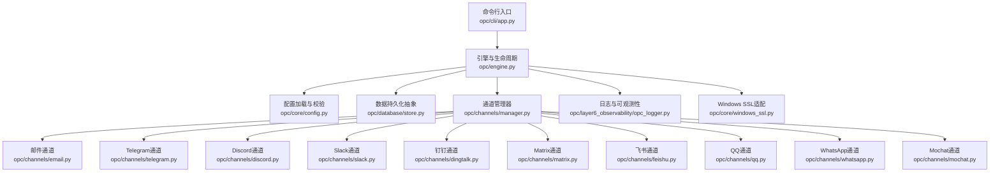
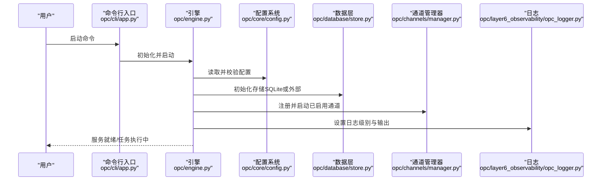
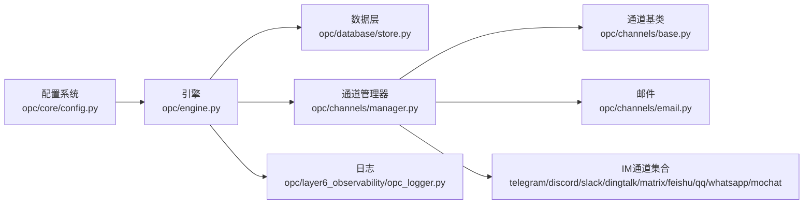

# 系统要求和准备

<cite>
**本文引用的文件**   
- [README.md](file://README.md)
- [README.zh-CN.md](file://README.zh-CN.md)
- [pyproject.toml](file://pyproject.toml)
- [config/system_config.yaml](file://config/system_config.yaml)
- [opc/core/config.py](file://opc/core/config.py)
- [opc/database/store.py](file://opc/database/store.py)
- [opc/channels/manager.py](file://opc/channels/manager.py)
- [opc/channels/base.py](file://opc/channels/base.py)
- [opc/channels/email.py](file://opc/channels/email.py)
- [opc/channels/telegram.py](file://opc/channels/telegram.py)
- [opc/channels/discord.py](file://opc/channels/discord.py)
- [opc/channels/slack.py](file://opc/channels/slack.py)
- [opc/channels/dingtalk.py](file://opc/channels/dingtalk.py)
- [opc/channels/matrix.py](file://opc/channels/matrix.py)
- [opc/channels/feishu.py](file://opc/channels/feishu.py)
- [opc/channels/qq.py](file://opc/channels/qq.py)
- [opc/channels/whatsapp.py](file://opc/channels/whatsapp.py)
- [opc/channels/mochat.py](file://opc/channels/mochat.py)
- [opc/cli/app.py](file://opc/cli/app.py)
- [opc/engine.py](file://opc/engine.py)
- [opc/core/windows_ssl.py](file://opc/core/windows_ssl.py)
- [opc/layer6_observability/opc_logger.py](file://opc/layer6_observability/opc_logger.py)
- [opc/layer4_tools/python_exec.py](file://opc/layer4_tools/python_exec.py)
- [opc/layer4_tools/shell.py](file://opc/layer4_tools/shell.py)
- [opc/layer4_tools/browser.py](file://opc/layer4_tools/browser.py)
- [opc/layer3_agent/native_agent.py](file://opc/layer3_agent/native_agent.py)
- [opc/layer3_agent/preflight.py](file://opc/layer3_agent/preflight.py)
- [opc/layer3_agent/runtime_v2/runtime.py](file://opc/layer3_agent/runtime_v2/runtime.py)
- [opc/layer3_agent/runtime_v2/tool_hooks.py](file://opc/layer3_agent/runtime_v2/tool_hooks.py)
- [opc/layer3_agent/runtime_v2/subagents.py](file://opc/layer3_agent/runtime_v2/subagents.py)
- [opc/layer3_agent/runtime_v2/worktree.py](file://opc/layer3_agent/runtime_v2/worktree.py)
- [opc/layer5_memory/markdown_memory.py](file://opc/layer5_memory/markdown_memory.py)
- [opc/layer5_memory/memory_manager.py](file://opc/layer5_memory/memory_manager.py)
- [opc/layer5_memory/skill_library.py](file://opc/layer5_memory/skill_library.py)
- [opc/layer5_memory/history_compactor.py](file://opc/layer5_memory/history_compactor.py)
- [opc/layer0_interaction/message_bus.py](file://opc/layer0_interaction/message_bus.py)
- [opc/layer1_perception/context_assembler.py](file://opc/layer1_perception/context_assembler.py)
- [opc/layer1_perception/task_router.py](file://opc/layer1_perception/task_router.py)
- [opc/layer2_organization/org_engine.py](file://opc/layer2_organization/org_engine.py)
- [opc/layer2_organization/gate_harness.py](file://opc/layer2_organization/gate_harness.py)
- [opc/layer2_organization/heartbeat.py](file://opc/layer2_organization/heartbeat.py)
- [opc/layer2_organization/collaboration_service.py](file://opc/layer2_organization/collaboration_service.py)
- [opc/layer2_organization/company_runtime.py](file://opc/layer2_organization/company_runtime.py)
- [opc/layer2_organization/custom_runtime.py](file://opc/layer2_organization/custom_runtime.py)
- [opc/layer2_organization/reorg_manager.py](file://opc/layer2_organization/reorg_manager.py)
- [opc/layer2_organization/phase.py](file://opc/layer2_organization/phase.py)
- [opc/layer2_organization/phase_hooks.py](file://opc/layer2_organization/phase_hooks.py)
- [opc/layer2_organization/work_item_runtime.py](file://opc/layer2_organization/work_item_runtime.py)
- [opc/layer2_organization/work_item_transition.py](file://opc/layer2_organization/work_item_transition.py)
- [opc/layer2_organization/session_scoping.py](file://opc/layer2_organization/session_scoping.py)
- [opc/layer2_organization/metadata_ownership.py](file://opc/layer2_organization/metadata_ownership.py)
- [opc/layer2_organization/seat_executor.py](file://opc/layer2_organization/seat_executor.py)
- [opc/layer2_organization/recruiter.py](file://opc/layer2_organization/recruiter.py)
- [opc/layer2_organization/talent_market.py](file://opc/layer2_organization/talent_market.py)
- [opc/layer2_organization/goal_manager.py](file://opc/layer2_organization/goal_manager.py)
- [opc/layer2_organization/output_contract.py](file://opl/layer2_organization/output_contract.py)
- [opc/layer2_organization/prompt_contract.py](file://opl/layer2_organization/prompt_contract.py)
- [opc/layer2_organization/data_acquisition_policy.py](file://opl/layer2_organization/data_acquisition_policy.py)
- [opc/layer2_organization/collaboration_policy.py](file://opl/layer2_organization/collaboration_policy.py)
- [opc/layer2_organization/escalation.py](file://opl/layer2_organization/escalation.py)
- [opc/layer2_organization/secretary.py](file://opl/layer2_organization/secretary.py)
- [opc/layer2_organization/work_item_identity.py](file://opl/layer2_organization/work_item_identity.py)
- [opc/layer2_organization/work_item_links.py](file://opl/layer2_organization/work_item_links.py)
- [opc/layer2_organization/work_item_context_view.py](file://opl/layer2_organization/work_item_context_view.py)
- [opc/layer2_organization/work_item_runtime_invariants.py](file://opl/layer2_organization/work_item_runtime_invariants.py)
- [opc/layer2_organization/turn_mode.py](file://opl/layer2_organization/turn_mode.py)
- [opc/layer2_organization/company_runtime_profiles.py](file://opl/layer2_organization/company_runtime_profiles.py)
- [opc/layer2_organization/company_runtime_identity.py](file://opl/layer2_organization/company_runtime_identity.py)
- [opc/layer2_organization/comms.py](file://opl/layer2_organization/comms.py)
- [opc/layer2_organization/org_work_item_planner.py](file://opl/layer2_organization/org_work_item_planner.py)
- [opc/layer2_organization/reactivation_sweeper.py](file://opl/layer2_organization/reactivation_sweeper.py)
- [opc/layer2_organization/approval.py](file://opl/layer2_organization/approval.py)
- [opc/layer2_organization/shell_safety.py](file://opl/layer2_organization/shell_safety.py)
- [opc/layer2_organization/heartbeat.py](file://opl/layer2_organization/heartbeat.py)
- [opc/layer2_organization/compilation.py](file://opl/layer2_organization/compilation.py)
- [opc/layer2_organization/compilation.py](file://opl/layer2_organization/compilation.py)
- [opc/layer2_organization/compilation.py](file://opl/layer2_organization/compilation.py)
- [opc/layer2_organization/compilation.py](file://opl/layer2_organization/compilation.py)
- [opc/layer2_organization/compilation.py](file://opl/layer2_organization/compilation.py)
- [opc/layer2_organization/compilation.py](file://opl/layer2_organization/compilation.py)
- [opc/layer2_organization/compilation.py](file://opl/layer2_organization/compilation.py)
- [opc/layer2_organization/compilation.py](file://opl/layer2_organization/compilation.py)
- [opc/layer2_organization/compilation.py](file://opl/layer2_organization/compilation.py)
- [opc/layer2_organization/compilation.py](file://opl/layer2_organization/compilation.py)
- [opc/layer2_organization/compilation.py](file://opl/layer2_organization/compilation.py)
- [opc/layer2_organization/compilation.py](file://opl/layer2_organization/compilation.py)
- [opc/layer2_organization/compilation.py](file://opl/layer2_organization/compilation.py)
- [opc/layer2_organization/compilation.py](file://opl/layer2_organization/compilation.py)
- [opc/layer2_organization/compilation.py](file://opl/layer2_organization/compilation.py)
- [opc/layer2_organization/compilation.py](file://opl/layer2_organization/compilation.py)
- [opc/layer2_organization/compilation.py](file://opl/layer2_organization/compilation.py)
- [opc/layer2_organization/compilation.py](file://opl/layer2_organization/compilation.py)
- [opc/layer2_organization/compilation.py](file://opl/layer2_organization/compilation.py)
- [opc/layer2_organization/compilation.py](file://opl/layer2_organization/compilation.py)......
</cite>

## 目录
1. [简介](#简介)
2. [项目结构](#项目结构)
3. [核心组件](#核心组件)
4. [架构总览](#架构总览)
5. [详细组件分析](#详细组件分析)
6. [依赖分析](#依赖分析)
7. [性能考虑](#性能考虑)
8. [故障排查指南](#故障排查指南)
9. [结论](#结论)
10. [附录](#附录)

## 简介
本文件面向OpenOPC的系统要求与环境准备，覆盖操作系统与硬件最低配置、Python环境与依赖、数据库环境（SQLite或外部存储）、网络端口与防火墙、Docker容器化部署步骤，以及生产环境的最佳实践与环境隔离建议。内容基于仓库中的配置文件、入口脚本、运行时与通道实现进行归纳总结，确保读者能在不同平台上快速完成安装与运行。

## 项目结构
- 应用入口与CLI位于 opc/cli/app.py，引擎启动与生命周期管理在 opc/engine.py。
- 系统配置加载与校验逻辑集中在 opc/core/config.py，默认配置模板在 config/system_config.yaml。
- 数据存储抽象在 opc/database/store.py，默认使用SQLite文件存储。
- 多通道接入（IM/邮件等）通过 opc/channels/* 提供统一接口，由 opc/channels/manager.py 统一管理。
- 可观测性与日志记录在 opc/layer6_observability/opc_logger.py。
- Windows平台SSL适配在 opc/core/windows_ssl.py。

**图表来源**
- [opc/cli/app.py](file://opc/cli/app.py)
- [opc/engine.py](file://opc/engine.py)
- [opc/core/config.py](file://opc/core/config.py)
- [config/system_config.yaml](file://config/system_config.yaml)
- [opc/database/store.py](file://opc/database/store.py)
- [opc/channels/manager.py](file://opc/channels/manager.py)
- [opc/channels/email.py](file://opc/channels/email.py)
- [opc/channels/telegram.py](file://opc/channels/telegram.py)
- [opc/channels/discord.py](file://opc/channels/discord.py)
- [opc/channels/slack.py](file://opc/channels/slack.py)
- [opc/channels/dingtalk.py](file://opc/channels/dingtalk.py)
- [opc/channels/matrix.py](file://opc/channels/matrix.py)
- [opc/channels/feishu.py](file://opc/channels/feishu.py)
- [opc/channels/qq.py](file://opc/channels/qq.py)
- [opc/channels/whatsapp.py](file://opc/channels/whatsapp.py)
- [opc/channels/mochat.py](file://opc/channels/mochat.py)
- [opc/layer6_observability/opc_logger.py](file://opc/layer6_observability/opc_logger.py)
- [opc/core/windows_ssl.py](file://opc/core/windows_ssl.py)

**章节来源**
- [README.md](file://README.md)
- [README.zh-CN.md](file://README.zh-CN.md)
- [pyproject.toml](file://pyproject.toml)
- [config/system_config.yaml](file://config/system_config.yaml)
- [opc/core/config.py](file://opc/core/config.py)
- [opc/database/store.py](file://opc/database/store.py)
- [opc/channels/manager.py](file://opc/channels/manager.py)
- [opc/channels/base.py](file://opc/channels/base.py)

## 核心组件
- 配置系统：从 YAML 配置加载并校验必要字段，支持环境变量注入与默认值回退。
- 数据层：默认使用SQLite文件存储，路径可通过配置指定；可扩展至外部数据库。
- 通道层：统一抽象多种消息通道，按需启用与认证配置。
- 可观测性：结构化日志输出，便于问题定位与审计。
- 平台适配：Windows下SSL证书链与握手行为差异的兼容处理。

**章节来源**
- [opc/core/config.py](file://opc/core/config.py)
- [config/system_config.yaml](file://config/system_config.yaml)
- [opc/database/store.py](file://opc/database/store.py)
- [opc/channels/manager.py](file://opc/channels/manager.py)
- [opc/channels/base.py](file://opc/channels/base.py)
- [opc/layer6_observability/opc_logger.py](file://opc/layer6_observability/opc_logger.py)
- [opc/core/windows_ssl.py](file://opc/core/windows_ssl.py)

## 架构总览
下图展示了OpenOPC在典型部署中的关键交互：CLI触发引擎启动，引擎加载配置、初始化数据层与通道，随后根据配置对外暴露服务或执行任务。

**图表来源**
- [opc/cli/app.py](file://opc/cli/app.py)
- [opc/engine.py](file://opc/engine.py)
- [opc/core/config.py](file://opc/core/config.py)
- [opc/database/store.py](file://opc/database/store.py)
- [opc/channels/manager.py](file://opc/channels/manager.py)
- [opc/layer6_observability/opc_logger.py](file://opc/layer6_observability/opc_logger.py)

## 详细组件分析

### 操作系统与硬件要求
- 支持的操作系统
  - Linux发行版：主流发行版均可（如Ubuntu、Debian、CentOS/RHEL、Rocky、AlmaLinux、Fedora等）。
  - Windows Server：Windows Server 2016及以上版本。
  - macOS：开发测试可用，生产建议优先Linux。
- 硬件最低配置
  - CPU：双核及以上（推荐四核以支撑并发通道与工具执行）。
  - 内存：至少4GB（推荐8GB以上，尤其是启用浏览器自动化或多通道时）。
  - 磁盘空间：至少10GB可用空间（用于依赖包、缓存、日志与数据文件）。
- 平台特定说明
  - Windows平台需确保系统时间同步与TLS根证书更新，避免HTTPS通信失败。
  - Linux建议使用systemd管理服务进程，便于重启与监控。

**章节来源**
- [opc/core/windows_ssl.py](file://opc/core/windows_ssl.py)
- [opc/layer4_tools/browser.py](file://opc/layer4_tools/browser.py)
- [opc/layer4_tools/python_exec.py](file://opc/layer4_tools/python_exec.py)
- [opc/layer4_tools/shell.py](file://opc/layer4_tools/shell.py)

### Python环境与依赖
- Python版本
  - 推荐使用Python 3.10+（具体版本范围以项目依赖声明为准）。
- 依赖管理
  - 使用pyproject.toml声明依赖，建议在虚拟环境中安装以避免冲突。
- 可选依赖
  - 某些通道或功能需要额外依赖（例如浏览器自动化、特定SDK），按通道文档启用。

**章节来源**
- [pyproject.toml](file://pyproject.toml)
- [opc/layer4_tools/python_exec.py](file://opc/layer4_tools/python_exec.py)

### 数据库环境准备
- SQLite文件存储（默认）
  - 无需外部数据库服务，数据文件保存在本地路径，可通过配置指定目录。
  - 建议定期备份数据文件，防止意外损坏。
- 外部数据库（扩展）
  - 若需迁移至外部数据库，需在配置中指定连接参数，并确保网络可达与权限正确。
- 数据一致性
  - 单实例运行下SQLite可满足一致性需求；多实例共享同一SQLite文件需谨慎，建议使用主从或外部数据库。

**章节来源**
- [opc/database/store.py](file://opc/database/store.py)
- [config/system_config.yaml](file://config/system_config.yaml)
- [opc/core/config.py](file://opc/core/config.py)

### 网络端口与防火墙配置
- 内部通信
  - 通道间与子代理通信通常使用本地回环地址（127.0.0.1）或容器内网，避免直接暴露到公网。
- 外部通道
  - 各通道（如邮件、IM）多为出站请求，需允许访问对应服务商域名与端口（通常为443/TCP）。
- 防火墙示例
  - Linux（iptables）：放行出站443/TCP，入站仅开放必要的管理端口（如SSH）。
  - Windows（高级安全）：出站规则允许HTTPS，入站限制为管理员IP段。
- 反向代理（可选）
  - 如需对外暴露Web界面，建议使用Nginx/Caddy作为反向代理，并启用TLS终止。

**章节来源**
- [opc/channels/email.py](file://opc/channels/email.py)
- [opc/channels/telegram.py](file://opc/channels/telegram.py)
- [opc/channels/discord.py](file://opc/channels/discord.py)
- [opc/channels/slack.py](file://opc/channels/slack.py)
- [opc/channels/dingtalk.py](file://opc/channels/dingtalk.py)
- [opc/channels/matrix.py](file://opc/channels/matrix.py)
- [opc/channels/feishu.py](file://opc/channels/feishu.py)
- [opc/channels/qq.py](file://opc/channels/qq.py)
- [opc/channels/whatsapp.py](file://opc/channels/whatsapp.py)
- [opc/channels/mochat.py](file://opc/channels/mochat.py)

### Docker容器化部署
- 基础镜像
  - 选择官方Python镜像（如python:3.11-slim），安装系统依赖（如浏览器驱动、字体等）。
- 构建步骤
  - 复制项目代码与依赖声明，创建虚拟环境并安装依赖。
  - 将配置文件挂载到容器内，避免硬编码敏感信息。
- 运行参数
  - 通过环境变量注入密钥与配置项，减少镜像体积与提升安全性。
- 数据持久化
  - 将SQLite数据目录与日志目录映射到宿主机卷，确保重启不丢失。
- 健康检查
  - 添加健康检查端点或命令，配合编排工具自动重启异常容器。

**章节来源**
- [opc/cli/app.py](file://opc/cli/app.py)
- [opc/engine.py](file://opc/engine.py)
- [config/system_config.yaml](file://config/system_config.yaml)
- [opc/database/store.py](file://opc/database/store.py)

### 生产环境最佳实践与环境隔离
- 环境隔离
  - 使用独立用户运行服务，最小权限原则；使用虚拟环境或容器隔离依赖。
- 配置管理
  - 使用环境变量或密钥管理服务注入敏感配置，避免明文存储在仓库中。
- 日志与监控
  - 集中收集日志，设置合理的保留策略；对关键指标（CPU、内存、队列长度）进行监控告警。
- 高可用与扩展
  - 多实例部署时采用外部数据库与消息总线，避免状态共享问题。
- 安全加固
  - 关闭不必要的端口与服务，启用TLS，定期更新系统与依赖。

**章节来源**
- [opc/layer6_observability/opc_logger.py](file://opc/layer6_observability/opc_logger.py)
- [opc/core/config.py](file://opc/core/config.py)
- [opc/database/store.py](file://opc/database/store.py)

## 依赖分析
OpenOPC的依赖关系围绕“配置—引擎—数据—通道”展开，通道模块通过统一接口注册与启停，数据层提供持久化能力，日志贯穿全链路。

**图表来源**
- [opc/core/config.py](file://opc/core/config.py)
- [opc/engine.py](file://opc/engine.py)
- [opc/database/store.py](file://opc/database/store.py)
- [opc/channels/manager.py](file://opc/channels/manager.py)
- [opc/channels/base.py](file://opc/channels/base.py)
- [opc/channels/email.py](file://opc/channels/email.py)
- [opc/channels/telegram.py](file://opc/channels/telegram.py)
- [opc/channels/discord.py](file://opc/channels/discord.py)
- [opc/channels/slack.py](file://opc/channels/slack.py)
- [opc/channels/dingtalk.py](file://opc/channels/dingtalk.py)
- [opc/channels/matrix.py](file://opc/channels/matrix.py)
- [opc/channels/feishu.py](file://opc/channels/feishu.py)
- [opc/channels/qq.py](file://opc/channels/qq.py)
- [opc/channels/whatsapp.py](file://opc/channels/whatsapp.py)
- [opc/channels/mochat.py](file://opc/channels/mochat.py)
- [opc/layer6_observability/opc_logger.py](file://opc/layer6_observability/opc_logger.py)

**章节来源**
- [opc/channels/manager.py](file://opc/channels/manager.py)
- [opc/channels/base.py](file://opc/channels/base.py)

## 性能考虑
- 并发与资源
  - 合理设置通道并发数与线程池大小，避免阻塞I/O操作。
- 存储优化
  - SQLite适合中小规模数据，大吞吐场景建议迁移至外部数据库并启用索引与连接池。
- 日志调优
  - 生产环境降低日志级别，避免高频写入影响性能。
- 浏览器自动化
  - 无头模式与资源限制可降低内存占用，必要时增加Swap或物理内存。

[本节为通用指导，不涉及具体文件分析]

## 故障排查指南
- 常见问题
  - 通道认证失败：检查通道配置与密钥是否正确，确认网络可达与域名解析。
  - 数据文件损坏：恢复最近备份，检查文件系统权限与磁盘健康。
  - Windows HTTPS错误：更新系统根证书，检查代理与防火墙设置。
- 诊断方法
  - 查看日志输出，定位错误堆栈与上下文。
  - 使用轻量级探针验证端口连通性与TLS握手。
  - 逐步禁用通道或功能，缩小问题范围。

**章节来源**
- [opc/layer6_observability/opc_logger.py](file://opc/layer6_observability/opc_logger.py)
- [opc/core/windows_ssl.py](file://opc/core/windows_ssl.py)
- [opc/channels/manager.py](file://opc/channels/manager.py)

## 结论
OpenOPC具备跨平台支持与灵活的通道集成能力，默认SQLite存储简化了部署复杂度。在生产环境中，建议采用容器化与外部数据库以提升稳定性与可维护性，并通过严格的配置管理与监控体系保障服务质量。

[本节为总结，不涉及具体文件分析]

## 附录
- 参考文档
  - README与中文README提供快速上手与使用说明。
  - pyproject.toml列出完整依赖清单，便于离线安装与镜像构建。
- 配置模板
  - system_config.yaml包含常用配置项与注释，可作为生产配置的起点。

**章节来源**
- [README.md](file://README.md)
- [README.zh-CN.md](file://README.zh-CN.md)
- [pyproject.toml](file://pyproject.toml)
- [config/system_config.yaml](file://config/system_config.yaml)