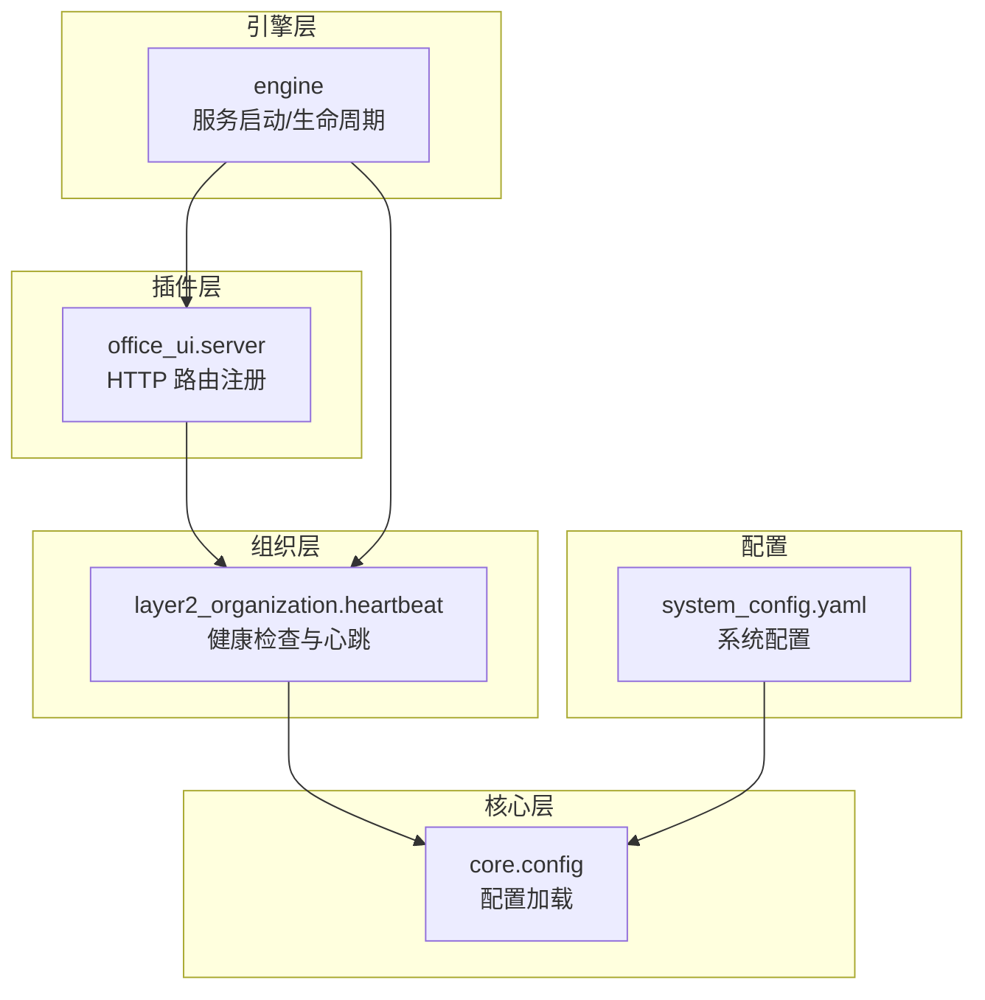
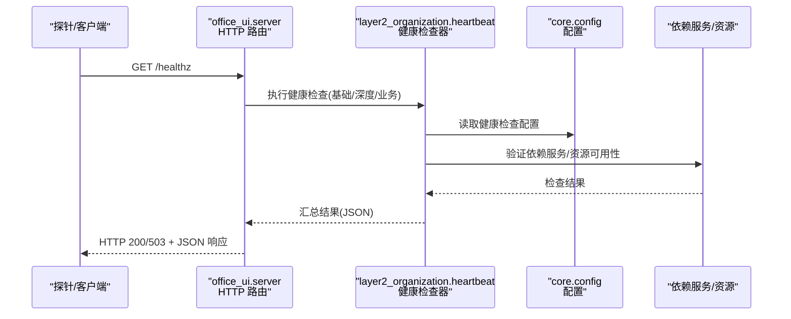
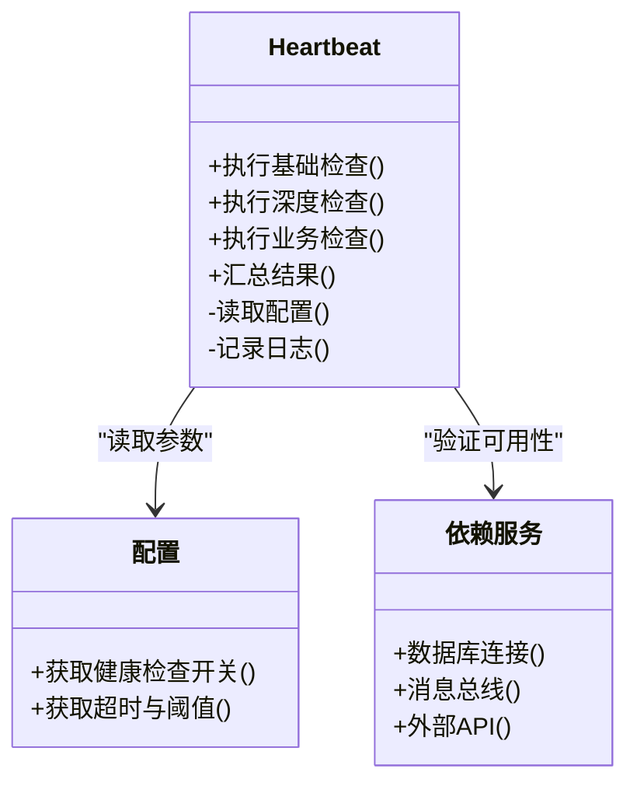
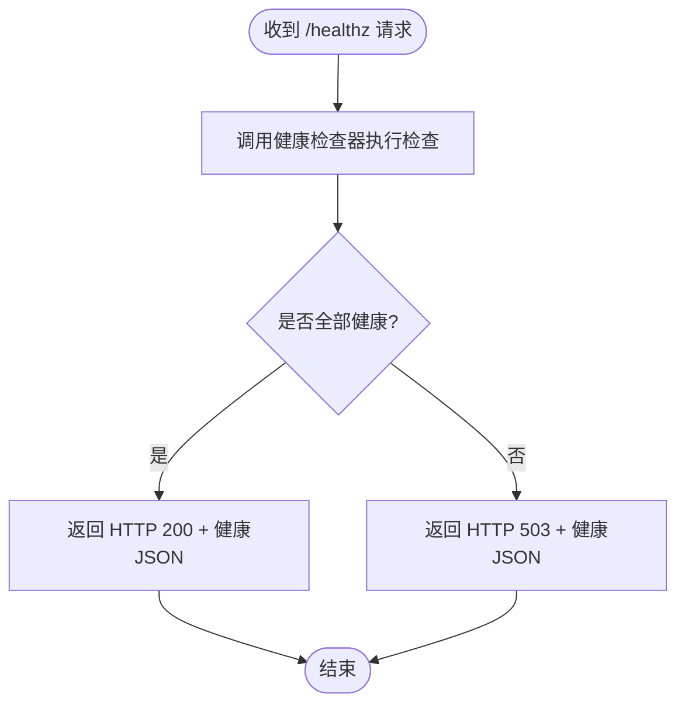
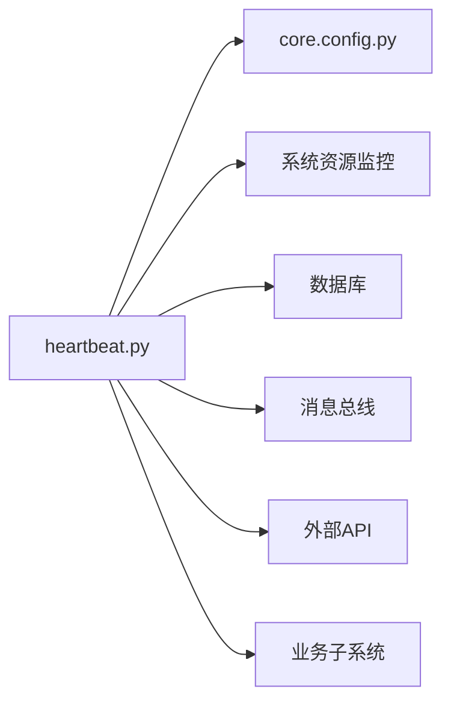

# 健康检查

<cite>
**本文引用的文件**   
- [opc/layer2_organization/heartbeat.py](file://opc/layer2_organization/heartbeat.py)
- [opc/core/config.py](file://opc/core/config.py)
- [opc/engine.py](file://opc/engine.py)
- [opc/plugins/office_ui/server.py](file://opc/plugins/office_ui/server.py)
- [config/system_config.yaml](file://config/system_config.yaml)
</cite>

## 目录
1. [简介](#简介)
2. [项目结构](#项目结构)
3. [核心组件](#核心组件)
4. [架构总览](#架构总览)
5. [详细组件分析](#详细组件分析)
6. [依赖分析](#依赖分析)
7. [性能考虑](#性能考虑)
8. [故障排查指南](#故障排查指南)
9. [结论](#结论)
10. [附录](#附录) 

## 简介
本文件为 OpenOPC 的健康检查系统提供完整文档，覆盖健康检查端点的定义与实现、多层次策略（基础、深度、业务逻辑）、结果标准化格式与 HTTP 状态码映射、容器化环境集成（Kubernetes 探针与服务发现）、以及失败时的自动恢复与告警通知配置。文档同时给出架构图、时序图与流程图，帮助读者快速理解并落地实施。

## 项目结构
OpenOPC 采用分层架构：
- 组织层（layer2_organization）：包含心跳与健康检查相关能力。
- 核心层（core）：配置加载与系统参数管理。
- 引擎层（engine）：服务启动与生命周期管理。
- 插件层（plugins/office_ui）：Web 服务器与 HTTP 路由注册。
- 配置层（config）：YAML 配置文件，用于控制行为开关与阈值。

图表来源
- [opc/plugins/office_ui/server.py](file://opc/plugins/office_ui/server.py)
- [opc/layer2_organization/heartbeat.py](file://opc/layer2_organization/heartbeat.py)
- [opc/core/config.py](file://opc/core/config.py)
- [opc/engine.py](file://opc/engine.py)
- [config/system_config.yaml](file://config/system_config.yaml)

章节来源
- [opc/layer2_organization/heartbeat.py](file://opc/layer2_organization/heartbeat.py)
- [opc/core/config.py](file://opc/core/config.py)
- [opc/engine.py](file://opc/engine.py)
- [opc/plugins/office_ui/server.py](file://opc/plugins/office_ui/server.py)
- [config/system_config.yaml](file://config/system_config.yaml)

## 核心组件
- 健康检查器（Heartbeat）：负责执行基础健康检查、深度健康检查与业务逻辑健康检查，汇总结果并提供统一接口供上层调用。
- 配置中心（Config）：提供健康检查相关的开关、超时、阈值等参数读取。
- Web 服务器（Office UI Server）：暴露 /healthz 等健康检查端点，返回标准化的 JSON 响应与合适的 HTTP 状态码。
- 引擎（Engine）：在进程启动时初始化健康检查器，并在关闭流程中清理资源。

章节来源
- [opc/layer2_organization/heartbeat.py](file://opc/layer2_organization/heartbeat.py)
- [opc/core/config.py](file://opc/core/config.py)
- [opc/plugins/office_ui/server.py](file://opc/plugins/office_ui/server.py)
- [opc/engine.py](file://opc/engine.py)

## 架构总览
健康检查的整体交互如下：外部探针（如 Kubernetes）或内部监控通过 HTTP 访问健康检查端点；服务端调用健康检查器执行不同层次的检查；最终返回统一的 JSON 结构与状态码。

图表来源
- [opc/plugins/office_ui/server.py](file://opc/plugins/office_ui/server.py)
- [opc/layer2_organization/heartbeat.py](file://opc/layer2_organization/heartbeat.py)
- [opc/core/config.py](file://opc/core/config.py)

## 详细组件分析

### 健康检查器（Heartbeat）
职责
- 维护健康检查策略集合（基础、深度、业务）。
- 按策略并行或串行执行各子检查项。
- 聚合结果，生成标准化输出。
- 支持可插拔的检查项扩展。

关键能力
- 基础健康检查：进程存活、内存/CPU 使用率、磁盘空间、端口监听。
- 深度健康检查：数据库连接、消息总线连通性、外部 API 可达性、证书有效期。
- 业务逻辑健康检查：关键任务队列积压、工作项处理延迟、会话/工单数量阈值。

图表来源
- [opc/layer2_organization/heartbeat.py](file://opc/layer2_organization/heartbeat.py)
- [opc/core/config.py](file://opc/core/config.py)

章节来源
- [opc/layer2_organization/heartbeat.py](file://opc/layer2_organization/heartbeat.py)
- [opc/core/config.py](file://opc/core/config.py)

### Web 健康检查端点（/healthz）
职责
- 暴露 HTTP 端点，接收健康检查请求。
- 调用健康检查器执行检查。
- 根据检查结果设置 HTTP 状态码与 JSON 响应体。

图表来源
- [opc/plugins/office_ui/server.py](file://opc/plugins/office_ui/server.py)
- [opc/layer2_organization/heartbeat.py](file://opc/layer2_organization/heartbeat.py)

章节来源
- [opc/plugins/office_ui/server.py](file://opc/plugins/office_ui/server.py)
- [opc/layer2_organization/heartbeat.py](file://opc/layer2_organization/heartbeat.py)

### 配置项与策略
健康检查策略由配置驱动，支持：
- 开关控制：是否启用基础/深度/业务检查。
- 超时与重试：每个检查项的超时时间与重试次数。
- 阈值与指标：CPU、内存、磁盘、队列积压、延迟等阈值。
- 标签与分组：将检查项分组，便于选择性执行。

章节来源
- [config/system_config.yaml](file://config/system_config.yaml)
- [opc/core/config.py](file://opc/core/config.py)

### 引擎集成与生命周期
- 启动阶段：引擎初始化配置与健康检查器，注册健康检查端点。
- 运行阶段：健康检查器周期性执行检查（可选），并将结果写入本地状态或上报到监控系统。
- 关闭阶段：优雅关闭，释放资源并停止定时任务。

章节来源
- [opc/engine.py](file://opc/engine.py)
- [opc/plugins/office_ui/server.py](file://opc/plugins/office_ui/server.py)

## 依赖分析
健康检查器依赖以下子系统：
- 配置模块：提供运行时参数。
- 资源监控：操作系统级指标（CPU、内存、磁盘）。
- 外部依赖：数据库、消息总线、外部 API。
- 业务子系统：任务队列、工作项、会话管理等。

图表来源
- [opc/layer2_organization/heartbeat.py](file://opc/layer2_organization/heartbeat.py)
- [opc/core/config.py](file://opc/core/config.py)

章节来源
- [opc/layer2_organization/heartbeat.py](file://opc/layer2_organization/heartbeat.py)
- [opc/core/config.py](file://opc/core/config.py)

## 性能考虑
- 并行执行：对无依赖的检查项并行执行，降低整体延迟。
- 超时控制：为每个检查项设置合理超时，避免阻塞主线程。
- 缓存与去抖：对耗时检查的结果进行短期缓存，减少重复开销。
- 分级降级：当系统负载过高时，自动禁用深度或业务检查，仅保留基础检查。
- 采样与限流：对高频指标进行采样，避免监控风暴。

[本节为通用指导，不直接分析具体文件]

## 故障排查指南
常见问题与定位步骤：
- 端点不可达：确认 Web 服务器已启动且端口监听正常；检查防火墙与安全组。
- 状态码异常：查看健康检查器日志，定位失败的检查项；核对配置中的阈值与超时。
- 依赖服务失败：逐一验证数据库、消息总线、外部 API 的连接与权限；检查证书与网络连通性。
- 资源超限：观察 CPU、内存、磁盘使用率；调整阈值或扩容资源。
- 业务逻辑异常：检查工作项积压与延迟；检查任务调度与消费者状态。

章节来源
- [opc/layer2_organization/heartbeat.py](file://opc/layer2_organization/heartbeat.py)
- [opc/plugins/office_ui/server.py](file://opc/plugins/office_ui/server.py)

## 结论
OpenOPC 的健康检查系统以模块化与可配置为核心，提供多层次检查能力与标准化输出，便于在容器化环境中集成与自动化运维。通过合理的策略配置与监控告警，可实现高可用与快速自愈。

[本节为总结，不直接分析具体文件]

## 附录

### 健康检查策略配置建议
- 基础健康检查：始终启用，低开销，快速反馈服务可用性。
- 深度健康检查：按需启用，关注外部依赖与关键资源。
- 业务逻辑健康检查：在生产环境启用，关注业务指标与用户体验。

章节来源
- [config/system_config.yaml](file://config/system_config.yaml)
- [opc/core/config.py](file://opc/core/config.py)

### 标准化健康检查响应格式
- 字段说明：
  - status：总体状态（healthy/unhealthy/degraded）。
  - checks：检查项列表，每项包含 name、status、message、latency_ms、tags。
  - metadata：附加信息（版本、节点标识、时间戳等）。
- HTTP 状态码映射：
  - 200：所有检查项均为 healthy。
  - 503：存在 unhealthy 检查项。
  - 200 + degraded：部分检查项为 degraded，但整体仍可用。

章节来源
- [opc/plugins/office_ui/server.py](file://opc/plugins/office_ui/server.py)
- [opc/layer2_organization/heartbeat.py](file://opc/layer2_organization/heartbeat.py)

### 容器化环境集成（Kubernetes）
- Liveness 探针：使用 /healthz 判断进程是否存活，失败则重启容器。
- Readiness 探针：使用 /healthz 判断服务是否就绪，失败则从负载均衡移除。
- Startup 探针：针对冷启动较长的场景，给予足够启动时间后再开始探测。
- 探针参数建议：
  - initialDelaySeconds：根据应用启动时间设置。
  - periodSeconds：探测频率（通常 5-15 秒）。
  - timeoutSeconds：单次探测超时（通常 1-3 秒）。
  - failureThreshold：连续失败次数后触发动作。

[本节为概念性内容，不直接分析具体文件]

### 服务发现集成
- 健康检查作为服务发现的依据，结合注册中心（如 Consul、etcd）实现动态上下线。
- 在健康检查中增加“注册状态”检查项，确保服务实例与注册中心一致。

[本节为概念性内容，不直接分析具体文件]

### 自动恢复机制
- 自修复策略：
  - 依赖服务短暂不可用：自动重试与退避。
  - 资源超限：触发弹性伸缩或降级策略。
  - 死锁或卡住：检测长时间无进展的检查项，强制重置或重启相关组件。
- 编排层恢复：
  - Kubernetes 根据探针状态自动重启或替换 Pod。
  - 滚动更新时，优先保证健康实例比例。

[本节为概念性内容，不直接分析具体文件]

### 告警通知配置
- 告警规则：
  - 健康检查失败次数超过阈值。
  - 关键检查项持续 unhealthy。
  - 资源使用率接近上限。
- 通知渠道：
  - 邮件、短信、企业微信、钉钉、Slack 等。
- 告警抑制与降噪：
  - 合并同类告警。
  - 基于维护窗口抑制非关键告警。

[本节为概念性内容，不直接分析具体文件]