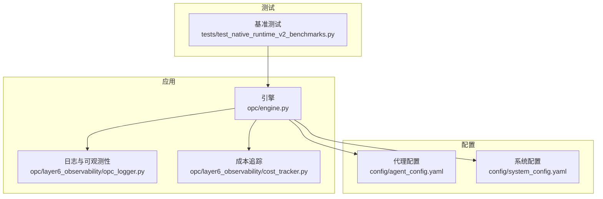
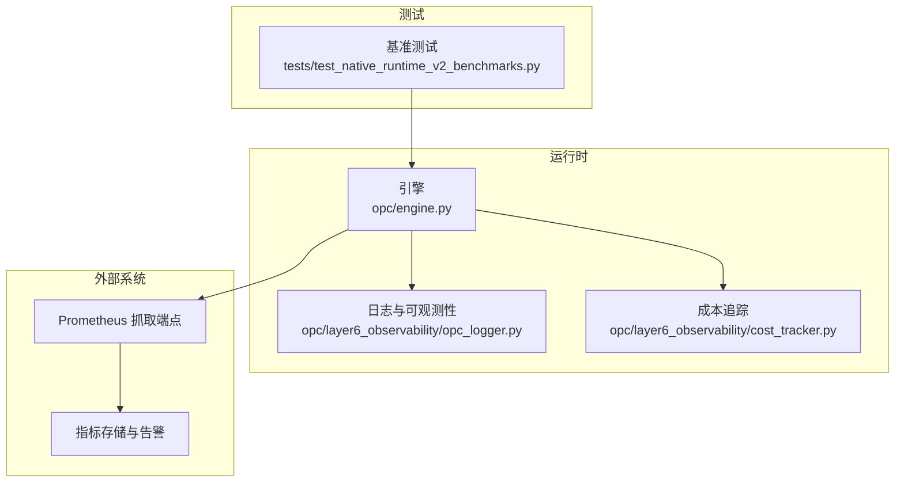
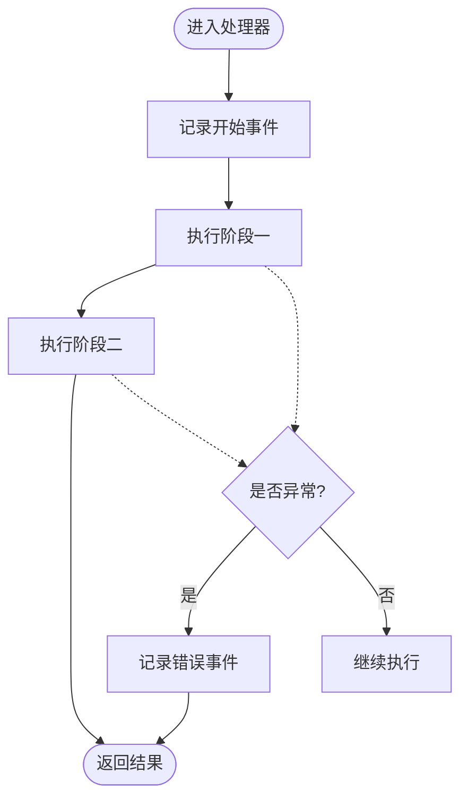
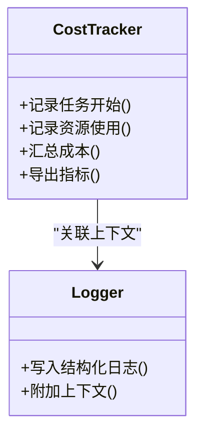
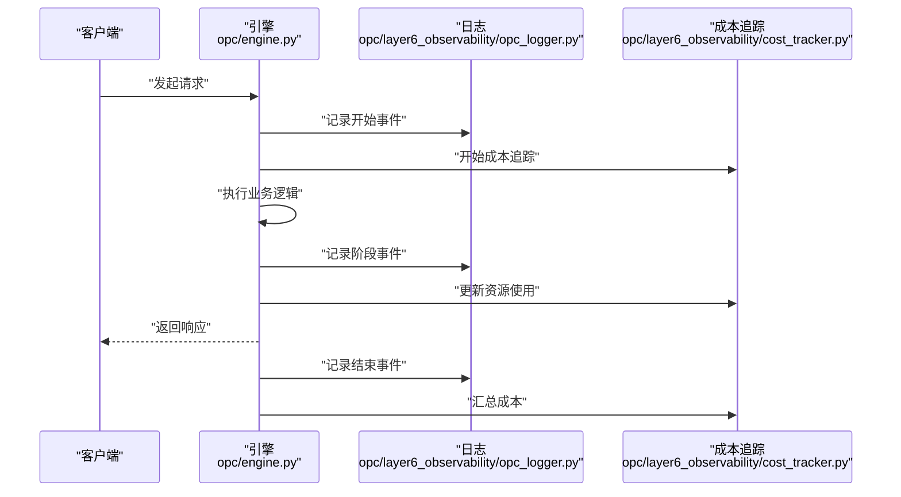
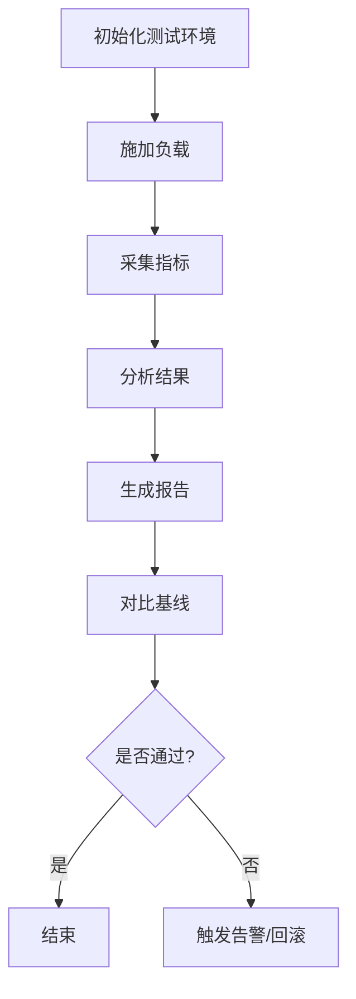
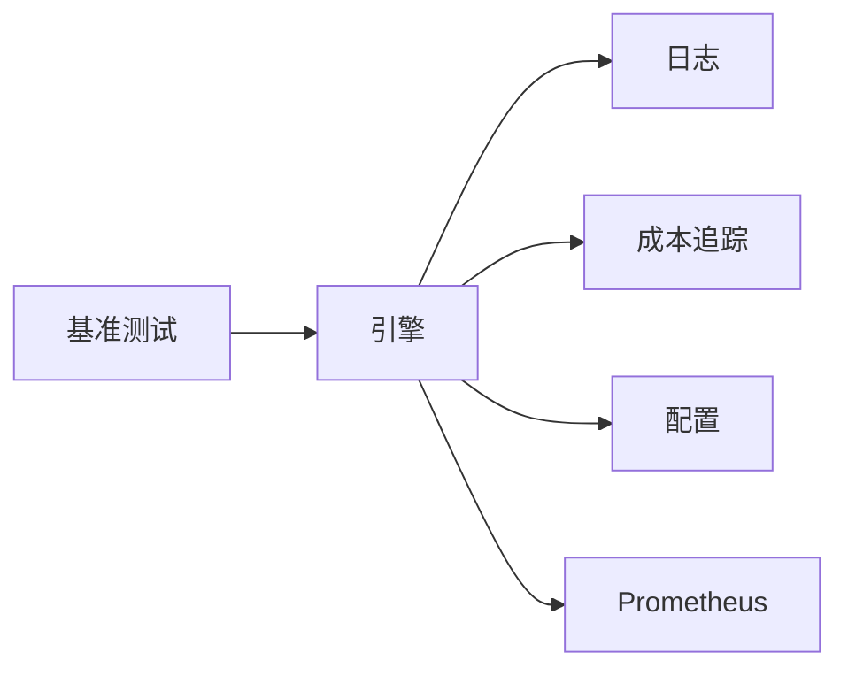

# 性能监控

<cite>
**本文引用的文件**   
- [opc_logger.py](file://opc/layer6_observability/opc_logger.py)
- [cost_tracker.py](file://opc/layer6_observability/cost_tracker.py)
- [engine.py](file://opc/engine.py)
- [agent_config.yaml](file://config/agent_config.yaml)
- [system_config.yaml](file://config/system_config.yaml)
- [test_native_runtime_v2_benchmarks.py](file://tests/test_native_runtime_v2_benchmarks.py)
</cite>

## 目录
1. [简介](#简介)
2. [项目结构](#项目结构)
3. [核心组件](#核心组件)
4. [架构总览](#架构总览)
5. [详细组件分析](#详细组件分析)
6. [依赖分析](#依赖分析)
7. [性能考虑](#性能考虑)
8. [故障排查指南](#故障排查指南)
9. [结论](#结论)
10. [附录](#附录)

## 简介
本指南面向OpenOPC的性能监控与调优，聚焦以下目标：
- 定义并采集关键性能指标：响应时间、吞吐量、资源使用率、并发处理能力。
- 配置性能监控代理与数据收集器，包括Prometheus集成与自定义指标暴露。
- 建立基准测试方法与工具链，覆盖负载与压力场景。
- 识别与分析瓶颈（CPU、内存、I/O、网络）。
- 提供性能调优建议与最佳实践，以及性能回归检测的配置方法。

## 项目结构
OpenOPC的可观测性相关代码集中在可观测性层与引擎入口附近，基准测试位于测试目录。与性能监控直接相关的文件如下：
- 日志与成本追踪：opc/layer6_observability/opc_logger.py、opc/layer6_observability/cost_tracker.py
- 引擎入口：opc/engine.py
- 运行时配置：config/agent_config.yaml、config/system_config.yaml
- 基准测试：tests/test_native_runtime_v2_benchmarks.py

图表来源
- [engine.py](file://opc/engine.py)
- [opc_logger.py](file://opc/layer6_observability/opc_logger.py)
- [cost_tracker.py](file://opc/layer6_observability/cost_tracker.py)
- [agent_config.yaml](file://config/agent_config.yaml)
- [system_config.yaml](file://config/system_config.yaml)
- [test_native_runtime_v2_benchmarks.py](file://tests/test_native_runtime_v2_benchmarks.py)

章节来源
- [opc_logger.py](file://opc/layer6_observability/opc_logger.py)
- [cost_tracker.py](file://opc/layer6_observability/cost_tracker.py)
- [engine.py](file://opc/engine.py)
- [agent_config.yaml](file://config/agent_config.yaml)
- [system_config.yaml](file://config/system_config.yaml)
- [test_native_runtime_v2_benchmarks.py](file://tests/test_native_runtime_v2_benchmarks.py)

## 核心组件
- 日志与可观测性模块：负责结构化日志输出、事件埋点与上下文传播，为上层监控提供基础数据源。
- 成本追踪模块：记录任务执行过程中的资源消耗与成本信息，便于评估吞吐与效率。
- 引擎入口：编排运行流程，串联各子系统，是埋点与指标采集的关键接入点。
- 配置文件：控制代理行为与系统参数，影响性能表现与监控开关。
- 基准测试：提供性能基线与回归检测的自动化手段。

章节来源
- [opc_logger.py](file://opc/layer6_observability/opc_logger.py)
- [cost_tracker.py](file://opc/layer6_observability/cost_tracker.py)
- [engine.py](file://opc/engine.py)
- [agent_config.yaml](file://config/agent_config.yaml)
- [system_config.yaml](file://config/system_config.yaml)
- [test_native_runtime_v2_benchmarks.py](file://tests/test_native_runtime_v2_benchmarks.py)

## 架构总览
下图展示了OpenOPC在性能监控方面的整体架构：引擎作为中心协调者，调用日志与成本追踪能力；配置驱动运行时行为；基准测试对引擎进行压测以产出指标。

图表来源
- [engine.py](file://opc/engine.py)
- [opc_logger.py](file://opc/layer6_observability/opc_logger.py)
- [cost_tracker.py](file://opc/layer6_observability/cost_tracker.py)
- [test_native_runtime_v2_benchmarks.py](file://tests/test_native_runtime_v2_benchmarks.py)

## 详细组件分析

### 组件A：日志与可观测性（opc_logger）
职责与要点
- 提供统一的结构化日志接口，支持按级别、标签与上下文输出，便于后续聚合与检索。
- 在关键路径埋点（如请求开始/结束、阶段切换），为响应时间与吞吐统计提供数据基础。
- 与成本追踪协作，将耗时、资源占用等维度关联到具体任务或会话。

建议的指标埋点位置
- 请求生命周期：进入处理、阶段完成、最终返回。
- 子任务/工具调用：开始、结束、异常分支。
- 资源访问：数据库、外部API、文件系统、消息队列。

图表来源
- [opc_logger.py](file://opc/layer6_observability/opc_logger.py)

章节来源
- [opc_logger.py](file://opc/layer6_observability/opc_logger.py)

### 组件B：成本追踪（cost_tracker）
职责与要点
- 跟踪任务执行的成本与资源消耗，辅助计算单位吞吐成本与效率。
- 与日志模块联动，将成本数据与业务上下文绑定，形成可分析的指标集。

建议的指标
- 单次任务成本、累计成本、成本分布分位数。
- 成本与吞吐量的比值，用于评估性价比。

图表来源
- [cost_tracker.py](file://opc/layer6_observability/cost_tracker.py)
- [opc_logger.py](file://opc/layer6_observability/opc_logger.py)

章节来源
- [cost_tracker.py](file://opc/layer6_observability/cost_tracker.py)
- [opc_logger.py](file://opc/layer6_observability/opc_logger.py)

### 组件C：引擎入口（engine）
职责与要点
- 编排运行流程，串联日志与成本追踪，是性能指标采集的核心接入点。
- 通过配置加载与参数注入，决定监控开关、采样策略与上报频率。

建议的采集点
- 请求级：入站/出站时间戳、状态码、错误类型。
- 任务级：阶段耗时、重试次数、超时标记。
- 资源级：CPU、内存、I/O、网络调用耗时。

图表来源
- [engine.py](file://opc/engine.py)
- [opc_logger.py](file://opc/layer6_observability/opc_logger.py)
- [cost_tracker.py](file://opc/layer6_observability/cost_tracker.py)

章节来源
- [engine.py](file://opc/engine.py)
- [opc_logger.py](file://opc/layer6_observability/opc_logger.py)
- [cost_tracker.py](file://opc/layer6_observability/cost_tracker.py)

### 组件D：配置（agent_config、system_config）
职责与要点
- 控制代理行为与系统参数，影响性能表现与监控开关。
- 建议包含：日志级别、采样率、上报间隔、并发限制、超时阈值、缓存开关等。

建议的配置项（示例说明）
- 监控开关：启用/禁用特定埋点或上报。
- 采样策略：全量/按比例采样，避免高负载下开销过大。
- 上报频率：批量上报周期，降低外部系统压力。
- 并发限制：最大并行度、队列长度、背压策略。
- 超时与重试：防止雪崩，保障稳定性。

章节来源
- [agent_config.yaml](file://config/agent_config.yaml)
- [system_config.yaml](file://config/system_config.yaml)

### 组件E：基准测试（test_native_runtime_v2_benchmarks）
职责与要点
- 提供性能基线与回归检测的自动化手段，覆盖常见负载与压力场景。
- 建议包含：固定并发下的吞吐测试、延迟分位数、错误率、资源使用峰值。

建议的测试场景
- 稳态负载：持续一段时间的稳定QPS，观察P95/P99延迟与吞吐。
- 突发流量：短时尖峰，验证弹性与回退机制。
- 长尾压力：长时间运行，检查内存泄漏与资源累积。
- 降级场景：外部依赖不可用时的容错与恢复。

图表来源
- [test_native_runtime_v2_benchmarks.py](file://tests/test_native_runtime_v2_benchmarks.py)

章节来源
- [test_native_runtime_v2_benchmarks.py](file://tests/test_native_runtime_v2_benchmarks.py)

## 依赖分析
- 组件耦合
  - 引擎依赖日志与成本追踪，二者相对独立，便于替换实现。
  - 配置驱动引擎行为，属于松耦合的外部输入。
  - 基准测试直接调用引擎，不侵入生产代码。
- 外部依赖
  - Prometheus抓取端点：需确保引擎暴露标准格式指标。
  - 指标存储与告警：由外部系统承担，应用侧仅负责上报。

图表来源
- [engine.py](file://opc/engine.py)
- [opc_logger.py](file://opc/layer6_observability/opc_logger.py)
- [cost_tracker.py](file://opc/layer6_observability/cost_tracker.py)
- [agent_config.yaml](file://config/agent_config.yaml)
- [system_config.yaml](file://config/system_config.yaml)
- [test_native_runtime_v2_benchmarks.py](file://tests/test_native_runtime_v2_benchmarks.py)

章节来源
- [engine.py](file://opc/engine.py)
- [opc_logger.py](file://opc/layer6_observability/opc_logger.py)
- [cost_tracker.py](file://opc/layer6_observability/cost_tracker.py)
- [agent_config.yaml](file://config/agent_config.yaml)
- [system_config.yaml](file://config/system_config.yaml)
- [test_native_runtime_v2_benchmarks.py](file://tests/test_native_runtime_v2_benchmarks.py)

## 性能考虑
- 指标定义与采集方法
  - 响应时间：从请求进入引擎到返回响应的端到端耗时，建议记录均值、P95、P99。
  - 吞吐量：单位时间内成功处理的请求数，关注稳定期与峰值期的差异。
  - 资源使用率：CPU、内存、磁盘I/O、网络带宽，结合进程与容器视图。
  - 并发处理能力：最大并行度、队列积压、背压触发情况。
- 监控代理与数据收集器
  - 在引擎中暴露标准指标端点，供Prometheus定期抓取。
  - 使用结构化日志作为补充，便于定位问题与审计。
  - 自定义指标：围绕关键路径与热点操作，避免过度埋点导致额外开销。
- 基准测试与工具链
  - 使用现有基准测试框架扩展场景，覆盖稳态、突发、长尾与降级。
  - 将测试结果纳入CI，设置阈值与回归检测规则。
- 瓶颈识别与分析技术
  - CPU：热点函数火焰图、锁竞争、线程池饱和。
  - 内存：对象分配速率、GC停顿、泄漏检测。
  - I/O：磁盘读写延迟、队列堆积、外部服务慢调用。
  - 网络：连接池耗尽、DNS解析耗时、TLS握手开销。
- 调优建议与最佳实践
  - 合理设置并发上限与队列长度，避免过载。
  - 采用批量与异步上报，降低外部系统压力。
  - 开启按需采样，在高负载时自动降采样。
  - 预热缓存与连接池，减少冷启动抖动。
- 性能回归检测
  - 在基准测试中设定延迟与吞吐阈值，失败即阻断合并。
  - 对比历史基线，自动标注退化趋势。

[本节为通用指导，无需列出具体文件来源]

## 故障排查指南
- 快速定位
  - 查看日志中的错误事件与堆栈，确认异常分支与重试次数。
  - 检查成本追踪的异常路径，定位资源异常增长。
- 指标异常
  - 响应时间突增：检查下游依赖、锁竞争与队列积压。
  - 吞吐下降：检查并发限制、背压与外部限流。
  - 资源使用率异常：检查内存泄漏、频繁GC、磁盘I/O等待。
- 回归检测
  - 基准测试失败时，优先对比最近变更与基线差异。
  - 针对热点路径增加更细粒度的埋点，复现并验证修复效果。

章节来源
- [opc_logger.py](file://opc/layer6_observability/opc_logger.py)
- [cost_tracker.py](file://opc/layer6_observability/cost_tracker.py)
- [test_native_runtime_v2_benchmarks.py](file://tests/test_native_runtime_v2_benchmarks.py)

## 结论
通过在引擎入口集中埋点、配合日志与成本追踪，并结合配置驱动的采样与上报策略，OpenOPC能够实现对响应时间、吞吐、资源使用与并发能力的全面监控。借助基准测试与回归检测，可在持续集成中保障性能质量。建议在上线前完成容量规划与压测，并在运行期持续优化热点路径与资源配置。

[本节为总结性内容，无需列出具体文件来源]

## 附录
- 术语表
  - P95/P99延迟：95%/99%的请求延迟不超过该值。
  - 背压：当系统过载时主动限制上游输入的策略。
  - 基线：用于对比的历史性能参考值。
- 推荐工具
  - Prometheus/Grafana：指标采集与可视化。
  - 压测工具：根据语言生态选择合适工具，结合基准测试脚本。
  - 火焰图与剖析工具：定位CPU热点与锁竞争。

[本节为概念性内容，无需列出具体文件来源]