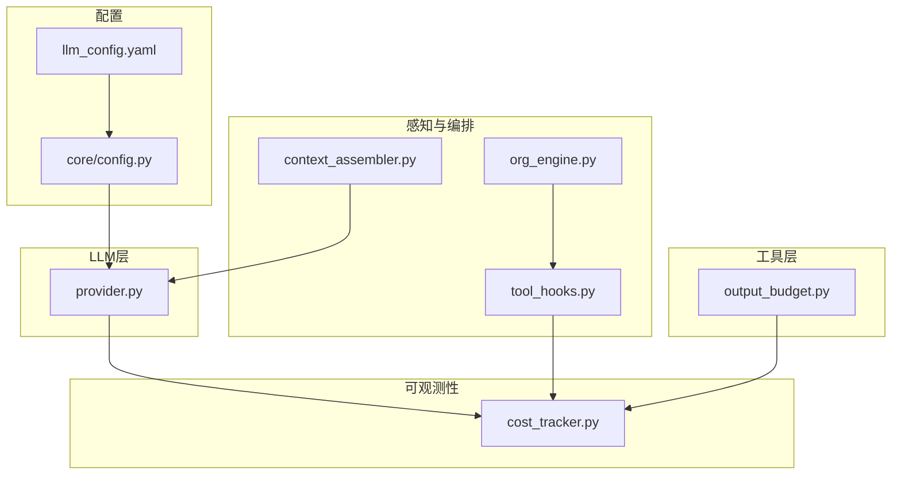
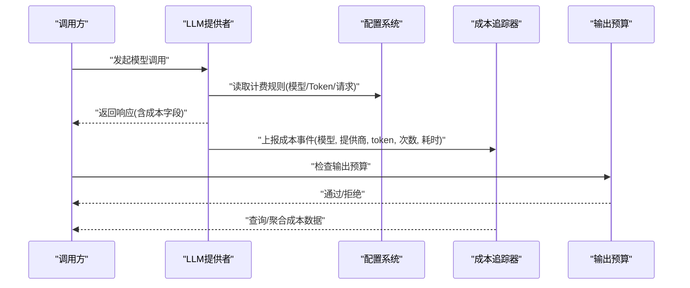
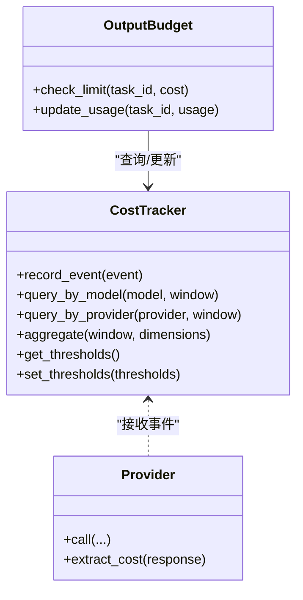
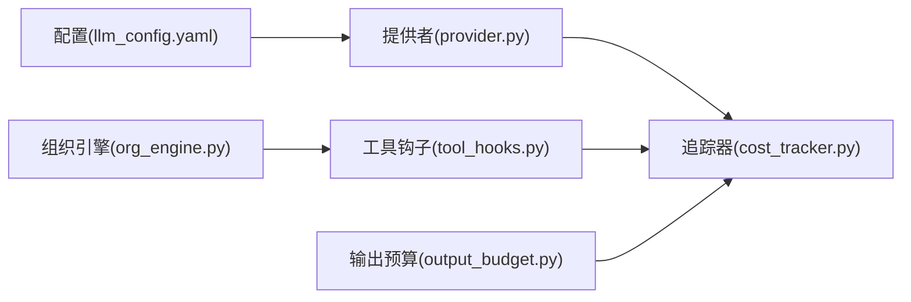

# 成本追踪

<cite>
**本文引用的文件**   
- [opc/layer6_observability/cost_tracker.py](file://opc/layer6_observability/cost_tracker.py)
- [config/llm_config.yaml](file://config/llm_config.yaml)
- [opc/llm/provider.py](file://opc/llm/provider.py)
- [opc/layer4_tools/output_budget.py](file://opc/layer4_tools/output_budget.py)
- [opc/core/config.py](file://opc/core/config.py)
- [opc/layer1_perception/context_assembler.py](file://opc/layer1_perception/context_assembler.py)
- [opc/layer2_organization/org_engine.py](file://opc/layer2_organization/org_engine.py)
- [opc/layer3_agent/runtime_v2/tool_hooks.py](file://opc/layer3_agent/runtime_v2/tool_hooks.py)
</cite>

## 目录
1. [简介](#简介)
2. [项目结构](#项目结构)
3. [核心组件](#核心组件)
4. [架构总览](#架构总览)
5. [详细组件分析](#详细组件分析)
6. [依赖关系分析](#依赖关系分析)
7. [性能与优化](#性能与优化)
8. [故障排查指南](#故障排查指南)
9. [结论](#结论)
10. [附录](#附录)

## 简介
本文件面向OpenOPC的成本追踪能力，系统性说明AI模型调用成本的计算方式、统计维度、配置方法、采集聚合与可视化方案、优化策略与最佳实践，以及成本报告与预算管理。文档以代码级事实为依据，结合架构图与时序图帮助读者快速理解并落地使用。

## 项目结构
OpenOPC将可观测性与成本追踪集中在层6（可观测性）中，并通过LLM提供者抽象在层间传递成本元数据；同时提供输出预算工具用于成本控制。关键路径如下：
- 成本追踪实现：opc/layer6_observability/cost_tracker.py
- LLM计费规则配置：config/llm_config.yaml
- LLM提供者抽象与调用：opc/llm/provider.py
- 输出预算控制：opc/layer4_tools/output_budget.py
- 全局配置加载：opc/core/config.py
- 上下文组装（可能携带成本信息）：opc/layer1_perception/context_assembler.py
- 组织引擎（编排与事件）：opc/layer2_organization/org_engine.py
- 运行时工具钩子（可接入成本上报）：opc/layer3_agent/runtime_v2/tool_hooks.py

图表来源
- [opc/layer6_observability/cost_tracker.py](file://opc/layer6_observability/cost_tracker.py)
- [config/llm_config.yaml](file://config/llm_config.yaml)
- [opc/llm/provider.py](file://opc/llm/provider.py)
- [opc/layer4_tools/output_budget.py](file://opc/layer4_tools/output_budget.py)
- [opc/core/config.py](file://opc/core/config.py)
- [opc/layer1_perception/context_assembler.py](file://opc/layer1_perception/context_assembler.py)
- [opc/layer2_organization/org_engine.py](file://opc/layer2_organization/org_engine.py)
- [opc/layer3_agent/runtime_v2/tool_hooks.py](file://opc/layer3_agent/runtime_v2/tool_hooks.py)

章节来源
- [opc/layer6_observability/cost_tracker.py](file://opc/layer6_observability/cost_tracker.py)
- [config/llm_config.yaml](file://config/llm_config.yaml)
- [opc/llm/provider.py](file://opc/llm/provider.py)
- [opc/layer4_tools/output_budget.py](file://opc/layer4_tools/output_budget.py)
- [opc/core/config.py](file://opc/core/config.py)
- [opc/layer1_perception/context_assembler.py](file://opc/layer1_perception/context_assembler.py)
- [opc/layer2_organization/org_engine.py](file://opc/layer2_organization/org_engine.py)
- [opc/layer3_agent/runtime_v2/tool_hooks.py](file://opc/layer3_agent/runtime_v2/tool_hooks.py)

## 核心组件
- 成本追踪器（Cost Tracker）
  - 负责记录每次LLM调用的成本指标，包括模型名、提供商、输入/输出token数、请求次数、耗时、货币单位等，并提供查询与聚合接口。
- LLM提供者（Provider）
  - 封装不同LLM厂商的调用细节，并在返回结果或中间事件中附带成本相关字段，供上层统一采集。
- 输出预算（Output Budget）
  - 对生成内容长度或成本进行限制，防止单次任务过度消耗。
- 配置系统（Config）
  - 从YAML加载LLM计费规则与默认值，驱动追踪器与提供者的行为。

章节来源
- [opc/layer6_observability/cost_tracker.py](file://opc/layer6_observability/cost_tracker.py)
- [opc/llm/provider.py](file://opc/llm/provider.py)
- [opc/layer4_tools/output_budget.py](file://opc/layer4_tools/output_budget.py)
- [config/llm_config.yaml](file://config/llm_config.yaml)
- [opc/core/config.py](file://opc/core/config.py)

## 架构总览
成本追踪贯穿“配置→调用→采集→聚合→展示”的全链路。配置定义按模型/按token/按请求次数的计费策略；提供者执行时产出成本元数据；追踪器持久化与聚合；上层可通过API或UI消费。

图表来源
- [opc/llm/provider.py](file://opc/llm/provider.py)
- [config/llm_config.yaml](file://config/llm_config.yaml)
- [opc/layer6_observability/cost_tracker.py](file://opc/layer6_observability/cost_tracker.py)
- [opc/layer4_tools/output_budget.py](file://opc/layer4_tools/output_budget.py)

## 详细组件分析

### 成本追踪器（Cost Tracker）
职责
- 接收来自LLM提供者或工具钩子的成本事件。
- 维护时间序列与多维索引（模型、提供商、会话、任务、渠道等）。
- 提供聚合查询（按日/周/月、按模型、按渠道、按用户等）。
- 支持阈值告警与预算联动。

数据结构要点
- 事件：包含模型标识、提供商、输入/输出token、请求次数、耗时、币种、时间戳、关联上下文ID等。
- 索引：按时间窗口与维度键聚合，便于快速汇总。

复杂度与性能
- 写入为O(1)，聚合查询按维度索引近似O(k)（k为分组数量）。
- 建议对高频维度建立缓存视图，降低重复聚合开销。

错误处理
- 对缺失成本字段的事件进行降级处理（如仅计数不累计金额）。
- 对异常数值（负数、NaN）进行过滤与告警。

章节来源
- [opc/layer6_observability/cost_tracker.py](file://opc/layer6_observability/cost_tracker.py)

#### 类关系图（概念映射到源码）

图表来源
- [opc/layer6_observability/cost_tracker.py](file://opc/layer6_observability/cost_tracker.py)
- [opc/llm/provider.py](file://opc/llm/provider.py)
- [opc/layer4_tools/output_budget.py](file://opc/layer4_tools/output_budget.py)

### LLM提供者（Provider）
职责
- 封装各厂商SDK差异，统一入参出参。
- 在响应或流式回调中注入成本字段（如usage、request_count、latency）。
- 根据配置选择计费策略（按模型固定价、按token计价、按请求计价）。

计费策略
- 按模型：同一模型固定单价，忽略token量。
- 按token：依据输入/输出token数乘以单价。
- 按请求：每次成功调用计一次费用（可叠加token费用）。

章节来源
- [opc/llm/provider.py](file://opc/llm/provider.py)
- [config/llm_config.yaml](file://config/llm_config.yaml)

### 输出预算（Output Budget）
职责
- 针对任务或会话设置最大输出token或最大成本上限。
- 在长对话或多轮工具调用中动态扣减剩余配额。
- 触发熔断或降级策略（如切换更便宜模型、截断输出）。

章节来源
- [opc/layer4_tools/output_budget.py](file://opc/layer4_tools/output_budget.py)

### 配置系统（Config）
职责
- 从YAML加载LLM计费规则、默认币种、汇率换算、阈值与预算参数。
- 提供运行时热更新能力（可选）。

章节来源
- [config/llm_config.yaml](file://config/llm_config.yaml)
- [opc/core/config.py](file://opc/core/config.py)

### 上下文组装与工具钩子
- 上下文组装可在构建提示词时附加成本相关的上下文标签（如任务ID、渠道），便于后续归因。
- 工具钩子在工具执行前后插入成本上报逻辑，确保即使非LLM调用也能纳入整体成本视图。

章节来源
- [opc/layer1_perception/context_assembler.py](file://opc/layer1_perception/context_assembler.py)
- [opc/layer3_agent/runtime_v2/tool_hooks.py](file://opc/layer3_agent/runtime_v2/tool_hooks.py)

## 依赖关系分析
- 配置→提供者：提供者读取计费规则决定如何解析响应中的用量字段。
- 提供者→追踪器：提供者将成本事件写入追踪器。
- 工具钩子→追踪器：工具执行路径也可上报成本。
- 输出预算↔追踪器：预算读取历史用量并更新剩余配额。
- 组织引擎→工具钩子：编排流程通过钩子串联成本上报点。

图表来源
- [config/llm_config.yaml](file://config/llm_config.yaml)
- [opc/llm/provider.py](file://opc/llm/provider.py)
- [opc/layer6_observability/cost_tracker.py](file://opc/layer6_observability/cost_tracker.py)
- [opc/layer4_tools/output_budget.py](file://opc/layer4_tools/output_budget.py)
- [opc/layer3_agent/runtime_v2/tool_hooks.py](file://opc/layer3_agent/runtime_v2/tool_hooks.py)
- [opc/layer2_organization/org_engine.py](file://opc/layer2_organization/org_engine.py)

## 性能与优化
- 批量上报：将多次调用合并为批次写入追踪器，减少I/O压力。
- 增量聚合：对常用维度（按日/按模型）维护预聚合视图，避免全量扫描。
- 采样与降采样：对高并发场景采用概率采样或时间窗口降采样。
- 缓存热点键：对频繁查询的模型/渠道组合做短期缓存。
- 预算前置校验：在调用前快速判断是否超预算，避免无效请求。

[本节为通用指导，无需源码引用]

## 故障排查指南
常见问题与定位步骤
- 成本为0或缺失
  - 检查提供者是否正确解析用量字段，确认计费规则已生效。
  - 查看追踪器是否收到事件，核对事件字段完整性。
- 预算未生效
  - 确认输出预算阈值配置与任务绑定关系。
  - 验证预算扣减逻辑是否在工具钩子中被调用。
- 聚合结果异常
  - 检查是否存在负数或NaN等脏数据，确认追踪器的清洗逻辑。
  - 核对时间窗口与维度键是否一致。

章节来源
- [opc/layer6_observability/cost_tracker.py](file://opc/layer6_observability/cost_tracker.py)
- [opc/layer4_tools/output_budget.py](file://opc/layer4_tools/output_budget.py)
- [opc/llm/provider.py](file://opc/llm/provider.py)

## 结论
OpenOPC的成本追踪体系以“配置驱动+提供者透传+追踪器聚合”为核心，覆盖按模型、按token、按请求的多维计费模式，并结合输出预算实现事前控制与事后分析。通过合理的批量、缓存与降采样策略，可在保证精度的前提下获得良好的性能表现。

[本节为总结性内容，无需源码引用]

## 附录

### 计费规则配置示例（YAML）
- 按模型固定价：为每个模型指定单价与币种。
- 按token计价：分别定义输入/输出token单价。
- 按请求计价：定义每次成功调用的基础费用。
- 默认值与覆盖：支持全局默认与按提供商/模型的覆盖。

章节来源
- [config/llm_config.yaml](file://config/llm_config.yaml)

### 实时成本监控与历史趋势
- 实时看板：基于最近N分钟的事件流，展示当前成本速率与Top模型。
- 历史趋势：按日/周/月聚合，对比不同模型与渠道的成本变化。
- 告警阈值：当超过设定阈值时触发通知或自动降级。

章节来源
- [opc/layer6_observability/cost_tracker.py](file://opc/layer6_observability/cost_tracker.py)

### 成本优化策略与最佳实践
- 缓存机制：对相似提示词或工具结果进行缓存，减少重复调用。
- 批量处理：合并多步小任务为大任务，降低请求次数。
- 成本控制阈值：为任务/会话设置最大成本与最大输出token，超限即熔断。
- 模型路由：根据成本与质量权衡，动态选择更经济的模型。

章节来源
- [opc/layer4_tools/output_budget.py](file://opc/layer4_tools/output_budget.py)
- [config/llm_config.yaml](file://config/llm_config.yaml)

### 成本报告与预算管理
- 报告生成：按周期导出CSV/JSON，包含总量、均值、峰值与分布。
- 预算管理：为团队/项目设置月度预算，跟踪实际花费与剩余额度。
- 审计与溯源：关联任务ID、渠道、用户等上下文，支持问题回溯。

章节来源
- [opc/layer6_observability/cost_tracker.py](file://opc/layer6_observability/cost_tracker.py)
- [opc/layer4_tools/output_budget.py](file://opc/layer4_tools/output_budget.py)