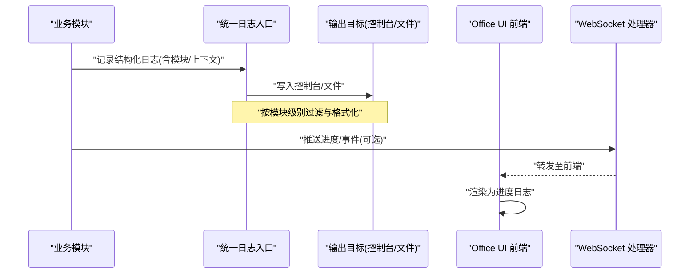
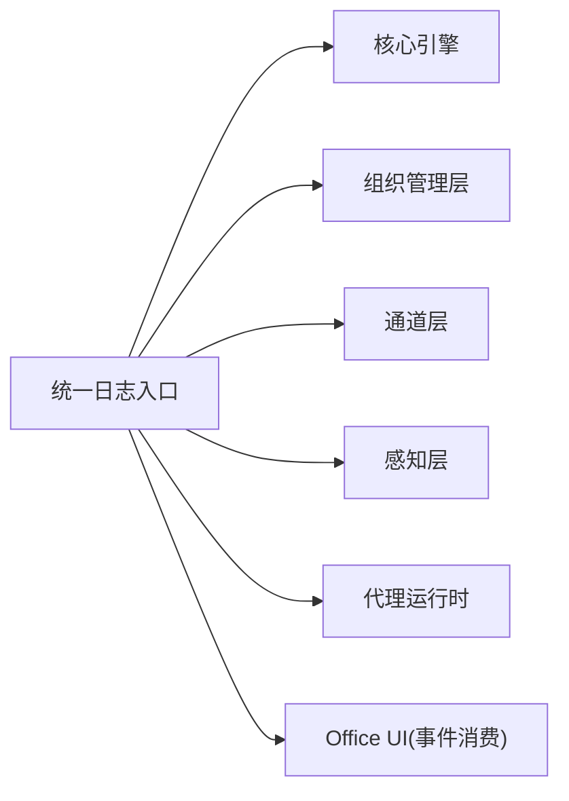

# 日志系统

<cite>
**本文引用的文件**   
- [opc_logger.py](file://opc/layer6_observability/opc_logger.py)
- [cost_tracker.py](file://opc/layer6_observability/cost_tracker.py)
- [engine.py](file://opc/engine.py)
- [org_engine.py](file://opc/layer2_organization/org_engine.py)
- [manager.py](file://opc/channels/manager.py)
- [base.py](file://opc/channels/base.py)
- [message_bus.py](file://opc/layer0_interaction/message_bus.py)
- [context_assembler.py](file://opc/layer1_perception/context_assembler.py)
- [task_router.py](file://opc/layer1_perception/task_router.py)
- [company_runtime.py](file://opc/layer2_organization/company_runtime.py)
- [work_item_runtime.py](file://opc/layer2_organization/work_item_runtime.py)
- [runtime.py](file://opc/layer3_agent/runtime_v2/runtime.py)
- [agent.py](file://opc/plugins/office_ui/services/agent.py)
- [server.py](file://opc/plugins/office_ui/server.py)
- [ws_handler.py](file://opc/plugins/office_ui/ws_handler.py)
- [progressLog.ts](file://opc/plugins/office_ui/frontend_src/lib/progressLog.ts)
</cite>

## 目录
1. [简介](#简介)
2. [项目结构](#项目结构)
3. [核心组件](#核心组件)
4. [架构总览](#架构总览)
5. [详细组件分析](#详细组件分析)
6. [依赖关系分析](#依赖关系分析)
7. [性能考虑](#性能考虑)
8. [故障排查指南](#故障排查指南)
9. [结论](#结论)
10. [附录](#附录)

## 简介
本文件面向 OpenOPC 的日志系统，系统性阐述其架构设计、实现原理与使用实践。内容覆盖：
- 内置日志系统的层次化设计与模块级控制
- 日志级别配置、格式化选项与输出目标设置
- 结构化日志、上下文信息注入与敏感数据脱敏最佳实践
- 日志轮转策略与存储管理建议
- 日志查询与分析工具的使用指南
- 生产环境高效收集与分析的实践方案

## 项目结构
OpenOPC 将可观测性与日志能力集中在 layer6_observability 中，并通过各层（通道层、感知层、组织管理层、代理运行时等）按需接入。前端 Office UI 通过 WebSocket 接收进度事件并渲染到界面。

```mermaid
graph TB
subgraph "可观测性层"
Logger["opc_logger.py<br/>统一日志入口"]
CostTracker["cost_tracker.py<br/>成本追踪(可选)"]
end
subgraph "核心引擎"
Engine["engine.py<br/>主引擎"]
OrgEngine["org_engine.py<br/>组织引擎"]
end
subgraph "通道层"
ChanMgr["channels/manager.py<br/>通道管理器"]
ChanBase["channels/base.py<br/>通道基类"]
end
subgraph "感知层"
CtxAsm["layer1_perception/context_assembler.py"]
TaskRouter["layer1_perception/task_router.py"]
end
subgraph "组织管理层"
CompanyRT["layer2_organization/company_runtime.py"]
WorkItemRT["layer2_organization/work_item_runtime.py"]
end
subgraph "代理运行时"
AgentRT["layer3_agent/runtime_v2/runtime.py"]
end
subgraph "Office UI"
Server["plugins/office_ui/server.py"]
WSHandler["plugins/office_ui/ws_handler.py"]
ProgressLog["frontend_src/lib/progressLog.ts"]
end
Logger --> Engine
Logger --> OrgEngine
Logger --> ChanMgr
Logger --> ChanBase
Logger --> CtxAsm
Logger --> TaskRouter
Logger --> CompanyRT
Logger --> WorkItemRT
Logger --> AgentRT
Server --> WSHandler
WSHandler --> ProgressLog
```

图表来源
- [opc_logger.py](file://opc/layer6_observability/opc_logger.py)
- [engine.py](file://opc/engine.py)
- [org_engine.py](file://opc/layer2_organization/org_engine.py)
- [manager.py](file://opc/channels/manager.py)
- [base.py](file://opc/channels/base.py)
- [context_assembler.py](file://opc/layer1_perception/context_assembler.py)
- [task_router.py](file://opc/layer1_perception/task_router.py)
- [company_runtime.py](file://opc/layer2_organization/company_runtime.py)
- [work_item_runtime.py](file://opc/layer2_organization/work_item_runtime.py)
- [runtime.py](file://opc/layer3_agent/runtime_v2/runtime.py)
- [server.py](file://opc/plugins/office_ui/server.py)
- [ws_handler.py](file://opc/plugins/office_ui/ws_handler.py)
- [progressLog.ts](file://opc/plugins/office_ui/frontend_src/lib/progressLog.ts)

章节来源
- [opc_logger.py](file://opc/layer6_observability/opc_logger.py)
- [engine.py](file://opc/engine.py)
- [org_engine.py](file://opc/layer2_organization/org_engine.py)
- [manager.py](file://opc/channels/manager.py)
- [base.py](file://opc/channels/base.py)
- [context_assembler.py](file://opc/layer1_perception/context_assembler.py)
- [task_router.py](file://opc/layer1_perception/task_router.py)
- [company_runtime.py](file://opc/layer2_organization/company_runtime.py)
- [work_item_runtime.py](file://opc/layer2_organization/work_item_runtime.py)
- [runtime.py](file://opc/layer3_agent/runtime_v2/runtime.py)
- [server.py](file://opc/plugins/office_ui/server.py)
- [ws_handler.py](file://opc/plugins/office_ui/ws_handler.py)
- [progressLog.ts](file://opc/plugins/office_ui/frontend_src/lib/progressLog.ts)

## 核心组件
- 统一日志入口
  - 提供统一的日志记录接口，供各层调用。
  - 支持按模块名或命名空间进行日志级别控制。
  - 支持结构化字段注入，便于后续检索与分析。
- 成本追踪（可选）
  - 在需要时记录与 LLM 调用相关的成本指标，便于资源治理。
- 前端进度日志
  - Office UI 通过 WebSocket 接收后端事件，并在前端以“进度日志”的形式呈现，辅助用户理解执行状态。

章节来源
- [opc_logger.py](file://opc/layer6_observability/opc_logger.py)
- [cost_tracker.py](file://opc/layer6_observability/cost_tracker.py)
- [progressLog.ts](file://opc/plugins/office_ui/frontend_src/lib/progressLog.ts)

## 架构总览
OpenOPC 的日志体系采用“集中式入口 + 分层消费”的模式：
- 所有 Python 模块通过统一日志入口记录日志，避免分散的 logger 实例导致配置不一致。
- 日志级别可按模块路径动态调整，满足“核心引擎、通道层、组织管理层”等独立控制需求。
- 结构化字段贯穿全链路，结合上下文注入，提升排障效率。
- 前端通过 WebSocket 获取关键进度事件，形成可视化“进度日志”。

图表来源
- [opc_logger.py](file://opc/layer6_observability/opc_logger.py)
- [ws_handler.py](file://opc/plugins/office_ui/ws_handler.py)
- [progressLog.ts](file://opc/plugins/office_ui/frontend_src/lib/progressLog.ts)

## 详细组件分析

### 统一日志入口（Python 侧）
- 职责
  - 提供一致的日志 API，屏蔽底层差异。
  - 支持按模块路径设置不同日志级别。
  - 支持结构化字段注入，便于聚合与检索。
- 典型用法
  - 在任意模块中通过统一入口记录日志，附带业务上下文键值对。
  - 根据运行环境切换输出目标（控制台、文件等）。
- 注意事项
  - 避免直接打印敏感信息；如需记录，应进行脱敏处理。
  - 合理选择日志级别，减少噪声。

章节来源
- [opc_logger.py](file://opc/layer6_observability/opc_logger.py)

### 成本追踪（可选）
- 职责
  - 在涉及外部模型调用的路径上，记录成本相关指标。
- 适用场景
  - 预算控制、用量统计、成本归因分析。

章节来源
- [cost_tracker.py](file://opc/layer6_observability/cost_tracker.py)

### 核心引擎与组织管理层
- 核心引擎
  - 在启动、任务调度、异常恢复等关键路径记录结构化日志。
- 组织管理层
  - 在角色/岗位生命周期、工作项流转、审批与协作等关键节点记录日志，便于审计与回溯。

章节来源
- [engine.py](file://opc/engine.py)
- [org_engine.py](file://opc/layer2_organization/org_engine.py)
- [company_runtime.py](file://opc/layer2_organization/company_runtime.py)
- [work_item_runtime.py](file://opc/layer2_organization/work_item_runtime.py)

### 通道层
- 通道管理器与通道基类
  - 在连接建立、消息收发、重试与错误上报等路径记录日志。
  - 支持按通道类型区分日志前缀，便于定位问题。

章节来源
- [manager.py](file://opc/channels/manager.py)
- [base.py](file://opc/channels/base.py)

### 感知层
- 上下文组装器与任务路由器
  - 在上下文构建、路由决策、缓存命中/失效等路径记录日志，帮助诊断上下文缺失或路由异常。

章节来源
- [context_assembler.py](file://opc/layer1_perception/context_assembler.py)
- [task_router.py](file://opc/layer1_perception/task_router.py)

### 代理运行时
- 代理运行时 v2
  - 在工具执行、子代理创建、权限校验、流式输出等路径记录日志，支撑端到端可观测性。

章节来源
- [runtime.py](file://opc/layer3_agent/runtime_v2/runtime.py)

### Office UI 前端进度日志
- 职责
  - 通过 WebSocket 接收后端事件，渲染为“进度日志”，帮助用户理解执行过程。
- 交互流程
  - 后端推送事件 → WebSocket 处理器转发 → 前端订阅并渲染。

章节来源
- [server.py](file://opc/plugins/office_ui/server.py)
- [ws_handler.py](file://opc/plugins/office_ui/ws_handler.py)
- [progressLog.ts](file://opc/plugins/office_ui/frontend_src/lib/progressLog.ts)

## 依赖关系分析
- 耦合与内聚
  - 日志入口与各业务模块松耦合，仅依赖统一接口；模块内部高内聚，关注自身领域逻辑。
- 外部依赖
  - 日志输出目标可能依赖标准库或第三方库（如文件轮转），但通过统一入口屏蔽差异。
- 潜在循环依赖
  - 日志入口应避免反向依赖业务模块，防止循环导入。

图表来源
- [opc_logger.py](file://opc/layer6_observability/opc_logger.py)
- [engine.py](file://opc/engine.py)
- [org_engine.py](file://opc/layer2_organization/org_engine.py)
- [manager.py](file://opc/channels/manager.py)
- [base.py](file://opc/channels/base.py)
- [context_assembler.py](file://opc/layer1_perception/context_assembler.py)
- [task_router.py](file://opc/layer1_perception/task_router.py)
- [runtime.py](file://opc/layer3_agent/runtime_v2/runtime.py)
- [server.py](file://opc/plugins/office_ui/server.py)
- [ws_handler.py](file://opc/plugins/office_ui/ws_handler.py)

## 性能考虑
- 日志级别控制
  - 在生产环境默认降低非必要模块的日志级别，减少 I/O 开销。
- 异步与批处理
  - 在高吞吐路径，优先使用异步或批量落盘策略，降低阻塞风险。
- 结构化字段
  - 使用固定键名的结构化字段，避免频繁字符串拼接，提高解析效率。
- 采样与降采样
  - 对高频事件启用采样策略，保留代表性样本用于分析。
- 前端渲染
  - 前端“进度日志”需做节流与折叠，避免大量事件造成 UI 卡顿。

[本节为通用指导，不直接分析具体文件]

## 故障排查指南
- 快速定位
  - 通过模块路径筛选日志，缩小范围。
  - 利用结构化字段（如会话 ID、工作项 ID、通道名称）进行关联查询。
- 常见问题
  - 日志缺失：检查对应模块是否通过统一入口记录日志。
  - 级别过高：临时提升特定模块级别，复现后恢复。
  - 敏感信息泄露：确认脱敏规则生效，必要时增加白名单校验。
- 前端进度日志
  - 若未显示：检查 WebSocket 连接与事件推送是否正常。
  - 若卡顿：检查前端渲染逻辑与事件频率。

章节来源
- [opc_logger.py](file://opc/layer6_observability/opc_logger.py)
- [ws_handler.py](file://opc/plugins/office_ui/ws_handler.py)
- [progressLog.ts](file://opc/plugins/office_ui/frontend_src/lib/progressLog.ts)

## 结论
OpenOPC 的日志系统以统一入口为核心，配合模块化级别控制与结构化字段，实现了跨层可观测性。结合前端“进度日志”，既满足运维排障，也提升了用户体验。建议在生产环境中严格遵循结构化与脱敏规范，并配合合适的轮转与采集策略，确保日志的可维护性与可分析性。

[本节为总结性内容，不直接分析具体文件]

## 附录

### 日志级别配置与模块控制
- 全局默认级别
  - 建议生产环境默认 INFO 或 WARNING，开发环境 DEBUG。
- 模块级覆盖
  - 通过模块路径精确覆盖，例如：
    - 核心引擎：提高或降低级别以聚焦关键路径。
    - 通道层：针对特定通道类型单独调整。
    - 组织管理层：在工作项流转密集阶段适度提升级别。
- 动态调整
  - 支持运行时调整，无需重启服务。

章节来源
- [opc_logger.py](file://opc/layer6_observability/opc_logger.py)
- [engine.py](file://opc/engine.py)
- [manager.py](file://opc/channels/manager.py)
- [org_engine.py](file://opc/layer2_organization/org_engine.py)

### 格式化选项与输出目标
- 格式模板
  - 时间戳、模块名、级别、结构化字段、消息体。
- 输出目标
  - 控制台：调试与本地验证。
  - 文件：生产持久化，建议按模块或日期分片。
- 编码与换行
  - 统一 UTF-8，避免跨平台解析问题。

章节来源
- [opc_logger.py](file://opc/layer6_observability/opc_logger.py)

### 结构化日志与上下文注入
- 结构化字段
  - 固定键名：会话 ID、工作项 ID、通道名称、请求 ID、用户标识等。
- 上下文注入
  - 在请求/任务入口处注入上下文，自动附加到后续日志。
- 敏感数据脱敏
  - 对密码、令牌、个人身份信息等进行掩码或哈希处理。

章节来源
- [opc_logger.py](file://opc/layer6_observability/opc_logger.py)
- [context_assembler.py](file://opc/layer1_perception/context_assembler.py)
- [work_item_runtime.py](file://opc/layer2_organization/work_item_runtime.py)

### 日志轮转与存储管理
- 轮转策略
  - 按大小或时间轮转，保留 N 天或 M 个历史文件。
- 压缩归档
  - 对过期文件进行压缩，节省磁盘空间。
- 清理策略
  - 定期清理超过保留期的日志，避免磁盘爆满。
- 索引与检索
  - 结合日志采集系统建立索引，提升查询效率。

[本节为通用指导，不直接分析具体文件]

### 日志查询与分析工具
- 命令行工具
  - 使用 grep/awk/sed 进行文本过滤与聚合。
- 日志采集与聚合
  - 使用集中式日志系统（如 ELK、Loki）进行采集、索引与可视化。
- 前端进度日志
  - 在前端面板查看实时进度，结合后端日志进行交叉分析。

章节来源
- [progressLog.ts](file://opc/plugins/office_ui/frontend_src/lib/progressLog.ts)
- [ws_handler.py](file://opc/plugins/office_ui/ws_handler.py)

### 生产环境高效收集与分析
- 采集
  - 使用 Filebeat/Fluent Bit 等采集器，按模块路径定向采集。
- 传输
  - 使用可靠队列或 TLS 加密传输，保证完整性与安全性。
- 存储
  - 冷热分层存储，热数据近线，冷数据归档。
- 告警
  - 基于关键字与阈值设置告警规则，及时发现问题。
- 演练
  - 定期进行故障注入与日志回放演练，验证可观测性有效性。

[本节为通用指导，不直接分析具体文件]