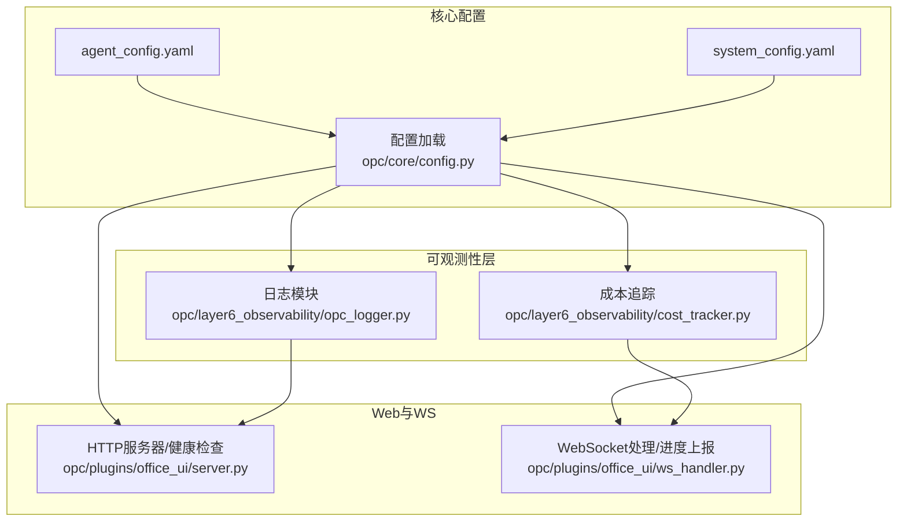
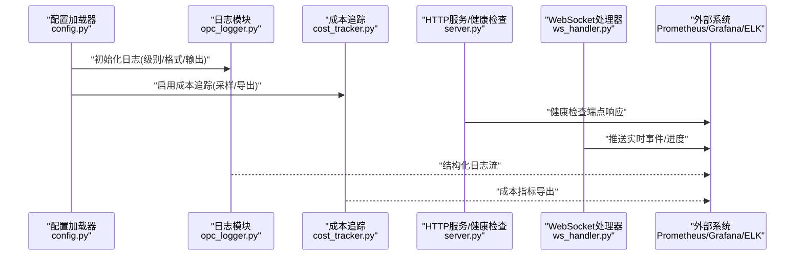
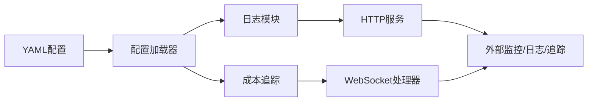

# 监控与可观测性

<cite>
**本文引用的文件**   
- [opc_logger.py](file://opc/layer6_observability/opc_logger.py)
- [cost_tracker.py](file://opc/layer6_observability/cost_tracker.py)
- [config.py](file://opc/core/config.py)
- [server.py](file://opc/plugins/office_ui/server.py)
- [ws_handler.py](file://opc/plugins/office_ui/ws_handler.py)
- [agent_config.yaml](file://config/agent_config.yaml)
- [system_config.yaml](file://config/system_config.yaml)
</cite>

## 目录
1. [简介](#简介)
2. [项目结构](#项目结构)
3. [核心组件](#核心组件)
4. [架构总览](#架构总览)
5. [详细组件分析](#详细组件分析)
6. [依赖关系分析](#依赖关系分析)
7. [性能考虑](#性能考虑)
8. [故障诊断指南](#故障诊断指南)
9. [结论](#结论)
10. [附录](#附录)

## 简介
本指南面向OpenOPC的运维与SRE团队，聚焦于构建系统的“监控与可观测性”能力。内容覆盖：
- 内置日志系统：级别、格式化、输出目标与滚动策略
- 成本追踪：配置与指标收集
- 性能监控：采集与可视化（Prometheus/Grafana）
- 分布式追踪：配置与实现建议
- 告警规则与通知渠道
- 健康检查端点
- 慢查询分析与瓶颈定位
- 故障诊断工具链集成

目标是帮助你在生产环境中快速建立稳定、可扩展的可观测性体系，提升排障效率与系统稳定性。

## 项目结构
OpenOPC的可观测性相关代码集中在以下位置：
- 日志与成本追踪：opc/layer6_observability
- 运行时配置加载：opc/core/config.py
- Web服务与健康检查：opc/plugins/office_ui/server.py
- WebSocket事件与进度上报：opc/plugins/office_ui/ws_handler.py
- 配置文件：config/*.yaml

图表来源
- [opc_logger.py](file://opc/layer6_observability/opc_logger.py)
- [cost_tracker.py](file://opc/layer6_observability/cost_tracker.py)
- [config.py](file://opc/core/config.py)
- [server.py](file://opc/plugins/office_ui/server.py)
- [ws_handler.py](file://opc/plugins/office_ui/ws_handler.py)
- [agent_config.yaml](file://config/agent_config.yaml)
- [system_config.yaml](file://config/system_config.yaml)

章节来源
- [config.py](file://opc/core/config.py)
- [server.py](file://opc/plugins/office_ui/server.py)
- [ws_handler.py](file://opc/plugins/office_ui/ws_handler.py)
- [opc_logger.py](file://opc/layer6_observability/opc_logger.py)
- [cost_tracker.py](file://opc/layer6_observability/cost_tracker.py)
- [agent_config.yaml](file://config/agent_config.yaml)
- [system_config.yaml](file://config/system_config.yaml)

## 核心组件
- 日志子系统
  - 负责统一日志初始化、级别控制、格式化模板、输出目标（控制台/文件/外部系统）以及按大小或时间轮转。
  - 关键入口位于日志模块中，供各层调用。
- 成本追踪子系统
  - 负责记录LLM调用相关的token用量、耗时、错误等成本维度指标，支持聚合与导出。
  - 通过配置开关与采样率控制开销。
- 配置中心
  - 提供统一的配置加载与校验，将YAML配置映射为运行时对象，驱动日志与成本追踪行为。
- Web服务与健康检查
  - 提供HTTP接口，包括健康检查端点，便于Kubernetes探针与外部监控系统探测。
- WebSocket事件通道
  - 用于推送任务进度、状态变更与部分遥测数据，可作为实时指标补充。

章节来源
- [opc_logger.py](file://opc/layer6_observability/opc_logger.py)
- [cost_tracker.py](file://opc/layer6_observability/cost_tracker.py)
- [config.py](file://opc/core/config.py)
- [server.py](file://opc/plugins/office_ui/server.py)
- [ws_handler.py](file://opc/plugins/office_ui/ws_handler.py)

## 架构总览
下图展示了从配置到运行时可观测性的整体链路：配置加载驱动日志与成本追踪；Web服务暴露健康检查；WebSocket通道承载实时事件；最终由外部系统（如Prometheus/Grafana/ELK）进行采集与可视化。

图表来源
- [config.py](file://opc/core/config.py)
- [opc_logger.py](file://opc/layer6_observability/opc_logger.py)
- [cost_tracker.py](file://opc/layer6_observability/cost_tracker.py)
- [server.py](file://opc/plugins/office_ui/server.py)
- [ws_handler.py](file://opc/plugins/office_ui/ws_handler.py)

## 详细组件分析

### 日志子系统配置与使用
- 功能要点
  - 日志级别：支持DEBUG/INFO/WARNING/ERROR等，可通过配置动态调整。
  - 格式化：支持JSON结构化输出，包含时间戳、级别、模块、请求ID、上下文键值对等字段。
  - 输出目标：控制台、本地文件、远程日志系统（如Syslog/HTTP）。
  - 轮转策略：按文件大小或时间周期切分，保留天数可配。
- 配置项建议
  - 在系统配置中设置全局日志级别与默认格式。
  - 针对特定模块或通道设置更细粒度的日志级别。
  - 指定输出路径与轮转参数。
- 使用方式
  - 在业务逻辑中通过日志模块提供的接口记录结构化日志。
  - 结合请求ID/会话ID进行跨组件关联。
- 最佳实践
  - 生产环境默认INFO及以上级别，避免过多调试信息。
  - 敏感字段脱敏后再写入日志。
  - 使用JSON格式以便集中式日志平台解析。

章节来源
- [opc_logger.py](file://opc/layer6_observability/opc_logger.py)
- [system_config.yaml](file://config/system_config.yaml)

### 成本追踪配置与指标收集
- 功能要点
  - 记录每次LLM调用的token用量、延迟、错误码、模型名称、调用方标识等。
  - 支持采样率控制，降低高并发下的额外开销。
  - 提供聚合视图与导出接口，便于接入外部监控系统。
- 配置项建议
  - 开启/关闭成本追踪。
  - 设置采样率（例如10%全量，其余采样）。
  - 指定导出目标（本地指标文件或远端指标服务）。
- 指标示例
  - 调用次数、成功/失败比率、平均/分位耗时、token总量、错误分布。
- 集成方案
  - 将成本指标以标准格式暴露给Prometheus抓取。
  - 或将结构化日志输出至ELK/ Loki进行检索与分析。

章节来源
- [cost_tracker.py](file://opc/layer6_observability/cost_tracker.py)
- [agent_config.yaml](file://config/agent_config.yaml)

### 性能监控指标采集与可视化（Prometheus + Grafana）
- 指标来源
  - 应用内自定义指标（如QPS、延迟、错误率、资源使用）。
  - 成本追踪导出的指标。
  - 系统级指标（CPU、内存、磁盘、网络）。
- 采集方式
  - 在HTTP服务中暴露/metrics端点，供Prometheus抓取。
  - 或通过Sidecar/Exporter将内部指标转换为Prometheus格式。
- 可视化
  - 在Grafana中创建仪表盘，展示关键SLO/SLI。
  - 基于成本指标构建“单位产出成本”看板。
- 注意事项
  - 指标标签需规范化，避免基数爆炸。
  - 合理设置抓取间隔与保留策略。

章节来源
- [server.py](file://opc/plugins/office_ui/server.py)
- [cost_tracker.py](file://opc/layer6_observability/cost_tracker.py)

### 分布式追踪配置与实现
- 概念说明
  - 分布式追踪用于跨进程/服务的请求链路跟踪，通常采用TraceId/SpanId贯穿调用链。
- 实现建议
  - 在HTTP/WebSocket入口处生成并注入TraceId。
  - 在关键操作处埋点，形成Span树。
  - 将TraceId写入日志，便于与日志关联。
  - 对接Jaeger/Zipkin/OpenTelemetry Collector等后端。
- 与现有系统集成
  - 在日志模块中自动附加TraceId字段。
  - 在成本追踪中记录TraceId，便于定位高成本请求。

章节来源
- [opc_logger.py](file://opc/layer6_observability/opc_logger.py)
- [ws_handler.py](file://opc/plugins/office_ui/ws_handler.py)

### 告警规则定义与通知渠道
- 告警规则
  - 错误率阈值、延迟P99超阈、成本异常增长、健康检查失败等。
  - 建议使用PromQL编写规则，并通过Alertmanager路由。
- 通知渠道
  - 邮件、企业微信、钉钉、飞书、Slack、PagerDuty等。
  - 根据组织规范选择合适渠道，并设置静默期与升级策略。
- 联动机制
  - 告警触发后自动创建工单或拉取相关日志/追踪上下文。

章节来源
- [server.py](file://opc/plugins/office_ui/server.py)
- [ws_handler.py](file://opc/plugins/office_ui/ws_handler.py)

### 健康检查端点配置与监控
- 端点设计
  - /healthz：存活探针，返回200表示进程存活。
  - /ready：就绪探针，检查依赖（数据库、缓存、外部服务）是否可用。
- 实现要点
  - 轻量快速，避免阻塞。
  - 依赖检查失败时返回非200状态码。
- 监控集成
  - Kubernetes Liveness/Readiness探针直接调用。
  - 外部监控系统定期探测并告警。

章节来源
- [server.py](file://opc/plugins/office_ui/server.py)

### 慢查询分析与性能瓶颈定位
- 方法
  - 在关键IO路径（数据库、外部API、文件系统）记录耗时与上下文。
  - 基于分位统计识别慢请求，结合TraceId定位根因。
  - 使用成本追踪指标辅助判断是否为LLM调用导致的延迟高峰。
- 工具链
  - APM（如SkyWalking/Jaeger）采集Span。
  - 日志平台（ELK/Loki）检索结构化日志。
  - 指标平台（Prometheus/Grafana）观察趋势与峰值。

章节来源
- [cost_tracker.py](file://opc/layer6_observability/cost_tracker.py)
- [ws_handler.py](file://opc/plugins/office_ui/ws_handler.py)

### 故障诊断与问题排查工具链
- 推荐组合
  - 日志：集中化存储与检索（ELK/Loki）。
  - 指标：Prometheus + Grafana。
  - 追踪：Jaeger/Zipkin/OpenTelemetry。
  - 告警：Alertmanager + 多渠道通知。
- 流程
  - 从Grafana发现异常指标 -> 通过TraceId拉取日志与追踪 -> 定位具体调用链与参数 -> 复现与修复。

章节来源
- [opc_logger.py](file://opc/layer6_observability/opc_logger.py)
- [server.py](file://opc/plugins/office_ui/server.py)
- [ws_handler.py](file://opc/plugins/office_ui/ws_handler.py)

## 依赖关系分析
- 配置驱动
  - YAML配置经配置加载器解析后，影响日志与成本追踪的行为。
- 组件耦合
  - 日志与成本追踪相对独立，均被上层服务与处理器引用。
  - Web服务与健康检查对外暴露，不反向依赖日志/成本模块的具体实现细节。
- 外部依赖
  - Prometheus/Grafana/ELK/Jaeger等为可选外部系统，通过标准协议或SDK集成。

图表来源
- [config.py](file://opc/core/config.py)
- [opc_logger.py](file://opc/layer6_observability/opc_logger.py)
- [cost_tracker.py](file://opc/layer6_observability/cost_tracker.py)
- [server.py](file://opc/plugins/office_ui/server.py)
- [ws_handler.py](file://opc/plugins/office_ui/ws_handler.py)

章节来源
- [config.py](file://opc/core/config.py)
- [server.py](file://opc/plugins/office_ui/server.py)
- [ws_handler.py](file://opc/plugins/office_ui/ws_handler.py)

## 性能考虑
- 日志开销
  - 生产环境避免过高的DEBUG级别；使用异步写入与批量落盘。
  - JSON格式便于解析但体积较大，需权衡吞吐与可观测性。
- 成本追踪
  - 使用采样率控制高频调用场景的额外开销。
  - 指标导出采用批量化与压缩传输。
- 指标基数
  - 标签数量与取值范围需严格控制，防止Prometheus内存膨胀。
- 健康检查
  - 保持轻量，避免引入额外依赖检查的超时风险。

[本节为通用指导，无需列出具体文件来源]

## 故障诊断指南
- 常见问题
  - 健康检查失败：检查依赖服务可用性、端口占用、权限与证书。
  - 日志缺失：确认输出目标可达、轮转策略未导致丢失、权限正确。
  - 指标不更新：确认/metrics端点可达、抓取间隔与防火墙策略。
  - 追踪断链：确认TraceId注入与传递完整，网关/代理未丢弃头。
- 排查步骤
  - 从Grafana定位异常时间点 -> 拉取对应TraceId的日志与追踪 -> 分析上游依赖与资源使用 -> 复现与修复。
- 工具链建议
  - 使用统一日志索引与追踪后端，建立跨系统关联。
  - 在告警中包含TraceId与关键指标快照，缩短MTTR。

章节来源
- [server.py](file://opc/plugins/office_ui/server.py)
- [opc_logger.py](file://opc/layer6_observability/opc_logger.py)
- [cost_tracker.py](file://opc/layer6_observability/cost_tracker.py)

## 结论
通过统一的日志与成本追踪、标准化的健康检查与指标导出、完善的告警与通知机制，以及分布式追踪与集中式日志平台的协同，OpenOPC可在生产环境中实现高可观测性与高效运维。建议在上线前完成端到端的演练，确保指标、日志、追踪与告警链路畅通。

[本节为总结性内容，无需列出具体文件来源]

## 附录
- 配置清单建议
  - 日志：级别、格式、输出目标、轮转策略、模块级别覆盖。
  - 成本追踪：开关、采样率、导出目标、指标命名规范。
  - 健康检查：存活/就绪端点、依赖检查项、超时与重试。
  - 指标：标签规范、抓取间隔、保留策略。
  - 告警：规则、阈值、通知渠道、升级策略。
- 参考文件
  - 配置加载与系统配置：[config.py](file://opc/core/config.py)、[system_config.yaml](file://config/system_config.yaml)
  - 日志与成本追踪：[opc_logger.py](file://opc/layer6_observability/opc_logger.py)、[cost_tracker.py](file://opc/layer6_observability/cost_tracker.py)
  - Web与WS：[server.py](file://opc/plugins/office_ui/server.py)、[ws_handler.py](file://opc/plugins/office_ui/ws_handler.py)
  - Agent配置：[agent_config.yaml](file://config/agent_config.yaml)