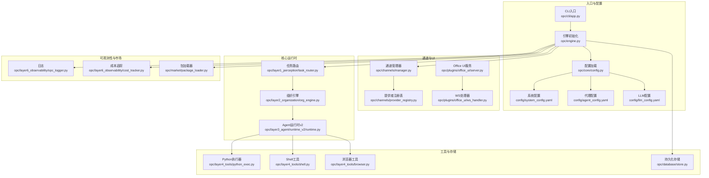
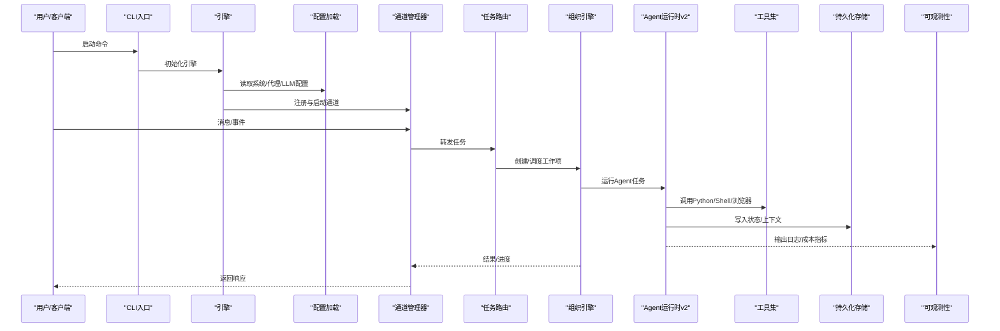
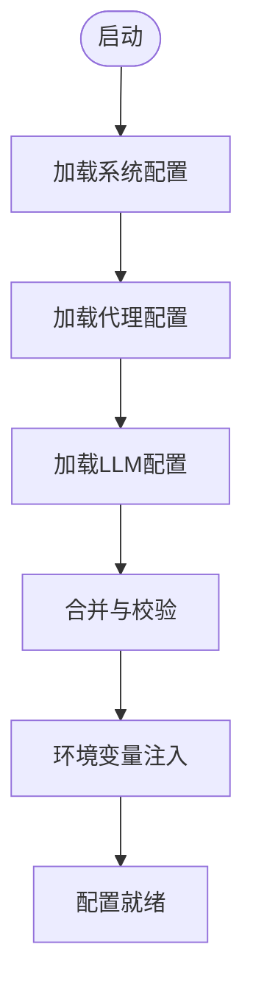
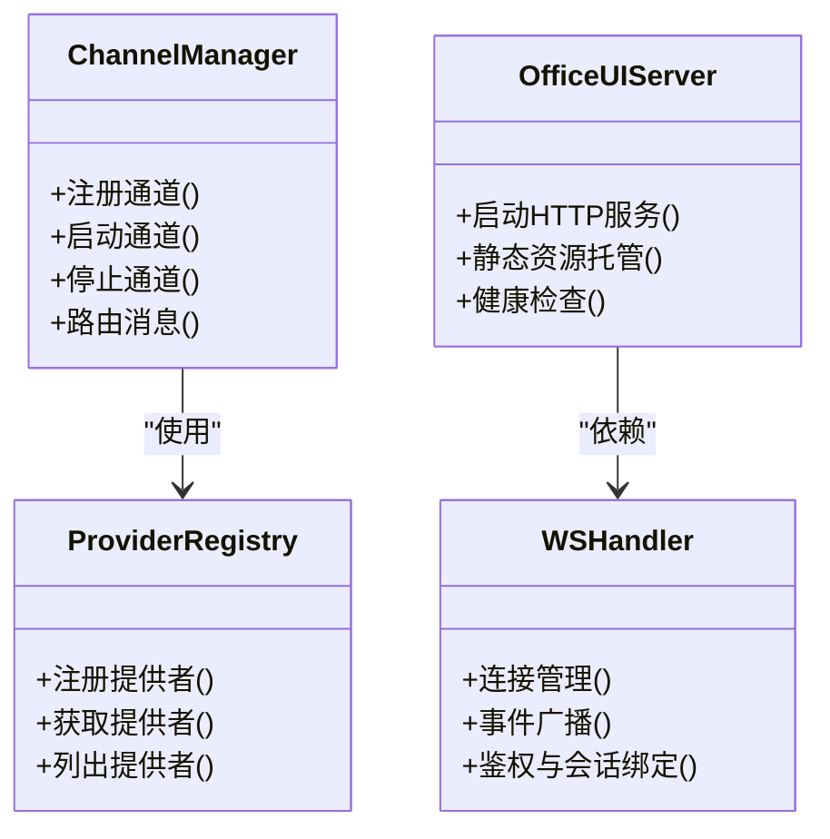
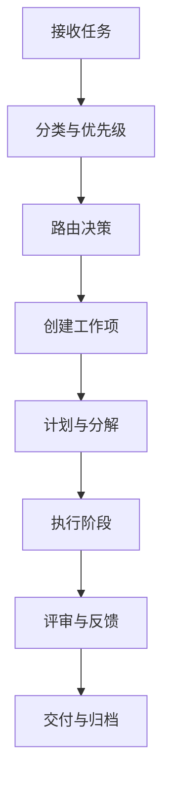
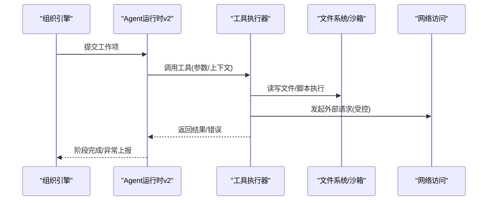
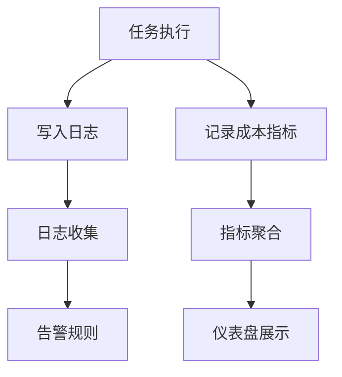
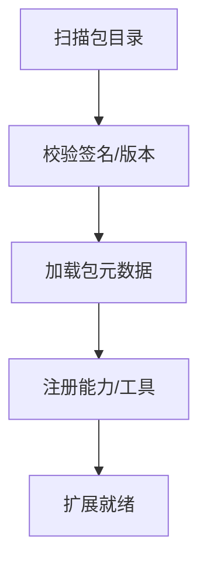
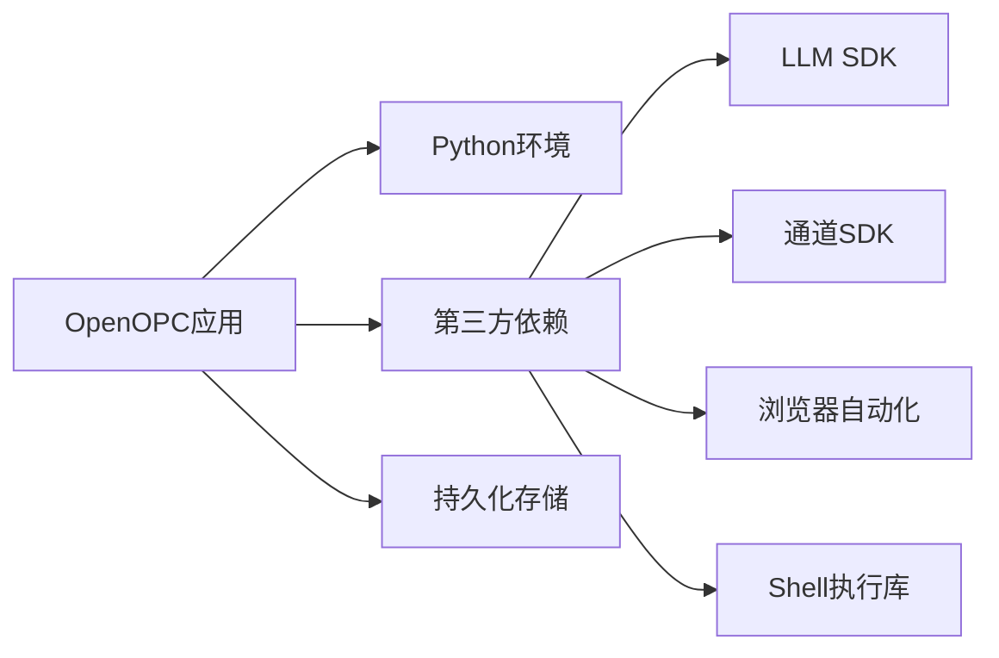

# 部署指南

<cite>
**本文引用的文件**   
- [README.md](file://README.md)
- [README.zh-CN.md](file://README.zh-CN.md)
- [pyproject.toml](file://pyproject.toml)
- [config/system_config.yaml](file://config/system_config.yaml)
- [config/agent_config.yaml](file://config/agent_config.yaml)
- [config/channel_config.yaml](file://config/channel_config.yaml)
- [config/llm_config.yaml](file://config/llm_config.yaml)
- [opc/cli/app.py](file://opc/cli/app.py)
- [opc/engine.py](file://opc/engine.py)
- [opc/core/config.py](file://opc/core/config.py)
- [opc/channels/manager.py](file://opc/channels/manager.py)
- [opc/channels/provider_registry.py](file://opc/channels/provider_registry.py)
- [opc/presentation/kanban.py](file://opc/presentation/kanban.py)
- [opc/plugins/office_ui/server.py](file://opc/plugins/office_ui/server.py)
- [opc/plugins/office_ui/ws_handler.py](file://opc/plugins/office_ui/ws_handler.py)
- [opc/database/store.py](file://opc/database/store.py)
- [opc/layer6_observability/opc_logger.py](file://opc/layer6_observability/opc_logger.py)
- [opc/layer6_observability/cost_tracker.py](file://opc/layer6_observability/cost_tracker.py)
- [opc/layer1_perception/task_router.py](file://opc/layer1_perception/task_router.py)
- [opc/layer2_organization/org_engine.py](file://opc/layer2_organization/org_engine.py)
- [opc/layer3_agent/runtime_v2/runtime.py](file://opc/layer3_agent/runtime_v2/runtime.py)
- [opc/layer4_tools/python_exec.py](file://opc/layer4_tools/python_exec.py)
- [opc/layer4_tools/shell.py](file://opc/layer4_tools/shell.py)
- [opc/layer4_tools/browser.py](file://opc/layer4_tools/browser.py)
- [opc/market/package_loader.py](file://opc/market/package_loader.py)
- [scripts/reset_stuck_task.py](file://scripts/reset_stuck_task.py)
</cite>

## 目录
1. [简介](#简介)
2. [项目结构](#项目结构)
3. [核心组件](#核心组件)
4. [架构总览](#架构总览)
5. [详细组件分析](#详细组件分析)
6. [依赖分析](#依赖分析)
7. [性能考虑](#性能考虑)
8. [故障排除指南](#故障排除指南)
9. [结论](#结论)
10. [附录](#附录)

## 简介
本指南面向OpenOPC的生产与容器化部署，覆盖开发环境搭建、生产部署流程、负载均衡与高可用设计、监控告警集成、数据备份与灾难恢复、性能基准与容量规划、安全加固与合规要求，以及运维排障手册。文档以仓库现有代码和配置为依据，确保可落地、可维护、可观测。

## 项目结构
OpenOPC采用分层模块化组织：CLI入口、引擎编排、通道桥接、组织与任务运行时、工具集、记忆与技能、可观测性、前端插件等。关键路径包括：
- CLI与启动入口：命令行应用与引擎初始化
- 配置加载：系统级与业务级配置
- 通道管理：多渠道接入与提供者注册
- 任务路由与组织编排：任务分发、阶段流转与工作项生命周期
- 工具执行：Python执行、Shell、浏览器等沙箱能力
- 可观测性：日志、成本追踪
- 前端插件：Office UI服务与WebSocket处理

图表来源
- [opc/cli/app.py](file://opc/cli/app.py)
- [opc/engine.py](file://opc/engine.py)
- [opc/core/config.py](file://opc/core/config.py)
- [config/system_config.yaml](file://config/system_config.yaml)
- [config/agent_config.yaml](file://config/agent_config.yaml)
- [config/llm_config.yaml](file://config/llm_config.yaml)
- [opc/channels/manager.py](file://opc/channels/manager.py)
- [opc/channels/provider_registry.py](file://opc/channels/provider_registry.py)
- [opc/layer1_perception/task_router.py](file://opc/layer1_perception/task_router.py)
- [opc/layer2_organization/org_engine.py](file://opc/layer2_organization/org_engine.py)
- [opc/layer3_agent/runtime_v2/runtime.py](file://opc/layer3_agent/runtime_v2/runtime.py)
- [opc/layer4_tools/python_exec.py](file://opc/layer4_tools/python_exec.py)
- [opc/layer4_tools/shell.py](file://opc/layer4_tools/shell.py)
- [opc/layer4_tools/browser.py](file://opc/layer4_tools/browser.py)
- [opc/database/store.py](file://opc/database/store.py)
- [opc/layer6_observability/opc_logger.py](file://opc/layer6_observability/opc_logger.py)
- [opc/layer6_observability/cost_tracker.py](file://opc/layer6_observability/cost_tracker.py)
- [opc/market/package_loader.py](file://opc/market/package_loader.py)
- [opc/plugins/office_ui/server.py](file://opc/plugins/office_ui/server.py)
- [opc/plugins/office_ui/ws_handler.py](file://opc/plugins/office_ui/ws_handler.py)

章节来源
- [README.md](file://README.md)
- [README.zh-CN.md](file://README.zh-CN.md)
- [pyproject.toml](file://pyproject.toml)

## 核心组件
- 配置系统：集中式YAML配置与运行时配置加载，支持系统、代理、LLM等多维度设置。
- 通道与UI：统一通道管理与提供者注册，提供Office UI服务与WebSocket事件处理。
- 任务与组织：任务路由到组织引擎，驱动工作项生命周期与阶段转换。
- 运行时与工具：Agent运行时v2协调工具执行（Python、Shell、浏览器），并持久化状态。
- 可观测性：结构化日志与成本追踪，便于审计与预算控制。
- 包与市场：动态加载外部包与预设，扩展能力边界。

章节来源
- [opc/core/config.py](file://opc/core/config.py)
- [config/system_config.yaml](file://config/system_config.yaml)
- [config/agent_config.yaml](file://config/agent_config.yaml)
- [config/llm_config.yaml](file://config/llm_config.yaml)
- [opc/channels/manager.py](file://opc/channels/manager.py)
- [opc/channels/provider_registry.py](file://opc/channels/provider_registry.py)
- [opc/plugins/office_ui/server.py](file://opc/plugins/office_ui/server.py)
- [opc/plugins/office_ui/ws_handler.py](file://opc/plugins/office_ui/ws_handler.py)
- [opc/layer1_perception/task_router.py](file://opc/layer1_perception/task_router.py)
- [opc/layer2_organization/org_engine.py](file://opc/layer2_organization/org_engine.py)
- [opc/layer3_agent/runtime_v2/runtime.py](file://opc/layer3_agent/runtime_v2/runtime.py)
- [opc/layer4_tools/python_exec.py](file://opc/layer4_tools/python_exec.py)
- [opc/layer4_tools/shell.py](file://opc/layer4_tools/shell.py)
- [opc/layer4_tools/browser.py](file://opc/layer4_tools/browser.py)
- [opc/database/store.py](file://opc/database/store.py)
- [opc/layer6_observability/opc_logger.py](file://opc/layer6_observability/opc_logger.py)
- [opc/layer6_observability/cost_tracker.py](file://opc/layer6_observability/cost_tracker.py)
- [opc/market/package_loader.py](file://opc/market/package_loader.py)

## 架构总览
OpenOPC采用“入口—配置—通道—编排—工具—存储—可观测”的分层架构。入口负责启动与参数解析；配置模块加载YAML；通道管理器对接多平台；任务路由将请求分派至组织引擎；运行时v2协调工具执行；数据库存储会话与工作项状态；日志与成本追踪贯穿全链路。

图表来源
- [opc/cli/app.py](file://opc/cli/app.py)
- [opc/engine.py](file://opc/engine.py)
- [opc/core/config.py](file://opc/core/config.py)
- [opc/channels/manager.py](file://opc/channels/manager.py)
- [opc/layer1_perception/task_router.py](file://opc/layer1_perception/task_router.py)
- [opc/layer2_organization/org_engine.py](file://opc/layer2_organization/org_engine.py)
- [opc/layer3_agent/runtime_v2/runtime.py](file://opc/layer3_agent/runtime_v2/runtime.py)
- [opc/layer4_tools/python_exec.py](file://opc/layer4_tools/python_exec.py)
- [opc/layer4_tools/shell.py](file://opc/layer4_tools/shell.py)
- [opc/layer4_tools/browser.py](file://opc/layer4_tools/browser.py)
- [opc/database/store.py](file://opc/database/store.py)
- [opc/layer6_observability/opc_logger.py](file://opc/layer6_observability/opc_logger.py)
- [opc/layer6_observability/cost_tracker.py](file://opc/layer6_observability/cost_tracker.py)

## 详细组件分析

### 配置系统
- 职责：加载system_config、agent_config、llm_config等YAML，合并为运行时配置对象，供各模块消费。
- 关键点：
  - 环境变量注入与默认值回退
  - 敏感字段（如密钥）通过环境变量或外部密钥管理服务挂载
  - 配置热更新策略需结合进程信号或重启机制实现

图表来源
- [opc/core/config.py](file://opc/core/config.py)
- [config/system_config.yaml](file://config/system_config.yaml)
- [config/agent_config.yaml](file://config/agent_config.yaml)
- [config/llm_config.yaml](file://config/llm_config.yaml)

章节来源
- [opc/core/config.py](file://opc/core/config.py)
- [config/system_config.yaml](file://config/system_config.yaml)
- [config/agent_config.yaml](file://config/agent_config.yaml)
- [config/llm_config.yaml](file://config/llm_config.yaml)

### 通道与Office UI
- 通道管理器负责多通道接入与生命周期管理，提供者注册表用于动态发现与实例化。
- Office UI服务提供Web界面，WS处理器处理实时事件推送与双向通信。

图表来源
- [opc/channels/manager.py](file://opc/channels/manager.py)
- [opc/channels/provider_registry.py](file://opc/channels/provider_registry.py)
- [opc/plugins/office_ui/server.py](file://opc/plugins/office_ui/server.py)
- [opc/plugins/office_ui/ws_handler.py](file://opc/plugins/office_ui/ws_handler.py)

章节来源
- [opc/channels/manager.py](file://opc/channels/manager.py)
- [opc/channels/provider_registry.py](file://opc/channels/provider_registry.py)
- [opc/plugins/office_ui/server.py](file://opc/plugins/office_ui/server.py)
- [opc/plugins/office_ui/ws_handler.py](file://opc/plugins/office_ui/ws_handler.py)

### 任务路由与组织编排
- 任务路由根据上下文与策略选择目标组织或角色。
- 组织引擎管理工作项的创建、阶段转换、审批与协作策略。

图表来源
- [opc/layer1_perception/task_router.py](file://opc/layer1_perception/task_router.py)
- [opc/layer2_organization/org_engine.py](file://opc/layer2_organization/org_engine.py)

章节来源
- [opc/layer1_perception/task_router.py](file://opc/layer1_perception/task_router.py)
- [opc/layer2_organization/org_engine.py](file://opc/layer2_organization/org_engine.py)

### Agent运行时v2与工具执行
- 运行时v2负责任务编排、权限控制、子代理与工具钩子。
- 工具集包含Python执行器、Shell、浏览器等，需在受限环境中运行。

图表来源
- [opc/layer3_agent/runtime_v2/runtime.py](file://opc/layer3_agent/runtime_v2/runtime.py)
- [opc/layer4_tools/python_exec.py](file://opc/layer4_tools/python_exec.py)
- [opc/layer4_tools/shell.py](file://opc/layer4_tools/shell.py)
- [opc/layer4_tools/browser.py](file://opc/layer4_tools/browser.py)

章节来源
- [opc/layer3_agent/runtime_v2/runtime.py](file://opc/layer3_agent/runtime_v2/runtime.py)
- [opc/layer4_tools/python_exec.py](file://opc/layer4_tools/python_exec.py)
- [opc/layer4_tools/shell.py](file://opc/layer4_tools/shell.py)
- [opc/layer4_tools/browser.py](file://opc/layer4_tools/browser.py)

### 可观测性与成本追踪
- 日志模块提供结构化输出，便于集中采集与分析。
- 成本追踪记录模型调用与资源消耗，支持预算与配额控制。

图表来源
- [opc/layer6_observability/opc_logger.py](file://opc/layer6_observability/opc_logger.py)
- [opc/layer6_observability/cost_tracker.py](file://opc/layer6_observability/cost_tracker.py)

章节来源
- [opc/layer6_observability/opc_logger.py](file://opc/layer6_observability/opc_logger.py)
- [opc/layer6_observability/cost_tracker.py](file://opc/layer6_observability/cost_tracker.py)

### 包与市场加载
- 包加载器负责从市场加载预设与扩展，支持版本与兼容性检查。

图表来源
- [opc/market/package_loader.py](file://opc/market/package_loader.py)

章节来源
- [opc/market/package_loader.py](file://opc/market/package_loader.py)

## 依赖分析
- Python环境与包管理：基于pyproject.toml声明依赖，建议使用虚拟环境或容器隔离。
- 外部依赖：
  - LLM提供商SDK（通过配置注入）
  - 通道提供方SDK（如钉钉、飞书、Slack等）
  - 浏览器自动化与Shell执行所需系统库
- 存储：本地文件或外部数据库（由配置决定）

图表来源
- [pyproject.toml](file://pyproject.toml)

章节来源
- [pyproject.toml](file://pyproject.toml)

## 性能考虑
- 并发与线程池：合理配置通道与工具执行的并发度，避免阻塞I/O。
- 内存与GC：对长会话进行上下文压缩与历史回收，降低内存占用。
- I/O优化：异步处理与批量化写入，减少磁盘与网络抖动。
- 缓存策略：热点配置与包元数据缓存，缩短冷启动时间。
- 限流与熔断：对外部API与模型调用实施速率限制与重试退避。

[本节为通用指导，不直接分析具体文件]

## 故障排除指南
- 启动失败：
  - 检查配置文件路径与权限，确认环境变量注入正确
  - 查看日志定位初始化阶段的异常堆栈
- 通道不可用：
  - 验证通道凭据与网络可达性
  - 检查提供者注册表是否成功加载
- 任务卡住：
  - 使用重置脚本清理挂起任务，恢复工作项状态
- 工具执行异常：
  - 确认沙箱权限与系统库安装
  - 审查工具调用参数与超时配置
- 成本超支：
  - 调整预算阈值与重试策略
  - 分析高频调用路径，优化提示词与上下文长度

章节来源
- [scripts/reset_stuck_task.py](file://scripts/reset_stuck_task.py)
- [opc/layer6_observability/opc_logger.py](file://opc/layer6_observability/opc_logger.py)
- [opc/layer6_observability/cost_tracker.py](file://opc/layer6_observability/cost_tracker.py)

## 结论
OpenOPC具备清晰的分层架构与可扩展的通道与工具生态。通过完善的配置管理、可观测性与成本追踪，可在开发与生产环境中稳定运行。建议在生产中采用容器化与Kubernetes编排，配合负载均衡与高可用策略，建立完善的监控告警与灾备体系，确保安全与合规。

[本节为总结，不直接分析具体文件]

## 附录

### 开发环境搭建
- 安装Python与虚拟环境：
  - 使用pyproject.toml管理依赖，建议在独立虚拟环境中安装
- 克隆仓库与初始化：
  - 复制示例配置到工作目录，按实际环境修改
- 启动CLI与服务：
  - 通过CLI入口启动引擎，按需启用Office UI服务

章节来源
- [README.md](file://README.md)
- [README.zh-CN.md](file://README.zh-CN.md)
- [pyproject.toml](file://pyproject.toml)
- [opc/cli/app.py](file://opc/cli/app.py)
- [opc/engine.py](file://opc/engine.py)
- [config/system_config.yaml](file://config/system_config.yaml)
- [config/agent_config.yaml](file://config/agent_config.yaml)
- [config/llm_config.yaml](file://config/llm_config.yaml)

### 生产环境部署
- 服务器要求：
  - CPU/内存：依据并发与工具执行规模评估
  - 磁盘：预留日志、存储与包缓存空间
  - 网络：出站访问LLM与通道API，入站暴露HTTP/WS端口
- 安全配置：
  - 最小权限原则运行进程
  - 使用只读文件系统与受限沙箱执行工具
  - 密钥通过环境变量或密钥管理服务注入
- 性能调优：
  - 调整并发与超时参数
  - 启用连接池与缓存
  - 定期清理历史与压缩上下文

章节来源
- [config/system_config.yaml](file://config/system_config.yaml)
- [opc/layer4_tools/python_exec.py](file://opc/layer4_tools/python_exec.py)
- [opc/layer4_tools/shell.py](file://opc/layer4_tools/shell.py)
- [opc/layer4_tools/browser.py](file://opc/layer4_tools/browser.py)
- [opc/database/store.py](file://opc/database/store.py)

### 容器化与Kubernetes编排
- Docker镜像构建：
  - 基于轻量基础镜像，仅安装必要依赖
  - 将配置文件与密钥以卷或Secret挂载
- Kubernetes编排：
  - Deployment定义副本数与健康检查
  - Service暴露HTTP/WS端口
  - ConfigMap与Secret管理配置与密钥
  - HPA基于CPU/内存或自定义指标自动扩缩容

[本节为概念性指导，不直接分析具体文件]

### 负载均衡与高可用
- 负载均衡：
  - 在入口层（Ingress/网关）进行流量分发
  - 会话粘性策略视通道与WS需求而定
- 高可用：
  - 多副本部署与无状态化设计
  - 共享存储或外部数据库保证状态一致性
  - 健康检查与自动重启

[本节为概念性指导，不直接分析具体文件]

### 监控告警系统集成
- 日志：
  - 集中采集结构化日志，建立索引与检索
- 指标：
  - 暴露成本与性能指标，接入时序数据库
- 告警：
  - 基于阈值与异常模式触发通知
  - 与工单系统联动闭环处理

章节来源
- [opc/layer6_observability/opc_logger.py](file://opc/layer6_observability/opc_logger.py)
- [opc/layer6_observability/cost_tracker.py](file://opc/layer6_observability/cost_tracker.py)

### 数据备份与灾难恢复
- 备份策略：
  - 定期快照数据库与文件存储
  - 保留多版本与异地副本
- 恢复演练：
  - 制定RTO/RPO目标并定期演练
  - 自动化恢复脚本与回滚流程

[本节为通用指导，不直接分析具体文件]

### 性能基准测试与容量规划
- 基准测试：
  - 模拟典型负载与峰值场景
  - 评估吞吐、延迟与资源利用率
- 容量规划：
  - 基于测试结果设定资源上限与扩容阈值
  - 关注外部API配额与带宽瓶颈

[本节为通用指导，不直接分析具体文件]

### 安全加固与合规
- 最小权限与沙箱隔离
- 输入校验与输出过滤
- 审计日志与访问控制
- 合规要求：数据脱敏、加密传输与存储

[本节为通用指导，不直接分析具体文件]

### 运维手册
- 日常巡检：
  - 检查健康端点与日志异常
  - 监控成本与配额使用情况
- 变更管理：
  - 灰度发布与回滚策略
  - 配置变更影响评估与验证
- 应急处理：
  - 快速定位问题根因
  - 降级与熔断策略执行

章节来源
- [opc/plugins/office_ui/server.py](file://opc/plugins/office_ui/server.py)
- [opc/plugins/office_ui/ws_handler.py](file://opc/plugins/office_ui/ws_handler.py)
- [opc/layer6_observability/opc_logger.py](file://opc/layer6_observability/opc_logger.py)
- [opc/layer6_observability/cost_tracker.py](file://opc/layer6_observability/cost_tracker.py)