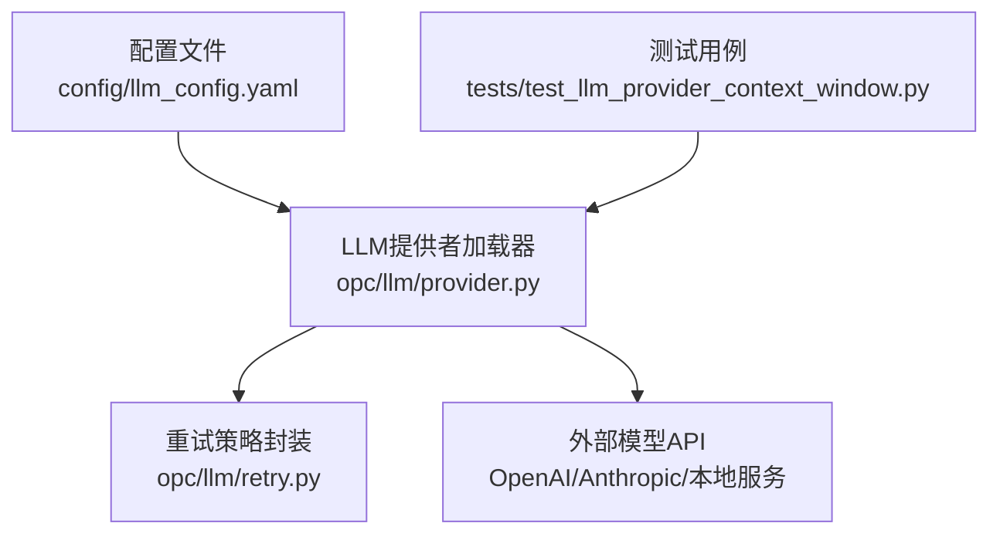
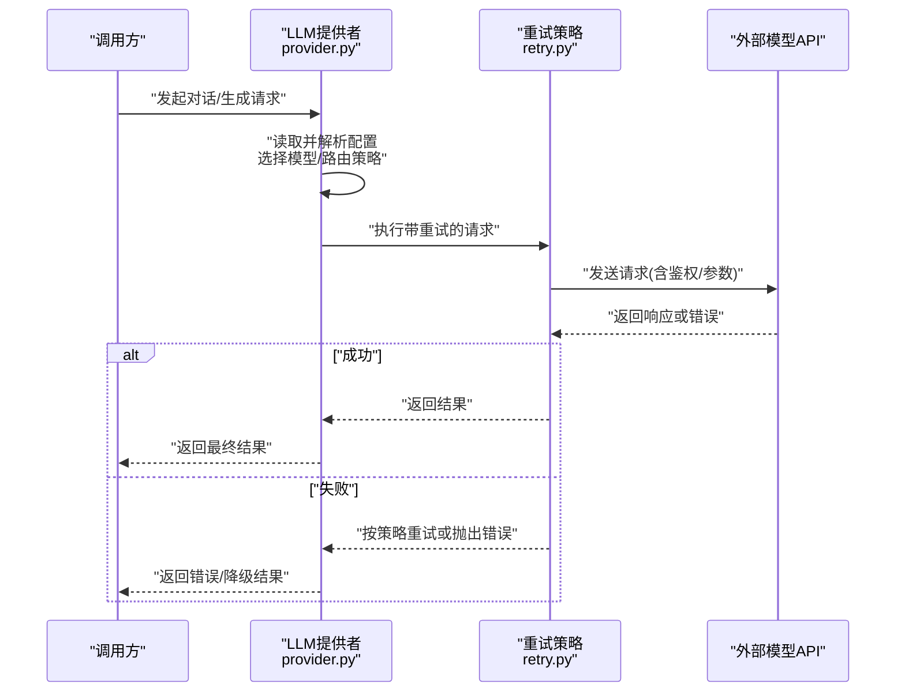
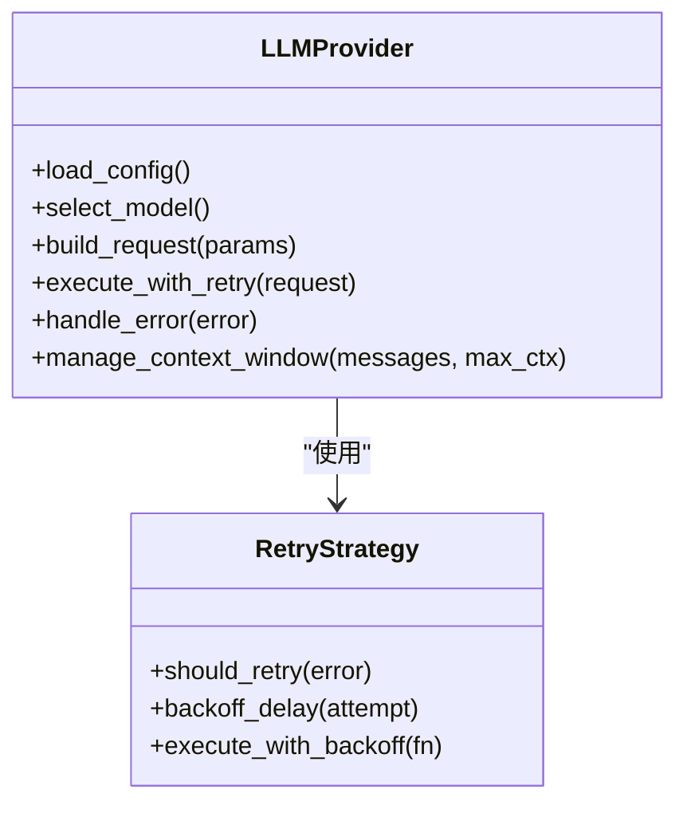
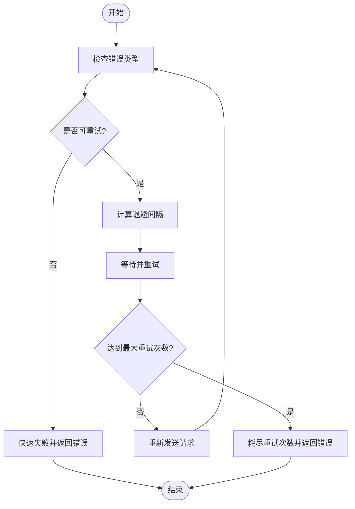
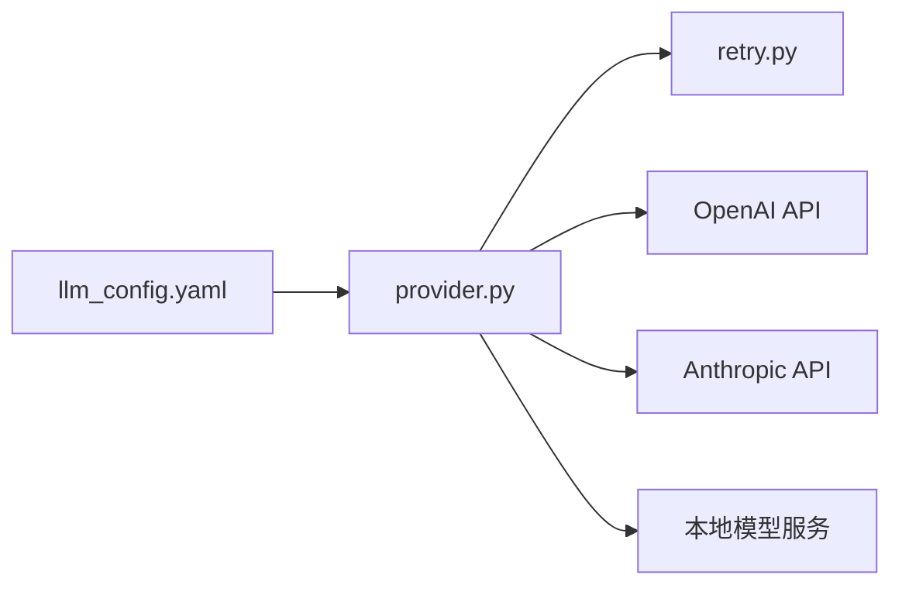

# LLM配置

<cite>
**本文引用的文件**   
- [llm_config.yaml](file://config/llm_config.yaml)
- [provider.py](file://opc/llm/provider.py)
- [retry.py](file://opc/llm/retry.py)
- [test_llm_provider_context_window.py](file://tests/test_llm_provider_context_window.py)
</cite>

## 目录
1. [简介](#简介)
2. [项目结构](#项目结构)
3. [核心组件](#核心组件)
4. [架构总览](#架构总览)
5. [详细组件分析](#详细组件分析)
6. [依赖分析](#依赖分析)
7. [性能考虑](#性能考虑)
8. [故障排查指南](#故障排查指南)
9. [结论](#结论)
10. [附录](#附录)

## 简介
本章节面向OpenOPC的LLM配置，聚焦于通过配置文件与运行时模块协同工作的方式，实现对多模型提供商的统一接入、参数调优、重试策略与错误处理。文档将详细说明：
- llm_config.yaml的结构与字段含义
- 支持的模型提供商（如OpenAI、Anthropic、本地模型等）的配置方法
- API密钥管理、请求参数调优、重试策略与错误处理
- 多模型切换与负载均衡设置
- 上下文窗口大小、温度、最大令牌数等关键参数的影响
- 不同模型的推荐配置与优化建议
- 认证失败、限流处理与成本控制的解决方案

## 项目结构
与LLM配置直接相关的代码与配置位于以下位置：
- 配置文件：config/llm_config.yaml
- LLM提供者抽象与实现：opc/llm/provider.py
- 重试机制：opc/llm/retry.py
- 相关测试用例：tests/test_llm_provider_context_window.py

图表来源
- [llm_config.yaml](file://config/llm_config.yaml)
- [provider.py](file://opc/llm/provider.py)
- [retry.py](file://opc/llm/retry.py)
- [test_llm_provider_context_window.py](file://tests/test_llm_provider_context_window.py)

章节来源
- [llm_config.yaml](file://config/llm_config.yaml)
- [provider.py](file://opc/llm/provider.py)
- [retry.py](file://opc/llm/retry.py)
- [test_llm_provider_context_window.py](file://tests/test_llm_provider_context_window.py)

## 核心组件
- 配置文件层：llm_config.yaml集中定义模型提供商、鉴权信息、通用请求参数、重试策略、上下文窗口限制等。
- 提供者抽象层：provider.py负责解析配置、选择具体模型实现、组装请求参数、统一返回结果。
- 重试层：retry.py提供可配置的重试策略（退避、次数、条件），对网络抖动与临时性错误进行容错。
- 测试验证层：针对上下文窗口等关键行为进行验证，确保配置生效且符合预期。

章节来源
- [llm_config.yaml](file://config/llm_config.yaml)
- [provider.py](file://opc/llm/provider.py)
- [retry.py](file://opc/llm/retry.py)
- [test_llm_provider_context_window.py](file://tests/test_llm_provider_context_window.py)

## 架构总览
下图展示了从配置到调用外部模型的整体流程，包括多模型切换、重试与错误处理路径。

图表来源
- [provider.py](file://opc/llm/provider.py)
- [retry.py](file://opc/llm/retry.py)

## 详细组件分析

### 配置文件：llm_config.yaml
该文件是LLM配置的单一事实来源，通常包含以下维度：
- 全局默认参数
  - 上下文窗口大小：控制模型能处理的输入长度上限，避免超出导致截断或报错。
  - 温度（temperature）：控制输出随机性与创造性；值越高越发散，越低越确定。
  - 最大令牌数（max_tokens）：限制生成输出的长度，防止过长输出带来成本与延迟问题。
  - 超时与并发：控制请求超时时间与并行度，平衡吞吐与稳定性。
- 模型提供商列表
  - OpenAI：需配置API密钥、基础URL（可选）、模型名称、请求参数覆盖。
  - Anthropic：需配置API密钥、版本、模型名称、请求参数覆盖。
  - 本地模型：需配置本地服务地址、端口、模型标识、可能的自定义头部或协议参数。
- 鉴权与密钥管理
  - 支持环境变量注入（例如在运行环境中以变量形式传入密钥），避免硬编码。
  - 可按提供商分别配置密钥引用键名，便于集中管理与轮换。
- 多模型切换与负载均衡
  - 指定默认模型与候选模型列表。
  - 支持基于权重或轮询的策略进行负载分发，提升可用性与吞吐。
- 重试与错误处理
  - 全局重试策略：最大重试次数、退避算法（指数退避）、重试条件（如限流、网络错误）。
  - 提供商级覆盖：针对不同提供商设置更细粒度的重试与超时。
- 成本与配额控制
  - 可配置每请求/会话的最大令牌预算，结合日志与监控进行成本控制。
  - 限流策略：在客户端侧进行速率限制，避免触发上游限流。

章节来源
- [llm_config.yaml](file://config/llm_config.yaml)

### 提供者抽象：provider.py
职责与要点：
- 配置解析与校验
  - 读取llm_config.yaml，合并全局默认与提供商级覆盖。
  - 校验必填字段（如密钥、模型名、上下文窗口等），缺失时给出明确错误提示。
- 模型选择与路由
  - 根据当前会话/任务上下文选择模型，支持默认模型与动态切换。
  - 支持负载均衡策略（权重/轮询），在多模型间分配请求。
- 请求组装与参数映射
  - 将通用参数映射为各提供商所需的格式（如temperature、max_tokens、top_p等）。
  - 注入鉴权头与必要元数据。
- 重试与错误处理集成
  - 调用retry.py提供的重试封装，捕获特定错误码（如限流、超时）并按策略重试。
  - 对不可恢复错误快速失败，减少资源浪费。
- 上下文窗口管理
  - 根据配置的上下文窗口大小裁剪或压缩历史消息，确保不超限。
  - 在测试中验证上下文窗口行为的正确性。

图表来源
- [provider.py](file://opc/llm/provider.py)
- [retry.py](file://opc/llm/retry.py)

章节来源
- [provider.py](file://opc/llm/provider.py)
- [retry.py](file://opc/llm/retry.py)
- [test_llm_provider_context_window.py](file://tests/test_llm_provider_context_window.py)

### 重试策略：retry.py
职责与要点：
- 可配置的重试次数与退避间隔（线性/指数退避）。
- 条件判断：仅对可重试错误（如限流、网络抖动、超时）进行重试。
- 幂等性保护：对非幂等操作增加额外保护逻辑，避免重复提交造成副作用。
- 错误分类与上报：区分可恢复与不可恢复错误，记录日志以便诊断。

图表来源
- [retry.py](file://opc/llm/retry.py)

章节来源
- [retry.py](file://opc/llm/retry.py)

### 上下文窗口与参数调优
- 上下文窗口大小
  - 影响：决定模型能处理的输入长度；过大可能导致截断或性能下降。
  - 实践：根据模型能力与业务需求设定合理上限，并在provider中进行消息裁剪。
- 温度（temperature）
  - 影响：控制输出多样性；高温度适合创意类任务，低温度适合确定性任务。
  - 实践：按任务类型调整，必要时在配置中按提供商覆盖。
- 最大令牌数（max_tokens）
  - 影响：限制输出长度；过短可能丢失信息，过长增加成本与延迟。
  - 实践：结合任务复杂度与预算设置上限，配合日志监控实际消耗。

章节来源
- [llm_config.yaml](file://config/llm_config.yaml)
- [provider.py](file://opc/llm/provider.py)
- [test_llm_provider_context_window.py](file://tests/test_llm_provider_context_window.py)

## 依赖分析
- 配置到实现的依赖关系
  - llm_config.yaml为唯一配置源，provider.py负责解析与装配。
  - retry.py作为通用重试库被provider.py复用。
- 外部依赖
  - OpenAI、Anthropic等第三方API；本地模型服务可通过HTTP/gRPC等方式接入。
- 潜在耦合点
  - 配置变更需同步更新provider的参数映射与校验逻辑。
  - 重试策略应与上游限流政策协调，避免过度重试引发雪崩。

图表来源
- [llm_config.yaml](file://config/llm_config.yaml)
- [provider.py](file://opc/llm/provider.py)
- [retry.py](file://opc/llm/retry.py)

章节来源
- [llm_config.yaml](file://config/llm_config.yaml)
- [provider.py](file://opc/llm/provider.py)
- [retry.py](file://opc/llm/retry.py)

## 性能考虑
- 并发与吞吐
  - 合理设置并发度与超时时间，避免上游限流与资源争用。
- 缓存与复用
  - 对相同请求进行去重或缓存（注意幂等性），降低重复调用成本。
- 上下文压缩
  - 在长对话场景下采用摘要或滑动窗口策略，减少上下文占用。
- 观测与度量
  - 记录每次请求的令牌消耗、延迟与错误率，用于持续优化。

[本节为通用指导，无需列出具体文件来源]

## 故障排查指南
- 认证失败
  - 检查密钥是否正确注入（环境变量或配置项），确认提供商要求的头部或签名格式。
  - 查看provider的错误处理分支，定位鉴权失败的具体原因。
- 限流处理
  - 观察重试策略是否启用指数退避，避免频繁重试加剧限流。
  - 在客户端侧实施速率限制，平滑请求峰值。
- 上下文溢出
  - 核对上下文窗口配置与实际消息长度，必要时启用压缩或裁剪。
- 成本超支
  - 设置max_tokens与预算上限，结合日志监控实际消耗，及时调整参数。

章节来源
- [provider.py](file://opc/llm/provider.py)
- [retry.py](file://opc/llm/retry.py)
- [llm_config.yaml](file://config/llm_config.yaml)

## 结论
通过统一的配置文件与清晰的提供者抽象，OpenOPC实现了多模型提供商的灵活接入与可控管理。借助可配置的重试策略与错误处理，系统在面对网络波动与上游限流时具备更强的鲁棒性。合理的上下文窗口、温度与最大令牌数设置，能在质量、成本与性能之间取得良好平衡。建议在生产环境结合观测指标持续优化配置，并建立完善的密钥管理与限流策略，保障稳定与可控的运行。

[本节为总结性内容，无需列出具体文件来源]

## 附录
- 不同模型的推荐配置与优化建议
  - OpenAI系列
    - 上下文窗口：依据模型规格设置，避免超长输入。
    - 温度：创意任务偏高（如0.7-0.9），确定性任务偏低（如0.1-0.3）。
    - 最大令牌数：根据任务复杂度设置上限，结合日志监控实际消耗。
    - 重试：启用指数退避，针对限流与超时进行保护。
  - Anthropic系列
    - 上下文窗口：遵循官方限制，必要时进行消息裁剪。
    - 温度与最大令牌数：同上，按任务类型调整。
    - 重试：关注其限流策略，适当放宽退避间隔。
  - 本地模型
    - 上下文窗口：受限于部署环境与硬件资源，需压测评估。
    - 温度与最大令牌数：根据推理速度与质量权衡。
    - 重试：本地服务一般较稳定，但仍需保留基本重试与超时保护。
- 成本控制方案
  - 设置每请求/会话的令牌预算，结合日志与告警进行监控。
  - 对高频重复请求进行缓存或去重，减少冗余调用。
  - 定期审查模型选择与参数配置，淘汰低效配置。

[本节为通用指导，无需列出具体文件来源]