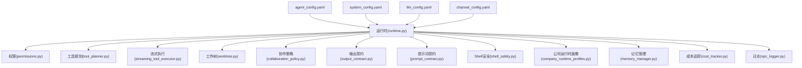
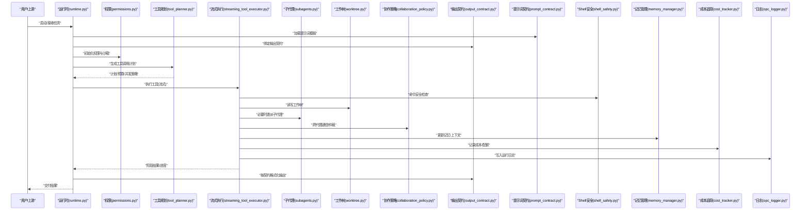
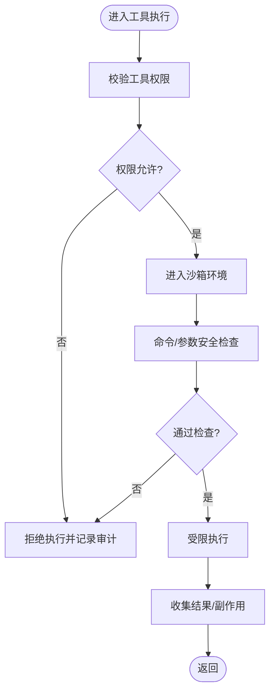
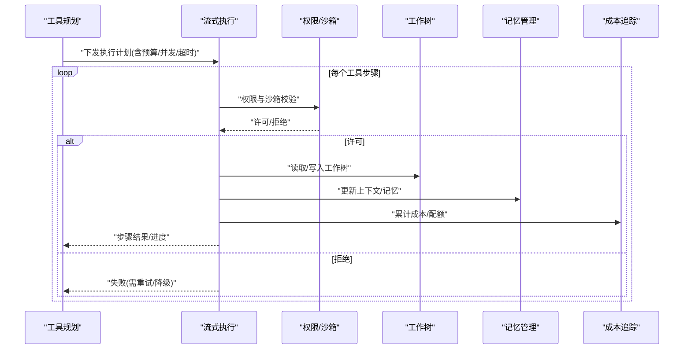
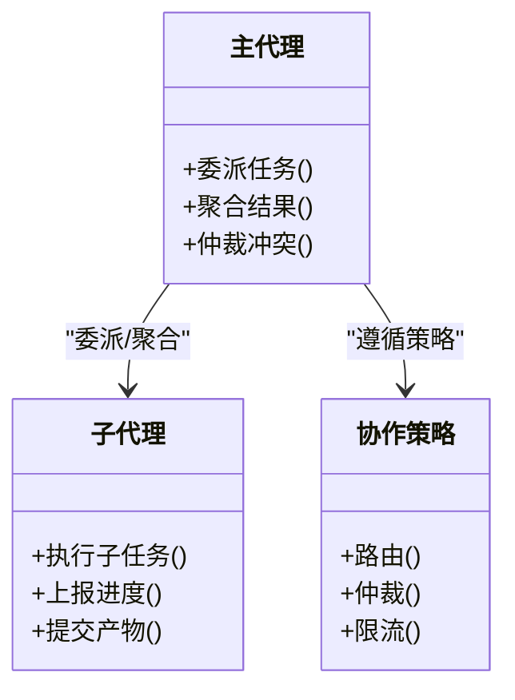
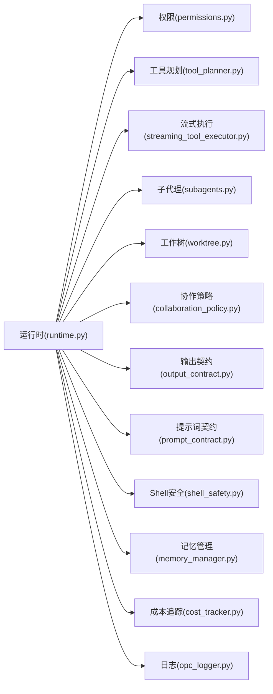

# 代理配置

<cite>
**本文引用的文件**   
- [agent_config.yaml](file://config/agent_config.yaml)
- [system_config.yaml](file://config/system_config.yaml)
- [llm_config.yaml](file://config/llm_config.yaml)
- [channel_config.yaml](file://config/channel_config.yaml)
- [runtime.py](file://opc/layer3_agent/runtime_v2/runtime.py)
- [permissions.py](file://opc/layer3_agent/runtime_v2/permissions.py)
- [tool_planner.py](file://opc/layer3_agent/runtime_v2/tool_planner.py)
- [streaming_tool_executor.py](file://opc/layer3_agent/runtime_v2/streaming_tool_executor.py)
- [subagents.py](file://opc/layer3_agent/runtime_v2/subagents.py)
- [worktree.py](file://opc/layer3_agent/runtime_v2/worktree.py)
- [prompt_contract.py](file://opc/layer2_organization/prompt_contract.py)
- [output_contract.py](file://opc/layer2_organization/output_contract.py)
- [collaboration_policy.py](file://opc/layer2_organization/collaboration_policy.py)
- [shell_safety.py](file://opc/layer2_organization/shell_safety.py)
- [company_runtime_profiles.py](file://opc/layer2_organization/company_runtime_profiles.py)
- [memory_manager.py](file://opc/layer5_memory/memory_manager.py)
- [cost_tracker.py](file://opc/layer6_observability/cost_tracker.py)
- [opc_logger.py](file://opc/layer6_observability/opc_logger.py)
</cite>

## 目录
1. [简介](#简介)
2. [项目结构](#项目结构)
3. [核心组件](#核心组件)
4. [架构总览](#架构总览)
5. [详细组件分析](#详细组件分析)
6. [依赖关系分析](#依赖关系分析)
7. [性能与资源限制](#性能与资源限制)
8. [故障排查与恢复](#故障排查与恢复)
9. [结论](#结论)
10. [附录：场景化模板与最佳实践](#附录场景化模板与最佳实践)

## 简介
本文件面向OpenOPC的“代理配置”，围绕配置文件 agent_config.yaml 的结构与语义，系统阐述代理行为控制、工具权限、内存设置、执行策略、生命周期管理、安全沙箱、提示词模板、工具调用策略、输出格式控制、代理间通信与协作规则，并提供多场景下的配置模板与优化建议。文档同时覆盖调试模式、性能监控与故障恢复的配置方法，帮助读者在不同运行环境中稳定高效地部署与调优代理。

## 项目结构
OpenOPC将配置分为多个维度：
- 代理级配置：agent_config.yaml（代理行为、工具权限、内存、执行策略等）
- 系统级配置：system_config.yaml（全局开关、日志、存储路径等）
- LLM配置：llm_config.yaml（模型、提供商、重试、上下文窗口等）
- 通道配置：channel_config.yaml（消息渠道接入参数）

这些配置在运行时由核心模块加载并注入到各层服务中，驱动代理生命周期、工具执行、协作与可观测性。

图表来源
- [runtime.py](file://opc/layer3_agent/runtime_v2/runtime.py)
- [permissions.py](file://opc/layer3_agent/runtime_v2/permissions.py)
- [tool_planner.py](file://opc/layer3_agent/runtime_v2/tool_planner.py)
- [streaming_tool_executor.py](file://opc/layer3_agent/runtime_v2/streaming_tool_executor.py)
- [worktree.py](file://opc/layer3_agent/runtime_v2/worktree.py)
- [collaboration_policy.py](file://opc/layer2_organization/collaboration_policy.py)
- [output_contract.py](file://opc/layer2_organization/output_contract.py)
- [prompt_contract.py](file://opc/layer2_organization/prompt_contract.py)
- [shell_safety.py](file://opc/layer2_organization/shell_safety.py)
- [company_runtime_profiles.py](file://opc/layer2_organization/company_runtime_profiles.py)
- [memory_manager.py](file://opc/layer5_memory/memory_manager.py)
- [cost_tracker.py](file://opc/layer6_observability/cost_tracker.py)
- [opc_logger.py](file://opc/layer6_observability/opc_logger.py)

章节来源
- [agent_config.yaml](file://config/agent_config.yaml)
- [system_config.yaml](file://config/system_config.yaml)
- [llm_config.yaml](file://config/llm_config.yaml)
- [channel_config.yaml](file://config/channel_config.yaml)

## 核心组件
本节聚焦与代理配置强相关的核心模块及其职责边界，说明它们如何读取和响应配置项。

- 运行时(runtime.py)
  - 负责加载与合并多层配置，初始化代理生命周期、工具栈、协作与可观测性子系统。
  - 依据配置决定是否启用沙箱、并发度、超时、重试、检查点与恢复策略。
- 权限(permissions.py)
  - 解析并校验工具访问白名单、命令黑名单、文件系统与网络访问范围。
  - 提供最小权限原则的执行上下文。
- 工具规划(tool_planner.py)
  - 根据任务目标与约束生成工具调用计划，支持串行/并行策略与预算控制。
- 流式执行(streaming_tool_executor.py)
  - 以流式方式执行工具，支持进度上报、中断与回滚。
- 子代理(subagents.py)
  - 管理子代理的创建、委派、结果聚合与隔离。
- 工作树(worktree.py)
  - 为每个会话/任务维护独立的工作目录与版本快照，配合沙箱与权限使用。
- 协作策略(collaboration_policy.py)
  - 定义代理间通信协议、路由、仲裁与冲突解决策略。
- 输出契约(output_contract.py)
  - 规范结构化输出字段、必填项、类型校验与降级策略。
- 提示词契约(prompt_contract.py)
  - 统一提示词模板的组织、注入与渲染流程。
- Shell安全(shell_safety.py)
  - 对命令执行进行白名单、环境变量与资源限制。
- 公司运行时画像(company_runtime_profiles.py)
  - 按角色/团队/环境加载差异化配置画像，实现“一套配置，多套行为”。
- 记忆管理(memory_manager.py)
  - 控制历史压缩、摘要与检索策略，影响上下文长度与成本。
- 成本追踪(cost_tracker.py)
  - 统计Token用量、费用估算与配额告警。
- 日志(opc_logger.py)
  - 统一日志级别、采样率、输出目标与敏感信息脱敏。

章节来源
- [runtime.py](file://opc/layer3_agent/runtime_v2/runtime.py)
- [permissions.py](file://opc/layer3_agent/runtime_v2/permissions.py)
- [tool_planner.py](file://opc/layer3_agent/runtime_v2/tool_planner.py)
- [streaming_tool_executor.py](file://opc/layer3_agent/runtime_v2/streaming_tool_executor.py)
- [subagents.py](file://opc/layer3_agent/runtime_v2/subagents.py)
- [worktree.py](file://opc/layer3_agent/runtime_v2/worktree.py)
- [collaboration_policy.py](file://opc/layer2_organization/collaboration_policy.py)
- [output_contract.py](file://opc/layer2_organization/output_contract.py)
- [prompt_contract.py](file://opc/layer2_organization/prompt_contract.py)
- [shell_safety.py](file://opc/layer2_organization/shell_safety.py)
- [company_runtime_profiles.py](file://opc/layer2_organization/company_runtime_profiles.py)
- [memory_manager.py](file://opc/layer5_memory/memory_manager.py)
- [cost_tracker.py](file://opc/layer6_observability/cost_tracker.py)
- [opc_logger.py](file://opc/layer6_observability/opc_logger.py)

## 架构总览
下图展示代理配置在各层的落地路径：从配置加载到运行时编排、权限与安全、工具执行、协作与输出契约，再到可观测性与记忆管理。

图表来源
- [runtime.py](file://opc/layer3_agent/runtime_v2/runtime.py)
- [permissions.py](file://opc/layer3_agent/runtime_v2/permissions.py)
- [tool_planner.py](file://opc/layer3_agent/runtime_v2/tool_planner.py)
- [streaming_tool_executor.py](file://opc/layer3_agent/runtime_v2/streaming_tool_executor.py)
- [subagents.py](file://opc/layer3_agent/runtime_v2/subagents.py)
- [worktree.py](file://opc/layer3_agent/runtime_v2/worktree.py)
- [collaboration_policy.py](file://opc/layer2_organization/collaboration_policy.py)
- [output_contract.py](file://opc/layer2_organization/output_contract.py)
- [prompt_contract.py](file://opc/layer2_organization/prompt_contract.py)
- [shell_safety.py](file://opc/layer2_organization/shell_safety.py)
- [memory_manager.py](file://opc/layer5_memory/memory_manager.py)
- [cost_tracker.py](file://opc/layer6_observability/cost_tracker.py)
- [opc_logger.py](file://opc/layer6_observability/opc_logger.py)

## 详细组件分析

### 代理配置结构（agent_config.yaml）
- 作用域与优先级
  - 代理级配置优先于系统级与LLM级配置；公司画像可按角色/环境覆盖默认值。
- 关键分组（概念性说明）
  - 代理行为控制：并发度、超时、重试、检查点、恢复策略、暂停/恢复开关。
  - 工具权限：白名单/黑名单、文件系统范围、网络访问、命令执行策略。
  - 内存与上下文：最大上下文长度、历史压缩阈值、摘要策略、缓存开关。
  - 执行策略：工具调用顺序（串行/并行）、预算上限、失败回退、幂等策略。
  - 安全沙箱：隔离级别、只读挂载、资源限额（CPU/内存/IO）。
  - 提示词模板：模板选择、变量注入、条件分支、版本兼容。
  - 输出格式：契约字段、类型校验、缺失处理、降级输出。
  - 协作与通信：代理发现、路由表、仲裁策略、冲突解决、审计日志。
  - 可观测性：日志级别、采样率、指标上报、成本跟踪开关。
- 配置校验与热更新
  - 启动时进行严格校验，错误项阻断启动；部分开关支持运行时热更新（如日志级别、采样率）。

章节来源
- [agent_config.yaml](file://config/agent_config.yaml)
- [company_runtime_profiles.py](file://opc/layer2_organization/company_runtime_profiles.py)

### 权限与沙箱（permissions.py + shell_safety.py）
- 权限模型
  - 基于最小权限原则的工具白名单；命令级黑名单与环境变量过滤。
  - 文件系统访问范围限定到工作树或指定只读目录。
- 沙箱机制
  - 进程级隔离、资源限额（CPU/内存/IO）、网络出口白名单。
  - 危险操作拦截与审批流（可选）。
- 动态调整
  - 通过配置切换宽松/严格模式；生产环境默认严格。

图表来源
- [permissions.py](file://opc/layer3_agent/runtime_v2/permissions.py)
- [shell_safety.py](file://opc/layer2_organization/shell_safety.py)

章节来源
- [permissions.py](file://opc/layer3_agent/runtime_v2/permissions.py)
- [shell_safety.py](file://opc/layer2_organization/shell_safety.py)

### 工具规划与执行（tool_planner.py + streaming_tool_executor.py）
- 规划策略
  - 根据任务目标、依赖图与预算生成工具序列；支持并行度与超时控制。
- 流式执行
  - 分片执行、增量产出、进度上报、可中断与回滚。
- 失败处理
  - 重试策略（指数退避/抖动）、熔断与降级、检查点持久化。

图表来源
- [tool_planner.py](file://opc/layer3_agent/runtime_v2/tool_planner.py)
- [streaming_tool_executor.py](file://opc/layer3_agent/runtime_v2/streaming_tool_executor.py)
- [worktree.py](file://opc/layer3_agent/runtime_v2/worktree.py)
- [memory_manager.py](file://opc/layer5_memory/memory_manager.py)
- [cost_tracker.py](file://opc/layer6_observability/cost_tracker.py)

章节来源
- [tool_planner.py](file://opc/layer3_agent/runtime_v2/tool_planner.py)
- [streaming_tool_executor.py](file://opc/layer3_agent/runtime_v2/streaming_tool_executor.py)

### 子代理与协作（subagents.py + collaboration_policy.py）
- 子代理委派
  - 按能力/负载自动拆分任务，支持结果聚合与一致性保证。
- 协作策略
  - 代理间通信协议、路由表、仲裁与冲突解决；审计与可追溯。
- 治理与限流
  - 并发上限、速率限制、死锁检测与自愈。

图表来源
- [subagents.py](file://opc/layer3_agent/runtime_v2/subagents.py)
- [collaboration_policy.py](file://opc/layer2_organization/collaboration_policy.py)

章节来源
- [subagents.py](file://opc/layer3_agent/runtime_v2/subagents.py)
- [collaboration_policy.py](file://opc/layer2_organization/collaboration_policy.py)

### 提示词与输出契约（prompt_contract.py + output_contract.py）
- 提示词模板
  - 模板选择、变量注入、条件分支、版本兼容与回滚。
- 输出契约
  - 结构化字段、类型校验、必填项、缺失处理与降级策略。
- 适配不同下游
  - 同一逻辑可适配多种输出格式（JSON/Markdown/表格等）。

章节来源
- [prompt_contract.py](file://opc/layer2_organization/prompt_contract.py)
- [output_contract.py](file://opc/layer2_organization/output_contract.py)

### 运行时与画像（runtime.py + company_runtime_profiles.py）
- 运行时
  - 加载配置、初始化子系统、编排生命周期、事件总线与检查点。
- 公司画像
  - 按角色/团队/环境加载差异化配置，实现“一套配置，多套行为”。

章节来源
- [runtime.py](file://opc/layer3_agent/runtime_v2/runtime.py)
- [company_runtime_profiles.py](file://opc/layer2_organization/company_runtime_profiles.py)

## 依赖关系分析
- 内聚与耦合
  - 运行时作为中心协调者，低耦合地组合权限、工具、协作、记忆与可观测性模块。
- 外部依赖
  - LLM提供商、消息通道、存储后端等通过配置注入，便于替换与扩展。
- 潜在循环依赖
  - 通过接口契约与事件解耦避免循环引用；新增模块应遵循分层依赖。

图表来源
- [runtime.py](file://opc/layer3_agent/runtime_v2/runtime.py)
- [permissions.py](file://opc/layer3_agent/runtime_v2/permissions.py)
- [tool_planner.py](file://opc/layer3_agent/runtime_v2/tool_planner.py)
- [streaming_tool_executor.py](file://opc/layer3_agent/runtime_v2/streaming_tool_executor.py)
- [subagents.py](file://opc/layer3_agent/runtime_v2/subagents.py)
- [worktree.py](file://opc/layer3_agent/runtime_v2/worktree.py)
- [collaboration_policy.py](file://opc/layer2_organization/collaboration_policy.py)
- [output_contract.py](file://opc/layer2_organization/output_contract.py)
- [prompt_contract.py](file://opc/layer2_organization/prompt_contract.py)
- [shell_safety.py](file://opc/layer2_organization/shell_safety.py)
- [memory_manager.py](file://opc/layer5_memory/memory_manager.py)
- [cost_tracker.py](file://opc/layer6_observability/cost_tracker.py)
- [opc_logger.py](file://opc/layer6_observability/opc_logger.py)

## 性能与资源限制
- 并发与吞吐
  - 合理设置工具并行度与队列深度，避免过载；结合超时与熔断保护。
- 内存与上下文
  - 控制上下文长度与历史压缩频率，降低Token消耗与延迟。
- I/O与磁盘
  - 工作树I/O限流与只读挂载减少竞争；大文件采用流式处理。
- 成本与配额
  - 开启成本追踪与配额告警，防止异常消耗。
- 监控与诊断
  - 提高日志采样率与结构化指标，定位瓶颈。

[本节为通用指导，不直接分析具体文件]

## 故障排查与恢复
- 常见症状
  - 工具执行被拒、超时频繁、上下文溢出、协作死锁、成本飙升。
- 快速定位
  - 查看权限与沙箱日志、工具执行流水、协作仲裁记录与成本报表。
- 恢复策略
  - 启用检查点恢复、降级输出、回退到上一版本提示词/契约。
- 预防建议
  - 预检配置、灰度发布、压测验证、变更审计。

章节来源
- [opc_logger.py](file://opc/layer6_observability/opc_logger.py)
- [cost_tracker.py](file://opc/layer6_observability/cost_tracker.py)
- [streaming_tool_executor.py](file://opc/layer3_agent/runtime_v2/streaming_tool_executor.py)
- [permissions.py](file://opc/layer3_agent/runtime_v2/permissions.py)
- [collaboration_policy.py](file://opc/layer2_organization/collaboration_policy.py)

## 结论
通过合理的代理配置与分层架构，OpenOPC可在安全、可控的前提下实现高可靠、高性能的自动化执行。建议在生产环境采用严格权限与沙箱、完善的可观测性与成本管控，并结合公司画像实现差异化行为。

[本节为总结性内容，不直接分析具体文件]

## 附录：场景化模板与最佳实践

- 开发调试场景
  - 日志级别设为详细，采样率降低；关闭严格沙箱但保留命令白名单；启用检查点与断点续跑。
  - 提示词模板使用开发版，输出契约放宽校验。
- 测试演练场景
  - 中等并发与上下文长度；启用成本追踪但不告警；协作策略使用宽松仲裁。
- 生产稳定场景
  - 严格权限与沙箱；限制并发与超时；历史压缩更激进；成本配额告警开启；输出契约严格校验。
- 高吞吐批处理场景
  - 提升并行度与队列深度；只读挂载工作树；批量写入合并；关闭非必要日志。
- 安全合规场景
  - 仅允许白名单工具与命令；禁用网络外联；强制审计与不可变日志；输出脱敏。

[本节为概念性模板与建议，不直接分析具体文件]