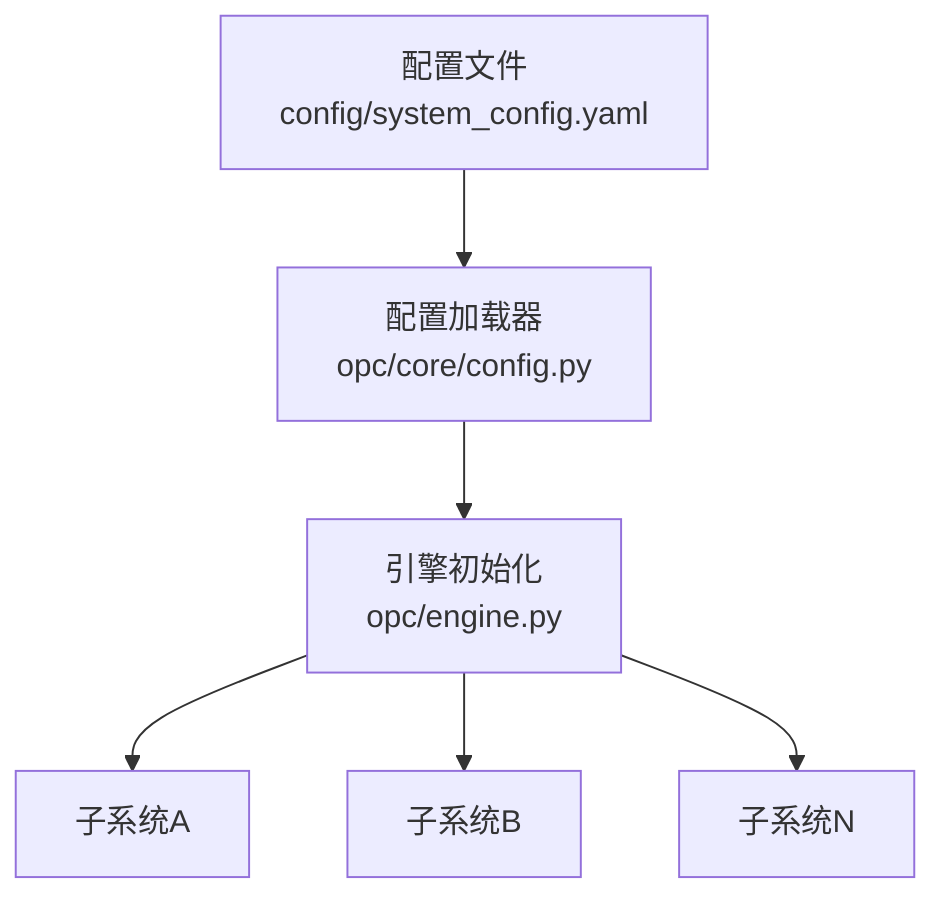
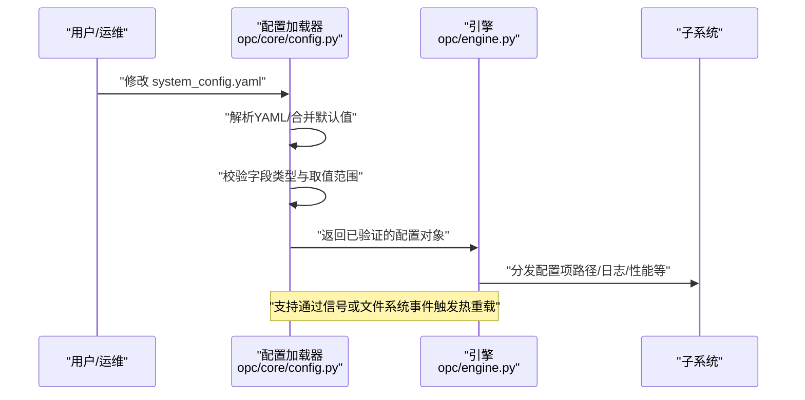
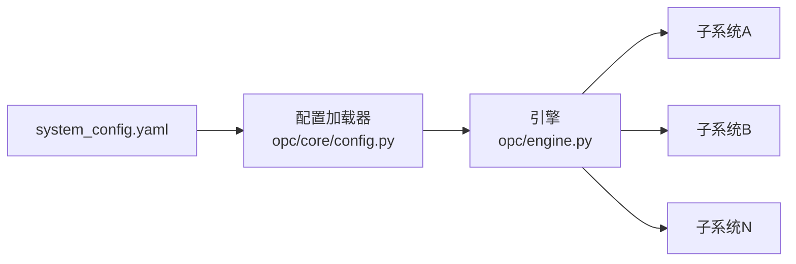

# 系统配置

<cite>
**本文引用的文件**   
- [system_config.yaml](file://config/system_config.yaml)
- [config.py](file://opc/core/config.py)
- [engine.py](file://opc/engine.py)
</cite>

## 目录
1. [简介](#简介)
2. [项目结构](#项目结构)
3. [核心组件](#核心组件)
4. [架构总览](#架构总览)
5. [详细组件分析](#详细组件分析)
6. [依赖分析](#依赖分析)
7. [性能考虑](#性能考虑)
8. [故障排除指南](#故障排除指南)
9. [结论](#结论)
10. [附录](#附录)

## 简介
本章节面向OpenOPC系统的“系统配置”主题，聚焦于 system_config.yaml 的结构与参数、配置优先级与继承机制、环境变量使用规范、配置验证与默认值处理、热重载实现原理与使用方法，以及常见场景的最佳实践与安全注意事项。文档旨在帮助运维与开发者以安全、灵活且可维护的方式管理OpenOPC运行期行为。

## 项目结构
OpenOPC将系统级配置集中在 config/system_config.yaml，并在运行时由核心配置模块加载、校验与合并。引擎启动时读取该配置并注入到各子系统。

图表来源
- [system_config.yaml](file://config/system_config.yaml)
- [config.py](file://opc/core/config.py)
- [engine.py](file://opc/engine.py)

章节来源
- [system_config.yaml](file://config/system_config.yaml)
- [config.py](file://opc/core/config.py)
- [engine.py](file://opc/engine.py)

## 核心组件
- 配置源：system_config.yaml 提供全局设置、路径、日志级别、性能调优等键值。
- 配置加载器：负责解析YAML、应用默认值、进行类型与范围校验、合并环境变量覆盖。
- 引擎集成：在启动阶段消费配置，驱动各子系统的初始化与运行策略。

章节来源
- [system_config.yaml](file://config/system_config.yaml)
- [config.py](file://opc/core/config.py)
- [engine.py](file://opc/engine.py)

## 架构总览
下图展示了从配置文件到运行时的关键流程：加载、校验、合并、注入与可选的热重载监听。

图表来源
- [config.py](file://opc/core/config.py)
- [engine.py](file://opc/engine.py)

## 详细组件分析

### 配置模型与字段说明
system_config.yaml 通常包含以下分组（具体键名以实际文件为准）：
- 全局设置
  - 示例键：运行模式、调试开关、时区、语言、数据根目录等
- 路径配置
  - 示例键：工作目录、日志目录、数据目录、插件目录、模板目录等
- 日志级别
  - 示例键：根日志级别、模块级别映射、输出目标（控制台/文件）、轮转策略等
- 性能调优
  - 示例键：并发线程数、连接池大小、超时时间、缓存容量、批处理大小等
- 安全与访问控制
  - 示例键：鉴权开关、令牌有效期、IP白名单、加密算法选择等
- 扩展与插件
  - 示例键：插件扫描路径、启用/禁用列表、版本约束等

说明：
- 所有键均为可选；未显式设置的键将回退至加载器内置默认值。
- 部分键支持嵌套结构，用于按模块细分配置。
- 若某键为敏感信息（如密钥），建议通过环境变量注入，避免明文落盘。

章节来源
- [system_config.yaml](file://config/system_config.yaml)

### 配置优先级与继承机制
- 优先级顺序（从高到低）
  1) 环境变量覆盖
  2) 命令行参数（如引擎支持）
  3) 用户提供的 system_config.yaml
  4) 加载器内置默认值
- 继承规则
  - 顶层键缺失时采用默认值；嵌套键仅覆盖指定分支，其余保持父级默认。
  - 列表型配置通常为“追加/替换”语义，取决于具体键的语义定义。
  - 布尔型与枚举型严格校验，非法值将被拒绝并给出错误提示。

章节来源
- [config.py](file://opc/core/config.py)

### 环境变量使用方法与命名规范
- 命名规范
  - 统一前缀：OPENOPC_
  - 层级映射：使用下划线分隔层级，例如 OPENOPC_LOG_LEVEL、OPENOPC_PATHS_DATA_DIR
  - 大小写：全大写
- 覆盖范围
  - 任何可通过YAML配置的标量或简单集合均可被环境变量覆盖。
  - 复杂对象建议使用JSON字符串形式，或由专用键拆分。
- 类型转换
  - 数值型：自动解析整数/浮点数
  - 布尔型：true/false/on/off/yes/no 均视为真
  - 空值：未设置的环境变量不会覆盖YAML中的值

章节来源
- [config.py](file://opc/core/config.py)

### 配置验证机制与默认值处理
- 验证维度
  - 必填性：对关键路径、端口、协议等进行存在性检查
  - 类型：确保整型、浮点、布尔、枚举、列表、字典等类型正确
  - 范围：对数值型进行上下界校验（如并发度、超时、缓存大小）
  - 一致性：跨字段联合校验（如日志目录需存在或可创建）
- 默认值策略
  - 未提供的键使用内置默认值
  - 默认值随版本演进可能调整，升级后应关注变更日志
- 错误反馈
  - 启动失败时输出清晰的错误上下文（键名、期望类型、当前值）

章节来源
- [config.py](file://opc/core/config.py)

### 配置热重载的实现原理与使用方法
- 实现原理
  - 文件监听：监控 system_config.yaml 的变更事件
  - 增量合并：仅重新解析变更片段，与当前内存配置进行合并
  - 原子切换：新配置经完整校验后，再原子替换旧配置引用，保证一致性
  - 副作用处理：对需要重启的子系统，采用优雅关闭与重建流程
- 使用方法
  - 直接编辑 system_config.yaml 并保存
  - 或通过外部工具发送重载信号（若引擎暴露相应接口）
  - 观察日志确认“配置已重载”与“受影响服务已重启”的消息
- 注意事项
  - 热重载不适用于所有配置项（如进程级资源限制）
  - 频繁重载可能带来抖动，建议批量修改后一次性生效

章节来源
- [config.py](file://opc/core/config.py)
- [engine.py](file://opc/engine.py)

### 典型配置场景与最佳实践
- 开发环境
  - 开启调试模式、提高日志详细程度、降低并发与缓存上限
  - 使用本地路径与最小化外部依赖
- 生产环境
  - 收紧日志级别、启用日志轮转与集中收集
  - 合理设置并发、连接池与超时，结合压测结果调优
  - 启用鉴权与白名单，密钥通过环境变量注入
- 多租户/多实例
  - 按实例隔离数据与日志目录
  - 使用独立配置文件与环境变量区分不同环境

[本节为通用指导，不直接分析具体文件]

### 安全性考虑
- 敏感信息
  - 禁止在YAML中硬编码密钥；使用环境变量或密钥管理服务
- 权限控制
  - 限制配置文件读写权限，避免非授权修改
- 输入校验
  - 严格校验所有配置项，防止恶意构造导致越权或崩溃
- 最小权限
  - 以最小必要权限运行进程，减少攻击面

[本节为通用指导，不直接分析具体文件]

## 依赖分析
配置模块与引擎之间的依赖关系如下：

图表来源
- [system_config.yaml](file://config/system_config.yaml)
- [config.py](file://opc/core/config.py)
- [engine.py](file://opc/engine.py)

章节来源
- [config.py](file://opc/core/config.py)
- [engine.py](file://opc/engine.py)

## 性能考虑
- 并发与线程池
  - 根据CPU核数与I/O特性调整并发度，避免过度竞争
- I/O与缓存
  - 合理设置缓存容量与过期策略，平衡命中率与内存占用
- 超时与重试
  - 对外部依赖设置合理的超时与退避策略，避免雪崩
- 日志开销
  - 生产环境降低日志级别，启用异步写入与轮转

[本节为通用指导，不直接分析具体文件]

## 故障排除指南
- 启动时报错“配置校验失败”
  - 检查键名拼写、类型与取值范围
  - 查看错误上下文定位具体字段
- 热重载未生效
  - 确认文件确实发生修改（时间戳变化）
  - 检查是否触发了不受热重载支持的配置项
- 环境变量未覆盖
  - 核对前缀与命名规范是否正确
  - 确认环境变量在当前进程环境中可见
- 路径不可用
  - 检查目录是否存在与权限是否足够
  - 确认相对路径基于正确的执行工作目录

章节来源
- [config.py](file://opc/core/config.py)

## 结论
通过统一的 system_config.yaml 与严格的加载、校验与合并机制，OpenOPC实现了高内聚、低耦合的系统配置管理。配合环境变量注入与热重载能力，可在保障安全性的前提下提升部署与运维效率。建议在生产环境遵循最小权限与最小暴露原则，并结合压测持续优化性能相关参数。

[本节为总结性内容，不直接分析具体文件]

## 附录
- 术语
  - 热重载：在不中断服务的前提下动态更新配置并生效
  - 原子切换：新旧配置在同一时刻完成切换，避免中间态不一致
- 参考
  - 配置文件位置：config/system_config.yaml
  - 配置加载与校验逻辑：opc/core/config.py
  - 引擎集成入口：opc/engine.py