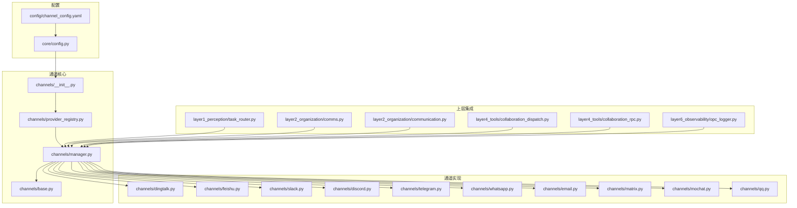
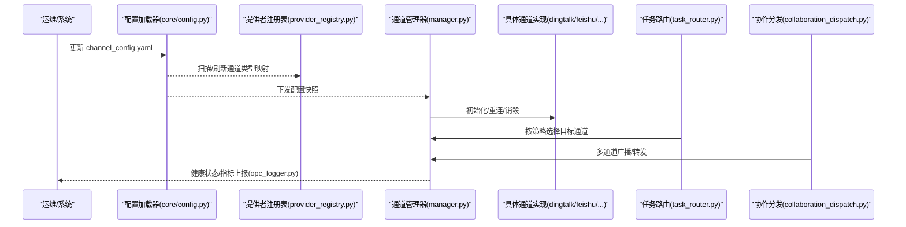
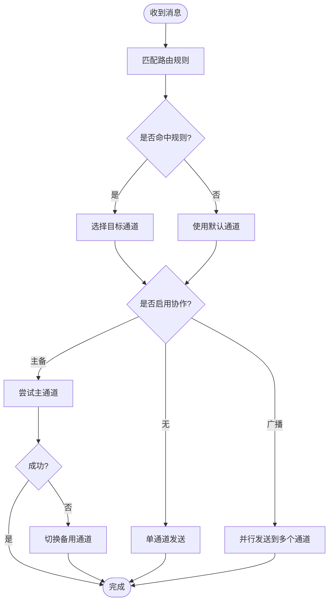
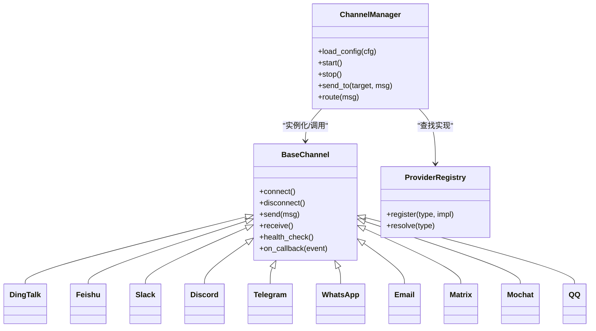

# 通道配置

<cite>
**本文引用的文件**   
- [channel_config.yaml](file://config/channel_config.yaml)
- [channels/__init__.py](file://opc/channels/__init__.py)
- [channels/base.py](file://opc/channels/base.py)
- [channels/manager.py](file://opc/channels/manager.py)
- [channels/provider_registry.py](file://opc/channels/provider_registry.py)
- [channels/dingtalk.py](file://opc/channels/dingtalk.py)
- [channels/feishu.py](file://opc/channels/feishu.py)
- [channels/slack.py](file://opc/channels/slack.py)
- [channels/discord.py](file://opc/channels/discord.py)
- [channels/telegram.py](file://opc/channels/telegram.py)
- [channels/whatsapp.py](file://opc/channels/whatsapp.py)
- [channels/email.py](file://opc/channels/email.py)
- [channels/matrix.py](file://opc/channels/matrix.py)
- [channels/mochat.py](file://opc/channels/mochat.py)
- [channels/qq.py](file://opc/channels/qq.py)
- [core/config.py](file://opc/core/config.py)
- [layer1_perception/task_router.py](file://opc/layer1_perception/task_router.py)
- [layer2_organization/comms.py](file://opc/layer2_organization/comms.py)
- [layer2_organization/communication.py](file://opc/layer2_organization/communication.py)
- [layer4_tools/collaboration_dispatch.py](file://opc/layer4_tools/collaboration_dispatch.py)
- [layer4_tools/collaboration_rpc.py](file://opc/layer4_tools/collaboration_rpc.py)
- [layer6_observability/opc_logger.py](file://opc/layer6_observability/opc_logger.py)
</cite>

## 目录
1. [简介](#简介)
2. [项目结构](#项目结构)
3. [核心组件](#核心组件)
4. [架构总览](#架构总览)
5. [详细组件分析](#详细组件分析)
6. [依赖关系分析](#依赖关系分析)
7. [性能考虑](#性能考虑)
8. [故障排查指南](#故障排查指南)
9. [结论](#结论)
10. [附录](#附录)

## 简介
本章节面向OpenOPC的“通道（Channel）”子系统，聚焦于通过 channel_config.yaml 进行多通道统一配置与运行时管理。文档将说明：
- 配置文件结构与字段含义
- 各通信渠道（钉钉、飞书、Slack、Discord、Telegram、WhatsApp等）的认证与连接参数
- 消息格式与回调URL配置
- 通道启用/禁用机制与动态加载
- 消息路由规则与多通道协作
- 特殊选项与限制
- 连接测试、错误诊断与性能优化最佳实践

## 项目结构
通道子系统位于 opc/channels 目录下，采用“提供者注册 + 管理器调度”的分层设计；配置由 core/config 统一加载，路由与协作逻辑在 layer1/layer2/layer4 中协同完成。

图表来源
- [core/config.py](file://opc/core/config.py)
- [channels/__init__.py](file://opc/channels/__init__.py)
- [channels/provider_registry.py](file://opc/channels/provider_registry.py)
- [channels/manager.py](file://opc/channels/manager.py)
- [channels/base.py](file://opc/channels/base.py)
- [channels/dingtalk.py](file://opc/channels/dingtalk.py)
- [channels/feishu.py](file://opc/channels/feishu.py)
- [channels/slack.py](file://opc/channels/slack.py)
- [channels/discord.py](file://opc/channels/discord.py)
- [channels/telegram.py](file://opc/channels/telegram.py)
- [channels/whatsapp.py](file://opc/channels/whatsapp.py)
- [channels/email.py](file://opc/channels/email.py)
- [channels/matrix.py](file://opc/channels/matrix.py)
- [channels/mochat.py](file://opc/channels/mochat.py)
- [channels/qq.py](file://opc/channels/qq.py)
- [layer1_perception/task_router.py](file://opc/layer1_perception/task_router.py)
- [layer2_organization/comms.py](file://opc/layer2_organization/comms.py)
- [layer2_organization/communication.py](file://opc/layer2_organization/communication.py)
- [layer4_tools/collaboration_dispatch.py](file://opc/layer4_tools/collaboration_dispatch.py)
- [layer4_tools/collaboration_rpc.py](file://opc/layer4_tools/collaboration_rpc.py)
- [layer6_observability/opc_logger.py](file://opc/layer6_observability/opc_logger.py)

章节来源
- [core/config.py](file://opc/core/config.py)
- [channels/__init__.py](file://opc/channels/__init__.py)
- [channels/provider_registry.py](file://opc/channels/provider_registry.py)
- [channels/manager.py](file://opc/channels/manager.py)
- [channels/base.py](file://opc/channels/base.py)

## 核心组件
- 配置加载器：负责读取并解析 channel_config.yaml，提供统一的配置访问接口。
- 提供者注册表：维护通道类型到实现的映射，支持扩展新通道。
- 通道管理器：根据配置实例化、启动、停止通道，并提供发送/接收的统一API。
- 基础抽象：定义通道通用能力（连接、鉴权、消息收发、回调处理、健康检查）。
- 具体通道实现：钉钉、飞书、Slack、Discord、Telegram、WhatsApp、Email、Matrix、Mochat、QQ等。

章节来源
- [core/config.py](file://opc/core/config.py)
- [channels/provider_registry.py](file://opc/channels/provider_registry.py)
- [channels/manager.py](file://opc/channels/manager.py)
- [channels/base.py](file://opc/channels/base.py)

## 架构总览
通道子系统遵循“配置驱动 + 插件式提供者 + 集中管理”的架构。配置变更可触发动态重载，管理器负责生命周期管理与错误恢复。

图表来源
- [core/config.py](file://opc/core/config.py)
- [channels/provider_registry.py](file://opc/channels/provider_registry.py)
- [channels/manager.py](file://opc/channels/manager.py)
- [layer1_perception/task_router.py](file://opc/layer1_perception/task_router.py)
- [layer4_tools/collaboration_dispatch.py](file://opc/layer4_tools/collaboration_dispatch.py)
- [layer6_observability/opc_logger.py](file://opc/layer6_observability/opc_logger.py)

## 详细组件分析

### 配置文件结构（channel_config.yaml）
- 顶层键
  - channels：通道列表，每个条目包含 type、enabled、name、options 等
  - routing：全局路由策略（如默认通道、按标签/组织/会话路由）
  - collaboration：多通道协作策略（广播、主从、回退）
  - observability：日志与监控开关、采样率、告警阈值
- 通道通用字段
  - type：通道类型标识（dingtalk、feishu、slack、discord、telegram、whatsapp、email、matrix、mochat、qq）
  - enabled：是否启用（true/false）
  - name：通道名称（用于日志与路由匹配）
  - options：通道特定参数（见下节）
- 路由字段
  - default_channel：未命中规则时的默认通道
  - rules：按条件匹配的目标通道（如按用户、群组、关键词、优先级）
- 协作字段
  - mode：broadcast（广播）、primary-fallback（主备）、fanout（扇出）
  - targets：目标通道集合或表达式
- 观测字段
  - log_level：日志级别
  - metrics：是否开启指标采集
  - alert_on_failure：失败时是否告警

章节来源
- [channel_config.yaml](file://config/channel_config.yaml)
- [core/config.py](file://opc/core/config.py)

### 通道提供者注册与发现
- 注册表维护 type -> 实现类的映射
- 支持热插拔：新增通道实现后无需重启即可被管理器发现
- 校验：对重复type、缺失必需字段进行快速自检

章节来源
- [channels/provider_registry.py](file://opc/channels/provider_registry.py)
- [channels/__init__.py](file://opc/channels/__init__.py)

### 通道管理器（生命周期与调度）
- 职责
  - 读取配置并实例化通道
  - 启动/停止/重连
  - 统一发送/接收接口
  - 健康检查与自动恢复
- 关键流程
  - 启动：遍历 channels，按 enabled 过滤，调用对应实现 connect()
  - 运行：监听事件总线，按路由规则投递消息
  - 关闭：优雅断开连接，持久化状态

章节来源
- [channels/manager.py](file://opc/channels/manager.py)
- [channels/base.py](file://opc/channels/base.py)

### 基础抽象（Base Channel）
- 定义通用方法：connect、disconnect、send、receive、health_check、on_callback
- 约定回调协议：入站消息标准化为内部模型，出站消息适配平台格式
- 错误模型：网络异常、鉴权失败、限流、格式错误等

章节来源
- [channels/base.py](file://opc/channels/base.py)

### 各通道配置要点与限制

#### 钉钉（DingTalk）
- 认证
  - app_key/app_secret 或 access_token
  - webhook_url（机器人回调）
- 连接参数
  - api_base、timeout、retry_count
- 消息格式
  - text/markdown/富媒体附件
- 回调URL
  - callback_url 需公网可达且支持签名校验
- 限制
  - 频率限制、消息体大小上限

章节来源
- [channels/dingtalk.py](file://opc/channels/dingtalk.py)
- [channel_config.yaml](file://config/channel_config.yaml)

#### 飞书（Feishu/Lark）
- 认证
  - app_id/app_secret 或 tenant_access_token
- 连接参数
  - api_base、timeout、重试策略
- 消息格式
  - text/rich_text/interactive卡片
- 回调URL
  - event_url 需支持事件订阅与验证
- 限制
  - 事件订阅配额、卡片模板限制

章节来源
- [channels/feishu.py](file://opc/channels/feishu.py)
- [channel_config.yaml](file://config/channel_config.yaml)

#### Slack
- 认证
  - bot_token、app_token
- 连接参数
  - socket_mode/webhook、超时、重试
- 消息格式
  - blocks、mrkdwn、附件
- 回调URL
  - request_url（事件订阅）
- 限制
  - 速率限制、权限范围

章节来源
- [channels/slack.py](file://opc/channels/slack.py)
- [channel_config.yaml](file://config/channel_config.yaml)

#### Discord
- 认证
  - bot_token
- 连接参数
  - gateway、presence、intents
- 消息格式
  - embeds、components、附件
- 回调URL
  - 通常使用长连接而非HTTP回调
- 限制
  - intents权限、消息长度

章节来源
- [channels/discord.py](file://opc/channels/discord.py)
- [channel_config.yaml](file://config/channel_config.yaml)

#### Telegram
- 认证
  - bot_token
- 连接参数
  - api_base、proxy、timeout
- 消息格式
  - MarkdownV2/HTML、媒体、键盘
- 回调URL
  - webhook_url 或 long polling
- 限制
  - 文件大小、编辑次数限制

章节来源
- [channels/telegram.py](file://opc/channels/telegram.py)
- [channel_config.yaml](file://config/channel_config.yaml)

#### WhatsApp（第三方网关）
- 认证
  - provider=xxx, token/api_key
- 连接参数
  - api_base、webhook_verify_token
- 消息格式
  - text/media/template
- 回调URL
  - webhook_url
- 限制
  - 模板消息审批、会话窗口

章节来源
- [channels/whatsapp.py](file://opc/channels/whatsapp.py)
- [channel_config.yaml](file://config/channel_config.yaml)

#### Email
- 认证
  - smtp_server/port/ssl、username/password 或 OAuth
- 连接参数
  - timeout、重试、队列大小
- 消息格式
  - HTML/纯文本、附件
- 回调URL
  - 一般不使用回调，采用轮询或IMAP监听
- 限制
  - 附件大小、发信频率

章节来源
- [channels/email.py](file://opc/channels/email.py)
- [channel_config.yaml](file://config/channel_config.yaml)

#### Matrix
- 认证
  - homeserver、user_id/access_token
- 连接参数
  - sync_timeout、room_id
- 消息格式
  - m.text/m.html、富媒体
- 回调URL
  - 基于长连接同步
- 限制
  - 服务器策略、房间权限

章节来源
- [channels/matrix.py](file://opc/channels/matrix.py)
- [channel_config.yaml](file://config/channel_config.yaml)

#### Mochat
- 认证
  - server_url、token
- 连接参数
  - timeout、重试
- 消息格式
  - 文本/富文本/附件
- 回调URL
  - webhook_url
- 限制
  - 平台能力差异

章节来源
- [channels/mochat.py](file://opc/channels/mochat.py)
- [channel_config.yaml](file://config/channel_config.yaml)

#### QQ
- 认证
  - app_id/app_secret 或 token
- 连接参数
  - api_base、timeout
- 消息格式
  - 私聊/群聊、富媒体
- 回调URL
  - callback_url
- 限制
  - 频率限制、消息类型

章节来源
- [channels/qq.py](file://opc/channels/qq.py)
- [channel_config.yaml](file://config/channel_config.yaml)

### 启用/禁用与动态加载
- 启用/禁用
  - 通过 channels[*].enabled 控制
  - 管理器启动时仅加载 enabled=true 的通道
- 动态加载
  - 配置变更触发重新加载：管理器检测变更并执行增量更新（新增/删除/修改）
  - 安全校验：type必须已注册，options必填项完整
- 回滚策略
  - 若新配置导致通道初始化失败，保持上一份有效配置

章节来源
- [channels/manager.py](file://opc/channels/manager.py)
- [core/config.py](file://opc/core/config.py)

### 消息路由规则与多通道协作
- 路由规则
  - default_channel：兜底通道
  - rules：按用户/群组/标签/关键词/优先级匹配
- 协作模式
  - broadcast：向多个通道同时推送
  - primary-fallback：主通道失败自动切换到备用通道
  - fanout：按条件分流到不同通道
- 决策流程

图表来源
- [layer1_perception/task_router.py](file://opc/layer1_perception/task_router.py)
- [layer4_tools/collaboration_dispatch.py](file://opc/layer4_tools/collaboration_dispatch.py)
- [layer2_organization/comms.py](file://opc/layer2_organization/comms.py)
- [layer2_organization/communication.py](file://opc/layer2_organization/communication.py)

章节来源
- [layer1_perception/task_router.py](file://opc/layer1_perception/task_router.py)
- [layer4_tools/collaboration_dispatch.py](file://opc/layer4_tools/collaboration_dispatch.py)
- [layer2_organization/comms.py](file://opc/layer2_organization/comms.py)
- [layer2_organization/communication.py](file://opc/layer2_organization/communication.py)

## 依赖关系分析
- 低耦合：通道实现仅依赖基础抽象与注册表，不直接耦合上层业务
- 高内聚：每个通道实现封装自身协议细节
- 外部依赖：各通道的SDK/API、网络库、加密库
- 潜在循环：应避免在通道实现中反向依赖 manager 或 config，改为通过接口注入

图表来源
- [channels/base.py](file://opc/channels/base.py)
- [channels/provider_registry.py](file://opc/channels/provider_registry.py)
- [channels/manager.py](file://opc/channels/manager.py)
- [channels/dingtalk.py](file://opc/channels/dingtalk.py)
- [channels/feishu.py](file://opc/channels/feishu.py)
- [channels/slack.py](file://opc/channels/slack.py)
- [channels/discord.py](file://opc/channels/discord.py)
- [channels/telegram.py](file://opc/channels/telegram.py)
- [channels/whatsapp.py](file://opc/channels/whatsapp.py)
- [channels/email.py](file://opc/channels/email.py)
- [channels/matrix.py](file://opc/channels/matrix.py)
- [channels/mochat.py](file://opc/channels/mochat.py)
- [channels/qq.py](file://opc/channels/qq.py)

章节来源
- [channels/base.py](file://opc/channels/base.py)
- [channels/provider_registry.py](file://opc/channels/provider_registry.py)
- [channels/manager.py](file://opc/channels/manager.py)

## 性能考虑
- 连接复用与池化：对HTTP/长连接通道启用连接池，减少握手开销
- 并发与限流：按通道维度设置并发度与令牌桶限流，避免触发平台侧限速
- 批量发送：合并小消息，降低请求频次
- 异步I/O：优先使用异步客户端，提升吞吐
- 缓存热点数据：如频道列表、用户信息，减少重复查询
- 背压与队列：当下游不可用时，进入持久化队列，避免丢消息
- 指标与采样：合理设置指标采样率，避免监控风暴

[本节为通用指导，不直接分析具体文件]

## 故障排查指南
- 常见问题
  - 认证失败：检查 app_key/token 是否正确、权限是否授予
  - 回调不可达：确认回调URL公网可达、域名解析正确、防火墙放行
  - 限流/封禁：观察返回码与重试间隔，调整发送节奏
  - 消息格式错误：核对平台要求的消息体结构
- 诊断步骤
  - 查看通道健康状态与最近错误
  - 打开调试日志，定位具体失败点
  - 使用最小配置复现问题
  - 隔离单个通道验证连通性
- 工具与建议
  - 使用 health_check 接口探测
  - 借助日志与指标定位瓶颈
  - 对关键通道启用主备与重试

章节来源
- [layer6_observability/opc_logger.py](file://opc/layer6_observability/opc_logger.py)
- [channels/manager.py](file://opc/channels/manager.py)
- [channels/base.py](file://opc/channels/base.py)

## 结论
通过 channel_config.yaml 统一管理多通道，结合提供者注册与集中管理器，OpenOPC实现了可扩展、可观测、可编排的通道体系。配合清晰的路由与协作策略，可在复杂场景下稳定高效地交付消息。

[本节为总结性内容，不直接分析具体文件]

## 附录
- 术语
  - 通道：对外通信能力的抽象（如钉钉、飞书等）
  - 提供者：具体通道实现类
  - 回调URL：平台向OpenOPC推送事件的HTTP端点
- 参考路径
  - 配置样例：[channel_config.yaml](file://config/channel_config.yaml)
  - 通道实现：[channels/*](file://opc/channels/)
  - 配置加载：[core/config.py](file://opc/core/config.py)
  - 路由与协作：[layer1_perception/task_router.py](file://opc/layer1_perception/task_router.py)、[layer4_tools/collaboration_dispatch.py](file://opc/layer4_tools/collaboration_dispatch.py)