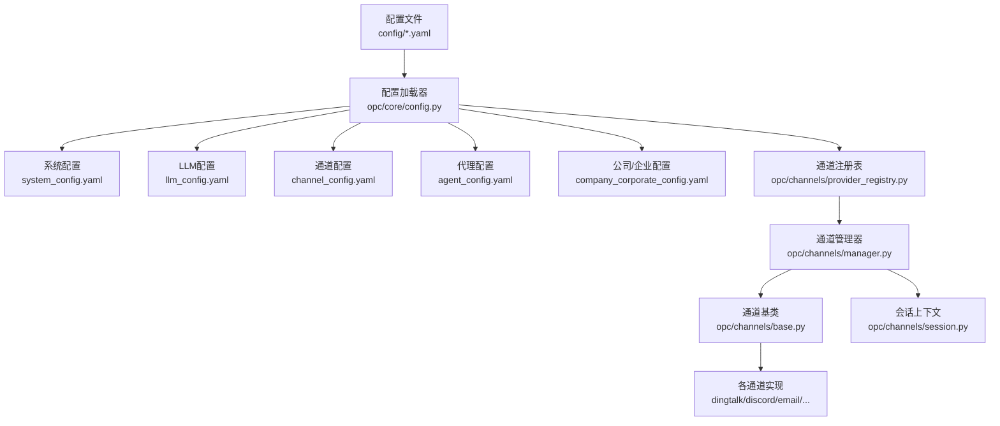
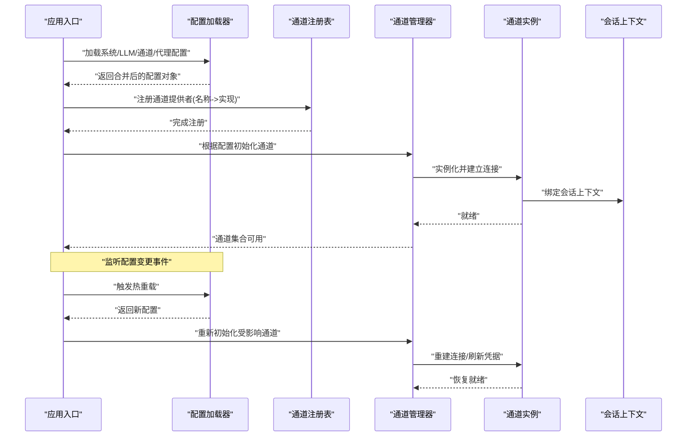
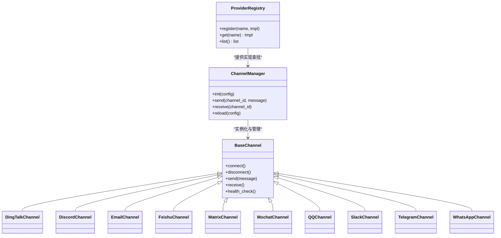
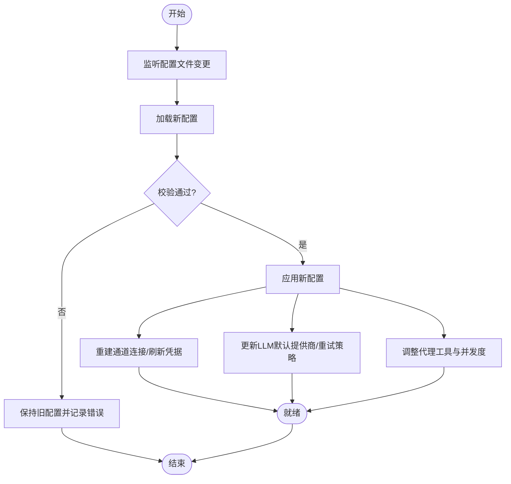
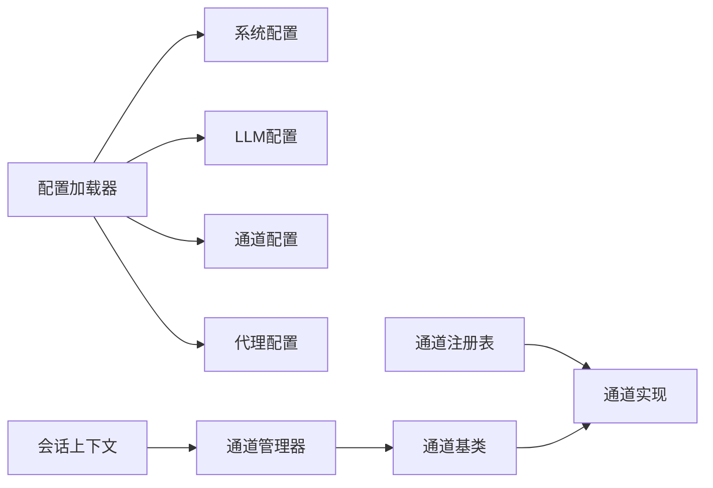

# 配置管理

<cite>
**本文引用的文件**   
- [config.py](file://opc/core/config.py)
- [system_config.yaml](file://config/system_config.yaml)
- [llm_config.yaml](file://config/llm_config.yaml)
- [channel_config.yaml](file://config/channel_config.yaml)
- [agent_config.yaml](file://config/agent_config.yaml)
- [company_corporate_config.yaml](file://config/company_corporate_config.yaml)
- [provider_registry.py](file://opc/channels/provider_registry.py)
- [manager.py](file://opc/channels/manager.py)
- [base.py](file://opc/channels/base.py)
- [provider_base.py](file://opc/channels/provider_base.py)
- [dingtalk.py](file://opc/channels/dingtalk.py)
- [discord.py](file://opc/channels/discord.py)
- [email.py](file://opc/channels/email.py)
- [feishu.py](file://opc/channels/feishu.py)
- [matrix.py](file://opc/channels/matrix.py)
- [mochat.py](file://opc/channels/mochat.py)
- [qq.py](file://opc/channels/qq.py)
- [slack.py](file://opc/channels/slack.py)
- [telegram.py](file://opc/channels/telegram.py)
- [whatsapp.py](file://opc/channels/whatsapp.py)
- [session.py](file://opc/channels/session.py)
- [org_config.py](file://opc/core/org_config.py)
- [engine.py](file://opc/engine.py)
</cite>

## 目录
1. [简介](#简介)
2. [项目结构](#项目结构)
3. [核心组件](#核心组件)
4. [架构总览](#架构总览)
5. [详细组件分析](#详细组件分析)
6. [依赖关系分析](#依赖关系分析)
7. [性能考虑](#性能考虑)
8. [故障排查指南](#故障排查指南)
9. [结论](#结论)
10. [附录](#附录)

## 简介
本文件面向OpenOPC的配置管理，聚焦以下目标：
- 解释配置文件的层次结构与优先级规则
- 说明系统配置的关键参数（全局设置、路径与环境变量）
- 描述LLM配置的模型提供商、API密钥与请求参数调优方法
- 阐述通道配置的完整流程（认证、连接、消息格式）
- 解释代理配置选项与行为控制
- 提供配置校验与错误处理机制
- 支持配置热重载与动态更新
- 给出配置模板与最佳实践建议，确保灵活性与安全性

## 项目结构
OpenOPC采用“集中式配置加载 + 模块化配置项”的组织方式。配置文件位于仓库根目录的 config 子目录中，运行时由核心配置模块统一加载、合并与校验。通道子系统通过注册表发现并实例化具体通道实现，结合会话上下文完成消息收发。

图表来源
- [config.py:1-200](file://opc/core/config.py#L1-L200)
- [provider_registry.py:1-200](file://opc/channels/provider_registry.py#L1-L200)
- [manager.py:1-200](file://opc/channels/manager.py#L1-L200)
- [base.py:1-200](file://opc/channels/base.py#L1-L200)
- [session.py:1-200](file://opc/channels/session.py#L1-L200)

章节来源
- [config.py:1-200](file://opc/core/config.py#L1-L200)
- [provider_registry.py:1-200](file://opc/channels/provider_registry.py#L1-L200)
- [manager.py:1-200](file://opc/channels/manager.py#L1-L200)
- [base.py:1-200](file://opc/channels/base.py#L1-L200)
- [session.py:1-200](file://opc/channels/session.py#L1-L200)

## 核心组件
- 配置加载与合并：负责从多个YAML源读取配置，按优先级合并，解析环境变量，输出统一的配置对象供上层使用。
- 通道注册表：维护通道提供者名称到实现的映射，支持动态发现与按需实例化。
- 通道管理器：根据配置创建并缓存通道实例，提供统一的发送/接收接口。
- 通道基类与提供者基类：定义通道通用能力与生命周期钩子，约束认证、连接、消息编解码等契约。
- 会话上下文：封装会话级状态（如用户、房间、历史），在通道间复用。

章节来源
- [config.py:1-200](file://opc/core/config.py#L1-L200)
- [provider_registry.py:1-200](file://opc/channels/provider_registry.py#L1-L200)
- [manager.py:1-200](file://opc/channels/manager.py#L1-L200)
- [base.py:1-200](file://opc/channels/base.py#L1-L200)
- [provider_base.py:1-200](file://opc/channels/provider_base.py#L1-L200)
- [session.py:1-200](file://opc/channels/session.py#L1-L200)

## 架构总览
下图展示了配置驱动的系统启动与通道初始化流程，以及配置变更时的热重载路径。

图表来源
- [engine.py:1-200](file://opc/engine.py#L1-L200)
- [config.py:1-200](file://opc/core/config.py#L1-L200)
- [provider_registry.py:1-200](file://opc/channels/provider_registry.py#L1-L200)
- [manager.py:1-200](file://opc/channels/manager.py#L1-L200)
- [base.py:1-200](file://opc/channels/base.py#L1-L200)
- [session.py:1-200](file://opc/channels/session.py#L1-L200)

## 详细组件分析

### 配置加载与合并（系统配置、路径与环境变量）
- 配置文件层次
  - system_config.yaml：全局运行参数、日志级别、数据与缓存路径、超时与并发限制等
  - llm_config.yaml：模型提供商列表、默认模型、API密钥引用、请求参数（温度、最大令牌数、重试策略等）
  - channel_config.yaml：通道启用开关、连接参数、认证信息、消息格式与路由策略
  - agent_config.yaml：代理行为、工具集、权限与安全边界
  - company_corporate_config.yaml：组织/企业级策略、协作与审批策略
- 优先级规则
  - 基础配置（仓库内默认） < 用户覆盖配置（config/*.yaml） < 环境变量覆盖
  - 同层级键值以“后加载覆盖先加载”的策略合并
- 路径与环境变量
  - 路径配置支持相对路径与绝对路径；若未显式指定，则基于工作目录或默认目录解析
  - 敏感字段（如API密钥）优先从环境变量注入，避免硬编码
- 校验与错误处理
  - 必填字段缺失时抛出明确错误，包含字段名与期望类型
  - 非法值（如端口范围、布尔值）进行范围与类型检查
  - 对未知键可选择忽略或报错（可配置）

章节来源
- [config.py:1-200](file://opc/core/config.py#L1-L200)
- [system_config.yaml:1-200](file://config/system_config.yaml#L1-L200)
- [llm_config.yaml:1-200](file://config/llm_config.yaml#L1-L200)
- [channel_config.yaml:1-200](file://config/channel_config.yaml#L1-L200)
- [agent_config.yaml:1-200](file://config/agent_config.yaml#L1-L200)
- [company_corporate_config.yaml:1-200](file://config/company_corporate_config.yaml#L1-L200)

### LLM配置（模型提供商、API密钥与请求参数）
- 模型提供商设置
  - 支持多提供商并列配置，每个提供商包含名称、端点、鉴权方式与可选参数
  - 默认提供商可在系统配置中指定
- API密钥管理
  - 推荐通过环境变量注入密钥，避免写入配置文件
  - 支持密钥别名与多环境切换
- 请求参数调优
  - 温度、最大令牌数、TopP、频率惩罚等可按提供商或全局覆盖
  - 重试与退避策略：最大重试次数、初始延迟、指数退避上限
- 安全与审计
  - 敏感字段不落盘；日志脱敏
  - 访问控制与配额限制（结合系统配置）

章节来源
- [llm_config.yaml:1-200](file://config/llm_config.yaml#L1-L200)
- [config.py:1-200](file://opc/core/config.py#L1-L200)

### 通道配置（认证、连接与消息格式）
- 认证设置
  - 不同通道采用不同的认证方式（Token、OAuth、证书等）
  - 认证凭据优先从环境变量注入，配置文件仅保留占位符或别名
- 连接参数
  - 服务器地址、端口、协议（HTTP/WebSocket）、TLS开关与证书路径
  - 连接池大小、超时、重连策略与心跳间隔
- 消息格式
  - 文本、富文本、附件、卡片等多模态消息的序列化/反序列化规则
  - 路由策略：按频道、群组、标签分发
- 通道生命周期
  - 初始化、连接、鉴权、订阅、断开与清理
  - 健康检查与自动恢复

图表来源
- [provider_registry.py:1-200](file://opc/channels/provider_registry.py#L1-L200)
- [manager.py:1-200](file://opc/channels/manager.py#L1-L200)
- [base.py:1-200](file://opc/channels/base.py#L1-L200)
- [dingtalk.py:1-200](file://opc/channels/dingtalk.py#L1-L200)
- [discord.py:1-200](file://opc/channels/discord.py#L1-L200)
- [email.py:1-200](file://opc/channels/email.py#L1-L200)
- [feishu.py:1-200](file://opc/channels/feishu.py#L1-L200)
- [matrix.py:1-200](file://opc/channels/matrix.py#L1-L200)
- [mochat.py:1-200](file://opc/channels/mochat.py#L1-L200)
- [qq.py:1-200](file://opc/channels/qq.py#L1-L200)
- [slack.py:1-200](file://opc/channels/slack.py#L1-L200)
- [telegram.py:1-200](file://opc/channels/telegram.py#L1-L200)
- [whatsapp.py:1-200](file://opc/channels/whatsapp.py#L1-L200)

章节来源
- [channel_config.yaml:1-200](file://config/channel_config.yaml#L1-L200)
- [provider_registry.py:1-200](file://opc/channels/provider_registry.py#L1-L200)
- [manager.py:1-200](file://opc/channels/manager.py#L1-L200)
- [base.py:1-200](file://opc/channels/base.py#L1-L200)
- [provider_base.py:1-200](file://opc/channels/provider_base.py#L1-L200)
- [session.py:1-200](file://opc/channels/session.py#L1-L200)

### 代理配置（行为控制与安全边界）
- 行为控制
  - 工具集启用/禁用、执行模式（同步/异步）、并发度
  - 会话隔离、上下文窗口与记忆策略
- 安全边界
  - 沙箱执行、文件系统访问白名单、网络访问策略
  - 输入输出过滤与脱敏
- 组织策略集成
  - 与公司/企业配置联动，继承角色权限与审批流程

章节来源
- [agent_config.yaml:1-200](file://config/agent_config.yaml#L1-L200)
- [company_corporate_config.yaml:1-200](file://config/company_corporate_config.yaml#L1-L200)
- [org_config.py:1-200](file://opc/core/org_config.py#L1-L200)

### 配置验证与错误处理
- 校验阶段
  - 类型检查、必填字段校验、取值范围与枚举值校验
  - 跨字段一致性校验（如证书路径与TLS开关）
- 错误处理
  - 结构化错误信息，包含字段路径与修复建议
  - 失败回滚：当部分配置不可用时，保持已生效配置不变
- 日志与审计
  - 记录配置加载与变更事件，脱敏敏感字段

章节来源
- [config.py:1-200](file://opc/core/config.py#L1-L200)

### 配置热重载与动态更新
- 热重载机制
  - 监听配置文件变更事件（文件系统或外部配置中心）
  - 增量合并：仅更新受影响的配置段
- 动态更新
  - 通道层：重新建立连接、刷新凭据、调整连接池与超时
  - LLM层：切换默认提供商、更新重试策略
  - 代理层：动态启停工具、调整并发度
- 一致性保障
  - 原子替换：新配置完全校验通过后，再替换旧配置
  - 回滚策略：新版本异常时自动回滚至上一版本

图表来源
- [config.py:1-200](file://opc/core/config.py#L1-L200)
- [manager.py:1-200](file://opc/channels/manager.py#L1-L200)
- [engine.py:1-200](file://opc/engine.py#L1-L200)

章节来源
- [config.py:1-200](file://opc/core/config.py#L1-L200)
- [manager.py:1-200](file://opc/channels/manager.py#L1-L200)
- [engine.py:1-200](file://opc/engine.py#L1-L200)

## 依赖关系分析
- 配置加载器依赖YAML解析与路径解析库
- 通道注册表依赖通道实现模块的动态导入
- 通道管理器依赖通道基类与提供者基类的抽象契约
- 会话上下文依赖通道实例的状态管理

图表来源
- [config.py:1-200](file://opc/core/config.py#L1-L200)
- [provider_registry.py:1-200](file://opc/channels/provider_registry.py#L1-L200)
- [manager.py:1-200](file://opc/channels/manager.py#L1-L200)
- [base.py:1-200](file://opc/channels/base.py#L1-L200)
- [session.py:1-200](file://opc/channels/session.py#L1-L200)

章节来源
- [config.py:1-200](file://opc/core/config.py#L1-L200)
- [provider_registry.py:1-200](file://opc/channels/provider_registry.py#L1-L200)
- [manager.py:1-200](file://opc/channels/manager.py#L1-L200)
- [base.py:1-200](file://opc/channels/base.py#L1-L200)
- [session.py:1-200](file://opc/channels/session.py#L1-L200)

## 性能考虑
- 连接池与会话复用：合理设置连接池大小与空闲回收策略，减少握手开销
- 重试与退避：为LLM与通道调用配置合适的重试次数与退避上限，避免雪崩
- 并发度控制：根据CPU与I/O特性调整代理工具的并发度
- 日志与监控：降低高频日志级别，关键指标上报至监控系统

## 故障排查指南
- 常见问题
  - 配置缺失或类型错误：检查必填字段与类型声明
  - 认证失败：确认环境变量注入的密钥正确且有效
  - 连接超时：检查网络可达性、防火墙与代理设置
  - 热重载无效：确认监听路径与文件权限
- 定位步骤
  - 查看配置加载日志，关注错误信息与字段路径
  - 使用最小化配置复现问题，逐步添加配置项
  - 对通道与健康检查接口进行独立测试

章节来源
- [config.py:1-200](file://opc/core/config.py#L1-L200)

## 结论
OpenOPC的配置管理以“分层、可覆盖、可校验、可热重载”为核心设计原则。通过集中式加载与模块化配置项，系统在灵活性、安全性与可运维性之间取得平衡。遵循本文的最佳实践与模板建议，可快速搭建稳定可靠的运行环境。

## 附录
- 配置模板与最佳实践
  - 将敏感信息放入环境变量，配置文件仅保留占位符
  - 为不同环境（开发/测试/生产）准备独立的覆盖配置
  - 使用命名空间区分不同业务域的配置键
  - 定期审查与轮换密钥，启用最小权限原则
  - 在CI/CD中加入配置校验步骤，防止非法配置上线