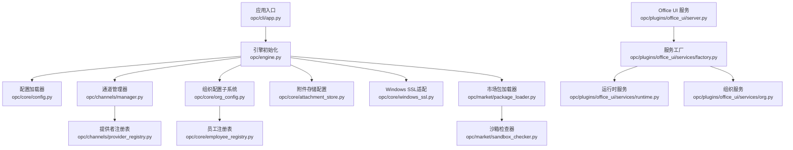
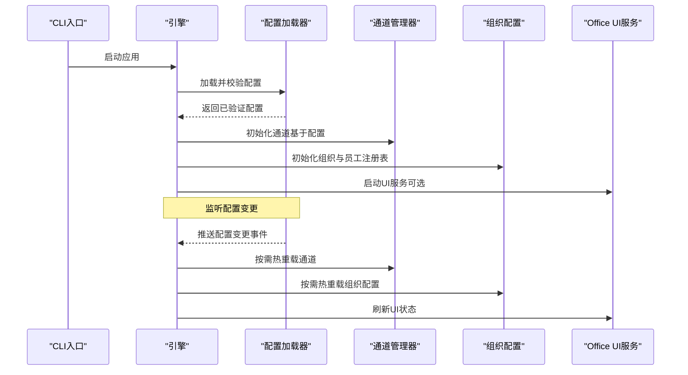
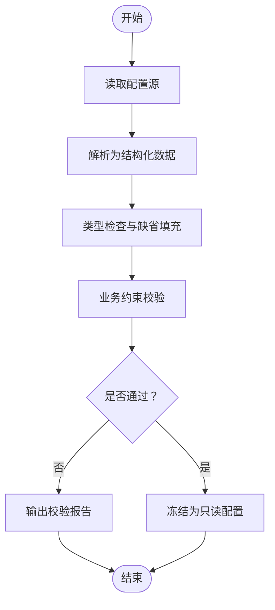
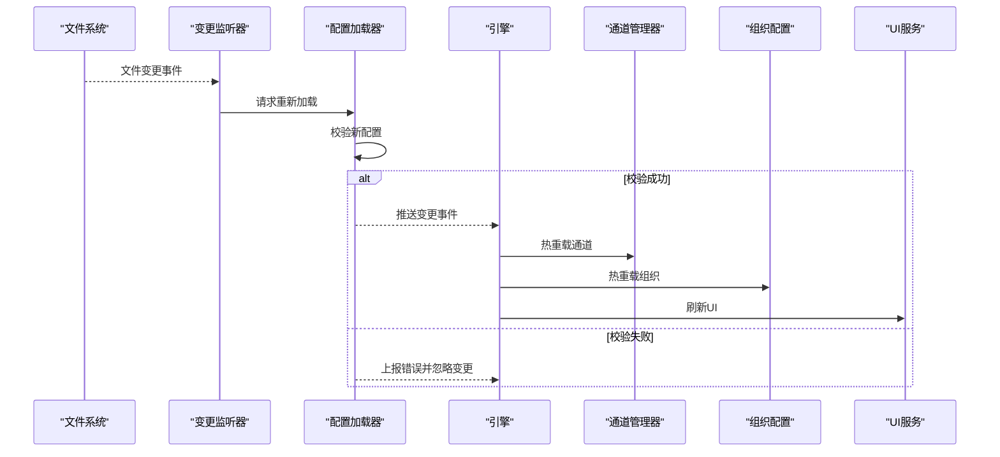
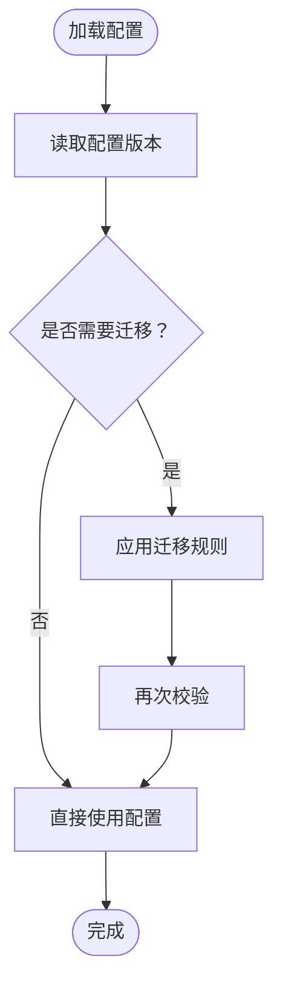
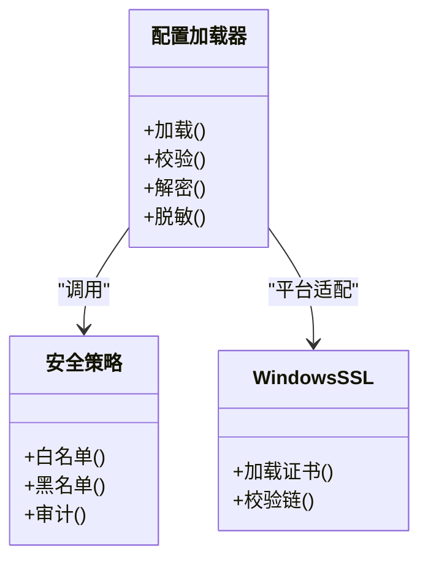
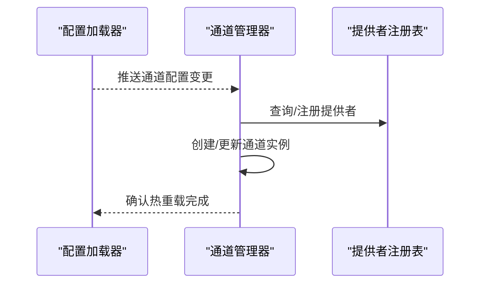
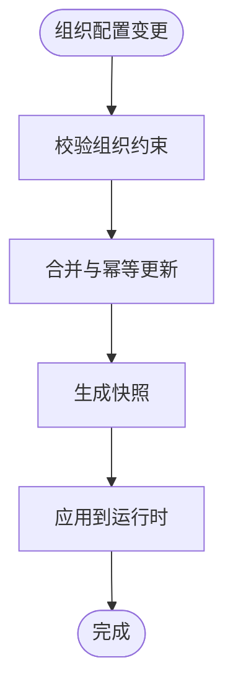
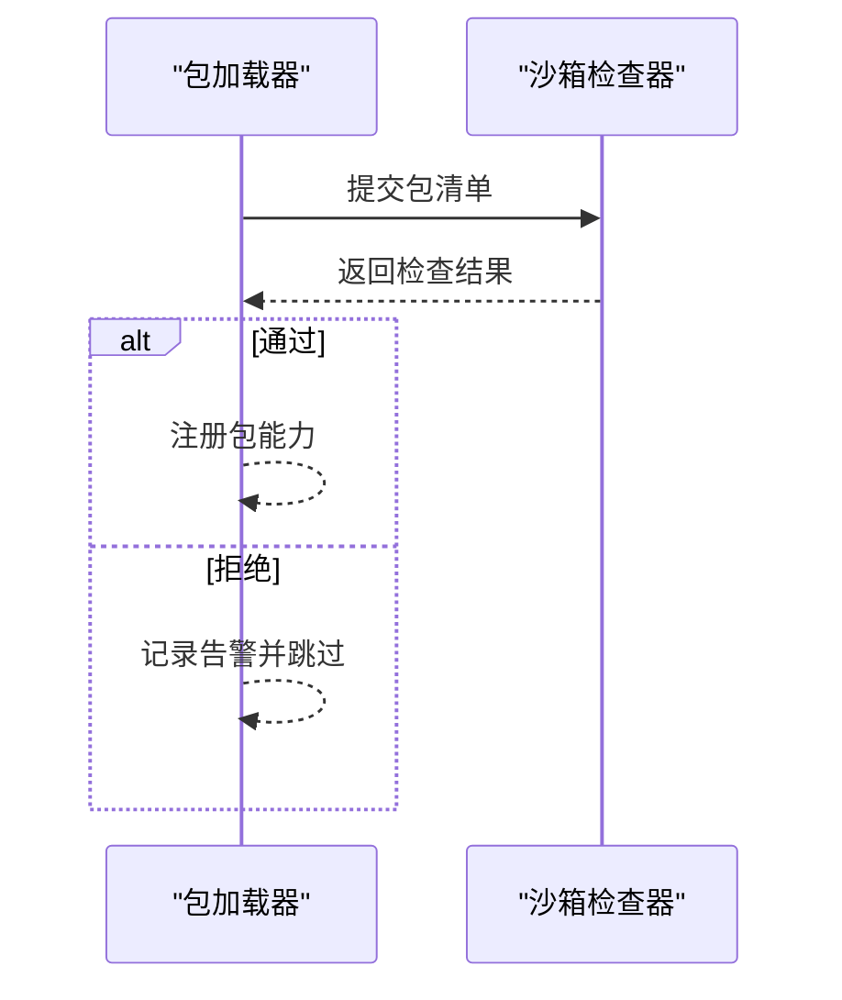
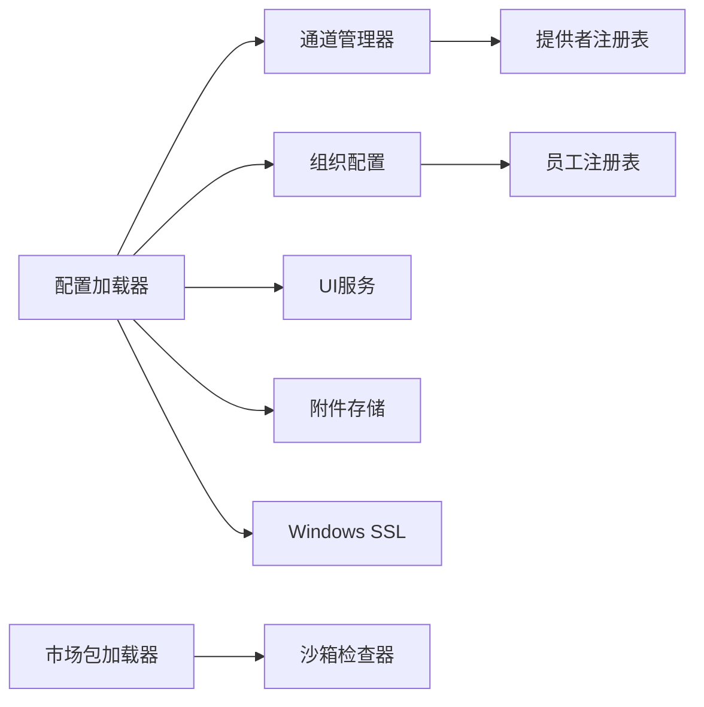

# 配置验证与热重载

<cite>
**本文引用的文件**   
- [opc/core/config.py](file://opc/core/config.py)
- [config/system_config.yaml](file://config/system_config.yaml)
- [config/agent_config.yaml](file://config/agent_config.yaml)
- [config/channel_config.yaml](file://config/channel_config.yaml)
- [config/llm_config.yaml](file://config/llm_config.yaml)
- [config/company_corporate_config.yaml](file://config/company_corporate_config.yaml)
- [opc/cli/app.py](file://opc/cli/app.py)
- [opc/engine.py](file://opc/engine.py)
- [opc/channels/manager.py](file://opc/channels/manager.py)
- [opc/channels/provider_registry.py](file://opc/channels/provider_registry.py)
- [opc/core/org_config.py](file://opc/core/org_config.py)
- [opc/core/employee_registry.py](file://opc/core/employee_registry.py)
- [opc/core/attachment_store.py](file://opc/core/attachment_store.py)
- [opc/core/windows_ssl.py](file://opc/core/windows_ssl.py)
- [opc/market/package_loader.py](file://opc/market/package_loader.py)
- [opc/market/sandbox_checker.py](file://opc/market/sandbox_checker.py)
- [opc/plugins/office_ui/server.py](file://opc/plugins/office_ui/server.py)
- [opc/plugins/office_ui/services/factory.py](file://opc/plugins/office_ui/services/factory.py)
- [opc/plugins/office_ui/services/runtime.py](file://opc/plugins/office_ui/services/runtime.py)
- [opc/plugins/office_ui/services/org.py](file://opc/plugins/office_ui/services/org.py)
- [tests/test_org_config_roundtrip.py](file://tests/test_org_config_roundtrip.py)
- [tests/test_runtime_config_enforcement.py](file://tests/test_runtime_config_enforcement.py)
</cite>

## 目录
1. [简介](#简介)
2. [项目结构](#项目结构)
3. [核心组件](#核心组件)
4. [架构总览](#架构总览)
5. [详细组件分析](#详细组件分析)
6. [依赖关系分析](#依赖关系分析)
7. [性能考量](#性能考量)
8. [故障排查指南](#故障排查指南)
9. [结论](#结论)
10. [附录](#附录)

## 简介
本章节面向OpenOPC的配置系统，聚焦以下目标：
- 配置文件语法校验、类型检查与约束校验机制
- 配置变更监听与自动热重载实现原理
- 配置版本管理与向后兼容策略
- 配置备份、回滚与迁移工具使用方法
- 配置调试与错误诊断
- 安全校验、敏感信息加密与访问控制最佳实践

## 项目结构
OpenOPC采用“分层+插件”的架构。配置相关能力主要分布在核心配置加载器、运行时配置执行器、通道管理器、组织配置子系统以及UI服务层等模块中。根目录下的YAML文件为默认或示例配置，实际运行时的配置来源可能包含环境变量、命令行参数与动态加载包。

图示来源
- [opc/cli/app.py](file://opc/cli/app.py)
- [opc/engine.py](file://opc/engine.py)
- [opc/core/config.py](file://opc/core/config.py)
- [opc/channels/manager.py](file://opc/channels/manager.py)
- [opc/channels/provider_registry.py](file://opc/channels/provider_registry.py)
- [opc/core/org_config.py](file://opc/core/org_config.py)
- [opc/core/employee_registry.py](file://opc/core/employee_registry.py)
- [opc/core/attachment_store.py](file://opc/core/attachment_store.py)
- [opc/core/windows_ssl.py](file://opc/core/windows_ssl.py)
- [opc/market/package_loader.py](file://opc/market/package_loader.py)
- [opc/market/sandbox_checker.py](file://opc/market/sandbox_checker.py)
- [opc/plugins/office_ui/server.py](file://opc/plugins/office_ui/server.py)
- [opc/plugins/office_ui/services/factory.py](file://opc/plugins/office_ui/services/factory.py)
- [opc/plugins/office_ui/services/runtime.py](file://opc/plugins/office_ui/services/runtime.py)
- [opc/plugins/office_ui/services/org.py](file://opc/plugins/office_ui/services/org.py)

章节来源
- [opc/cli/app.py](file://opc/cli/app.py)
- [opc/engine.py](file://opc/engine.py)
- [opc/core/config.py](file://opc/core/config.py)
- [config/system_config.yaml](file://config/system_config.yaml)
- [config/agent_config.yaml](file://config/agent_config.yaml)
- [config/channel_config.yaml](file://config/channel_config.yaml)
- [config/llm_config.yaml](file://config/llm_config.yaml)
- [config/company_corporate_config.yaml](file://config/company_corporate_config.yaml)

## 核心组件
- 配置加载与校验
  - 负责解析YAML/JSON等格式，进行语法校验、类型检查与业务约束校验，并生成不可变配置对象供运行时使用。
- 热重载与变更监听
  - 通过文件系统事件或定时轮询检测配置变更，触发增量更新与局部重启，确保服务不中断。
- 版本管理与兼容性
  - 维护配置schema版本，提供迁移脚本与降级策略，保证新旧配置平滑过渡。
- 安全与访问控制
  - 对敏感字段进行脱敏与加密，限制读取权限，结合环境变量注入机密值。
- 调试与诊断
  - 提供配置快照、差异对比、校验报告与日志追踪，辅助快速定位问题。

章节来源
- [opc/core/config.py](file://opc/core/config.py)
- [opc/engine.py](file://opc/engine.py)
- [opc/channels/manager.py](file://opc/channels/manager.py)
- [opc/channels/provider_registry.py](file://opc/channels/provider_registry.py)
- [opc/core/org_config.py](file://opc/core/org_config.py)
- [opc/core/employee_registry.py](file://opc/core/employee_registry.py)
- [opc/core/attachment_store.py](file://opc/core/attachment_store.py)
- [opc/core/windows_ssl.py](file://opc/core/windows_ssl.py)
- [opc/market/package_loader.py](file://opc/market/package_loader.py)
- [opc/market/sandbox_checker.py](file://opc/market/sandbox_checker.py)
- [opc/plugins/office_ui/server.py](file://opc/plugins/office_ui/server.py)
- [opc/plugins/office_ui/services/factory.py](file://opc/plugins/office_ui/services/factory.py)
- [opc/plugins/office_ui/services/runtime.py](file://opc/plugins/office_ui/services/runtime.py)
- [opc/plugins/office_ui/services/org.py](file://opc/plugins/office_ui/services/org.py)

## 架构总览
下图展示了从应用启动到配置加载、校验、热重载的关键路径，以及与通道、组织、UI服务的交互关系。

图示来源
- [opc/cli/app.py](file://opc/cli/app.py)
- [opc/engine.py](file://opc/engine.py)
- [opc/core/config.py](file://opc/core/config.py)
- [opc/channels/manager.py](file://opc/channels/manager.py)
- [opc/core/org_config.py](file://opc/core/org_config.py)
- [opc/plugins/office_ui/server.py](file://opc/plugins/office_ui/server.py)

## 详细组件分析

### 配置加载与校验
- 职责
  - 解析多源配置（文件、环境变量、命令行），执行语法与类型校验，应用业务约束，输出只读配置对象。
- 关键流程
  - 读取YAML/JSON -> 构建基础模型 -> 类型转换与缺省填充 -> 约束校验 -> 生成不可变视图
- 典型约束
  - 必填字段、枚举取值、范围限制、互斥字段、引用完整性（如通道ID唯一性）
- 可观测性
  - 记录校验结果、警告与错误详情，便于诊断

章节来源
- [opc/core/config.py](file://opc/core/config.py)
- [config/system_config.yaml](file://config/system_config.yaml)
- [config/agent_config.yaml](file://config/agent_config.yaml)
- [config/channel_config.yaml](file://config/channel_config.yaml)
- [config/llm_config.yaml](file://config/llm_config.yaml)
- [config/company_corporate_config.yaml](file://config/company_corporate_config.yaml)

### 热重载与变更监听
- 职责
  - 监听配置变更，触发增量更新与局部重启，避免全量重建带来的抖动。
- 实现要点
  - 文件事件监听或定时轮询；计算配置差异；按模块粒度热更新（通道、组织、UI等）
- 风险与保障
  - 并发安全、事务性更新、失败回滚、健康检查与熔断

章节来源
- [opc/engine.py](file://opc/engine.py)
- [opc/core/config.py](file://opc/core/config.py)
- [opc/channels/manager.py](file://opc/channels/manager.py)
- [opc/core/org_config.py](file://opc/core/org_config.py)
- [opc/plugins/office_ui/server.py](file://opc/plugins/office_ui/server.py)

### 版本管理与向后兼容
- 职责
  - 管理配置schema版本，提供迁移脚本与降级策略，确保旧配置在新版本下可用。
- 策略
  - 显式版本号字段；迁移规则表；弃用字段告警；兼容模式开关
- 测试覆盖
  - 往返序列化、迁移前后一致性、边界用例

章节来源
- [opc/core/org_config.py](file://opc/core/org_config.py)
- [tests/test_org_config_roundtrip.py](file://tests/test_org_config_roundtrip.py)

### 安全校验、敏感信息与访问控制
- 敏感信息处理
  - 支持从环境变量注入密钥；在日志中脱敏；可选加密存储
- 访问控制
  - 最小权限原则；区分读写权限；审计日志
- 平台适配
  - Windows SSL证书加载与校验

章节来源
- [opc/core/config.py](file://opc/core/config.py)
- [opc/core/windows_ssl.py](file://opc/core/windows_ssl.py)

### 通道与提供者注册表的热重载
- 职责
  - 根据配置动态创建/销毁通道实例，注册提供者，支持运行时切换。
- 关键点
  - 原子替换、连接池复用、错误隔离、重试与退避

章节来源
- [opc/channels/manager.py](file://opc/channels/manager.py)
- [opc/channels/provider_registry.py](file://opc/channels/provider_registry.py)

### 组织配置与员工注册表
- 职责
  - 管理组织架构、角色、权限与工作项上下文；支持热更新与快照。
- 关键点
  - 一致性校验、幂等更新、冲突解决

章节来源
- [opc/core/org_config.py](file://opc/core/org_config.py)
- [opc/core/employee_registry.py](file://opc/core/employee_registry.py)

### 附件存储与Windows SSL
- 附件存储
  - 配置存储后端、路径与配额；校验可用性
- Windows SSL
  - 证书路径、信任链校验与错误提示

章节来源
- [opc/core/attachment_store.py](file://opc/core/attachment_store.py)
- [opc/core/windows_ssl.py](file://opc/core/windows_ssl.py)

### 市场包加载与沙箱检查
- 职责
  - 加载外部包配置，执行沙箱安全检查，防止危险操作。
- 关键点
  - 签名校验、白名单、资源限制

章节来源
- [opc/market/package_loader.py](file://opc/market/package_loader.py)
- [opc/market/sandbox_checker.py](file://opc/market/sandbox_checker.py)

### Office UI 服务与配置联动
- 职责
  - 暴露配置查看与编辑界面，支持在线校验与预览。
- 关键点
  - 与服务端配置同步、实时差异展示、一键回滚

章节来源
- [opc/plugins/office_ui/server.py](file://opc/plugins/office_ui/server.py)
- [opc/plugins/office_ui/services/factory.py](file://opc/plugins/office_ui/services/factory.py)
- [opc/plugins/office_ui/services/runtime.py](file://opc/plugins/office_ui/services/runtime.py)
- [opc/plugins/office_ui/services/org.py](file://opc/plugins/office_ui/services/org.py)

## 依赖关系分析
- 耦合与内聚
  - 配置加载器作为中心枢纽，低耦合地服务于各子系统；热重载以事件驱动降低直接依赖
- 外部依赖
  - YAML/JSON解析库、文件系统事件库、加密库、平台SSL适配
- 循环依赖
  - 通过接口抽象与延迟导入避免循环

图示来源
- [opc/core/config.py](file://opc/core/config.py)
- [opc/channels/manager.py](file://opc/channels/manager.py)
- [opc/channels/provider_registry.py](file://opc/channels/provider_registry.py)
- [opc/core/org_config.py](file://opc/core/org_config.py)
- [opc/core/employee_registry.py](file://opc/core/employee_registry.py)
- [opc/core/attachment_store.py](file://opc/core/attachment_store.py)
- [opc/core/windows_ssl.py](file://opc/core/windows_ssl.py)
- [opc/market/package_loader.py](file://opc/market/package_loader.py)
- [opc/market/sandbox_checker.py](file://opc/market/sandbox_checker.py)

章节来源
- [opc/core/config.py](file://opc/core/config.py)
- [opc/engine.py](file://opc/engine.py)

## 性能考量
- 增量更新
  - 仅重载受影响模块，避免全量重建
- 缓存与去重
  - 对频繁读取的配置片段进行内存缓存，减少重复解析
- 异步与批处理
  - 将配置变更事件批量处理，降低抖动
- 资源限制
  - 对大配置与复杂校验设置超时与限流

[本节为通用指导，无需具体文件来源]

## 故障排查指南
- 常见问题
  - 语法错误：检查YAML缩进与键名拼写
  - 类型不匹配：核对字段类型与枚举值
  - 约束失败：关注互斥字段与必填项
  - 热重载失败：查看差异对比与回滚日志
- 诊断步骤
  - 启用详细日志，导出配置快照与校验报告
  - 使用UI服务进行在线校验与预览
  - 逐步禁用模块定位问题范围
- 恢复策略
  - 回滚到上一个稳定版本
  - 使用迁移脚本修复不兼容字段

章节来源
- [tests/test_runtime_config_enforcement.py](file://tests/test_runtime_config_enforcement.py)
- [tests/test_org_config_roundtrip.py](file://tests/test_org_config_roundtrip.py)

## 结论
OpenOPC的配置系统围绕“强校验、可观测、可热重载、可迁移、可安全”的目标设计。通过清晰的层次划分与事件驱动的热重载机制，系统在保持高可用的同时提供了良好的运维体验。建议在生产环境严格遵循安全与访问控制最佳实践，并结合监控与日志完善可观测性。

[本节为总结性内容，无需具体文件来源]

## 附录
- 配置样例文件
  - system_config.yaml、agent_config.yaml、channel_config.yaml、llm_config.yaml、company_corporate_config.yaml
- 参考测试
  - 配置往返与迁移：test_org_config_roundtrip.py
  - 运行时配置强制与约束：test_runtime_config_enforcement.py

章节来源
- [config/system_config.yaml](file://config/system_config.yaml)
- [config/agent_config.yaml](file://config/agent_config.yaml)
- [config/channel_config.yaml](file://config/channel_config.yaml)
- [config/llm_config.yaml](file://config/llm_config.yaml)
- [config/company_corporate_config.yaml](file://config/company_corporate_config.yaml)
- [tests/test_org_config_roundtrip.py](file://tests/test_org_config_roundtrip.py)
- [tests/test_runtime_config_enforcement.py](file://tests/test_runtime_config_enforcement.py)