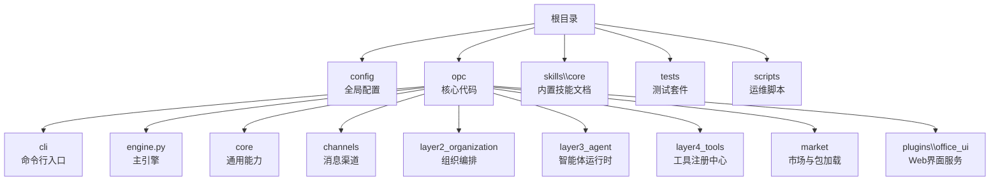
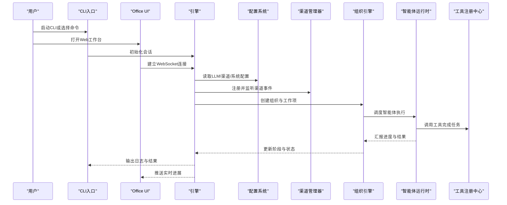
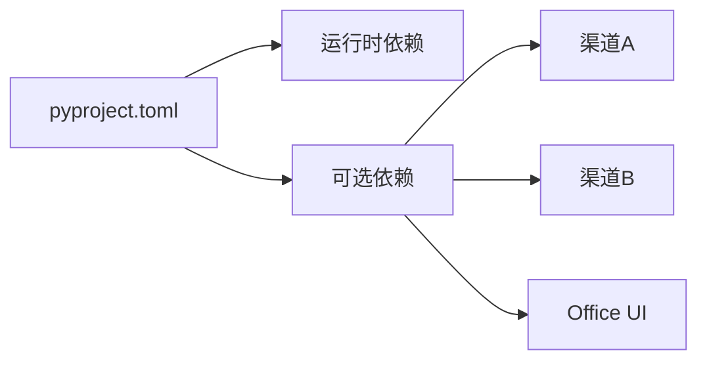

# 快速开始

<cite>
**本文引用的文件**   
- [README.md](file://README.md)
- [README.zh-CN.md](file://README.zh-CN.md)
- [pyproject.toml](file://pyproject.toml)
- [config/agent_config.yaml](file://config/agent_config.yaml)
- [config/channel_config.yaml](file://config/channel_config.yaml)
- [config/company_corporate_config.yaml](file://config/company_corporate_config.yaml)
- [config/llm_config.yaml](file://config/llm_config.yaml)
- [config/system_config.yaml](file://config/system_config.yaml)
- [opc/cli/app.py](file://opc/cli/app.py)
- [opc/engine.py](file://opc/engine.py)
- [opc/core/config.py](file://opc/core/config.py)
- [opc/channels/manager.py](file://opc/channels/manager.py)
- [opc/channels/provider_registry.py](file://opc/channels/provider_registry.py)
- [opc/layer2_organization/org_engine.py](file://opc/layer2_organization/org_engine.py)
- [opc/layer3_agent/native_agent.py](file://opc/layer3_agent/native_agent.py)
- [opc/layer4_tools/registry.py](file://opc/layer4_tools/registry.py)
- [opc/market/package_loader.py](file://opc/market/package_loader.py)
- [opc/plugins/office_ui/server.py](file://opc/plugins/office_ui/server.py)
</cite>

## 目录
1. [简介](#简介)
2. [项目结构](#项目结构)
3. [核心组件](#核心组件)
4. [架构总览](#架构总览)
5. [详细组件分析](#详细组件分析)
6. [依赖分析](#依赖分析)
7. [性能考虑](#性能考虑)
8. [故障排除指南](#故障排除指南)
9. [结论](#结论)
10. [附录](#附录)

## 简介
本快速开始指南面向初学者与一线使用者，帮助你在5分钟内完成OpenOPC企业级多智能体协作平台的环境准备、安装与首次运行配置，并启动第一个多智能体协作会话。内容涵盖：
- Python环境要求与虚拟环境建议
- 依赖安装与可选前端插件
- 最小化配置文件说明与示例路径
- 通过CLI或Office UI启动协作会话的完整步骤
- 常见问题与排错要点

## 项目结构
仓库采用分层模块化设计，核心入口位于命令行与引擎模块，配置集中在config目录，渠道（Channel）与组织编排（Organization Engine）分别位于channels与layer2_organization等子包中。

图表来源
- [pyproject.toml](file://pyproject.toml)
- [opc/cli/app.py](file://opc/cli/app.py)
- [opc/engine.py](file://opc/engine.py)
- [config/agent_config.yaml](file://config/agent_config.yaml)
- [config/channel_config.yaml](file://config/channel_config.yaml)
- [config/llm_config.yaml](file://config/llm_config.yaml)
- [config/system_config.yaml](file://config/system_config.yaml)

章节来源
- [README.md](file://README.md)
- [README.zh-CN.md](file://README.zh-CN.md)
- [pyproject.toml](file://pyproject.toml)

## 核心组件
- 命令行入口：提供交互式CLI与常用命令，便于本地快速体验。
- 引擎：负责会话生命周期、组织编排与任务执行协调。
- 配置系统：集中管理LLM、渠道、系统与代理相关配置。
- 渠道管理器：统一接入多种消息渠道（如飞书、钉钉、Slack等）。
- 组织引擎：负责任务规划、阶段流转、审批与升级策略。
- 智能体运行时：封装原生智能体与外部代理的适配与权限控制。
- 工具注册中心：统一管理可被智能体调用的工具集。
- 市场与包加载：支持从市场导入预设与扩展包。
- Office UI：提供Web端可视化工作台与协作面板。

章节来源
- [opc/cli/app.py](file://opc/cli/app.py)
- [opc/engine.py](file://opc/engine.py)
- [opc/core/config.py](file://opc/core/config.py)
- [opc/channels/manager.py](file://opc/channels/manager.py)
- [opc/channels/provider_registry.py](file://opc/channels/provider_registry.py)
- [opc/layer2_organization/org_engine.py](file://opc/layer2_organization/org_engine.py)
- [opc/layer3_agent/native_agent.py](file://opc/layer3_agent/native_agent.py)
- [opc/layer4_tools/registry.py](file://opc/layer4_tools/registry.py)
- [opc/market/package_loader.py](file://opc/market/package_loader.py)
- [opc/plugins/office_ui/server.py](file://opc/plugins/office_ui/server.py)

## 架构总览
下图展示了从用户交互到多智能体协作的核心流程：CLI或Office UI发起请求，引擎加载配置与组织编排，渠道管理器对接消息通道，组织引擎驱动任务与阶段流转，智能体运行时调用工具完成工作项。

图表来源
- [opc/cli/app.py](file://opc/cli/app.py)
- [opc/engine.py](file://opc/engine.py)
- [opc/core/config.py](file://opc/core/config.py)
- [opc/channels/manager.py](file://opc/channels/manager.py)
- [opc/layer2_organization/org_engine.py](file://opc/layer2_organization/org_engine.py)
- [opc/layer3_agent/native_agent.py](file://opc/layer3_agent/native_agent.py)
- [opc/layer4_tools/registry.py](file://opc/layer4_tools/registry.py)
- [opc/plugins/office_ui/server.py](file://opc/plugins/office_ui/server.py)

## 详细组件分析

### 环境与安装
- Python版本要求
  - 请确保使用Python 3.10及以上版本（以pyproject为准）。
- 推荐方式：使用虚拟环境
  - 在仓库根目录创建并激活虚拟环境，避免系统依赖冲突。
- 安装依赖
  - 使用项目提供的依赖声明进行安装；如需开发或启用可选功能，请参考pyproject中的可选分组。
- 可选前端构建（Office UI）
  - 若需启用Web工作台，按插件内说明构建前端资源后启动服务。

章节来源
- [pyproject.toml](file://pyproject.toml)
- [opc/plugins/office_ui/server.py](file://opc/plugins/office_ui/server.py)

### 最小化配置（5分钟上手）
目标：在不接入任何外部渠道的情况下，仅通过CLI启动一次本地协作会话。

- 必要配置
  - LLM配置：至少提供一个可用的LLM提供商与鉴权信息。
  - 系统配置：设置基础运行参数（如日志级别、时区等）。
  - 代理配置：定义一个默认代理角色与提示词模板。
- 可选配置
  - 公司组织架构：用于演示多智能体协作的组织关系与职责划分。
  - 渠道配置：后续再按需接入飞书、钉钉、Slack等。
- 配置文件位置
  - config/llm_config.yaml
  - config/system_config.yaml
  - config/agent_config.yaml
  - config/company_corporate_config.yaml（可选）
  - config/channel_config.yaml（可选）

章节来源
- [config/llm_config.yaml](file://config/llm_config.yaml)
- [config/system_config.yaml](file://config/system_config.yaml)
- [config/agent_config.yaml](file://config/agent_config.yaml)
- [config/company_corporate_config.yaml](file://config/company_corporate_config.yaml)
- [config/channel_config.yaml](file://config/channel_config.yaml)

### 首次运行：通过CLI启动协作会话
- 启动CLI
  - 在项目根目录执行CLI命令，进入交互模式。
- 创建会话
  - 在CLI中选择“新建会话”或等价命令，系统将自动加载配置并初始化组织。
- 提交任务
  - 输入你的需求描述，CLI将把任务交给组织引擎编排，智能体开始执行。
- 查看进展
  - CLI会打印关键日志与阶段性结果；也可同时打开Office UI观察实时看板。

章节来源
- [opc/cli/app.py](file://opc/cli/app.py)
- [opc/engine.py](file://opc/engine.py)
- [opc/layer2_organization/org_engine.py](file://opc/layer2_organization/org_engine.py)

### 首次运行：通过Office UI启动协作会话
- 启动Office UI服务
  - 在已安装依赖的环境中启动插件服务，浏览器访问本地地址。
- 登录与选择项目
  - 登录后选择或创建一个项目，进入工作台。
- 发起协作
  - 在工作台创建任务卡片，系统会自动生成工作项并分派给智能体。
- 监控与反馈
  - 在“执行面板”和“沟通面板”查看进度、评论与反馈。

章节来源
- [opc/plugins/office_ui/server.py](file://opc/plugins/office_ui/server.py)
- [opc/engine.py](file://opc/engine.py)
- [opc/channels/manager.py](file://opc/channels/manager.py)

### 渠道接入（可选）
- 渠道注册与发现
  - 渠道提供者通过注册表集中管理，支持动态发现与热插拔。
- 常见渠道
  - 飞书、钉钉、Slack、Telegram、WhatsApp、Discord、邮件等。
- 配置要点
  - 在channel_config.yaml中填写对应渠道的鉴权与路由规则。
  - 在agent_config.yaml中将特定渠道绑定到指定代理或团队。

章节来源
- [opc/channels/provider_registry.py](file://opc/channels/provider_registry.py)
- [opc/channels/manager.py](file://opc/channels/manager.py)
- [config/channel_config.yaml](file://config/channel_config.yaml)
- [config/agent_config.yaml](file://config/agent_config.yaml)

### 组织编排与多智能体协作
- 组织引擎职责
  - 创建工作项、规划阶段、分配角色、处理审批与升级。
- 协作策略
  - 支持并行执行、依赖管理与上下文共享。
- 阶段与钩子
  - 每个阶段可定义前置/后置钩子，实现审计、通知与质量门禁。

章节来源
- [opc/layer2_organization/org_engine.py](file://opc/layer2_organization/org_engine.py)
- [opc/layer2_organization/collaboration_service.py](file://opc/layer2_organization/collaboration_service.py)
- [opc/layer2_organization/phase.py](file://opc/layer2_organization/phase.py)

### 智能体运行时与工具
- 智能体运行时
  - 封装原生智能体与外部代理，提供权限、沙箱与流式执行能力。
- 工具注册中心
  - 所有可调用的工具（文件、Shell、Git、搜索等）在此注册与发现。
- 安全与预算
  - 工具执行受安全策略与输出预算约束，防止滥用与过度消耗。

章节来源
- [opc/layer3_agent/native_agent.py](file://opc/layer3_agent/native_agent.py)
- [opc/layer4_tools/registry.py](file://opc/layer4_tools/registry.py)
- [opc/layer4_tools/shell.py](file://opc/layer4_tools/shell.py)
- [opc/layer4_tools/file_ops.py](file://opc/layer4_tools/file_ops.py)
- [opc/layer4_tools/git_ops.py](file://opc/layer4_tools/git_ops.py)
- [opc/layer4_tools/web_search.py](file://opc/layer4_tools/web_search.py)

### 市场与包加载（可选）
- 市场预设
  - 内置预设（如投资公司架构）可直接导入，加速起步。
- 包格式与校验
  - 支持打包导出与导入，包含元数据、权限与依赖声明。
- 沙箱检查
  - 对第三方包进行基本安全检查，降低风险。

章节来源
- [opc/market/package_loader.py](file://opc/market/package_loader.py)
- [opc/market/sandbox_checker.py](file://opc/market/sandbox_checker.py)
- [opc/market/builtin_presets/vc_investment_firm.yaml](file://opc/market/builtin_presets/vc_investment_firm.yaml)

## 依赖分析
- 运行时依赖
  - Python标准库与第三方库由pyproject声明，建议使用pip或uv进行安装。
- 可选依赖
  - 不同渠道与插件可能引入额外依赖，按需安装以避免体积膨胀。
- 前端依赖
  - Office UI的前端资源需单独构建，生产环境建议预构建并静态托管。

图表来源
- [pyproject.toml](file://pyproject.toml)

章节来源
- [pyproject.toml](file://pyproject.toml)

## 性能考虑
- 并发与队列
  - 合理设置并发度与任务队列长度，避免资源争用。
- 上下文窗口
  - 针对大模型上下文窗口限制，启用历史压缩与摘要策略。
- 工具执行
  - 为耗时工具设置超时与重试上限，减少阻塞。
- 日志与观测
  - 调整日志级别，开启成本追踪与关键指标上报。

[本节为通用指导，不直接分析具体文件]

## 故障排除指南
- 无法找到Python或版本过低
  - 确认Python版本满足要求，并在虚拟环境中重新安装依赖。
- LLM调用失败
  - 检查llm_config.yaml中的鉴权信息与网络连通性；必要时切换备用提供商。
- 渠道连接失败
  - 核对channel_config.yaml中的Token/密钥与回调URL；确认防火墙与代理设置。
- 工具执行报错
  - 检查shell与文件操作权限；确认Git与外部工具已正确安装并可执行。
- Office UI无法访问
  - 确认端口未被占用；检查前端构建产物是否存在；查看服务日志定位错误。
- 任务卡住或无响应
  - 使用脚本重置卡住的任务；检查组织引擎日志与阶段状态机转换。

章节来源
- [config/llm_config.yaml](file://config/llm_config.yaml)
- [config/channel_config.yaml](file://config/channel_config.yaml)
- [opc/channels/manager.py](file://opc/channels/manager.py)
- [opc/layer2_organization/org_engine.py](file://opc/layer2_organization/org_engine.py)
- [opc/plugins/office_ui/server.py](file://opc/plugins/office_ui/server.py)
- [scripts/reset_stuck_task.py](file://scripts/reset_stuck_task.py)

## 结论
通过以上步骤，你可以在最短时间内完成OpenOPC的安装与首次运行，并以最小配置启动多智能体协作会话。随着使用深入，你可以逐步接入更多渠道、扩展工具与组织策略，以满足企业级复杂场景的需求。

[本节为总结性内容，不直接分析具体文件]

## 附录

### 快速参考清单
- 环境准备
  - Python 3.10+
  - 虚拟环境（推荐）
- 安装依赖
  - 使用pyproject声明安装
- 最小化配置
  - llm_config.yaml
  - system_config.yaml
  - agent_config.yaml
- 启动方式
  - CLI：交互模式快速体验
  - Office UI：Web工作台可视化协作
- 渠道接入
  - channel_config.yaml + provider_registry
- 组织编排
  - org_engine + phase/hooks
- 工具与安全
  - registry + shell/file/git/search
- 市场与包
  - package_loader + sandbox_checker

章节来源
- [config/llm_config.yaml](file://config/llm_config.yaml)
- [config/system_config.yaml](file://config/system_config.yaml)
- [config/agent_config.yaml](file://config/agent_config.yaml)
- [config/channel_config.yaml](file://config/channel_config.yaml)
- [opc/channels/provider_registry.py](file://opc/channels/provider_registry.py)
- [opc/layer2_organization/org_engine.py](file://opc/layer2_organization/org_engine.py)
- [opc/layer4_tools/registry.py](file://opc/layer4_tools/registry.py)
- [opc/market/package_loader.py](file://opc/market/package_loader.py)