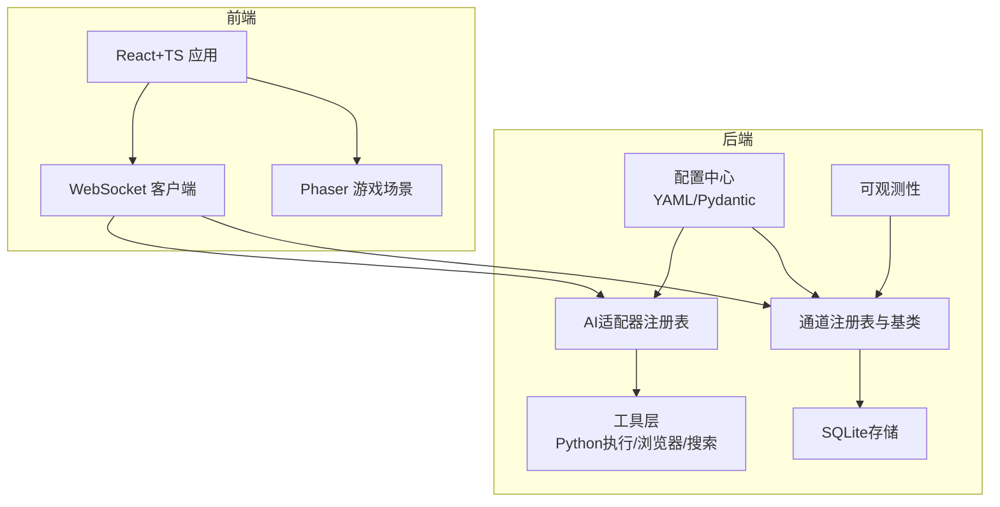
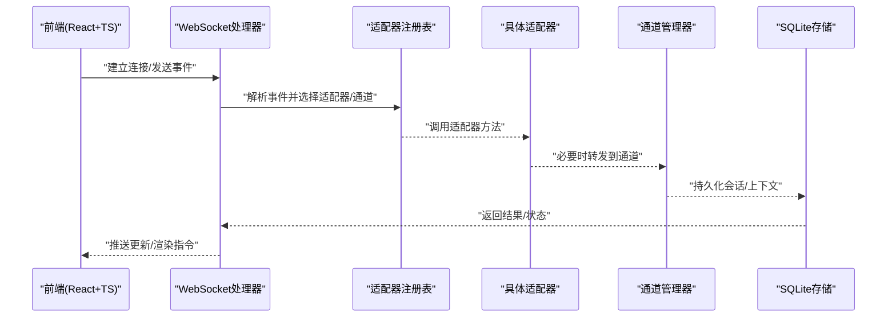
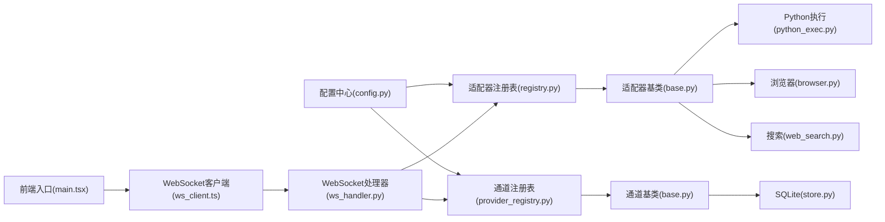

# 技术栈

<cite>
**本文引用的文件**   
- [pyproject.toml](file://pyproject.toml)
- [README.md](file://README.md)
- [config/llm_config.yaml](file://config/llm_config.yaml)
- [opc/core/config.py](file://opc/core/config.py)
- [opc/database/store.py](file://opc/database/store.py)
- [opc/channels/provider_registry.py](file://opc/channels/provider_registry.py)
- [opc/channels/base.py](file://opc/channels/base.py)
- [opc/channels/manager.py](file://opc/channels/manager.py)
- [opc/layer3_agent/adapters/registry.py](file://opc/layer3_agent/adapters/registry.py)
- [opc/layer3_agent/adapters/base.py](file://opc/layer3_agent/adapters/base.py)
- [opc/layer3_agent/adapters/codex_adapter.py](file://opc/layer3_agent/adapters/codex_adapter.py)
- [opc/layer3_agent/adapters/cursor_adapter.py](file://opc/layer3_agent/adapters/cursor_adapter.py)
- [opc/layer3_agent/adapters/opencode_adapter.py](file://opc/layer3_agent/adapters/opencode_adapter.py)
- [opc/layer3_agent/adapters/claude_code.py](file://opc/layer3_agent/adapters/claude_code.py)
- [opc/layer4_tools/python_exec.py](file://opc/layer4_tools/python_exec.py)
- [opc/layer4_tools/browser.py](file://opc/layer4_tools/browser.py)
- [opc/layer4_tools/web_search.py](file://opc/layer4_tools/web_search.py)
- [opc/presentation/kanban.py](file://opc/presentation/kanban.py)
- [opc/plugins/office_ui/frontend_src/package.json](file://opc/plugins/office_ui/frontend_src/package.json)
- [opc/plugins/office_ui/frontend_src/vite.config.ts](file://opc/plugins/office_ui/frontend_src/vite.config.ts)
- [opc/plugins/office_ui/frontend_src/main.tsx](file://opc/plugins/office_ui/frontend_src/main.tsx)
- [opc/plugins/office_ui/frontend_src/game/PhaserGame.tsx](file://opc/plugins/office_ui/frontend_src/game/PhaserGame.tsx)
- [opc/plugins/office_ui/frontend_src/game/config.ts](file://opc/plugins/office_ui/frontend_src/game/config.ts)
- [opc/plugins/office_ui/server.py](file://opc/plugins/office_ui/server.py)
- [opc/plugins/office_ui/ws_handler.py](file://opc/plugins/office_ui/ws_handler.py)
</cite>

## 目录
1. [简介](#简介)
2. [项目结构](#项目结构)
3. [核心组件](#核心组件)
4. [架构总览](#架构总览)
5. [详细组件分析](#详细组件分析)
6. [依赖关系分析](#依赖关系分析)
7. [性能考量](#性能考量)
8. [故障排查指南](#故障排查指南)
9. [结论](#结论)
10. [附录](#附录)

## 简介
本技术栈文档面向OpenOPC平台的开发者与集成者，系统梳理后端、前端、AI模型适配器与第三方服务集成的技术选型、版本要求、兼容性说明、升级策略以及开发环境搭建所需工具与依赖。同时提供学习资源与最佳实践建议，帮助团队快速上手并稳定演进。

## 项目结构
OpenOPC采用分层与插件化组织方式：
- 后端核心（Python）：配置、通道、数据库、可观测性、工具层、记忆层、组织与运行时等模块。
- 前端界面（React + TypeScript + Phaser.js）：Office UI插件内嵌的Web应用，使用Vite构建，通过WebSocket与后端交互。
- AI模型适配器：统一抽象层对接多种外部Agent/代码执行器。
- 第三方服务集成：消息通道（如飞书、钉钉、Slack、Telegram等）、浏览器自动化、网络搜索等。

图表来源
- [opc/core/config.py](file://opc/core/config.py)
- [opc/channels/provider_registry.py](file://opc/channels/provider_registry.py)
- [opc/channels/base.py](file://opc/channels/base.py)
- [opc/database/store.py](file://opc/database/store.py)
- [opc/layer3_agent/adapters/registry.py](file://opc/layer3_agent/adapters/registry.py)
- [opc/layer3_agent/adapters/base.py](file://opc/layer3_agent/adapters/base.py)
- [opc/layer4_tools/python_exec.py](file://opc/layer4_tools/python_exec.py)
- [opc/layer4_tools/browser.py](file://opc/layer4_tools/browser.py)
- [opc/layer4_tools/web_search.py](file://opc/layer4_tools/web_search.py)
- [opc/plugins/office_ui/frontend_src/main.tsx](file://opc/plugins/office_ui/frontend_src/main.tsx)
- [opc/plugins/office_ui/frontend_src/game/PhaserGame.tsx](file://opc/plugins/office_ui/frontend_src/game/PhaserGame.tsx)
- [opc/plugins/office_ui/ws_handler.py](file://opc/plugins/office_ui/ws_handler.py)

章节来源
- [README.md](file://README.md)
- [pyproject.toml](file://pyproject.toml)

## 核心组件
- 后端核心技术
  - Python：作为主要实现语言，承载配置、通道、工具、记忆、运行时与插件体系。
  - FastAPI：用于提供HTTP接口与WebSocket服务（Office UI服务端）。
  - Pydantic：用于数据模型校验与序列化（配置加载、请求/响应体定义）。
  - SQLite：轻量级持久化存储，适合单机或小型部署。
- 前端技术栈
  - React + TypeScript：Office UI主界面，类型安全与工程化友好。
  - Phaser.js：用于办公地图/角色动画等游戏化场景。
  - Vite：前端构建与开发服务器。
- AI模型适配器
  - 统一适配器注册表与基类，支持多外部Agent/代码执行器接入。
- 第三方服务集成
  - 消息通道：飞书、钉钉、Slack、Telegram、WhatsApp、Discord、邮件等。
  - 工具能力：Python执行、浏览器自动化、网络搜索等。

章节来源
- [pyproject.toml](file://pyproject.toml)
- [config/llm_config.yaml](file://config/llm_config.yaml)
- [opc/core/config.py](file://opc/core/config.py)
- [opc/database/store.py](file://opc/database/store.py)
- [opc/channels/provider_registry.py](file://opc/channels/provider_registry.py)
- [opc/channels/base.py](file://opc/channels/base.py)
- [opc/layer3_agent/adapters/registry.py](file://opc/layer3_agent/adapters/registry.py)
- [opc/layer3_agent/adapters/base.py](file://opc/layer3_agent/adapters/base.py)
- [opc/layer4_tools/python_exec.py](file://opc/layer4_tools/python_exec.py)
- [opc/layer4_tools/browser.py](file://opc/layer4_tools/browser.py)
- [opc/layer4_tools/web_search.py](file://opc/layer4_tools/web_search.py)
- [opc/plugins/office_ui/frontend_src/package.json](file://opc/plugins/office_ui/frontend_src/package.json)
- [opc/plugins/office_ui/frontend_src/vite.config.ts](file://opc/plugins/office_ui/frontend_src/vite.config.ts)
- [opc/plugins/office_ui/frontend_src/main.tsx](file://opc/plugins/office_ui/frontend_src/main.tsx)
- [opc/plugins/office_ui/frontend_src/game/PhaserGame.tsx](file://opc/plugins/office_ui/frontend_src/game/PhaserGame.tsx)
- [opc/plugins/office_ui/server.py](file://opc/plugins/office_ui/server.py)
- [opc/plugins/office_ui/ws_handler.py](file://opc/plugins/office_ui/ws_handler.py)

## 架构总览
下图展示后端与前端的关键交互路径：前端通过WebSocket与服务端通信，服务端根据事件路由到AI适配器或通道；配置由YAML与Pydantic共同驱动；SQLite负责状态持久化。

图表来源
- [opc/plugins/office_ui/ws_handler.py](file://opc/plugins/office_ui/ws_handler.py)
- [opc/layer3_agent/adapters/registry.py](file://opc/layer3_agent/adapters/registry.py)
- [opc/channels/manager.py](file://opc/channels/manager.py)
- [opc/database/store.py](file://opc/database/store.py)

## 详细组件分析

### 后端：配置与数据模型（Pydantic + YAML）
- 设计要点
  - 使用YAML集中管理LLM、通道、系统等配置。
  - 通过Pydantic对配置进行强类型校验与默认值处理，提升稳定性与可维护性。
- 关键文件
  - LLM配置示例：[config/llm_config.yaml](file://config/llm_config.yaml)
  - 配置加载与校验：[opc/core/config.py](file://opc/core/config.py)
- 版本与兼容
  - 建议锁定Pydantic v2系列以获得更好的性能与错误提示。
  - YAML解析库需与Pydantic兼容，避免自定义类型反序列化问题。
- 最佳实践
  - 为每个配置段定义独立模型，拆分大模型，便于测试与复用。
  - 在启动时输出配置摘要，便于排障。

章节来源
- [config/llm_config.yaml](file://config/llm_config.yaml)
- [opc/core/config.py](file://opc/core/config.py)

### 后端：数据存储（SQLite）
- 设计要点
  - 使用SQLite作为默认存储，适合单机/小规模部署。
  - 通过ORM或SQLAlchemy封装，确保迁移与一致性。
- 关键文件
  - 存储实现：[opc/database/store.py](file://opc/database/store.py)
- 版本与兼容
  - 推荐SQLite 3.x最新稳定版；注意并发写入限制，必要时引入读写分离或队列。
- 最佳实践
  - 启用WAL模式提升并发读性能。
  - 定期备份与索引优化。

章节来源
- [opc/database/store.py](file://opc/database/store.py)

### 后端：通道子系统（Provider Registry + Base）
- 设计要点
  - 基于“提供者注册表”与“基类”的统一抽象，新增通道只需实现最小接口。
  - 通道管理器负责生命周期与路由。
- 关键文件
  - 注册表：[opc/channels/provider_registry.py](file://opc/channels/provider_registry.py)
  - 基类：[opc/channels/base.py](file://opc/channels/base.py)
  - 管理器：[opc/channels/manager.py](file://opc/channels/manager.py)
- 版本与兼容
  - 各通道SDK版本需与平台保持兼容矩阵，避免破坏性变更。
- 最佳实践
  - 通道实现中严格遵循幂等与重试策略。
  - 对敏感信息做脱敏与审计。

章节来源
- [opc/channels/provider_registry.py](file://opc/channels/provider_registry.py)
- [opc/channels/base.py](file://opc/channels/base.py)
- [opc/channels/manager.py](file://opc/channels/manager.py)

### 后端：AI模型适配器（统一抽象 + 多实现）
- 设计要点
  - 通过注册表与基类统一对外暴露能力，屏蔽不同外部Agent/代码执行器的差异。
  - 支持动态发现与按需加载。
- 关键文件
  - 注册表：[opc/layer3_agent/adapters/registry.py](file://opc/layer3_agent/adapters/registry.py)
  - 基类：[opc/layer3_agent/adapters/base.py](file://opc/layer3_agent/adapters/base.py)
  - 示例实现：
    - [opc/layer3_agent/adapters/codex_adapter.py](file://opc/layer3_agent/adapters/codex_adapter.py)
    - [opc/layer3_agent/adapters/cursor_adapter.py](file://opc/layer3_agent/adapters/cursor_adapter.py)
    - [opc/layer3_agent/adapters/opencode_adapter.py](file://opc/layer3_agent/adapters/opencode_adapter.py)
    - [opc/layer3_agent/adapters/claude_code.py](file://opc/layer3_agent/adapters/claude_code.py)
- 版本与兼容
  - 各适配器依赖的外部SDK/CLI版本需明确约束，避免上游不兼容导致运行异常。
- 最佳实践
  - 适配器内部实现超时、重试与熔断。
  - 对输入输出进行沙箱与白名单校验。

章节来源
- [opc/layer3_agent/adapters/registry.py](file://opc/layer3_agent/adapters/registry.py)
- [opc/layer3_agent/adapters/base.py](file://opc/layer3_agent/adapters/base.py)
- [opc/layer3_agent/adapters/codex_adapter.py](file://opc/layer3_agent/adapters/codex_adapter.py)
- [opc/layer3_agent/adapters/cursor_adapter.py](file://opc/layer3_agent/adapters/cursor_adapter.py)
- [opc/layer3_agent/adapters/opencode_adapter.py](file://opc/layer3_agent/adapters/opencode_adapter.py)
- [opc/layer3_agent/adapters/claude_code.py](file://opc/layer3_agent/adapters/claude_code.py)

### 后端：工具层（Python执行、浏览器、搜索）
- 设计要点
  - 将常用能力封装为工具，供上层编排与调度。
- 关键文件
  - Python执行：[opc/layer4_tools/python_exec.py](file://opc/layer4_tools/python_exec.py)
  - 浏览器自动化：[opc/layer4_tools/browser.py](file://opc/layer4_tools/browser.py)
  - 网络搜索：[opc/layer4_tools/web_search.py](file://opc/layer4_tools/web_search.py)
- 版本与兼容
  - 浏览器自动化依赖的驱动/浏览器版本需与平台一致。
- 最佳实践
  - 工具调用需具备权限控制、资源隔离与日志追踪。

章节来源
- [opc/layer4_tools/python_exec.py](file://opc/layer4_tools/python_exec.py)
- [opc/layer4_tools/browser.py](file://opc/layer4_tools/browser.py)
- [opc/layer4_tools/web_search.py](file://opc/layer4_tools/web_search.py)

### 前端：Office UI（React + TypeScript + Phaser.js + Vite）
- 设计要点
  - 使用React+TS构建页面与状态管理，Phaser.js负责游戏化场景，Vite提供开发与构建。
  - 通过WebSocket与后端实时交互。
- 关键文件
  - 入口与打包：
    - [opc/plugins/office_ui/frontend_src/main.tsx](file://opc/plugins/office_ui/frontend_src/main.tsx)
    - [opc/plugins/office_ui/frontend_src/vite.config.ts](file://opc/plugins/office_ui/frontend_src/vite.config.ts)
    - [opc/plugins/office_ui/frontend_src/package.json](file://opc/plugins/office_ui/frontend_src/package.json)
  - Phaser集成：
    - [opc/plugins/office_ui/frontend_src/game/PhaserGame.tsx](file://opc/plugins/office_ui/frontend_src/game/PhaserGame.tsx)
    - [opc/plugins/office_ui/frontend_src/game/config.ts](file://opc/plugins/office_ui/frontend_src/game/config.ts)
- 版本与兼容
  - 建议固定React 18、TypeScript 5.x、Phaser 3.x、Vite 5.x，避免生态碎片化。
- 最佳实践
  - 使用类型安全的WebSocket客户端封装，统一错误与重连逻辑。
  - 将Phaser场景与UI解耦，通过事件桥接。

章节来源
- [opc/plugins/office_ui/frontend_src/main.tsx](file://opc/plugins/office_ui/frontend_src/main.tsx)
- [opc/plugins/office_ui/frontend_src/vite.config.ts](file://opc/plugins/office_ui/frontend_src/vite.config.ts)
- [opc/plugins/office_ui/frontend_src/package.json](file://opc/plugins/office_ui/frontend_src/package.json)
- [opc/plugins/office_ui/frontend_src/game/PhaserGame.tsx](file://opc/plugins/office_ui/frontend_src/game/PhaserGame.tsx)
- [opc/plugins/office_ui/frontend_src/game/config.ts](file://opc/plugins/office_ui/frontend_src/game/config.ts)

### 后端：Office UI服务（FastAPI + WebSocket）
- 设计要点
  - 使用FastAPI提供HTTP与WebSocket接口，服务于Office UI前端。
- 关键文件
  - 服务端：[opc/plugins/office_ui/server.py](file://opc/plugins/office_ui/server.py)
  - WebSocket处理器：[opc/plugins/office_ui/ws_handler.py](file://opc/plugins/office_ui/ws_handler.py)
- 版本与兼容
  - 建议FastAPI 0.100+，配合Uvicorn/Gunicorn生产部署。
- 最佳实践
  - 对WebSocket连接进行鉴权与会话隔离。
  - 使用结构化日志与指标上报。

章节来源
- [opc/plugins/office_ui/server.py](file://opc/plugins/office_ui/server.py)
- [opc/plugins/office_ui/ws_handler.py](file://opc/plugins/office_ui/ws_handler.py)

### 可视化看板（Kanban）
- 设计要点
  - 提供任务/工作项的看板视图，便于协作与跟踪。
- 关键文件
  - 看板呈现：[opc/presentation/kanban.py](file://opc/presentation/kanban.py)
- 最佳实践
  - 与通道/适配器的事件流打通，保证状态一致性。

章节来源
- [opc/presentation/kanban.py](file://opc/presentation/kanban.py)

## 依赖关系分析
下图展示核心模块间的依赖关系与耦合点，有助于识别潜在循环依赖与扩展点。

图表来源
- [opc/core/config.py](file://opc/core/config.py)
- [opc/layer3_agent/adapters/registry.py](file://opc/layer3_agent/adapters/registry.py)
- [opc/layer3_agent/adapters/base.py](file://opc/layer3_agent/adapters/base.py)
- [opc/channels/provider_registry.py](file://opc/channels/provider_registry.py)
- [opc/channels/base.py](file://opc/channels/base.py)
- [opc/database/store.py](file://opc/database/store.py)
- [opc/layer4_tools/python_exec.py](file://opc/layer4_tools/python_exec.py)
- [opc/layer4_tools/browser.py](file://opc/layer4_tools/browser.py)
- [opc/layer4_tools/web_search.py](file://opc/layer4_tools/web_search.py)
- [opc/plugins/office_ui/frontend_src/main.tsx](file://opc/plugins/office_ui/frontend_src/main.tsx)
- [opc/plugins/office_ui/ws_handler.py](file://opc/plugins/office_ui/ws_handler.py)

章节来源
- [pyproject.toml](file://pyproject.toml)

## 性能考量
- 后端
  - 使用异步I/O与连接池，减少阻塞。
  - SQLite开启WAL模式，合理索引与分页查询。
  - 适配器与通道实现限流、重试与熔断，避免雪崩。
- 前端
  - 合理使用Phaser场景切换与对象池，降低GC压力。
  - WebSocket消息批处理与去抖，避免频繁渲染。
- 可观测性
  - 记录关键路径耗时与错误率，结合告警阈值持续优化。

## 故障排查指南
- 常见问题定位
  - 配置错误：检查YAML结构与Pydantic模型字段是否匹配。
  - 通道不可用：核对通道SDK版本与凭据，查看注册表是否成功加载。
  - 适配器失败：确认外部Agent/CLI可用性与网络连通性。
  - WebSocket断连：检查服务端健康检查与前端重连策略。
- 建议步骤
  - 启用调试日志与结构化输出。
  - 使用最小复现用例隔离问题域。
  - 对关键路径添加断言与快照对比。

## 结论
OpenOPC以Python为核心，结合FastAPI、Pydantic与SQLite构建稳健的后端；前端采用React+TypeScript与Phaser.js打造交互式体验；通过统一的适配器与通道抽象，灵活集成多种AI模型与第三方服务。建议在工程中固化版本矩阵与升级流程，强化可观测性与容错设计，持续提升系统的可靠性与可扩展性。

## 附录

### 版本矩阵与升级策略
- 后端
  - Python：建议使用3.10+，锁定至小版本范围。
  - FastAPI：0.100+，配合Uvicorn/Gunicorn。
  - Pydantic：v2系列，关注弃用API。
  - SQLite：3.x最新稳定版，开启WAL。
- 前端
  - React：18.x
  - TypeScript：5.x
  - Phaser：3.x
  - Vite：5.x
- 升级策略
  - 先升级依赖再重构代码，逐步替换已弃用API。
  - 使用CI进行回归测试与端到端验证。
  - 对第三方SDK进行灰度发布与回滚预案。

### 开发环境搭建
- 必备工具
  - Python解释器与包管理器（pip/uv/poetry）
  - Node.js与npm/yarn（前端构建）
  - Git（版本控制）
- 安装步骤（概览）
  - 克隆仓库并进入项目根目录。
  - 创建虚拟环境并安装后端依赖（参考pyproject.toml）。
  - 安装前端依赖并构建（参考frontend package.json与vite配置）。
  - 准备配置文件（如LLM、通道），按模型要求设置密钥与端点。
  - 启动后端服务与前端开发服务器，访问本地端口验证。
- 注意事项
  - 浏览器自动化需安装对应驱动与浏览器版本。
  - 某些通道需要额外依赖或系统库，请参照通道文档。

### 学习资源与最佳实践
- 官方文档
  - FastAPI：https://fastapi.tiangolo.com/
  - Pydantic v2：https://docs.pydantic.dev/latest/
  - React：https://react.dev/
  - TypeScript：https://www.typescriptlang.org/
  - Phaser：https://phaser.io/docs/
  - Vite：https://vitejs.dev/
- 最佳实践
  - 配置即代码：使用Pydantic模型统一管理配置。
  - 适配器/通道最小实现：仅暴露必要接口，便于测试与替换。
  - 前端类型优先：尽量使用TS类型推导与严格模式。
  - 可观测性先行：在关键路径埋点，形成闭环监控。