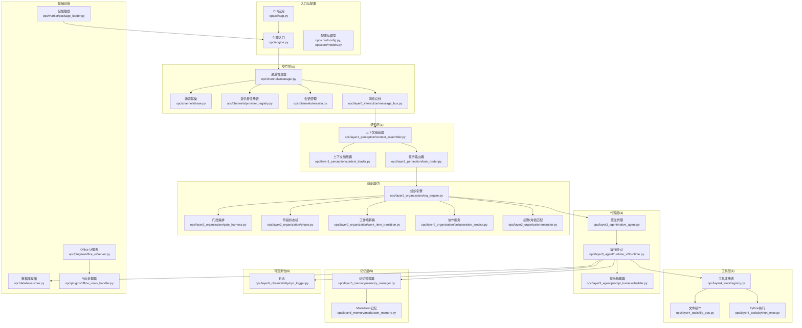
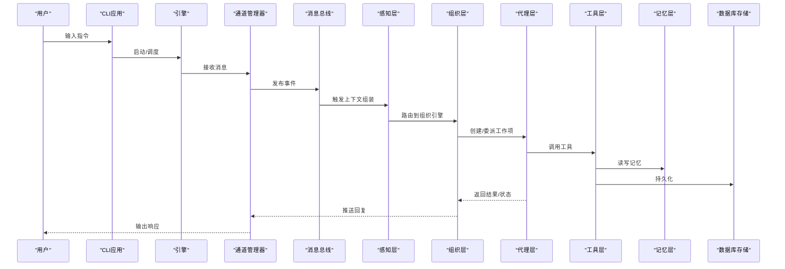
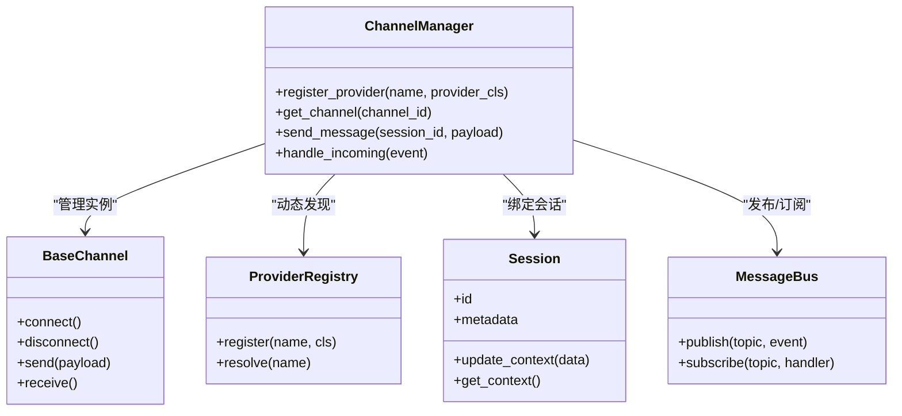
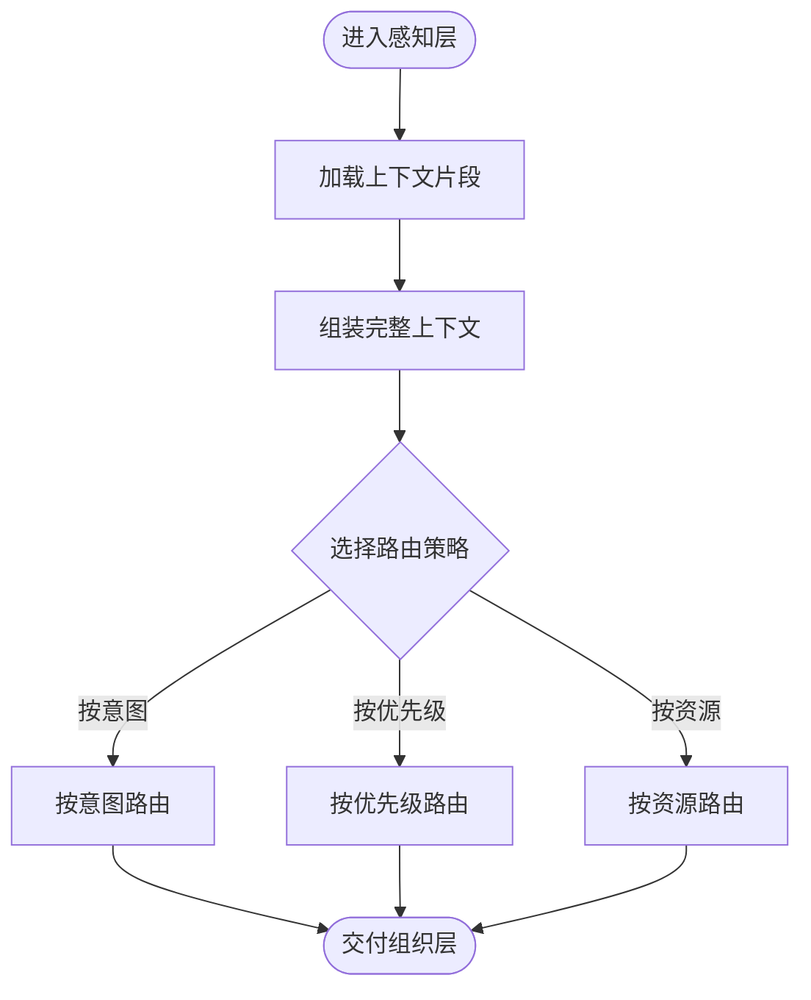
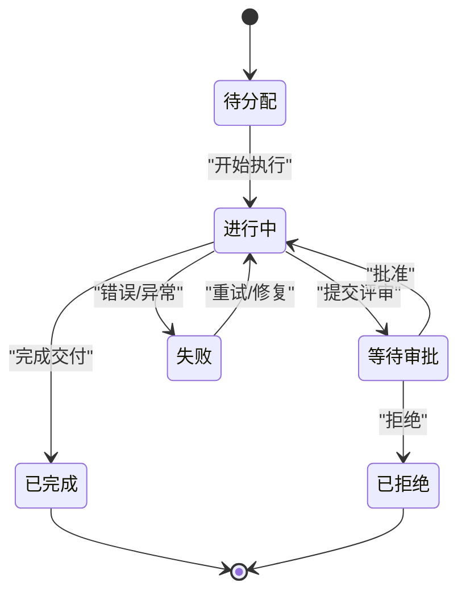
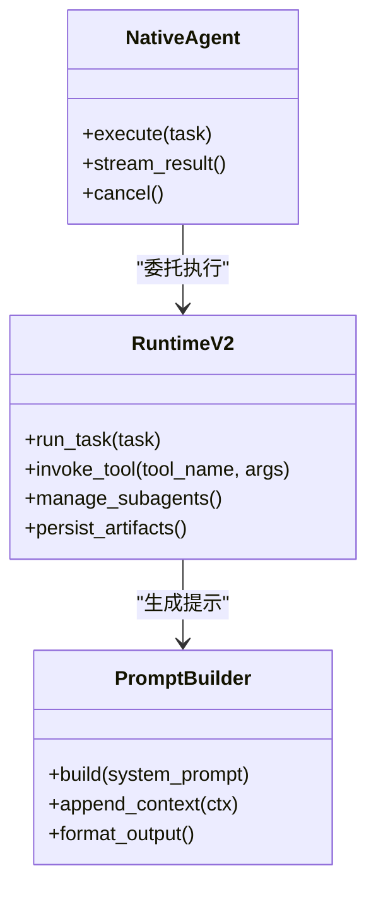
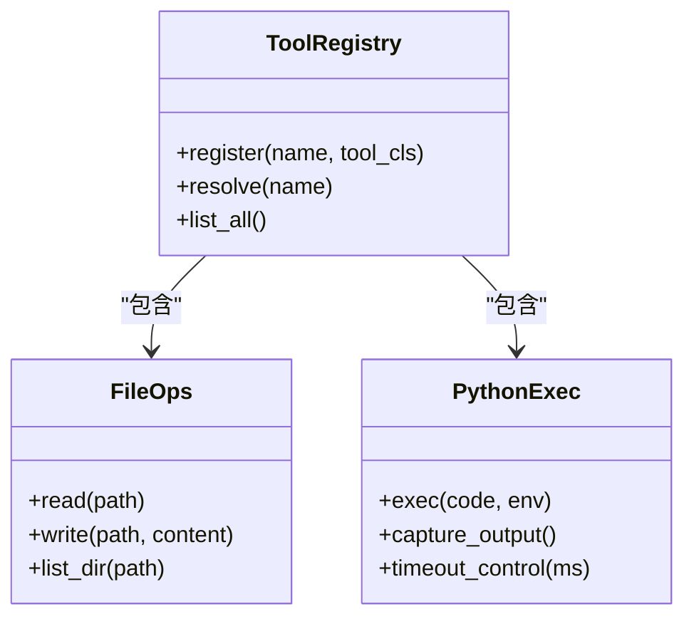
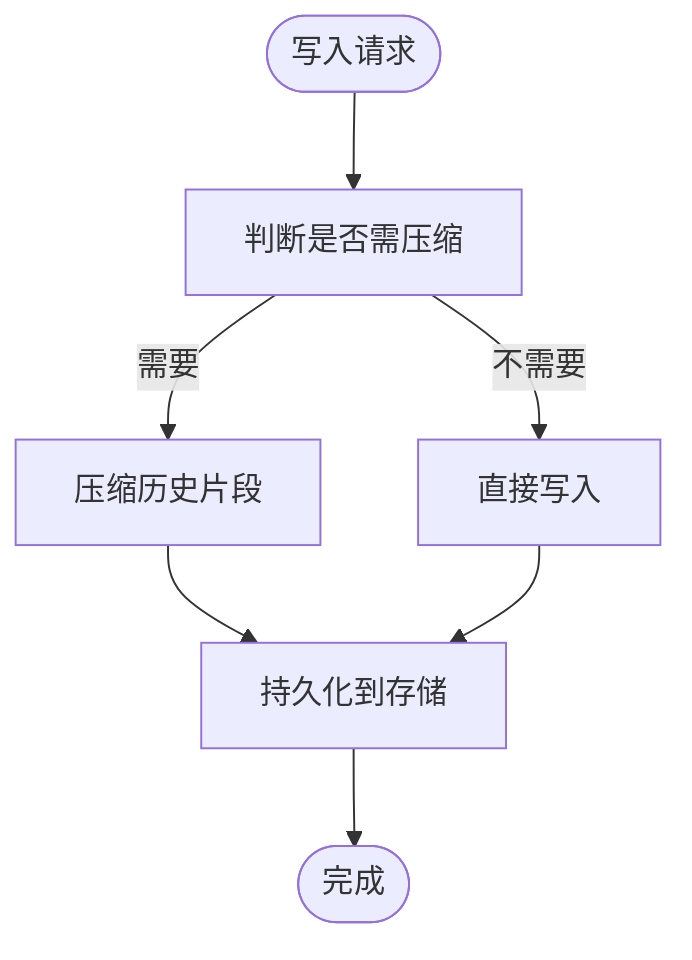
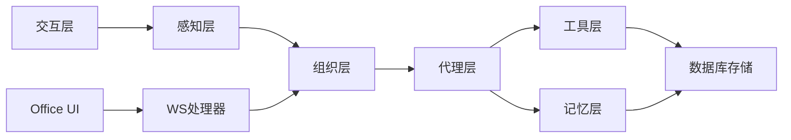

# 架构概览

<cite>
**本文引用的文件**   
- [README.md](file://README.md)
- [pyproject.toml](file://pyproject.toml)
- [opc/engine.py](file://opc/engine.py)
- [opc/cli/app.py](file://opc/cli/app.py)
- [opc/channels/manager.py](file://opc/channels/manager.py)
- [opc/channels/base.py](file://opc/channels/base.py)
- [opc/channels/provider_registry.py](file://opc/channels/provider_registry.py)
- [opc/channels/session.py](file://opc/channels/session.py)
- [opc/core/config.py](file://opc/core/config.py)
- [opc/core/models.py](file://opc/core/models.py)
- [opc/core/events.py](file://opc/core/events.py)
- [opc/core/company_runtime.py](file://opc/core/company_runtime.py)
- [opc/core/work_item_runtime.py](file://opc/core/work_item_runtime.py)
- [opc/layer0_interaction/message_bus.py](file://opc/layer0_interaction/message_bus.py)
- [opc/layer1_perception/context_assembler.py](file://opc/layer1_perception/context_assembler.py)
- [opc/layer1_perception/context_loader.py](file://opc/layer1_perception/context_loader.py)
- [opc/layer1_perception/task_router.py](file://opc/layer1_perception/task_router.py)
- [opc/layer2_organization/org_engine.py](file://opc/layer2_organization/org_engine.py)
- [opc/layer2_organization/gate_harness.py](file://opc/layer2_organization/gate_harness.py)
- [opc/layer2_organization/phase.py](file://opc/layer2_organization/phase.py)
- [opc/layer2_organization/work_item_transition.py](file://opc/layer2_organization/work_item_transition.py)
- [opc/layer2_organization/collaboration_service.py](file://opc/layer2_organization/collaboration_service.py)
- [opc/layer2_organization/recruiter.py](file://opc/layer2_organization/recruiter.py)
- [opc/layer3_agent/native_agent.py](file://opc/layer3_agent/native_agent.py)
- [opc/layer3_agent/runtime_v2/runtime.py](file://opc/layer3_agent/runtime_v2/runtime.py)
- [opc/layer3_agent/prompt_harness/builder.py](file://opc/layer3_agent/prompt_harness/builder.py)
- [opc/layer4_tools/registry.py](file://opc/layer4_tools/registry.py)
- [opc/layer4_tools/file_ops.py](file://opc/layer4_tools/file_ops.py)
- [opc/layer4_tools/python_exec.py](file://opc/layer4_tools/python_exec.py)
- [opc/layer5_memory/memory_manager.py](file://opc/layer5_memory/memory_manager.py)
- [opc/layer5_memory/markdown_memory.py](file://opc/layer5_memory/markdown_memory.py)
- [opc/layer6_observability/opc_logger.py](file://opc/layer6_observability/opc_logger.py)
- [opc/database/store.py](file://opc/database/store.py)
- [opc/market/package_loader.py](file://opc/market/package_loader.py)
- [opc/plugins/office_ui/server.py](file://opc/plugins/office_ui/server.py)
- [opc/plugins/office_ui/ws_handler.py](file://opc/plugins/office_ui/ws_handler.py)
</cite>

## 目录
1. [简介](#简介)
2. [项目结构](#项目结构)
3. [核心组件](#核心组件)
4. [架构总览](#架构总览)
5. [详细组件分析](#详细组件分析)
6. [依赖关系分析](#依赖关系分析)
7. [性能考虑](#性能考虑)
8. [故障排查指南](#故障排查指南)
9. [结论](#结论)
10. [附录](#附录)

## 简介
本架构概览面向OpenOPC平台，聚焦于“六层架构”（交互层、感知层、组织层、代理层、工具层、记忆层）的职责划分与协作方式。文档从系统设计理念出发，解释分层边界、关键数据流与控制流，并通过架构图与依赖图展示模块间的耦合关系。同时总结关键技术决策与设计模式的应用，评估扩展性、可维护性与性能特性，为架构师与技术负责人提供深入洞察。

## 项目结构
OpenOPC采用按职责分层的目录组织方式：
- 入口与配置：CLI应用、引擎初始化、全局配置与模型定义
- 通道与交互：多通道接入与管理、会话上下文
- 感知层：上下文组装、加载与任务路由
- 组织层：工作项生命周期、阶段状态机、审批与协作
- 代理层：原生代理与运行时v2、提示构建与外部代理适配
- 工具层：文件系统、Python执行、注册表等能力
- 记忆层：持久化、压缩、偏好与技能库
- 可观测性：日志与成本追踪
- 数据库：统一存储接口
- 市场与插件：包加载、Office UI服务与WebSocket处理

图表来源
- [opc/engine.py](file://opc/engine.py)
- [opc/cli/app.py](file://opc/cli/app.py)
- [opc/channels/manager.py](file://opc/channels/manager.py)
- [opc/channels/base.py](file://opc/channels/base.py)
- [opc/channels/provider_registry.py](file://opc/channels/provider_registry.py)
- [opc/channels/session.py](file://opc/channels/session.py)
- [opc/layer0_interaction/message_bus.py](file://opc/layer0_interaction/message_bus.py)
- [opc/layer1_perception/context_assembler.py](file://opc/layer1_perception/context_assembler.py)
- [opc/layer1_perception/context_loader.py](file://opc/layer1_perception/context_loader.py)
- [opc/layer1_perception/task_router.py](file://opc/layer1_perception/task_router.py)
- [opc/layer2_organization/org_engine.py](file://opc/layer2_organization/org_engine.py)
- [opc/layer2_organization/gate_harness.py](file://opc/layer2_organization/gate_harness.py)
- [opc/layer2_organization/phase.py](file://opc/layer2_organization/phase.py)
- [opc/layer2_organization/work_item_transition.py](file://opc/layer2_organization/work_item_transition.py)
- [opc/layer2_organization/collaboration_service.py](file://opc/layer2_organization/collaboration_service.py)
- [opc/layer2_organization/recruiter.py](file://opc/layer2_organization/recruiter.py)
- [opc/layer3_agent/native_agent.py](file://opc/layer3_agent/native_agent.py)
- [opc/layer3_agent/runtime_v2/runtime.py](file://opc/layer3_agent/runtime_v2/runtime.py)
- [opc/layer3_agent/prompt_harness/builder.py](file://opc/layer3_agent/prompt_harness/builder.py)
- [opc/layer4_tools/registry.py](file://opc/layer4_tools/registry.py)
- [opc/layer4_tools/file_ops.py](file://opc/layer4_tools/file_ops.py)
- [opc/layer4_tools/python_exec.py](file://opc/layer4_tools/python_exec.py)
- [opc/layer5_memory/memory_manager.py](file://opc/layer5_memory/memory_manager.py)
- [opc/layer5_memory/markdown_memory.py](file://opc/layer5_memory/markdown_memory.py)
- [opc/layer6_observability/opc_logger.py](file://opc/layer6_observability/opc_logger.py)
- [opc/database/store.py](file://opc/database/store.py)
- [opc/market/package_loader.py](file://opc/market/package_loader.py)
- [opc/plugins/office_ui/server.py](file://opc/plugins/office_ui/server.py)
- [opc/plugins/office_ui/ws_handler.py](file://opc/plugins/office_ui/ws_handler.py)

章节来源
- [README.md](file://README.md)
- [pyproject.toml](file://pyproject.toml)

## 核心组件
- 引擎与入口
  - 引擎负责启动、装配各层、协调事件与生命周期；CLI作为用户入口，解析命令并调用引擎。
- 交互层（0）
  - 通道管理器统一接入多种渠道（如即时通讯、邮件等），通过提供者注册表动态发现与实例化具体通道实现；会话管理维护对话上下文；消息总线在层间传递事件。
- 感知层（1）
  - 上下文组装器聚合多源信息（历史、配置、元数据等），上下文加载器按需拉取，任务路由器根据意图与策略将请求分发到组织层。
- 组织层（2）
  - 组织引擎驱动工作项生命周期，门控编排控制流程节点，阶段状态机保证状态一致性，工作项转换实现状态迁移；协作服务与招聘模块支持团队编排与角色匹配。
- 代理层（3）
  - 原生代理封装LLM或外部智能体调用；运行时v2提供工具执行、权限、子代理、工件管理等能力；提示构建器负责拼装结构化提示。
- 工具层（4）
  - 工具注册表集中管理可用工具；文件操作与Python执行是常用基础能力，可扩展更多领域工具。
- 记忆层（5）
  - 记忆管理器协调持久化与压缩策略；Markdown记忆提供文本型长期记忆载体。
- 可观测性（6）
  - 日志记录贯穿全链路，便于问题定位与审计。
- 基础设施
  - 数据库存储抽象底层持久化；包加载器支持市场能力热插拔；Office UI服务与WS处理器提供可视化界面与实时通信。

章节来源
- [opc/engine.py](file://opc/engine.py)
- [opc/cli/app.py](file://opc/cli/app.py)
- [opc/channels/manager.py](file://opc/channels/manager.py)
- [opc/channels/base.py](file://opc/channels/base.py)
- [opc/channels/provider_registry.py](file://opc/channels/provider_registry.py)
- [opc/channels/session.py](file://opc/channels/session.py)
- [opc/layer0_interaction/message_bus.py](file://opc/layer0_interaction/message_bus.py)
- [opc/layer1_perception/context_assembler.py](file://opc/layer1_perception/context_assembler.py)
- [opc/layer1_perception/context_loader.py](file://opc/layer1_perception/context_loader.py)
- [opc/layer1_perception/task_router.py](file://opc/layer1_perception/task_router.py)
- [opc/layer2_organization/org_engine.py](file://opc/layer2_organization/org_engine.py)
- [opc/layer2_organization/gate_harness.py](file://opc/layer2_organization/gate_harness.py)
- [opc/layer2_organization/phase.py](file://opc/layer2_organization/phase.py)
- [opc/layer2_organization/work_item_transition.py](file://opc/layer2_organization/work_item_transition.py)
- [opc/layer2_organization/collaboration_service.py](file://opc/layer2_organization/collaboration_service.py)
- [opc/layer2_organization/recruiter.py](file://opc/layer2_organization/recruiter.py)
- [opc/layer3_agent/native_agent.py](file://opc/layer3_agent/native_agent.py)
- [opc/layer3_agent/runtime_v2/runtime.py](file://opc/layer3_agent/runtime_v2/runtime.py)
- [opc/layer3_agent/prompt_harness/builder.py](file://opc/layer3_agent/prompt_harness/builder.py)
- [opc/layer4_tools/registry.py](file://opc/layer4_tools/registry.py)
- [opc/layer4_tools/file_ops.py](file://opc/layer4_tools/file_ops.py)
- [opc/layer4_tools/python_exec.py](file://opc/layer4_tools/python_exec.py)
- [opc/layer5_memory/memory_manager.py](file://opc/layer5_memory/memory_manager.py)
- [opc/layer5_memory/markdown_memory.py](file://opc/layer5_memory/markdown_memory.py)
- [opc/layer6_observability/opc_logger.py](file://opc/layer6_observability/opc_logger.py)
- [opc/database/store.py](file://opc/database/store.py)
- [opc/market/package_loader.py](file://opc/market/package_loader.py)
- [opc/plugins/office_ui/server.py](file://opc/plugins/office_ui/server.py)
- [opc/plugins/office_ui/ws_handler.py](file://opc/plugins/office_ui/ws_handler.py)

## 架构总览
OpenOPC采用清晰的分层架构，强调“低耦合、高内聚”的模块化设计：
- 交互层负责多通道接入与会话隔离，屏蔽不同渠道差异
- 感知层负责意图识别与上下文聚合，降低上层复杂度
- 组织层以工作项为中心，用状态机与门控编排保障流程正确性
- 代理层封装智能体执行环境，提供安全可控的工具执行能力
- 工具层提供通用能力，通过注册表动态扩展
- 记忆层提供长期记忆与压缩策略，支撑长时任务
- 可观测性贯穿全链路，确保可诊断与可度量

图表来源
- [opc/cli/app.py](file://opc/cli/app.py)
- [opc/engine.py](file://opc/engine.py)
- [opc/channels/manager.py](file://opc/channels/manager.py)
- [opc/layer0_interaction/message_bus.py](file://opc/layer0_interaction/message_bus.py)
- [opc/layer1_perception/context_assembler.py](file://opc/layer1_perception/context_assembler.py)
- [opc/layer2_organization/org_engine.py](file://opc/layer2_organization/org_engine.py)
- [opc/layer3_agent/native_agent.py](file://opc/layer3_agent/native_agent.py)
- [opc/layer4_tools/registry.py](file://opc/layer4_tools/registry.py)
- [opc/layer5_memory/memory_manager.py](file://opc/layer5_memory/memory_manager.py)
- [opc/database/store.py](file://opc/database/store.py)

## 详细组件分析

### 交互层（0）：通道管理与消息总线
- 通道管理器负责通道生命周期、路由与会话绑定；提供者注册表支持动态发现与实例化；会话管理维护上下文隔离；消息总线解耦事件生产与消费。
- 设计要点
  - 使用注册表模式实现通道提供者扩展
  - 基于事件的消息总线进行跨层通信
  - 会话级隔离避免上下文污染

图表来源
- [opc/channels/manager.py](file://opc/channels/manager.py)
- [opc/channels/base.py](file://opc/channels/base.py)
- [opc/channels/provider_registry.py](file://opc/channels/provider_registry.py)
- [opc/channels/session.py](file://opc/channels/session.py)
- [opc/layer0_interaction/message_bus.py](file://opc/layer0_interaction/message_bus.py)

章节来源
- [opc/channels/manager.py](file://opc/channels/manager.py)
- [opc/channels/base.py](file://opc/channels/base.py)
- [opc/channels/provider_registry.py](file://opc/channels/provider_registry.py)
- [opc/channels/session.py](file://opc/channels/session.py)
- [opc/layer0_interaction/message_bus.py](file://opc/layer0_interaction/message_bus.py)

### 感知层（1）：上下文组装与任务路由
- 上下文组装器聚合多源信息（历史、配置、元数据），上下文加载器按需拉取，任务路由器依据策略将请求分发至组织层。
- 设计要点
  - 组合模式聚合上下文片段
  - 策略模式支持不同路由规则
  - 懒加载优化上下文构建成本

图表来源
- [opc/layer1_perception/context_assembler.py](file://opc/layer1_perception/context_assembler.py)
- [opc/layer1_perception/context_loader.py](file://opc/layer1_perception/context_loader.py)
- [opc/layer1_perception/task_router.py](file://opc/layer1_perception/task_router.py)

章节来源
- [opc/layer1_perception/context_assembler.py](file://opc/layer1_perception/context_assembler.py)
- [opc/layer1_perception/context_loader.py](file://opc/layer1_perception/context_loader.py)
- [opc/layer1_perception/task_router.py](file://opc/layer1_perception/task_router.py)

### 组织层（2）：工作项生命周期与协作
- 组织引擎驱动工作项生命周期，门控编排控制流程节点，阶段状态机保证状态一致性，工作项转换实现状态迁移；协作服务与招聘模块支持团队编排与角色匹配。
- 设计要点
  - 状态机模式确保阶段转换的可验证性
  - 门控编排实现复杂流程的可组合性
  - 工作项转换提供幂等与回滚能力

图表来源
- [opc/layer2_organization/phase.py](file://opc/layer2_organization/phase.py)
- [opc/layer2_organization/work_item_transition.py](file://opc/layer2_organization/work_item_transition.py)
- [opc/layer2_organization/gate_harness.py](file://opc/layer2_organization/gate_harness.py)
- [opc/layer2_organization/org_engine.py](file://opc/layer2_organization/org_engine.py)
- [opc/layer2_organization/collaboration_service.py](file://opc/layer2_organization/collaboration_service.py)
- [opc/layer2_organization/recruiter.py](file://opc/layer2_organization/recruiter.py)

章节来源
- [opc/layer2_organization/org_engine.py](file://opc/layer2_organization/org_engine.py)
- [opc/layer2_organization/gate_harness.py](file://opc/layer2_organization/gate_harness.py)
- [opc/layer2_organization/phase.py](file://opc/layer2_organization/phase.py)
- [opc/layer2_organization/work_item_transition.py](file://opc/layer2_organization/work_item_transition.py)
- [opc/layer2_organization/collaboration_service.py](file://opc/layer2_organization/collaboration_service.py)
- [opc/layer2_organization/recruiter.py](file://opc/layer2_organization/recruiter.py)

### 代理层（3）：原生代理与运行时v2
- 原生代理封装LLM或外部智能体调用；运行时v2提供工具执行、权限、子代理、工件管理等能力；提示构建器负责拼装结构化提示。
- 设计要点
  - 适配器模式兼容不同智能体后端
  - 运行时沙箱与权限控制保障安全
  - 提示构建器模板化提升一致性

图表来源
- [opc/layer3_agent/native_agent.py](file://opc/layer3_agent/native_agent.py)
- [opc/layer3_agent/runtime_v2/runtime.py](file://opc/layer3_agent/runtime_v2/runtime.py)
- [opc/layer3_agent/prompt_harness/builder.py](file://opc/layer3_agent/prompt_harness/builder.py)

章节来源
- [opc/layer3_agent/native_agent.py](file://opc/layer3_agent/native_agent.py)
- [opc/layer3_agent/runtime_v2/runtime.py](file://opc/layer3_agent/runtime_v2/runtime.py)
- [opc/layer3_agent/prompt_harness/builder.py](file://opc/layer3_agent/prompt_harness/builder.py)

### 工具层（4）：注册表与基础能力
- 工具注册表集中管理可用工具；文件操作与Python执行是常用基础能力，可扩展更多领域工具。
- 设计要点
  - 注册表模式实现工具动态发现与调用
  - 工具接口标准化，便于测试与替换
  - 执行环境隔离与安全校验

图表来源
- [opc/layer4_tools/registry.py](file://opc/layer4_tools/registry.py)
- [opc/layer4_tools/file_ops.py](file://opc/layer4_tools/file_ops.py)
- [opc/layer4_tools/python_exec.py](file://opc/layer4_tools/python_exec.py)

章节来源
- [opc/layer4_tools/registry.py](file://opc/layer4_tools/registry.py)
- [opc/layer4_tools/file_ops.py](file://opc/layer4_tools/file_ops.py)
- [opc/layer4_tools/python_exec.py](file://opc/layer4_tools/python_exec.py)

### 记忆层（5）：持久化与压缩
- 记忆管理器协调持久化与压缩策略；Markdown记忆提供文本型长期记忆载体。
- 设计要点
  - 分层记忆（短期/长期）与压缩策略平衡上下文窗口
  - 文本化记忆便于检索与版本管理
  - 异步写入与批处理提升吞吐

图表来源
- [opc/layer5_memory/memory_manager.py](file://opc/layer5_memory/memory_manager.py)
- [opc/layer5_memory/markdown_memory.py](file://opc/layer5_memory/markdown_memory.py)

章节来源
- [opc/layer5_memory/memory_manager.py](file://opc/layer5_memory/memory_manager.py)
- [opc/layer5_memory/markdown_memory.py](file://opc/layer5_memory/markdown_memory.py)

### 可观测性（6）：日志与审计
- 日志记录贯穿全链路，便于问题定位与审计。
- 设计要点
  - 结构化日志与分级输出
  - 关键路径埋点与指标采集
  - 与外部监控集成

章节来源
- [opc/layer6_observability/opc_logger.py](file://opc/layer6_observability/opc_logger.py)

### 基础设施：数据库、市场与UI
- 数据库存储抽象底层持久化；包加载器支持市场能力热插拔；Office UI服务与WS处理器提供可视化界面与实时通信。
- 设计要点
  - 存储接口抽象便于替换后端
  - 包加载器支持插件化扩展
  - WebSocket实现前后端实时同步

章节来源
- [opc/database/store.py](file://opc/database/store.py)
- [opc/market/package_loader.py](file://opc/market/package_loader.py)
- [opc/plugins/office_ui/server.py](file://opc/plugins/office_ui/server.py)
- [opc/plugins/office_ui/ws_handler.py](file://opc/plugins/office_ui/ws_handler.py)

## 依赖关系分析
- 组件耦合与内聚
  - 交互层与感知层通过消息总线松耦合
  - 组织层对工具层与记忆层有明确依赖，但通过接口抽象降低紧耦合
  - 代理层对工具层与记忆层存在运行时依赖，通过注册表与管理器解耦
- 外部依赖与集成点
  - LLM提供商通过适配器接入
  - 多通道通过提供者注册表动态发现
  - 数据库存储通过抽象接口替换
- 潜在循环依赖
  - 当前分层清晰，未见明显循环依赖；建议持续通过静态检查与依赖图验证

图表来源
- [opc/channels/manager.py](file://opc/channels/manager.py)
- [opc/layer1_perception/context_assembler.py](file://opc/layer1_perception/context_assembler.py)
- [opc/layer2_organization/org_engine.py](file://opc/layer2_organization/org_engine.py)
- [opc/layer3_agent/runtime_v2/runtime.py](file://opc/layer3_agent/runtime_v2/runtime.py)
- [opc/layer4_tools/registry.py](file://opc/layer4_tools/registry.py)
- [opc/layer5_memory/memory_manager.py](file://opc/layer5_memory/memory_manager.py)
- [opc/database/store.py](file://opc/database/store.py)
- [opc/plugins/office_ui/server.py](file://opc/plugins/office_ui/server.py)
- [opc/plugins/office_ui/ws_handler.py](file://opc/plugins/office_ui/ws_handler.py)

章节来源
- [opc/channels/manager.py](file://opc/channels/manager.py)
- [opc/layer1_perception/context_assembler.py](file://opc/layer1_perception/context_assembler.py)
- [opc/layer2_organization/org_engine.py](file://opc/layer2_organization/org_engine.py)
- [opc/layer3_agent/runtime_v2/runtime.py](file://opc/layer3_agent/runtime_v2/runtime.py)
- [opc/layer4_tools/registry.py](file://opc/layer4_tools/registry.py)
- [opc/layer5_memory/memory_manager.py](file://opc/layer5_memory/memory_manager.py)
- [opc/database/store.py](file://opc/database/store.py)
- [opc/plugins/office_ui/server.py](file://opc/plugins/office_ui/server.py)
- [opc/plugins/office_ui/ws_handler.py](file://opc/plugins/office_ui/ws_handler.py)

## 性能考虑
- 上下文构建与路由
  - 使用懒加载与增量更新减少上下文组装开销
  - 路由策略缓存热点路径，降低计算成本
- 工具执行与I/O
  - 工具调用异步化与批处理，避免阻塞主流程
  - 文件与Python执行设置超时与资源限制
- 记忆压缩与持久化
  - 定期压缩历史，控制上下文窗口大小
  - 批量写入与事务合并提升吞吐
- 可观测性与监控
  - 关键路径埋点与指标采集，辅助容量规划与瓶颈定位

[本节为通用指导，不直接分析具体文件]

## 故障排查指南
- 常见问题定位
  - 通道连接失败：检查提供者注册表与通道配置
  - 上下文缺失：确认上下文加载器与组装器链路
  - 工作项卡住：查看阶段状态机与转换钩子日志
  - 工具执行异常：检查工具注册表与执行环境权限
  - 记忆写入失败：确认存储后端与压缩策略
- 调试建议
  - 启用结构化日志与分级输出
  - 使用WS面板观察实时事件与工作项状态
  - 结合数据库快照与历史回放定位问题

章节来源
- [opc/channels/manager.py](file://opc/channels/manager.py)
- [opc/layer1_perception/context_loader.py](file://opc/layer1_perception/context_loader.py)
- [opc/layer2_organization/phase.py](file://opc/layer2_organization/phase.py)
- [opc/layer2_organization/work_item_transition.py](file://opc/layer2_organization/work_item_transition.py)
- [opc/layer4_tools/registry.py](file://opc/layer4_tools/registry.py)
- [opc/layer5_memory/memory_manager.py](file://opc/layer5_memory/memory_manager.py)
- [opc/database/store.py](file://opc/database/store.py)
- [opc/plugins/office_ui/ws_handler.py](file://opc/plugins/office_ui/ws_handler.py)

## 结论
OpenOPC通过清晰的六层架构实现了高内聚、低耦合的系统设计。交互层屏蔽多渠道差异，感知层聚合上下文并智能路由，组织层以工作项为核心保障流程正确性，代理层提供安全可控的智能体执行环境，工具层与记忆层分别提供能力扩展与长期记忆，可观测性贯穿全链路。该设计具备良好的扩展性、可维护性与性能潜力，适合在企业级场景中持续演进。

[本节为总结性内容，不直接分析具体文件]

## 附录
- 术语说明
  - 工作项：组织层中承载任务的最小单元，具有明确的生命周期与状态
  - 门控编排：在流程中插入检查点与条件分支，控制执行路径
  - 提示构建：将系统提示、上下文与用户输入组合成结构化提示
- 最佳实践
  - 为新通道实现遵循提供者注册表契约
  - 工具开发遵循注册表接口与执行环境约束
  - 记忆策略结合业务场景调整压缩阈值与保留策略

[本节为概念性内容，不直接分析具体文件]