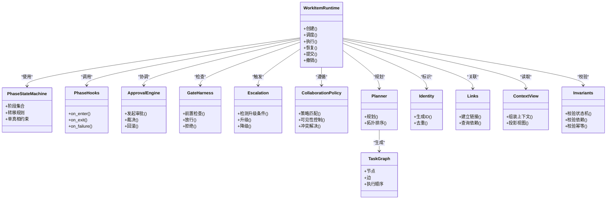
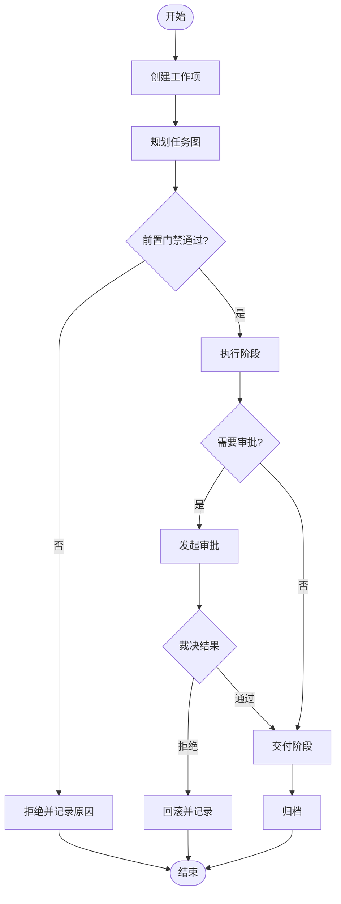
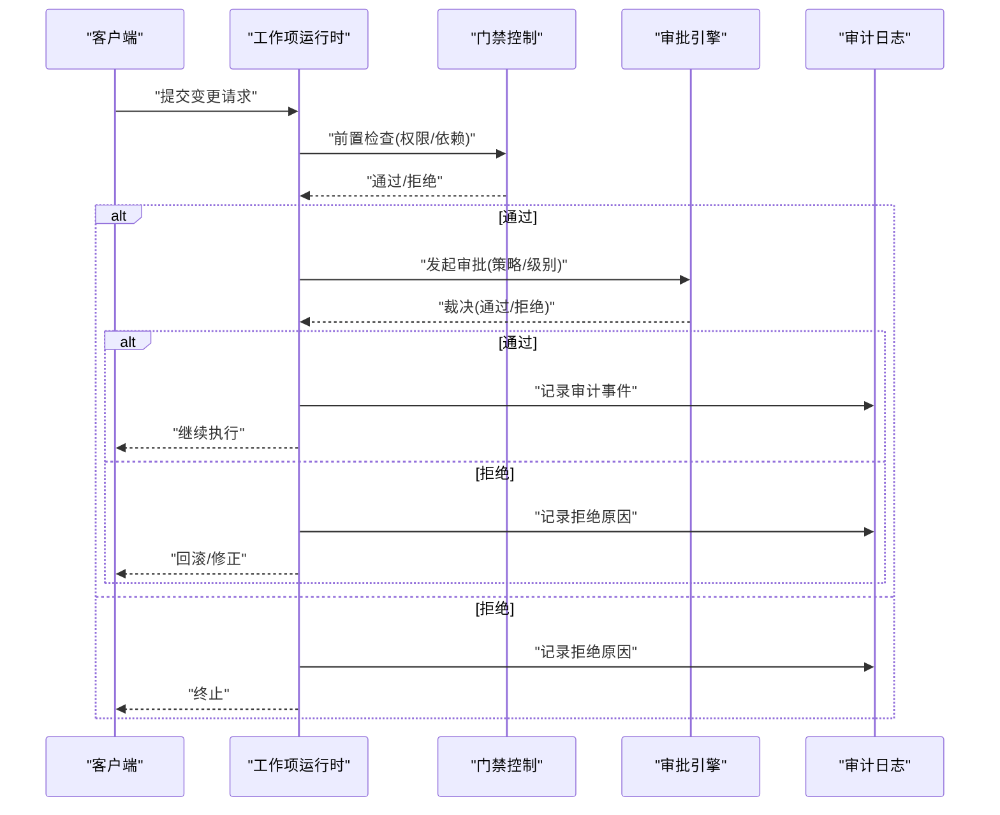
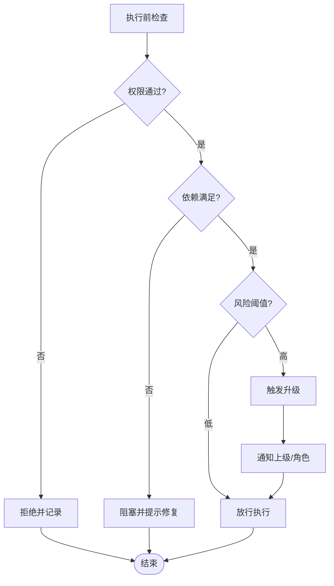
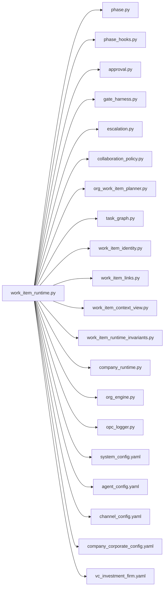

# 企业级工作流

<cite>
**本文引用的文件**   
- [opc/layer2_organization/approval.py](file://opc/layer2_organization/approval.py)
- [opc/layer2_organization/collaboration_policy.py](file://opc/layer2_organization/collaboration_policy.py)
- [opc/layer2_organization/escalation.py](file://opc/layer2_organization/escalation.py)
- [opc/layer2_organization/gate_harness.py](file://opc/layer2_organization/gate_harness.py)
- [opc/layer2_organization/phase.py](file://opc/layer2_organization/phase.py)
- [opc/layer2_organization/phase_hooks.py](file://opc/layer2_organization/phase_hooks.py)
- [opc/layer2_organization/work_item_runtime.py](file://opc/layer2_organization/work_item_runtime.py)
- [opc/layer2_organization/work_item_transition.py](file://opc/layer2_organization/work_item_transition.py)
- [opc/layer2_organization/org_work_item_planner.py](file://opc/layer2_organization/org_work_item_planner.py)
- [opc/layer2_organization/task_graph.py](file://opc/layer2_organization/task_graph.py)
- [opc/layer2_organization/work_item_identity.py](file://opc/layer2_organization/work_item_identity.py)
- [opc/layer2_organization/work_item_links.py](file://opc/layer2_organization/work_item_links.py)
- [opc/layer2_organization/work_item_context_view.py](file://opc/layer2_organization/work_item_context_view.py)
- [opc/layer2_organization/work_item_runtime_invariants.py](file://opc/layer2_organization/work_item_runtime_invariants.py)
- [opc/layer2_organization/company_runtime.py](file://opc/layer2_organization/company_runtime.py)
- [opc/layer2_organization/org_engine.py](file://opc/layer2_organization/org_engine.py)
- [opc/layer4_tools/collaboration.py](file://opc/layer4_tools/collaboration.py)
- [opc/layer4_tools/collaboration_dispatch.py](file://opc/layer4_tools/collaboration_dispatch.py)
- [opc/layer4_tools/collaboration_rpc.py](file://opc/layer4_tools/collaboration_rpc.py)
- [opc/layer6_observability/opc_logger.py](file://opc/layer6_observability/opc_logger.py)
- [config/system_config.yaml](file://config/system_config.yaml)
- [config/agent_config.yaml](file://config/agent_config.yaml)
- [config/channel_config.yaml](file://config/channel_config.yaml)
- [config/company_corporate_config.yaml](file://config/company_corporate_config.yaml)
- [opc/market/builtin_presets/vc_investment_firm.yaml](file://opc/market/builtin_presets/vc_investment_firm.yaml)
- [tests/test_phase_state_machine_invariants.py](file://tests/test_phase_state_machine_invariants.py)
- [tests/test_phase_single_truth_invariants.py](file://tests/test_phase_single_truth_invariants.py)
- [tests/test_phase_transition_hooks.py](file://tests/test_phase_transition_hooks.py)
- [tests/test_gate_harness.py](file://tests/test_gate_harness.py)
- [tests/test_work_item_transition.py](file://tests/test_work_item_transition.py)
- [tests/test_work_item_runtime_invariants.py](file://tests/test_work_item_runtime_invariants.py)
- [tests/test_approval_engine.py](file://tests/test_approval_engine.py)
- [tests/test_company_review_flow.py](file://tests/test_company_review_flow.py)
</cite>

## 目录
1. [简介](#简介)
2. [项目结构](#项目结构)
3. [核心组件](#核心组件)
4. [架构总览](#架构总览)
5. [详细组件分析](#详细组件分析)
6. [依赖关系分析](#依赖关系分析)
7. [性能考虑](#性能考虑)
8. [故障排查指南](#故障排查指南)
9. [结论](#结论)
10. [附录](#附录)

## 简介
本文件面向OpenOPC的企业级工作流引擎，聚焦审批流程、状态机与业务流程编排。文档从系统架构、组件关系、数据流、处理逻辑、集成点、错误处理与性能特性等维度展开，帮助读者理解：
- 工作项生命周期管理、阶段转换与钩子机制
- 协作策略配置、门禁控制与升级处理
- 工作流定义的YAML配置与可视化编辑方法
- 权限控制、审计日志与合规性要求
- 外部系统集成与数据同步机制
- 复杂业务场景实现案例与性能调优建议

## 项目结构
OpenOPC将工作流相关能力集中在组织层（layer2_organization），并通过工具层（layer4_tools）提供协作接口，通过可观测层（layer6_observability）记录审计日志，同时以配置文件和内置市场预设定义策略与工作流。

```mermaid
graph TB
subgraph "组织层"
A["work_item_runtime.py<br/>工作项运行时"]
B["work_item_transition.py<br/>工作项状态迁移"]
C["phase.py<br/>阶段与状态机"]
D["phase_hooks.py<br/>阶段钩子"]
E["approval.py<br/>审批引擎"]
F["gate_harness.py<br/>门禁控制"]
G["escalation.py<br/>升级处理"]
H["collaboration_policy.py<br/>协作策略"]
I["org_work_item_planner.py<br/>工作项规划器"]
J["task_graph.py<br/>任务图"]
K["work_item_identity.py<br/>工作项标识"]
L["work_item_links.py<br/>工作项链接"]
M["work_item_context_view.py<br/>上下文视图"]
N["work_item_runtime_invariants.py<br/>不变式校验"]
O["company_runtime.py<br/>公司运行时"]
P["org_engine.py<br/>组织引擎"]
end
subgraph "工具层"
T1["collaboration.py<br/>协作API"]
T2["collaboration_dispatch.py<br/>协作分发"]
T3["collaboration_rpc.py<br/>协作RPC"]
end
subgraph "可观测层"
OBS["opc_logger.py<br/>审计日志"]
end
subgraph "配置与市场"
CFG1["system_config.yaml"]
CFG2["agent_config.yaml"]
CFG3["channel_config.yaml"]
CFG4["company_corporate_config.yaml"]
MKT["vc_investment_firm.yaml"]
end
A --> B
A --> C
A --> D
A --> E
A --> F
A --> G
A --> H
A --> I
A --> J
A --> K
A --> L
A --> M
A --> N
A --> O
A --> P
T1 --> A
T2 --> A
T3 --> A
A --> OBS
A --> CFG1
A --> CFG2
A --> CFG3
A --> CFG4
A --> MKT
```

图表来源
- [opc/layer2_organization/work_item_runtime.py](file://opc/layer2_organization/work_item_runtime.py)
- [opc/layer2_organization/work_item_transition.py](file://opc/layer2_organization/work_item_transition.py)
- [opc/layer2_organization/phase.py](file://opc/layer2_organization/phase.py)
- [opc/layer2_organization/phase_hooks.py](file://opc/layer2_organization/phase_hooks.py)
- [opc/layer2_organization/approval.py](file://opc/layer2_organization/approval.py)
- [opc/layer2_organization/gate_harness.py](file://opc/layer2_organization/gate_harness.py)
- [opc/layer2_organization/escalation.py](file://opc/layer2_organization/escalation.py)
- [opc/layer2_organization/collaboration_policy.py](file://opc/layer2_organization/collaboration_policy.py)
- [opc/layer2_organization/org_work_item_planner.py](file://opc/layer2_organization/org_work_item_planner.py)
- [opc/layer2_organization/task_graph.py](file://opc/layer2_organization/task_graph.py)
- [opc/layer2_organization/work_item_identity.py](file://opc/layer2_organization/work_item_identity.py)
- [opc/layer2_organization/work_item_links.py](file://opc/layer2_organization/work_item_links.py)
- [opc/layer2_organization/work_item_context_view.py](file://opc/layer2_organization/work_item_context_view.py)
- [opc/layer2_organization/work_item_runtime_invariants.py](file://opc/layer2_organization/work_item_runtime_invariants.py)
- [opc/layer2_organization/company_runtime.py](file://opc/layer2_organization/company_runtime.py)
- [opc/layer2_organization/org_engine.py](file://opc/layer2_organization/org_engine.py)
- [opc/layer4_tools/collaboration.py](file://opc/layer4_tools/collaboration.py)
- [opc/layer4_tools/collaboration_dispatch.py](file://opc/layer4_tools/collaboration_dispatch.py)
- [opc/layer4_tools/collaboration_rpc.py](file://opc/layer4_tools/collaboration_rpc.py)
- [opc/layer6_observability/opc_logger.py](file://opc/layer6_observability/opc_logger.py)
- [config/system_config.yaml](file://config/system_config.yaml)
- [config/agent_config.yaml](file://config/agent_config.yaml)
- [config/channel_config.yaml](file://config/channel_config.yaml)
- [config/company_corporate_config.yaml](file://config/company_corporate_config.yaml)
- [opc/market/builtin_presets/vc_investment_firm.yaml](file://opc/market/builtin_presets/vc_investment_firm.yaml)

章节来源
- [opc/layer2_organization/work_item_runtime.py](file://opc/layer2_organization/work_item_runtime.py)
- [opc/layer2_organization/phase.py](file://opc/layer2_organization/phase.py)
- [opc/layer2_organization/approval.py](file://opc/layer2_organization/approval.py)
- [config/system_config.yaml](file://config/system_config.yaml)

## 核心组件
本节概述工作流引擎的核心组件及其职责：
- 工作项运行时：负责工作项的创建、调度、执行、恢复与持久化，协调状态迁移、门禁、审批与升级。
- 阶段与状态机：定义阶段集合、允许的状态转移规则以及单真相约束。
- 阶段钩子：在阶段进入、退出、失败等时机触发扩展点，用于审计、通知或副作用。
- 审批引擎：支持多级审批、条件路由与回滚策略。
- 门禁控制：在执行关键步骤前进行前置检查（如权限、依赖、资源）。
- 升级处理：当超时、失败或策略触发时自动升级至更高层级或不同角色。
- 协作策略：定义跨角色/跨会话的协作方式、可见性与冲突解决。
- 工作项规划器与任务图：将业务目标分解为有向无环图，驱动并行与顺序执行。
- 工作项标识、链接与上下文视图：确保唯一性、关联性与可读性。
- 不变式校验：保证运行期一致性（如状态机合法性、依赖满足、幂等性）。

章节来源
- [opc/layer2_organization/work_item_runtime.py](file://opc/layer2_organization/work_item_runtime.py)
- [opc/layer2_organization/phase.py](file://opc/layer2_organization/phase.py)
- [opc/layer2_organization/phase_hooks.py](file://opc/layer2_organization/phase_hooks.py)
- [opc/layer2_organization/approval.py](file://opc/layer2_organization/approval.py)
- [opc/layer2_organization/gate_harness.py](file://opc/layer2_organization/gate_harness.py)
- [opc/layer2_organization/escalation.py](file://opc/layer2_organization/escalation.py)
- [opc/layer2_organization/collaboration_policy.py](file://opc/layer2_organization/collaboration_policy.py)
- [opc/layer2_organization/org_work_item_planner.py](file://opc/layer2_organization/org_work_item_planner.py)
- [opc/layer2_organization/task_graph.py](file://opc/layer2_organization/task_graph.py)
- [opc/layer2_organization/work_item_identity.py](file://opc/layer2_organization/work_item_identity.py)
- [opc/layer2_organization/work_item_links.py](file://opc/layer2_organization/work_item_links.py)
- [opc/layer2_organization/work_item_context_view.py](file://opc/layer2_organization/work_item_context_view.py)
- [opc/layer2_organization/work_item_runtime_invariants.py](file://opc/layer2_organization/work_item_runtime_invariants.py)

## 架构总览
下图展示工作流引擎的整体架构与交互关系，包括工作项运行时、状态机、审批、门禁、升级、协作策略、规划器与任务图，以及与工具层、可观测层和配置的集成。

图表来源
- [opc/layer2_organization/work_item_runtime.py](file://opc/layer2_organization/work_item_runtime.py)
- [opc/layer2_organization/phase.py](file://opc/layer2_organization/phase.py)
- [opc/layer2_organization/phase_hooks.py](file://opc/layer2_organization/phase_hooks.py)
- [opc/layer2_organization/approval.py](file://opc/layer2_organization/approval.py)
- [opc/layer2_organization/gate_harness.py](file://opc/layer2_organization/gate_harness.py)
- [opc/layer2_organization/escalation.py](file://opc/layer2_organization/escalation.py)
- [opc/layer2_organization/collaboration_policy.py](file://opc/layer2_organization/collaboration_policy.py)
- [opc/layer2_organization/org_work_item_planner.py](file://opc/layer2_organization/org_work_item_planner.py)
- [opc/layer2_organization/task_graph.py](file://opc/layer2_organization/task_graph.py)
- [opc/layer2_organization/work_item_identity.py](file://opc/layer2_organization/work_item_identity.py)
- [opc/layer2_organization/work_item_links.py](file://opc/layer2_organization/work_item_links.py)
- [opc/layer2_organization/work_item_context_view.py](file://opc/layer2_organization/work_item_context_view.py)
- [opc/layer2_organization/work_item_runtime_invariants.py](file://opc/layer2_organization/work_item_runtime_invariants.py)

## 详细组件分析

### 工作项生命周期与状态机
- 生命周期阶段：创建、规划、准备、执行、评审、交付、归档。每个阶段由状态机严格约束，仅允许预定义转移。
- 单真相原则：任一时刻工作项仅处于一个有效阶段，避免并发写入导致的不一致。
- 转移钩子：在进入/退出阶段时触发审计、通知与副作用；失败路径统一走异常处理与重试策略。

图表来源
- [opc/layer2_organization/work_item_runtime.py](file://opc/layer2_organization/work_item_runtime.py)
- [opc/layer2_organization/phase.py](file://opc/layer2_organization/phase.py)
- [opc/layer2_organization/phase_hooks.py](file://opc/layer2_organization/phase_hooks.py)
- [opc/layer2_organization/gate_harness.py](file://opc/layer2_organization/gate_harness.py)
- [opc/layer2_organization/approval.py](file://opc/layer2_organization/approval.py)

章节来源
- [opc/layer2_organization/work_item_runtime.py](file://opc/layer2_organization/work_item_runtime.py)
- [opc/layer2_organization/phase.py](file://opc/layer2_organization/phase.py)
- [opc/layer2_organization/phase_hooks.py](file://opc/layer2_organization/phase_hooks.py)
- [tests/test_phase_state_machine_invariants.py](file://tests/test_phase_state_machine_invariants.py)
- [tests/test_phase_single_truth_invariants.py](file://tests/test_phase_single_truth_invariants.py)

### 审批流程设计与裁决
- 设计原理：基于策略驱动的审批模型，支持多级、条件分支与并行会签。
- 裁决流程：收集裁决意见，按策略计算最终结果；通过后继续流转，拒绝则触发回滚或修正路径。
- 回滚策略：支持部分回滚与全量回滚，结合事务边界与幂等性保障。

图表来源
- [opc/layer2_organization/work_item_runtime.py](file://opc/layer2_organization/work_item_runtime.py)
- [opc/layer2_organization/gate_harness.py](file://opc/layer2_organization/gate_harness.py)
- [opc/layer2_organization/approval.py](file://opc/layer2_organization/approval.py)
- [opc/layer6_observability/opc_logger.py](file://opc/layer6_observability/opc_logger.py)

章节来源
- [opc/layer2_organization/approval.py](file://opc/layer2_organization/approval.py)
- [tests/test_approval_engine.py](file://tests/test_approval_engine.py)
- [tests/test_company_review_flow.py](file://tests/test_company_review_flow.py)

### 门禁控制与升级处理
- 门禁控制：在执行关键步骤前进行前置检查，包括权限、依赖、资源可用性、合规性。
- 升级处理：当达到阈值（超时、失败次数、风险等级）时自动升级至更高层级或不同角色，并记录审计事件。

图表来源
- [opc/layer2_organization/gate_harness.py](file://opc/layer2_organization/gate_harness.py)
- [opc/layer2_organization/escalation.py](file://opc/layer2_organization/escalation.py)

章节来源
- [opc/layer2_organization/gate_harness.py](file://opc/layer2_organization/gate_harness.py)
- [opc/layer2_organization/escalation.py](file://opc/layer2_organization/escalation.py)
- [tests/test_gate_harness.py](file://tests/test_gate_harness.py)

### 协作策略与可见性
- 协作策略：定义跨角色/跨会话的协作方式、消息路由、冲突解决与可见性控制。
- 可见性：基于策略对上下文、进度与产物进行投影，确保最小必要信息暴露。

章节来源
- [opc/layer2_organization/collaboration_policy.py](file://opc/layer2_organization/collaboration_policy.py)
- [opc/layer4_tools/collaboration.py](file://opc/layer4_tools/collaboration.py)
- [opc/layer4_tools/collaboration_dispatch.py](file://opc/layer4_tools/collaboration_dispatch.py)
- [opc/layer4_tools/collaboration_rpc.py](file://opc/layer4_tools/collaboration_rpc.py)

### 工作项规划与任务图
- 规划器：将业务目标分解为任务图，支持并行与顺序约束。
- 任务图：以节点表示任务、边表示依赖，进行拓扑排序与执行调度。

章节来源
- [opc/layer2_organization/org_work_item_planner.py](file://opc/layer2_organization/org_work_item_planner.py)
- [opc/layer2_organization/task_graph.py](file://opc/layer2_organization/task_graph.py)

### 工作项标识、链接与上下文视图
- 标识：确保工作项全局唯一，支持去重与版本化。
- 链接：维护工作项之间的依赖与关联，便于追溯与影响分析。
- 上下文视图：聚合多源上下文，提供只读投影供UI与工具消费。

章节来源
- [opc/layer2_organization/work_item_identity.py](file://opc/layer2_organization/work_item_identity.py)
- [opc/layer2_organization/work_item_links.py](file://opc/layer2_organization/work_item_links.py)
- [opc/layer2_organization/work_item_context_view.py](file://opc/layer2_organization/work_item_context_view.py)

### 不变式与一致性
- 状态机不变式：确保阶段转移合法，避免非法状态。
- 单真相不变式：保证同一时刻仅有一个有效阶段。
- 依赖与幂等：确保依赖满足与操作幂等，提升鲁棒性。

章节来源
- [opc/layer2_organization/work_item_runtime_invariants.py](file://opc/layer2_organization/work_item_runtime_invariants.py)
- [tests/test_work_item_runtime_invariants.py](file://tests/test_work_item_runtime_invariants.py)
- [tests/test_phase_single_truth_invariants.py](file://tests/test_phase_single_truth_invariants.py)

## 依赖关系分析
工作项运行时作为中心枢纽，依赖状态机、审批、门禁、升级、协作策略、规划器与任务图，并与工具层、可观测层及配置进行交互。

图表来源
- [opc/layer2_organization/work_item_runtime.py](file://opc/layer2_organization/work_item_runtime.py)
- [opc/layer2_organization/phase.py](file://opc/layer2_organization/phase.py)
- [opc/layer2_organization/phase_hooks.py](file://opc/layer2_organization/phase_hooks.py)
- [opc/layer2_organization/approval.py](file://opc/layer2_organization/approval.py)
- [opc/layer2_organization/gate_harness.py](file://opc/layer2_organization/gate_harness.py)
- [opc/layer2_organization/escalation.py](file://opc/layer2_organization/escalation.py)
- [opc/layer2_organization/collaboration_policy.py](file://opc/layer2_organization/collaboration_policy.py)
- [opc/layer2_organization/org_work_item_planner.py](file://opc/layer2_organization/org_work_item_planner.py)
- [opc/layer2_organization/task_graph.py](file://opc/layer2_organization/task_graph.py)
- [opc/layer2_organization/work_item_identity.py](file://opc/layer2_organization/work_item_identity.py)
- [opc/layer2_organization/work_item_links.py](file://opc/layer2_organization/work_item_links.py)
- [opc/layer2_organization/work_item_context_view.py](file://opc/layer2_organization/work_item_context_view.py)
- [opc/layer2_organization/work_item_runtime_invariants.py](file://opc/layer2_organization/work_item_runtime_invariants.py)
- [opc/layer2_organization/company_runtime.py](file://opc/layer2_organization/company_runtime.py)
- [opc/layer2_organization/org_engine.py](file://opc/layer2_organization/org_engine.py)
- [opc/layer6_observability/opc_logger.py](file://opc/layer6_observability/opc_logger.py)
- [config/system_config.yaml](file://config/system_config.yaml)
- [config/agent_config.yaml](file://config/agent_config.yaml)
- [config/channel_config.yaml](file://config/channel_config.yaml)
- [config/company_corporate_config.yaml](file://config/company_corporate_config.yaml)
- [opc/market/builtin_presets/vc_investment_firm.yaml](file://opc/market/builtin_presets/vc_investment_firm.yaml)

章节来源
- [opc/layer2_organization/work_item_runtime.py](file://opc/layer2_organization/work_item_runtime.py)
- [config/system_config.yaml](file://config/system_config.yaml)

## 性能考虑
- 状态机与转移：采用有限状态机与预编译转移表，降低决策开销；避免在热路径中进行昂贵计算。
- 任务图调度：利用拓扑排序与并行执行窗口，提高吞吐；对长尾任务设置超时与熔断。
- 审批与门禁：缓存策略与快速失败路径，减少不必要的远程调用；批量裁决合并以减少锁竞争。
- 审计日志：异步落盘与批处理，避免阻塞主流程；分级日志与采样策略控制存储成本。
- 内存与序列化：上下文视图按需投影，避免全量加载；工作项快照压缩与增量更新。
- 幂等与重试：对关键操作实现幂等与指数退避重试，提升稳定性。

[本节为通用性能指导，不直接分析具体文件]

## 故障排查指南
- 状态机异常：检查阶段转移是否合法、是否存在并发写入导致的非单真相问题。
- 审批失败：核对审批策略、裁决条件与回滚路径；查看审计日志中的拒绝原因。
- 门禁拒绝：确认权限、依赖与资源可用性；根据拒绝原因定位缺失项。
- 升级触发：检查升级阈值与策略配置；验证升级后的角色与权限是否正确生效。
- 协作冲突：查看协作策略与可见性配置；确认消息路由与冲突解决策略。
- 日志与追踪：通过可观测层输出审计事件，结合时间戳与上下文视图进行根因分析。

章节来源
- [opc/layer6_observability/opc_logger.py](file://opc/layer6_observability/opc_logger.py)
- [tests/test_phase_transition_hooks.py](file://tests/test_phase_transition_hooks.py)
- [tests/test_work_item_transition.py](file://tests/test_work_item_transition.py)

## 结论
OpenOPC的企业级工作流引擎以工作项运行时为核心，围绕状态机、审批、门禁、升级与协作策略构建完整闭环。通过严格的不变式校验与审计日志，确保流程的可控、可追溯与合规。配合规划器与任务图，可实现复杂业务的灵活编排与高效执行。

[本节为总结性内容，不直接分析具体文件]

## 附录

### YAML配置示例与可视化编辑
- 系统配置：包含工作流默认参数、日志级别、重试策略等。
- 代理配置：定义代理行为、工具集与权限范围。
- 渠道配置：定义消息通道与路由策略。
- 公司企业配置：定义组织架构、角色与策略。
- 内置市场预设：提供行业模板（如风投机构）的工作流与策略。

章节来源
- [config/system_config.yaml](file://config/system_config.yaml)
- [config/agent_config.yaml](file://config/agent_config.yaml)
- [config/channel_config.yaml](file://config/channel_config.yaml)
- [config/company_corporate_config.yaml](file://config/company_corporate_config.yaml)
- [opc/market/builtin_presets/vc_investment_firm.yaml](file://opc/market/builtin_presets/vc_investment_firm.yaml)

### 权限控制、审计日志与合规性
- 权限控制：基于角色与策略的最小权限原则，门禁前置校验。
- 审计日志：记录关键事件（创建、转移、裁决、升级、拒绝），支持检索与导出。
- 合规性：通过策略与不可变审计记录满足内审与外审要求。

章节来源
- [opc/layer2_organization/gate_harness.py](file://opc/layer2_organization/gate_harness.py)
- [opc/layer6_observability/opc_logger.py](file://opc/layer6_observability/opc_logger.py)

### 外部系统集成与数据同步
- 协作API：提供统一的协作接口，支持消息、任务与进度同步。
- 协作分发：将请求分发到合适的执行者或子系统。
- 协作RPC：跨进程/跨服务调用，支持超时与重试。

章节来源
- [opc/layer4_tools/collaboration.py](file://opc/layer4_tools/collaboration.py)
- [opc/layer4_tools/collaboration_dispatch.py](file://opc/layer4_tools/collaboration_dispatch.py)
- [opc/layer4_tools/collaboration_rpc.py](file://opc/layer4_tools/collaboration_rpc.py)

### 复杂业务场景实现案例
- 多级审批与并行会签：适用于高风险变更，需多个角色共同裁决。
- 条件分支与动态路由：根据上下文与风险评估选择不同路径。
- 回滚与修正：拒绝后自动回滚并引导修正，形成闭环。
- 跨团队协同：通过协作策略与可见性控制，实现安全共享与协作。

章节来源
- [opc/layer2_organization/approval.py](file://opc/layer2_organization/approval.py)
- [opc/layer2_organization/collaboration_policy.py](file://opc/layer2_organization/collaboration_policy.py)
- [tests/test_company_review_flow.py](file://tests/test_company_review_flow.py)