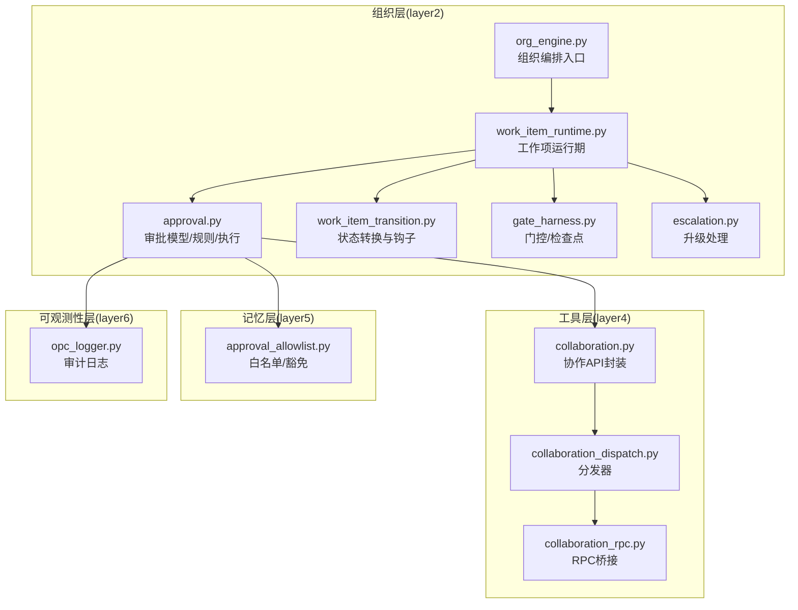
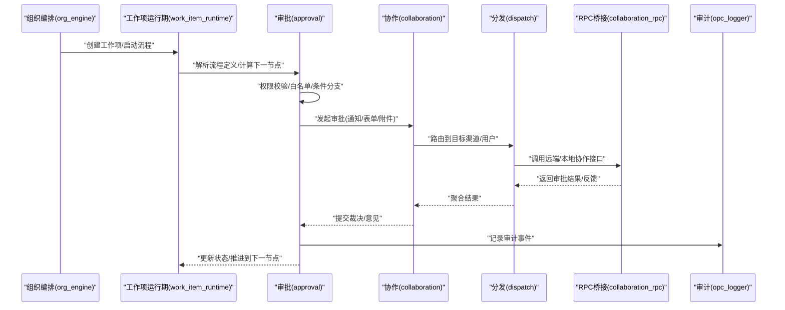
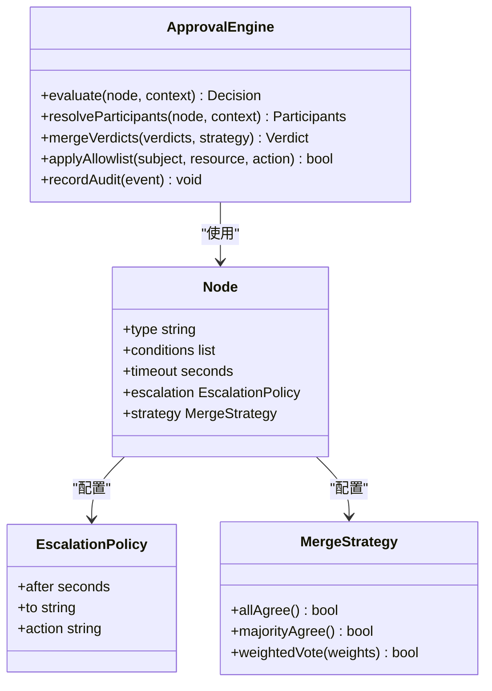
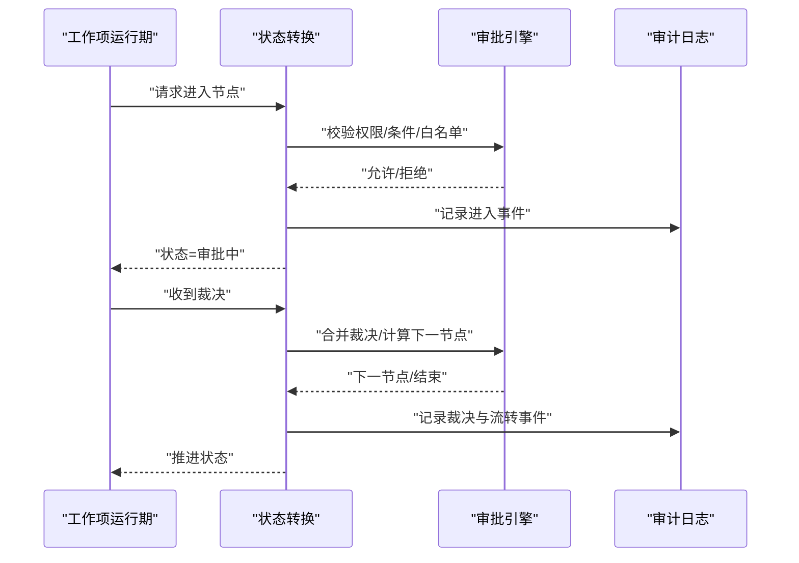
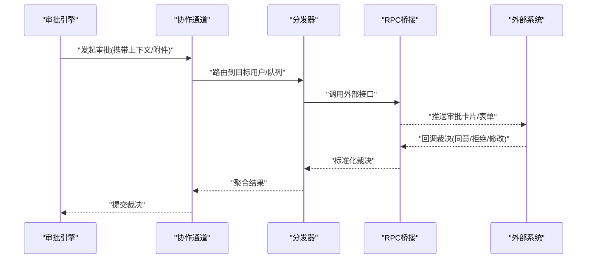
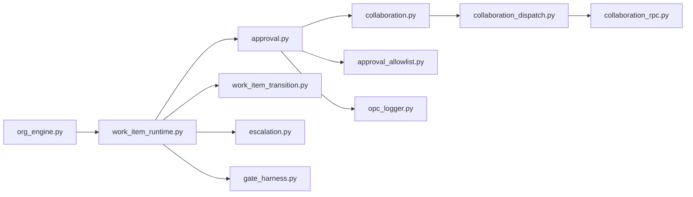

# 审批引擎

<cite>
**本文引用的文件**   
- [opc/layer2_organization/approval.py](file://opc/layer2_organization/approval.py)
- [opc/layer5_memory/approval_allowlist.py](file://opc/layer5_memory/approval_allowlist.py)
- [opc/layer4_tools/collaboration.py](file://opc/layer4_tools/collaboration.py)
- [opc/layer4_tools/collaboration_dispatch.py](file://opc/layer4_tools/collaboration_dispatch.py)
- [opc/layer4_tools/collaboration_rpc.py](file://opc/layer4_tools/collaboration_rpc.py)
- [opc/layer2_organization/work_item_runtime.py](file://opc/layer2_organization/work_item_runtime.py)
- [opc/layer2_organization/work_item_transition.py](file://opc/layer2_organization/work_item_transition.py)
- [opc/layer2_organization/org_engine.py](file://opc/layer2_organization/org_engine.py)
- [opc/layer2_organization/gate_harness.py](file://opc/layer2_organization/gate_harness.py)
- [opc/layer2_organization/escalation.py](file://opc/layer2_organization/escalation.py)
- [opc/layer6_observability/opc_logger.py](file://opc/layer6_observability/opc_logger.py)
- [tests/test_approval_engine.py](file://tests/test_approval_engine.py)
- [tests/test_company_review_flow.py](file://tests/test_company_review_flow.py)
- [tests/test_review_feedback_fallback.py](file://tests/test_review_feedback_fallback.py)
- [tests/test_review_verdict_and_dep_refresh.py](file://tests/test_review_verdict_and_dep_refresh.py)
</cite>

## 目录
1. [简介](#简介)
2. [项目结构](#项目结构)
3. [核心组件](#核心组件)
4. [架构总览](#架构总览)
5. [详细组件分析](#详细组件分析)
6. [依赖关系分析](#依赖关系分析)
7. [性能考量](#性能考量)
8. [故障排查指南](#故障排查指南)
9. [结论](#结论)
10. [附录](#附录)

## 简介
本文件面向OpenOPC的“审批引擎”，系统性阐述其状态机设计、节点配置与流转规则，覆盖多级审批、条件分支、并行审批、权限控制、审批人分配策略、自动审批规则、YAML流程定义与可视化编辑方法、历史追踪与审计日志、合规性要求，以及合同审批、代码审查等复杂场景的实现要点。文档以源码为依据，结合测试用例，提供从高层到代码级的完整说明。

## 项目结构
审批相关能力分布在组织层（layer2）、工具层（layer4）、记忆层（layer5）与可观测性层（layer6），并通过工作项运行时与转换机制协同推进流程。

图表来源
- [opc/layer2_organization/approval.py](file://opc/layer2_organization/approval.py)
- [opc/layer2_organization/work_item_runtime.py](file://opc/layer2_organization/work_item_runtime.py)
- [opc/layer2_organization/work_item_transition.py](file://opc/layer2_organization/work_item_transition.py)
- [opc/layer2_organization/org_engine.py](file://opc/layer2_organization/org_engine.py)
- [opc/layer2_organization/gate_harness.py](file://opc/layer2_organization/gate_harness.py)
- [opc/layer2_organization/escalation.py](file://opc/layer2_organization/escalation.py)
- [opc/layer4_tools/collaboration.py](file://opc/layer4_tools/collaboration.py)
- [opc/layer4_tools/collaboration_dispatch.py](file://opc/layer4_tools/collaboration_dispatch.py)
- [opc/layer4_tools/collaboration_rpc.py](file://opc/layer4_tools/collaboration_rpc.py)
- [opc/layer5_memory/approval_allowlist.py](file://opc/layer5_memory/approval_allowlist.py)
- [opc/layer6_observability/opc_logger.py](file://opc/layer6_observability/opc_logger.py)

章节来源
- [opc/layer2_organization/approval.py](file://opc/layer2_organization/approval.py)
- [opc/layer2_organization/work_item_runtime.py](file://opc/layer2_organization/work_item_runtime.py)
- [opc/layer2_organization/work_item_transition.py](file://opc/layer2_organization/work_item_transition.py)
- [opc/layer2_organization/org_engine.py](file://opc/layer2_organization/org_engine.py)
- [opc/layer2_organization/gate_harness.py](file://opc/layer2_organization/gate_harness.py)
- [opc/layer2_organization/escalation.py](file://opc/layer2_organization/escalation.py)
- [opc/layer4_tools/collaboration.py](file://opc/layer4_tools/collaboration.py)
- [opc/layer4_tools/collaboration_dispatch.py](file://opc/layer4_tools/collaboration_dispatch.py)
- [opc/layer4_tools/collaboration_rpc.py](file://opc/layer4_tools/collaboration_rpc.py)
- [opc/layer5_memory/approval_allowlist.py](file://opc/layer5_memory/approval_allowlist.py)
- [opc/layer6_observability/opc_logger.py](file://opc/layer6_observability/opc_logger.py)

## 核心组件
- 审批模型与规则：定义审批节点、条件、并行度、超时、升级策略、结果合并策略等。
- 工作项运行期：承载审批任务的生命周期、上下文、事件与持久化。
- 状态转换与钩子：驱动节点间流转，触发前置/后置钩子、校验与副作用。
- 协作通道：将审批请求投递至外部系统或内部协作界面，收集反馈。
- 白名单与豁免：对特定主体/资源/操作进行快速通过或跳过审批。
- 升级与门控：在失败、超时或冲突时进行升级；在关键路径设置检查点。
- 审计日志：记录审批全链路行为，满足合规审计需求。

章节来源
- [opc/layer2_organization/approval.py](file://opc/layer2_organization/approval.py)
- [opc/layer2_organization/work_item_runtime.py](file://opc/layer2_organization/work_item_runtime.py)
- [opc/layer2_organization/work_item_transition.py](file://opc/layer2_organization/work_item_transition.py)
- [opc/layer4_tools/collaboration.py](file://opc/layer4_tools/collaboration.py)
- [opc/layer5_memory/approval_allowlist.py](file://opc/layer5_memory/approval_allowlist.py)
- [opc/layer2_organization/gate_harness.py](file://opc/layer2_organization/gate_harness.py)
- [opc/layer2_organization/escalation.py](file://opc/layer2_organization/escalation.py)
- [opc/layer6_observability/opc_logger.py](file://opc/layer6_observability/opc_logger.py)

## 架构总览
审批引擎围绕“工作项”展开，由组织编排入口创建并调度，审批模块负责解析流程定义、计算下一步节点、协调审批人与渠道、汇总结果并推进状态。

图表来源
- [opc/layer2_organization/org_engine.py](file://opc/layer2_organization/org_engine.py)
- [opc/layer2_organization/work_item_runtime.py](file://opc/layer2_organization/work_item_runtime.py)
- [opc/layer2_organization/approval.py](file://opc/layer2_organization/approval.py)
- [opc/layer4_tools/collaboration.py](file://opc/layer4_tools/collaboration.py)
- [opc/layer4_tools/collaboration_dispatch.py](file://opc/layer4_tools/collaboration_dispatch.py)
- [opc/layer4_tools/collaboration_rpc.py](file://opc/layer4_tools/collaboration_rpc.py)
- [opc/layer6_observability/opc_logger.py](file://opc/layer6_observability/opc_logger.py)

## 详细组件分析

### 审批模型与规则（approval.py）
- 职责
  - 定义审批节点类型（单人、多人、会签、或签、条件分支、并行汇聚等）。
  - 管理流转规则：条件表达式、阈值、超时、重试、升级、回退。
  - 决策合并：按策略汇总多人裁决（如全部同意、多数同意、权重投票等）。
  - 权限与白名单：基于主体角色、资源标签、操作类型进行快速判定。
- 关键概念
  - 节点：包含输入约束、输出契约、参与者选择策略、超时与升级策略。
  - 条件分支：基于上下文变量与外部数据源的条件判断。
  - 并行审批：并发派发多个子任务，支持汇聚与熔断。
  - 自动审批：满足白名单或预设规则时直接通过。
- 复杂度与性能
  - 条件评估与参与者选择通常为O(n)或O(log n)，取决于索引与缓存策略。
  - 并行审批需考虑锁与幂等，避免重复裁决导致状态不一致。
- 错误处理
  - 对缺失上下文、非法条件、参与者不可达等情况进行降级与升级。
  - 记录详细审计信息以便回溯。

章节来源
- [opc/layer2_organization/approval.py](file://opc/layer2_organization/approval.py)

#### 类图（示意）

图表来源
- [opc/layer2_organization/approval.py](file://opc/layer2_organization/approval.py)

### 工作项运行期与状态转换（work_item_runtime.py / work_item_transition.py）
- 职责
  - 维护工作项生命周期：创建、挂起、恢复、完成、取消。
  - 驱动审批节点间的状态转换，确保原子性与一致性。
  - 暴露钩子：进入/离开节点、裁决前/后、失败/重试等。
- 状态机设计
  - 典型状态：待审批、审批中、部分通过、已通过、已拒绝、已升级、已取消。
  - 转换守卫：权限、条件、白名单、门控检查。
  - 转换动作：发送通知、记录日志、触发下游任务。
- 并发与幂等
  - 针对并行审批采用乐观锁或分布式锁保证裁决幂等。
  - 对重复裁决进行去重与合并。

章节来源
- [opc/layer2_organization/work_item_runtime.py](file://opc/layer2_organization/work_item_runtime.py)
- [opc/layer2_organization/work_item_transition.py](file://opc/layer2_organization/work_item_transition.py)

#### 序列图（一次审批流转）

图表来源
- [opc/layer2_organization/work_item_runtime.py](file://opc/layer2_organization/work_item_runtime.py)
- [opc/layer2_organization/work_item_transition.py](file://opc/layer2_organization/work_item_transition.py)
- [opc/layer2_organization/approval.py](file://opc/layer2_organization/approval.py)
- [opc/layer6_observability/opc_logger.py](file://opc/layer6_observability/opc_logger.py)

### 协作通道与分发（collaboration.py / collaboration_dispatch.py / collaboration_rpc.py）
- 职责
  - 将审批请求投递到合适的渠道（IM、邮件、工单系统等）。
  - 分发器根据目标用户/角色/队列进行路由。
  - RPC桥接统一对外部系统的调用与响应格式。
- 关键点
  - 幂等投递：防止重复通知导致的重复裁决。
  - 异步回调：外部系统通过回调或轮询上报裁决。
  - 错误重试与降级：网络异常时的重试策略与告警。

章节来源
- [opc/layer4_tools/collaboration.py](file://opc/layer4_tools/collaboration.py)
- [opc/layer4_tools/collaboration_dispatch.py](file://opc/layer4_tools/collaboration_dispatch.py)
- [opc/layer4_tools/collaboration_rpc.py](file://opc/layer4_tools/collaboration_rpc.py)

#### 序列图（外部裁决回调）

图表来源
- [opc/layer4_tools/collaboration.py](file://opc/layer4_tools/collaboration.py)
- [opc/layer4_tools/collaboration_dispatch.py](file://opc/layer4_tools/collaboration_dispatch.py)
- [opc/layer4_tools/collaboration_rpc.py](file://opc/layer4_tools/collaboration_rpc.py)

### 白名单与豁免（approval_allowlist.py）
- 职责
  - 对特定主体、资源、操作进行快速通过或跳过审批。
  - 支持基于标签、部门、风险等级、时间窗口的动态规则。
- 使用建议
  - 白名单应最小化且可审计，所有豁免均需记录原因与责任人。
  - 定期复核白名单条目，避免长期未清理带来的风险。

章节来源
- [opc/layer5_memory/approval_allowlist.py](file://opc/layer5_memory/approval_allowlist.py)

### 升级与门控（escalation.py / gate_harness.py）
- 升级
  - 当超时、裁决冲突或关键校验失败时，自动升级至更高级别审批人或管理者。
  - 支持升级路径、升级动作（转交、加签、冻结）与通知。
- 门控
  - 在关键路径设置检查点，确保前置条件满足后方可继续。
  - 用于合规性强制校验（如法务、安全、财务审核）。

章节来源
- [opc/layer2_organization/escalation.py](file://opc/layer2_organization/escalation.py)
- [opc/layer2_organization/gate_harness.py](file://opc/layer2_organization/gate_harness.py)

### 审计与合规（opc_logger.py）
- 职责
  - 记录审批全流程事件：创建、流转、裁决、升级、门控结果、异常。
  - 提供查询与导出能力，满足内审与外审要求。
- 合规要点
  - 不可篡改：审计日志写入后禁止修改或删除。
  - 完整性：关联工作项ID、节点ID、裁决者、时间戳、IP/会话标识。
  - 可追溯：支持端到端追踪，包括外部系统回调链。

章节来源
- [opc/layer6_observability/opc_logger.py](file://opc/layer6_observability/opc_logger.py)

## 依赖关系分析
- 低耦合高内聚
  - 审批引擎专注于规则与决策，不直接依赖具体渠道实现。
  - 工作项运行期作为编排中心，解耦业务逻辑与基础设施。
- 外部依赖
  - 协作通道与RPC桥接抽象了外部系统差异，便于替换与扩展。
- 潜在环依赖
  - 通过事件与回调避免循环调用，确保单向数据流。

图表来源
- [opc/layer2_organization/org_engine.py](file://opc/layer2_organization/org_engine.py)
- [opc/layer2_organization/work_item_runtime.py](file://opc/layer2_organization/work_item_runtime.py)
- [opc/layer2_organization/approval.py](file://opc/layer2_organization/approval.py)
- [opc/layer2_organization/work_item_transition.py](file://opc/layer2_organization/work_item_transition.py)
- [opc/layer4_tools/collaboration.py](file://opc/layer4_tools/collaboration.py)
- [opc/layer4_tools/collaboration_dispatch.py](file://opc/layer4_tools/collaboration_dispatch.py)
- [opc/layer4_tools/collaboration_rpc.py](file://opc/layer4_tools/collaboration_rpc.py)
- [opc/layer5_memory/approval_allowlist.py](file://opc/layer5_memory/approval_allowlist.py)
- [opc/layer2_organization/escalation.py](file://opc/layer2_organization/escalation.py)
- [opc/layer2_organization/gate_harness.py](file://opc/layer2_organization/gate_harness.py)
- [opc/layer6_observability/opc_logger.py](file://opc/layer6_observability/opc_logger.py)

## 性能考量
- 并行审批
  - 合理设置并发度，避免过多并发造成下游系统压力。
  - 使用批量通知与合并裁决减少往返次数。
- 条件评估
  - 对高频条件建立索引与缓存，降低评估开销。
- 幂等与去重
  - 裁决与回调必须幂等，避免重复处理导致状态抖动。
- 超时与重试
  - 为外部调用设置合理的超时与退避策略，防止雪崩。
- 存储与日志
  - 审计日志异步落盘，必要时分片与归档，避免阻塞主流程。

[本节为通用指导，无需源码引用]

## 故障排查指南
- 常见问题
  - 裁决丢失：检查分发器与RPC桥接的重试与幂等逻辑。
  - 状态卡住：查看状态转换钩子与门控检查结果。
  - 升级风暴：确认升级阈值与冷却时间配置。
  - 白名单误判：核对白名单规则与上下文变量。
- 定位手段
  - 通过审计日志检索工作项ID与节点ID，还原调用链。
  - 检查外部系统回调签名与时间戳，排除时钟漂移问题。
  - 对比工作项快照与当前状态，识别不一致点。

章节来源
- [tests/test_approval_engine.py](file://tests/test_approval_engine.py)
- [tests/test_company_review_flow.py](file://tests/test_company_review_flow.py)
- [tests/test_review_feedback_fallback.py](file://tests/test_review_feedback_fallback.py)
- [tests/test_review_verdict_and_dep_refresh.py](file://tests/test_review_verdict_and_dep_refresh.py)

## 结论
OpenOPC审批引擎以工作项为中心，通过清晰的职责分层与模块化设计，实现了灵活的多级审批、条件分支与并行审批能力。配合白名单、升级与门控机制，可满足复杂业务场景的合规与效率需求。完善的审计日志与测试覆盖为稳定性与可追溯性提供了保障。

[本节为总结，无需源码引用]

## 附录

### YAML流程定义示例（概念性）
- 节点类型
  - 单人审批、多人会签、多人或签、条件分支、并行汇聚、自动审批。
- 关键字段
  - 节点ID、名称、类型、条件表达式、参与者选择策略、超时、升级策略、裁决合并策略、前置/后置钩子。
- 示例片段（仅字段说明，非真实代码）
  - 节点：id、name、type、conditions、participants、timeout、escalation、merge_strategy、hooks。
  - 分支：when、then、else。
  - 并行：branches、convergence、timeout、fallback。
  - 升级：after、to、action、notify。
  - 白名单：subjects、resources、actions、rules。

[本节为概念性说明，无需源码引用]

### 可视化编辑方法（概念性）
- 拖拽式编辑器
  - 节点库：提供常用审批节点模板。
  - 连线与条件：可视化配置流转与分支条件。
  - 预览与校验：实时语法与语义校验，生成YAML。
- 版本管理与发布
  - 流程版本化，灰度发布与回滚。
  - 变更审计与影响面分析。

[本节为概念性说明，无需源码引用]

### 复杂场景案例

#### 合同审批
- 流程要点
  - 多部门会签（法务、财务、业务），金额阈值触发额外审批。
  - 条件分支：高风险合同走更严格路径。
  - 升级：超时或分歧时升级至管理层。
  - 门控：合规检查通过后才能签署。
- 实现建议
  - 使用并行汇聚与会签策略，确保关键部门一致同意。
  - 白名单适用于低风险标准合同快速通过。
  - 审计日志记录每个部门的意见与时间线。

[本节为概念性说明，无需源码引用]

#### 代码审查
- 流程要点
  - 指定Reviewer或随机分配，支持多人并行评审。
  - 条件分支：涉及核心模块或敏感变更需额外审批。
  - 自动审批：符合规范的小改动可直接通过。
  - 升级：长时间未回复或存在争议时升级至Tech Lead。
- 实现建议
  - 与Git平台集成，通过协作通道推送审查卡片。
  - 裁决合并采用多数同意或关键Reviewer一票否决策略。
  - 审计日志保留审查意见与变更差异摘要。

[本节为概念性说明，无需源码引用]