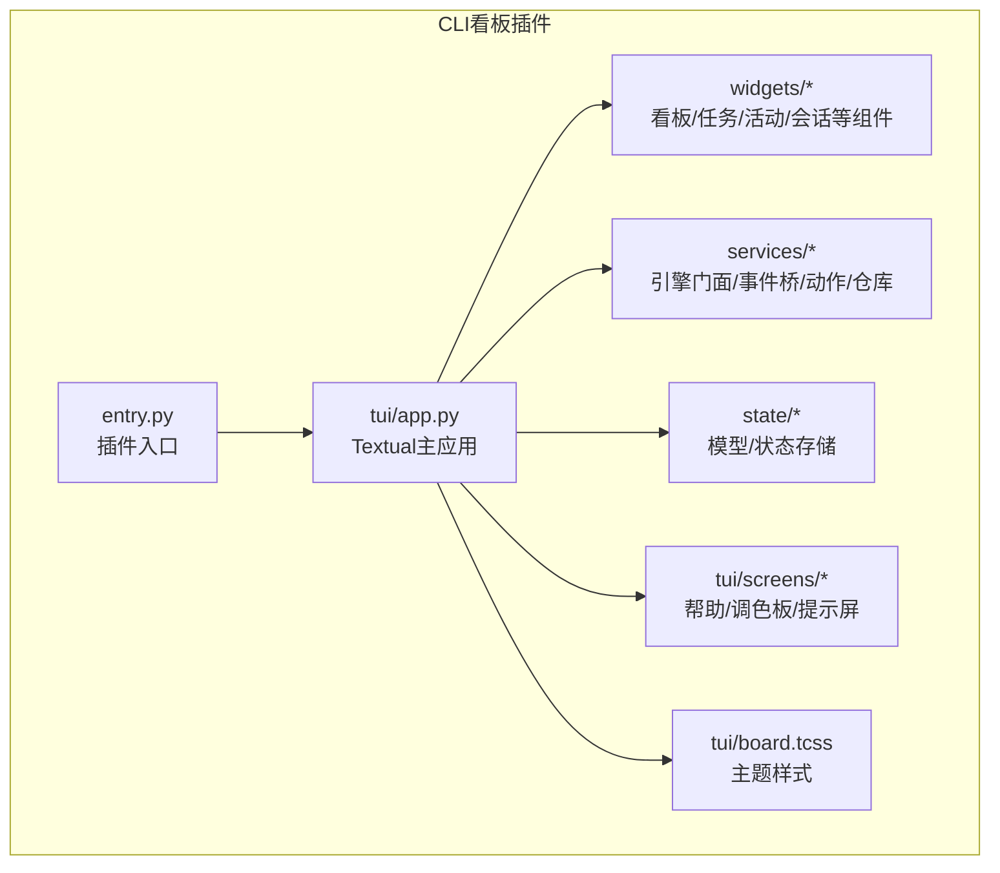
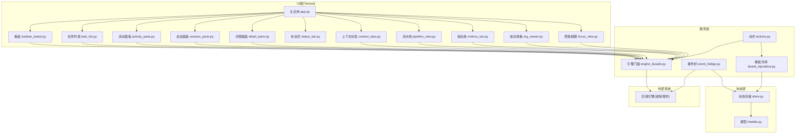
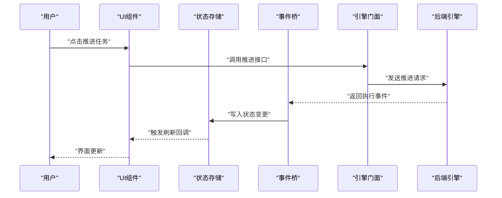
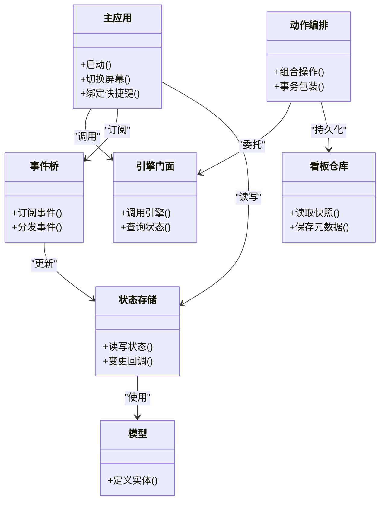

# CLI看板界面

<cite>
**本文引用的文件**   
- [opc/plugins/cli_board/entry.py](file://opc/plugins/cli_board/entry.py)
- [opc/plugins/cli_board/tui/app.py](file://opc/plugins/cli_board/tui/app.py)
- [opc/plugins/cli_board/tui/board.tcss](file://opc/plugins/cli_board/tui/board.tcss)
- [opc/plugins/cli_board/services/engine_facade.py](file://opc/plugins/cli_board/services/engine_facade.py)
- [opc/plugins/cli_board/services/event_bridge.py](file://opc/plugins/cli_board/services/event_bridge.py)
- [opc/plugins/cli_board/services/actions.py](file://opc/plugins/cli_board/services/actions.py)
- [opc/plugins/cli_board/services/board_repository.py](file://opc/plugins/cli_board/services/board_repository.py)
- [opc/plugins/cli_board/state/models.py](file://opc/plugins/cli_board/state/models.py)
- [opc/plugins/cli_board/state/store.py](file://opc/plugins/cli_board/state/store.py)
- [opc/plugins/cli_board/widgets/kanban_board.py](file://opc/plugins/cli_board/widgets/kanban_board.py)
- [opc/plugins/cli_board/widgets/task_list.py](file://opc/plugins/cli_board/widgets/task_list.py)
- [opc/plugins/cli_board/widgets/activity_pane.py](file://opc/plugins/cli_board/widgets/activity_pane.py)
- [opc/plugins/cli_board/widgets/session_pane.py](file://opc/plugins/cli_board/widgets/session_pane.py)
- [opc/plugins/cli_board/widgets/detail_pane.py](file://opc/plugins/cli_board/widgets/detail_pane.py)
- [opc/plugins/cli_board/widgets/status_bar.py](file://opc/plugins/cli_board/widgets/status_bar.py)
- [opc/plugins/cli_board/widgets/context_tabs.py](file://opc/plugins/cli_board/widgets/context_tabs.py)
- [opc/plugins/cli_board/widgets/pipeline_view.py](file://opc/plugins/cli_board/widgets/pipeline_view.py)
- [opc/plugins/cli_board/widgets/metrics_bar.py](file://opc/plugins/cli_board/widgets/metrics_bar.py)
- [opc/plugins/cli_board/widgets/org_viewer.py](file://opc/plugins/cli_board/widgets/org_viewer.py)
- [opc/plugins/cli_board/widgets/focus_view.py](file://opc/plugins/cli_board/widgets/focus_view.py)
- [opc/plugins/cli_board/widgets/render_utils.py](file://opc/plugins/cli_board/widgets/render_utils.py)
- [opc/plugins/cli_board/tui/screens/help.py](file://opc/plugins/cli_board/tui/screens/help.py)
- [opc/plugins/cli_board/tui/screens/palette.py](file://opc/plugins/cli_board/tui/screens/palette.py)
- [opc/plugins/cli_board/tui/screens/prompt.py](file://opc/plugins/cli_board/tui/screens/prompt.py)
</cite>

## 目录
1. [简介](#简介)
2. [项目结构](#项目结构)
3. [核心组件](#核心组件)
4. [架构总览](#架构总览)
5. [详细组件分析](#详细组件分析)
6. [依赖关系分析](#依赖关系分析)
7. [性能考虑](#性能考虑)
8. [故障排查指南](#故障排查指南)
9. [结论](#结论)
10. [附录](#附录)

## 简介
本文件为 OpenOPC 的 CLI 看板界面提供系统化文档。该界面基于 Textual 框架实现，面向终端用户，提供看板板管理、任务列表显示、活动面板、会话管理等核心能力。文档覆盖主应用结构、视图组件与交互逻辑、状态管理与事件处理、实时数据更新机制、主题与快捷键配置、错误处理与调试技巧，以及与后端引擎的通信协议和数据同步方式。

## 项目结构
CLI 看板插件位于 opc/plugins/cli_board 下，采用“服务-状态-UI”分层组织：
- tui：Textual 应用与屏幕、样式
- widgets：可复用 UI 组件（看板、任务列表、活动面板等）
- services：对外部引擎、持久化、动作编排的封装
- state：领域模型与内存状态存储
- entry：插件入口与命令行集成

图表来源
- [opc/plugins/cli_board/entry.py](file://opc/plugins/cli_board/entry.py)
- [opc/plugins/cli_board/tui/app.py](file://opc/plugins/cli_board/tui/app.py)
- [opc/plugins/cli_board/tui/board.tcss](file://opc/plugins/cli_board/tui/board.tcss)

章节来源
- [opc/plugins/cli_board/entry.py](file://opc/plugins/cli_board/entry.py)
- [opc/plugins/cli_board/tui/app.py](file://opc/plugins/cli_board/tui/app.py)

## 核心组件
- 主应用与生命周期
  - Textual 应用负责启动、屏幕切换、全局状态注入、键盘快捷键绑定与退出流程。
  - 通过服务层访问引擎与持久化，订阅事件并驱动 UI 刷新。
- 视图组件
  - 看板容器、任务列表、活动面板、会话侧边栏、详情面板、上下文标签页、流水线视图、指标条、组织查看器、聚焦视图等。
  - 组件之间通过状态共享与服务调用解耦。
- 服务层
  - 引擎门面：统一封装对后端引擎的调用（创建/切换看板、执行动作、查询状态）。
  - 事件桥：将引擎事件转换为 UI 可消费的事件流，驱动增量更新。
  - 动作编排：组合多个低阶操作形成高层业务动作（如新建任务、推进阶段）。
  - 看板仓库：本地缓存与持久化看板元数据与快照。
- 状态管理
  - 领域模型定义看板、任务、会话、活动日志等数据结构。
  - 状态存储维护当前工作区、选中项、筛选条件、分页与布局偏好，并提供变更通知。

章节来源
- [opc/plugins/cli_board/tui/app.py](file://opc/plugins/cli_board/tui/app.py)
- [opc/plugins/cli_board/services/engine_facade.py](file://opc/plugins/cli_board/services/engine_facade.py)
- [opc/plugins/cli_board/services/event_bridge.py](file://opc/plugins/cli_board/services/event_bridge.py)
- [opc/plugins/cli_board/services/actions.py](file://opc/plugins/cli_board/services/actions.py)
- [opc/plugins/cli_board/services/board_repository.py](file://opc/plugins/cli_board/services/board_repository.py)
- [opc/plugins/cli_board/state/models.py](file://opc/plugins/cli_board/state/models.py)
- [opc/plugins/cli_board/state/store.py](file://opc/plugins/cli_board/state/store.py)

## 架构总览
整体采用“UI-服务-引擎”三层架构，配合事件总线进行异步更新。

图表来源
- [opc/plugins/cli_board/tui/app.py](file://opc/plugins/cli_board/tui/app.py)
- [opc/plugins/cli_board/widgets/kanban_board.py](file://opc/plugins/cli_board/widgets/kanban_board.py)
- [opc/plugins/cli_board/widgets/task_list.py](file://opc/plugins/cli_board/widgets/task_list.py)
- [opc/plugins/cli_board/widgets/activity_pane.py](file://opc/plugins/cli_board/widgets/activity_pane.py)
- [opc/plugins/cli_board/widgets/session_pane.py](file://opc/plugins/cli_board/widgets/session_pane.py)
- [opc/plugins/cli_board/widgets/detail_pane.py](file://opc/plugins/cli_board/widgets/detail_pane.py)
- [opc/plugins/cli_board/widgets/status_bar.py](file://opc/plugins/cli_board/widgets/status_bar.py)
- [opc/plugins/cli_board/widgets/context_tabs.py](file://opc/plugins/cli_board/widgets/context_tabs.py)
- [opc/plugins/cli_board/widgets/pipeline_view.py](file://opc/plugins/cli_board/widgets/pipeline_view.py)
- [opc/plugins/cli_board/widgets/metrics_bar.py](file://opc/plugins/cli_board/widgets/metrics_bar.py)
- [opc/plugins/cli_board/widgets/org_viewer.py](file://opc/plugins/cli_board/widgets/org_viewer.py)
- [opc/plugins/cli_board/widgets/focus_view.py](file://opc/plugins/cli_board/widgets/focus_view.py)
- [opc/plugins/cli_board/services/engine_facade.py](file://opc/plugins/cli_board/services/engine_facade.py)
- [opc/plugins/cli_board/services/event_bridge.py](file://opc/plugins/cli_board/services/event_bridge.py)
- [opc/plugins/cli_board/services/actions.py](file://opc/plugins/cli_board/services/actions.py)
- [opc/plugins/cli_board/services/board_repository.py](file://opc/plugins/cli_board/services/board_repository.py)
- [opc/plugins/cli_board/state/models.py](file://opc/plugins/cli_board/state/models.py)
- [opc/plugins/cli_board/state/store.py](file://opc/plugins/cli_board/state/store.py)

## 详细组件分析

### 主应用与屏幕管理
- 职责
  - 初始化服务层、状态存储、事件桥；注册快捷键；加载默认看板；启动事件监听；管理屏幕切换（看板、帮助、调色板、提示输入）。
- 关键流程
  - 启动时连接引擎、恢复上次会话或创建新看板。
  - 根据用户输入与事件更新状态，触发对应组件重渲染。
- 交互
  - 全局快捷键用于切换视图、打开帮助、切换主题、快速搜索任务、提交提示词。

章节来源
- [opc/plugins/cli_board/tui/app.py](file://opc/plugins/cli_board/tui/app.py)
- [opc/plugins/cli_board/tui/screens/help.py](file://opc/plugins/cli_board/tui/screens/help.py)
- [opc/plugins/cli_board/tui/screens/palette.py](file://opc/plugins/cli_board/tui/screens/palette.py)
- [opc/plugins/cli_board/tui/screens/prompt.py](file://opc/plugins/cli_board/tui/screens/prompt.py)

### 看板与任务列表
- 看板容器
  - 承载列/泳道与卡片集合，支持拖拽排序（若启用）、批量选择、过滤与分组。
- 任务列表
  - 展示当前看板下的任务清单，支持分页、排序、筛选、跳转详情。
- 数据流
  - 从引擎拉取看板与任务快照，写入状态存储；事件桥推送增量变更，组件按需刷新。

章节来源
- [opc/plugins/cli_board/widgets/kanban_board.py](file://opc/plugins/cli_board/widgets/kanban_board.py)
- [opc/plugins/cli_board/widgets/task_list.py](file://opc/plugins/cli_board/widgets/task_list.py)

### 活动面板与会话管理
- 活动面板
  - 记录任务执行过程中的步骤、工具调用、输出摘要与错误信息，支持折叠与滚动定位。
- 会话面板
  - 展示当前会话上下文、历史消息、角色与权限摘要，支持切换会话与清理上下文。
- 联动
  - 点击活动条目或会话消息可联动详情面板展示完整内容。

章节来源
- [opc/plugins/cli_board/widgets/activity_pane.py](file://opc/plugins/cli_board/widgets/activity_pane.py)
- [opc/plugins/cli_board/widgets/session_pane.py](file://opc/plugins/cli_board/widgets/session_pane.py)

### 详情面板、上下文标签与流水线视图
- 详情面板
  - 展示任务/工件的详细信息、关联链接、进度与验收标准。
- 上下文标签
  - 多标签页展示不同上下文（如需求、设计、代码片段），支持快速切换与搜索。
- 流水线视图
  - 以阶段/里程碑维度呈现任务流转，便于宏观跟踪。

章节来源
- [opc/plugins/cli_board/widgets/detail_pane.py](file://opc/plugins/cli_board/widgets/detail_pane.py)
- [opc/plugins/cli_board/widgets/context_tabs.py](file://opc/plugins/cli_board/widgets/context_tabs.py)
- [opc/plugins/cli_board/widgets/pipeline_view.py](file://opc/plugins/cli_board/widgets/pipeline_view.py)

### 指标条、组织查看器与聚焦视图
- 指标条
  - 汇总关键指标（进行中、阻塞、完成数、平均耗时等），支持按时间窗口聚合。
- 组织查看器
  - 可视化团队/角色/权限结构，辅助理解协作边界。
- 聚焦视图
  - 针对单个任务或工件的深度视图，聚合相关活动、上下文与度量。

章节来源
- [opc/plugins/cli_board/widgets/metrics_bar.py](file://opc/plugins/cli_board/widgets/metrics_bar.py)
- [opc/plugins/cli_board/widgets/org_viewer.py](file://opc/plugins/cli_board/widgets/org_viewer.py)
- [opc/plugins/cli_board/widgets/focus_view.py](file://opc/plugins/cli_board/widgets/focus_view.py)

### 状态管理与事件处理
- 模型与存储
  - 模型定义看板、任务、会话、活动等实体字段与约束。
  - 状态存储维护当前工作区、选中项、筛选、分页、布局偏好，并提供变更回调。
- 事件桥
  - 订阅引擎事件，映射到内部领域事件，合并去重后写入状态存储，触发 UI 增量更新。
- 典型流程
  - 用户操作 -> 动作编排 -> 引擎调用 -> 事件回推 -> 状态更新 -> 组件刷新。

图表来源
- [opc/plugins/cli_board/services/event_bridge.py](file://opc/plugins/cli_board/services/event_bridge.py)
- [opc/plugins/cli_board/services/engine_facade.py](file://opc/plugins/cli_board/services/engine_facade.py)
- [opc/plugins/cli_board/state/store.py](file://opc/plugins/cli_board/state/store.py)
- [opc/plugins/cli_board/state/models.py](file://opc/plugins/cli_board/state/models.py)

章节来源
- [opc/plugins/cli_board/state/models.py](file://opc/plugins/cli_board/state/models.py)
- [opc/plugins/cli_board/state/store.py](file://opc/plugins/cli_board/state/store.py)
- [opc/plugins/cli_board/services/event_bridge.py](file://opc/plugins/cli_board/services/event_bridge.py)
- [opc/plugins/cli_board/services/engine_facade.py](file://opc/plugins/cli_board/services/engine_facade.py)

### 与后端引擎的通信协议与数据同步
- 通信方式
  - 通过引擎门面发起请求，事件桥接收异步事件，保证 UI 非阻塞与实时性。
- 数据同步
  - 初始拉取全量快照，后续仅增量更新；对高频事件进行批处理与节流，避免频繁重绘。
- 一致性
  - 使用版本号/时间戳进行冲突检测与合并，确保多源事件最终一致。

章节来源
- [opc/plugins/cli_board/services/engine_facade.py](file://opc/plugins/cli_board/services/engine_facade.py)
- [opc/plugins/cli_board/services/event_bridge.py](file://opc/plugins/cli_board/services/event_bridge.py)

### 主题与快捷键
- 主题
  - 使用 Textual 样式文件集中管理配色与布局，支持运行时切换与自定义扩展。
- 快捷键
  - 全局键位用于导航、搜索、切换视图、打开帮助与调色板、提交提示词等。
- 配置
  - 主题与快捷键可通过配置文件或运行时命令调整。

章节来源
- [opc/plugins/cli_board/tui/board.tcss](file://opc/plugins/cli_board/tui/board.tcss)
- [opc/plugins/cli_board/tui/app.py](file://opc/plugins/cli_board/tui/app.py)
- [opc/plugins/cli_board/tui/screens/palette.py](file://opc/plugins/cli_board/tui/screens/palette.py)

## 依赖关系分析
- 组件耦合
  - UI 组件仅依赖服务层与状态存储，不直接访问引擎，降低耦合度。
- 服务内聚
  - 引擎门面屏蔽底层协议细节；事件桥专注事件转换与分发；动作编排组合基础能力。
- 外部依赖
  - 后端引擎作为唯一外部系统，通过门面与事件桥接入。

图表来源
- [opc/plugins/cli_board/tui/app.py](file://opc/plugins/cli_board/tui/app.py)
- [opc/plugins/cli_board/services/engine_facade.py](file://opc/plugins/cli_board/services/engine_facade.py)
- [opc/plugins/cli_board/services/event_bridge.py](file://opc/plugins/cli_board/services/event_bridge.py)
- [opc/plugins/cli_board/services/actions.py](file://opc/plugins/cli_board/services/actions.py)
- [opc/plugins/cli_board/services/board_repository.py](file://opc/plugins/cli_board/services/board_repository.py)
- [opc/plugins/cli_board/state/store.py](file://opc/plugins/cli_board/state/store.py)
- [opc/plugins/cli_board/state/models.py](file://opc/plugins/cli_board/state/models.py)

章节来源
- [opc/plugins/cli_board/services/engine_facade.py](file://opc/plugins/cli_board/services/engine_facade.py)
- [opc/plugins/cli_board/services/event_bridge.py](file://opc/plugins/cli_board/services/event_bridge.py)
- [opc/plugins/cli_board/services/actions.py](file://opc/plugins/cli_board/services/actions.py)
- [opc/plugins/cli_board/services/board_repository.py](file://opc/plugins/cli_board/services/board_repository.py)
- [opc/plugins/cli_board/state/store.py](file://opc/plugins/cli_board/state/store.py)
- [opc/plugins/cli_board/state/models.py](file://opc/plugins/cli_board/state/models.py)

## 性能考虑
- 渲染优化
  - 组件级增量更新，避免整屏重绘；大列表分页与虚拟滚动策略。
- 事件批处理
  - 高频事件合并与节流，减少状态写入与 UI 刷新频率。
- 网络与 I/O
  - 引擎调用超时与重试策略；只拉取必要字段；增量同步优先。
- 内存占用
  - 定期清理历史活动与上下文；限制缓存大小与过期策略。

[本节为通用指导，无需源码引用]

## 故障排查指南
- 常见问题
  - 无法连接引擎：检查端口/认证/防火墙；查看引擎门面日志。
  - 事件未更新：确认事件桥订阅是否成功；检查事件映射与去重逻辑。
  - 界面卡顿：排查大列表渲染与事件风暴；开启节流与分页。
- 调试技巧
  - 启用详细日志；在关键路径打印状态快照；使用帮助屏查看当前快捷键与视图。
  - 切换浅色/深色主题验证样式问题；使用调色板屏定位颜色异常。
- 恢复手段
  - 重置看板快照；重建会话；清理临时缓存。

章节来源
- [opc/plugins/cli_board/tui/app.py](file://opc/plugins/cli_board/tui/app.py)
- [opc/plugins/cli_board/tui/screens/help.py](file://opc/plugins/cli_board/tui/screens/help.py)
- [opc/plugins/cli_board/tui/screens/palette.py](file://opc/plugins/cli_board/tui/screens/palette.py)

## 结论
CLI 看板界面通过清晰的分层与事件驱动架构，实现了高内聚、低耦合的终端体验。借助 Textual 的组件化能力与状态/服务分离的设计，界面具备良好的可扩展性与可维护性。建议在生产环境中结合节流、分页与缓存策略，以获得更稳定的性能表现。

[本节为总结，无需源码引用]

## 附录
- 插件入口
  - 通过 entry.py 暴露命令行入口，集成到 OpenOPC 运行环境。
- 参考文件
  - 主应用与屏幕：tui/app.py、tui/screens/*
  - 组件：widgets/*
  - 服务：services/*
  - 状态：state/*
  - 主题：tui/board.tcss

章节来源
- [opc/plugins/cli_board/entry.py](file://opc/plugins/cli_board/entry.py)
- [opc/plugins/cli_board/tui/app.py](file://opc/plugins/cli_board/tui/app.py)
- [opc/plugins/cli_board/tui/board.tcss](file://opc/plugins/cli_board/tui/board.tcss)