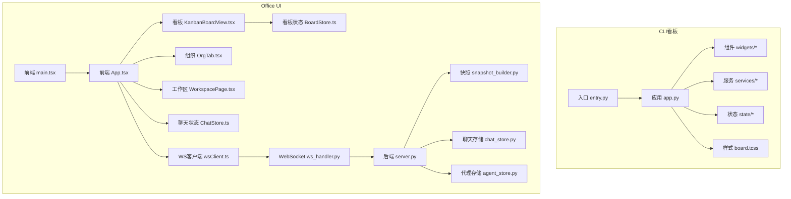
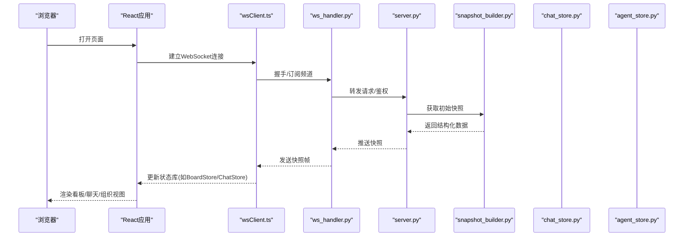
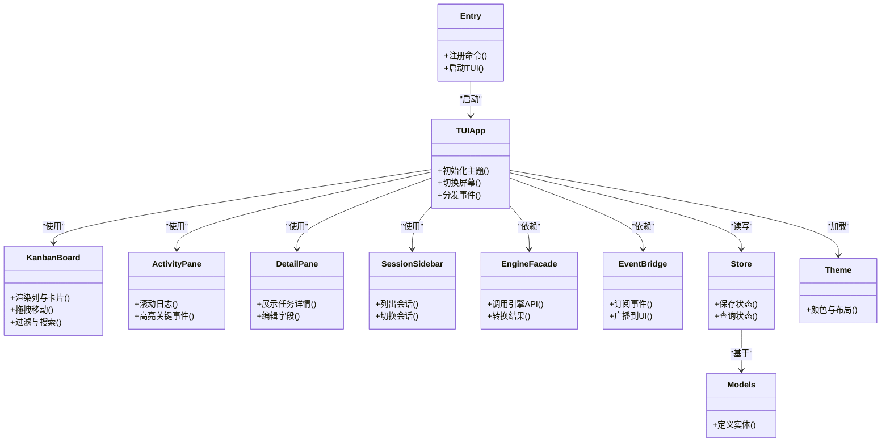
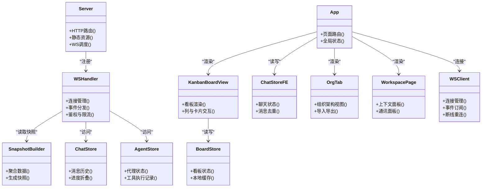
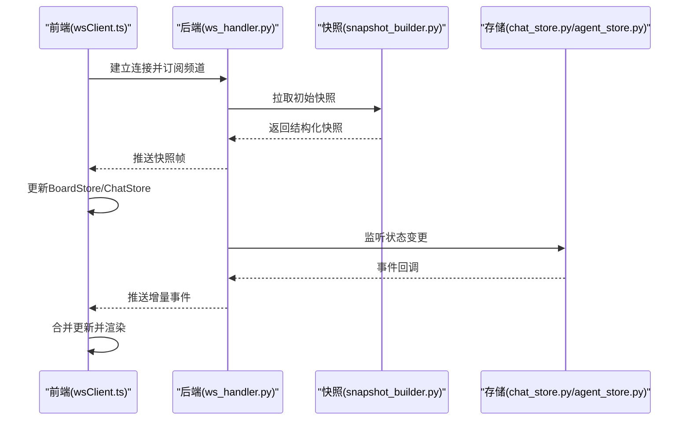
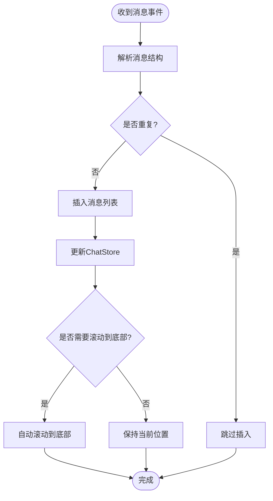
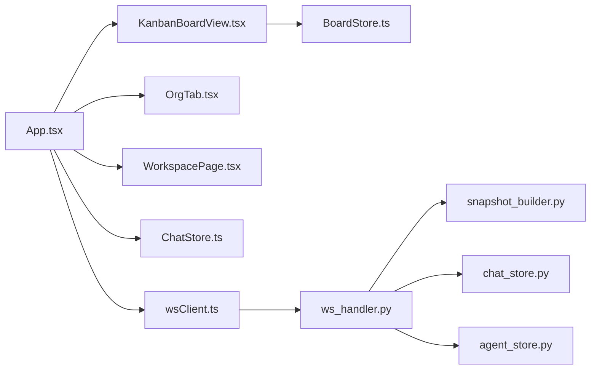

# 可视化监控界面

<cite>
**本文引用的文件**   
- [opc/plugins/cli_board/entry.py](file://opc/plugins/cli_board/entry.py)
- [opc/plugins/cli_board/tui/app.py](file://opc/plugins/cli_board/tui/app.py)
- [opc/plugins/cli_board/tui/board.tcss](file://opc/plugins/cli_board/tui/board.tcss)
- [opc/plugins/cli_board/widgets/kanban_board.py](file://opc/plugins/cli_board/widgets/kanban_board.py)
- [opc/plugins/cli_board/widgets/activity_pane.py](file://opc/plugins/cli_board/widgets/activity_pane.py)
- [opc/plugins/cli_board/widgets/detail_pane.py](file://opc/plugins/cli_board/widgets/detail_pane.py)
- [opc/plugins/cli_board/widgets/session_sidebar.py](file://opc/plugins/cli_board/widgets/session_sidebar.py)
- [opc/plugins/cli_board/services/engine_facade.py](file://opc/plugins/cli_board/services/engine_facade.py)
- [opc/plugins/cli_board/services/event_bridge.py](file://opc/plugins/cli_board/services/event_bridge.py)
- [opc/plugins/cli_board/state/store.py](file://opc/plugins/cli_board/state/store.py)
- [opc/plugins/cli_board/state/models.py](file://opc/plugins/cli_board/state/models.py)
- [opc/presentation/kanban.py](file://opc/presentation/kanban.py)
- [opc/plugins/office_ui/server.py](file://opc/plugins/office_ui/server.py)
- [opc/plugins/office_ui/ws_handler.py](file://opc/plugins/office_ui/ws_handler.py)
- [opc/plugins/office_ui/snapshot_builder.py](file://opc/plugins/office_ui/snapshot_builder.py)
- [opc/plugins/office_ui/chat_store.py](file://opc/plugins/office_ui/chat_store.py)
- [opc/plugins/office_ui/agent_store.py](file://opc/plugins/office_ui/agent_store.py)
- [opc/plugins/office_ui/frontend_src/main.tsx](file://opc/plugins/office_ui/frontend_src/main.tsx)
- [opc/plugins/office_ui/frontend_src/App.tsx](file://opc/plugins/office_ui/frontend_src/App.tsx)
- [opc/plugins/office_ui/frontend_src/kanban/KanbanBoardView.tsx](file://opc/plugins/office_ui/frontend_src/kanban/KanbanBoardView.tsx)
- [opc/plugins/office_ui/frontend_src/kanban/BoardStore.ts](file://opc/plugins/office_ui/frontend_src/kanban/BoardStore.ts)
- [opc/plugins/office_ui/frontend_src/chat/ChatStore.ts](file://opc/plugins/office_ui/frontend_src/chat/ChatStore.ts)
- [opc/plugins/office_ui/frontend_src/org/OrgTab.tsx](file://opc/plugins/office_ui/frontend_src/org/OrgTab.tsx)
- [opc/plugins/office_ui/frontend_src/lib/wsClient.ts](file://opc/plugins/office_ui/frontend_src/lib/wsClient.ts)
- [opc/plugins/office_ui/frontend_src/workspace/WorkspacePage.tsx](file://opc/plugins/office_ui/frontend_src/workspace/WorkspacePage.tsx)
</cite>

## 目录
1. [简介](#简介)
2. [项目结构](#项目结构)
3. [核心组件](#核心组件)
4. [架构总览](#架构总览)
5. [详细组件分析](#详细组件分析)
6. [依赖关系分析](#依赖关系分析)
7. [性能考虑](#性能考虑)
8. [故障排查指南](#故障排查指南)
9. [结论](#结论)
10. [附录](#附录)

## 简介
本文件面向OpenOPC的可视化监控界面系统，覆盖CLI看板与Web管理界面两大子系统。内容涵盖：
- CLI看板界面的功能特性、操作方式与配置项
- Web管理界面的架构设计、React组件结构与实时通信机制
- 看板视图、聊天界面、组织管理等核心功能的实现原理
- 界面定制与主题配置方法
- WebSocket实时数据同步、状态管理与错误处理
- 前端扩展与第三方集成建议
- 性能优化与用户体验改进方案

## 项目结构
可视化监控界面由两个主要插件组成：
- CLI看板插件：基于文本用户界面（TUI）提供轻量级看板、活动流、会话侧边栏等能力
- Office UI插件：提供Web管理界面，包含看板、聊天、组织管理、工作区等页面，并通过WebSocket与后端服务进行实时交互

图表来源
- [opc/plugins/cli_board/entry.py](file://opc/plugins/cli_board/entry.py)
- [opc/plugins/cli_board/tui/app.py](file://opc/plugins/cli_board/tui/app.py)
- [opc/plugins/cli_board/tui/board.tcss](file://opc/plugins/cli_board/tui/board.tcss)
- [opc/plugins/office_ui/server.py](file://opc/plugins/office_ui/server.py)
- [opc/plugins/office_ui/ws_handler.py](file://opc/plugins/office_ui/ws_handler.py)
- [opc/plugins/office_ui/snapshot_builder.py](file://opc/plugins/office_ui/snapshot_builder.py)
- [opc/plugins/office_ui/chat_store.py](file://opc/plugins/office_ui/chat_store.py)
- [opc/plugins/office_ui/agent_store.py](file://opc/plugins/office_ui/agent_store.py)
- [opc/plugins/office_ui/frontend_src/main.tsx](file://opc/plugins/office_ui/frontend_src/main.tsx)
- [opc/plugins/office_ui/frontend_src/App.tsx](file://opc/plugins/office_ui/frontend_src/App.tsx)
- [opc/plugins/office_ui/frontend_src/kanban/KanbanBoardView.tsx](file://opc/plugins/office_ui/frontend_src/kanban/KanbanBoardView.tsx)
- [opc/plugins/office_ui/frontend_src/kanban/BoardStore.ts](file://opc/plugins/office_ui/frontend_src/kanban/BoardStore.ts)
- [opc/plugins/office_ui/frontend_src/chat/ChatStore.ts](file://opc/plugins/office_ui/frontend_src/chat/ChatStore.ts)
- [opc/plugins/office_ui/frontend_src/org/OrgTab.tsx](file://opc/plugins/office_ui/frontend_src/org/OrgTab.tsx)
- [opc/plugins/office_ui/frontend_src/lib/wsClient.ts](file://opc/plugins/office_ui/frontend_src/lib/wsClient.ts)
- [opc/plugins/office_ui/frontend_src/workspace/WorkspacePage.tsx](file://opc/plugins/office_ui/frontend_src/workspace/WorkspacePage.tsx)

章节来源
- [opc/plugins/cli_board/entry.py](file://opc/plugins/cli_board/entry.py)
- [opc/plugins/cli_board/tui/app.py](file://opc/plugins/cli_board/tui/app.py)
- [opc/plugins/office_ui/server.py](file://opc/plugins/office_ui/server.py)
- [opc/plugins/office_ui/frontend_src/main.tsx](file://opc/plugins/office_ui/frontend_src/main.tsx)

## 核心组件
本节概述CLI看板与Office UI的关键模块及其职责。

- CLI看板
  - 入口与启动：负责注册命令、初始化TUI应用并加载主题
  - 应用层：管理屏幕切换、全局事件分发、键盘快捷键
  - 组件层：看板面板、活动流、详情面板、会话侧边栏等
  - 服务层：引擎门面、事件桥接、仓库与协调器
  - 状态层：模型定义与本地状态存储
  - 主题：TUI样式表用于颜色、布局与字体

- Office UI
  - 后端服务：HTTP路由、静态资源托管、WebSocket处理器
  - 快照构建：将运行时状态转换为前端可消费的JSON快照
  - 聊天与代理存储：维护消息历史、任务进度与代理状态
  - 前端应用：React主入口、路由与页面组合
  - 看板视图：看板卡片、列、执行面板与选择器
  - 聊天界面：消息列表、输入框、反馈与升级面板
  - 组织管理：架构图、角色与人才市场、导入导出
  - 工作区：上下文面板、通讯面板与任务详情
  - 实时通信：WebSocket客户端与服务端处理器

章节来源
- [opc/plugins/cli_board/tui/app.py](file://opc/plugins/cli_board/tui/app.py)
- [opc/plugins/cli_board/widgets/kanban_board.py](file://opc/plugins/cli_board/widgets/kanban_board.py)
- [opc/plugins/cli_board/widgets/activity_pane.py](file://opc/plugins/cli_board/widgets/activity_pane.py)
- [opc/plugins/cli_board/widgets/detail_pane.py](file://opc/plugins/cli_board/widgets/detail_pane.py)
- [opc/plugins/cli_board/widgets/session_sidebar.py](file://opc/plugins/cli_board/widgets/session_sidebar.py)
- [opc/plugins/cli_board/services/engine_facade.py](file://opc/plugins/cli_board/services/engine_facade.py)
- [opc/plugins/cli_board/services/event_bridge.py](file://opc/plugins/cli_board/services/event_bridge.py)
- [opc/plugins/cli_board/state/store.py](file://opc/plugins/cli_board/state/store.py)
- [opc/plugins/cli_board/state/models.py](file://opc/plugins/cli_board/state/models.py)
- [opc/plugins/office_ui/server.py](file://opc/plugins/office_ui/server.py)
- [opc/plugins/office_ui/ws_handler.py](file://opc/plugins/office_ui/ws_handler.py)
- [opc/plugins/office_ui/snapshot_builder.py](file://opc/plugins/office_ui/snapshot_builder.py)
- [opc/plugins/office_ui/chat_store.py](file://opc/plugins/office_ui/chat_store.py)
- [opc/plugins/office_ui/agent_store.py](file://opc/plugins/office_ui/agent_store.py)
- [opc/plugins/office_ui/frontend_src/App.tsx](file://opc/plugins/office_ui/frontend_src/App.tsx)
- [opc/plugins/office_ui/frontend_src/kanban/KanbanBoardView.tsx](file://opc/plugins/office_ui/frontend_src/kanban/KanbanBoardView.tsx)
- [opc/plugins/office_ui/frontend_src/kanban/BoardStore.ts](file://opc/plugins/office_ui/frontend_src/kanban/BoardStore.ts)
- [opc/plugins/office_ui/frontend_src/chat/ChatStore.ts](file://opc/plugins/office_ui/frontend_src/chat/ChatStore.ts)
- [opc/plugins/office_ui/frontend_src/org/OrgTab.tsx](file://opc/plugins/office_ui/frontend_src/org/OrgTab.tsx)
- [opc/plugins/office_ui/frontend_src/lib/wsClient.ts](file://opc/plugins/office_ui/frontend_src/lib/wsClient.ts)
- [opc/plugins/office_ui/frontend_src/workspace/WorkspacePage.tsx](file://opc/plugins/office_ui/frontend_src/workspace/WorkspacePage.tsx)

## 架构总览
整体架构分为前后端两层：
- 后端（Python）
  - Office UI服务器提供HTTP与WebSocket接口
  - 快照构建器聚合运行期数据，生成一致的视图模型
  - 聊天与代理存储维护持久化状态
- 前端（React + TypeScript）
  - 主应用按页面组织看板、聊天、组织与工作区
  - 各页面通过独立的状态库（如BoardStore、ChatStore）管理局部状态
  - WebSocket客户端统一连接后端，订阅事件并驱动UI更新

图表来源
- [opc/plugins/office_ui/server.py](file://opc/plugins/office_ui/server.py)
- [opc/plugins/office_ui/ws_handler.py](file://opc/plugins/office_ui/ws_handler.py)
- [opc/plugins/office_ui/snapshot_builder.py](file://opc/plugins/office_ui/snapshot_builder.py)
- [opc/plugins/office_ui/chat_store.py](file://opc/plugins/office_ui/chat_store.py)
- [opc/plugins/office_ui/agent_store.py](file://opc/plugins/office_ui/agent_store.py)
- [opc/plugins/office_ui/frontend_src/lib/wsClient.ts](file://opc/plugins/office_ui/frontend_src/lib/wsClient.ts)
- [opc/plugins/office_ui/frontend_src/App.tsx](file://opc/plugins/office_ui/frontend_src/App.tsx)

## 详细组件分析

### CLI看板组件分析
CLI看板采用分层结构：入口→应用→组件→服务→状态→主题。

图表来源
- [opc/plugins/cli_board/entry.py](file://opc/plugins/cli_board/entry.py)
- [opc/plugins/cli_board/tui/app.py](file://opc/plugins/cli_board/tui/app.py)
- [opc/plugins/cli_board/widgets/kanban_board.py](file://opc/plugins/cli_board/widgets/kanban_board.py)
- [opc/plugins/cli_board/widgets/activity_pane.py](file://opc/plugins/cli_board/widgets/activity_pane.py)
- [opc/plugins/cli_board/widgets/detail_pane.py](file://opc/plugins/cli_board/widgets/detail_pane.py)
- [opc/plugins/cli_board/widgets/session_sidebar.py](file://opc/plugins/cli_board/widgets/session_sidebar.py)
- [opc/plugins/cli_board/services/engine_facade.py](file://opc/plugins/cli_board/services/engine_facade.py)
- [opc/plugins/cli_board/services/event_bridge.py](file://opc/plugins/cli_board/services/event_bridge.py)
- [opc/plugins/cli_board/state/store.py](file://opc/plugins/cli_board/state/store.py)
- [opc/plugins/cli_board/state/models.py](file://opc/plugins/cli_board/state/models.py)
- [opc/plugins/cli_board/tui/board.tcss](file://opc/plugins/cli_board/tui/board.tcss)

章节来源
- [opc/plugins/cli_board/entry.py](file://opc/plugins/cli_board/entry.py)
- [opc/plugins/cli_board/tui/app.py](file://opc/plugins/cli_board/tui/app.py)
- [opc/plugins/cli_board/widgets/kanban_board.py](file://opc/plugins/cli_board/widgets/kanban_board.py)
- [opc/plugins/cli_board/widgets/activity_pane.py](file://opc/plugins/cli_board/widgets/activity_pane.py)
- [opc/plugins/cli_board/widgets/detail_pane.py](file://opc/plugins/cli_board/widgets/detail_pane.py)
- [opc/plugins/cli_board/widgets/session_sidebar.py](file://opc/plugins/cli_board/widgets/session_sidebar.py)
- [opc/plugins/cli_board/services/engine_facade.py](file://opc/plugins/cli_board/services/engine_facade.py)
- [opc/plugins/cli_board/services/event_bridge.py](file://opc/plugins/cli_board/services/event_bridge.py)
- [opc/plugins/cli_board/state/store.py](file://opc/plugins/cli_board/state/store.py)
- [opc/plugins/cli_board/state/models.py](file://opc/plugins/cli_board/state/models.py)
- [opc/plugins/cli_board/tui/board.tcss](file://opc/plugins/cli_board/tui/board.tcss)

#### CLI看板使用方法与配置要点
- 启动入口：通过命令行入口进入看板界面
- 主题配置：在主题文件中调整颜色、布局与字体以适配不同终端
- 组件交互：看板支持列内拖拽、筛选；活动流支持滚动与高亮；详情面板支持字段编辑；会话侧边栏支持快速切换
- 服务集成：通过引擎门面调用底层引擎能力，事件桥接将异步事件推送到UI
- 状态管理：本地状态存储负责持久化与查询，模型定义确保数据结构一致

章节来源
- [opc/plugins/cli_board/entry.py](file://opc/plugins/cli_board/entry.py)
- [opc/plugins/cli_board/tui/board.tcss](file://opc/plugins/cli_board/tui/board.tcss)
- [opc/plugins/cli_board/services/engine_facade.py](file://opc/plugins/cli_board/services/engine_facade.py)
- [opc/plugins/cli_board/services/event_bridge.py](file://opc/plugins/cli_board/services/event_bridge.py)
- [opc/plugins/cli_board/state/store.py](file://opc/plugins/cli_board/state/store.py)
- [opc/plugins/cli_board/state/models.py](file://opc/plugins/cli_board/state/models.py)

### Office UI组件分析
Office UI采用“后端服务+前端React”的双层架构，重点包括：
- 后端服务与WebSocket处理器
- 快照构建器与存储层
- 前端应用、看板、聊天、组织与工作区页面
- 实时通信客户端与状态库

图表来源
- [opc/plugins/office_ui/server.py](file://opc/plugins/office_ui/server.py)
- [opc/plugins/office_ui/ws_handler.py](file://opc/plugins/office_ui/ws_handler.py)
- [opc/plugins/office_ui/snapshot_builder.py](file://opc/plugins/office_ui/snapshot_builder.py)
- [opc/plugins/office_ui/chat_store.py](file://opc/plugins/office_ui/chat_store.py)
- [opc/plugins/office_ui/agent_store.py](file://opc/plugins/office_ui/agent_store.py)
- [opc/plugins/office_ui/frontend_src/App.tsx](file://opc/plugins/office_ui/frontend_src/App.tsx)
- [opc/plugins/office_ui/frontend_src/kanban/KanbanBoardView.tsx](file://opc/plugins/office_ui/frontend_src/kanban/KanbanBoardView.tsx)
- [opc/plugins/office_ui/frontend_src/kanban/BoardStore.ts](file://opc/plugins/office_ui/frontend_src/kanban/BoardStore.ts)
- [opc/plugins/office_ui/frontend_src/chat/ChatStore.ts](file://opc/plugins/office_ui/frontend_src/chat/ChatStore.ts)
- [opc/plugins/office_ui/frontend_src/org/OrgTab.tsx](file://opc/plugins/office_ui/frontend_src/org/OrgTab.tsx)
- [opc/plugins/office_ui/frontend_src/workspace/WorkspacePage.tsx](file://opc/plugins/office_ui/frontend_src/workspace/WorkspacePage.tsx)
- [opc/plugins/office_ui/frontend_src/lib/wsClient.ts](file://opc/plugins/office_ui/frontend_src/lib/wsClient.ts)

章节来源
- [opc/plugins/office_ui/server.py](file://opc/plugins/office_ui/server.py)
- [opc/plugins/office_ui/ws_handler.py](file://opc/plugins/office_ui/ws_handler.py)
- [opc/plugins/office_ui/snapshot_builder.py](file://opc/plugins/office_ui/snapshot_builder.py)
- [opc/plugins/office_ui/chat_store.py](file://opc/plugins/office_ui/chat_store.py)
- [opc/plugins/office_ui/agent_store.py](file://opc/plugins/office_ui/agent_store.py)
- [opc/plugins/office_ui/frontend_src/App.tsx](file://opc/plugins/office_ui/frontend_src/App.tsx)
- [opc/plugins/office_ui/frontend_src/kanban/KanbanBoardView.tsx](file://opc/plugins/office_ui/frontend_src/kanban/KanbanBoardView.tsx)
- [opc/plugins/office_ui/frontend_src/kanban/BoardStore.ts](file://opc/plugins/office_ui/frontend_src/kanban/BoardStore.ts)
- [opc/plugins/office_ui/frontend_src/chat/ChatStore.ts](file://opc/plugins/office_ui/frontend_src/chat/ChatStore.ts)
- [opc/plugins/office_ui/frontend_src/org/OrgTab.tsx](file://opc/plugins/office_ui/frontend_src/org/OrgTab.tsx)
- [opc/plugins/office_ui/frontend_src/workspace/WorkspacePage.tsx](file://opc/plugins/office_ui/frontend_src/workspace/WorkspacePage.tsx)
- [opc/plugins/office_ui/frontend_src/lib/wsClient.ts](file://opc/plugins/office_ui/frontend_src/lib/wsClient.ts)

#### 看板视图实现原理
- 数据源：后端快照构建器聚合运行期数据，形成统一的看板视图模型
- 前端状态：BoardStore维护列、卡片、过滤条件与排序策略
- 交互逻辑：拖拽移动、批量操作、筛选与搜索
- 实时更新：WebSocket推送增量变更，前端合并更新避免全量刷新

章节来源
- [opc/plugins/office_ui/snapshot_builder.py](file://opc/plugins/office_ui/snapshot_builder.py)
- [opc/plugins/office_ui/frontend_src/kanban/BoardStore.ts](file://opc/plugins/office_ui/frontend_src/kanban/BoardStore.ts)
- [opc/plugins/office_ui/frontend_src/kanban/KanbanBoardView.tsx](file://opc/plugins/office_ui/frontend_src/kanban/KanbanBoardView.tsx)

#### 聊天界面实现原理
- 消息历史：ChatStore维护消息列表、进度条目与折叠策略
- 输入与反馈：消息输入框、交付反馈面板、升级面板
- 实时同步：WebSocket推送新消息与进度，前端去重与滚动定位
- 身份与会话：会话标识与轮次标识保证消息归属正确

章节来源
- [opc/plugins/office_ui/chat_store.py](file://opc/plugins/office_ui/chat_store.py)
- [opc/plugins/office_ui/frontend_src/chat/ChatStore.ts](file://opc/plugins/office_ui/frontend_src/chat/ChatStore.ts)
- [opc/plugins/office_ui/frontend/src/lib/wsClient.ts](file://opc/plugins/office_ui/frontend_src/lib/wsClient.ts)

#### 组织管理实现原理
- 架构视图：组织结构图、角色与人才市场
- 配置管理：导入导出、版本切换、委托策略
- 数据一致性：快照构建器确保前后端视图一致

章节来源
- [opc/plugins/office_ui/snapshot_builder.py](file://opc/plugins/office_ui/snapshot_builder.py)
- [opc/plugins/office_ui/frontend_src/org/OrgTab.tsx](file://opc/plugins/office_ui/frontend_src/org/OrgTab.tsx)

#### 工作区实现原理
- 上下文面板：显示当前任务的上下文信息
- 通讯面板：跨通道协作与通知
- 任务详情：任务状态、依赖与执行记录

章节来源
- [opc/plugins/office_ui/frontend_src/workspace/WorkspacePage.tsx](file://opc/plugins/office_ui/frontend_src/workspace/WorkspacePage.tsx)

### 实时通信流程（WebSocket）

图表来源
- [opc/plugins/office_ui/ws_handler.py](file://opc/plugins/office_ui/ws_handler.py)
- [opc/plugins/office_ui/snapshot_builder.py](file://opc/plugins/office_ui/snapshot_builder.py)
- [opc/plugins/office_ui/chat_store.py](file://opc/plugins/office_ui/chat_store.py)
- [opc/plugins/office_ui/agent_store.py](file://opc/plugins/office_ui/agent_store.py)
- [opc/plugins/office_ui/frontend_src/lib/wsClient.ts](file://opc/plugins/office_ui/frontend_src/lib/wsClient.ts)

### 复杂逻辑流程图（示例：消息去重与滚动定位）

图表来源
- [opc/plugins/office_ui/frontend_src/chat/ChatStore.ts](file://opc/plugins/office_ui/frontend_src/chat/ChatStore.ts)
- [opc/plugins/office_ui/frontend_src/lib/wsClient.ts](file://opc/plugins/office_ui/frontend_src/lib/wsClient.ts)

## 依赖关系分析
- 组件耦合
  - CLI看板：应用层对组件与服务存在较强依赖，但通过事件桥接降低直接耦合
  - Office UI：前端页面通过状态库解耦UI与数据，WebSocket客户端统一接入后端
- 外部依赖
  - 后端快照构建器依赖运行期数据源
  - 前端依赖React生态与WebSocket标准协议
- 潜在循环依赖
  - 前端状态库应避免反向依赖UI组件，确保单向数据流
  - 后端服务应通过接口抽象避免与具体存储实现强耦合

图表来源
- [opc/plugins/office_ui/frontend_src/App.tsx](file://opc/plugins/office_ui/frontend_src/App.tsx)
- [opc/plugins/office_ui/frontend_src/kanban/KanbanBoardView.tsx](file://opc/plugins/office_ui/frontend_src/kanban/KanbanBoardView.tsx)
- [opc/plugins/office_ui/frontend_src/kanban/BoardStore.ts](file://opc/plugins/office_ui/frontend_src/kanban/BoardStore.ts)
- [opc/plugins/office_ui/frontend_src/chat/ChatStore.ts](file://opc/plugins/office_ui/frontend_src/chat/ChatStore.ts)
- [opc/plugins/office_ui/frontend_src/org/OrgTab.tsx](file://opc/plugins/office_ui/frontend_src/org/OrgTab.tsx)
- [opc/plugins/office_ui/frontend_src/workspace/WorkspacePage.tsx](file://opc/plugins/office_ui/frontend_src/workspace/WorkspacePage.tsx)
- [opc/plugins/office_ui/frontend_src/lib/wsClient.ts](file://opc/plugins/office_ui/frontend_src/lib/wsClient.ts)
- [opc/plugins/office_ui/ws_handler.py](file://opc/plugins/office_ui/ws_handler.py)
- [opc/plugins/office_ui/snapshot_builder.py](file://opc/plugins/office_ui/snapshot_builder.py)
- [opc/plugins/office_ui/chat_store.py](file://opc/plugins/office_ui/chat_store.py)
- [opc/plugins/office_ui/agent_store.py](file://opc/plugins/office_ui/agent_store.py)

章节来源
- [opc/plugins/office_ui/frontend_src/App.tsx](file://opc/plugins/office_ui/frontend_src/App.tsx)
- [opc/plugins/office_ui/ws_handler.py](file://opc/plugins/office_ui/ws_handler.py)
- [opc/plugins/office_ui/snapshot_builder.py](file://opc/plugins/office_ui/snapshot_builder.py)

## 性能考虑
- 前端渲染
  - 使用虚拟列表或分页加载减少DOM节点数量
  - 对大对象进行不可变更新与浅比较，避免不必要的重渲染
  - 合理拆分组件与懒加载页面，减小首屏体积
- 实时通信
  - 增量事件优先，避免频繁全量快照
  - 断线重连与退避策略，提升稳定性
  - 消息去重与批处理，降低CPU与内存占用
- 后端处理
  - 快照构建器按需聚合，避免全量扫描
  - 存储层索引与缓存热点数据
  - 限制并发连接与消息速率，防止过载

[本节为通用指导，不直接分析具体文件]

## 故障排查指南
- WebSocket连接问题
  - 检查服务端路由与鉴权逻辑
  - 确认客户端订阅频道是否正确
  - 查看断线重连与错误回调
- 快照不一致
  - 对比快照构建器的数据源与输出结构
  - 验证前后端字段映射与类型约束
- 聊天消息异常
  - 检查消息去重逻辑与滚动定位
  - 确认进度折叠与状态更新顺序
- CLI看板无响应
  - 检查事件桥接与引擎门面调用
  - 确认主题与组件初始化顺序

章节来源
- [opc/plugins/office_ui/ws_handler.py](file://opc/plugins/office_ui/ws_handler.py)
- [opc/plugins/office_ui/snapshot_builder.py](file://opc/plugins/office_ui/snapshot_builder.py)
- [opc/plugins/office_ui/chat_store.py](file://opc/plugins/office_ui/chat_store.py)
- [opc/plugins/office_ui/frontend_src/lib/wsClient.ts](file://opc/plugins/office_ui/frontend_src/lib/wsClient.ts)
- [opc/plugins/office_ui/frontend_src/chat/ChatStore.ts](file://opc/plugins/office_ui/frontend_src/chat/ChatStore.ts)
- [opc/plugins/cli_board/services/event_bridge.py](file://opc/plugins/cli_board/services/event_bridge.py)
- [opc/plugins/cli_board/services/engine_facade.py](file://opc/plugins/cli_board/services/engine_facade.py)

## 结论
OpenOPC的可视化监控界面通过CLI看板与Office UI双通道满足多场景需求。CLI看板适合轻量、终端友好的监控；Office UI提供丰富的Web管理能力与实时交互。通过清晰的架构分层、状态管理与实时通信机制，系统在可扩展性与用户体验方面具备良好基础。后续可在性能优化、错误恢复与主题定制方面持续改进。

[本节为总结性内容，不直接分析具体文件]

## 附录
- 界面定制与主题配置
  - CLI看板：修改主题文件以调整颜色、布局与字体
  - Office UI：通过CSS变量与组件样式进行主题扩展
- 前端开发扩展指南
  - 新增页面：在App中注册路由与组件
  - 新增状态库：遵循不可变更新与事件驱动模式
  - 新增WebSocket事件：在后端处理器与前端客户端同步扩展
- 第三方集成方法
  - 通过快照构建器暴露必要数据
  - 在WebSocket处理器中增加自定义事件通道
  - 在前端状态库中订阅并渲染第三方数据

[本节为概念性指导，不直接分析具体文件]