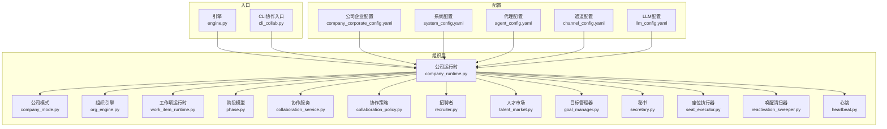
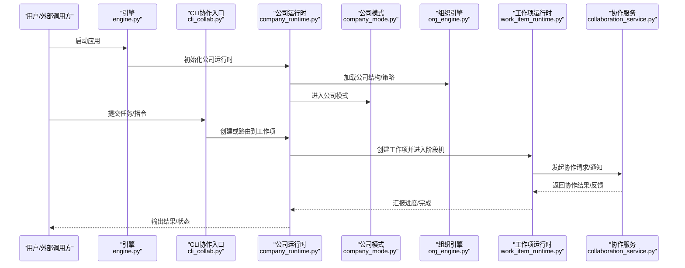
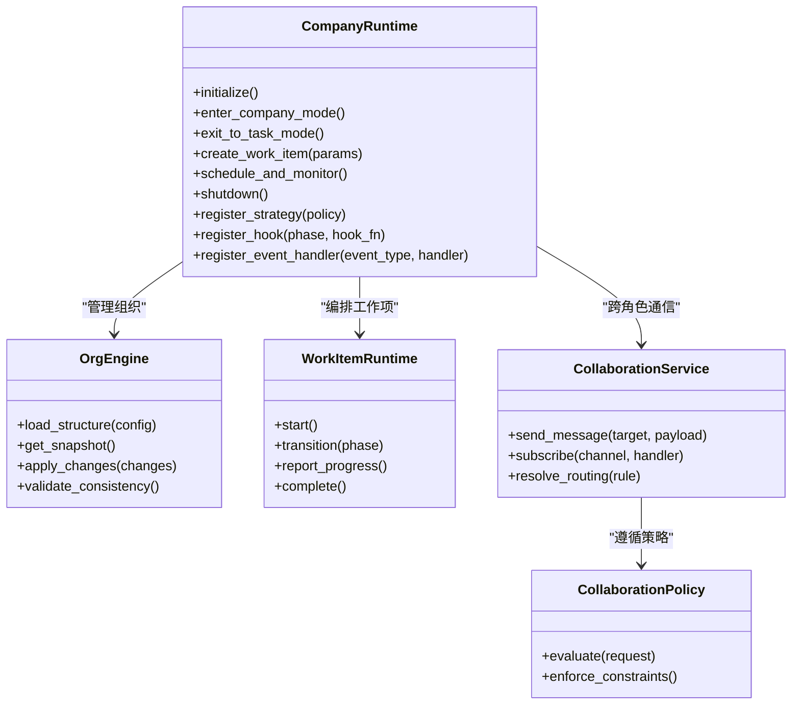
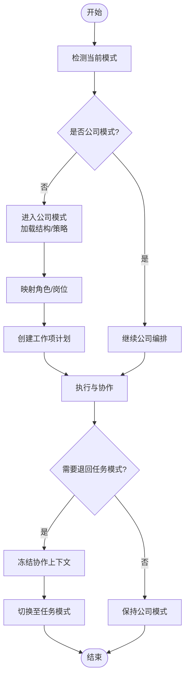
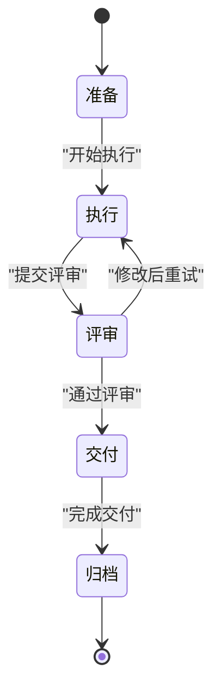
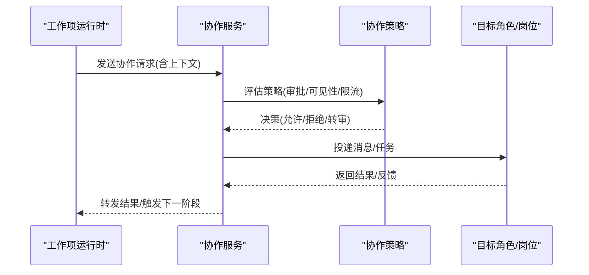
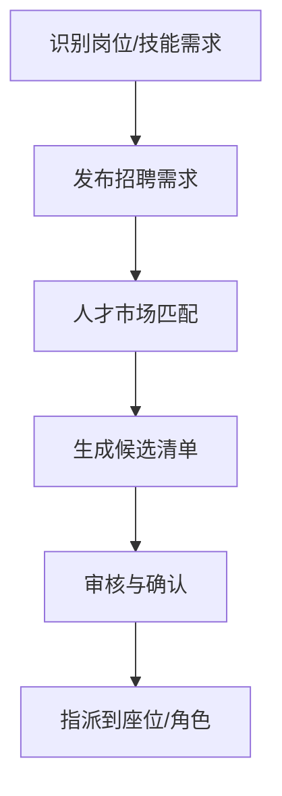
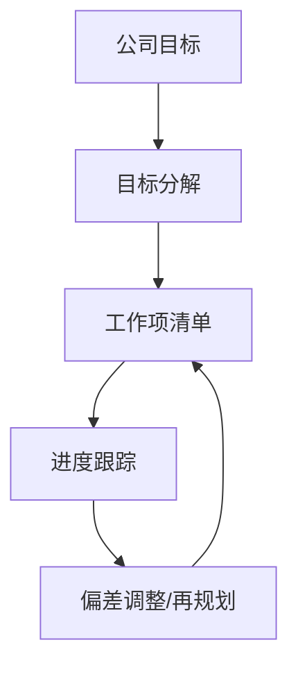
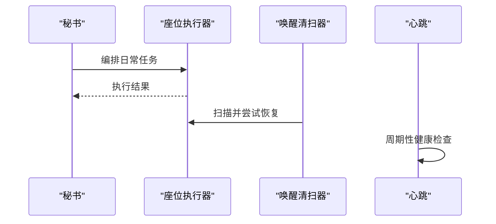
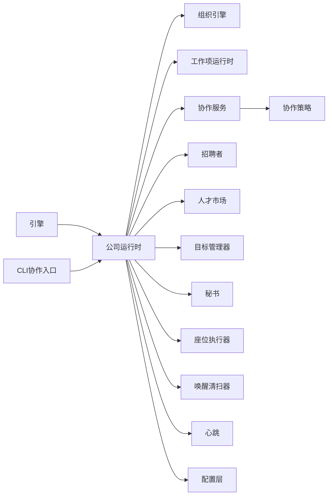

# 公司运行时

<cite>
**本文引用的文件**   
- [company_runtime.py](file://opc/layer2_organization/company_runtime.py)
- [company_mode.py](file://opc/layer2_organization/company_mode.py)
- [org_engine.py](file://opc/layer2_organization/org_engine.py)
- [work_item_runtime.py](file://opc/layer2_organization/work_item_runtime.py)
- [phase.py](file://opc/layer2_organization/phase.py)
- [collaboration_service.py](file://opc/layer2_organization/collaboration_service.py)
- [collaboration_policy.py](file://opc/layer2_organization/collaboration_policy.py)
- [recruiter.py](file://opc/layer2_organization/recruiter.py)
- [talent_market.py](file://opc/layer2_organization/talent_market.py)
- [goal_manager.py](file://opc/layer2_organization/goal_manager.py)
- [secretary.py](file://opc/layer2_organization/secretary.py)
- [seat_executor.py](file://opc/layer2_organization/seat_executor.py)
- [reactivation_sweeper.py](file://opc/layer2_organization/reactivation_sweeper.py)
- [heartbeat.py](file://opc/layer2_organization/heartbeat.py)
- [company_corporate_config.yaml](file://config/company_corporate_config.yaml)
- [system_config.yaml](file://config/system_config.yaml)
- [agent_config.yaml](file://config/agent_config.yaml)
- [channel_config.yaml](file://config/channel_config.yaml)
- [llm_config.yaml](file://config/llm_config.yaml)
- [engine.py](file://opc/engine.py)
- [cli_collab.py](file://opc/cli_collab.py)
- [test_company_runtime_suspend_resume.py](file://tests/test_company_runtime_suspend_resume.py)
- [test_company_org_config_alignment.py](file://tests/test_company_org_config_alignment.py)
- [test_custom_org_runtime_guard.py](file://tests/test_custom_org_runtime_guard.py)
</cite>

## 目录
1. [简介](#简介)
2. [项目结构](#项目结构)
3. [核心组件](#核心组件)
4. [架构总览](#架构总览)
5. [详细组件分析](#详细组件分析)
6. [依赖关系分析](#依赖关系分析)
7. [性能考虑](#性能考虑)
8. [故障排除指南](#故障排除指南)
9. [结论](#结论)
10. [附录](#附录)

## 简介
本文件面向OpenOPC的“公司运行时”（CompanyRuntime），系统性阐述其作为多智能体协作的核心协调器如何管理企业级工作流。内容覆盖：
- 公司运行时的初始化流程、生命周期管理与状态维护机制
- 公司模式（CompanyMode）与普通任务模式的差异与切换机制
- 公司结构定义、全局策略与协作规则的配置方法
- 扩展点与自定义能力（自定义策略、钩子函数、事件处理）
- 性能优化建议与常见问题排查

## 项目结构
公司运行时位于组织层（layer2_organization），围绕“公司”这一抽象实体，编排角色、岗位、工作项与协作流程，并与工具层、记忆层、可观测性层等协同工作。

图示来源
- [company_runtime.py](file://opc/layer2_organization/company_runtime.py)
- [company_mode.py](file://opc/layer2_organization/company_mode.py)
- [org_engine.py](file://opc/layer2_organization/org_engine.py)
- [work_item_runtime.py](file://opc/layer2_organization/work_item_runtime.py)
- [phase.py](file://opc/layer2_organization/phase.py)
- [collaboration_service.py](file://opc/layer2_organization/collaboration_service.py)
- [collaboration_policy.py](file://opc/layer2_organization/collaboration_policy.py)
- [recruiter.py](file://opc/layer2_organization/recruiter.py)
- [talent_market.py](file://opc/layer2_organization/talent_market.py)
- [goal_manager.py](file://opc/layer2_organization/goal_manager.py)
- [secretary.py](file://opc/layer2_organization/secretary.py)
- [seat_executor.py](file://opc/layer2_organization/seat_executor.py)
- [reactivation_sweeper.py](file://opc/layer2_organization/reactivation_sweeper.py)
- [heartbeat.py](file://opc/layer2_organization/heartbeat.py)
- [company_corporate_config.yaml](file://config/company_corporate_config.yaml)
- [system_config.yaml](file://config/system_config.yaml)
- [agent_config.yaml](file://config/agent_config.yaml)
- [channel_config.yaml](file://config/channel_config.yaml)
- [llm_config.yaml](file://config/llm_config.yaml)
- [engine.py](file://opc/engine.py)
- [cli_collab.py](file://opc/cli_collab.py)

章节来源
- [company_runtime.py](file://opc/layer2_organization/company_runtime.py)
- [company_mode.py](file://opc/layer2_organization/company_mode.py)
- [org_engine.py](file://opc/layer2_organization/org_engine.py)
- [work_item_runtime.py](file://opc/layer2_organization/work_item_runtime.py)
- [phase.py](file://opc/layer2_organization/phase.py)
- [collaboration_service.py](file://opc/layer2_organization/collaboration_service.py)
- [collaboration_policy.py](file://opc/layer2_organization/collaboration_policy.py)
- [recruiter.py](file://opc/layer2_organization/recruiter.py)
- [talent_market.py](file://opc/layer2_organization/talent_market.py)
- [goal_manager.py](file://opc/layer2_organization/goal_manager.py)
- [secretary.py](file://opc/layer2_organization/secretary.py)
- [seat_executor.py](file://opc/layer2_organization/seat_executor.py)
- [reactivation_sweeper.py](file://opc/layer2_organization/reactivation_sweeper.py)
- [heartbeat.py](file://opc/layer2_organization/heartbeat.py)
- [company_corporate_config.yaml](file://config/company_corporate_config.yaml)
- [system_config.yaml](file://config/system_config.yaml)
- [agent_config.yaml](file://config/agent_config.yaml)
- [channel_config.yaml](file://config/channel_config.yaml)
- [llm_config.yaml](file://config/llm_config.yaml)
- [engine.py](file://opc/engine.py)
- [cli_collab.py](file://opc/cli_collab.py)

## 核心组件
- 公司运行时（CompanyRuntime）：企业级工作流的总控中心，负责加载公司配置、启动组织引擎、调度工作项、协调角色与岗位、管理生命周期与状态、对接协作与资源。
- 公司模式（CompanyMode）：将普通任务上下文切换到“公司”视角，使任务在公司组织结构下被规划、委派与追踪。
- 组织引擎（OrgEngine）：承载公司结构与运行时状态，提供组织快照、变更与一致性校验。
- 工作项运行时（WorkItemRuntime）：单个工作项的执行环境，包含阶段机、上下文视图、身份与链接管理等。
- 阶段模型（Phase）：工作项的阶段状态机与转换钩子。
- 协作服务（CollaborationService）与协作策略（CollaborationPolicy）：跨角色通信、消息路由与协作约束。
- 招聘者（Recruiter）与人才市场（TalentMarket）：按需招募与匹配岗位/角色。
- 目标管理器（GoalManager）：目标分解、对齐与度量。
- 秘书（Secretary）：日常事务编排、提醒与汇总。
- 座位执行器（SeatExecutor）：在特定“座位”上执行操作，隔离权限与上下文。
- 唤醒清扫器（ReactivationSweeper）与心跳（Heartbeat）：后台巡检、恢复与保活。

章节来源
- [company_runtime.py](file://opc/layer2_organization/company_runtime.py)
- [company_mode.py](file://opc/layer2_organization/company_mode.py)
- [org_engine.py](file://opc/layer2_organization/org_engine.py)
- [work_item_runtime.py](file://opc/layer2_organization/work_item_runtime.py)
- [phase.py](file://opc/layer2_organization/phase.py)
- [collaboration_service.py](file://opc/layer2_organization/collaboration_service.py)
- [collaboration_policy.py](file://opc/layer2_organization/collaboration_policy.py)
- [recruiter.py](file://opc/layer2_organization/recruiter.py)
- [talent_market.py](file://opc/layer2_organization/talent_market.py)
- [goal_manager.py](file://opc/layer2_organization/goal_manager.py)
- [secretary.py](file://opc/layer2_organization/secretary.py)
- [seat_executor.py](file://opc/layer2_organization/seat_executor.py)
- [reactivation_sweeper.py](file://opc/layer2_organization/reactivation_sweeper.py)
- [heartbeat.py](file://opc/layer2_organization/heartbeat.py)

## 架构总览
公司运行时以“公司”为根节点，自上而下驱动组织构建、工作项编排与执行，并通过协作服务实现跨角色沟通。

图示来源
- [engine.py](file://opc/engine.py)
- [cli_collab.py](file://opc/cli_collab.py)
- [company_runtime.py](file://opc/layer2_organization/company_runtime.py)
- [company_mode.py](file://opc/layer2_organization/company_mode.py)
- [org_engine.py](file://opc/layer2_organization/org_engine.py)
- [work_item_runtime.py](file://opc/layer2_organization/work_item_runtime.py)
- [collaboration_service.py](file://opc/layer2_organization/collaboration_service.py)

## 详细组件分析

### 公司运行时（CompanyRuntime）
- 职责
  - 读取并合并公司与企业级配置（公司结构、策略、协作规则）。
  - 启动组织引擎，维护公司级状态（组织快照、版本、一致性）。
  - 管理工作项生命周期（创建、派发、推进、收尾）。
  - 协调角色/岗位、招聘与人才匹配。
  - 接入协作服务，确保跨角色通信与审计。
  - 暴露扩展点：自定义策略、钩子、事件处理器。
- 关键流程
  - 初始化：加载配置 -> 构建组织 -> 注册策略/钩子 -> 启动后台任务（心跳、清扫）。
  - 运行：接收输入 -> 解析意图 -> 选择模式（公司/任务）-> 编排工作项 -> 监控与回压。
  - 关闭：持久化状态 -> 停止后台任务 -> 释放资源。
- 状态维护
  - 使用组织引擎提供的快照与变更日志，保证可重放与一致性。
  - 通过阶段机与工作项运行时维护细粒度状态。
- 扩展点
  - 自定义协作策略（如审批阈值、路由规则）。
  - 自定义阶段钩子（进入/退出、失败重试、补偿）。
  - 自定义事件处理器（审计、告警、指标上报）。

图示来源
- [company_runtime.py](file://opc/layer2_organization/company_runtime.py)
- [org_engine.py](file://opc/layer2_organization/org_engine.py)
- [work_item_runtime.py](file://opc/layer2_organization/work_item_runtime.py)
- [collaboration_service.py](file://opc/layer2_organization/collaboration_service.py)
- [collaboration_policy.py](file://opc/layer2_organization/collaboration_policy.py)

章节来源
- [company_runtime.py](file://opc/layer2_organization/company_runtime.py)
- [org_engine.py](file://opc/layer2_organization/org_engine.py)
- [work_item_runtime.py](file://opc/layer2_organization/work_item_runtime.py)
- [collaboration_service.py](file://opc/layer2_organization/collaboration_service.py)
- [collaboration_policy.py](file://opc/layer2_organization/collaboration_policy.py)

### 公司模式（CompanyMode）与任务模式切换
- 差异
  - 公司模式：以公司结构为中心，自动进行角色分配、目标分解与协作编排；适合复杂、跨部门任务。
  - 任务模式：聚焦单一任务执行，轻量、直接；适合简单、独立的任务。
- 切换机制
  - 从任务模式进入公司模式：解析任务上下文，映射到公司结构中的合适角色/岗位，生成工作项计划。
  - 从公司模式退回任务模式：冻结当前协作上下文，保留审计与快照，降级为单任务执行。
- 典型流程

图示来源
- [company_mode.py](file://opc/layer2_organization/company_mode.py)
- [company_runtime.py](file://opc/layer2_organization/company_runtime.py)

章节来源
- [company_mode.py](file://opc/layer2_organization/company_mode.py)
- [company_runtime.py](file://opc/layer2_organization/company_runtime.py)

### 工作项与阶段机（WorkItemRuntime & Phase）
- 工作项运行时
  - 封装单个任务的执行环境，包括上下文视图、身份、链接、进度与产物。
  - 与协作服务交互，支持并行与串行编排。
- 阶段模型
  - 定义工作项的阶段状态机（如准备、执行、评审、交付、归档）。
  - 提供进入/退出钩子，用于审计、检查点、补偿与重试。
- 阶段转换流程

图示来源
- [work_item_runtime.py](file://opc/layer2_organization/work_item_runtime.py)
- [phase.py](file://opc/layer2_organization/phase.py)

章节来源
- [work_item_runtime.py](file://opc/layer2_organization/work_item_runtime.py)
- [phase.py](file://opc/layer2_organization/phase.py)

### 协作服务与协作策略（CollaborationService & CollaborationPolicy）
- 协作服务
  - 提供消息发送、订阅与路由能力，屏蔽底层通道细节。
  - 支持按角色/岗位/会话维度进行消息隔离与聚合。
- 协作策略
  - 定义协作约束（如审批门槛、可见性、速率限制）。
  - 在服务层对请求进行评估与强制执行。
- 协作序列

图示来源
- [collaboration_service.py](file://opc/layer2_organization/collaboration_service.py)
- [collaboration_policy.py](file://opc/layer2_organization/collaboration_policy.py)
- [work_item_runtime.py](file://opc/layer2_organization/work_item_runtime.py)

章节来源
- [collaboration_service.py](file://opc/layer2_organization/collaboration_service.py)
- [collaboration_policy.py](file://opc/layer2_organization/collaboration_policy.py)
- [work_item_runtime.py](file://opc/layer2_organization/work_item_runtime.py)

### 招聘者与人才市场（Recruiter & TalentMarket）
- 招聘者
  - 根据工作项需求动态发起招聘，生成候选列表。
  - 与目标/技能矩阵对齐，确保人岗匹配。
- 人才市场
  - 维护可用人才库与能力画像，提供查询与推荐。
- 招聘流程

图示来源
- [recruiter.py](file://opc/layer2_organization/recruiter.py)
- [talent_market.py](file://opc/layer2_organization/talent_market.py)

章节来源
- [recruiter.py](file://opc/layer2_organization/recruiter.py)
- [talent_market.py](file://opc/layer2_organization/talent_market.py)

### 目标管理器（GoalManager）
- 职责
  - 将公司目标分解为可执行的工作项，跟踪达成度与偏差。
  - 与招聘、协作、阶段机联动，确保目标落地。
- 目标流转

图示来源
- [goal_manager.py](file://opc/layer2_organization/goal_manager.py)

章节来源
- [goal_manager.py](file://opc/layer2_organization/goal_manager.py)

### 秘书（Secretary）、座位执行器（SeatExecutor）、后台任务（ReactivationSweeper & Heartbeat）
- 秘书
  - 日常事务编排、提醒、汇总与报告生成。
- 座位执行器
  - 在特定座位（角色/岗位实例）上执行操作，隔离权限与上下文。
- 后台任务
  - 唤醒清扫器：定期扫描停滞/过期工作项，尝试恢复或清理。
  - 心跳：保活与健康检查，上报状态。

图示来源
- [secretary.py](file://opc/layer2_organization/secretary.py)
- [seat_executor.py](file://opc/layer2_organization/seat_executor.py)
- [reactivation_sweeper.py](file://opc/layer2_organization/reactivation_sweeper.py)
- [heartbeat.py](file://opc/layer2_organization/heartbeat.py)

章节来源
- [secretary.py](file://opc/layer2_organization/secretary.py)
- [seat_executor.py](file://opc/layer2_organization/seat_executor.py)
- [reactivation_sweeper.py](file://opc/layer2_organization/reactivation_sweeper.py)
- [heartbeat.py](file://opc/layer2_organization/heartbeat.py)

## 依赖关系分析
- 内部依赖
  - 公司运行时依赖组织引擎、工作项运行时、协作服务与策略、招聘与人才市场、目标管理、秘书与后台任务。
  - 协作服务依赖协作策略进行约束评估。
- 外部依赖
  - 配置层：公司企业配置、系统配置、代理配置、通道配置、LLM配置。
  - 入口层：引擎与CLI协作入口。
- 潜在耦合点
  - 公司运行时与组织引擎之间的强耦合（结构与状态）。
  - 协作服务与策略的解耦设计，便于替换与扩展。

图示来源
- [company_runtime.py](file://opc/layer2_organization/company_runtime.py)
- [org_engine.py](file://opc/layer2_organization/org_engine.py)
- [work_item_runtime.py](file://opc/layer2_organization/work_item_runtime.py)
- [collaboration_service.py](file://opc/layer2_organization/collaboration_service.py)
- [collaboration_policy.py](file://opc/layer2_organization/collaboration_policy.py)
- [recruiter.py](file://opc/layer2_organization/recruiter.py)
- [talent_market.py](file://opc/layer2_organization/talent_market.py)
- [goal_manager.py](file://opc/layer2_organization/goal_manager.py)
- [secretary.py](file://opc/layer2_organization/secretary.py)
- [seat_executor.py](file://opc/layer2_organization/seat_executor.py)
- [reactivation_sweeper.py](file://opc/layer2_organization/reactivation_sweeper.py)
- [heartbeat.py](file://opc/layer2_organization/heartbeat.py)
- [engine.py](file://opc/engine.py)
- [cli_collab.py](file://opc/cli_collab.py)

章节来源
- [company_runtime.py](file://opc/layer2_organization/company_runtime.py)
- [org_engine.py](file://opc/layer2_organization/org_engine.py)
- [work_item_runtime.py](file://opc/layer2_organization/work_item_runtime.py)
- [collaboration_service.py](file://opc/layer2_organization/collaboration_service.py)
- [collaboration_policy.py](file://opc/layer2_organization/collaboration_policy.py)
- [recruiter.py](file://opc/layer2_organization/recruiter.py)
- [talent_market.py](file://opc/layer2_organization/talent_market.py)
- [goal_manager.py](file://opc/layer2_organization/goal_manager.py)
- [secretary.py](file://opc/layer2_organization/secretary.py)
- [seat_executor.py](file://opc/layer2_organization/seat_executor.py)
- [reactivation_sweeper.py](file://opc/layer2_organization/reactivation_sweeper.py)
- [heartbeat.py](file://opc/layer2_organization/heartbeat.py)
- [engine.py](file://opc/engine.py)
- [cli_collab.py](file://opc/cli_collab.py)

## 性能考虑
- 并发与隔离
  - 利用座位执行器隔离不同角色的执行上下文，避免共享状态竞争。
  - 合理设置工作项并行度，结合协作策略的限流控制。
- 批处理与压缩
  - 批量处理协作消息与进度更新，减少频繁I/O。
  - 对历史与上下文进行压缩与归档，降低内存占用。
- 缓存与索引
  - 对常用配置与人才画像建立缓存，提升匹配与路由效率。
- 异步与背压
  - 采用异步队列处理长耗时任务，配合背压防止过载。
- 监控与调优
  - 基于心跳与清扫器的指标，定位瓶颈与异常路径。

[本节为通用指导，不直接分析具体文件]

## 故障排除指南
- 常见症状
  - 工作项卡住或无法推进：检查阶段转换钩子与协作策略是否阻塞。
  - 协作消息丢失或重复：核对协作服务的路由规则与幂等处理。
  - 公司结构不一致：验证组织引擎的一致性校验与快照版本。
- 排查步骤
  - 查看工作项阶段与进度，定位失败阶段。
  - 审查协作策略评估结果，确认是否被拒绝或转审。
  - 检查后台任务（心跳、清扫器）是否正常，必要时手动触发恢复。
- 相关测试用例参考
  - 挂起与恢复：[test_company_runtime_suspend_resume.py](file://tests/test_company_runtime_suspend_resume.py)
  - 组织配置对齐：[test_company_org_config_alignment.py](file://tests/test_company_org_config_alignment.py)
  - 自定义运行时守卫：[test_custom_org_runtime_guard.py](file://tests/test_custom_org_runtime_guard.py)

章节来源
- [test_company_runtime_suspend_resume.py](file://tests/test_company_runtime_suspend_resume.py)
- [test_company_org_config_alignment.py](file://tests/test_company_org_config_alignment.py)
- [test_custom_org_runtime_guard.py](file://tests/test_custom_org_runtime_guard.py)

## 结论
公司运行时作为OpenOPC多智能体协作的核心协调器，通过公司模式统一编排组织、工作项与协作流程，提供了强大的可扩展性与可观测性。借助清晰的阶段机、策略与事件机制，企业可以在复杂业务场景下实现高效、可控的多智能体协作。

[本节为总结，不直接分析具体文件]

## 附录

### 配置示例与最佳实践
- 公司结构定义
  - 在公司企业配置中定义部门、岗位、角色与权限边界，明确汇报关系与协作范围。
  - 参考：[company_corporate_config.yaml](file://config/company_corporate_config.yaml)
- 全局策略
  - 在系统配置中设定默认协作策略、审批阈值、可见性与限流规则。
  - 参考：[system_config.yaml](file://config/system_config.yaml)
- 代理与通道
  - 在代理配置中声明可用的智能体与能力；在通道配置中启用所需的消息通道。
  - 参考：[agent_config.yaml](file://config/agent_config.yaml)、[channel_config.yaml](file://config/channel_config.yaml)
- LLM集成
  - 在LLM配置中指定提供商、模型与重试策略，确保稳定性与成本可控。
  - 参考：[llm_config.yaml](file://config/llm_config.yaml)

章节来源
- [company_corporate_config.yaml](file://config/company_corporate_config.yaml)
- [system_config.yaml](file://config/system_config.yaml)
- [agent_config.yaml](file://config/agent_config.yaml)
- [channel_config.yaml](file://config/channel_config.yaml)
- [llm_config.yaml](file://config/llm_config.yaml)

### 扩展点与自定义能力
- 自定义协作策略
  - 实现策略接口并在公司运行时注册，覆盖默认审批与路由逻辑。
  - 参考：[collaboration_policy.py](file://opc/layer2_organization/collaboration_policy.py)
- 自定义阶段钩子
  - 在工作项阶段进入/退出时插入审计、检查点或补偿逻辑。
  - 参考：[phase.py](file://opc/layer2_organization/phase.py)
- 自定义事件处理器
  - 监听公司运行时事件，实现告警、指标上报与外部系统集成。
  - 参考：[company_runtime.py](file://opc/layer2_organization/company_runtime.py)

章节来源
- [collaboration_policy.py](file://opc/layer2_organization/collaboration_policy.py)
- [phase.py](file://opc/layer2_organization/phase.py)
- [company_runtime.py](file://opc/layer2_organization/company_runtime.py)