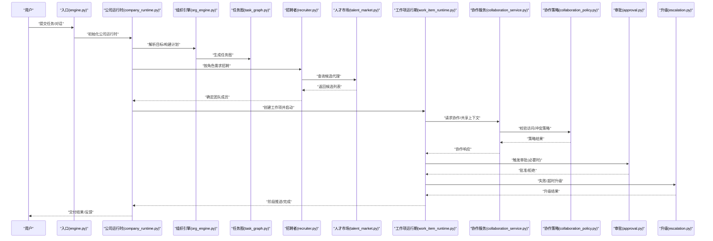
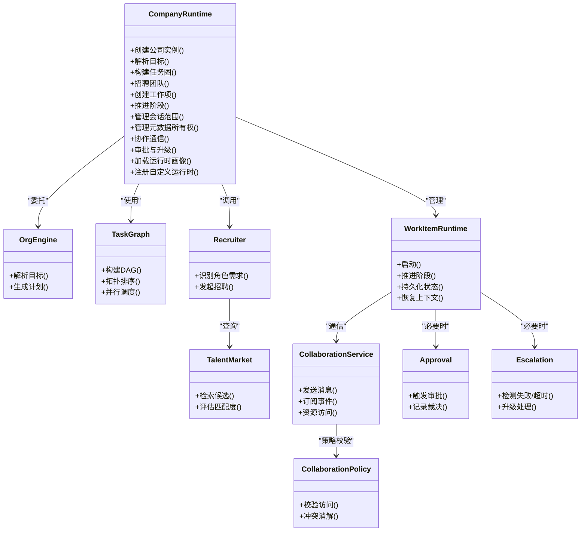
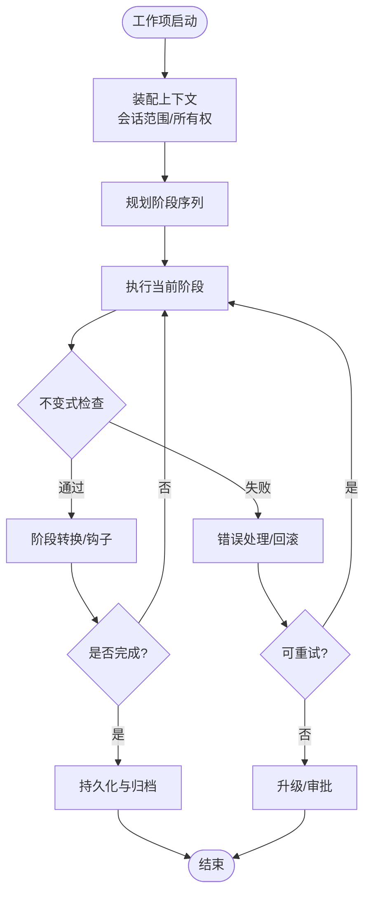
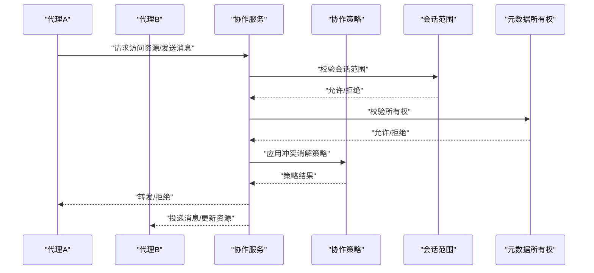
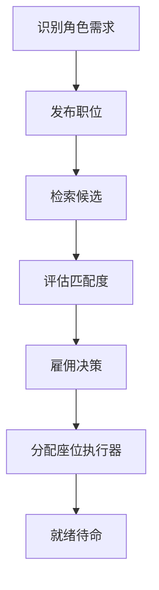
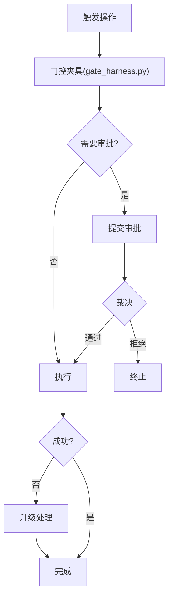
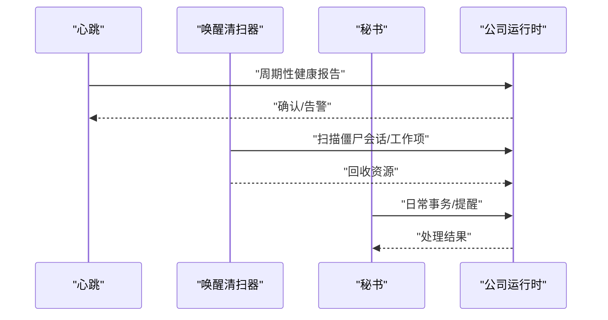
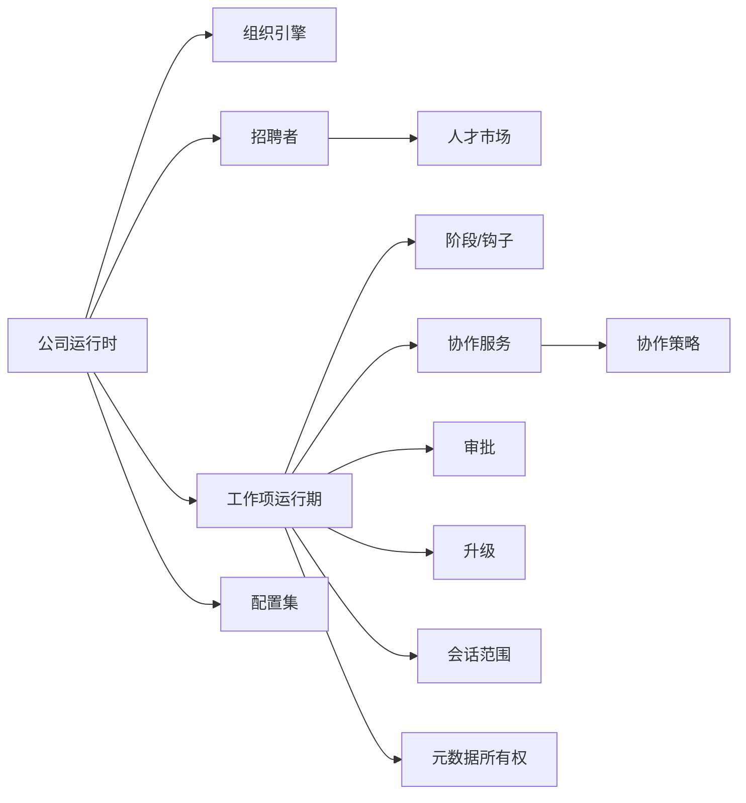

# 多智能体协作

<cite>
**本文引用的文件**   
- [company_runtime.py](file://opc/layer2_organization/company_runtime.py)
- [collaboration_service.py](file://opc/layer2_organization/collaboration_service.py)
- [collaboration_policy.py](file://opc/layer2_organization/collaboration_policy.py)
- [org_engine.py](file://opc/layer2_organization/org_engine.py)
- [work_item_runtime.py](file://opc/layer2_organization/work_item_runtime.py)
- [task_graph.py](file://opc/layer2_organization/task_graph.py)
- [recruiter.py](file://opc/layer2_organization/recruiter.py)
- [talent_market.py](file://opc/layer2_organization/talent_market.py)
- [approval.py](file://opc/layer2_organization/approval.py)
- [escalation.py](file://opc/layer2_organization/escalation.py)
- [heartbeat.py](file://opc/layer2_organization/heartbeat.py)
- [reactivation_sweeper.py](file://opc/layer2_organization/reactivation_sweeper.py)
- [seat_executor.py](file://opc/layer2_organization/seat_executor.py)
- [secretary.py](file://opc/layer2_organization/secretary.py)
- [phase.py](file://opc/layer2_organization/phase.py)
- [phase_hooks.py](file://opc/layer2_organization/phase_hooks.py)
- [turn_mode.py](file://opc/layer2_organization/turn_mode.py)
- [session_scoping.py](file://opc/layer2_organization/session_scoping.py)
- [metadata_ownership.py](file://opc/layer2_organization/metadata_ownership.py)
- [output_contract.py](file://opl/layer2_organization/output_contract.py)
- [prompt_contract.py](file://opc/layer2_organization/prompt_contract.py)
- [work_item_context_view.py](file://opc/layer2_organization/work_item_context_view.py)
- [work_item_identity.py](file://opc/layer2_organization/work_item_identity.py)
- [work_item_links.py](file://opc/layer2_organization/work_item_links.py)
- [work_item_transition.py](file://opc/layer2_organization/work_item_transition.py)
- [work_item_runtime_invariants.py](file://opc/layer2_organization/work_item_runtime_invariants.py)
- [gate_harness.py](file://opc/layer2_organization/gate_harness.py)
- [goal_manager.py](file://opc/layer2_organization/goal_manager.py)
- [data_acquisition_policy.py](file://opc/layer2_organization/data_acquisition_policy.py)
- [comms.py](file://opc/layer2_organization/comms.py)
- [communication.py](file://opc/layer2_organization/communication.py)
- [company_mode.py](file://opc/layer2_organization/company_mode.py)
- [custom_runtime.py](file://opc/layer2_organization/custom_runtime.py)
- [company_runtime_profiles.py](file://opc/layer2_organization/company_runtime_profiles.py)
- [company_runtime_identity.py](file://opc/layer2_organization/company_runtime_identity.py)
- [agent_config.yaml](file://config/agent_config.yaml)
- [channel_config.yaml](file://config/channel_config.yaml)
- [company_corporate_config.yaml](file://config/company_corporate_config.yaml)
- [llm_config.yaml](file://config/llm_config.yaml)
- [system_config.yaml](file://config/system_config.yaml)
- [SKILL.md](file://opc/skills_assets/opc_collab/SKILL.md)
- [engine.py](file://opc/engine.py)
- [cli_collab.py](file://opc/cli_collab.py)
</cite>

## 目录
1. [简介](#简介)
2. [项目结构](#项目结构)
3. [核心组件](#核心组件)
4. [架构总览](#架构总览)
5. [详细组件分析](#详细组件分析)
6. [依赖关系分析](#依赖关系分析)
7. [性能考虑](#性能考虑)
8. [故障排查指南](#故障排查指南)
9. [结论](#结论)
10. [附录](#附录)

## 简介
本文件面向OpenOPC的多智能体协作系统，系统性阐述公司运行时（CompanyRuntime）如何协调多个AI代理完成复杂任务。文档覆盖工作项分配、角色管理、权限控制、智能体生命周期、状态同步与通信机制，并提供配置示例、使用场景、协作策略、冲突解决与异常处理建议，以及性能优化与最佳实践。

## 项目结构
OpenOPC采用分层组织：
- 组织与协作层（layer2_organization）：公司运行时、工作项运行期、任务图、招聘与市场、审批与升级、阶段与钩子、会话范围等。
- 工具与执行层（layer4_tools）：协作RPC、调度、执行上下文、输出预算等。
- 记忆与能力层（layer5_memory）：技能库、偏好、历史压缩等。
- 可观测性（layer6_observability）：成本追踪、日志。
- 配置（config）：Agent、通道、LLM、公司企业级配置等。
- 技能资产（skills_assets）：协作相关技能说明。
- 入口与CLI（engine.py, cli_collab.py）。

```mermaid
graph TB
subgraph "组织与协作层"
CR["公司运行时<br/>company_runtime.py"]
ORG["组织引擎<br/>org_engine.py"]
WIR["工作项运行期<br/>work_item_runtime.py"]
TG["任务图<br/>task_graph.py"]
REC["招聘者<br/>recruiter.py"]
TM["人才市场<br/>talent_market.py"]
APPR["审批<br/>approval.py"]
ESC["升级<br/>escalation.py"]
HB["心跳<br/>heartbeat.py"]
RS["唤醒清扫器<br/>reactivation_sweeper.py"]
SEAT["座位执行器<br/>seat_executor.py"]
SEC["秘书<br/>secretary.py"]
PH["阶段<br/>phase.py"]
PHH["阶段钩子<br/>phase_hooks.py"]
TMODE["回合模式<br/>turn_mode.py"]
SCOPE["会话范围<br/>session_scoping.py"]
OWN["元数据所有权<br/>metadata_ownership.py"]
OUTC["输出契约<br/>output_contract.py"]
PROMC["提示契约<br/>prompt_contract.py"]
WICV["工作项上下文视图<br/>work_item_context_view.py"]
WIID["工作项标识<br/>work_item_identity.py"]
WILK["工作项链接<br/>work_item_links.py"]
WITR["工作项转换<br/>work_item_transition.py"]
WINV["工作项不变式<br/>work_item_runtime_invariants.py"]
GATE["门控夹具<br/>gate_harness.py"]
GOAL["目标管理<br/>goal_manager.py"]
CAP["数据采集策略<br/>data_acquisition_policy.py"]
COMMS["通信抽象<br/>comms.py"]
COMM["通信实现<br/>communication.py"]
CMODE["公司模式<br/>company_mode.py"]
CRT["自定义运行时<br/>custom_runtime.py"]
CRP["运行时画像<br/>company_runtime_profiles.py"]
CRI["运行时身份<br/>company_runtime_identity.py"]
end
subgraph "工具与执行层"
COLLAB["协作服务<br/>collaboration_service.py"]
COLPOL["协作策略<br/>collaboration_policy.py"]
end
subgraph "配置"
AC["agent_config.yaml"]
CC["channel_config.yaml"]
CCC["company_corporate_config.yaml"]
LLM["llm_config.yaml"]
SYS["system_config.yaml"]
end
subgraph "入口"
ENG["engine.py"]
CLI["cli_collab.py"]
end
ENG --> CR
CLI --> CR
CR --> ORG
CR --> WIR
CR --> TG
CR --> REC
CR --> TM
CR --> APPR
CR --> ESC
CR --> HB
CR --> RS
CR --> SEAT
CR --> SEC
CR --> PH
CR --> PHH
CR --> TMODE
CR --> SCOPE
CR --> OWN
CR --> OUTC
CR --> PROMC
CR --> WICV
CR --> WIID
CR --> WILK
CR --> WITR
CR --> WINV
CR --> GATE
CR --> GOAL
CR --> CAP
CR --> COMMS
CR --> COMM
CR --> CMODE
CR --> CRT
CR --> CRP
CR --> CRI
CR --> COLLAB
CR --> COLPOL
CR --> AC
CR --> CC
CR --> CCC
CR --> LLM
CR --> SYS
```

图表来源
- [company_runtime.py:1-200](file://opc/layer2_organization/company_runtime.py#L1-L200)
- [org_engine.py:1-200](file://opc/layer2_organization/org_engine.py#L1-L200)
- [work_item_runtime.py:1-200](file://opc/layer2_organization/work_item_runtime.py#L1-L200)
- [collaboration_service.py:1-200](file://opc/layer2_organization/collaboration_service.py#L1-L200)
- [collaboration_policy.py:1-200](file://opc/layer2_organization/collaboration_policy.py#L1-L200)
- [engine.py:1-200](file://opc/engine.py#L1-L200)
- [cli_collab.py:1-200](file://opc/cli_collab.py#L1-L200)

章节来源
- [company_runtime.py:1-200](file://opc/layer2_organization/company_runtime.py#L1-L200)
- [org_engine.py:1-200](file://opc/layer2_organization/org_engine.py#L1-L200)
- [work_item_runtime.py:1-200](file://opc/layer2_organization/work_item_runtime.py#L1-L200)
- [collaboration_service.py:1-200](file://opc/layer2_organization/collaboration_service.py#L1-L200)
- [collaboration_policy.py:1-200](file://opc/layer2_organization/collaboration_policy.py#L1-L200)
- [engine.py:1-200](file://opc/engine.py#L1-L200)
- [cli_collab.py:1-200](file://opc/cli_collab.py#L1-L200)

## 核心组件
- 公司运行时（CompanyRuntime）：作为编排中枢，负责创建/维护工作项、分派角色、驱动阶段流转、协调审批与升级、管理会话与上下文、对接外部通道与工具。
- 工作项运行期（WorkItemRuntime）：封装单个任务的执行上下文、状态机、持久化与恢复、变更不可变性与链接管理。
- 任务图（TaskGraph）：将复杂目标分解为有向无环的任务节点，支持并行与依赖解析。
- 招聘者与人才市场（Recruiter/TalentMarket）：基于角色需求匹配与雇佣决策，动态组建团队。
- 审批与升级（Approval/Escalation）：对高风险或跨边界操作进行人工或策略审批；失败或超时自动升级。
- 阶段与钩子（Phase/PhaseHooks）：定义工作项的阶段模型与生命周期钩子，确保一致的状态推进。
- 协作服务与策略（CollaborationService/CollaborationPolicy）：提供跨代理的通信、资源访问与冲突消解策略。
- 会话范围与元数据所有权（SessionScoping/MetadataOwnership）：限定上下文可见性与产出归属，避免越权与污染。
- 输出与提示契约（OutputContract/PromptContract）：约束工具调用与提示组装，保障稳定性与可观测性。
- 心跳与唤醒清扫（Heartbeat/ReactivationSweeper）：监控健康度并回收僵尸会话与工作项。
- 座位执行器与秘书（SeatExecutor/Secretary）：承载具体执行动作与日常事务协调。

章节来源
- [company_runtime.py:1-200](file://opc/layer2_organization/company_runtime.py#L1-L200)
- [work_item_runtime.py:1-200](file://opc/layer2_organization/work_item_runtime.py#L1-L200)
- [task_graph.py:1-200](file://opc/layer2_organization/task_graph.py#L1-L200)
- [recruiter.py:1-200](file://opc/layer2_organization/recruiter.py#L1-L200)
- [talent_market.py:1-200](file://opc/layer2_organization/talent_market.py#L1-L200)
- [approval.py:1-200](file://opc/layer2_organization/approval.py#L1-L200)
- [escalation.py:1-200](file://opc/layer2_organization/escalation.py#L1-L200)
- [phase.py:1-200](file://opc/layer2_organization/phase.py#L1-L200)
- [phase_hooks.py:1-200](file://opc/layer2_organization/phase_hooks.py#L1-L200)
- [collaboration_service.py:1-200](file://opc/layer2_organization/collaboration_service.py#L1-L200)
- [collaboration_policy.py:1-200](file://opc/layer2_organization/collaboration_policy.py#L1-L200)
- [session_scoping.py:1-200](file://opc/layer2_organization/session_scoping.py#L1-L200)
- [metadata_ownership.py:1-200](file://opc/layer2_organization/metadata_ownership.py#L1-L200)
- [output_contract.py:1-200](file://opl/layer2_organization/output_contract.py#L1-L200)
- [prompt_contract.py:1-200](file://opc/layer2_organization/prompt_contract.py#L1-L200)
- [heartbeat.py:1-200](file://opc/layer2_organization/heartbeat.py#L1-L200)
- [reactivation_sweeper.py:1-200](file://opc/layer2_organization/reactivation_sweeper.py#L1-L200)
- [seat_executor.py:1-200](file://opc/layer2_organization/seat_executor.py#L1-L200)
- [secretary.py:1-200](file://opc/layer2_organization/secretary.py#L1-L200)

## 架构总览
公司运行时通过“工作项—角色—会话”三元组组织协作。用户输入经入口进入后，由组织引擎解析目标并构建任务图；招聘者根据角色需求从人才市场挑选合适代理；工作项运行期在阶段模型下推进执行，并通过协作服务与策略进行跨代理通信与资源协调；审批与升级保证关键路径安全；心跳与清扫维持系统健康。

图表来源
- [engine.py:1-200](file://opc/engine.py#L1-L200)
- [company_runtime.py:1-200](file://opc/layer2_organization/company_runtime.py#L1-L200)
- [org_engine.py:1-200](file://opc/layer2_organization/org_engine.py#L1-L200)
- [task_graph.py:1-200](file://opc/layer2_organization/task_graph.py#L1-L200)
- [recruiter.py:1-200](file://opc/layer2_organization/recruiter.py#L1-L200)
- [talent_market.py:1-200](file://opc/layer2_organization/talent_market.py#L1-L200)
- [work_item_runtime.py:1-200](file://opc/layer2_organization/work_item_runtime.py#L1-L200)
- [collaboration_service.py:1-200](file://opc/layer2_organization/collaboration_service.py#L1-L200)
- [collaboration_policy.py:1-200](file://opc/layer2_organization/collaboration_policy.py#L1-L200)
- [approval.py:1-200](file://opc/layer2_organization/approval.py#L1-L200)
- [escalation.py:1-200](file://opc/layer2_organization/escalation.py#L1-L200)

## 详细组件分析

### 公司运行时（CompanyRuntime）
- 职责：统一编排工作项生命周期、角色与团队管理、会话与上下文绑定、与外部通道和工具的集成点。
- 关键流程：
  - 接收高层目标，委托组织引擎生成计划与任务图。
  - 依据角色需求发起招聘，结合人才市场选择代理。
  - 创建工作项并驱动阶段推进，协调审批与升级。
  - 管理会话范围与元数据所有权，确保隔离与可见性。
  - 通过协作服务与策略进行跨代理通信与资源访问控制。
- 配置与画像：
  - 读取公司企业级配置与运行时画像，决定默认策略、权限模型与行为开关。
  - 支持自定义运行时扩展以适配特定业务约束。

图表来源
- [company_runtime.py:1-200](file://opc/layer2_organization/company_runtime.py#L1-L200)
- [org_engine.py:1-200](file://opc/layer2_organization/org_engine.py#L1-L200)
- [task_graph.py:1-200](file://opc/layer2_organization/task_graph.py#L1-L200)
- [recruiter.py:1-200](file://opc/layer2_organization/recruiter.py#L1-L200)
- [talent_market.py:1-200](file://opc/layer2_organization/talent_market.py#L1-L200)
- [work_item_runtime.py:1-200](file://opc/layer2_organization/work_item_runtime.py#L1-L200)
- [collaboration_service.py:1-200](file://opc/layer2_organization/collaboration_service.py#L1-L200)
- [collaboration_policy.py:1-200](file://opc/layer2_organization/collaboration_policy.py#L1-L200)
- [approval.py:1-200](file://opc/layer2_organization/approval.py#L1-L200)
- [escalation.py:1-200](file://opc/layer2_organization/escalation.py#L1-L200)

章节来源
- [company_runtime.py:1-200](file://opc/layer2_organization/company_runtime.py#L1-L200)
- [company_runtime_profiles.py:1-200](file://opc/layer2_organization/company_runtime_profiles.py#L1-L200)
- [company_runtime_identity.py:1-200](file://opc/layer2_organization/company_runtime_identity.py#L1-L200)
- [custom_runtime.py:1-200](file://opc/layer2_organization/custom_runtime.py#L1-L200)

### 工作项运行期与阶段模型
- 工作项运行期：
  - 负责单个工作项的状态机、上下文装配、持久化与恢复、链接与版本管理。
  - 通过不变式检查确保状态一致性，防止非法转换。
- 阶段与钩子：
  - 定义阶段序列与转换条件，钩子在阶段前后注入逻辑（如审计、通知、清理）。
- 上下文视图与标识：
  - 提供只读上下文视图与稳定标识，便于UI展示与调试。

图表来源
- [work_item_runtime.py:1-200](file://opc/layer2_organization/work_item_runtime.py#L1-L200)
- [phase.py:1-200](file://opc/layer2_organization/phase.py#L1-L200)
- [phase_hooks.py:1-200](file://opc/layer2_organization/phase_hooks.py#L1-L200)
- [work_item_context_view.py:1-200](file://opc/layer2_organization/work_item_context_view.py#L1-L200)
- [work_item_identity.py:1-200](file://opc/layer2_organization/work_item_identity.py#L1-L200)
- [work_item_links.py:1-200](file://opc/layer2_organization/work_item_links.py#L1-L200)
- [work_item_transition.py:1-200](file://opc/layer2_organization/work_item_transition.py#L1-L200)
- [work_item_runtime_invariants.py:1-200](file://opc/layer2_organization/work_item_runtime_invariants.py#L1-L200)

章节来源
- [work_item_runtime.py:1-200](file://opc/layer2_organization/work_item_runtime.py#L1-L200)
- [phase.py:1-200](file://opc/layer2_organization/phase.py#L1-L200)
- [phase_hooks.py:1-200](file://opc/layer2_organization/phase_hooks.py#L1-L200)
- [work_item_context_view.py:1-200](file://opc/layer2_organization/work_item_context_view.py#L1-L200)
- [work_item_identity.py:1-200](file://opc/layer2_organization/work_item_identity.py#L1-L200)
- [work_item_links.py:1-200](file://opc/layer2_organization/work_item_links.py#L1-L200)
- [work_item_transition.py:1-200](file://opc/layer2_organization/work_item_transition.py#L1-L200)
- [work_item_runtime_invariants.py:1-200](file://opc/layer2_organization/work_item_runtime_invariants.py#L1-L200)

### 团队协作与通信
- 协作服务：
  - 提供跨代理的消息传递、事件订阅与资源访问接口。
  - 与协作策略配合，实施访问控制与冲突消解。
- 通信抽象与实现：
  - comms与communication模块定义协议与传输细节，屏蔽底层差异。
- 会话范围与元数据所有权：
  - 限制上下文可见性，明确产出归属，避免越权与数据污染。

图表来源
- [collaboration_service.py:1-200](file://opc/layer2_organization/collaboration_service.py#L1-L200)
- [collaboration_policy.py:1-200](file://opc/layer2_organization/collaboration_policy.py#L1-L200)
- [comms.py:1-200](file://opc/layer2_organization/comms.py#L1-L200)
- [communication.py:1-200](file://opc/layer2_organization/communication.py#L1-L200)
- [session_scoping.py:1-200](file://opc/layer2_organization/session_scoping.py#L1-L200)
- [metadata_ownership.py:1-200](file://opc/layer2_organization/metadata_ownership.py#L1-L200)

章节来源
- [collaboration_service.py:1-200](file://opc/layer2_organization/collaboration_service.py#L1-L200)
- [collaboration_policy.py:1-200](file://opc/layer2_organization/collaboration_policy.py#L1-L200)
- [comms.py:1-200](file://opc/layer2_organization/comms.py#L1-L200)
- [communication.py:1-200](file://opc/layer2_organization/communication.py#L1-L200)
- [session_scoping.py:1-200](file://opc/layer2_organization/session_scoping.py#L1-L200)
- [metadata_ownership.py:1-200](file://opc/layer2_organization/metadata_ownership.py#L1-L200)

### 招聘与人才市场
- 招聘者：
  - 根据工作项角色需求发起招聘，收集候选并评估匹配度。
- 人才市场：
  - 维护可用代理池，提供检索、评分与推荐能力。
- 座位执行器：
  - 承载代理的具体执行位点，支持热插拔与隔离。

图表来源
- [recruiter.py:1-200](file://opc/layer2_organization/recruiter.py#L1-L200)
- [talent_market.py:1-200](file://opc/layer2_organization/talent_market.py#L1-L200)
- [seat_executor.py:1-200](file://opc/layer2_organization/seat_executor.py#L1-L200)

章节来源
- [recruiter.py:1-200](file://opc/layer2_organization/recruiter.py#L1-L200)
- [talent_market.py:1-200](file://opc/layer2_organization/talent_market.py#L1-L200)
- [seat_executor.py:1-200](file://opc/layer2_organization/seat_executor.py#L1-L200)

### 审批与升级
- 审批：
  - 对高风险或跨边界操作进行前置审批，记录裁决与审计信息。
- 升级：
  - 当执行失败或超时，自动升级至更高级别或人工介入。

图表来源
- [approval.py:1-200](file://opc/layer2_organization/approval.py#L1-L200)
- [escalation.py:1-200](file://opc/layer2_organization/escalation.py#L1-L200)
- [gate_harness.py:1-200](file://opc/layer2_organization/gate_harness.py#L1-L200)

章节来源
- [approval.py:1-200](file://opc/layer2_organization/approval.py#L1-L200)
- [escalation.py:1-200](file://opc/layer2_organization/escalation.py#L1-L200)
- [gate_harness.py:1-200](file://opc/layer2_organization/gate_harness.py#L1-L200)

### 健康监控与恢复
- 心跳：
  - 定期上报健康状态，检测长时间无响应的代理与工作项。
- 唤醒清扫器：
  - 扫描并回收僵尸会话与工作项，释放资源。
- 秘书：
  - 处理日常事务与提醒，辅助运维与排障。

图表来源
- [heartbeat.py:1-200](file://opc/layer2_organization/heartbeat.py#L1-L200)
- [reactivation_sweeper.py:1-200](file://opc/layer2_organization/reactivation_sweeper.py#L1-L200)
- [secretary.py:1-200](file://opc/layer2_organization/secretary.py#L1-L200)
- [company_runtime.py:1-200](file://opc/layer2_organization/company_runtime.py#L1-L200)

章节来源
- [heartbeat.py:1-200](file://opc/layer2_organization/heartbeat.py#L1-L200)
- [reactivation_sweeper.py:1-200](file://opc/layer2_organization/reactivation_sweeper.py#L1-L200)
- [secretary.py:1-200](file://opc/layer2_organization/secretary.py#L1-L200)
- [company_runtime.py:1-200](file://opc/layer2_organization/company_runtime.py#L1-L200)

### 配置与使用场景
- 配置文件：
  - agent_config.yaml：定义代理能力、工具与行为开关。
  - channel_config.yaml：配置外部通道（聊天、邮件等）接入参数。
  - company_corporate_config.yaml：公司级策略、权限模型与默认协作规则。
  - llm_config.yaml：大模型提供商、上下文窗口与重试策略。
  - system_config.yaml：系统级参数（并发、超时、存储等）。
- 使用场景：
  - 定义角色：在公司企业级配置中声明角色能力与权限边界。
  - 创建工作项：通过CLI或API提交任务，系统自动生成任务图并招聘团队。
  - 管理团队：调整人才市场策略与座位执行器配置，动态扩容或缩容。
- 技能资产：
  - opc_collab/SKILL.md：描述协作技能的用法与约束，指导代理正确调用协作工具。

章节来源
- [agent_config.yaml:1-200](file://config/agent_config.yaml#L1-L200)
- [channel_config.yaml:1-200](file://config/channel_config.yaml#L1-L200)
- [company_corporate_config.yaml:1-200](file://config/company_corporate_config.yaml#L1-L200)
- [llm_config.yaml:1-200](file://config/llm_config.yaml#L1-L200)
- [system_config.yaml:1-200](file://config/system_config.yaml#L1-L200)
- [SKILL.md:1-200](file://opc/skills_assets/opc_collab/SKILL.md#L1-L200)

## 依赖关系分析
- 组件耦合：
  - 公司运行时高度聚合，依赖组织引擎、工作项运行期、招聘与市场、审批与升级、协作服务与策略、会话范围与所有权等。
  - 工作项运行期与阶段模型强耦合，确保状态机与钩子的协同。
  - 协作服务与策略松耦合，策略可替换以适应不同业务场景。
- 外部依赖：
  - 通道配置与LLM配置影响通信与大模型调用行为。
  - 技能资产影响代理的工具调用与输出格式。

图表来源
- [company_runtime.py:1-200](file://opc/layer2_organization/company_runtime.py#L1-L200)
- [org_engine.py:1-200](file://opc/layer2_organization/org_engine.py#L1-L200)
- [work_item_runtime.py:1-200](file://opc/layer2_organization/work_item_runtime.py#L1-L200)
- [recruiter.py:1-200](file://opc/layer2_organization/recruiter.py#L1-L200)
- [talent_market.py:1-200](file://opc/layer2_organization/talent_market.py#L1-L200)
- [phase.py:1-200](file://opc/layer2_organization/phase.py#L1-L200)
- [phase_hooks.py:1-200](file://opc/layer2_organization/phase_hooks.py#L1-L200)
- [collaboration_service.py:1-200](file://opc/layer2_organization/collaboration_service.py#L1-L200)
- [collaboration_policy.py:1-200](file://opc/layer2_organization/collaboration_policy.py#L1-L200)
- [approval.py:1-200](file://opc/layer2_organization/approval.py#L1-L200)
- [escalation.py:1-200](file://opc/layer2_organization/escalation.py#L1-L200)
- [session_scoping.py:1-200](file://opc/layer2_organization/session_scoping.py#L1-L200)
- [metadata_ownership.py:1-200](file://opc/layer2_organization/metadata_ownership.py#L1-L200)

章节来源
- [company_runtime.py:1-200](file://opc/layer2_organization/company_runtime.py#L1-L200)
- [org_engine.py:1-200](file://opc/layer2_organization/org_engine.py#L1-L200)
- [work_item_runtime.py:1-200](file://opc/layer2_organization/work_item_runtime.py#L1-L200)
- [collaboration_service.py:1-200](file://opc/layer2_organization/collaboration_service.py#L1-L200)
- [collaboration_policy.py:1-200](file://opc/layer2_organization/collaboration_policy.py#L1-L200)

## 性能考虑
- 并行与批处理：
  - 利用任务图的并行调度，合理拆分任务粒度，减少串行瓶颈。
- 上下文压缩与缓存：
  - 通过会话范围与上下文视图限制数据传输量，避免冗余复制。
- 资源隔离与限流：
  - 座位执行器隔离执行环境，结合输出预算与重试策略控制成本。
- 健康与自愈：
  - 心跳与唤醒清扫及时回收资源，降低内存泄漏与僵尸进程风险。
- 策略可替换：
  - 协作策略可按需切换，平衡安全性与吞吐。

[本节为通用指导，不直接分析具体文件]

## 故障排查指南
- 常见症状：
  - 工作项卡住：检查阶段转换与不变式检查，确认是否存在死锁或非法状态。
  - 协作失败：查看协作策略与访问控制，确认会话范围与所有权是否正确。
  - 审批阻塞：审查审批裁决与审计日志，确认是否需要人工干预。
  - 升级频繁：分析失败原因与超时阈值，调整重试与升级策略。
- 定位方法：
  - 使用工作项上下文视图与标识进行快照对比。
  - 借助秘书与心跳报告获取健康状态与最近活动。
  - 检查门控夹具与审批记录，确认关键路径是否被阻断。

章节来源
- [work_item_context_view.py:1-200](file://opc/layer2_organization/work_item_context_view.py#L1-L200)
- [work_item_identity.py:1-200](file://opc/layer2_organization/work_item_identity.py#L1-L200)
- [heartbeat.py:1-200](file://opc/layer2_organization/heartbeat.py#L1-L200)
- [secretary.py:1-200](file://opc/layer2_organization/secretary.py#L1-L200)
- [gate_harness.py:1-200](file://opc/layer2_organization/gate_harness.py#L1-L200)
- [approval.py:1-200](file://opc/layer2_organization/approval.py#L1-L200)
- [escalation.py:1-200](file://opc/layer2_organization/escalation.py#L1-L200)

## 结论
OpenOPC的多智能体协作系统以公司运行为核心，围绕工作项、角色与会话构建稳定的协作框架。通过任务图分解目标、招聘与人才市场组建团队、阶段模型推进执行、协作服务与策略保障通信与安全、审批与升级控制风险、心跳与清扫维持健康，形成一套可扩展、可观测、可治理的企业级AI协作平台。

[本节为总结，不直接分析具体文件]

## 附录
- 快速上手：
  - 通过CLI或API提交任务，系统自动完成招聘、创建工作项与推进执行。
  - 在公司企业级配置中定义角色与权限，结合技能资产规范工具调用。
- 最佳实践：
  - 明确会话范围与元数据所有权，避免越权与污染。
  - 合理设置审批与升级阈值，平衡效率与风险控制。
  - 持续监控心跳与清扫指标，保持系统健康。

[本节为补充说明，不直接分析具体文件]