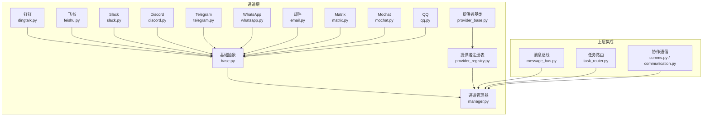
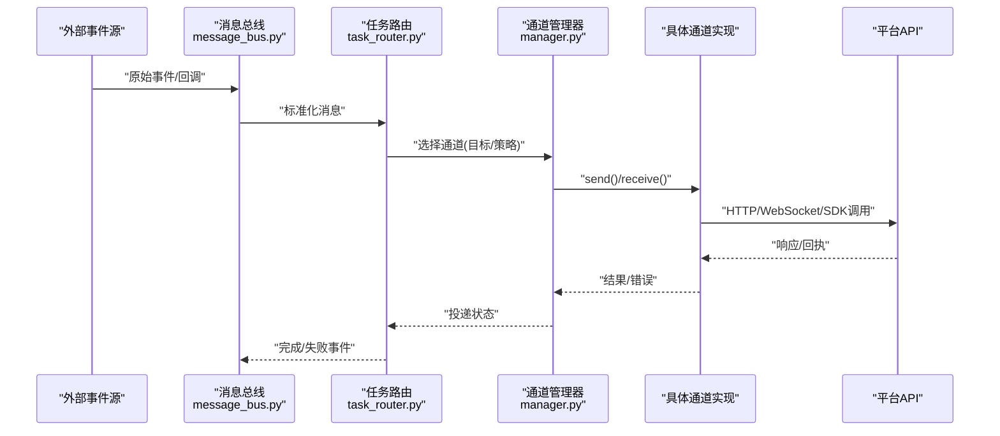
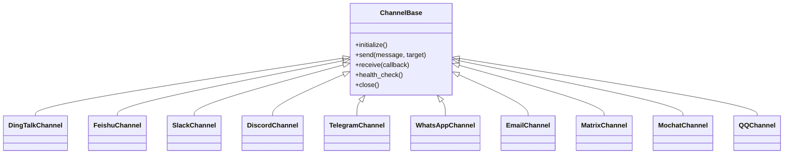
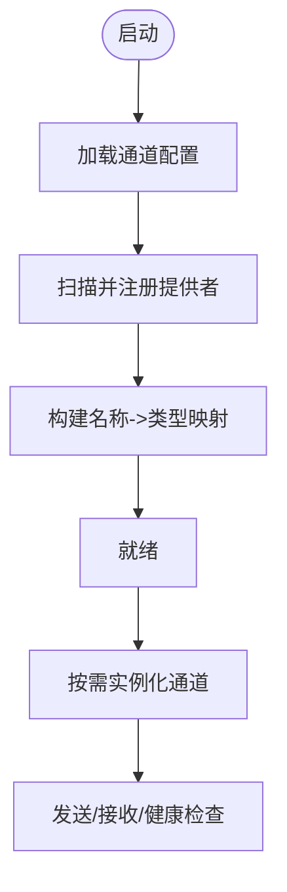
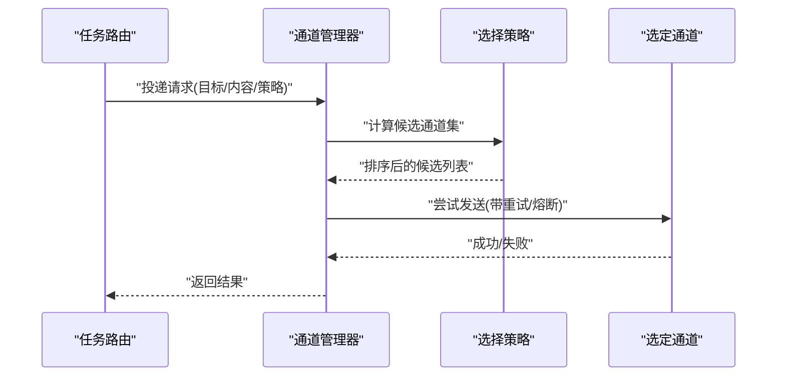
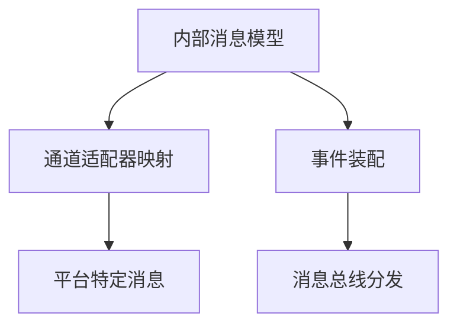
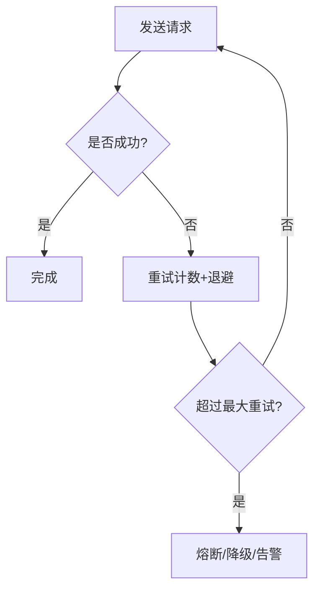
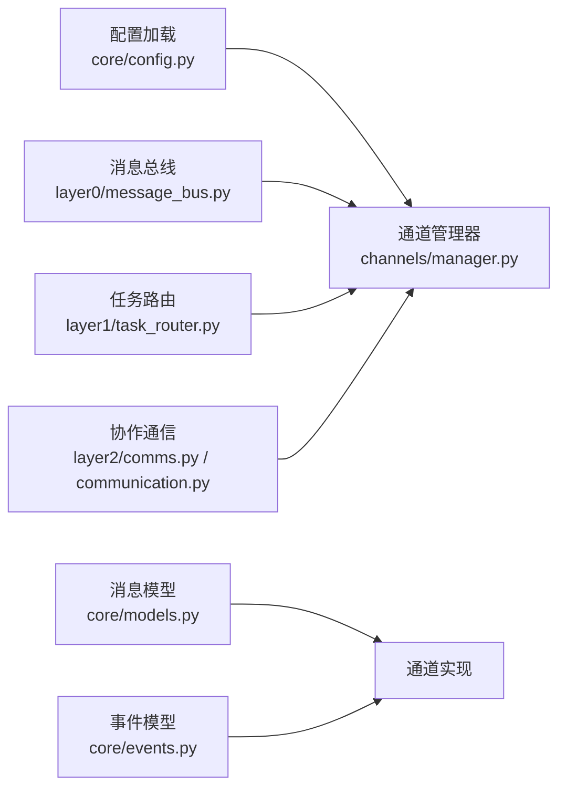

# 多渠道通信集成

<cite>
**本文引用的文件**   
- [opc/channels/base.py](file://opc/channels/base.py)
- [opc/channels/manager.py](file://opc/channels/manager.py)
- [opc/channels/provider_base.py](file://opc/channels/provider_base.py)
- [opc/channels/provider_registry.py](file://opc/channels/provider_registry.py)
- [opc/channels/dingtalk.py](file://opc/channels/dingtalk.py)
- [opc/channels/feishu.py](file://opc/channels/feishu.py)
- [opc/channels/slack.py](file://opc/channels/slack.py)
- [opc/channels/discord.py](file://opc/channels/discord.py)
- [opc/channels/telegram.py](file://opc/channels/telegram.py)
- [opc/channels/whatsapp.py](file://opc/channels/whatsapp.py)
- [opc/channels/email.py](file://opc/channels/email.py)
- [opc/channels/matrix.py](file://opc/channels/matrix.py)
- [opc/channels/mochat.py](file://opc/channels/mochat.py)
- [opc/channels/qq.py](file://opc/channels/qq.py)
- [config/channel_config.yaml](file://config/channel_config.yaml)
- [opc/core/config.py](file://opc/core/config.py)
- [opc/core/events.py](file://opc/core/events.py)
- [opc/core/models.py](file://opc/core/models.py)
- [opc/layer0_interaction/message_bus.py](file://opc/layer0_interaction/message_bus.py)
- [opc/layer1_perception/task_router.py](file://opc/layer1_perception/task_router.py)
- [opc/layer2_organization/comms.py](file://opc/layer2_organization/comms.py)
- [opc/layer2_organization/communication.py](file://opc/layer2_organization/communication.py)
- [opc/llm/retry.py](file://opc/llm/retry.py)
- [tests/test_channel_contracts.py](file://tests/test_channel_contracts.py)
- [tests/test_channels.py](file://tests/test_channels.py)
- [tests/test_channel_runtime_integration.py](file://tests/test_channel_runtime_integration.py)
</cite>

## 目录
1. [简介](#简介)
2. [项目结构](#项目结构)
3. [核心组件](#核心组件)
4. [架构总览](#架构总览)
5. [详细组件分析](#详细组件分析)
6. [依赖分析](#依赖分析)
7. [性能考虑](#性能考虑)
8. [故障排除指南](#故障排除指南)
9. [结论](#结论)
10. [附录](#附录)

## 简介
本文件面向OpenOPC的多渠道通信集成系统，系统性阐述通道架构设计、消息路由机制与适配器模式实现；覆盖内置支持的通信平台（钉钉、飞书、Slack、Discord、Telegram、WhatsApp等）的配置与使用；解释消息格式转换、事件处理与错误重试机制；提供自定义通道开发完整指南（接口规范、认证方式、测试方法）；说明通道管理器的注册机制与动态加载能力；并给出部署配置示例与故障排除建议。

## 项目结构
多渠道通信子系统位于 opc/channels 目录，采用“基础抽象 + 具体通道实现 + 管理器 + 提供者注册”的分层组织方式：
- 基础抽象：定义统一通道接口与通用行为
- 具体通道：各平台适配实现（如钉钉、飞书、Slack等）
- 管理器：负责通道的生命周期、选择与调度
- 提供者注册：基于命名空间的动态发现与实例化
- 配置与模型：集中式配置加载与消息模型定义
- 上层集成：消息总线、任务路由、协作通信模块对接

图表来源
- [opc/channels/base.py](file://opc/channels/base.py)
- [opc/channels/manager.py](file://opc/channels/manager.py)
- [opc/channels/provider_base.py](file://opc/channels/provider_base.py)
- [opc/channels/provider_registry.py](file://opc/channels/provider_registry.py)
- [opc/channels/dingtalk.py](file://opc/channels/dingtalk.py)
- [opc/channels/feishu.py](file://opc/channels/feishu.py)
- [opc/channels/slack.py](file://opc/channels/slack.py)
- [opc/channels/discord.py](file://opc/channels/discord.py)
- [opc/channels/telegram.py](file://opc/channels/telegram.py)
- [opc/channels/whatsapp.py](file://opc/channels/whatsapp.py)
- [opc/channels/email.py](file://opc/channels/email.py)
- [opc/channels/matrix.py](file://opc/channels/matrix.py)
- [opc/channels/mochat.py](file://opc/channels/mochat.py)
- [opc/channels/qq.py](file://opc/channels/qq.py)
- [opc/layer0_interaction/message_bus.py](file://opc/layer0_interaction/message_bus.py)
- [opc/layer1_perception/task_router.py](file://opc/layer1_perception/task_router.py)
- [opc/layer2_organization/comms.py](file://opc/layer2_organization/comms.py)
- [opc/layer2_organization/communication.py](file://opc/layer2_organization/communication.py)

章节来源
- [opc/channels/base.py](file://opc/channels/base.py)
- [opc/channels/manager.py](file://opc/channels/manager.py)
- [opc/channels/provider_registry.py](file://opc/channels/provider_registry.py)
- [config/channel_config.yaml](file://config/channel_config.yaml)
- [opc/core/config.py](file://opc/core/config.py)
- [opc/layer0_interaction/message_bus.py](file://opc/layer0_interaction/message_bus.py)
- [opc/layer1_perception/task_router.py](file://opc/layer1_perception/task_router.py)
- [opc/layer2_organization/comms.py](file://opc/layer2_organization/comms.py)
- [opc/layer2_organization/communication.py](file://opc/layer2_organization/communication.py)

## 核心组件
- 通道基础抽象：定义统一的发送、接收、会话与会话持久化接口，屏蔽底层平台差异
- 提供者基类与注册表：以命名空间为键的轻量级工厂，支持按名称动态创建通道实例
- 通道管理器：维护已注册通道集合，提供按目标标识选择通道、批量投递、状态查询与热更新
- 消息模型与事件：标准化消息体、附件、富文本、用户上下文等数据结构，以及通道生命周期事件
- 配置加载：从集中配置文件读取通道参数、凭据与策略，支持多环境切换
- 上层集成点：消息总线将外部事件转换为内部消息；任务路由根据目标与策略选择通道；协作通信封装业务语义

章节来源
- [opc/channels/base.py](file://opc/channels/base.py)
- [opc/channels/provider_base.py](file://opc/channels/provider_base.py)
- [opc/channels/provider_registry.py](file://opc/channels/provider_registry.py)
- [opc/channels/manager.py](file://opc/channels/manager.py)
- [opc/core/models.py](file://opc/core/models.py)
- [opc/core/events.py](file://opc/core/events.py)
- [config/channel_config.yaml](file://config/channel_config.yaml)
- [opc/core/config.py](file://opc/core/config.py)

## 架构总览
下图展示从外部事件到通道投递的整体流程：消息总线接收原始事件，经任务路由解析目标与策略后，交由通道管理器选择具体通道进行发送或回调处理。

图表来源
- [opc/layer0_interaction/message_bus.py](file://opc/layer0_interaction/message_bus.py)
- [opc/layer1_perception/task_router.py](file://opc/layer1_perception/task_router.py)
- [opc/channels/manager.py](file://opc/channels/manager.py)
- [opc/channels/dingtalk.py](file://opc/channels/dingtalk.py)
- [opc/channels/feishu.py](file://opc/channels/feishu.py)
- [opc/channels/slack.py](file://opc/channels/slack.py)
- [opc/channels/discord.py](file://opc/channels/discord.py)
- [opc/channels/telegram.py](file://opc/channels/telegram.py)
- [opc/channels/whatsapp.py](file://opc/channels/whatsapp.py)

## 详细组件分析

### 通道基础抽象与适配器模式
- 统一接口：所有通道需实现发送、接收、会话初始化、心跳/健康检查等标准方法
- 适配器模式：每个平台作为独立适配器，对上层暴露一致接口，内部封装平台差异（鉴权、限流、富媒体、回调签名校验等）
- 会话与上下文：抽象出会话ID、用户ID、群组ID、可见性、时间戳等上下文字段，便于跨平台对齐

图表来源
- [opc/channels/base.py](file://opc/channels/base.py)
- [opc/channels/dingtalk.py](file://opc/channels/dingtalk.py)
- [opc/channels/feishu.py](file://opc/channels/feishu.py)
- [opc/channels/slack.py](file://opc/channels/slack.py)
- [opc/channels/discord.py](file://opc/channels/discord.py)
- [opc/channels/telegram.py](file://opc/channels/telegram.py)
- [opc/channels/whatsapp.py](file://opc/channels/whatsapp.py)
- [opc/channels/email.py](file://opc/channels/email.py)
- [opc/channels/matrix.py](file://opc/channels/matrix.py)
- [opc/channels/mochat.py](file://opc/channels/mochat.py)
- [opc/channels/qq.py](file://opc/channels/qq.py)

章节来源
- [opc/channels/base.py](file://opc/channels/base.py)

### 提供者注册与动态加载
- 命名空间注册：通过提供者注册表以字符串键登记通道类型，避免硬编码耦合
- 动态实例化：管理器在运行时按配置中的 provider 名称查找并创建通道实例
- 扩展友好：新增通道只需实现基础接口并在注册表中登记即可被自动发现

图表来源
- [opc/channels/provider_registry.py](file://opc/channels/provider_registry.py)
- [opc/channels/manager.py](file://opc/channels/manager.py)
- [config/channel_config.yaml](file://config/channel_config.yaml)

章节来源
- [opc/channels/provider_registry.py](file://opc/channels/provider_registry.py)
- [opc/channels/manager.py](file://opc/channels/manager.py)
- [config/channel_config.yaml](file://config/channel_config.yaml)

### 通道管理器与消息路由
- 通道选择：根据目标标识（用户/群组/机器人）、优先级与可用性选择最佳通道
- 批量与并发：支持批量发送与并发控制，结合限流与退避策略
- 状态与可观测：记录通道状态、最近成功时间与错误计数，供监控与自愈

图表来源
- [opc/layer1_perception/task_router.py](file://opc/layer1_perception/task_router.py)
- [opc/channels/manager.py](file://opc/channels/manager.py)

章节来源
- [opc/layer1_perception/task_router.py](file://opc/layer1_perception/task_router.py)
- [opc/channels/manager.py](file://opc/channels/manager.py)

### 消息格式转换与事件处理
- 标准化模型：统一消息体包含文本、富文本、附件、提及、时间戳、来源通道等字段
- 平台适配：各通道适配器负责将内部模型转换为平台特定格式（Markdown/富文本/卡片/图片等）
- 事件桥接：平台回调事件经消息总线转换为内部事件，触发工作项状态推进或人工介入

图表来源
- [opc/core/models.py](file://opc/core/models.py)
- [opc/core/events.py](file://opc/core/events.py)
- [opc/layer0_interaction/message_bus.py](file://opc/layer0_interaction/message_bus.py)

章节来源
- [opc/core/models.py](file://opc/core/models.py)
- [opc/core/events.py](file://opc/core/events.py)
- [opc/layer0_interaction/message_bus.py](file://opc/layer0_interaction/message_bus.py)

### 错误重试与健壮性
- 重试策略：指数退避、最大重试次数、幂等键去重
- 熔断与降级：连续失败触发熔断，回退至备用通道或延迟队列
- 可观测性：错误分类、指标上报与告警

图表来源
- [opc/llm/retry.py](file://opc/llm/retry.py)
- [opc/channels/manager.py](file://opc/channels/manager.py)

章节来源
- [opc/llm/retry.py](file://opc/llm/retry.py)
- [opc/channels/manager.py](file://opc/channels/manager.py)

### 内置通道配置与使用要点
以下为各内置通道的典型配置项与注意事项（请根据实际平台文档调整）：
- 钉钉
  - 关键配置：AppKey/AppSecret、Webhook地址、群/用户标识、签名密钥
  - 注意：签名校验、频率限制、富文本卡片模板
- 飞书
  - 关键配置：App ID/App Secret、租户/应用权限、事件订阅URL、消息模板
  - 注意：事件签名验证、消息类型映射、附件大小限制
- Slack
  - 关键配置：Bot Token、频道ID、签名密钥、事件URL
  - 注意：Block Kit格式、速率限制、OAuth作用域
- Discord
  - 关键配置：Bot Token、频道ID、网关事件
  - 注意：Gateway连接、消息编辑/删除事件、附件上传
- Telegram
  - 关键配置：Bot Token、Chat ID、Inline/Callback数据
  - 注意：长轮询/Webhook、MarkdownV2转义
- WhatsApp
  - 关键配置：Business API Token、模板ID、号码ID
  - 注意：模板审批、会话窗口、媒体上传
- 邮件
  - 关键配置：SMTP服务器、端口、用户名/密码、发件人
  - 注意：TLS/SSL、附件大小、反垃圾策略
- Matrix
  - 关键配置：Homeserver URL、Access Token、房间ID
  - 注意：E2EE、事件类型、幂等键
- Mochat/QQ
  - 关键配置：平台接入凭证、回调地址、消息格式
  - 注意：平台特有富媒体与事件模型

章节来源
- [config/channel_config.yaml](file://config/channel_config.yaml)
- [opc/channels/dingtalk.py](file://opc/channels/dingtalk.py)
- [opc/channels/feishu.py](file://opc/channels/feishu.py)
- [opc/channels/slack.py](file://opc/channels/slack.py)
- [opc/channels/discord.py](file://opc/channels/discord.py)
- [opc/channels/telegram.py](file://opc/channels/telegram.py)
- [opc/channels/whatsapp.py](file://opc/channels/whatsapp.py)
- [opc/channels/email.py](file://opc/channels/email.py)
- [opc/channels/matrix.py](file://opc/channels/matrix.py)
- [opc/channels/mochat.py](file://opc/channels/mochat.py)
- [opc/channels/qq.py](file://opc/channels/qq.py)

### 自定义通道开发指南
- 接口规范
  - 继承基础抽象，实现发送、接收、健康检查、关闭等方法
  - 遵循消息模型约定，确保字段兼容上层消费方
- 认证方式
  - 支持Token/OAuth/签名等多种认证，建议在初始化阶段完成鉴权与刷新逻辑
  - 敏感信息通过配置注入，避免硬编码
- 注册与发现
  - 在提供者注册表中登记新通道类型，键名与配置保持一致
  - 支持热加载：重启服务或触发重载后自动生效
- 测试方法
  - 单元测试：模拟平台API响应，验证消息映射与错误分支
  - 契约测试：对照通道契约用例，确保接口稳定
  - 集成测试：使用沙箱或Mock网关进行端到端验证

章节来源
- [opc/channels/base.py](file://opc/channels/base.py)
- [opc/channels/provider_registry.py](file://opc/channels/provider_registry.py)
- [tests/test_channel_contracts.py](file://tests/test_channel_contracts.py)
- [tests/test_channels.py](file://tests/test_channels.py)
- [tests/test_channel_runtime_integration.py](file://tests/test_channel_runtime_integration.py)

### 通道管理与运行期行为
- 生命周期：初始化、健康检查、优雅关闭
- 选择策略：按目标匹配、权重、可用性与历史成功率排序
- 并发与限流：并发上限、令牌桶/漏桶限流、背压
- 状态与审计：记录最近投递、错误码、耗时分布

章节来源
- [opc/channels/manager.py](file://opc/channels/manager.py)

## 依赖分析
通道层与上层模块的依赖关系如下：
- 通道层依赖配置与模型，向上暴露统一接口
- 消息总线与任务路由依赖通道管理器进行投递
- 协作通信模块封装业务语义，间接依赖通道层

图表来源
- [opc/core/config.py](file://opc/core/config.py)
- [opc/core/models.py](file://opc/core/models.py)
- [opc/core/events.py](file://opc/core/events.py)
- [opc/layer0_interaction/message_bus.py](file://opc/layer0_interaction/message_bus.py)
- [opc/layer1_perception/task_router.py](file://opc/layer1_perception/task_router.py)
- [opc/layer2_organization/comms.py](file://opc/layer2_organization/comms.py)
- [opc/layer2_organization/communication.py](file://opc/layer2_organization/communication.py)
- [opc/channels/manager.py](file://opc/channels/manager.py)

章节来源
- [opc/channels/manager.py](file://opc/channels/manager.py)
- [opc/layer0_interaction/message_bus.py](file://opc/layer0_interaction/message_bus.py)
- [opc/layer1_perception/task_router.py](file://opc/layer1_perception/task_router.py)
- [opc/layer2_organization/comms.py](file://opc/layer2_organization/comms.py)
- [opc/layer2_organization/communication.py](file://opc/layer2_organization/communication.py)

## 性能考虑
- 连接复用：HTTP/WS连接池，减少握手开销
- 批处理：合并小消息，降低平台侧限流压力
- 异步IO：非阻塞收发，提升吞吐
- 缓存：热点配置与元数据本地缓存
- 背压：下游慢时主动降速，避免雪崩

## 故障排除指南
- 常见问题
  - 认证失败：检查Token/签名/权限范围是否正确
  - 回调未到达：确认公网可达、域名解析、防火墙与证书
  - 富媒体失败：核对文件大小、类型与平台限制
  - 限流/熔断：观察错误码与重试日志，适当调优退避参数
- 定位步骤
  - 查看通道健康检查与最近错误
  - 启用调试日志，捕获入站/出站报文
  - 使用契约测试与最小复现用例隔离问题
- 恢复策略
  - 切换到备用通道
  - 重置会话/重新鉴权
  - 清理卡住的任务与队列

章节来源
- [opc/channels/manager.py](file://opc/channels/manager.py)
- [tests/test_channel_runtime_integration.py](file://tests/test_channel_runtime_integration.py)

## 结论
OpenOPC多渠道通信集成通过清晰的抽象与适配器模式，实现了跨平台的统一消息能力；借助提供者注册与动态加载，通道扩展成本低；配合消息总线与任务路由，形成高内聚低耦合的消息流转体系。完善的错误重试、熔断与可观测性保障系统在复杂网络环境下具备良好鲁棒性。

## 附录
- 配置示例要点
  - 在 channel_config.yaml 中声明通道名称、provider、目标标识与凭据
  - 区分开发与生产环境的配置项，使用环境变量注入敏感值
- 快速上手
  - 注册新通道：实现基础接口 -> 登记提供者 -> 配置channel_config.yaml -> 重启服务
  - 验证链路：发送测试消息 -> 观察健康检查与日志 -> 确认平台侧回执

章节来源
- [config/channel_config.yaml](file://config/channel_config.yaml)
- [opc/channels/provider_registry.py](file://opc/channels/provider_registry.py)
- [opc/channels/manager.py](file://opc/channels/manager.py)