# 通道架构设计

<cite>
**本文引用的文件**   
- [opc/channels/base.py](file://opc/channels/base.py)
- [opc/channels/provider_base.py](file://opc/channels/provider_base.py)
- [opc/channels/provider_registry.py](file://opc/channels/provider_registry.py)
- [opc/channels/manager.py](file://opc/channels/manager.py)
- [opc/channels/session.py](file://opc/channels/session.py)
- [opc/channels/dingtalk.py](file://opc/channels/dingtalk.py)
- [opc/channels/discord.py](file://opc/channels/discord.py)
- [opc/channels/email.py](file://opc/channels/email.py)
- [opc/channels/feishu.py](file://opc/channels/feishu.py)
- [opc/channels/matrix.py](file://opc/channels/matrix.py)
- [opc/channels/mochat.py](file://opc/channels/mochat.py)
- [opc/channels/qq.py](file://opc/channels/qq.py)
- [opc/channels/slack.py](file://opc/channels/slack.py)
- [opc/channels/telegram.py](file://opc/channels/telegram.py)
- [opc/channels/whatsapp.py](file://opc/channels/whatsapp.py)
- [config/channel_config.yaml](file://config/channel_config.yaml)
- [opc/core/config.py](file://opc/core/config.py)
- [opc/core/events.py](file://opc/core/events.py)
- [opc/layer1_perception/task_router.py](file://opc/layer1_perception/task_router.py)
- [opc/layer0_interaction/message_bus.py](file://opc/layer0_interaction/message_bus.py)
- [tests/test_channel_contracts.py](file://tests/test_channel_contracts.py)
- [tests/test_channels.py](file://tests/test_channels.py)
</cite>

## 目录
1. [简介](#简介)
2. [项目结构](#项目结构)
3. [核心组件](#核心组件)
4. [架构总览](#架构总览)
5. [详细组件分析](#详细组件分析)
6. [依赖关系分析](#依赖关系分析)
7. [性能考虑](#性能考虑)
8. [故障排查指南](#故障排查指南)
9. [结论](#结论)
10. [附录](#附录)

## 简介
本文件面向OpenOPC的“通道”子系统，系统化阐述其分层架构与扩展机制。重点覆盖：
- 基础通道接口、提供者基类与注册机制
- 消息路由算法、事件处理流程与错误重试策略
- 适配器模式在多渠道集成中的应用
- 动态加载与热插拔的实现原理
- 通道生命周期管理、连接池管理与资源清理最佳实践
- 架构图与数据流图，帮助开发者快速理解整体设计与落地细节

## 项目结构
通道子系统位于 opc/channels 目录，采用“接口+基类+具体实现+注册中心+管理器”的分层组织方式；配置集中于 config/channel_config.yaml，并通过 core.config 统一加载。

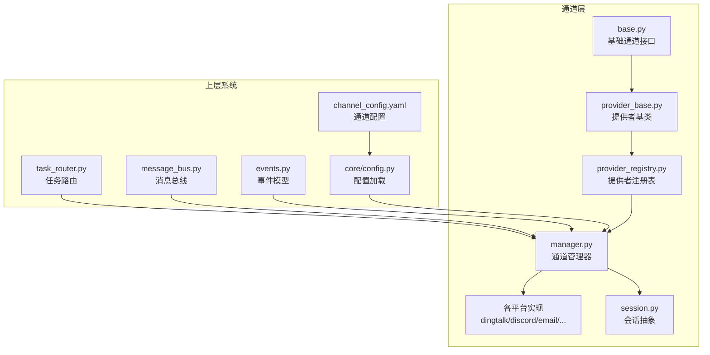

图表来源
- [opc/channels/base.py](file://opc/channels/base.py)
- [opc/channels/provider_base.py](file://opc/channels/provider_base.py)
- [opc/channels/provider_registry.py](file://opc/channels/provider_registry.py)
- [opc/channels/manager.py](file://opc/channels/manager.py)
- [opc/channels/session.py](file://opc/channels/session.py)
- [opc/channels/dingtalk.py](file://opc/channels/dingtalk.py)
- [opc/channels/discord.py](file://opc/channels/discord.py)
- [opc/channels/email.py](file://opc/channels/email.py)
- [opc/channels/feishu.py](file://opc/channels/feishu.py)
- [opc/channels/matrix.py](file://opc/channels/matrix.py)
- [opc/channels/mochat.py](file://opc/channels/mochat.py)
- [opc/channels/qq.py](file://opc/channels/qq.py)
- [opc/channels/slack.py](file://opc/channels/slack.py)
- [opc/channels/telegram.py](file://opc/channels/telegram.py)
- [opc/channels/whatsapp.py](file://opc/channels/whatsapp.py)
- [config/channel_config.yaml](file://config/channel_config.yaml)
- [opc/core/config.py](file://opc/core/config.py)
- [opc/core/events.py](file://opc/core/events.py)
- [opc/layer1_perception/task_router.py](file://opc/layer1_perception/task_router.py)
- [opc/layer0_interaction/message_bus.py](file://opc/layer0_interaction/message_bus.py)

章节来源
- [config/channel_config.yaml](file://config/channel_config.yaml)
- [opc/core/config.py](file://opc/core/config.py)
- [opc/channels/base.py](file://opc/channels/base.py)
- [opc/channels/provider_base.py](file://opc/channels/provider_base.py)
- [opc/channels/provider_registry.py](file://opc/channels/provider_registry.py)
- [opc/channels/manager.py](file://opc/channels/manager.py)
- [opc/channels/session.py](file://opc/channels/session.py)

## 核心组件
- 基础通道接口：定义统一的发送、接收、订阅、状态查询等能力契约，屏蔽底层协议差异。
- 提供者基类：封装通用逻辑（如鉴权、重连、心跳、序列化/反序列化、错误归一化），降低具体实现复杂度。
- 提供者注册表：集中维护通道类型到实现的映射，支持按名称查找与按需实例化。
- 通道管理器：负责通道的生命周期（创建、启动、停止）、连接池管理、路由分发、事件编排与资源回收。
- 会话抽象：为每个外部会话上下文提供隔离的数据面与控制面，承载消息编解码、去重、顺序保证等。
- 具体平台实现：钉钉、飞书、Slack、Telegram、WhatsApp、Discord、邮件、Matrix、Mochat、QQ 等。

章节来源
- [opc/channels/base.py](file://opc/channels/base.py)
- [opc/channels/provider_base.py](file://opc/channels/provider_base.py)
- [opc/channels/provider_registry.py](file://opc/channels/provider_registry.py)
- [opc/channels/manager.py](file://opc/channels/manager.py)
- [opc/channels/session.py](file://opc/channels/session.py)

## 架构总览
通道子系统采用“适配器+注册中心+管理器”的分层架构：上层通过管理器访问通道，管理器根据配置与注册表选择具体提供者；提供者基于基类实现平台适配；会话对象贯穿一次交互的生命周期。

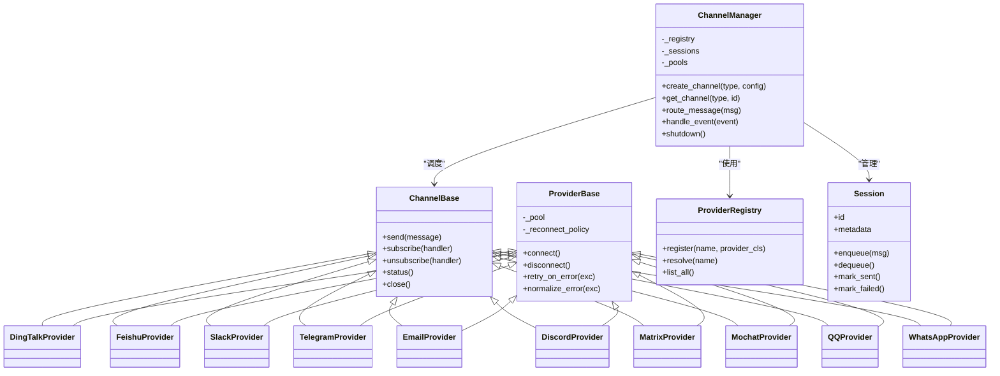

图表来源
- [opc/channels/base.py](file://opc/channels/base.py)
- [opc/channels/provider_base.py](file://opc/channels/provider_base.py)
- [opc/channels/provider_registry.py](file://opc/channels/provider_registry.py)
- [opc/channels/manager.py](file://opc/channels/manager.py)
- [opc/channels/session.py](file://opc/channels/session.py)
- [opc/channels/dingtalk.py](file://opc/channels/dingtalk.py)
- [opc/channels/feishu.py](file://opc/channels/feishu.py)
- [opc/channels/slack.py](file://opc/channels/slack.py)
- [opc/channels/telegram.py](file://opc/channels/telegram.py)
- [opc/channels/email.py](file://opc/channels/email.py)
- [opc/channels/discord.py](file://opc/channels/discord.py)
- [opc/channels/matrix.py](file://opc/channels/matrix.py)
- [opc/channels/mochat.py](file://opc/channels/mochat.py)
- [opc/channels/qq.py](file://opc/channels/qq.py)
- [opc/channels/whatsapp.py](file://opc/channels/whatsapp.py)

## 详细组件分析

### 基础通道接口与提供者基类
- 基础通道接口定义了跨平台的统一能力边界，包括消息发送、订阅回调、状态查询与关闭。
- 提供者基类封装了连接管理、错误归一化、重试策略、心跳保活等横切关注点，具体实现只需聚焦平台差异。

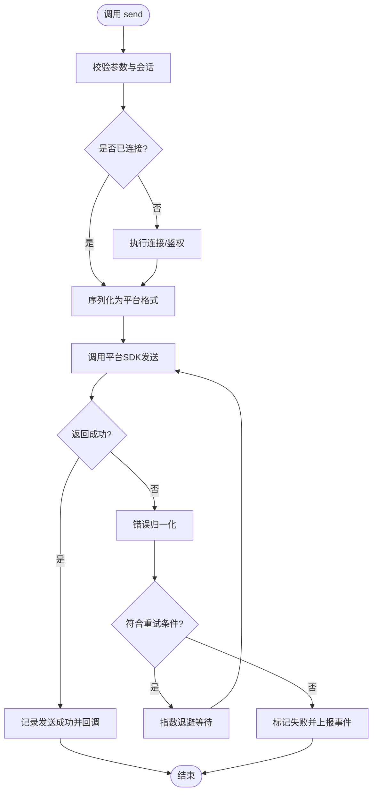

图表来源
- [opc/channels/base.py](file://opc/channels/base.py)
- [opc/channels/provider_base.py](file://opc/channels/provider_base.py)

章节来源
- [opc/channels/base.py](file://opc/channels/base.py)
- [opc/channels/provider_base.py](file://opc/channels/provider_base.py)

### 提供者注册机制与动态加载
- 注册表集中维护“通道类型名 -> 提供者类”的映射，支持运行时注册与解析。
- 动态加载通过配置文件驱动，管理器在启动时读取配置并自动发现/实例化所需提供者。
- 热插拔通过“重新加载配置 + 刷新注册表 + 重建连接池”的流程实现，无需重启进程。

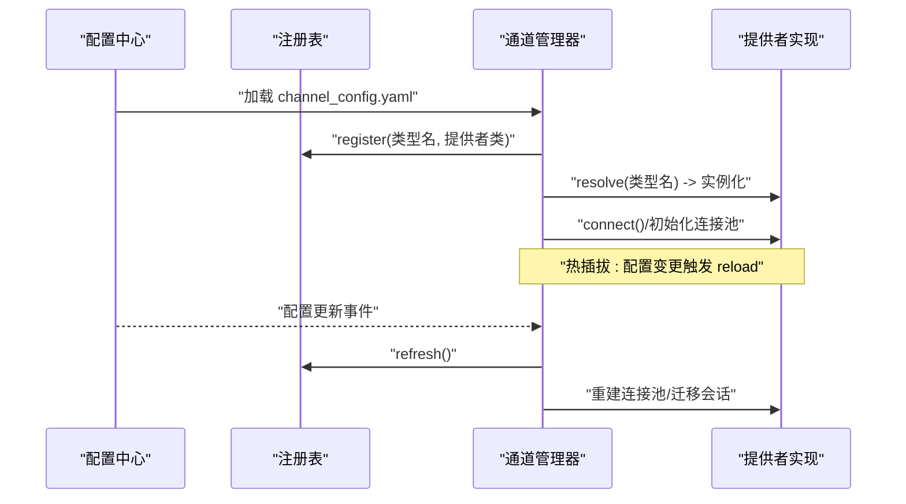

图表来源
- [opc/channels/provider_registry.py](file://opc/channels/provider_registry.py)
- [opc/channels/manager.py](file://opc/channels/manager.py)
- [config/channel_config.yaml](file://config/channel_config.yaml)
- [opc/core/config.py](file://opc/core/config.py)

章节来源
- [opc/channels/provider_registry.py](file://opc/channels/provider_registry.py)
- [opc/channels/manager.py](file://opc/channels/manager.py)
- [config/channel_config.yaml](file://config/channel_config.yaml)
- [opc/core/config.py](file://opc/core/config.py)

### 消息路由算法
- 入口：上层任务或消息进入 task_router，由管理器根据目标通道类型与路由规则进行分发。
- 匹配策略：精确匹配优先，其次按权重/优先级，最后回退到默认通道。
- 并发控制：同一会话的消息串行入队，避免乱序；不同会话可并行处理。
- 幂等性：对重复消息进行去重键计算，防止重复投递。

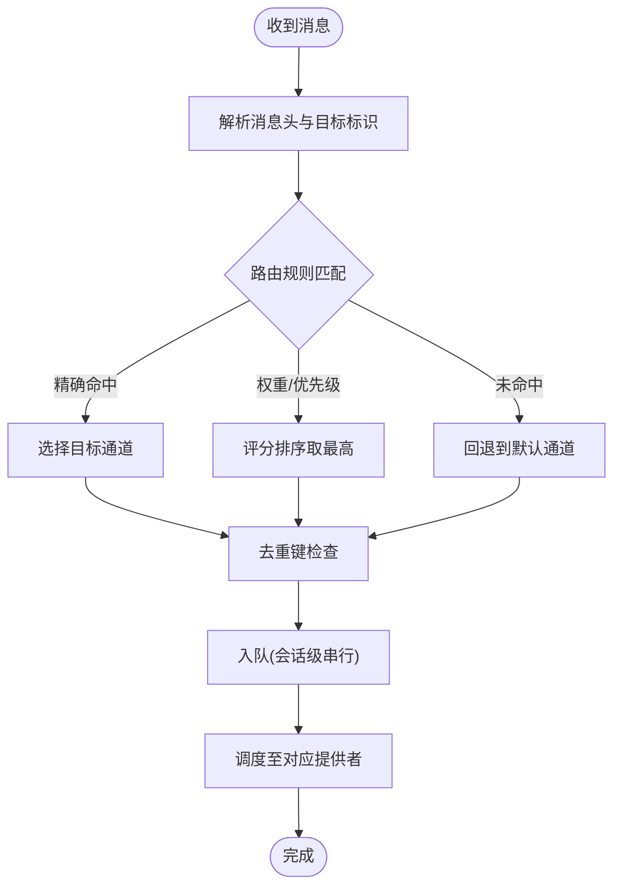

图表来源
- [opc/layer1_perception/task_router.py](file://opc/layer1_perception/task_router.py)
- [opc/channels/manager.py](file://opc/channels/manager.py)
- [opc/channels/session.py](file://opc/channels/session.py)

章节来源
- [opc/layer1_perception/task_router.py](file://opc/layer1_perception/task_router.py)
- [opc/channels/manager.py](file://opc/channels/manager.py)
- [opc/channels/session.py](file://opc/channels/session.py)

### 事件处理流程
- 事件模型：统一的事件结构包含类型、时间戳、源通道、负载与元数据。
- 订阅分发：管理器将事件广播给已注册的处理器，支持按类型过滤。
- 背压与限流：当处理器消费慢时，通过队列容量与丢弃策略保护系统稳定。

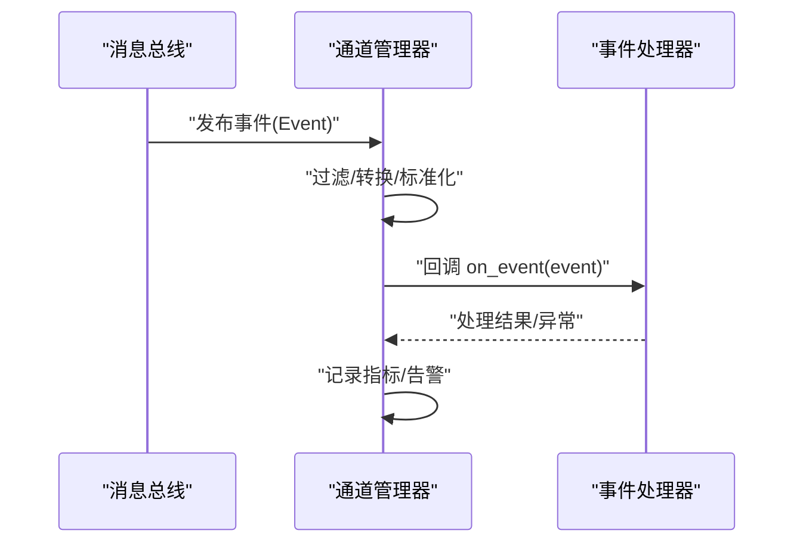

图表来源
- [opc/core/events.py](file://opc/core/events.py)
- [opc/layer0_interaction/message_bus.py](file://opc/layer0_interaction/message_bus.py)
- [opc/channels/manager.py](file://opc/channels/manager.py)

章节来源
- [opc/core/events.py](file://opc/core/events.py)
- [opc/layer0_interaction/message_bus.py](file://opc/layer0_interaction/message_bus.py)
- [opc/channels/manager.py](file://opc/channels/manager.py)

### 错误重试策略
- 分类：网络抖动、认证过期、速率限制、服务端不可用等。
- 策略：指数退避、抖动随机化、最大重试次数、熔断降级。
- 观测：每次重试记录指标，达到阈值触发告警或切换备用通道。

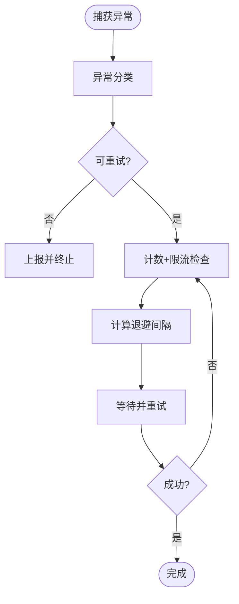

图表来源
- [opc/channels/provider_base.py](file://opc/channels/provider_base.py)
- [opc/channels/manager.py](file://opc/channels/manager.py)

章节来源
- [opc/channels/provider_base.py](file://opc/channels/provider_base.py)
- [opc/channels/manager.py](file://opc/channels/manager.py)

### 适配器模式在多渠道集成中的应用
- 统一抽象：所有平台实现均遵循基础通道接口，对外暴露一致API。
- 差异化适配：在提供者基类之上，针对平台特性（如富媒体、群聊、@提及）做最小适配。
- 可扩展性：新增平台仅需实现提供者类并注册，无需改动上层逻辑。

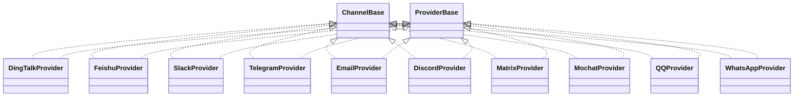

图表来源
- [opc/channels/base.py](file://opc/channels/base.py)
- [opc/channels/provider_base.py](file://opc/channels/provider_base.py)
- [opc/channels/dingtalk.py](file://opc/channels/dingtalk.py)
- [opc/channels/feishu.py](file://opc/channels/feishu.py)
- [opc/channels/slack.py](file://opc/channels/slack.py)
- [opc/channels/telegram.py](file://opc/channels/telegram.py)
- [opc/channels/email.py](file://opc/channels/email.py)
- [opc/channels/discord.py](file://opc/channels/discord.py)
- [opc/channels/matrix.py](file://opc/channels/matrix.py)
- [opc/channels/mochat.py](file://opc/channels/mochat.py)
- [opc/channels/qq.py](file://opc/channels/qq.py)
- [opc/channels/whatsapp.py](file://opc/channels/whatsapp.py)

章节来源
- [opc/channels/base.py](file://opc/channels/base.py)
- [opc/channels/provider_base.py](file://opc/channels/provider_base.py)
- [opc/channels/dingtalk.py](file://opc/channels/dingtalk.py)
- [opc/channels/feishu.py](file://opc/channels/feishu.py)
- [opc/channels/slack.py](file://opc/channels/slack.py)
- [opc/channels/telegram.py](file://opc/channels/telegram.py)
- [opc/channels/email.py](file://opc/channels/email.py)
- [opc/channels/discord.py](file://opc/channels/discord.py)
- [opc/channels/matrix.py](file://opc/channels/matrix.py)
- [opc/channels/mochat.py](file://opc/channels/mochat.py)
- [opc/channels/qq.py](file://opc/channels/qq.py)
- [opc/channels/whatsapp.py](file://opc/channels/whatsapp.py)

### 动态加载与热插拔机制
- 动态加载：从配置中读取通道列表，反射式导入并注册提供者类。
- 热插拔：监听配置变更事件，增量更新注册表与连接池，平滑迁移活跃会话。
- 一致性：在切换期间保持至少一次语义，必要时引入幂等键与补偿。

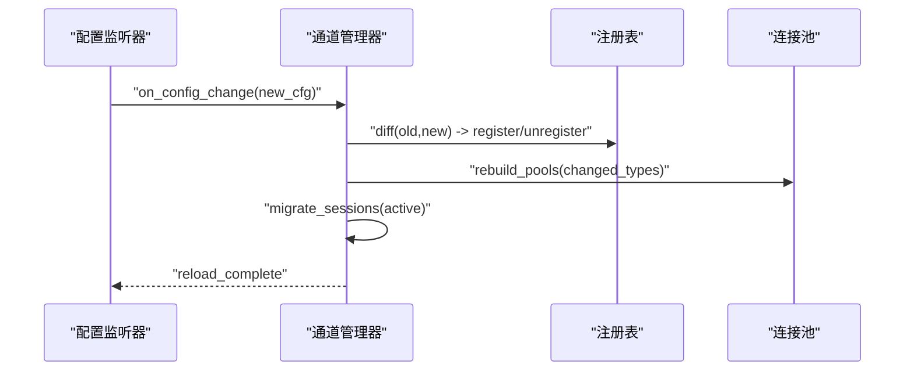

图表来源
- [opc/channels/manager.py](file://opc/channels/manager.py)
- [opc/channels/provider_registry.py](file://opc/channels/provider_registry.py)
- [config/channel_config.yaml](file://config/channel_config.yaml)

章节来源
- [opc/channels/manager.py](file://opc/channels/manager.py)
- [opc/channels/provider_registry.py](file://opc/channels/provider_registry.py)
- [config/channel_config.yaml](file://config/channel_config.yaml)

### 通道生命周期管理
- 创建：依据配置实例化提供者，建立连接池与订阅。
- 运行：持续收发消息，维持心跳与健康检查。
- 停止：优雅关闭连接，持久化状态，释放资源。
- 恢复：崩溃后从最近检查点恢复会话与队列。

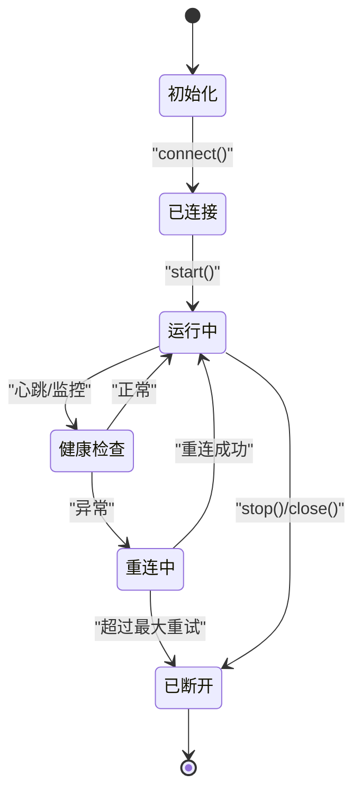

图表来源
- [opc/channels/manager.py](file://opc/channels/manager.py)
- [opc/channels/provider_base.py](file://opc/channels/provider_base.py)

章节来源
- [opc/channels/manager.py](file://opc/channels/manager.py)
- [opc/channels/provider_base.py](file://opc/channels/provider_base.py)

### 连接池管理与资源清理
- 池化策略：按通道类型与租户维度划分连接池，控制最大连接数与空闲超时。
- 复用与隔离：会话绑定到特定连接，避免跨会话共享导致的污染。
- 清理：退出时主动关闭连接、取消订阅、清空队列与缓存。

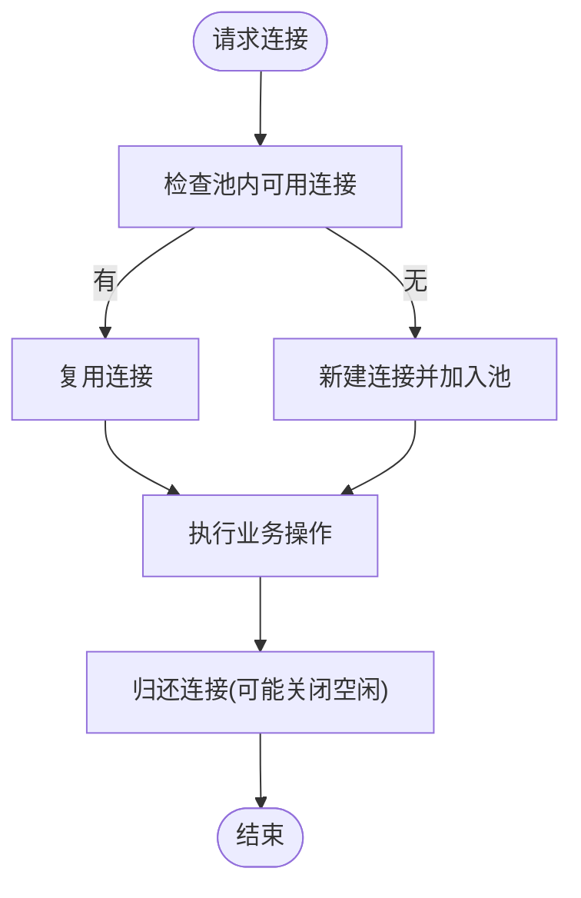

图表来源
- [opc/channels/manager.py](file://opc/channels/manager.py)
- [opc/channels/provider_base.py](file://opc/channels/provider_base.py)

章节来源
- [opc/channels/manager.py](file://opc/channels/manager.py)
- [opc/channels/provider_base.py](file://opc/channels/provider_base.py)

## 依赖关系分析
- 低耦合：通道实现仅依赖基础接口与提供者基类，不感知上层业务。
- 高内聚：管理器聚合注册表、会话与连接池，承担编排职责。
- 外部依赖：配置中心、事件总线、日志与指标采集。

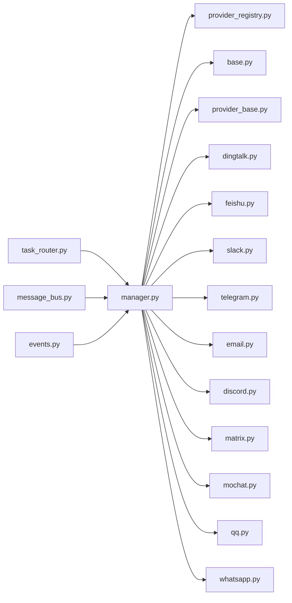

图表来源
- [opc/layer1_perception/task_router.py](file://opc/layer1_perception/task_router.py)
- [opc/layer0_interaction/message_bus.py](file://opc/layer0_interaction/message_bus.py)
- [opc/core/events.py](file://opc/core/events.py)
- [opc/channels/manager.py](file://opc/channels/manager.py)
- [opc/channels/provider_registry.py](file://opc/channels/provider_registry.py)
- [opc/channels/base.py](file://opc/channels/base.py)
- [opc/channels/provider_base.py](file://opc/channels/provider_base.py)
- [opc/channels/dingtalk.py](file://opc/channels/dingtalk.py)
- [opc/channels/feishu.py](file://opc/channels/feishu.py)
- [opc/channels/slack.py](file://opc/channels/slack.py)
- [opc/channels/telegram.py](file://opc/channels/telegram.py)
- [opc/channels/email.py](file://opc/channels/email.py)
- [opc/channels/discord.py](file://opc/channels/discord.py)
- [opc/channels/matrix.py](file://opc/channels/matrix.py)
- [opc/channels/mochat.py](file://opc/channels/mochat.py)
- [opc/channels/qq.py](file://opc/channels/qq.py)
- [opc/channels/whatsapp.py](file://opc/channels/whatsapp.py)

章节来源
- [opc/layer1_perception/task_router.py](file://opc/layer1_perception/task_router.py)
- [opc/layer0_interaction/message_bus.py](file://opc/layer0_interaction/message_bus.py)
- [opc/core/events.py](file://opc/core/events.py)
- [opc/channels/manager.py](file://opc/channels/manager.py)
- [opc/channels/provider_registry.py](file://opc/channels/provider_registry.py)
- [opc/channels/base.py](file://opc/channels/base.py)
- [opc/channels/provider_base.py](file://opc/channels/provider_base.py)
- [opc/channels/dingtalk.py](file://opc/channels/dingtalk.py)
- [opc/channels/feishu.py](file://opc/channels/feishu.py)
- [opc/channels/slack.py](file://opc/channels/slack.py)
- [opc/channels/telegram.py](file://opc/channels/telegram.py)
- [opc/channels/email.py](file://opc/channels/email.py)
- [opc/channels/discord.py](file://opc/channels/discord.py)
- [opc/channels/matrix.py](file://opc/channels/matrix.py)
- [opc/channels/mochat.py](file://opc/channels/mochat.py)
- [opc/channels/qq.py](file://opc/channels/qq.py)
- [opc/channels/whatsapp.py](file://opc/channels/whatsapp.py)

## 性能考虑
- 批量发送：合并小消息以降低平台侧限流压力。
- 异步IO：非阻塞发送与回调，提升吞吐。
- 连接复用：合理设置池大小与空闲超时，减少握手开销。
- 背压控制：队列满时拒绝或丢弃低优先级消息，保障关键路径。
- 指标观测：延迟、成功率、重试率、连接池利用率等关键指标。

[本节为通用指导，不涉及具体文件分析]

## 故障排查指南
- 常见问题
  - 无法连接：检查凭据、网络可达性与平台服务状态。
  - 频繁重试：查看重试策略与退避参数，确认是否为瞬时错误。
  - 消息丢失：核对去重键与幂等性，检查队列容量与丢弃策略。
  - 热插拔失败：确认配置变更事件是否触发，注册表刷新是否完整。
- 定位手段
  - 启用调试日志，关注连接、发送、重试与事件回调链路。
  - 使用测试用例验证通道契约与端到端流程。

章节来源
- [tests/test_channel_contracts.py](file://tests/test_channel_contracts.py)
- [tests/test_channels.py](file://tests/test_channels.py)

## 结论
OpenOPC通道子系统以清晰的接口与基类抽象、完善的注册与管理器编排、以及健壮的重试与事件机制，实现了多渠道的统一接入与高效协作。通过适配器模式与动态加载，系统具备良好的可扩展性与运维灵活性。配合连接池与生命周期管理，可在复杂生产环境中保持稳定与高性能。

[本节为总结性内容，不涉及具体文件分析]

## 附录
- 配置项建议
  - 通道开关、凭据、重试策略、连接池上限、心跳间隔、日志级别等。
- 扩展新通道步骤
  - 实现提供者类并继承基类
  - 在注册表中登记类型名
  - 在配置文件中声明启用
  - 编写单元测试与集成测试

[本节为补充说明，不涉及具体文件分析]