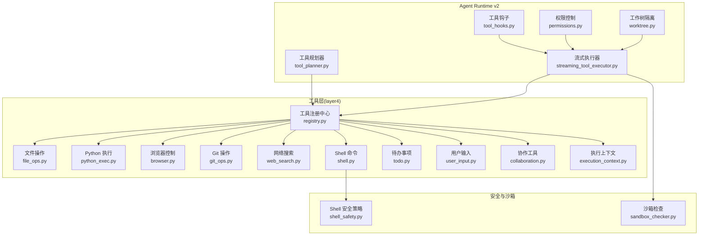
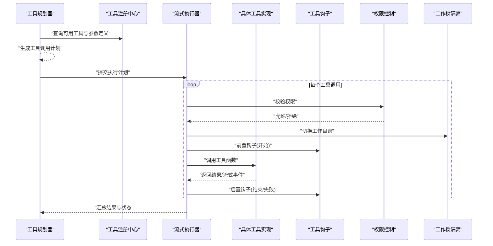
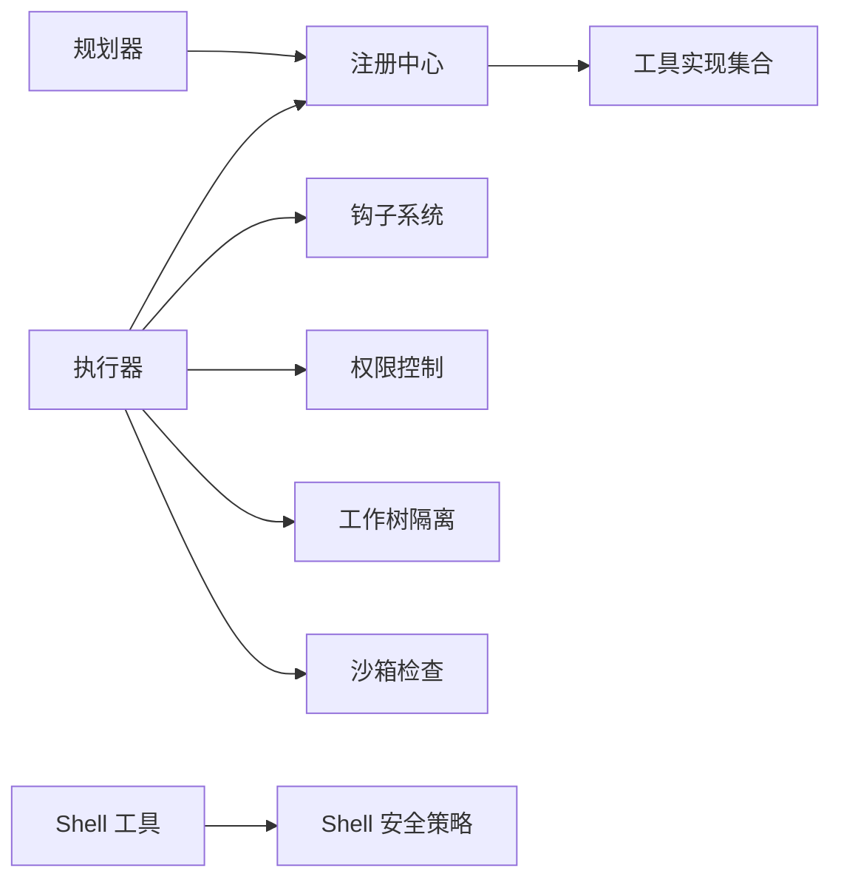

# 工具系统

<cite>
**本文引用的文件**   
- [opc/layer4_tools/registry.py](file://opc/layer4_tools/registry.py)
- [opc/layer4_tools/file_ops.py](file://opc/layer4_tools/file_ops.py)
- [opc/layer4_tools/python_exec.py](file://opc/layer4_tools/python_exec.py)
- [opc/layer4_tools/browser.py](file://opc/layer4_tools/browser.py)
- [opc/layer4_tools/git_ops.py](file://opc/layer4_tools/git_ops.py)
- [opc/layer4_tools/web_search.py](file://opc/layer4_tools/web_search.py)
- [opc/layer4_tools/shell.py](file://opc/layer4_tools/shell.py)
- [opc/layer4_tools/todo.py](file://opc/layer4_tools/todo.py)
- [opc/layer4_tools/user_input.py](file://opc/layer4_tools/user_input.py)
- [opc/layer4_tools/collaboration.py](file://opc/layer4_tools/collaboration.py)
- [opc/layer4_tools/execution_context.py](file://opc/layer4_tools/execution_context.py)
- [opc/layer3_agent/runtime_v2/tool_hooks.py](file://opc/layer3_agent/runtime_v2/tool_hooks.py)
- [opc/layer3_agent/runtime_v2/streaming_tool_executor.py](file://opc/layer3_agent/runtime_v2/streaming_tool_executor.py)
- [opc/layer3_agent/runtime_v2/permissions.py](file://opc/layer3_agent/runtime_v2/permissions.py)
- [opc/layer3_agent/runtime_v2/tool_planner.py](file://opc/layer3_agent/runtime_v2/tool_planner.py)
- [opc/layer3_agent/runtime_v2/worktree.py](file://opc/layer3_agent/runtime_v2/worktree.py)
- [opc/layer2_organization/shell_safety.py](file://opc/layer2_organization/shell_safety.py)
- [opc/market/sandbox_checker.py](file://opc/market/sandbox_checker.py)
</cite>

## 目录
1. [简介](#简介)
2. [项目结构](#项目结构)
3. [核心组件](#核心组件)
4. [架构总览](#架构总览)
5. [详细组件分析](#详细组件分析)
6. [依赖关系分析](#依赖关系分析)
7. [性能考虑](#性能考虑)
8. [故障排除指南](#故障排除指南)
9. [结论](#结论)
10. [附录](#附录)

## 简介
本文件为 OpenOPC 工具系统的全面文档，聚焦于工具注册机制、执行环境与安全沙箱设计，并深入介绍内置工具集（文件操作、Python 代码执行、浏览器控制、Git 操作、网络搜索等）的使用方法。同时提供参数验证、错误处理与结果格式化的机制说明，以及自定义工具开发指南（接口规范、异步执行、权限控制）、组合使用模式与高级配置选项。文末包含性能优化建议、安全注意事项与故障排除方法。

## 项目结构
OpenOPC 的工具系统主要位于 layer4_tools 层，由统一的注册中心管理，并在 agent runtime v2 中通过工具规划器、流式执行器与钩子进行编排。安全方面，shell 命令与沙箱检查分别在组织层与市场模块中进行约束。

图表来源
- [opc/layer4_tools/registry.py](file://opc/layer4_tools/registry.py)
- [opc/layer4_tools/file_ops.py](file://opc/layer4_tools/file_ops.py)
- [opc/layer4_tools/python_exec.py](file://opc/layer4_tools/python_exec.py)
- [opc/layer4_tools/browser.py](file://opc/layer4_tools/browser.py)
- [opc/layer4_tools/git_ops.py](file://opc/layer4_tools/git_ops.py)
- [opc/layer4_tools/web_search.py](file://opc/layer4_tools/web_search.py)
- [opc/layer4_tools/shell.py](file://opc/layer4_tools/shell.py)
- [opc/layer4_tools/todo.py](file://opc/layer4_tools/todo.py)
- [opc/layer4_tools/user_input.py](file://opc/layer4_tools/user_input.py)
- [opc/layer4_tools/collaboration.py](file://opc/layer4_tools/collaboration.py)
- [opc/layer4_tools/execution_context.py](file://opc/layer4_tools/execution_context.py)
- [opc/layer3_agent/runtime_v2/tool_planner.py](file://opc/layer3_agent/runtime_v2/tool_planner.py)
- [opc/layer3_agent/runtime_v2/streaming_tool_executor.py](file://opc/layer3_agent/runtime_v2/streaming_tool_executor.py)
- [opc/layer3_agent/runtime_v2/tool_hooks.py](file://opc/layer3_agent/runtime_v2/tool_hooks.py)
- [opc/layer3_agent/runtime_v2/permissions.py](file://opc/layer3_agent/runtime_v2/permissions.py)
- [opc/layer3_agent/runtime_v2/worktree.py](file://opc/layer3_agent/runtime_v2/worktree.py)
- [opc/layer2_organization/shell_safety.py](file://opc/layer2_organization/shell_safety.py)
- [opc/market/sandbox_checker.py](file://opc/market/sandbox_checker.py)

章节来源
- [opc/layer4_tools/registry.py](file://opc/layer4_tools/registry.py)
- [opc/layer3_agent/runtime_v2/tool_planner.py](file://opc/layer3_agent/runtime_v2/tool_planner.py)
- [opc/layer3_agent/runtime_v2/streaming_tool_executor.py](file://opc/layer3_agent/runtime_v2/streaming_tool_executor.py)
- [opc/layer3_agent/runtime_v2/tool_hooks.py](file://opc/layer3_agent/runtime_v2/tool_hooks.py)
- [opc/layer3_agent/runtime_v2/permissions.py](file://opc/layer3_agent/runtime_v2/permissions.py)
- [opc/layer3_agent/runtime_v2/worktree.py](file://opc/layer3_agent/runtime_v2/worktree.py)
- [opc/layer2_organization/shell_safety.py](file://opc/layer2_organization/shell_safety.py)
- [opc/market/sandbox_checker.py](file://opc/market/sandbox_checker.py)

## 核心组件
- 工具注册中心：集中管理所有工具的元数据、参数校验规则、描述与调用入口，供规划器与执行器发现与调度。
- 执行上下文：为工具运行提供工作目录、环境变量、会话标识、输出通道等运行时信息。
- 工具规划器：根据任务目标选择合适工具、生成参数计划，支持并行与顺序组合。
- 流式执行器：负责实际调用工具、收集进度与结果、处理异常与重试。
- 工具钩子：在工具执行前后注入日志、审计、指标采集等横切逻辑。
- 权限控制：基于角色或策略限制工具能力范围（如是否允许 shell、是否允许网络访问）。
- 工作树隔离：为每次执行分配独立的工作目录，避免跨任务污染。
- Shell 安全策略：对 shell 命令白名单、路径限制、危险指令过滤等。
- 沙箱检查：在加载外部包或执行高风险操作前进行安全检查。

章节来源
- [opc/layer4_tools/registry.py](file://opc/layer4_tools/registry.py)
- [opc/layer4_tools/execution_context.py](file://opc/layer4_tools/execution_context.py)
- [opc/layer3_agent/runtime_v2/tool_planner.py](file://opc/layer3_agent/runtime_v2/tool_planner.py)
- [opc/layer3_agent/runtime_v2/streaming_tool_executor.py](file://opc/layer3_agent/runtime_v2/streaming_tool_executor.py)
- [opc/layer3_agent/runtime_v2/tool_hooks.py](file://opc/layer3_agent/runtime_v2/tool_hooks.py)
- [opc/layer3_agent/runtime_v2/permissions.py](file://opc/layer3_agent/runtime_v2/permissions.py)
- [opc/layer3_agent/runtime_v2/worktree.py](file://opc/layer3_agent/runtime_v2/worktree.py)
- [opc/layer2_organization/shell_safety.py](file://opc/layer2_organization/shell_safety.py)
- [opc/market/sandbox_checker.py](file://opc/market/sandbox_checker.py)

## 架构总览
工具系统采用“注册-规划-执行-钩子”的分层架构。注册中心暴露统一接口；规划器产出可执行的步骤序列；执行器按序或并行调用工具；钩子在关键阶段记录与干预；权限与工作树确保安全性与隔离性。

图表来源
- [opc/layer3_agent/runtime_v2/tool_planner.py](file://opc/layer3_agent/runtime_v2/tool_planner.py)
- [opc/layer4_tools/registry.py](file://opc/layer4_tools/registry.py)
- [opc/layer3_agent/runtime_v2/streaming_tool_executor.py](file://opc/layer3_agent/runtime_v2/streaming_tool_executor.py)
- [opc/layer3_agent/runtime_v2/tool_hooks.py](file://opc/layer3_agent/runtime_v2/tool_hooks.py)
- [opc/layer3_agent/runtime_v2/permissions.py](file://opc/layer3_agent/runtime_v2/permissions.py)
- [opc/layer3_agent/runtime_v2/worktree.py](file://opc/layer3_agent/runtime_v2/worktree.py)

## 详细组件分析

### 工具注册机制
- 职责：维护工具清单、参数 schema、描述、版本、依赖与可选能力标记。
- 关键点：
  - 工具以命名空间方式注册，便于扩展与冲突检测。
  - 参数校验规则在注册时声明，执行期自动应用。
  - 支持动态发现与热更新（由上层生命周期管理）。
- 典型流程：
  - 启动时扫描工具模块并注册。
  - 规划器读取注册表生成调用计划。
  - 执行器依据注册表中的能力标记决定是否启用某工具。

章节来源
- [opc/layer4_tools/registry.py](file://opc/layer4_tools/registry.py)

### 执行环境与沙箱
- 执行上下文：
  - 提供工作目录、环境变量、会话 ID、输出通道等。
  - 工具可通过上下文获取当前任务边界信息。
- 工作树隔离：
  - 每次执行分配独立目录，防止跨任务读写干扰。
- Shell 安全策略：
  - 对 shell 命令进行白名单与路径限制，拦截高危指令。
- 沙箱检查：
  - 在执行外部包或高风险操作前进行安全检查，阻断不合规行为。

章节来源
- [opc/layer4_tools/execution_context.py](file://opc/layer4_tools/execution_context.py)
- [opc/layer3_agent/runtime_v2/worktree.py](file://opc/layer3_agent/runtime_v2/worktree.py)
- [opc/layer2_organization/shell_safety.py](file://opc/layer2_organization/shell_safety.py)
- [opc/market/sandbox_checker.py](file://opc/market/sandbox_checker.py)

### 权限控制
- 基于角色或策略的细粒度授权，决定工具是否可用、参数范围与资源访问权限。
- 执行前校验，拒绝越权调用并记录审计日志。
- 可与工作树隔离结合，限制文件系统访问范围。

章节来源
- [opc/layer3_agent/runtime_v2/permissions.py](file://opc/layer3_agent/runtime_v2/permissions.py)

### 工具钩子与流式执行
- 钩子：
  - 在工具执行前后触发，用于日志、指标、审计与告警。
  - 支持同步与异步钩子，不影响主流程阻塞。
- 流式执行：
  - 支持长耗时任务的增量输出与中断响应。
  - 执行器聚合流式事件，形成最终结果。

章节来源
- [opc/layer3_agent/runtime_v2/tool_hooks.py](file://opc/layer3_agent/runtime_v2/tool_hooks.py)
- [opc/layer3_agent/runtime_v2/streaming_tool_executor.py](file://opc/layer3_agent/runtime_v2/streaming_tool_executor.py)

### 内置工具集概览与用法要点
以下工具均通过注册中心暴露，参数校验与错误处理遵循统一契约。

- 文件操作
  - 功能：列出目录、读取/写入文件、移动/复制/删除、递归遍历、批量处理。
  - 参数要点：路径、编码、覆盖策略、权限掩码。
  - 错误处理：路径不存在、权限不足、磁盘满等异常分类与提示。
  - 结果格式化：结构化返回（状态、统计、变更摘要），必要时附带文件内容片段。
  - 参考实现：[file_ops.py](file://opc/layer4_tools/file_ops.py)

- Python 代码执行
  - 功能：在受限环境中执行 Python 代码片段，支持导入白名单与内存限制。
  - 参数要点：代码文本、超时、变量注入、输出捕获。
  - 错误处理：语法错误、运行时异常、超时与资源超限。
  - 结果格式化：标准输出/错误、返回值、中间变量快照（可选）。
  - 参考实现：[python_exec.py](file://opc/layer4_tools/python_exec.py)

- 浏览器控制
  - 功能：打开页面、点击、填写表单、截图、抓取元素文本。
  - 参数要点：URL、交互动作、等待策略、视口与代理设置。
  - 错误处理：网络不可达、页面加载失败、元素定位失败。
  - 结果格式化：结构化交互日志、截图路径、文本提取结果。
  - 参考实现：[browser.py](file://opc/layer4_tools/browser.py)

- Git 操作
  - 功能：克隆仓库、提交、推送、拉取、分支管理、差异查看。
  - 参数要点：仓库地址、分支、认证凭据、提交信息。
  - 错误处理：网络错误、权限不足、冲突解决。
  - 结果格式化：操作摘要、日志片段、变更统计。
  - 参考实现：[git_ops.py](file://opc/layer4_tools/git_ops.py)

- 网络搜索
  - 功能：关键词检索、分页、过滤、结果摘要。
  - 参数要点：查询词、引擎、时间范围、语言、最大结果数。
  - 错误处理：服务不可用、配额耗尽、反爬限制。
  - 结果格式化：结构化条目列表（标题、链接、摘要、来源）。
  - 参考实现：[web_search.py](file://opc/layer4_tools/web_search.py)

- Shell 命令
  - 功能：执行系统命令，受安全策略严格限制。
  - 参数要点：命令字符串、工作目录、超时、环境变量。
  - 错误处理：命令不存在、权限不足、被安全策略拦截。
  - 结果格式化：退出码、标准输出/错误、执行时长。
  - 参考实现：[shell.py](file://opc/layer4_tools/shell.py)

- 待办事项
  - 功能：创建、更新、查询、完成待办项，支持标签与优先级。
  - 参数要点：标题、描述、截止日期、标签、优先级。
  - 错误处理：重复项、无效日期、权限不足。
  - 结果格式化：待办项对象集合与操作结果。
  - 参考实现：[todo.py](file://opc/layer4_tools/todo.py)

- 用户输入
  - 功能：交互式请求用户补充信息，支持模板与校验。
  - 参数要点：问题文本、默认值、校验规则、超时。
  - 错误处理：超时、非法输入、取消输入。
  - 结果格式化：标准化输入对象。
  - 参考实现：[user_input.py](file://opc/layer4_tools/user_input.py)

- 协作工具
  - 功能：跨会话/角色的消息传递、任务分发、状态同步。
  - 参数要点：目标实体、消息体、路由策略、可见性。
  - 错误处理：目标不存在、权限不足、网络异常。
  - 结果格式化：回执、状态码、追踪 ID。
  - 参考实现：[collaboration.py](file://opc/layer4_tools/collaboration.py)

章节来源
- [opc/layer4_tools/file_ops.py](file://opc/layer4_tools/file_ops.py)
- [opc/layer4_tools/python_exec.py](file://opc/layer4_tools/python_exec.py)
- [opc/layer4_tools/browser.py](file://opc/layer4_tools/browser.py)
- [opc/layer4_tools/git_ops.py](file://opc/layer4_tools/git_ops.py)
- [opc/layer4_tools/web_search.py](file://opc/layer4_tools/web_search.py)
- [opc/layer4_tools/shell.py](file://opc/layer4_tools/shell.py)
- [opc/layer4_tools/todo.py](file://opc/layer4_tools/todo.py)
- [opc/layer4_tools/user_input.py](file://opc/layer4_tools/user_input.py)
- [opc/layer4_tools/collaboration.py](file://opc/layer4_tools/collaboration.py)

### 参数验证、错误处理与结果格式化
- 参数验证：
  - 在注册阶段声明参数类型、必填性、取值范围与自定义校验器。
  - 执行期自动校验，失败即短路并返回明确错误信息。
- 错误处理：
  - 统一异常分类（参数错误、运行时错误、网络错误、权限错误）。
  - 支持重试策略与退避算法，针对瞬时故障恢复。
- 结果格式化：
  - 工具返回结构化对象，包含状态、数据与元数据。
  - 流式工具将增量事件合并为最终结果，保证幂等与一致性。

章节来源
- [opc/layer4_tools/registry.py](file://opc/layer4_tools/registry.py)
- [opc/layer3_agent/runtime_v2/streaming_tool_executor.py](file://opc/layer3_agent/runtime_v2/streaming_tool_executor.py)

### 自定义工具开发指南
- 接口规范：
  - 实现工具函数，声明名称、描述、参数 schema 与返回结构。
  - 遵循统一错误模型与结果格式约定。
- 异步执行：
  - 支持协程或线程池封装，配合流式执行器上报进度。
  - 在钩子中记录异步任务生命周期。
- 权限控制：
  - 在注册时声明所需权限，执行前由权限控制器校验。
  - 结合工作树隔离限制文件系统访问。
- 注册与发现：
  - 将新工具加入注册中心，确保命名空间唯一。
  - 通过规划器自动纳入工具链。

章节来源
- [opc/layer4_tools/registry.py](file://opc/layer4_tools/registry.py)
- [opc/layer3_agent/runtime_v2/tool_hooks.py](file://opc/layer3_agent/runtime_v2/tool_hooks.py)
- [opc/layer3_agent/runtime_v2/permissions.py](file://opc/layer3_agent/runtime_v2/permissions.py)
- [opc/layer3_agent/runtime_v2/worktree.py](file://opc/layer3_agent/runtime_v2/worktree.py)

### 组合使用模式与高级配置
- 组合模式：
  - 顺序组合：文件下载 → 解析 → 入库。
  - 并行组合：多源搜索 → 去重 → 汇总。
  - 条件分支：根据搜索结果决定是否发起浏览器抓取。
- 高级配置：
  - 超时与重试上限。
  - 输出大小限制与采样策略。
  - 日志级别与审计开关。
  - 工作树根目录与隔离策略。

章节来源
- [opc/layer3_agent/runtime_v2/tool_planner.py](file://opc/layer3_agent/runtime_v2/tool_planner.py)
- [opc/layer3_agent/runtime_v2/streaming_tool_executor.py](file://opc/layer3_agent/runtime_v2/streaming_tool_executor.py)
- [opc/layer3_agent/runtime_v2/worktree.py](file://opc/layer3_agent/runtime_v2/worktree.py)

## 依赖关系分析
工具层与运行时层的耦合关系如下：
- 工具仅依赖注册中心提供的元数据与执行上下文。
- 执行器依赖规划器产出的计划，并通过钩子与权限控制器协同。
- 安全策略与沙箱检查作为横切关注点，贯穿执行链路。

图表来源
- [opc/layer4_tools/registry.py](file://opc/layer4_tools/registry.py)
- [opc/layer3_agent/runtime_v2/tool_planner.py](file://opc/layer3_agent/runtime_v2/tool_planner.py)
- [opc/layer3_agent/runtime_v2/streaming_tool_executor.py](file://opc/layer3_agent/runtime_v2/streaming_tool_executor.py)
- [opc/layer3_agent/runtime_v2/tool_hooks.py](file://opc/layer3_agent/runtime_v2/tool_hooks.py)
- [opc/layer3_agent/runtime_v2/permissions.py](file://opc/layer3_agent/runtime_v2/permissions.py)
- [opc/layer3_agent/runtime_v2/worktree.py](file://opc/layer3_agent/runtime_v2/worktree.py)
- [opc/layer2_organization/shell_safety.py](file://opc/layer2_organization/shell_safety.py)
- [opc/market/sandbox_checker.py](file://opc/market/sandbox_checker.py)

章节来源
- [opc/layer4_tools/registry.py](file://opc/layer4_tools/registry.py)
- [opc/layer3_agent/runtime_v2/tool_planner.py](file://opc/layer3_agent/runtime_v2/tool_planner.py)
- [opc/layer3_agent/runtime_v2/streaming_tool_executor.py](file://opc/layer3_agent/runtime_v2/streaming_tool_executor.py)
- [opc/layer3_agent/runtime_v2/tool_hooks.py](file://opc/layer3_agent/runtime_v2/tool_hooks.py)
- [opc/layer3_agent/runtime_v2/permissions.py](file://opc/layer3_agent/runtime_v2/permissions.py)
- [opc/layer3_agent/runtime_v2/worktree.py](file://opc/layer3_agent/runtime_v2/worktree.py)
- [opc/layer2_organization/shell_safety.py](file://opc/layer2_organization/shell_safety.py)
- [opc/market/sandbox_checker.py](file://opc/market/sandbox_checker.py)

## 性能考虑
- 批量化与缓存：
  - 文件操作与搜索类工具应支持批量接口与结果缓存，减少重复 IO 与网络开销。
- 并发与限流：
  - 合理设置并行度，避免 I/O 或 CPU 瓶颈；对外部服务进行速率限制。
- 流式输出：
  - 长耗时任务采用流式输出，降低内存占用并提升用户体验。
- 超时与重试：
  - 为外部依赖设置合理超时与指数退避重试，提高鲁棒性。
- 资源隔离：
  - 利用工作树与环境变量隔离，避免共享状态导致的竞争与抖动。

[本节为通用指导，无需特定文件引用]

## 故障排除指南
- 常见错误与定位：
  - 参数校验失败：检查注册时的参数 schema 与实际传入值。
  - 权限拒绝：确认角色策略与工具能力标记是否匹配。
  - Shell 被拦截：核对安全策略白名单与命令路径。
  - 网络异常：检查代理、DNS 与外部服务可用性。
- 诊断手段：
  - 启用工具钩子日志，观察执行前后状态与异常堆栈。
  - 检查工作树目录与临时文件，确认隔离是否生效。
  - 使用沙箱检查报告定位不合规操作。
- 恢复策略：
  - 对瞬时错误启用重试；对持久错误降级或回退到替代工具。
  - 清理残留工作树与锁文件，避免状态不一致。

章节来源
- [opc/layer3_agent/runtime_v2/tool_hooks.py](file://opc/layer3_agent/runtime_v2/tool_hooks.py)
- [opc/layer3_agent/runtime_v2/streaming_tool_executor.py](file://opc/layer3_agent/runtime_v2/streaming_tool_executor.py)
- [opc/layer2_organization/shell_safety.py](file://opc/layer2_organization/shell_safety.py)
- [opc/market/sandbox_checker.py](file://opc/market/sandbox_checker.py)

## 结论
OpenOPC 工具系统通过注册中心统一管理、规划器智能编排、执行器可靠调度与钩子增强观测，结合权限控制、工作树隔离与沙箱检查，构建了安全、可扩展且高性能的工具生态。内置工具覆盖文件、代码执行、浏览器、Git、搜索、Shell、待办、用户输入与协作等场景，满足多样化自动化需求。通过本文档的指南与最佳实践，开发者可快速构建高质量自定义工具并融入现有流水线。

[本节为总结性内容，无需特定文件引用]

## 附录
- 术语表：
  - 工具注册中心：集中管理工具元数据与发现的组件。
  - 工作树隔离：为每次执行分配独立目录，避免交叉影响。
  - 工具钩子：在工具执行前后触发的横切逻辑。
  - 沙箱检查：在执行高风险操作前的安全检查。
- 参考路径：
  - 工具实现示例：见各工具文件路径。
  - 运行时集成：参见 tool_planner、streaming_tool_executor、tool_hooks、permissions、worktree。

[本节为附加信息，无需特定文件引用]