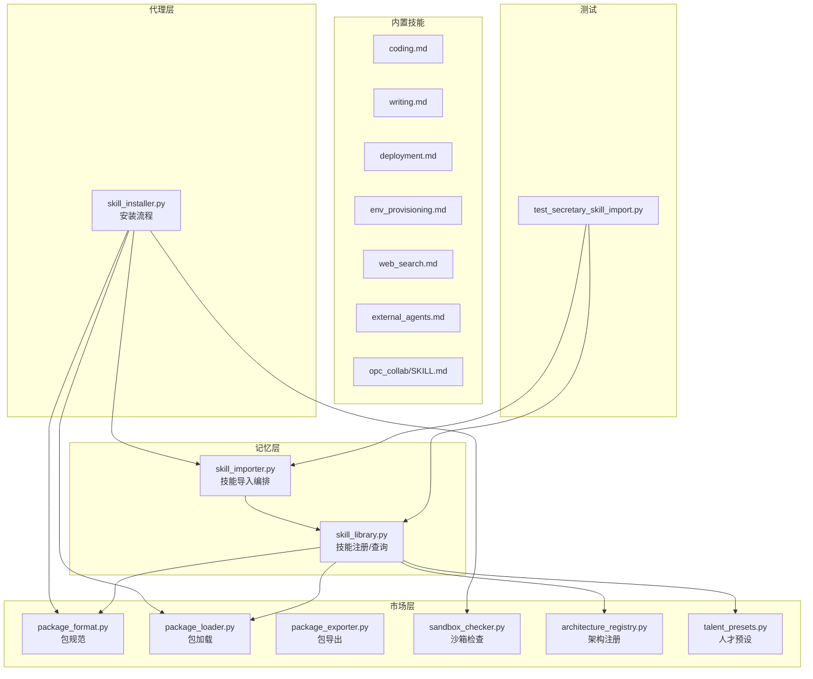
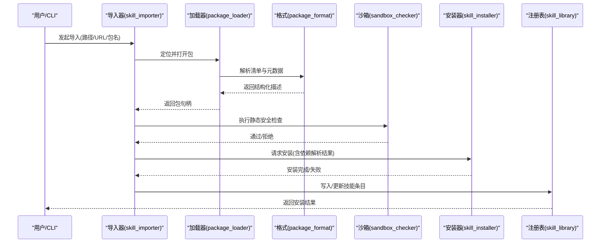
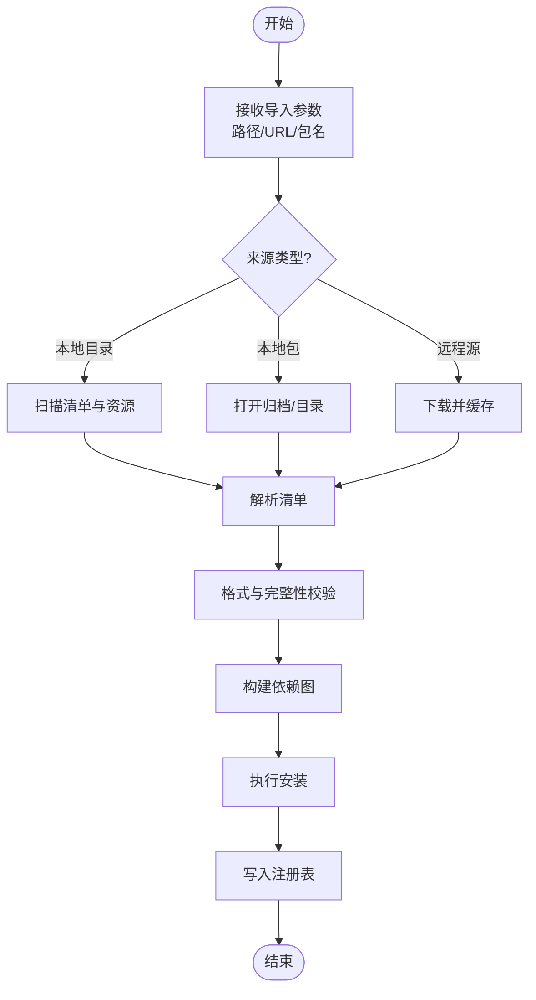
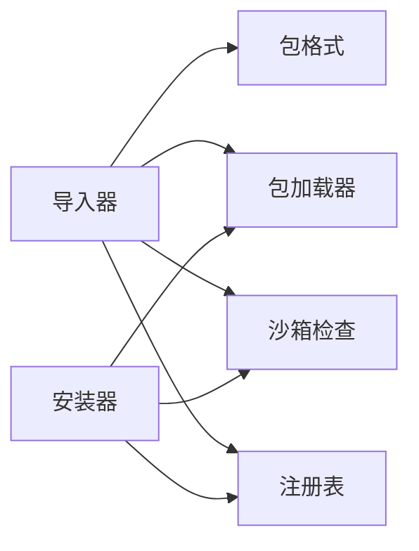

# 技能库管理

<cite>
**本文引用的文件**   
- [skill_library.py](file://opc/layer5_memory/skill_library.py)
- [skill_importer.py](file://opc/layer5_memory/skill_importer.py)
- [skill_installer.py](file://opc/layer3_agent/skill_installer.py)
- [package_format.py](file://opc/market/package_format.py)
- [package_loader.py](file://opc/market/package_loader.py)
- [package_exporter.py](file://opc/market/package_exporter.py)
- [sandbox_checker.py](file://opc/market/sandbox_checker.py)
- [architecture_registry.py](file://opc/market/architecture_registry.py)
- [talent_presets.py](file://opc/market/talent_presets.py)
- [coding.md](file://skills/core/coding.md)
- [writing.md](file://skills/core/writing.md)
- [deployment.md](file://skills/core/deployment.md)
- [env_provisioning.md](file://skills/core/env_provisioning.md)
- [web_search.md](file://skills/core/web_search.md)
- [external_agents.md](file://skills/core/external_agents.md)
- [SKILL.md](file://opc/skills_assets/opc_collab/SKILL.md)
- [test_secretary_skill_import.py](file://tests/test_secretary_skill_import.py)
</cite>

## 目录
1. [简介](#简介)
2. [项目结构](#项目结构)
3. [核心组件](#核心组件)
4. [架构总览](#架构总览)
5. [详细组件分析](#详细组件分析)
6. [依赖关系分析](#依赖关系分析)
7. [性能与扩展性](#性能与扩展性)
8. [故障排查指南](#故障排查指南)
9. [结论](#结论)
10. [附录](#附录)

## 简介
本文件面向OpenOPC的技能库管理系统，系统性阐述技能（Skill）的架构设计、存储机制、元数据管理、版本控制与依赖解析；详解内置技能的结构与组织方式，覆盖编码、写作、部署、环境配置等核心技能；完整说明技能的导入机制（文件系统、网络包、外部源），并给出验证、格式检查与兼容性测试方法。最后提供实际开发案例与调试建议，帮助开发者构建高质量、可复用的技能。

## 项目结构
技能相关代码主要分布在以下模块：
- 记忆层（技能注册与导入）：opc/layer5_memory/skill_library.py、opc/layer5_memory/skill_importer.py
- 代理层（安装器）：opc/layer3_agent/skill_installer.py
- 市场层（包格式、加载、导出、沙箱检查、架构注册、预设）：opc/market/*
- 内置技能文档：skills/core/*.md、opc/skills_assets/opc_collab/SKILL.md
- 测试用例：tests/test_secretary_skill_import.py

图表来源
- [skill_library.py](file://opc/layer5_memory/skill_library.py)
- [skill_importer.py](file://opc/layer5_memory/skill_importer.py)
- [skill_installer.py](file://opc/layer3_agent/skill_installer.py)
- [package_format.py](file://opc/market/package_format.py)
- [package_loader.py](file://opc/market/package_loader.py)
- [package_exporter.py](file://opc/market/package_exporter.py)
- [sandbox_checker.py](file://opc/market/sandbox_checker.py)
- [architecture_registry.py](file://opc/market/architecture_registry.py)
- [talent_presets.py](file://opc/market/talent_presets.py)
- [coding.md](file://skills/core/coding.md)
- [writing.md](file://skills/core/writing.md)
- [deployment.md](file://skills/core/deployment.md)
- [env_provisioning.md](file://skills/core/env_provisioning.md)
- [web_search.md](file://skills/core/web_search.md)
- [external_agents.md](file://skills/core/external_agents.md)
- [SKILL.md](file://opc/skills_assets/opc_collab/SKILL.md)
- [test_secretary_skill_import.py](file://tests/test_secretary_skill_import.py)

章节来源
- [skill_library.py](file://opc/layer5_memory/skill_library.py)
- [skill_importer.py](file://opc/layer5_memory/skill_importer.py)
- [skill_installer.py](file://opc/layer3_agent/skill_installer.py)
- [package_format.py](file://opc/market/package_format.py)
- [package_loader.py](file://opc/market/package_loader.py)
- [package_exporter.py](file://opc/market/package_exporter.py)
- [sandbox_checker.py](file://opc/market/sandbox_checker.py)
- [architecture_registry.py](file://opc/market/architecture_registry.py)
- [talent_presets.py](file://opc/market/talent_presets.py)
- [coding.md](file://skills/core/coding.md)
- [writing.md](file://skills/core/writing.md)
- [deployment.md](file://skills/core/deployment.md)
- [env_provisioning.md](file://skills/core/env_provisioning.md)
- [web_search.md](file://skills/core/web_search.md)
- [external_agents.md](file://skills/core/external_agents.md)
- [SKILL.md](file://opc/skills_assets/opc_collab/SKILL.md)
- [test_secretary_skill_import.py](file://tests/test_secretary_skill_import.py)

## 核心组件
- 技能注册表（skill_library.py）
  - 职责：维护已发现/已安装技能的索引，提供按名称、标签、版本的查询能力；负责将导入结果持久化到内存或后端存储。
  - 关键点：支持多来源合并（本地目录、包、远程仓库）、去重策略、版本选择策略（如最新稳定版）。
- 技能导入器（skill_importer.py）
  - 职责：统一入口，协调从文件系统、压缩包、远程源拉取、校验、解析、安装到注册表的完整流程。
  - 关键点：输入规范化、依赖图构建、冲突检测、回滚与幂等。
- 技能安装器（skill_installer.py）
  - 职责：在代理运行时侧执行安装动作，包括资源复制、权限设置、沙箱检查、预检与后置钩子。
  - 关键点：与包加载器、沙箱检查器协作，确保安装安全与一致性。
- 包格式与加载（package_format.py, package_loader.py）
  - 职责：定义技能包的目录结构、清单字段、版本语义、依赖声明；实现从磁盘/归档中读取与解析。
  - 关键点：清单校验、字段约束、向后兼容处理。
- 包导出（package_exporter.py）
  - 职责：将已安装技能打包为可分发格式，包含清单、资源与可选的签名信息。
- 沙箱检查（sandbox_checker.py）
  - 职责：在安装前对技能进行静态安全检查，限制危险操作、路径访问、系统调用等。
- 架构注册与预设（architecture_registry.py, talent_presets.py）
  - 职责：将技能与架构角色/能力映射，提供默认技能集与推荐组合。

章节来源
- [skill_library.py](file://opc/layer5_memory/skill_library.py)
- [skill_importer.py](file://opc/layer5_memory/skill_importer.py)
- [skill_installer.py](file://opc/layer3_agent/skill_installer.py)
- [package_format.py](file://opc/market/package_format.py)
- [package_loader.py](file://opc/market/package_loader.py)
- [package_exporter.py](file://opc/market/package_exporter.py)
- [sandbox_checker.py](file://opc/market/sandbox_checker.py)
- [architecture_registry.py](file://opc/market/architecture_registry.py)
- [talent_presets.py](file://opc/market/talent_presets.py)

## 架构总览
技能生命周期由“导入—校验—安装—注册—使用”构成，关键交互如下：

图表来源
- [skill_importer.py](file://opc/layer5_memory/skill_importer.py)
- [package_loader.py](file://opc/market/package_loader.py)
- [package_format.py](file://opc/market/package_format.py)
- [sandbox_checker.py](file://opc/market/sandbox_checker.py)
- [skill_installer.py](file://opc/layer3_agent/skill_installer.py)
- [skill_library.py](file://opc/layer5_memory/skill_library.py)

## 详细组件分析

### 技能注册表（skill_library.py）
- 数据结构
  - 技能条目：包含标识、名称、版本、来源、标签、依赖列表、状态、时间戳等。
  - 索引：按名称、版本区间、标签建立快速查找。
- 关键行为
  - 新增/更新：幂等写入，冲突时采用版本策略（如最大稳定版本）。
  - 查询：按名称+版本范围、标签过滤、来源筛选。
  - 清理：卸载后清理索引与残留。
- 复杂度
  - 插入/更新：O(log n) 或 O(1) 取决于索引结构。
  - 查询：平均 O(1)~O(log n)。
- 错误处理
  - 重复安装：返回已存在或升级提示。
  - 版本不兼容：抛出明确异常并记录原因。

章节来源
- [skill_library.py](file://opc/layer5_memory/skill_library.py)

### 技能导入器（skill_importer.py）
- 输入类型
  - 本地目录：扫描清单与资源。
  - 本地包：解压并解析。
  - 远程源：下载、缓存、校验。
- 流程要点
  - 规范化输入路径/URL。
  - 解析清单，构建依赖图。
  - 冲突检测与解决策略（强制覆盖/跳过/提示）。
  - 调用安装器执行安装。
  - 注册成功后提交事务。
- 幂等与回滚
  - 安装失败自动回滚已变更项。
  - 支持重试与断点续装。

章节来源
- [skill_importer.py](file://opc/layer5_memory/skill_importer.py)

### 技能安装器（skill_installer.py）
- 职责边界
  - 资源落盘、权限设置、软链接/快捷方式创建。
  - 触发预检/后置钩子（如初始化脚本）。
  - 与沙箱检查器联动，拦截高风险操作。
- 并发与安全
  - 单技能串行安装，避免竞争条件。
  - 隔离工作区，防止污染宿主环境。

章节来源
- [skill_installer.py](file://opc/layer3_agent/skill_installer.py)

### 包格式与加载（package_format.py, package_loader.py）
- 包结构
  - 根清单：包含名称、版本、描述、作者、许可证、依赖、入口、资源清单等。
  - 资源目录：脚本、模板、配置文件、静态资源。
- 加载流程
  - 打开包（目录/归档）。
  - 读取并校验清单。
  - 生成内部表示供上层消费。
- 兼容性
  - 支持多版本清单字段，缺失字段提供默认值。
  - 废弃字段告警但不阻断。

章节来源
- [package_format.py](file://opc/market/package_format.py)
- [package_loader.py](file://opc/market/package_loader.py)

### 包导出（package_exporter.py）
- 功能
  - 将已安装技能打包为可分发格式。
  - 可选签名与完整性校验信息。
- 输出
  - 标准化包结构，便于二次分发与复用。

章节来源
- [package_exporter.py](file://opc/market/package_exporter.py)

### 沙箱检查（sandbox_checker.py）
- 规则
  - 禁止直接系统调用、危险路径访问、动态加载不受控模块。
  - 白名单机制：允许受控API与受限IO。
- 集成
  - 安装前静态扫描，违规则拒绝安装。
  - 提供报告与修复建议。

章节来源
- [sandbox_checker.py](file://opc/market/sandbox_checker.py)

### 架构注册与预设（architecture_registry.py, talent_presets.py）
- 架构注册
  - 将技能与架构角色绑定，形成能力矩阵。
- 人才预设
  - 提供常用技能组合与推荐安装顺序。

章节来源
- [architecture_registry.py](file://opc/market/architecture_registry.py)
- [talent_presets.py](file://opc/market/talent_presets.py)

### 内置技能结构与组织
- 位置
  - skills/core/*.md：核心技能说明与约定。
  - opc/skills_assets/opc_collab/SKILL.md：协作类技能示例。
- 典型技能
  - 编码（coding.md）：代码生成、重构、审查、单元测试生成等约定。
  - 写作（writing.md）：文档撰写、风格指南、版本化发布流程。
  - 部署（deployment.md）：构建、镜像、发布、回滚策略。
  - 环境配置（env_provisioning.md）：依赖安装、环境变量、容器化。
  - 网页搜索（web_search.md）：检索、摘要、引用溯源。
  - 外部代理（external_agents.md）：与外部Agent通信协议与鉴权。
- 组织原则
  - 每个技能一个Markdown说明，配合清单与资源目录。
  - 通过清单声明依赖与入口，便于自动装配。

章节来源
- [coding.md](file://skills/core/coding.md)
- [writing.md](file://skills/core/writing.md)
- [deployment.md](file://skills/core/deployment.md)
- [env_provisioning.md](file://skills/core/env_provisioning.md)
- [web_search.md](file://skills/core/web_search.md)
- [external_agents.md](file://skills/core/external_agents.md)
- [SKILL.md](file://opc/skills_assets/opc_collab/SKILL.md)

### 技能导入机制（文件系统、网络包、外部源）
- 文件系统导入
  - 指定本地目录或包文件，导入器扫描清单并执行安装。
- 网络包导入
  - 支持HTTP/HTTPS下载，校验哈希，缓存至本地。
- 外部源导入
  - 通过注册表/仓库接口获取元数据，按需拉取。
- 通用流程
  - 解析→校验→依赖解析→安装→注册。

图表来源
- [skill_importer.py](file://opc/layer5_memory/skill_importer.py)
- [package_loader.py](file://opc/market/package_loader.py)
- [package_format.py](file://opc/market/package_format.py)

章节来源
- [skill_importer.py](file://opc/layer5_memory/skill_importer.py)
- [package_loader.py](file://opc/market/package_loader.py)
- [package_format.py](file://opc/market/package_format.py)

### 技能验证、格式检查与兼容性测试
- 清单校验
  - 必填字段、类型约束、版本语义、依赖声明合法性。
- 静态检查
  - 沙箱规则扫描，危险模式告警。
- 兼容性测试
  - 最小运行环境检查、依赖可用性探测。
- 自动化
  - 通过测试用例驱动端到端验证。

章节来源
- [sandbox_checker.py](file://opc/market/sandbox_checker.py)
- [package_format.py](file://opc/market/package_format.py)
- [test_secretary_skill_import.py](file://tests/test_secretary_skill_import.py)

### 实际技能开发案例与调试方法
- 开发步骤
  - 新建技能目录，编写清单与说明文档。
  - 实现入口脚本/工具，遵循约定命名与参数契约。
  - 编写测试与沙箱自检脚本。
  - 本地导入验证，再打包分发。
- 调试技巧
  - 启用详细日志，观察导入/安装阶段输出。
  - 使用沙箱检查报告定位风险点。
  - 逐步缩小问题范围：清单→依赖→安装→注册。

章节来源
- [skill_importer.py](file://opc/layer5_memory/skill_importer.py)
- [sandbox_checker.py](file://opc/market/sandbox_checker.py)
- [test_secretary_skill_import.py](file://tests/test_secretary_skill_import.py)

## 依赖关系分析
- 组件耦合
  - 导入器强依赖加载器与格式定义；安装器依赖加载器与沙箱检查器；注册表被导入器与安装器共同使用。
- 外部依赖
  - 包格式与加载器可能依赖标准库归档与序列化模块。
  - 网络导入依赖HTTP客户端。
- 潜在循环
  - 当前分层清晰，未见明显循环依赖。

图表来源
- [skill_importer.py](file://opc/layer5_memory/skill_importer.py)
- [package_format.py](file://opc/market/package_format.py)
- [package_loader.py](file://opc/market/package_loader.py)
- [sandbox_checker.py](file://opc/market/sandbox_checker.py)
- [skill_library.py](file://opc/layer5_memory/skill_library.py)
- [skill_installer.py](file://opc/layer3_agent/skill_installer.py)

章节来源
- [skill_importer.py](file://opc/layer5_memory/skill_importer.py)
- [package_format.py](file://opc/market/package_format.py)
- [package_loader.py](file://opc/market/package_loader.py)
- [sandbox_checker.py](file://opc/market/sandbox_checker.py)
- [skill_library.py](file://opc/layer5_memory/skill_library.py)
- [skill_installer.py](file://opc/layer3_agent/skill_installer.py)

## 性能与扩展性
- 性能
  - 注册表查询应使用索引优化，避免全量扫描。
  - 导入过程支持并行下载与增量校验，减少等待。
- 扩展性
  - 插件式加载器：支持自定义包格式与来源。
  - 钩子系统：安装前后扩展点，便于接入CI/CD与审计。
- 可靠性
  - 幂等安装与回滚，保证多次导入一致。
  - 失败重试与断点续传。

[本节为通用指导，无需具体文件来源]

## 故障排查指南
- 常见问题
  - 清单字段缺失或类型错误：检查包格式定义与清单内容。
  - 依赖未满足：查看依赖图与最小环境要求。
  - 沙箱检查失败：根据报告修复危险操作或申请白名单。
  - 安装中断：确认磁盘空间、权限与网络连通性。
- 定位手段
  - 开启详细日志，关注导入/安装阶段。
  - 使用测试用例复现问题，逐步缩小范围。
  - 导出包后进行离线校验与回放。

章节来源
- [package_format.py](file://opc/market/package_format.py)
- [sandbox_checker.py](file://opc/market/sandbox_checker.py)
- [test_secretary_skill_import.py](file://tests/test_secretary_skill_import.py)

## 结论
OpenOPC技能库管理系统以清晰的层次划分与严格的包格式约束，实现了从导入、校验、安装到注册的完整闭环。通过沙箱检查与兼容性测试保障安全性与稳定性，借助注册表与预设提升可发现性与易用性。遵循本文档的开发与调试实践，可高效构建高质量、可复用的技能。

[本节为总结，无需具体文件来源]

## 附录
- 术语
  - 技能：具备独立清单与资源的可复用能力单元。
  - 清单：描述技能元数据、依赖与入口的结构化文件。
  - 注册表：维护已安装/可用技能的索引与状态。
- 参考
  - 内置技能说明文档位于 skills/core 与 opc/skills_assets 目录。

[本节为补充信息，无需具体文件来源]