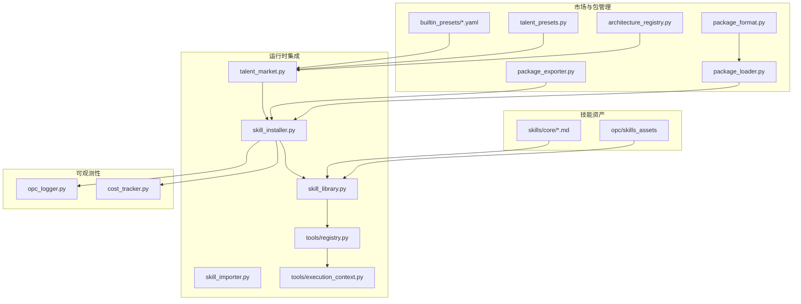
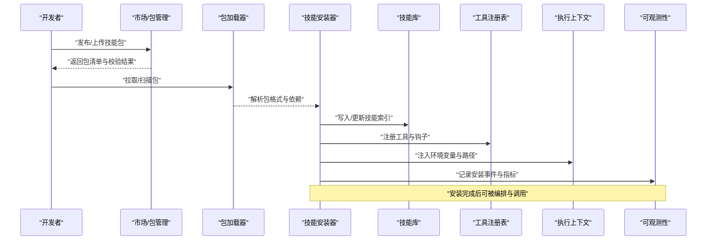
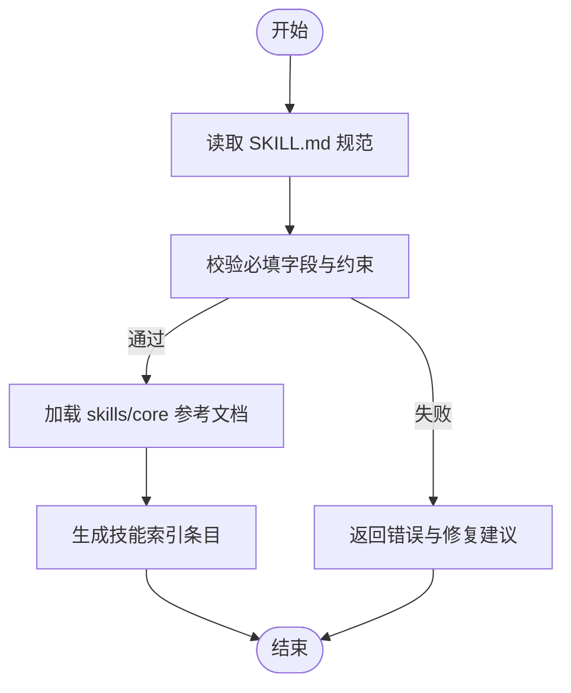
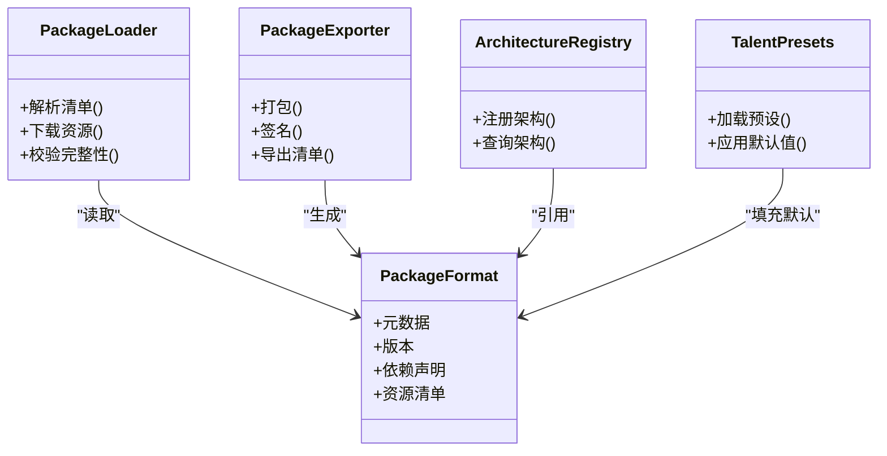
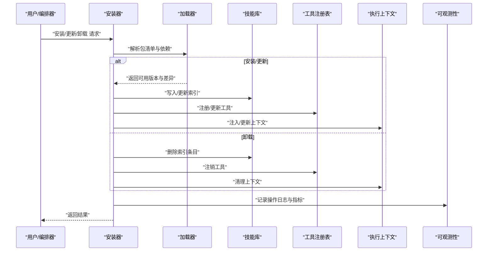
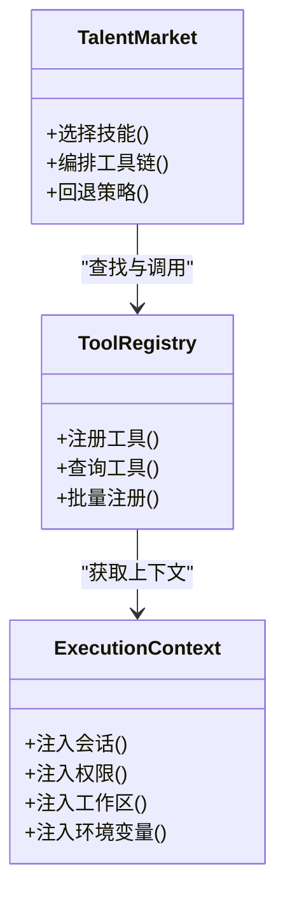
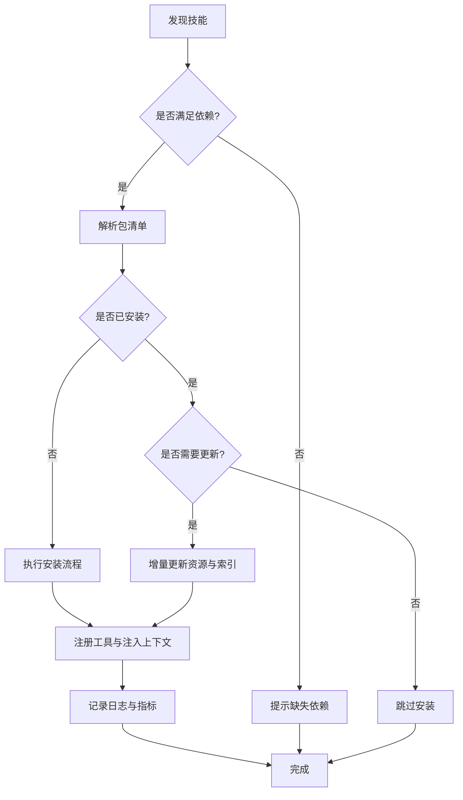
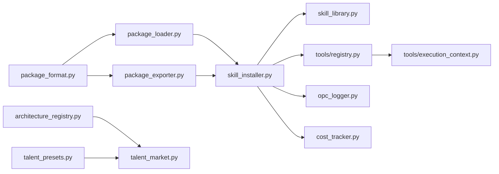

# 技能生态系统

<cite>
**本文引用的文件**   
- [opc/skills_assets/__init__.py](file://opc/skills_assets/__init__.py)
- [opc/skills_assets/opc_collab/SKILL.md](file://opc/skills_assets/opc_collab/SKILL.md)
- [skills/core/coding.md](file://skills/core/coding.md)
- [skills/core/writing.md](file://skills/core/writing.md)
- [skills/core/deployment.md](file://skills/core/deployment.md)
- [skills/core/env_provisioning.md](file://skills/core/env_provisioning.md)
- [skills/core/external_agents.md](file://skills/core/external_agents.md)
- [skills/core/web_search.md](file://skills/core/web_search.md)
- [opc/market/package_format.py](file://opc/market/package_format.py)
- [opc/market/package_loader.py](file://opc/market/package_loader.py)
- [opc/market/package_exporter.py](file://opc/market/package_exporter.py)
- [opc/market/architecture_registry.py](file://opc/market/architecture_registry.py)
- [opc/market/talent_presets.py](file://opc/market/talent_presets.py)
- [opc/market/builtin_presets/vc_investment_firm.yaml](file://opc/market/builtin_presets/vc_investment_firm.yaml)
- [opc/layer5_memory/skill_library.py](file://opc/layer5_memory/skill_library.py)
- [opc/layer5_memory/skill_importer.py](file://opc/layer5_memory/skill_importer.py)
- [opc/layer3_agent/skill_installer.py](file://opc/layer3_agent/skill_installer.py)
- [opc/layer4_tools/registry.py](file://opc/layer4_tools/registry.py)
- [opc/layer4_tools/execution_context.py](file://opc/layer4_tools/execution_context.py)
- [opc/layer2_organization/talent_market.py](file://opc/layer2_organization/talent_market.py)
- [opc/layer6_observability/opc_logger.py](file://opc/layer6_observability/opc_logger.py)
- [opc/layer6_observability/cost_tracker.py](file://opc/layer6_observability/cost_tracker.py)
</cite>

## 目录
1. [简介](#简介)
2. [项目结构](#项目结构)
3. [核心组件](#核心组件)
4. [架构总览](#架构总览)
5. [详细组件分析](#详细组件分析)
6. [依赖关系分析](#依赖关系分析)
7. [性能考量](#性能考量)
8. [故障排查指南](#故障排查指南)
9. [结论](#结论)
10. [附录](#附录)

## 简介
本文件面向OpenOPC的技能生态系统，系统性阐述技能的定义格式、安装机制与版本管理；解析内置技能库的组织方式（编码、写作、部署等）；说明技能市场的包管理机制、依赖解析与安全校验；提供自定义技能开发指南（SKILL.md规范、工具调用与上下文管理）；覆盖技能的发现、安装、更新与卸载流程；并给出质量评估、性能监控与最佳实践建议，以及实际开发与调试方法。

## 项目结构
技能生态相关代码主要分布在以下模块：
- 技能资产与内置技能
  - opc/skills_assets：内置技能资源与元数据入口
  - skills/core：核心技能文档（编码、写作、部署、环境准备、外部代理、网页搜索）
- 市场与包管理
  - opc/market：包格式、加载器、导出器、架构注册表、人才预设与内置预设
- 运行时集成
  - layer3_agent/skill_installer.py：技能安装器
  - layer5_memory/skill_library.py 与 skill_importer.py：技能库与导入器
  - layer4_tools/registry.py 与 execution_context.py：工具注册与执行上下文
  - layer2_organization/talent_market.py：人才市场编排
- 可观测性
  - layer6_observability：日志与成本追踪

图表来源
- [opc/skills_assets/__init__.py](file://opc/skills_assets/__init__.py)
- [skills/core/coding.md](file://skills/core/coding.md)
- [skills/core/writing.md](file://skills/core/writing.md)
- [skills/core/deployment.md](file://skills/core/deployment.md)
- [skills/core/env_provisioning.md](file://skills/core/env_provisioning.md)
- [skills/core/external_agents.md](file://skills/core/external_agents.md)
- [skills/core/web_search.md](file://skills/core/web_search.md)
- [opc/market/package_format.py](file://opc/market/package_format.py)
- [opc/market/package_loader.py](file://opc/market/package_loader.py)
- [opc/market/package_exporter.py](file://opc/market/package_exporter.py)
- [opc/market/architecture_registry.py](file://opc/market/architecture_registry.py)
- [opc/market/talent_presets.py](file://opc/market/talent_presets.py)
- [opc/market/builtin_presets/vc_investment_firm.yaml](file://opc/market/builtin_presets/vc_investment_firm.yaml)
- [opc/layer3_agent/skill_installer.py](file://opc/layer3_agent/skill_installer.py)
- [opc/layer5_memory/skill_library.py](file://opc/layer5_memory/skill_library.py)
- [opc/layer5_memory/skill_importer.py](file://opc/layer5_memory/skill_importer.py)
- [opc/layer4_tools/registry.py](file://opc/layer4_tools/registry.py)
- [opc/layer4_tools/execution_context.py](file://opc/layer4_tools/execution_context.py)
- [opc/layer2_organization/talent_market.py](file://opc/layer2_organization/talent_market.py)
- [opc/layer6_observability/opc_logger.py](file://opc/layer6_observability/opc_logger.py)
- [opc/layer6_observability/cost_tracker.py](file://opc/layer6_observability/cost_tracker.py)

章节来源
- [opc/skills_assets/__init__.py](file://opc/skills_assets/__init__.py)
- [skills/core/coding.md](file://skills/core/coding.md)
- [skills/core/writing.md](file://skills/core/writing.md)
- [skills/core/deployment.md](file://skills/core/deployment.md)
- [skills/core/env_provisioning.md](file://skills/core/env_provisioning.md)
- [skills/core/external_agents.md](file://skills/core/external_agents.md)
- [skills/core/web_search.md](file://skills/core/web_search.md)
- [opc/market/package_format.py](file://opc/market/package_format.py)
- [opc/market/package_loader.py](file://opc/market/package_loader.py)
- [opc/market/package_exporter.py](file://opc/market/package_exporter.py)
- [opc/market/architecture_registry.py](file://opc/market/architecture_registry.py)
- [opc/market/talent_presets.py](file://opc/market/talent_presets.py)
- [opc/market/builtin_presets/vc_investment_firm.yaml](file://opc/market/builtin_presets/vc_investment_firm.yaml)
- [opc/layer3_agent/skill_installer.py](file://opc/layer3_agent/skill_installer.py)
- [opc/layer5_memory/skill_library.py](file://opc/layer5_memory/skill_library.py)
- [opc/layer5_memory/skill_importer.py](file://opc/layer5_memory/skill_importer.py)
- [opc/layer4_tools/registry.py](file://opc/layer4_tools/registry.py)
- [opc/layer4_tools/execution_context.py](file://opc/layer4_tools/execution_context.py)
- [opc/layer2_organization/talent_market.py](file://opc/layer2_organization/talent_market.py)
- [opc/layer6_observability/opc_logger.py](file://opc/layer6_observability/opc_logger.py)
- [opc/layer6_observability/cost_tracker.py](file://opc/layer6_observability/cost_tracker.py)

## 核心组件
- 技能资产与内置技能
  - 通过技能资产入口聚合内置技能资源，便于系统启动时快速发现与加载。
  - 核心技能文档位于 skills/core，涵盖编码、写作、部署、环境准备、外部代理与网页搜索等能力。
- 市场与包管理
  - package_format.py 定义包的元数据与结构契约。
  - package_loader.py 负责从本地或远程源加载包清单与内容。
  - package_exporter.py 支持将技能打包为可分发制品。
  - architecture_registry.py 维护架构级注册信息，供编排与发现使用。
  - talent_presets.py 与 builtin_presets 提供预置角色/架构模板。
- 运行时集成
  - skill_installer.py 实现技能的发现、安装、更新与卸载生命周期。
  - skill_library.py 维护已安装技能索引与查询接口。
  - skill_importer.py 负责将技能资源导入到内存/持久化存储。
  - tools/registry.py 与 execution_context.py 提供工具注册与执行上下文注入。
  - talent_market.py 在组织层面对技能进行编排与调度。
- 可观测性
  - opc_logger.py 与 cost_tracker.py 记录技能安装/运行过程与成本指标。

章节来源
- [opc/skills_assets/__init__.py](file://opc/skills_assets/__init__.py)
- [skills/core/coding.md](file://skills/core/coding.md)
- [skills/core/writing.md](file://skills/core/writing.md)
- [skills/core/deployment.md](file://skills/core/deployment.md)
- [skills/core/env_provisioning.md](file://skills/core/env_provisioning.md)
- [skills/core/external_agents.md](file://skills/core/external_agents.md)
- [skills/core/web_search.md](file://skills/core/web_search.md)
- [opc/market/package_format.py](file://opc/market/package_format.py)
- [opc/market/package_loader.py](file://opc/market/package_loader.py)
- [opc/market/package_exporter.py](file://opc/market/package_exporter.py)
- [opc/market/architecture_registry.py](file://opc/market/architecture_registry.py)
- [opc/market/talent_presets.py](file://opc/market/talent_presets.py)
- [opc/market/builtin_presets/vc_investment_firm.yaml](file://opc/market/builtin_presets/vc_investment_firm.yaml)
- [opc/layer3_agent/skill_installer.py](file://opc/layer3_agent/skill_installer.py)
- [opc/layer5_memory/skill_library.py](file://opc/layer5_memory/skill_library.py)
- [opc/layer5_memory/skill_importer.py](file://opc/layer5_memory/skill_importer.py)
- [opc/layer4_tools/registry.py](file://opc/layer4_tools/registry.py)
- [opc/layer4_tools/execution_context.py](file://opc/layer4_tools/execution_context.py)
- [opc/layer2_organization/talent_market.py](file://opc/layer2_organization/talent_market.py)
- [opc/layer6_observability/opc_logger.py](file://opc/layer6_observability/opc_logger.py)
- [opc/layer6_observability/cost_tracker.py](file://opc/layer6_observability/cost_tracker.py)

## 架构总览
技能生态围绕“定义—打包—发现—安装—编排—执行—观测”的闭环构建。

图表来源
- [opc/market/package_format.py](file://opc/market/package_format.py)
- [opc/market/package_loader.py](file://opc/market/package_loader.py)
- [opc/layer3_agent/skill_installer.py](file://opc/layer3_agent/skill_installer.py)
- [opc/layer5_memory/skill_library.py](file://opc/layer5_memory/skill_library.py)
- [opc/layer4_tools/registry.py](file://opc/layer4_tools/registry.py)
- [opc/layer4_tools/execution_context.py](file://opc/layer4_tools/execution_context.py)
- [opc/layer6_observability/opc_logger.py](file://opc/layer6_observability/opc_logger.py)
- [opc/layer6_observability/cost_tracker.py](file://opc/layer6_observability/cost_tracker.py)

## 详细组件分析

### 技能定义与内置技能库
- SKILL.md 规范
  - 用于描述技能的能力边界、输入输出约定、工具调用方式与上下文要求。
  - 内置示例参考 opc/skills_assets/opc_collab/SKILL.md。
- 核心技能文档
  - skills/core 下包含编码、写作、部署、环境准备、外部代理与网页搜索等主题文档，作为技能编写与实现的权威参考。
- 组织方式
  - 技能资产入口集中管理内置技能资源，配合核心文档形成“资源+规范”的双轨体系。

图表来源
- [opc/skills_assets/opc_collab/SKILL.md](file://opc/skills_assets/opc_collab/SKILL.md)
- [skills/core/coding.md](file://skills/core/coding.md)
- [skills/core/writing.md](file://skills/core/writing.md)
- [skills/core/deployment.md](file://skills/core/deployment.md)
- [skills/core/env_provisioning.md](file://skills/core/env_provisioning.md)
- [skills/core/external_agents.md](file://skills/core/external_agents.md)
- [skills/core/web_search.md](file://skills/core/web_search.md)

章节来源
- [opc/skills_assets/opc_collab/SKILL.md](file://opc/skills_assets/opc_collab/SKILL.md)
- [skills/core/coding.md](file://skills/core/coding.md)
- [skills/core/writing.md](file://skills/core/writing.md)
- [skills/core/deployment.md](file://skills/core/deployment.md)
- [skills/core/env_provisioning.md](file://skills/core/env_provisioning.md)
- [skills/core/external_agents.md](file://skills/core/external_agents.md)
- [skills/core/web_search.md](file://skills/core/web_search.md)

### 包管理与依赖解析
- 包格式
  - package_format.py 定义包的元数据、版本、依赖声明与资源清单。
- 加载与导出
  - package_loader.py 负责从本地/远程源解析包清单与内容。
  - package_exporter.py 支持将技能打包为可分发的制品。
- 依赖解析
  - 基于包格式中的依赖声明，解析最小兼容版本集，避免冲突。
- 安全校验
  - 在加载阶段对包签名、来源可信度与资源白名单进行检查。
- 架构与预设
  - architecture_registry.py 维护架构级注册信息。
  - talent_presets.py 与 builtin_presets 提供预置模板，加速部署。

图表来源
- [opc/market/package_format.py](file://opc/market/package_format.py)
- [opc/market/package_loader.py](file://opc/market/package_loader.py)
- [opc/market/package_exporter.py](file://opc/market/package_exporter.py)
- [opc/market/architecture_registry.py](file://opc/market/architecture_registry.py)
- [opc/market/talent_presets.py](file://opc/market/talent_presets.py)
- [opc/market/builtin_presets/vc_investment_firm.yaml](file://opc/market/builtin_presets/vc_investment_firm.yaml)

章节来源
- [opc/market/package_format.py](file://opc/market/package_format.py)
- [opc/market/package_loader.py](file://opc/market/package_loader.py)
- [opc/market/package_exporter.py](file://opc/market/package_exporter.py)
- [opc/market/architecture_registry.py](file://opc/market/architecture_registry.py)
- [opc/market/talent_presets.py](file://opc/market/talent_presets.py)
- [opc/market/builtin_presets/vc_investment_firm.yaml](file://opc/market/builtin_presets/vc_investment_firm.yaml)

### 安装、更新与卸载流程
- 安装
  - 通过 skill_installer.py 触发，结合 package_loader.py 解析包，写入 skill_library.py 索引，并在 tools/registry.py 注册工具。
- 更新
  - 对比版本号与依赖变更，增量替换资源并刷新索引。
- 卸载
  - 移除索引条目、清理注册的工具与临时资源，回滚上下文注入。

图表来源
- [opc/layer3_agent/skill_installer.py](file://opc/layer3_agent/skill_installer.py)
- [opc/market/package_loader.py](file://opc/market/package_loader.py)
- [opc/layer5_memory/skill_library.py](file://opc/layer5_memory/skill_library.py)
- [opc/layer4_tools/registry.py](file://opc/layer4_tools/registry.py)
- [opc/layer4_tools/execution_context.py](file://opc/layer4_tools/execution_context.py)
- [opc/layer6_observability/opc_logger.py](file://opc/layer6_observability/opc_logger.py)
- [opc/layer6_observability/cost_tracker.py](file://opc/layer6_observability/cost_tracker.py)

章节来源
- [opc/layer3_agent/skill_installer.py](file://opc/layer3_agent/skill_installer.py)
- [opc/market/package_loader.py](file://opc/market/package_loader.py)
- [opc/layer5_memory/skill_library.py](file://opc/layer5_memory/skill_library.py)
- [opc/layer4_tools/registry.py](file://opc/layer4_tools/registry.py)
- [opc/layer4_tools/execution_context.py](file://opc/layer4_tools/execution_context.py)
- [opc/layer6_observability/opc_logger.py](file://opc/layer6_observability/opc_logger.py)
- [opc/layer6_observability/cost_tracker.py](file://opc/layer6_observability/cost_tracker.py)

### 工具调用与上下文管理
- 工具注册
  - tools/registry.py 提供统一的工具注册与查询接口，确保技能在执行期能正确发现与调用工具。
- 上下文注入
  - tools/execution_context.py 负责向工具注入会话、权限、工作区与环境变量等上下文信息。
- 编排集成
  - talent_market.py 在组织层面协调多技能协作，按任务需求选择与组合工具。

图表来源
- [opc/layer4_tools/registry.py](file://opc/layer4_tools/registry.py)
- [opc/layer4_tools/execution_context.py](file://opc/layer4_tools/execution_context.py)
- [opc/layer2_organization/talent_market.py](file://opc/layer2_organization/talent_market.py)

章节来源
- [opc/layer4_tools/registry.py](file://opc/layer4_tools/registry.py)
- [opc/layer4_tools/execution_context.py](file://opc/layer4_tools/execution_context.py)
- [opc/layer2_organization/talent_market.py](file://opc/layer2_organization/talent_market.py)

### 自定义技能开发指南
- SKILL.md 编写规范
  - 明确能力描述、输入输出契约、工具调用约定、权限与环境要求。
  - 参考内置示例与 core 文档保持一致风格与字段约定。
- 工具调用
  - 通过工具注册表暴露能力，确保参数校验与错误码统一。
- 上下文管理
  - 在 execution_context 中注入必要的环境与工作区信息，保证跨会话一致性。
- 版本管理
  - 遵循包格式的语义化版本规则，在依赖声明中指定兼容范围。
- 测试与验证
  - 使用可观测性日志与成本追踪辅助定位问题与评估性能。

章节来源
- [opc/skills_assets/opc_collab/SKILL.md](file://opc/skills_assets/opc_collab/SKILL.md)
- [skills/core/coding.md](file://skills/core/coding.md)
- [skills/core/writing.md](file://skills/core/writing.md)
- [skills/core/deployment.md](file://skills/core/deployment.md)
- [skills/core/env_provisioning.md](file://skills/core/env_provisioning.md)
- [skills/core/external_agents.md](file://skills/core/external_agents.md)
- [skills/core/web_search.md](file://skills/core/web_search.md)
- [opc/market/package_format.py](file://opc/market/package_format.py)
- [opc/layer4_tools/registry.py](file://opc/layer4_tools/registry.py)
- [opc/layer4_tools/execution_context.py](file://opc/layer4_tools/execution_context.py)
- [opc/layer6_observability/opc_logger.py](file://opc/layer6_observability/opc_logger.py)
- [opc/layer6_observability/cost_tracker.py](file://opc/layer6_observability/cost_tracker.py)

### 技能发现、安装、更新与卸载流程
- 发现
  - 通过 talent_market.py 与 architecture_registry.py 进行能力发现与匹配。
- 安装
  - 由 skill_installer.py 驱动，结合 package_loader.py 解析与校验。
- 更新
  - 比较版本与依赖差异，增量更新资源与索引。
- 卸载
  - 清理索引、工具注册与上下文注入，释放资源。

图表来源
- [opc/layer2_organization/talent_market.py](file://opc/layer2_organization/talent_market.py)
- [opc/market/architecture_registry.py](file://opc/market/architecture_registry.py)
- [opc/layer3_agent/skill_installer.py](file://opc/layer3_agent/skill_installer.py)
- [opc/market/package_loader.py](file://opc/market/package_loader.py)
- [opc/layer5_memory/skill_library.py](file://opc/layer5_memory/skill_library.py)
- [opc/layer4_tools/registry.py](file://opc/layer4_tools/registry.py)
- [opc/layer4_tools/execution_context.py](file://opc/layer4_tools/execution_context.py)
- [opc/layer6_observability/opc_logger.py](file://opc/layer6_observability/opc_logger.py)
- [opc/layer6_observability/cost_tracker.py](file://opc/layer6_observability/cost_tracker.py)

章节来源
- [opc/layer2_organization/talent_market.py](file://opc/layer2_organization/talent_market.py)
- [opc/market/architecture_registry.py](file://opc/market/architecture_registry.py)
- [opc/layer3_agent/skill_installer.py](file://opc/layer3_agent/skill_installer.py)
- [opc/market/package_loader.py](file://opc/market/package_loader.py)
- [opc/layer5_memory/skill_library.py](file://opc/layer5_memory/skill_library.py)
- [opc/layer4_tools/registry.py](file://opc/layer4_tools/registry.py)
- [opc/layer4_tools/execution_context.py](file://opc/layer4_tools/execution_context.py)
- [opc/layer6_observability/opc_logger.py](file://opc/layer6_observability/opc_logger.py)
- [opc/layer6_observability/cost_tracker.py](file://opc/layer6_observability/cost_tracker.py)

### 质量评估、性能监控与最佳实践
- 质量评估
  - 依据 SKILL.md 的契约完整性、工具调用稳定性与错误处理完备性进行评估。
- 性能监控
  - 使用 opc_logger.py 记录关键路径耗时与异常率。
  - 使用 cost_tracker.py 跟踪资源消耗与成本趋势。
- 最佳实践
  - 采用语义化版本与最小依赖原则。
  - 在工具注册表中显式声明权限与作用域。
  - 在 execution_context 中隔离工作区与敏感信息。
  - 利用 talent_market 的编排能力实现回退与重试策略。

章节来源
- [opc/skills_assets/opc_collab/SKILL.md](file://opc/skills_assets/opc_collab/SKILL.md)
- [opc/layer6_observability/opc_logger.py](file://opc/layer6_observability/opc_logger.py)
- [opc/layer6_observability/cost_tracker.py](file://opc/layer6_observability/cost_tracker.py)
- [opc/layer4_tools/registry.py](file://opc/layer4_tools/registry.py)
- [opc/layer4_tools/execution_context.py](file://opc/layer4_tools/execution_context.py)
- [opc/layer2_organization/talent_market.py](file://opc/layer2_organization/talent_market.py)

### 实际案例与调试方法
- 案例一：协作技能
  - 以 opc/skills_assets/opc_collab/SKILL.md 为蓝本，定义协作能力、工具调用与上下文要求，并通过 talent_market 编排与其他技能协同。
- 案例二：编码技能
  - 参考 skills/core/coding.md，实现代码生成与审查流程，注册工具并注入工作区上下文。
- 调试方法
  - 启用日志与成本追踪，定位安装与执行阶段的瓶颈。
  - 使用 talent_market 的回退策略验证容错能力。
  - 通过工具注册表的查询接口验证工具可见性与参数契约。

章节来源
- [opc/skills_assets/opc_collab/SKILL.md](file://opc/skills_assets/opc_collab/SKILL.md)
- [skills/core/coding.md](file://skills/core/coding.md)
- [opc/layer6_observability/opc_logger.py](file://opc/layer6_observability/opc_logger.py)
- [opc/layer6_observability/cost_tracker.py](file://opc/layer6_observability/cost_tracker.py)
- [opc/layer2_organization/talent_market.py](file://opc/layer2_organization/talent_market.py)
- [opc/layer4_tools/registry.py](file://opc/layer4_tools/registry.py)

## 依赖关系分析
- 组件耦合
  - 安装器强依赖包加载器与技能库；工具注册表与执行上下文为运行时支撑。
- 直接依赖
  - 包格式→加载器/导出器；注册表→上下文；市场→注册表/安装器。
- 间接依赖
  - 可观测性贯穿安装与执行链路，提供审计与指标。
- 潜在循环
  - 当前设计分层清晰，未见明显循环依赖风险。

图表来源
- [opc/market/package_format.py](file://opc/market/package_format.py)
- [opc/market/package_loader.py](file://opc/market/package_loader.py)
- [opc/market/package_exporter.py](file://opc/market/package_exporter.py)
- [opc/market/architecture_registry.py](file://opc/market/architecture_registry.py)
- [opc/market/talent_presets.py](file://opc/market/talent_presets.py)
- [opc/layer3_agent/skill_installer.py](file://opc/layer3_agent/skill_installer.py)
- [opc/layer5_memory/skill_library.py](file://opc/layer5_memory/skill_library.py)
- [opc/layer4_tools/registry.py](file://opc/layer4_tools/registry.py)
- [opc/layer4_tools/execution_context.py](file://opc/layer4_tools/execution_context.py)
- [opc/layer6_observability/opc_logger.py](file://opc/layer6_observability/opc_logger.py)
- [opc/layer6_observability/cost_tracker.py](file://opc/layer6_observability/cost_tracker.py)

章节来源
- [opc/market/package_format.py](file://opc/market/package_format.py)
- [opc/market/package_loader.py](file://opc/market/package_loader.py)
- [opc/market/package_exporter.py](file://opc/market/package_exporter.py)
- [opc/market/architecture_registry.py](file://opc/market/architecture_registry.py)
- [opc/market/talent_presets.py](file://opc/market/talent_presets.py)
- [opc/layer3_agent/skill_installer.py](file://opc/layer3_agent/skill_installer.py)
- [opc/layer5_memory/skill_library.py](file://opc/layer5_memory/skill_library.py)
- [opc/layer4_tools/registry.py](file://opc/layer4_tools/registry.py)
- [opc/layer4_tools/execution_context.py](file://opc/layer4_tools/execution_context.py)
- [opc/layer6_observability/opc_logger.py](file://opc/layer6_observability/opc_logger.py)
- [opc/layer6_observability/cost_tracker.py](file://opc/layer6_observability/cost_tracker.py)

## 性能考量
- 包加载与解析
  - 缓存包清单与校验结果，减少重复网络与I/O开销。
- 索引与注册
  - 增量更新技能索引与工具注册，避免全量重建。
- 上下文注入
  - 按需注入上下文，避免不必要的资源分配。
- 可观测性
  - 控制日志粒度与采样率，平衡可观测性与性能。

[本节为通用指导，不直接分析具体文件]

## 故障排查指南
- 常见问题
  - 包清单不完整或缺少必填字段：检查 package_format 契约与 SKILL.md 规范。
  - 依赖冲突：调整版本范围或引入架构注册表进行兼容性校验。
  - 工具不可见：确认工具注册表是否正确注册与上下文是否注入。
- 定位方法
  - 查看安装与执行日志，关注异常堆栈与指标波动。
  - 使用成本追踪识别高耗资源路径。
  - 在 talent_market 中启用回退策略验证容错。

章节来源
- [opc/market/package_format.py](file://opc/market/package_format.py)
- [opc/skills_assets/opc_collab/SKILL.md](file://opc/skills_assets/opc_collab/SKILL.md)
- [opc/layer4_tools/registry.py](file://opc/layer4_tools/registry.py)
- [opc/layer4_tools/execution_context.py](file://opc/layer4_tools/execution_context.py)
- [opc/layer6_observability/opc_logger.py](file://opc/layer6_observability/opc_logger.py)
- [opc/layer6_observability/cost_tracker.py](file://opc/layer6_observability/cost_tracker.py)
- [opc/layer2_organization/talent_market.py](file://opc/layer2_organization/talent_market.py)

## 结论
OpenOPC的技能生态以清晰的包格式与SKILL.md规范为基础，通过市场与安装器实现自动化发现与生命周期管理，借助工具注册与上下文注入保障运行时稳定，并以可观测性贯穿全流程。遵循本文档的最佳实践与调试方法，可有效提升技能质量与系统可靠性。

[本节为总结性内容，不直接分析具体文件]

## 附录
- 术语
  - 技能：具备明确能力边界与工具调用的可复用单元。
  - 包：包含元数据、资源与依赖声明的可分发制品。
  - 工具：在运行时被技能调用的具体能力实现。
  - 上下文：执行期注入的环境、权限与工作区信息。
- 参考路径
  - 内置技能示例：opc/skills_assets/opc_collab/SKILL.md
  - 核心技能文档：skills/core/*.md
  - 包格式与加载：opc/market/package_format.py、package_loader.py
  - 安装与编排：opc/layer3_agent/skill_installer.py、opc/layer2_organization/talent_market.py
  - 工具与上下文：opc/layer4_tools/registry.py、execution_context.py
  - 可观测性：opc/layer6_observability/opc_logger.py、cost_tracker.py

[本节为补充信息，不直接分析具体文件]