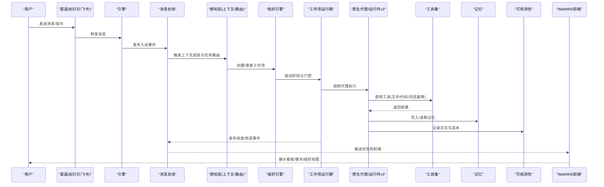
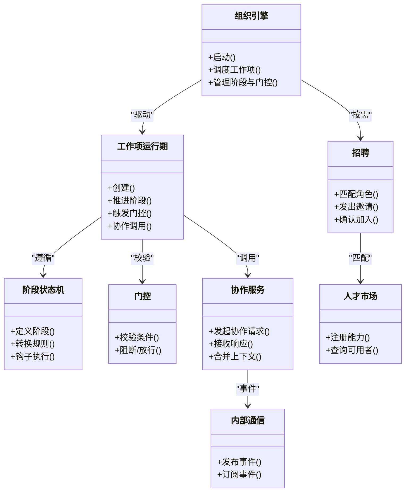
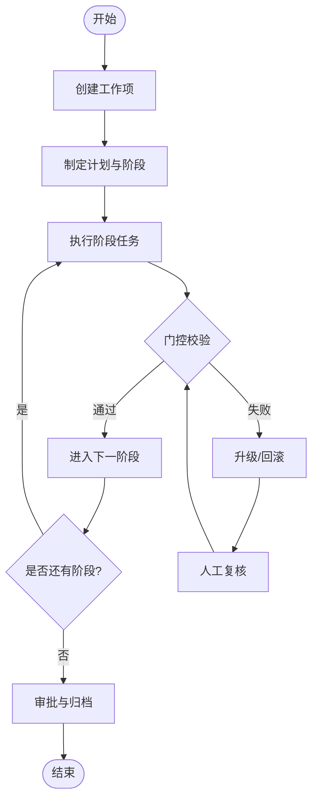
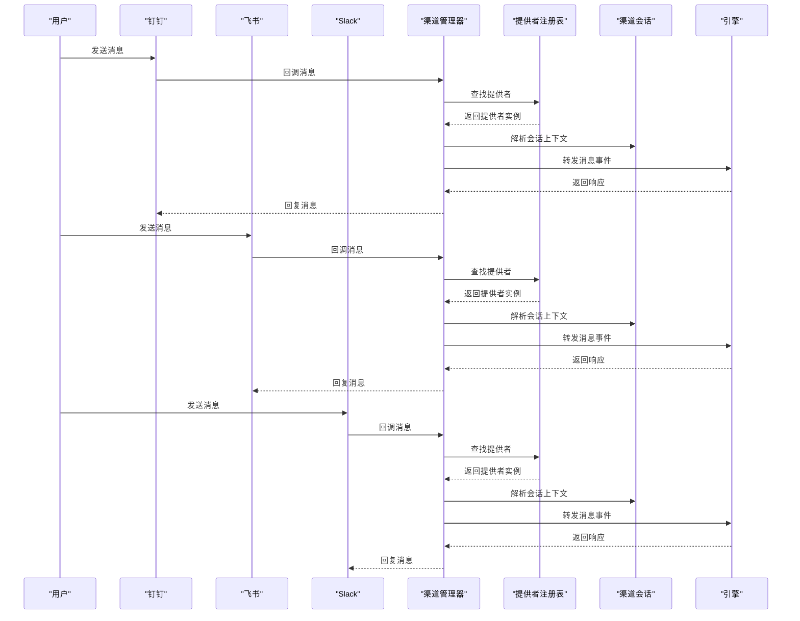
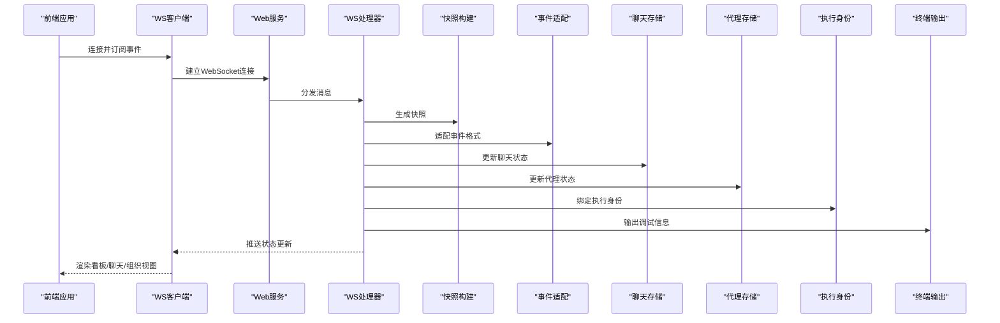
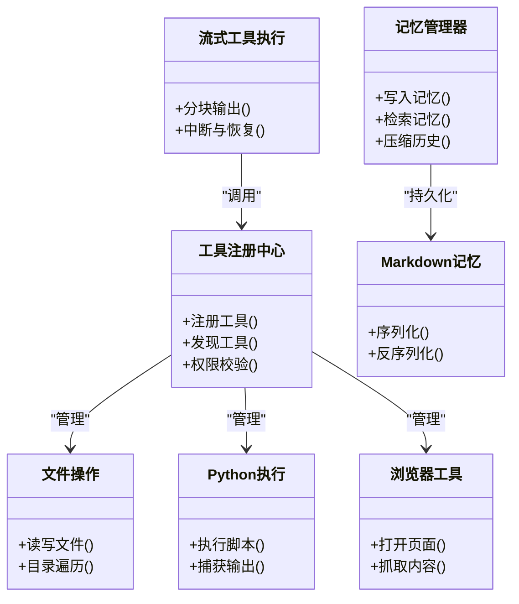
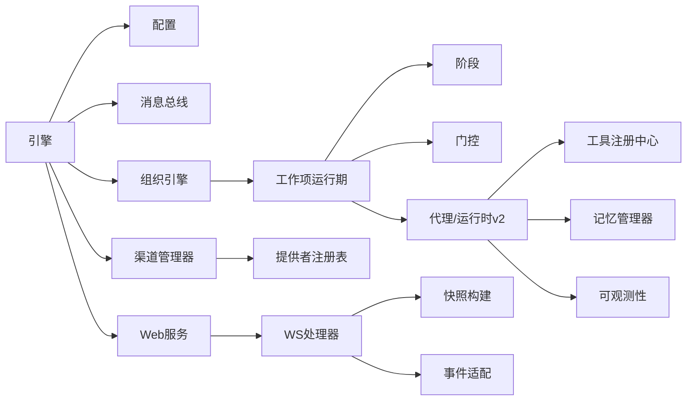

# 核心特性

<cite>
**本文引用的文件**   
- [README.md](file://README.md)
- [pyproject.toml](file://pyproject.toml)
- [opc/engine.py](file://opc/engine.py)
- [opc/cli/app.py](file://opc/cli/app.py)
- [opc/channels/manager.py](file://opc/channels/manager.py)
- [opc/channels/base.py](file://opc/channels/base.py)
- [opc/channels/provider_registry.py](file://opc/channels/provider_registry.py)
- [opc/channels/session.py](file://opc/channels/session.py)
- [opc/channels/dingtalk.py](file://opc/channels/dingtalk.py)
- [opc/channels/discord.py](file://opc/channels/discord.py)
- [opc/channels/email.py](file://opc/channels/email.py)
- [opc/channels/feishu.py](file://opc/channels/feishu.py)
- [opc/channels/matrix.py](file://opc/channels/matrix.py)
- [opc/channels/mochat.py](file://opc/channels/mochat.py)
- [opc/channels/provider_base.py](file://opc/channels/provider_base.py)
- [opc/channels/qq.py](file://opc/channels/qq.py)
- [opc/channels/slack.py](file://opc/channels/slack.py)
- [opc/channels/telegram.py](file://opc/channels/telegram.py)
- [opc/channels/whatsapp.py](file://opc/channels/whatsapp.py)
- [opc/core/config.py](file://opc/core/config.py)
- [opc/core/models.py](file://opc/core/models.py)
- [opc/core/events.py](file://opc/core/events.py)
- [opc/core/worker_envelope.py](file://opc/core/worker_envelope.py)
- [opc/database/store.py](file://opc/database/store.py)
- [opc/layer0_interaction/message_bus.py](file://opc/layer0_interaction/message_bus.py)
- [opc/layer1_perception/context_assembler.py](file://opc/layer1_perception/context_assembler.py)
- [opc/layer1_perception/context_loader.py](file://opc/layer1_perception/context_loader.py)
- [opc/layer1_perception/task_router.py](file://opc/layer1_perception/task_router.py)
- [opc/layer2_organization/org_engine.py](file://opc/layer2_organization/org_engine.py)
- [opc/layer2_organization/collaboration_service.py](file://opc/layer2_organization/collaboration_service.py)
- [opc/layer2_organization/comms.py](file://opc/layer2_organization/comms.py)
- [opc/layer2_organization/work_item_runtime.py](file://opc/layer2_organization/work_item_runtime.py)
- [opc/layer2_organization/work_item_transition.py](file://opc/layer2_organization/work_item_transition.py)
- [opc/layer2_organization/phase.py](file://opc/layer2_organization/phase.py)
- [opc/layer2_organization/gate_harness.py](file://opc/layer2_organization/gate_harness.py)
- [opc/layer2_organization/recruiter.py](file://opc/layer2_organization/recruiter.py)
- [opc/layer2_organization/talent_market.py](file://opc/layer2_organization/talent_market.py)
- [opc/layer3_agent/native_agent.py](file://opc/layer3_agent/native_agent.py)
- [opc/layer3_agent/runtime_v2/runtime.py](file://opc/layer3_agent/runtime_v2/runtime.py)
- [opc/layer3_agent/runtime_v2/subagents.py](file://opc/layer3_agent/runtime_v2/subagents.py)
- [opc/layer3_agent/runtime_v2/tool_hooks.py](file://opc/layer3_agent/runtime_v2/tool_hooks.py)
- [opc/layer3_agent/runtime_v2/streaming_tool_executor.py](file://opc/layer3_agent/runtime_v2/streaming_tool_executor.py)
- [opc/layer4_tools/registry.py](file://opc/layer4_tools/registry.py)
- [opc/layer4_tools/collaboration.py](file://opc/layer4_tools/collaboration.py)
- [opc/layer4_tools/file_ops.py](file://opc/layer4_tools/file_ops.py)
- [opc/layer4_tools/python_exec.py](file://opc/layer4_tools/python_exec.py)
- [opc/layer4_tools/browser.py](file://opc/layer4_tools/browser.py)
- [opc/layer5_memory/markdown_memory.py](file://opc/layer5_memory/markdown_memory.py)
- [opc/layer5_memory/memory_manager.py](file://opc/layer5_memory/memory_manager.py)
- [opc/layer6_observability/opc_logger.py](file://opc/layer6_observability/opc_logger.py)
- [opc/plugins/office_ui/server.py](file://opc/plugins/office_ui/server.py)
- [opc/plugins/office_ui/ws_handler.py](file://opc/plugins/office_ui/ws_handler.py)
- [opc/plugins/office_ui/services/factory.py](file://opc/plugins/office_ui/services/factory.py)
- [opc/plugins/office_ui/snapshot_builder.py](file://opc/plugins/office_ui/snapshot_builder.py)
- [opc/plugins/office_ui/event_adapter.py](file://opc/plugins/office_ui/event_adapter.py)
- [opc/plugins/office_ui/chat_store.py](file://opc/plugins/office_ui/chat_store.py)
- [opc/plugins/office_ui/agent_store.py](file://opc/plugins/office_ui/agent_store.py)
- [opc/plugins/office_ui/execution_identity.py](file://opc/plugins/office_ui/execution_identity.py)
- [opc/plugins/office_ui/terminal.py](file://opc/plugins/office_ui/terminal.py)
- [opc/plugins/office_ui/frontend_src/lib/wsClient.ts](file://opc/plugins/office_ui/frontend_src/lib/wsClient.ts)
- [opc/plugins/office_ui/frontend_src/App.tsx](file://opc/plugins/office_ui/frontend_src/App.tsx)
- [opc/plugins/office_ui/frontend_src/workspace/WorkspacePage.tsx](file://opc/plugins/office_ui/frontend_src/workspace/WorkspacePage.tsx)
- [opc/plugins/office_ui/frontend_src/kanban/KanbanBoardView.tsx](file://opc/plugins/office_ui/frontend_src/kanban/KanbanBoardView.tsx)
- [opc/plugins/office_ui/frontend_src/chat/MessageList.tsx](file://opc/plugins/office_ui/frontend_src/chat/MessageList.tsx)
- [opc/plugins/office_ui/frontend_src/chat/TaskUserInputPanel.tsx](file://opc/plugins/office_ui/frontend_src/chat/TaskUserInputPanel.tsx)
- [opc/plugins/office_ui/frontend_src/org/OrgTab.tsx](file://opc/plugins/office_ui/frontend_src/org/OrgTab.tsx)
- [opc/plugins/office_ui/frontend_src/game/GameBridge.ts](file://opc/plugins/office_ui/frontend_src/game/GameBridge.ts)
- [opc/plugins/office_ui/frontend_src/game/PhaserGame.tsx](file://opc/plugins/office_ui/frontend_src/game/PhaserGame.tsx)
- [opc/plugins/office_ui/frontend_src/components/ProjectSelector.tsx](file://opc/plugins/office_ui/frontend_src/components/ProjectSelector.tsx)
- [opc/plugins/office_ui/frontend_dist/index.html](file://opc/plugins/office_ui/frontend_dist/index.html)
- [opc/skills_assets/opc_collab/SKILL.md](file://opc/skills_assets/opc_collab/SKILL.md)
- [config/system_config.yaml](file://config/system_config.yaml)
- [config/channel_config.yaml](file://config/channel_config.yaml)
- [config/llm_config.yaml](file://config/llm_config.yaml)
- [config/agent_config.yaml](file://config/agent_config.yaml)
- [config/company_corporate_config.yaml](file://config/company_corporate_config.yaml)
</cite>

## 目录
1. [简介](#简介)
2. [项目结构](#项目结构)
3. [核心组件](#核心组件)
4. [架构总览](#架构总览)
5. [详细组件分析](#详细组件分析)
6. [依赖关系分析](#依赖关系分析)
7. [性能考量](#性能考量)
8. [故障排查指南](#故障排查指南)
9. [结论](#结论)
10. [附录](#附录)

## 简介
OpenOPC 是一个面向企业级场景的多智能体协作平台，提供“组织化”的任务编排、多渠道通信集成、可视化监控与交互界面，以及可扩展的工具与记忆系统。其设计目标包括：
- 多智能体协作机制：以“工作项（Work Item）”为核心，结合阶段（Phase）、门控（Gate）、招聘（Recruiter）等能力，实现跨角色、跨会话的复杂任务协同。
- 企业级工作流支持：通过阶段状态机、审批与升级策略、元数据所有权与可见性控制，满足合规与审计需求。
- 多渠道通信集成：统一抽象消息通道，对接钉钉、飞书、Slack、Telegram、WhatsApp、Discord、邮件等多种渠道，屏蔽底层差异。
- 可视化监控界面：提供 Web 前端与 TUI 看板，实时展示会话、任务、执行进度、组织架构图与游戏化办公视图。

核心价值：
- 对开发者：清晰的分层架构、插件化扩展点、标准化接口契约，便于二次开发与集成。
- 对运维人员：可观测日志、成本追踪、持久化存储、配置管理，保障稳定性与可维护性。
- 对业务用户：直观的工作流与看板、多渠道接入、低门槛人机协作，提升交付效率。

章节来源
- [README.md](file://README.md)
- [pyproject.toml](file://pyproject.toml)

## 项目结构
OpenOPC 采用分层模块化设计，核心目录与职责如下：
- opc/core：运行时基础模型、事件总线、配置加载、工作单元信封等通用能力
- opc/channels：多渠道通信适配器与管理器
- opc/layer0_interaction：消息总线与层间交互
- opc/layer1_perception：上下文组装、上下文加载、任务路由
- opc/layer2_organization：组织引擎、工作项运行期、阶段与门控、协作服务、招聘与市场
- opc/layer3_agent：原生代理与运行时 v2（子代理、工具钩子、流式工具执行）
- opc/layer4_tools：工具注册中心与常用工具（文件、Python 执行、浏览器等）
- opc/layer5_memory：记忆管理与 Markdown 记忆
- opc/layer6_observability：日志与成本追踪
- opc/plugins/office_ui：Web 前端与后端服务、WebSocket 处理、快照构建、事件适配
- config：系统、渠道、LLM、代理与企业组织架构配置
- skills_assets：技能资产与协作技能说明

```mermaid
graph TB
subgraph "入口与配置"
CLI["CLI 应用<br/>opc/cli/app.py"]
Engine["引擎<br/>opc/engine.py"]
Cfg["配置加载<br/>opc/core/config.py"]
SysCfg["系统配置<br/>config/system_config.yaml"]
ChCfg["渠道配置<br/>config/channel_config.yaml"]
LLMCfg["LLM配置<br/>config/llm_config.yaml"]
AgentCfg["代理配置<br/>config/agent_config.yaml"]
CorpCfg["企业配置<br/>config/company_corporate_config.yaml"]
end
subgraph "层0-1 交互与感知"
Bus["消息总线<br/>opc/layer0_interaction/message_bus.py"]
CA["上下文组装<br/>opc/layer1_perception/context_assembler.py"]
CL["上下文加载<br/>opc/layer1_perception/context_loader.py"]
TR["任务路由<br/>opc/layer1_perception/task_router.py"]
end
subgraph "层2 组织与工作项"
Org["组织引擎<br/>opc/layer2_organization/org_engine.py"]
WIR["工作项运行期<br/>opc/layer2_organization/work_item_runtime.py"]
Phase["阶段状态机<br/>opc/layer2_organization/phase.py"]
Gate["门控<br/>opc/layer2_organization/gate_harness.py"]
Collab["协作服务<br/>opc/layer2_organization/collaboration_service.py"]
Comms["内部通信<br/>opc/layer2_organization/comms.py"]
Recruit["招聘<br/>opc/layer2_organization/recruiter.py"]
Talent["人才市场<br/>opc/layer2_organization/talent_market.py"]
end
subgraph "层3 代理与运行时"
Native["原生代理<br/>opc/layer3_agent/native_agent.py"]
RTv2["运行时v2<br/>opc/layer3_agent/runtime_v2/runtime.py"]
Sub["子代理<br/>opc/layer3_agent/runtime_v2/subagents.py"]
Hooks["工具钩子<br/>opc/layer3_agent/runtime_v2/tool_hooks.py"]
Stream["流式工具执行<br/>opc/layer3_agent/runtime_v2/streaming_tool_executor.py"]
end
subgraph "层4 工具"
Reg["工具注册中心<br/>opc/layer4_tools/registry.py"]
FileOps["文件操作<br/>opc/layer4_tools/file_ops.py"]
PyExec["Python执行<br/>opc/layer4_tools/python_exec.py"]
Browser["浏览器工具<br/>opc/layer4_tools/browser.py"]
CollabTool["协作工具<br/>opc/layer4_tools/collaboration.py"]
end
subgraph "层5 记忆"
MemMgr["记忆管理器<br/>opc/layer5_memory/memory_manager.py"]
MD["Markdown记忆<br/>opc/layer5_memory/markdown_memory.py"]
end
subgraph "层6 可观测性"
Log["日志<br/>opc/layer6_observability/opc_logger.py"]
end
subgraph "渠道"
ChanMgr["渠道管理器<br/>opc/channels/manager.py"]
Base["渠道基类<br/>opc/channels/base.py"]
ProvReg["提供者注册表<br/>opc/channels/provider_registry.py"]
DING["钉钉<br/>opc/channels/dingtalk.py"]
FEISHU["飞书<br/>opc/channels/feishu.py"]
SLACK["Slack<br/>opc/channels/slack.py"]
TG["Telegram<br/>opc/channels/telegram.py"]
WA["WhatsApp<br/>opc/channels/whatsapp.py"]
DIS["Discord<br/>opc/channels/discord.py"]
QQ["QQ<br/>opc/channels/qq.py"]
EMAIL["邮件<br/>opc/channels/email.py"]
MATRIX["Matrix<br/>opc/channels/matrix.py"]
MOC["Mochat<br/>opc/channels/mochat.py"]
CHSession["渠道会话<br/>opc/channels/session.py"]
end
subgraph "可视化"
Srv["Web服务<br/>opc/plugins/office_ui/server.py"]
WS["WS处理器<br/>opc/plugins/office_ui/ws_handler.py"]
Snap["快照构建<br/>opc/plugins/office_ui/snapshot_builder.py"]
EvtAdp["事件适配<br/>opc/plugins/office_ui/event_adapter.py"]
ChatStore["聊天存储<br/>opc/plugins/office_ui/chat_store.py"]
AgentStore["代理存储<br/>opc/plugins/office_ui/agent_store.py"]
ExecId["执行身份<br/>opc/plugins/office_ui/execution_identity.py"]
Term["终端输出<br/>opc/plugins/office_ui/terminal.py"]
FrontApp["前端应用<br/>frontend_src/App.tsx"]
FrontWS["WS客户端<br/>frontend_src/lib/wsClient.ts"]
FrontKanban["看板视图<br/>frontend_src/kanban/KanbanBoardView.tsx"]
FrontChat["消息列表<br/>frontend_src/chat/MessageList.tsx"]
FrontOrg["组织视图<br/>frontend_src/org/OrgTab.tsx"]
FrontGame["游戏桥接<br/>frontend_src/game/GameBridge.ts"]
FrontPhaser["Phaser游戏<br/>frontend_src/game/PhaserGame.tsx"]
FrontProj["项目选择<br/>frontend_src/components/ProjectSelector.tsx"]
FrontDist["前端产物<br/>frontend_dist/index.html"]
end
CLI --> Engine
Engine --> Cfg
Cfg --> SysCfg
Cfg --> ChCfg
Cfg --> LLMCfg
Cfg --> AgentCfg
Cfg --> CorpCfg
Engine --> Bus
Bus --> CA
CA --> CL
CA --> TR
Engine --> Org
Org --> WIR
WIR --> Phase
WIR --> Gate
WIR --> Collab
WIR --> Comms
WIR --> Recruit
WIR --> Talent
Org --> Native
Native --> RTv2
RTv2 --> Sub
RTv2 --> Hooks
RTv2 --> Stream
RTv2 --> Reg
Reg --> FileOps
Reg --> PyExec
Reg --> Browser
Reg --> CollabTool
RTv2 --> MemMgr
MemMgr --> MD
RTv2 --> Log
Engine --> ChanMgr
ChanMgr --> Base
ChanMgr --> ProvReg
ChanMgr --> DING
ChanMgr --> FEISHU
ChanMgr --> SLACK
ChanMgr --> TG
ChanMgr --> WA
ChanMgr --> DIS
ChanMgr --> QQ
ChanMgr --> EMAIL
ChanMgr --> MATRIX
ChanMgr --> MOC
ChanMgr --> CHSession
Engine --> Srv
Srv --> WS
WS --> Snap
WS --> EvtAdp
WS --> ChatStore
WS --> AgentStore
WS --> ExecId
WS --> Term
FrontApp --> FrontWS
FrontWS --> WS
FrontKanban --> WS
FrontChat --> WS
FrontOrg --> WS
FrontGame --> WS
FrontPhaser --> FrontGame
FrontProj --> FrontApp
FrontDist --> FrontApp
```

图表来源
- [opc/engine.py](file://opc/engine.py)
- [opc/cli/app.py](file://opc/cli/app.py)
- [opc/core/config.py](file://opc/core/config.py)
- [config/system_config.yaml](file://config/system_config.yaml)
- [config/channel_config.yaml](file://config/channel_config.yaml)
- [config/llm_config.yaml](file://config/llm_config.yaml)
- [config/agent_config.yaml](file://config/agent_config.yaml)
- [config/company_corporate_config.yaml](file://config/company_corporate_config.yaml)
- [opc/layer0_interaction/message_bus.py](file://opc/layer0_interaction/message_bus.py)
- [opc/layer1_perception/context_assembler.py](file://opc/layer1_perception/context_assembler.py)
- [opc/layer1_perception/context_loader.py](file://opc/layer1_perception/context_loader.py)
- [opc/layer1_perception/task_router.py](file://opc/layer1_perception/task_router.py)
- [opc/layer2_organization/org_engine.py](file://opc/layer2_organization/org_engine.py)
- [opc/layer2_organization/work_item_runtime.py](file://opc/layer2_organization/work_item_runtime.py)
- [opc/layer2_organization/phase.py](file://opc/layer2_organization/phase.py)
- [opc/layer2_organization/gate_harness.py](file://opc/layer2_organization/gate_harness.py)
- [opc/layer2_organization/collaboration_service.py](file://opc/layer2_organization/collaboration_service.py)
- [opc/layer2_organization/comms.py](file://opc/layer2_organization/comms.py)
- [opc/layer2_organization/recruiter.py](file://opc/layer2_organization/recruiter.py)
- [opc/layer2_organization/talent_market.py](file://opc/layer2_organization/talent_market.py)
- [opc/layer3_agent/native_agent.py](file://opc/layer3_agent/native_agent.py)
- [opc/layer3_agent/runtime_v2/runtime.py](file://opc/layer3_agent/runtime_v2/runtime.py)
- [opc/layer3_agent/runtime_v2/subagents.py](file://opc/layer3_agent/runtime_v2/subagents.py)
- [opc/layer3_agent/runtime_v2/tool_hooks.py](file://opc/layer3_agent/runtime_v2/tool_hooks.py)
- [opc/layer3_agent/runtime_v2/streaming_tool_executor.py](file://opc/layer3_agent/runtime_v2/streaming_tool_executor.py)
- [opc/layer4_tools/registry.py](file://opc/layer4_tools/registry.py)
- [opc/layer4_tools/file_ops.py](file://opc/layer4_tools/file_ops.py)
- [opc/layer4_tools/python_exec.py](file://opc/layer4_tools/python_exec.py)
- [opc/layer4_tools/browser.py](file://opc/layer4_tools/browser.py)
- [opc/layer4_tools/collaboration.py](file://opc/layer4_tools/collaboration.py)
- [opc/layer5_memory/memory_manager.py](file://opc/layer5_memory/memory_manager.py)
- [opc/layer5_memory/markdown_memory.py](file://opc/layer5_memory/markdown_memory.py)
- [opc/layer6_observability/opc_logger.py](file://opc/layer6_observability/opc_logger.py)
- [opc/channels/manager.py](file://opc/channels/manager.py)
- [opc/channels/base.py](file://opc/channels/base.py)
- [opc/channels/provider_registry.py](file://opc/channels/provider_registry.py)
- [opc/channels/dingtalk.py](file://opc/channels/dingtalk.py)
- [opc/channels/feishu.py](file://opc/channels/feishu.py)
- [opc/channels/slack.py](file://opc/channels/slack.py)
- [opc/channels/telegram.py](file://opc/channels/telegram.py)
- [opc/channels/whatsapp.py](file://opc/channels/whatsapp.py)
- [opc/channels/discord.py](file://opc/channels/discord.py)
- [opc/channels/qq.py](file://opc/channels/qq.py)
- [opc/channels/email.py](file://opc/channels/email.py)
- [opc/channels/matrix.py](file://opc/channels/matrix.py)
- [opc/channels/mochat.py](file://opc/channels/mochat.py)
- [opc/channels/session.py](file://opc/channels/session.py)
- [opc/plugins/office_ui/server.py](file://opc/plugins/office_ui/server.py)
- [opc/plugins/office_ui/ws_handler.py](file://opc/plugins/office_ui/ws_handler.py)
- [opc/plugins/office_ui/snapshot_builder.py](file://opc/plugins/office_ui/snapshot_builder.py)
- [opc/plugins/office_ui/event_adapter.py](file://opc/plugins/office_ui/event_adapter.py)
- [opc/plugins/office_ui/chat_store.py](file://opc/plugins/office_ui/chat_store.py)
- [opc/plugins/office_ui/agent_store.py](file://opc/plugins/office_ui/agent_store.py)
- [opc/plugins/office_ui/execution_identity.py](file://opc/plugins/office_ui/execution_identity.py)
- [opc/plugins/office_ui/terminal.py](file://opc/plugins/office_ui/terminal.py)
- [opc/plugins/office_ui/frontend_src/App.tsx](file://opc/plugins/office_ui/frontend_src/App.tsx)
- [opc/plugins/office_ui/frontend_src/lib/wsClient.ts](file://opc/plugins/office_ui/frontend_src/lib/wsClient.ts)
- [opc/plugins/office_ui/frontend_src/kanban/KanbanBoardView.tsx](file://opc/plugins/office_ui/frontend_src/kanban/KanbanBoardView.tsx)
- [opc/plugins/office_ui/frontend_src/chat/MessageList.tsx](file://opc/plugins/office_ui/frontend_src/chat/MessageList.tsx)
- [opc/plugins/office_ui/frontend_src/org/OrgTab.tsx](file://opc/plugins/office_ui/frontend_src/org/OrgTab.tsx)
- [opc/plugins/office_ui/frontend_src/game/GameBridge.ts](file://opc/plugins/office_ui/frontend_src/game/GameBridge.ts)
- [opc/plugins/office_ui/frontend_src/game/PhaserGame.tsx](file://opc/plugins/office_ui/frontend_src/game/PhaserGame.tsx)
- [opc/plugins/office_ui/frontend_src/components/ProjectSelector.tsx](file://opc/plugins/office_ui/frontend_src/components/ProjectSelector.tsx)
- [opc/plugins/office_ui/frontend_dist/index.html](file://opc/plugins/office_ui/frontend_dist/index.html)

章节来源
- [opc/engine.py](file://opc/engine.py)
- [opc/cli/app.py](file://opc/cli/app.py)
- [opc/core/config.py](file://opc/core/config.py)
- [config/system_config.yaml](file://config/system_config.yaml)
- [config/channel_config.yaml](file://config/channel_config.yaml)
- [config/llm_config.yaml](file://config/llm_config.yaml)
- [config/agent_config.yaml](file://config/agent_config.yaml)
- [config/company_corporate_config.yaml](file://config/company_corporate_config.yaml)

## 核心组件
- 引擎与入口
  - 引擎负责生命周期管理、配置加载、子系统初始化与协调。
  - CLI 提供命令行入口，驱动引擎启动与交互。
- 配置系统
  - 集中加载系统、渠道、LLM、代理与企业配置，为各层提供参数。
- 消息总线与感知层
  - 消息总线承载层间事件；感知层负责上下文组装、加载与任务路由。
- 组织与工作项
  - 组织引擎驱动工作项生命周期，阶段与门控保证流程合规；协作服务与内部通信支撑多智能体协同；招聘与市场用于动态组建团队。
- 代理与运行时
  - 原生代理封装外部或内置智能体；运行时 v2 提供子代理、工具钩子与流式工具执行能力。
- 工具与记忆
  - 工具注册中心统一管理工具；记忆管理器与 Markdown 记忆提供持久化与检索。
- 可观测性
  - 日志与成本追踪贯穿执行链路，便于排障与优化。
- 渠道集成
  - 渠道管理器统一接入多种 IM 与邮件，屏蔽协议差异，提供会话隔离与消息路由。
- 可视化界面
  - Web 服务与 WebSocket 推送实时状态；前端看板、聊天、组织视图与游戏化办公界面增强体验。

章节来源
- [opc/engine.py](file://opc/engine.py)
- [opc/cli/app.py](file://opc/cli/app.py)
- [opc/core/config.py](file://opc/core/config.py)
- [opc/layer0_interaction/message_bus.py](file://opc/layer0_interaction/message_bus.py)
- [opc/layer1_perception/context_assembler.py](file://opc/layer1_perception/context_assembler.py)
- [opc/layer1_perception/context_loader.py](file://opc/layer1_perception/context_loader.py)
- [opc/layer1_perception/task_router.py](file://opc/layer1_perception/task_router.py)
- [opc/layer2_organization/org_engine.py](file://opc/layer2_organization/org_engine.py)
- [opc/layer2_organization/work_item_runtime.py](file://opc/layer2_organization/work_item_runtime.py)
- [opc/layer2_organization/phase.py](file://opc/layer2_organization/phase.py)
- [opc/layer2_organization/gate_harness.py](file://opc/layer2_organization/gate_harness.py)
- [opc/layer2_organization/collaboration_service.py](file://opc/layer2_organization/collaboration_service.py)
- [opc/layer2_organization/comms.py](file://opc/layer2_organization/comms.py)
- [opc/layer2_organization/recruiter.py](file://opc/layer2_organization/recruiter.py)
- [opc/layer2_organization/talent_market.py](file://opc/layer2_organization/talent_market.py)
- [opc/layer3_agent/native_agent.py](file://opc/layer3_agent/native_agent.py)
- [opc/layer3_agent/runtime_v2/runtime.py](file://opc/layer3_agent/runtime_v2/runtime.py)
- [opc/layer3_agent/runtime_v2/subagents.py](file://opc/layer3_agent/runtime_v2/subagents.py)
- [opc/layer3_agent/runtime_v2/tool_hooks.py](file://opc/layer3_agent/runtime_v2/tool_hooks.py)
- [opc/layer3_agent/runtime_v2/streaming_tool_executor.py](file://opc/layer3_agent/runtime_v2/streaming_tool_executor.py)
- [opc/layer4_tools/registry.py](file://opc/layer4_tools/registry.py)
- [opc/layer4_tools/file_ops.py](file://opc/layer4_tools/file_ops.py)
- [opc/layer4_tools/python_exec.py](file://opc/layer4_tools/python_exec.py)
- [opc/layer4_tools/browser.py](file://opc/layer4_tools/browser.py)
- [opc/layer4_tools/collaboration.py](file://opc/layer4_tools/collaboration.py)
- [opc/layer5_memory/memory_manager.py](file://opc/layer5_memory/memory_manager.py)
- [opc/layer5_memory/markdown_memory.py](file://opc/layer5_memory/markdown_memory.py)
- [opc/layer6_observability/opc_logger.py](file://opc/layer6_observability/opc_logger.py)
- [opc/channels/manager.py](file://opc/channels/manager.py)
- [opc/channels/base.py](file://opc/channels/base.py)
- [opc/channels/provider_registry.py](file://opc/channels/provider_registry.py)
- [opc/channels/dingtalk.py](file://opc/channels/dingtalk.py)
- [opc/channels/feishu.py](file://opc/channels/feishu.py)
- [opc/channels/slack.py](file://opc/channels/slack.py)
- [opc/channels/telegram.py](file://opc/channels/telegram.py)
- [opc/channels/whatsapp.py](file://opc/channels/whatsapp.py)
- [opc/channels/discord.py](file://opc/channels/discord.py)
- [opc/channels/qq.py](file://opc/channels/qq.py)
- [opc/channels/email.py](file://opc/channels/email.py)
- [opc/channels/matrix.py](file://opc/channels/matrix.py)
- [opc/channels/mochat.py](file://opc/channels/mochat.py)
- [opc/channels/session.py](file://opc/channels/session.py)
- [opc/plugins/office_ui/server.py](file://opc/plugins/office_ui/server.py)
- [opc/plugins/office_ui/ws_handler.py](file://opc/plugins/office_ui/ws_handler.py)
- [opc/plugins/office_ui/snapshot_builder.py](file://opc/plugins/office_ui/snapshot_builder.py)
- [opc/plugins/office_ui/event_adapter.py](file://opc/plugins/office_ui/event_adapter.py)
- [opc/plugins/office_ui/chat_store.py](file://opc/plugins/office_ui/chat_store.py)
- [opc/plugins/office_ui/agent_store.py](file://opc/plugins/office_ui/agent_store.py)
- [opc/plugins/office_ui/execution_identity.py](file://opc/plugins/office_ui/execution_identity.py)
- [opc/plugins/office_ui/terminal.py](file://opc/plugins/office_ui/terminal.py)
- [opc/plugins/office_ui/frontend_src/App.tsx](file://opc/plugins/office_ui/frontend_src/App.tsx)
- [opc/plugins/office_ui/frontend_src/lib/wsClient.ts](file://opc/plugins/office_ui/frontend_src/lib/wsClient.ts)
- [opc/plugins/office_ui/frontend_src/kanban/KanbanBoardView.tsx](file://opc/plugins/office_ui/frontend_src/kanban/KanbanBoardView.tsx)
- [opc/plugins/office_ui/frontend_src/chat/MessageList.tsx](file://opc/plugins/office_ui/frontend_src/chat/MessageList.tsx)
- [opc/plugins/office_ui/frontend_src/org/OrgTab.tsx](file://opc/plugins/office_ui/frontend_src/org/OrgTab.tsx)
- [opc/plugins/office_ui/frontend_src/game/GameBridge.ts](file://opc/plugins/office_ui/frontend_src/game/GameBridge.ts)
- [opc/plugins/office_ui/frontend_src/game/PhaserGame.tsx](file://opc/plugins/office_ui/frontend_src/game/PhaserGame.tsx)
- [opc/plugins/office_ui/frontend_src/components/ProjectSelector.tsx](file://opc/plugins/office_ui/frontend_src/components/ProjectSelector.tsx)
- [opc/plugins/office_ui/frontend_dist/index.html](file://opc/plugins/office_ui/frontend_dist/index.html)

## 架构总览
OpenOPC 的分层架构将“输入—感知—组织—执行—工具—记忆—可观测—渠道—可视化”解耦，形成高内聚、低耦合的系统。关键要点：
- 入口与配置：CLI 与引擎读取 YAML 配置，初始化各层。
- 感知与路由：上下文组装器聚合会话与任务信息，任务路由器决定执行路径。
- 组织与工作项：阶段状态机驱动工作项流转，门控确保质量与合规，协作服务与招聘机制实现多智能体协同。
- 代理与工具：运行时 v2 提供子代理与工具钩子，流式工具执行提升交互体验。
- 记忆与可观测：Markdown 记忆与记忆管理器提供持久化；日志与成本追踪贯穿全链路。
- 渠道与可视化：多渠道适配器统一接入，Web 服务与 WebSocket 推送实时状态，前端看板与聊天界面增强可视性。

图表来源
- [opc/engine.py](file://opc/engine.py)
- [opc/layer0_interaction/message_bus.py](file://opc/layer0_interaction/message_bus.py)
- [opc/layer1_perception/context_assembler.py](file://opc/layer1_perception/context_assembler.py)
- [opc/layer1_perception/task_router.py](file://opc/layer1_perception/task_router.py)
- [opc/layer2_organization/org_engine.py](file://opc/layer2_organization/org_engine.py)
- [opc/layer2_organization/work_item_runtime.py](file://opc/layer2_organization/work_item_runtime.py)
- [opc/layer3_agent/native_agent.py](file://opc/layer3_agent/native_agent.py)
- [opc/layer3_agent/runtime_v2/runtime.py](file://opc/layer3_agent/runtime_v2/runtime.py)
- [opc/layer4_tools/registry.py](file://opc/layer4_tools/registry.py)
- [opc/layer5_memory/memory_manager.py](file://opc/layer5_memory/memory_manager.py)
- [opc/layer6_observability/opc_logger.py](file://opc/layer6_observability/opc_logger.py)
- [opc/plugins/office_ui/server.py](file://opc/plugins/office_ui/server.py)
- [opc/plugins/office_ui/ws_handler.py](file://opc/plugins/office_ui/ws_handler.py)
- [opc/plugins/office_ui/frontend_src/lib/wsClient.ts](file://opc/plugins/office_ui/frontend_src/lib/wsClient.ts)

## 详细组件分析

### 多智能体协作机制
设计目标：
- 以工作项为中心，通过阶段与门控实现可控的协作流程。
- 借助招聘与市场机制动态组建团队，按需分配角色与能力。
- 通过协作服务与内部通信在智能体之间传递上下文与结果。

使用场景：
- 复杂研发流水线（需求分析→设计→编码→测试→发布）。
- 跨部门协作（市场、产品、技术联合推进项目）。
- 自动化审核与审批（合规检查、质量门禁）。

核心价值：
- 提高任务交付的可控性与可追溯性。
- 降低人工协调成本，提升团队协作效率。

图表来源
- [opc/layer2_organization/org_engine.py](file://opc/layer2_organization/org_engine.py)
- [opc/layer2_organization/work_item_runtime.py](file://opc/layer2_organization/work_item_runtime.py)
- [opc/layer2_organization/phase.py](file://opc/layer2_organization/phase.py)
- [opc/layer2_organization/gate_harness.py](file://opc/layer2_organization/gate_harness.py)
- [opc/layer2_organization/collaboration_service.py](file://opc/layer2_organization/collaboration_service.py)
- [opc/layer2_organization/comms.py](file://opc/layer2_organization/comms.py)
- [opc/layer2_organization/recruiter.py](file://opc/layer2_organization/recruiter.py)
- [opc/layer2_organization/talent_market.py](file://opc/layer2_organization/talent_market.py)

章节来源
- [opc/layer2_organization/org_engine.py](file://opc/layer2_organization/org_engine.py)
- [opc/layer2_organization/work_item_runtime.py](file://opc/layer2_organization/work_item_runtime.py)
- [opc/layer2_organization/phase.py](file://opc/layer2_organization/phase.py)
- [opc/layer2_organization/gate_harness.py](file://opc/layer2_organization/gate_harness.py)
- [opc/layer2_organization/collaboration_service.py](file://opc/layer2_organization/collaboration_service.py)
- [opc/layer2_organization/comms.py](file://opc/layer2_organization/comms.py)
- [opc/layer2_organization/recruiter.py](file://opc/layer2_organization/recruiter.py)
- [opc/layer2_organization/talent_market.py](file://opc/layer2_organization/talent_market.py)

### 企业级工作流支持
设计目标：
- 通过阶段状态机与门控实现严格的工作流控制。
- 支持审批、升级与回滚策略，满足企业合规要求。
- 提供元数据所有权与可见性控制，保障数据安全。

使用场景：
- 变更评审与发布流程。
- 敏感操作的审批链。
- 跨团队里程碑验收。

核心价值：
- 提升流程透明度与可审计性。
- 降低人为失误风险，保障交付质量。

图表来源
- [opc/layer2_organization/work_item_runtime.py](file://opc/layer2_organization/work_item_runtime.py)
- [opc/layer2_organization/phase.py](file://opc/layer2_organization/phase.py)
- [opc/layer2_organization/gate_harness.py](file://opc/layer2_organization/gate_harness.py)

章节来源
- [opc/layer2_organization/work_item_runtime.py](file://opc/layer2_organization/work_item_runtime.py)
- [opc/layer2_organization/phase.py](file://opc/layer2_organization/phase.py)
- [opc/layer2_organization/gate_harness.py](file://opc/layer2_organization/gate_harness.py)

### 多渠道通信集成
设计目标：
- 统一抽象消息通道，屏蔽不同 IM 与邮件协议的差异。
- 提供会话隔离、消息路由与重试机制。
- 支持动态注册与热插拔渠道提供者。

使用场景：
- 统一接入企业现有 IM（钉钉、飞书、Slack、Telegram、WhatsApp、Discord、QQ、Matrix、Mochat）与邮件。
- 将用户消息转换为平台内部事件，驱动工作项与代理执行。

核心价值：
- 降低多渠道接入与维护成本。
- 提升用户体验，统一交互入口。

图表来源
- [opc/channels/manager.py](file://opc/channels/manager.py)
- [opc/channels/provider_registry.py](file://opc/channels/provider_registry.py)
- [opc/channels/session.py](file://opc/channels/session.py)
- [opc/channels/dingtalk.py](file://opc/channels/dingtalk.py)
- [opc/channels/feishu.py](file://opc/channels/feishu.py)
- [opc/channels/slack.py](file://opc/channels/slack.py)
- [opc/channels/telegram.py](file://opc/channels/telegram.py)
- [opc/channels/whatsapp.py](file://opc/channels/whatsapp.py)
- [opc/channels/discord.py](file://opc/channels/discord.py)
- [opc/channels/qq.py](file://opc/channels/qq.py)
- [opc/channels/email.py](file://opc/channels/email.py)
- [opc/channels/matrix.py](file://opc/channels/matrix.py)
- [opc/channels/mochat.py](file://opc/channels/mochat.py)
- [opc/channels/base.py](file://opc/channels/base.py)

章节来源
- [opc/channels/manager.py](file://opc/channels/manager.py)
- [opc/channels/provider_registry.py](file://opc/channels/provider_registry.py)
- [opc/channels/session.py](file://opc/channels/session.py)
- [opc/channels/dingtalk.py](file://opc/channels/dingtalk.py)
- [opc/channels/feishu.py](file://opc/channels/feishu.py)
- [opc/channels/slack.py](file://opc/channels/slack.py)
- [opc/channels/telegram.py](file://opc/channels/telegram.py)
- [opc/channels/whatsapp.py](file://opc/channels/whatsapp.py)
- [opc/channels/discord.py](file://opc/channels/discord.py)
- [opc/channels/qq.py](file://opc/channels/qq.py)
- [opc/channels/email.py](file://opc/channels/email.py)
- [opc/channels/matrix.py](file://opc/channels/matrix.py)
- [opc/channels/mochat.py](file://opc/channels/mochat.py)
- [opc/channels/base.py](file://opc/channels/base.py)

### 可视化监控界面
设计目标：
- 提供 Web 与 TUI 看板，实时展示会话、任务、执行进度与组织架构图。
- 通过 WebSocket 推送事件，保持前后端状态一致。
- 支持项目选择、聊天交互、组织编辑与游戏化办公视图。

使用场景：
- 项目管理与进度跟踪。
- 实时监控与干预（暂停、恢复、升级）。
- 组织结构调整与角色管理。

核心价值：
- 提升透明度与协作效率。
- 降低运维与沟通成本。

图表来源
- [opc/plugins/office_ui/server.py](file://opc/plugins/office_ui/server.py)
- [opc/plugins/office_ui/ws_handler.py](file://opc/plugins/office_ui/ws_handler.py)
- [opc/plugins/office_ui/snapshot_builder.py](file://opc/plugins/office_ui/snapshot_builder.py)
- [opc/plugins/office_ui/event_adapter.py](file://opc/plugins/office_ui/event_adapter.py)
- [opc/plugins/office_ui/chat_store.py](file://opc/plugins/office_ui/chat_store.py)
- [opc/plugins/office_ui/agent_store.py](file://opc/plugins/office_ui/agent_store.py)
- [opc/plugins/office_ui/execution_identity.py](file://opc/plugins/office_ui/execution_identity.py)
- [opc/plugins/office_ui/terminal.py](file://opc/plugins/office_ui/terminal.py)
- [opc/plugins/office_ui/frontend_src/App.tsx](file://opc/plugins/office_ui/frontend_src/App.tsx)
- [opc/plugins/office_ui/frontend_src/lib/wsClient.ts](file://opc/plugins/office_ui/frontend_src/lib/wsClient.ts)
- [opc/plugins/office_ui/frontend_src/kanban/KanbanBoardView.tsx](file://opc/plugins/office_ui/frontend_src/kanban/KanbanBoardView.tsx)
- [opc/plugins/office_ui/frontend_src/chat/MessageList.tsx](file://opc/plugins/office_ui/frontend_src/chat/MessageList.tsx)
- [opc/plugins/office_ui/frontend_src/org/OrgTab.tsx](file://opc/plugins/office_ui/frontend_src/org/OrgTab.tsx)
- [opc/plugins/office_ui/frontend_src/game/GameBridge.ts](file://opc/plugins/office_ui/frontend_src/game/GameBridge.ts)
- [opc/plugins/office_ui/frontend_src/game/PhaserGame.tsx](file://opc/plugins/office_ui/frontend_src/game/PhaserGame.tsx)
- [opc/plugins/office_ui/frontend_src/components/ProjectSelector.tsx](file://opc/plugins/office_ui/frontend_src/components/ProjectSelector.tsx)
- [opc/plugins/office_ui/frontend_dist/index.html](file://opc/plugins/office_ui/frontend_dist/index.html)

章节来源
- [opc/plugins/office_ui/server.py](file://opc/plugins/office_ui/server.py)
- [opc/plugins/office_ui/ws_handler.py](file://opc/plugins/office_ui/ws_handler.py)
- [opc/plugins/office_ui/snapshot_builder.py](file://opc/plugins/office_ui/snapshot_builder.py)
- [opc/plugins/office_ui/event_adapter.py](file://opc/plugins/office_ui/event_adapter.py)
- [opc/plugins/office_ui/chat_store.py](file://opc/plugins/office_ui/chat_store.py)
- [opc/plugins/office_ui/agent_store.py](file://opc/plugins/office_ui/agent_store.py)
- [opc/plugins/office_ui/execution_identity.py](file://opc/plugins/office_ui/execution_identity.py)
- [opc/plugins/office_ui/terminal.py](file://opc/plugins/office_ui/terminal.py)
- [opc/plugins/office_ui/frontend_src/App.tsx](file://opc/plugins/office_ui/frontend_src/App.tsx)
- [opc/plugins/office_ui/frontend_src/lib/wsClient.ts](file://opc/plugins/office_ui/frontend_src/lib/wsClient.ts)
- [opc/plugins/office_ui/frontend_src/kanban/KanbanBoardView.tsx](file://opc/plugins/office_ui/frontend_src/kanban/KanbanBoardView.tsx)
- [opc/plugins/office_ui/frontend_src/chat/MessageList.tsx](file://opc/plugins/office_ui/frontend_src/chat/MessageList.tsx)
- [opc/plugins/office_ui/frontend_src/org/OrgTab.tsx](file://opc/plugins/office_ui/frontend_src/org/OrgTab.tsx)
- [opc/plugins/office_ui/frontend_src/game/GameBridge.ts](file://opc/plugins/office_ui/frontend_src/game/GameBridge.ts)
- [opc/plugins/office_ui/frontend_src/game/PhaserGame.tsx](file://opc/plugins/office_ui/frontend_src/game/PhaserGame.tsx)
- [opc/plugins/office_ui/frontend_src/components/ProjectSelector.tsx](file://opc/plugins/office_ui/frontend_src/components/ProjectSelector.tsx)
- [opc/plugins/office_ui/frontend_dist/index.html](file://opc/plugins/office_ui/frontend_dist/index.html)

### 工具与记忆扩展
设计目标：
- 工具注册中心统一管理工具生命周期与权限。
- 记忆管理器与 Markdown 记忆提供持久化与检索能力。
- 支持流式工具执行，提升交互体验。

使用场景：
- 文件操作、代码执行、浏览器自动化。
- 长期记忆与上下文压缩。
- 自定义工具与技能的快速集成。

核心价值：
- 增强平台能力边界，灵活扩展。
- 提升执行效率与可观测性。

图表来源
- [opc/layer4_tools/registry.py](file://opc/layer4_tools/registry.py)
- [opc/layer4_tools/file_ops.py](file://opc/layer4_tools/file_ops.py)
- [opc/layer4_tools/python_exec.py](file://opc/layer4_tools/python_exec.py)
- [opc/layer4_tools/browser.py](file://opc/layer4_tools/browser.py)
- [opc/layer5_memory/memory_manager.py](file://opc/layer5_memory/memory_manager.py)
- [opc/layer5_memory/markdown_memory.py](file://opc/layer5_memory/markdown_memory.py)
- [opc/layer3_agent/runtime_v2/streaming_tool_executor.py](file://opc/layer3_agent/runtime_v2/streaming_tool_executor.py)

章节来源
- [opc/layer4_tools/registry.py](file://opc/layer4_tools/registry.py)
- [opc/layer4_tools/file_ops.py](file://opc/layer4_tools/file_ops.py)
- [opc/layer4_tools/python_exec.py](file://opc/layer4_tools/python_exec.py)
- [opc/layer4_tools/browser.py](file://opc/layer4_tools/browser.py)
- [opc/layer5_memory/memory_manager.py](file://opc/layer5_memory/memory_manager.py)
- [opc/layer5_memory/markdown_memory.py](file://opc/layer5_memory/markdown_memory.py)
- [opc/layer3_agent/runtime_v2/streaming_tool_executor.py](file://opc/layer3_agent/runtime_v2/streaming_tool_executor.py)

### 配置与技能资产
设计目标：
- 集中化管理系统、渠道、LLM、代理与企业配置。
- 提供协作技能说明与模板，加速落地。

使用场景：
- 环境初始化与部署。
- 渠道接入与认证配置。
- 企业组织架构与策略定制。

核心价值：
- 简化部署与运维。
- 提升可配置性与可移植性。

章节来源
- [config/system_config.yaml](file://config/system_config.yaml)
- [config/channel_config.yaml](file://config/channel_config.yaml)
- [config/llm_config.yaml](file://config/llm_config.yaml)
- [config/agent_config.yaml](file://config/agent_config.yaml)
- [config/company_corporate_config.yaml](file://config/company_corporate_config.yaml)
- [opc/skills_assets/opc_collab/SKILL.md](file://opc/skills_assets/opc_collab/SKILL.md)

## 依赖关系分析
OpenOPC 的模块依赖呈现清晰的分层与单向依赖趋势，避免循环依赖，提升可维护性。关键依赖关系：
- 引擎依赖配置与消息总线，向上驱动感知层与组织层。
- 组织层依赖工作项运行期、阶段与门控，向下调用代理与工具。
- 代理运行时依赖工具注册中心与记忆管理器，并通过可观测性记录日志。
- 渠道管理器依赖提供者注册表与各渠道实现，统一接入。
- 可视化服务依赖 WS 处理器、快照构建与事件适配，向前端推送状态。

图表来源
- [opc/engine.py](file://opc/engine.py)
- [opc/core/config.py](file://opc/core/config.py)
- [opc/layer0_interaction/message_bus.py](file://opc/layer0_interaction/message_bus.py)
- [opc/layer2_organization/org_engine.py](file://opc/layer2_organization/org_engine.py)
- [opc/layer2_organization/work_item_runtime.py](file://opc/layer2_organization/work_item_runtime.py)
- [opc/layer2_organization/phase.py](file://opc/layer2_organization/phase.py)
- [opc/layer2_organization/gate_harness.py](file://opc/layer2_organization/gate_harness.py)
- [opc/layer3_agent/runtime_v2/runtime.py](file://opc/layer3_agent/runtime_v2/runtime.py)
- [opc/layer4_tools/registry.py](file://opc/layer4_tools/registry.py)
- [opc/layer5_memory/memory_manager.py](file://opc/layer5_memory/memory_manager.py)
- [opc/layer6_observability/opc_logger.py](file://opc/layer6_observability/opc_logger.py)
- [opc/channels/manager.py](file://opc/channels/manager.py)
- [opc/channels/provider_registry.py](file://opc/channels/provider_registry.py)
- [opc/plugins/office_ui/server.py](file://opc/plugins/office_ui/server.py)
- [opc/plugins/office_ui/ws_handler.py](file://opc/plugins/office_ui/ws_handler.py)
- [opc/plugins/office_ui/snapshot_builder.py](file://opc/plugins/office_ui/snapshot_builder.py)
- [opc/plugins/office_ui/event_adapter.py](file://opc/plugins/office_ui/event_adapter.py)

章节来源
- [opc/engine.py](file://opc/engine.py)
- [opc/core/config.py](file://opc/core/config.py)
- [opc/layer0_interaction/message_bus.py](file://opc/layer0_interaction/message_bus.py)
- [opc/layer2_organization/org_engine.py](file://opc/layer2_organization/org_engine.py)
- [opc/layer2_organization/work_item_runtime.py](file://opc/layer2_organization/work_item_runtime.py)
- [opc/layer2_organization/phase.py](file://opc/layer2_organization/phase.py)
- [opc/layer2_organization/gate_harness.py](file://opc/layer2_organization/gate_harness.py)
- [opc/layer3_agent/runtime_v2/runtime.py](file://opc/layer3_agent/runtime_v2/runtime.py)
- [opc/layer4_tools/registry.py](file://opc/layer4_tools/registry.py)
- [opc/layer5_memory/memory_manager.py](file://opc/layer5_memory/memory_manager.py)
- [opc/layer6_observability/opc_logger.py](file://opc/layer6_observability/opc_logger.py)
- [opc/channels/manager.py](file://opc/channels/manager.py)
- [opc/channels/provider_registry.py](file://opc/channels/provider_registry.py)
- [opc/plugins/office_ui/server.py](file://opc/plugins/office_ui/server.py)
- [opc/plugins/office_ui/ws_handler.py](file://opc/plugins/office_ui/ws_handler.py)
- [opc/plugins/office_ui/snapshot_builder.py](file://opc/plugins/office_ui/snapshot_builder.py)
- [opc/plugins/office_ui/event_adapter.py](file://opc/plugins/office_ui/event_adapter.py)

## 性能考量
- 流式工具执行：减少端到端延迟，提升交互体验。
- 记忆压缩与持久化：降低上下文窗口压力，提高检索效率。
- 工具并行与隔离：避免资源竞争，提升吞吐。
- 事件驱动与异步：降低阻塞，提高系统响应性。
- 可观测性采样：平衡日志量与诊断能力，避免性能损耗。

[本节为通用指导，不直接分析具体文件]

## 故障排查指南
- 渠道接入问题：检查渠道配置与认证信息，查看渠道管理器日志与错误码。
- 工作项卡住：检查工作项运行期状态与阶段转换钩子，确认门控条件是否满足。
- 代理执行异常：查看工具钩子与流式工具执行日志，定位工具调用失败原因。
- 前端状态不同步：检查 WebSocket 连接与事件适配逻辑，确认快照构建是否正确。
- 记忆写入失败：检查 Markdown 记忆序列化与存储路径权限。

章节来源
- [opc/channels/manager.py](file://opc/channels/manager.py)
- [opc/layer2_organization/work_item_runtime.py](file://opc/layer2_organization/work_item_runtime.py)
- [opc/layer2_organization/phase.py](file://opc/layer2_organization/phase.py)
- [opc/layer2_organization/gate_harness.py](file://opc/layer2_organization/gate_harness.py)
- [opc/layer3_agent/runtime_v2/tool_hooks.py](file://opc/layer3_agent/runtime_v2/tool_hooks.py)
- [opc/layer3_agent/runtime_v2/streaming_tool_executor.py](file://opc/layer3_agent/runtime_v2/streaming_tool_executor.py)
- [opc/plugins/office_ui/ws_handler.py](file://opc/plugins/office_ui/ws_handler.py)
- [opc/plugins/office_ui/snapshot_builder.py](file://opc/plugins/office_ui/snapshot_builder.py)
- [opc/plugins/office_ui/event_adapter.py](file://opc/plugins/office_ui/event_adapter.py)
- [opc/layer5_memory/markdown_memory.py](file://opc/layer5_memory/markdown_memory.py)

## 结论
OpenOPC 通过分层架构与插件化设计，实现了多智能体协作、企业级工作流、多渠道通信与可视化监控的核心能力。其价值在于：
- 对开发者：清晰的扩展点与标准接口，便于定制与集成。
- 对运维人员：完善的配置、日志与可观测性，保障稳定运行。
- 对业务用户：直观的看板与多渠道接入，提升协作效率与交付质量。

[本节为总结，不直接分析具体文件]

## 附录
- 典型使用示例（路径指引）
  - 启动引擎与 CLI 交互：参考入口与引擎文件。
  - 配置渠道与 LLM：参考配置 YAML 文件。
  - 创建工作项与阶段：参考组织引擎与工作项运行期。
  - 使用工具与记忆：参考工具注册中心与记忆管理器。
  - 查看可视化界面：参考 Web 服务与前端组件。

章节来源
- [opc/cli/app.py](file://opc/cli/app.py)
- [opc/engine.py](file://opc/engine.py)
- [config/system_config.yaml](file://config/system_config.yaml)
- [config/channel_config.yaml](file://config/channel_config.yaml)
- [config/llm_config.yaml](file://config/llm_config.yaml)
- [config/agent_config.yaml](file://config/agent_config.yaml)
- [config/company_corporate_config.yaml](file://config/company_corporate_config.yaml)
- [opc/layer2_organization/org_engine.py](file://opc/layer2_organization/org_engine.py)
- [opc/layer2_organization/work_item_runtime.py](file://opc/layer2_organization/work_item_runtime.py)
- [opc/layer4_tools/registry.py](file://opc/layer4_tools/registry.py)
- [opc/layer5_memory/memory_manager.py](file://opc/layer5_memory/memory_manager.py)
- [opc/plugins/office_ui/server.py](file://opc/plugins/office_ui/server.py)
- [opc/plugins/office_ui/frontend_src/App.tsx](file://opc/plugins/office_ui/frontend_src/App.tsx)