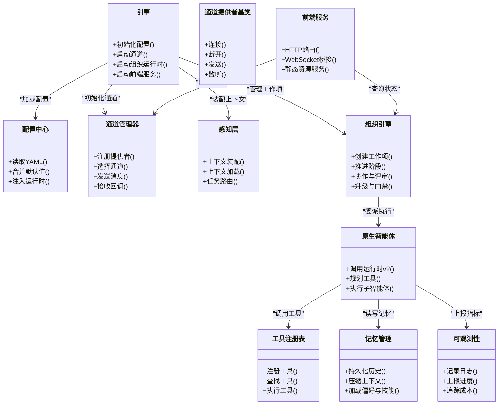
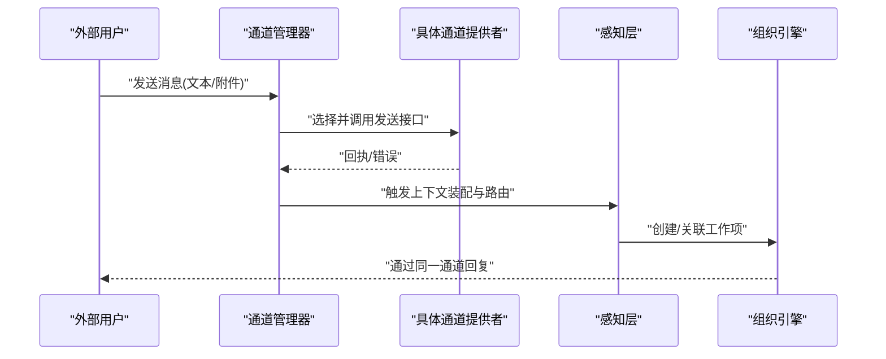
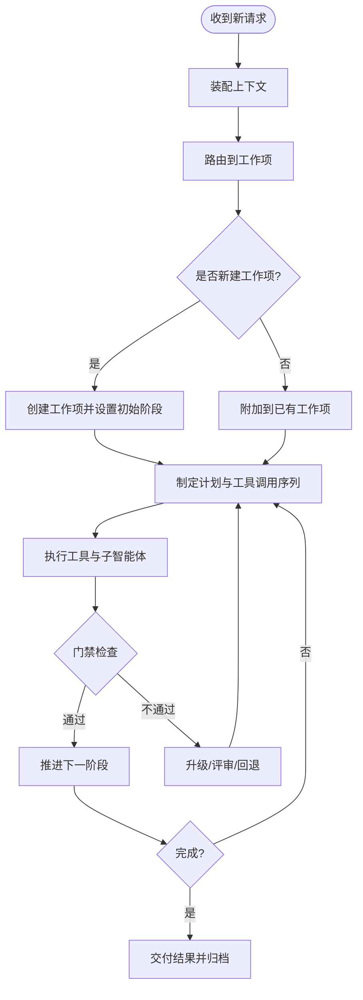
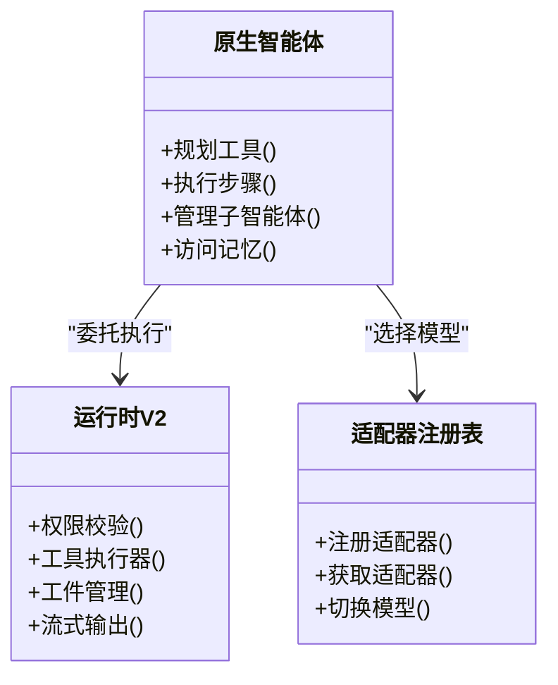
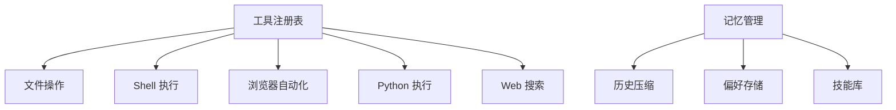
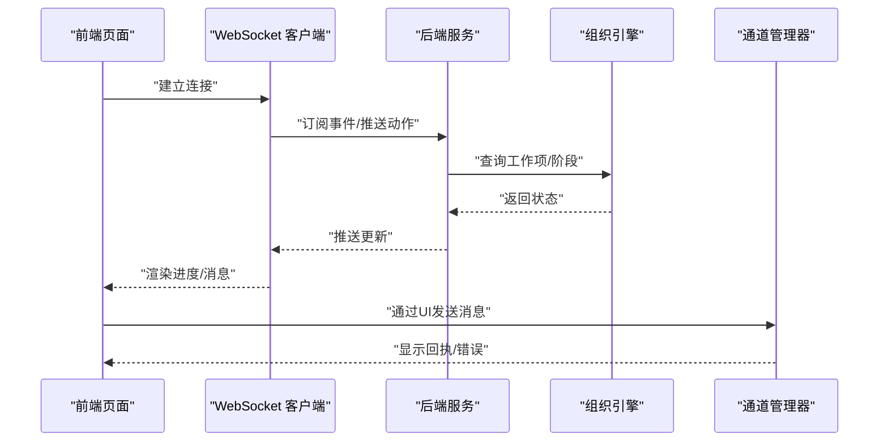
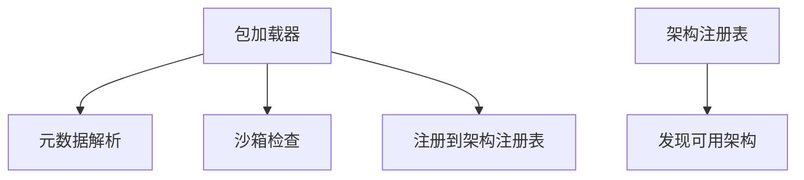
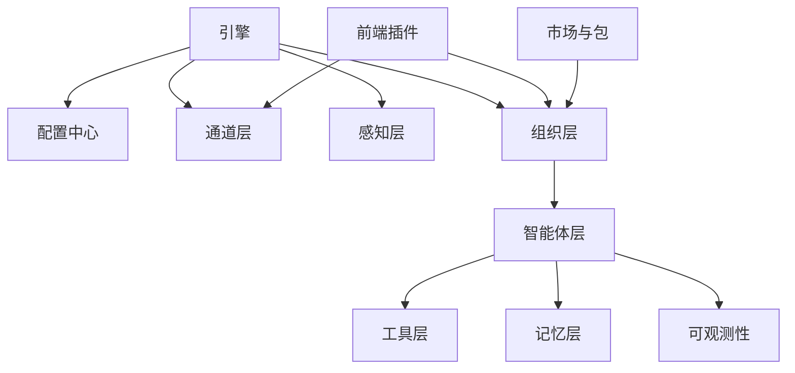

# 项目概述

<cite>
**本文引用的文件**   
- [README.md](file://README.md)
- [README.zh-CN.md](file://README.zh-CN.md)
- [pyproject.toml](file://pyproject.toml)
- [opc/engine.py](file://opc/engine.py)
- [opc/cli/app.py](file://opc/cli/app.py)
- [opc/core/config.py](file://opc/core/config.py)
- [config/system_config.yaml](file://config/system_config.yaml)
- [config/llm_config.yaml](file://config/llm_config.yaml)
- [config/channel_config.yaml](file://config/channel_config.yaml)
- [config/agent_config.yaml](file://config/agent_config.yaml)
- [opc/channels/__init__.py](file://opc/channels/__init__.py)
- [opc/channels/base.py](file://opc/channels/base.py)
- [opc/channels/manager.py](file://opc/channels/manager.py)
- [opc/channels/provider_registry.py](file://opc/channels/provider_registry.py)
- [opc/channels/dingtalk.py](file://opc/channels/dingtalk.py)
- [opc/channels/discord.py](file://opc/channels/discord.py)
- [opc/channels/email.py](file://opc/channels/email.py)
- [opc/channels/feishu.py](file://opc/channels/feishu.py)
- [opc/channels/matrix.py](file://opc/channels/matrix.py)
- [opc/channels/mochat.py](file://opc/channels/mochat.py)
- [opc/channels/provider_base.py](file://opc/channels/provider_base.py)
- [opc/channels/qq.py](file://opc/channels/qq.py)
- [opc/channels/session.py](file://opc/channels/session.py)
- [opc/channels/slack.py](file://opc/channels/slack.py)
- [opc/channels/telegram.py](file://opc/channels/telegram.py)
- [opc/channels/whatsapp.py](file://opc/channels/whatsapp.py)
- [opc/layer1_perception/context_assembler.py](file://opc/layer1_perception/context_assembler.py)
- [opc/layer1_perception/context_loader.py](file://opc/layer1_perception/context_loader.py)
- [opc/layer1_perception/task_router.py](file://opc/layer1_perception/task_router.py)
- [opc/layer2_organization/org_engine.py](file://opc/layer2_organization/org_engine.py)
- [opc/layer2_organization/collaboration_service.py](file://opc/layer2_organization/collaboration_service.py)
- [opc/layer2_organization/work_item_runtime.py](file://opc/layer2_organization/work_item_runtime.py)
- [opc/layer2_organization/phase.py](file://opc/layer2_organization/phase.py)
- [opc/layer2_organization/gate_harness.py](file://opc/layer2_organization/gate_harness.py)
- [opc/layer3_agent/native_agent.py](file://opc/layer3_agent/native_agent.py)
- [opc/layer3_agent/runtime_v2/runtime.py](file://opc/layer3_agent/runtime_v2/runtime.py)
- [opc/layer3_agent/adapters/registry.py](file://opc/layer3_agent/adapters/registry.py)
- [opc/layer4_tools/registry.py](file://opc/layer4_tools/registry.py)
- [opc/layer5_memory/memory_manager.py](file://opc/layer5_memory/memory_manager.py)
- [opc/layer6_observability/opc_logger.py](file://opc/layer6_observability/opc_logger.py)
- [opc/plugins/office_ui/server.py](file://opc/plugins/office_ui/server.py)
- [opc/plugins/office_ui/ws_handler.py](file://opc/plugins/office_ui/ws_handler.py)
- [opc/plugins/office_ui/frontend_src/main.tsx](file://opc/plugins/office_ui/frontend_src/main.tsx)
- [opc/plugins/office_ui/frontend_src/App.tsx](file://opc/plugins/office_ui/frontend_src/App.tsx)
- [opc/plugins/office_ui/frontend_src/lib/wsClient.ts](file://opc/plugins/office_ui/frontend_src/lib/wsClient.ts)
- [opc/market/package_loader.py](file://opc/market/package_loader.py)
- [opc/market/architecture_registry.py](file://opc/market/architecture_registry.py)
</cite>

## 目录
1. [简介](#简介)
2. [项目结构](#项目结构)
3. [核心组件](#核心组件)
4. [架构总览](#架构总览)
5. [详细组件分析](#详细组件分析)
6. [依赖关系分析](#依赖关系分析)
7. [性能与可扩展性](#性能与可扩展性)
8. [故障排查指南](#故障排查指南)
9. [结论](#结论)
10. [附录：部署与最佳实践](#附录部署与最佳实践)

## 简介
OpenOPC 是一个企业级多智能体协作平台，围绕“组织化工作项”和“多渠道通信集成”构建。其目标是将复杂业务任务拆解为可编排、可追踪、可审计的工作流，并通过多种渠道（如即时通讯、邮件等）与企业现有系统无缝对接。平台采用分层架构设计，将感知、组织、智能体、工具、记忆与可观测性解耦，既便于初学者理解，也为高级用户提供深度扩展能力。

主要特性概览：
- 多智能体协作：以“角色/岗位”为中心的组织模型，支持招聘、协作、升级与评审流程。
- 企业级工作流：基于阶段与门禁的有状态工作项生命周期管理，支持并行执行与回滚恢复。
- 多渠道通信：统一通道抽象，内置钉钉、飞书、Slack、Telegram、WhatsApp、Discord、Matrix、Mochat、QQ、Email 等适配器。
- AI 模型适配层：统一的 LLM 提供者接口与重试策略，支持多种后端模型接入。
- 插件化前端：Office UI 提供看板、聊天、组织治理、市场等可视化界面，通过 WebSocket 与后端实时同步。
- 可观测性与成本追踪：结构化日志、进度事件、输出预算与成本统计。

适用场景：
- 跨部门协同研发与交付流水线
- 自动化运维与巡检
- 数据分析与报告生成
- 客服与知识问答
- 企业内部知识库与技能市场生态

## 项目结构
仓库采用按职责分层的模块化组织方式，核心代码位于 opc 目录下，配置集中于 config，前端插件位于 plugins/office_ui，市场与包管理位于 market，CLI 入口在 cli 目录。

```mermaid
graph TB
subgraph "应用入口"
CLI["CLI 应用<br/>opc/cli/app.py"]
Engine["引擎初始化<br/>opc/engine.py"]
end
subgraph "配置中心"
SysCfg["系统配置<br/>config/system_config.yaml"]
LLMCfg["LLM 配置<br/>config/llm_config.yaml"]
ChanCfg["通道配置<br/>config/channel_config.yaml"]
AgentCfg["智能体配置<br/>config/agent_config.yaml"]
CoreCfg["运行时配置加载<br/>opc/core/config.py"]
end
subgraph "通道层"
Base["通道基类<br/>opc/channels/base.py"]
ProvBase["提供者基类<br/>opc/channels/provider_base.py"]
Reg["提供者注册表<br/>opc/channels/provider_registry.py"]
Mgr["通道管理器<br/>opc/channels/manager.py"]
DDT["钉钉<br/>opc/channels/dingtalk.py"]
FEI["飞书<br/>opc/channels/feishu.py"]
SLK["Slack<br/>opc/channels/slack.py"]
TGM["Telegram<br/>opc/channels/telegram.py"]
WHT["WhatsApp<br/>opc/channels/whatsapp.py"]
DIS["Discord<br/>opc/channels/discord.py"]
MAT["Matrix<br/>opc/channels/matrix.py"]
MQT["Mochat<br/>opc/channels/mochat.py"]
QQ["QQ<br/>opc/channels/qq.py"]
EML["Email<br/>opc/channels/email.py"]
SES["会话上下文<br/>opc/channels/session.py"]
end
subgraph "感知层"
CtxAsm["上下文组装器<br/>opc/layer1_perception/context_assembler.py"]
CtxLdr["上下文加载器<br/>opc/layer1_perception/context_loader.py"]
TR["任务路由<br/>opc/layer1_perception/task_router.py"]
end
subgraph "组织层"
OrgEng["组织引擎<br/>opc/layer2_organization/org_engine.py"]
CollabSvc["协作服务<br/>opc/layer2_organization/collaboration_service.py"]
WIR["工作项运行时<br/>opc/layer2_organization/work_item_runtime.py"]
Phase["阶段机<br/>opc/layer2_organization/phase.py"]
Gate["门禁控制<br/>opc/layer2_organization/gate_harness.py"]
end
subgraph "智能体层"
NativeAgent["原生智能体<br/>opc/layer3_agent/native_agent.py"]
RTv2["运行时 v2<br/>opc/layer3_agent/runtime_v2/runtime.py"]
AdpReg["适配器注册表<br/>opc/layer3_agent/adapters/registry.py"]
end
subgraph "工具层"
ToolReg["工具注册表<br/>opc/layer4_tools/registry.py"]
end
subgraph "记忆层"
MemMgr["记忆管理<br/>opc/layer5_memory/memory_manager.py"]
end
subgraph "可观测性"
Logger["日志记录<br/>opc/layer6_observability/opc_logger.py"]
end
subgraph "前端插件"
Srv["后端服务<br/>opc/plugins/office_ui/server.py"]
WS["WebSocket 处理<br/>opc/plugins/office_ui/ws_handler.py"]
FE_Main["前端入口<br/>opc/plugins/office_ui/frontend_src/main.tsx"]
FE_App["应用根组件<br/>opc/plugins/office_ui/frontend_src/App.tsx"]
FE_WS["WS 客户端<br/>opc/plugins/office_ui/frontend_src/lib/wsClient.ts"]
end
subgraph "市场与包"
PkgLoad["包加载器<br/>opc/market/package_loader.py"]
ArchReg["架构注册表<br/>opc/market/architecture_registry.py"]
end
CLI --> Engine
Engine --> CoreCfg
CoreCfg --> SysCfg
CoreCfg --> LLMCfg
CoreCfg --> ChanCfg
CoreCfg --> AgentCfg
Engine --> Mgr
Mgr --> Base
Mgr --> ProvBase
Mgr --> Reg
Mgr --> DDT
Mgr --> FEI
Mgr --> SLK
Mgr --> TGM
Mgr --> WHT
Mgr --> DIS
Mgr --> MAT
Mgr --> MQT
Mgr --> QQ
Mgr --> EML
Mgr --> SES
Engine --> CtxAsm
Engine --> CtxLdr
Engine --> TR
Engine --> OrgEng
OrgEng --> CollabSvc
OrgEng --> WIR
OrgEng --> Phase
OrgEng --> Gate
OrgEng --> NativeAgent
NativeAgent --> RTv2
NativeAgent --> AdpReg
NativeAgent --> ToolReg
NativeAgent --> MemMgr
NativeAgent --> Logger
Srv --> WS
FE_Main --> FE_App
FE_App --> FE_WS
FE_WS --> WS
```

图表来源
- [opc/engine.py](file://opc/engine.py)
- [opc/core/config.py](file://opc/core/config.py)
- [config/system_config.yaml](file://config/system_config.yaml)
- [config/llm_config.yaml](file://config/llm_config.yaml)
- [config/channel_config.yaml](file://config/channel_config.yaml)
- [config/agent_config.yaml](file://config/agent_config.yaml)
- [opc/channels/manager.py](file://opc/channels/manager.py)
- [opc/channels/base.py](file://opc/channels/base.py)
- [opc/channels/provider_base.py](file://opc/channels/provider_base.py)
- [opc/channels/provider_registry.py](file://opc/channels/provider_registry.py)
- [opc/channels/dingtalk.py](file://opc/channels/dingtalk.py)
- [opc/channels/feishu.py](file://opc/channels/feishu.py)
- [opc/channels/slack.py](file://opc/channels/slack.py)
- [opc/channels/telegram.py](file://opc/channels/telegram.py)
- [opc/channels/whatsapp.py](file://opc/channels/whatsapp.py)
- [opc/channels/discord.py](file://opc/channels/discord.py)
- [opc/channels/matrix.py](file://opc/channels/matrix.py)
- [opc/channels/mochat.py](file://opc/channels/mochat.py)
- [opc/channels/qq.py](file://opc/channels/qq.py)
- [opc/channels/email.py](file://opc/channels/email.py)
- [opc/channels/session.py](file://opc/channels/session.py)
- [opc/layer1_perception/context_assembler.py](file://opc/layer1_perception/context_assembler.py)
- [opc/layer1_perception/context_loader.py](file://opc/layer1_perception/context_loader.py)
- [opc/layer1_perception/task_router.py](file://opc/layer1_perception/task_router.py)
- [opc/layer2_organization/org_engine.py](file://opc/layer2_organization/org_engine.py)
- [opc/layer2_organization/collaboration_service.py](file://opc/layer2_organization/collaboration_service.py)
- [opc/layer2_organization/work_item_runtime.py](file://opc/layer2_organization/work_item_runtime.py)
- [opc/layer2_organization/phase.py](file://opc/layer2_organization/phase.py)
- [opc/layer2_organization/gate_harness.py](file://opc/layer2_organization/gate_harness.py)
- [opc/layer3_agent/native_agent.py](file://opc/layer3_agent/native_agent.py)
- [opc/layer3_agent/runtime_v2/runtime.py](file://opc/layer3_agent/runtime_v2/runtime.py)
- [opc/layer3_agent/adapters/registry.py](file://opc/layer3_agent/adapters/registry.py)
- [opc/layer4_tools/registry.py](file://opc/layer4_tools/registry.py)
- [opc/layer5_memory/memory_manager.py](file://opc/layer5_memory/memory_manager.py)
- [opc/layer6_observability/opc_logger.py](file://opc/layer6_observability/opc_logger.py)
- [opc/plugins/office_ui/server.py](file://opc/plugins/office_ui/server.py)
- [opc/plugins/office_ui/ws_handler.py](file://opc/plugins/office_ui/ws_handler.py)
- [opc/plugins/office_ui/frontend_src/main.tsx](file://opc/plugins/office_ui/frontend_src/main.tsx)
- [opc/plugins/office_ui/frontend_src/App.tsx](file://opc/plugins/office_ui/frontend_src/App.tsx)
- [opc/plugins/office_ui/frontend_src/lib/wsClient.ts](file://opc/plugins/office_ui/frontend_src/lib/wsClient.ts)
- [opc/market/package_loader.py](file://opc/market/package_loader.py)
- [opc/market/architecture_registry.py](file://opc/market/architecture_registry.py)

章节来源
- [README.md](file://README.md)
- [README.zh-CN.md](file://README.zh-CN.md)
- [pyproject.toml](file://pyproject.toml)

## 核心组件
- 引擎与配置
  - 引擎负责启动各层模块、加载配置、初始化通道与组织运行时。
  - 配置中心集中读取 YAML 配置并注入到运行时。
- 通道层
  - 提供统一的消息收发抽象，内置多种 IM/邮件适配器，支持会话上下文隔离。
- 感知层
  - 负责上下文装配、上下文加载与任务路由，决定消息进入哪个工作项或会话。
- 组织层
  - 维护组织模型与工作项生命周期，实现协作、评审、升级与门禁控制。
- 智能体层
  - 原生智能体封装运行时代码，支持 v2 运行时、工具规划与子智能体。
- 工具层
  - 注册与调度工具，包括文件操作、Shell、浏览器、Python 执行、Web 搜索等。
- 记忆层
  - 管理历史压缩、偏好、技能库与员工演化等长期记忆。
- 可观测性
  - 结构化日志、进度事件、成本追踪与输出预算。
- 前端插件
  - Office UI 提供看板、聊天、组织治理与市场等界面，通过 WebSocket 与后端实时交互。
- 市场与包
  - 支持架构与角色的打包、加载与注册，形成可复用的能力生态。

章节来源
- [opc/engine.py](file://opc/engine.py)
- [opc/core/config.py](file://opc/core/config.py)
- [config/system_config.yaml](file://config/system_config.yaml)
- [config/llm_config.yaml](file://config/llm_config.yaml)
- [config/channel_config.yaml](file://config/channel_config.yaml)
- [config/agent_config.yaml](file://config/agent_config.yaml)
- [opc/channels/manager.py](file://opc/channels/manager.py)
- [opc/layer1_perception/context_assembler.py](file://opc/layer1_perception/context_assembler.py)
- [opc/layer1_perception/context_loader.py](file://opc/layer1_perception/context_loader.py)
- [opc/layer1_perception/task_router.py](file://opc/layer1_perception/task_router.py)
- [opc/layer2_organization/org_engine.py](file://opc/layer2_organization/org_engine.py)
- [opc/layer2_organization/collaboration_service.py](file://opc/layer2_organization/collaboration_service.py)
- [opc/layer2_organization/work_item_runtime.py](file://opc/layer2_organization/work_item_runtime.py)
- [opc/layer2_organization/phase.py](file://opc/layer2_organization/phase.py)
- [opc/layer2_organization/gate_harness.py](file://opc/layer2_organization/gate_harness.py)
- [opc/layer3_agent/native_agent.py](file://opc/layer3_agent/native_agent.py)
- [opc/layer3_agent/runtime_v2/runtime.py](file://opc/layer3_agent/runtime_v2/runtime.py)
- [opc/layer4_tools/registry.py](file://opc/layer4_tools/registry.py)
- [opc/layer5_memory/memory_manager.py](file://opc/layer5_memory/memory_manager.py)
- [opc/layer6_observability/opc_logger.py](file://opc/layer6_observability/opc_logger.py)
- [opc/plugins/office_ui/server.py](file://opc/plugins/office_ui/server.py)
- [opc/plugins/office_ui/ws_handler.py](file://opc/plugins/office_ui/ws_handler.py)
- [opc/plugins/office_ui/frontend_src/main.tsx](file://opc/plugins/office_ui/frontend_src/main.tsx)
- [opc/plugins/office_ui/frontend_src/App.tsx](file://opc/plugins/office_ui/frontend_src/App.tsx)
- [opc/plugins/office_ui/frontend_src/lib/wsClient.ts](file://opc/plugins/office_ui/frontend_src/lib/wsClient.ts)
- [opc/market/package_loader.py](file://opc/market/package_loader.py)
- [opc/market/architecture_registry.py](file://opc/market/architecture_registry.py)

## 架构总览
OpenOPC 采用分层架构，强调“关注点分离”与“可插拔扩展”。上层通过统一接口访问下层能力，避免紧耦合；同时通过注册表机制动态发现与装载组件。

图表来源
- [opc/engine.py](file://opc/engine.py)
- [opc/core/config.py](file://opc/core/config.py)
- [opc/channels/manager.py](file://opc/channels/manager.py)
- [opc/channels/provider_base.py](file://opc/channels/provider_base.py)
- [opc/layer1_perception/context_assembler.py](file://opc/layer1_perception/context_assembler.py)
- [opc/layer1_perception/context_loader.py](file://opc/layer1_perception/context_loader.py)
- [opc/layer1_perception/task_router.py](file://opc/layer1_perception/task_router.py)
- [opc/layer2_organization/org_engine.py](file://opc/layer2_organization/org_engine.py)
- [opc/layer3_agent/native_agent.py](file://opc/layer3_agent/native_agent.py)
- [opc/layer4_tools/registry.py](file://opc/layer4_tools/registry.py)
- [opc/layer5_memory/memory_manager.py](file://opc/layer5_memory/memory_manager.py)
- [opc/layer6_observability/opc_logger.py](file://opc/layer6_observability/opc_logger.py)
- [opc/plugins/office_ui/server.py](file://opc/plugins/office_ui/server.py)

## 详细组件分析

### 通道层：多渠道通信集成
通道层提供统一的消息收发抽象，内置多种 IM/邮件适配器，并通过注册表进行动态发现。每个适配器遵循一致的接口契约，确保上层无需关心具体实现差异。

图表来源
- [opc/channels/manager.py](file://opc/channels/manager.py)
- [opc/channels/provider_base.py](file://opc/channels/provider_base.py)
- [opc/channels/dingtalk.py](file://opc/channels/dingtalk.py)
- [opc/channels/feishu.py](file://opc/channels/feishu.py)
- [opc/channels/slack.py](file://opc/channels/slack.py)
- [opc/channels/telegram.py](file://opc/channels/telegram.py)
- [opc/channels/whatsapp.py](file://opc/channels/whatsapp.py)
- [opc/channels/discord.py](file://opc/channels/discord.py)
- [opc/channels/matrix.py](file://opc/channels/matrix.py)
- [opc/channels/mochat.py](file://opc/channels/mochat.py)
- [opc/channels/qq.py](file://opc/channels/qq.py)
- [opc/channels/email.py](file://opc/channels/email.py)
- [opc/channels/session.py](file://opc/channels/session.py)
- [opc/layer1_perception/context_assembler.py](file://opc/layer1_perception/context_assembler.py)
- [opc/layer1_perception/context_loader.py](file://opc/layer1_perception/context_loader.py)
- [opc/layer1_perception/task_router.py](file://opc/layer1_perception/task_router.py)
- [opc/layer2_organization/org_engine.py](file://opc/layer2_organization/org_engine.py)

章节来源
- [opc/channels/__init__.py](file://opc/channels/__init__.py)
- [opc/channels/base.py](file://opc/channels/base.py)
- [opc/channels/manager.py](file://opc/channels/manager.py)
- [opc/channels/provider_registry.py](file://opc/channels/provider_registry.py)
- [opc/channels/provider_base.py](file://opc/channels/provider_base.py)
- [opc/channels/session.py](file://opc/channels/session.py)

### 组织层：企业级工作流与协作
组织层以“工作项”为核心，定义阶段机与门禁控制，支持协作、评审、升级与再分配。工作项运行时负责状态推进、依赖管理与并发安全。

图表来源
- [opc/layer1_perception/context_assembler.py](file://opc/layer1_perception/context_assembler.py)
- [opc/layer1_perception/context_loader.py](file://opc/layer1_perception/context_loader.py)
- [opc/layer1_perception/task_router.py](file://opc/layer1_perception/task_router.py)
- [opc/layer2_organization/org_engine.py](file://opc/layer2_organization/org_engine.py)
- [opc/layer2_organization/work_item_runtime.py](file://opc/layer2_organization/work_item_runtime.py)
- [opc/layer2_organization/phase.py](file://opc/layer2_organization/phase.py)
- [opc/layer2_organization/gate_harness.py](file://opc/layer2_organization/gate_harness.py)
- [opc/layer2_organization/collaboration_service.py](file://opc/layer2_organization/collaboration_service.py)

章节来源
- [opc/layer2_organization/org_engine.py](file://opc/layer2_organization/org_engine.py)
- [opc/layer2_organization/work_item_runtime.py](file://opc/layer2_organization/work_item_runtime.py)
- [opc/layer2_organization/phase.py](file://opc/layer2_organization/phase.py)
- [opc/layer2_organization/gate_harness.py](file://opc/layer2_organization/gate_harness.py)
- [opc/layer2_organization/collaboration_service.py](file://opc/layer2_organization/collaboration_service.py)

### 智能体层：原生智能体与运行时 v2
原生智能体封装了 v2 运行时的执行环境，支持工具规划、子智能体编排、权限控制与工件管理。适配器注册表用于统一管理不同 AI 模型的接入。

图表来源
- [opc/layer3_agent/native_agent.py](file://opc/layer3_agent/native_agent.py)
- [opc/layer3_agent/runtime_v2/runtime.py](file://opc/layer3_agent/runtime_v2/runtime.py)
- [opc/layer3_agent/adapters/registry.py](file://opc/layer3_agent/adapters/registry.py)

章节来源
- [opc/layer3_agent/native_agent.py](file://opc/layer3_agent/native_agent.py)
- [opc/layer3_agent/runtime_v2/runtime.py](file://opc/layer3_agent/runtime_v2/runtime.py)
- [opc/layer3_agent/adapters/registry.py](file://opc/layer3_agent/adapters/registry.py)

### 工具层与记忆层
工具层通过注册表集中管理工具，支持文件操作、Shell、浏览器、Python 执行、Web 搜索等。记忆层负责历史压缩、偏好与技能库管理，保障长上下文与个性化体验。

图表来源
- [opc/layer4_tools/registry.py](file://opc/layer4_tools/registry.py)
- [opc/layer5_memory/memory_manager.py](file://opc/layer5_memory/memory_manager.py)

章节来源
- [opc/layer4_tools/registry.py](file://opc/layer4_tools/registry.py)
- [opc/layer5_memory/memory_manager.py](file://opc/layer5_memory/memory_manager.py)

### 前端插件：Office UI 与实时通信
Office UI 插件提供看板、聊天、组织治理与市场等界面，通过 WebSocket 与后端实时同步状态与进度。

图表来源
- [opc/plugins/office_ui/server.py](file://opc/plugins/office_ui/server.py)
- [opc/plugins/office_ui/ws_handler.py](file://opc/plugins/office_ui/ws_handler.py)
- [opc/plugins/office_ui/frontend_src/main.tsx](file://opc/plugins/office_ui/frontend_src/main.tsx)
- [opc/plugins/office_ui/frontend_src/App.tsx](file://opc/plugins/office_ui/frontend_src/App.tsx)
- [opc/plugins/office_ui/frontend_src/lib/wsClient.ts](file://opc/plugins/office_ui/frontend_src/lib/wsClient.ts)
- [opc/layer2_organization/org_engine.py](file://opc/layer2_organization/org_engine.py)
- [opc/channels/manager.py](file://opc/channels/manager.py)

章节来源
- [opc/plugins/office_ui/server.py](file://opc/plugins/office_ui/server.py)
- [opc/plugins/office_ui/ws_handler.py](file://opc/plugins/office_ui/ws_handler.py)
- [opc/plugins/office_ui/frontend_src/main.tsx](file://opc/plugins/office_ui/frontend_src/main.tsx)
- [opc/plugins/office_ui/frontend_src/App.tsx](file://opc/plugins/office_ui/frontend_src/App.tsx)
- [opc/plugins/office_ui/frontend_src/lib/wsClient.ts](file://opc/plugins/office_ui/frontend_src/lib/wsClient.ts)

### 市场与包：架构与角色复用
市场模块支持架构与角色的打包、加载与注册，形成可复用的能力生态，便于在企业内共享与分发。

图表来源
- [opc/market/package_loader.py](file://opc/market/package_loader.py)
- [opc/market/architecture_registry.py](file://opc/market/architecture_registry.py)

章节来源
- [opc/market/package_loader.py](file://opc/market/package_loader.py)
- [opc/market/architecture_registry.py](file://opc/market/architecture_registry.py)

## 依赖关系分析
OpenOPC 的依赖关系清晰且层次分明，核心模块通过注册表与接口解耦，便于替换与扩展。

图表来源
- [opc/engine.py](file://opc/engine.py)
- [opc/core/config.py](file://opc/core/config.py)
- [opc/channels/manager.py](file://opc/channels/manager.py)
- [opc/layer1_perception/context_assembler.py](file://opc/layer1_perception/context_assembler.py)
- [opc/layer2_organization/org_engine.py](file://opc/layer2_organization/org_engine.py)
- [opc/layer3_agent/native_agent.py](file://opc/layer3_agent/native_agent.py)
- [opc/layer4_tools/registry.py](file://opc/layer4_tools/registry.py)
- [opc/layer5_memory/memory_manager.py](file://opc/layer5_memory/memory_manager.py)
- [opc/layer6_observability/opc_logger.py](file://opc/layer6_observability/opc_logger.py)
- [opc/plugins/office_ui/server.py](file://opc/plugins/office_ui/server.py)
- [opc/market/package_loader.py](file://opc/market/package_loader.py)

章节来源
- [opc/engine.py](file://opc/engine.py)
- [opc/core/config.py](file://opc/core/config.py)
- [opc/channels/manager.py](file://opc/channels/manager.py)
- [opc/layer1_perception/context_assembler.py](file://opc/layer1_perception/context_assembler.py)
- [opc/layer2_organization/org_engine.py](file://opc/layer2_organization/org_engine.py)
- [opc/layer3_agent/native_agent.py](file://opc/layer3_agent/native_agent.py)
- [opc/layer4_tools/registry.py](file://opc/layer4_tools/registry.py)
- [opc/layer5_memory/memory_manager.py](file://opc/layer5_memory/memory_manager.py)
- [opc/layer6_observability/opc_logger.py](file://opc/layer6_observability/opc_logger.py)
- [opc/plugins/office_ui/server.py](file://opc/plugins/office_ui/server.py)
- [opc/market/package_loader.py](file://opc/market/package_loader.py)

## 性能与可扩展性
- 异步与并发
  - 通道层与前端 WebSocket 支持高并发消息处理，建议在生产环境启用进程/线程池与连接池。
- 上下文窗口与记忆压缩
  - 记忆层提供历史压缩与偏好加载，有助于降低 LLM 上下文开销与提升响应速度。
- 工具执行隔离
  - 工具执行建议在沙箱环境中运行，限制资源使用与网络访问范围。
- 模型适配与重试
  - LLM 提供者接口支持重试策略与错误降级，建议根据模型稳定性配置超时与退避参数。
- 可观测性
  - 通过结构化日志与成本追踪定位瓶颈，结合看板与进度事件进行实时监控。

[本节为通用指导，不涉及具体文件分析]

## 故障排查指南
- 通道连接失败
  - 检查通道配置与凭据是否正确，确认网络可达与防火墙规则。
  - 查看通道提供者的错误回执与重试次数。
- 工作项卡住
  - 检查门禁条件与评审结果，确认是否有未满足的前置依赖。
  - 查看阶段转换钩子与异常日志，必要时手动干预或回滚。
- 智能体无输出
  - 确认模型适配器已正确注册，检查上下文装配与任务路由逻辑。
  - 查看工具执行权限与资源限制，验证 Python 执行环境与依赖。
- 前端无法连接
  - 检查 WebSocket 端口与跨域配置，确认服务端已启动并监听。
  - 查看 wsHandler 的错误日志与心跳检测。

章节来源
- [opc/channels/manager.py](file://opc/channels/manager.py)
- [opc/layer2_organization/gate_harness.py](file://opc/layer2_organization/gate_harness.py)
- [opc/layer3_agent/adapters/registry.py](file://opc/layer3_agent/adapters/registry.py)
- [opc/layer4_tools/registry.py](file://opc/layer4_tools/registry.py)
- [opc/plugins/office_ui/ws_handler.py](file://opc/plugins/office_ui/ws_handler.py)

## 结论
OpenOPC 通过分层架构与注册表机制，实现了企业级多智能体协作平台的灵活性与可扩展性。其多渠道通信、组织化工作流、AI 模型适配与可视化前端共同构成了一个完整的解决方案。对于初学者，平台提供了清晰的模块划分与丰富的文档；对于经验丰富的开发者，平台提供了充足的扩展点与生产级特性。

[本节为总结性内容，不涉及具体文件分析]

## 附录：部署与最佳实践
- 安装与依赖
  - 参考 pyproject.toml 中的依赖声明与环境要求，建议使用虚拟环境或容器化部署。
- 配置管理
  - 将敏感信息（如通道凭据、模型密钥）放入环境变量或密钥管理服务，避免硬编码。
  - 使用 system_config.yaml、llm_config.yaml、channel_config.yaml、agent_config.yaml 分别管理系统、模型、通道与智能体配置。
- 启动方式
  - 使用 CLI 应用作为入口，按需启用 Office UI 插件与特定通道。
- 监控与告警
  - 启用结构化日志与成本追踪，结合看板与进度事件建立告警规则。
- 扩展开发
  - 新增通道：实现 provider_base 接口并注册到 provider_registry。
  - 新增工具：在工具注册表中注册函数或类，并确保沙箱安全。
  - 新增架构/角色：通过市场模块打包与发布，供团队复用。

章节来源
- [pyproject.toml](file://pyproject.toml)
- [config/system_config.yaml](file://config/system_config.yaml)
- [config/llm_config.yaml](file://config/llm_config.yaml)
- [config/channel_config.yaml](file://config/channel_config.yaml)
- [config/agent_config.yaml](file://config/agent_config.yaml)
- [opc/cli/app.py](file://opc/cli/app.py)
- [opc/channels/provider_base.py](file://opc/channels/provider_base.py)
- [opc/channels/provider_registry.py](file://opc/channels/provider_registry.py)
- [opc/layer4_tools/registry.py](file://opc/layer4_tools/registry.py)
- [opc/market/package_loader.py](file://opc/market/package_loader.py)