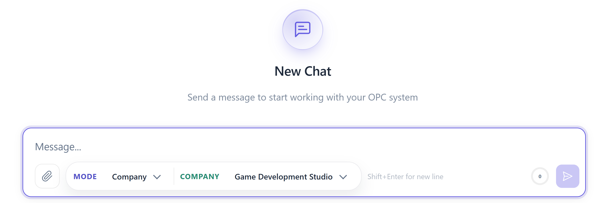
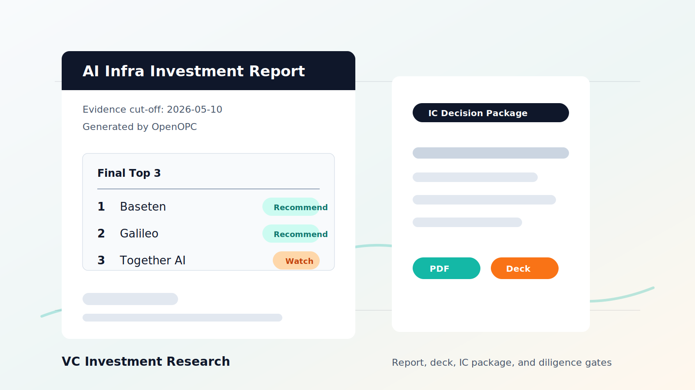
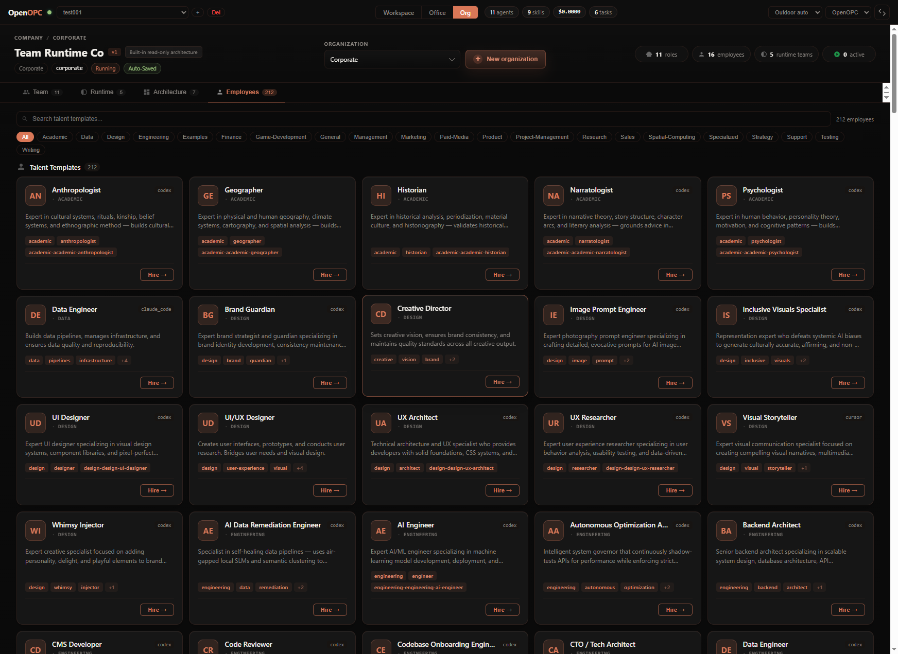

<h1 align="center" style="font-size: 1.75em;">OpenOPC：打造你的個人 AI 原生公司 — 自建、自營、自成長</h1>

<p align="center">
  <a href="README.md">English</a> | <b>繁體中文</b>
</p>

🏗️ **自建（Self-Built）** — 全自動招募各崗位的 AI 員工，搭建組織架構。

⚙️ **自營（Self-Run）** — 全自動分派任務、驅動交接，持續朝你的目標推進。

🌱 **自成長（Self-Grown）** — 從每個任務中學習，沉澱組織記憶，交付越來越聰明。

<p align="center">
  
  
  
  
  
</p>



## 目錄

- [何時使用 OpenOPC](#何時使用-openopc)
- [功能亮點](#功能亮點)
- [演示](#演示)
- [OpenOPC 如何工作](#openopc-如何工作)
- [快速開始](#快速開始)
- [Docker 部署](#docker-部署)
- [Office UI 指南](#office-ui-指南)
- [CLI 指南](#cli-指南)
- [配置](#配置)
- [架構](#架構)
- [生態與分享](#生態與分享)
- [路線圖](#路線圖)
- [致謝](#致謝)

## 何時使用 OpenOPC

**OpenOPC** 覆蓋九大核心垂直領域 — 從 AI 開發、軟件工程到金融、銷售、媒體、電商與教育。無論哪個行業，OpenOPC 都會組建合適的團隊並端到端交付。

<table>
  <tr>
    <td width="33%" valign="top">
      <br><strong>🤖 AI 技術與研究</strong>
      <br><sub>模型訓練與評估、Agent 開發、LLM 應用與 AI 基礎設施</sub>
    </td>
    <td width="33%" valign="top">
      <br><strong>💻 軟件開發</strong>
      <br><sub>Android 應用、SaaS MVP、網站、小程序與遊戲開發</sub>
    </td>
    <td width="33%" valign="top">
      <br><strong>📈 金融投資</strong>
      <br><sub>投資備忘錄、市場圖譜、盡職調查與投決會材料</sub>
    </td>
  </tr>
  <tr>
    <td valign="top">
      <strong>🚀 銷售增長</strong>
      <br><sub>外呼銷售、交易策略、方案書與渠道拓展</sub>
    </td>
    <td valign="top">
      <strong>🎬 內容與媒體</strong>
      <br><sub>視頻製作、短視頻內容、腳本、分鏡與多平臺剪輯</sub>
    </td>
    <td valign="top">
      <strong>🤝 行業助理</strong>
      <br><sub>客服、房產、法律諮詢、HR 入職、零售等場景的 Copilot</sub>
    </td>
  </tr>
  <tr>
    <td valign="top">
      <strong>🧾 會計與財務</strong>
      <br><sub>記賬、財務報告、稅務合規、預算與風險審查</sub>
    </td>
    <td valign="top">
      <strong>🛍️ 品牌與電商</strong>
      <br><sub>品牌規劃、選品、店鋪運營、用戶增長與留存</sub>
    </td>
    <td valign="top">
      <strong>🎓 教育與培訓</strong>
      <br><sub>課程設計、知識庫、學員管理與內容生產</sub>
    </td>
  </tr>
</table>

## 功能亮點

| 能力 | 描述 |
|---|---|
| **多 Agent 公司運行時** | 招募 AI 員工、分配角色、編排委派 DAG，支持並行執行、評審閘門與上報機制。 |
| **工作項狀態機** | 階段驅動的看板工作流 — 規劃、執行、評審、集成、完成 — 帶依賴解析。 |
| **預算感知模型路由** | 分層 LLM 調度（關鍵 / 推理 / 常規 / 摘要），預算壓力下自動降級。 |
| **外部 Agent 集成** | 委派給 Qwen Code、Codex、Claude Code、Cursor 或 OpenCode，支持會話延續與審批控制。 |
| **原生工具棧** | Shell、文件操作、瀏覽器（Playwright）、網頁搜索、Python 執行、Git 與協作工具 — 全部經風險分級。 |
| **MCP 服務器支持** | 連接本地（stdio）或遠程（HTTP/SSE）Model Context Protocol 服務器；發現的工具自動註冊。 |
| **組織記憶** | 每位員工的經驗檔案、共享作業手冊、會話壓縮與持久記憶提取。 |
| **10+ 頻道提供方** | 飛書、Telegram、Slack、Discord、釘釘、郵件、Matrix、QQ、WhatsApp、Mochat — 默認拒絕的安全策略。 |
| **Office UI** | React + Phaser 動畫辦公室：看板、執行進度、人才市場、組織編輯器、通訊與團隊駕駛艙。 |
| **組織架構預設** | 內置模板（全棧應用、研究報告、深度研究、文章系列、快速任務）+ 自定義組織。 |
| **Docker 部署** | 多階段鏡像（基礎 CLI / 開發版含 UI + Playwright），`docker compose up` 即可運行持久化 Office UI。 |
| **有限自治與審批** | 風險分級的工具調用、會話級權限授予、Shell AST 驗證與人類上報。 |

## 演示

<table>
  <tr>
    <td width="33%" align="center" valign="top">
      <a href="https://youtu.be/XqQeTt6XvPQ">
        
      </a>
      <br><br>
      <strong>🎬 視頻製作</strong>
    </td>
    <td width="33%" align="center" valign="top">
      <a href="https://drive.google.com/drive/folders/1T1Nl6CCE-cmbGy6sKrYML7_UnP8XID88?usp=drive_link">
        
      </a>
      <br><br>
      <strong>📈 投資研究</strong>
    </td>
    <td width="33%" align="center" valign="top">
      <a href="https://youtu.be/SVc9BvE5ohY">
        
      </a>
      <br><br>
      <strong>🎮 遊戲原型</strong>
    </td>
  </tr>
</table>

## OpenOPC 如何工作

OpenOPC 圍繞複雜的真實任務組建一家 AI 公司 — 通過三個緊密耦合的機制：**自建**負責組織配員，**自營**負責執行工作，**自成長**負責從結果中學習。

<p align="center">
  
</p>

**1. 自建 — 爲組織配員**

在任何工作開始之前，必須先把合適的人放到合適的位置。給定一個目標，OpenOPC 會：

- 🌿 起草組織架構圖 — 從任務需求推導出所需的角色與彙報結構。
- 🎯 填補每個角色 — 由招聘 Agent 在「複用現有員工（帶着以往項目塑造的經驗）」與「從人才池中招募新人」之間做出選擇。

💡 有經驗的員工攜帶積累的上下文；當角色需要時，新員工則提供一張白紙。

**⚙️ 2. 自營 — 執行工作**

團隊組建完成後，自營機制協調成員產出最終交付物。核心挑戰不在於單純執行，而在於不確定性下的高效協作，具體體現爲兩個問題。

🔀 動態協作編排。真實工作無法完全提前規劃。OpenOPC 通過工作項狀態機來解決，每個工作項所處的階段決定：

- 📋 它在看板的哪一列 — 處於工作流的哪個位置。
- 👑 它的負責人 — 該階段由哪個角色負責。
- ✅ 它的可執行性 — 是否已經具備推進條件。

管理者負責拆解工作項、分派並評審結果 — 接受、返工或上報 — 覆蓋五種模式：執行（execute）、委派（delegate）、評審（review）、集成（integrate）與返工（rework）。拆解定義了一個依賴 DAG，因此：

- ⚡ 相互獨立的工作項並行推進。
- ⏳ 有依賴的工作項等待前置項完成。

🔗 依賴解除與駁回都作爲結構化的階段轉換傳播，消除了臨時的人爲協調。

🛡️ 處理運行中途出現的阻塞。並非所有障礙都能提前預見。OpenOPC 在兩個層面解決：

- 💬 團隊內部 — 一條阻塞消息會暫停發送者，並激活最適合解決該問題的角色。
- 📡 團隊之外 — 當阻塞超出團隊權限時，運行時會上報給人類所有者，在真正需要時引入人類判斷。

🖥️ 看板與辦公室視圖實時呈現這一編排過程。

**🌱 3. 自成長 — 從運行中學習**

執行產生原始經驗；自成長把它轉化爲持久的改進，遵循兩條原則。

🏅 把結果歸因到正確的角色。把功勞記給整個公司學不到任何東西。因此 OpenOPC：

- 🔍 將用戶反饋解析爲針對每位員工的評估。
- 🎯 只更新負責了相關工作項的角色 — 功與過都落到應得之處。

📖 把執行軌跡提煉爲知識。執行軌跡噪聲太大，無法直接學習。因此 OpenOPC：
- 💡 把每個角色的任務提煉爲高信號的經驗教訓，存入其私有經驗檔案。
- 📚 把反覆出現的經驗提升爲共享的作業手冊（playbook），新員工從入職起即可繼承 — 讓組織知識隨時間複利增長。

<details>
<summary><strong>這些機制如何對應到 UI</strong></summary>

- `Org -> Team` 編輯公司架構與角色。
- `Org -> Employees` 爲空缺角色招募人才。
- `Team Roster -> Deploy` 把已錄用的員工變成辦公室中可見的 Agent。
- Workspace 輸入框可選擇 Task 模式的執行 Agent。
- 角色檢查器可爲 Company 模式的角色設置運行時策略與偏好的外部 Agent。
- 執行期間，Workspace 的 `Agents` 頁籤與 Execution Progress 面板會顯示哪個角色處於活動狀態、它負責哪個工作項、以及由哪個執行 Agent 完成具體工作。
</details>

## 快速開始

推薦使用 `uv` 來安裝 OpenOPC。它可以安裝/管理 Python、創建項目虛擬環境，並在該環境中運行命令，而不會把 OpenOPC 的依賴混入全局 Python。

OpenOPC 要求 Python `>=3.10`；下面的示例使用 Python `3.12`。

對於直接的一次性工作，OpenOPC 還提供 Task 模式 — 一個類 LobeChat 的單 Agent 工作臺，可使用 OpenOPC Native、Qwen Code、Codex、Claude Code、Cursor 或 OpenCode。

<details open>
<summary><strong>推薦：uv 環境搭建</strong></summary>

**macOS**

```bash
# 使用 Homebrew 安裝 uv，或使用官方獨立安裝腳本。
brew install uv
# curl -LsSf https://astral.sh/uv/install.sh | sh

cd /path/to/OpenOPC
uv python install 3.12
uv venv --python 3.12
source .venv/bin/activate
```

**Linux**

```bash
curl -LsSf https://astral.sh/uv/install.sh | sh
source "$HOME/.local/bin/env"

cd /path/to/OpenOPC
uv python install 3.12
uv venv --python 3.12
source .venv/bin/activate
```

**Windows PowerShell**

```powershell
powershell -ExecutionPolicy ByPass -c "irm https://astral.sh/uv/install.ps1 | iex"

cd C:\path\to\OpenOPC
uv python install 3.12
uv venv --python 3.12
.\.venv\Scripts\Activate.ps1
```

**Windows 命令提示符**

```bat
winget install --id=astral-sh.uv -e
:: 或在 cmd 中運行獨立安裝腳本：
:: powershell -ExecutionPolicy ByPass -c "irm https://astral.sh/uv/install.ps1 | iex"

cd C:\path\to\OpenOPC
uv python install 3.12
uv venv --python 3.12
.venv\Scripts\activate.bat
```
</details>

```bash
# 將 OpenOPC 安裝到 uv 管理的環境中
uv pip install -e .

# 可選但推薦：安裝瀏覽器工具所需的 Chromium
uv run python -m playwright install chromium

# 初始化本地配置、記憶、技能、項目與工作區目錄
uv run opc init

# 在 .opc/config/llm_config.yaml 中填入 API key，
# 或配置 llm.api_key_env 指定的環境變量。

# 啓動瀏覽器 UI
uv run opc ui
```

默認打開 `http://localhost:8765`。

```bash
# 交互式 CLI
uv run opc chat -p demo

# 一次性 Task 模式
uv run opc chat -p demo --mode task --agent qwen_code "Refactor this module and run focused tests"

# 使用內置 Corporate 架構的 Company 模式
uv run opc chat -p demo --mode company --company-profile corporate "Plan, implement, review, and document this feature"

# 非交互腳本 / CI 風格用法
uv run opc exec -p demo --mode task --agent native --json "Summarize the current repo status"
```

<details>
<summary><strong>安裝說明</strong></summary>

- Python：`>=3.10`。當前必需依賴並非全部提供兼容 Python 3.9 的版本。
- 本地開發與發佈測試推薦使用 `uv`。如果你偏好經典 pip，請創建並激活一個 Python `>=3.10` 的虛擬環境，然後運行 `python -m pip install -e .`。
- 如果虛擬環境激活被阻止，可以不激活，直接用 `uv run ...` 運行命令。
- 關於其他包管理器與託管 Python 的細節，參見官方 [`uv` 安裝文檔](https://docs.astral.sh/uv/getting-started/installation/) 與 [Python 管理文檔](https://docs.astral.sh/uv/guides/install-python/)。
- Node.js：需要構建 Office UI 前端時要求 `>=18`。
- `opc ui` 會自動安裝缺失的 `aiohttp` / `aiosqlite`，並在需要時自動構建前端。
- 如果你尚未安裝外部 Agent CLI，運行 `opc init --no-external-agent-preflight` 可跳過首次運行的外部 Agent 檢查。
- 瀏覽器工具基於原生 Playwright。在讓 Agent 瀏覽網頁之前，先用 `python -m playwright install chromium` 安裝 Chromium。
</details>

<details>
<summary><b>開發環境搭建（從源碼構建）</b></summary>

```bash
python -m pip install -e .
python -m pytest

cd opc/plugins/office_ui/frontend_src
npm install
npm run typecheck
npm run build
```

前端構建產物從 `opc/plugins/office_ui/frontend_dist/` 提供服務。
</details>

## Docker 部署

OpenOPC 提供多階段 Dockerfile，包含兩個構建目標：

| 目標 | 內容 |
|---|---|
| `base` | 最小生產鏡像，僅含 `opc` CLI。 |
| `dev`（默認） | 完整鏡像：Office UI（aiohttp）、Playwright + Chromium、所有頻道擴充。 |

**使用 Docker Compose 快速啟動：**

```bash
# 1. 複製並填入你的 API 密鑰
cp .env.example .env

# 2. 啟動完整棧（Office UI + 持久化 .opc 卷）
docker compose up -d

# 3. 打開 http://localhost:8765
```

**手動構建：**

```bash
# 完整開發鏡像（默認）
docker build -t openopc .

# 最小 CLI 鏡像
docker build --target base -t openopc .

# 運行 Office UI
docker run -p 8765:8765 -v ./.opc:/app/.opc --env-file .env openopc

# 運行 CLI 命令
docker run --rm -v ./.opc:/app/.opc --env-file .env openopc chat -p demo --mode task --agent native "Hello"
```

`.opc/` 目錄以卷的形式掛載，配置、數據庫、記憶與日誌在容器重啟後保持持久。

## Office UI 指南

<details>
<summary><b>展開 Office UI 指南 — 視覺導覽、工作臺、Company 模式、看板、辦公室、組織</b></summary>

啓動方式：

```bash
opc ui
opc ui --port 9000 --project demo
opc ui --rebuild
```

### 視覺導覽

橫向滾動瀏覽 Office UI 演示。每張截圖都附有簡短的說明文字。

<div style="overflow-x:auto; padding:8px 0 18px;">
  <div style="display:flex; gap:18px; min-width:5520px;">
    <figure style="flex:0 0 900px; width:900px; margin:0;">
      
      <figcaption><strong>工作臺與初始設置。</strong>選擇或創建項目，點擊 <code>New Chat</code>，然後選擇 <code>Company</code> 或 <code>Task</code> 以及對應的組織或 Agent。在 Company 模式下，可以指定角色員工與執行 Agent，也可以讓 OpenOPC 自動招募。</figcaption>
    </figure>
    <figure style="flex:0 0 900px; width:900px; margin:0;">
      
      <figcaption><strong>執行進度。</strong>跟蹤每個角色的狀態，點擊角色或工作項即可查看詳細的執行記錄、工具活動、交接、評審與運行時元數據。</figcaption>
    </figure>
    <figure style="flex:0 0 900px; width:900px; margin:0;">
      
      <figcaption><strong>看板。</strong>監督每個 Agent 的具體任務與工作項，觀察它們在規劃、執行、評審、阻塞與完成之間流轉。</figcaption>
    </figure>
    <figure style="flex:0 0 900px; width:900px; margin:0;">
      
      <figcaption><strong>組織管理。</strong>調整現有組織、修改角色與彙報關係、查看運行時策略，或創建一個新組織。</figcaption>
    </figure>
    <figure style="flex:0 0 900px; width:900px; margin:0;">
      
      <figcaption><strong>人才市場。</strong>瀏覽人才模板，查看候選人詳情，在公司需要更多能力時把員工招募到空缺角色上。</figcaption>
    </figure>
    <figure style="flex:0 0 900px; width:900px; margin:0;">
      
      <figcaption><strong>辦公室視圖。</strong>以動畫辦公室的形式觀察整個組織，每個角色/Agent 都會顯示狀態、當前任務、正在使用的工具、座位與運行時活動。</figcaption>
    </figure>
  </div>
</div>

Office UI 有三個主要頁面：

| 頁面 | 在這裏做什麼 |
|---|---|
| **Workspace** | 主要工作界面：會話列表、看板、聊天、任務詳情、角色進度、通訊與團隊駕駛艙。 |
| **Office** | 可視化辦公室地圖：Agent 以角色形象出現，可以選中、移動、分配座位與查看詳情。 |
| **Org** | 公司架構：切換 Corporate/已保存的組織、創建新組織、編輯角色、招募人才、應用架構預設、導入/導出配置。 |

### 工作臺（Workspace）

Workspace 頁面是默認界面。

| 區域 | 關注點 |
|---|---|
| 左側邊欄 | 項目會話、活動、未讀計數與新建聊天。 |
| 中間看板 | 看板卡片。Task 模式下，一張卡片通常對應一個任務型聊天會話。Company 模式下，看板跟隨所選的運行時會話，展示已委派的工作項。 |
| 右側面板 | 上下文面板，包含 `Chat`、`Agents`、`Info`、`Comms`、`Team` 等頁籤。工作運行期間可以摺疊、調整大小或最大化。 |
| 輸入框 | 發送消息、附加文件、選擇模式、選擇公司架構；在 Task 模式下選擇執行 Agent。 |

### 從 UI 開始工作

1. 在頂部項目選擇器中創建或選擇一個項目。
2. 在 Workspace 中點擊 `New Chat`。
3. 在輸入框中選擇 `Task` 或 `Company`。
4. Task 模式下選擇 Agent：`OpenOPC Native`、`Qwen Code`、`Codex`、`Claude Code`、`Cursor` 或 `OpenCode`。
5. Company 模式下選擇 `Corporate` 或一個已保存的組織架構。
6. 發送任務簡報。

第一條消息發出後，該聊天的模式與任務 Agent 即被鎖定。若需換用其他模式，可通過鎖定模式的彈出提示在新聊天中繼續。

### UI 中的 Company 模式

Company 模式把一份簡報變成一個運行時會話加一組由角色負責的工作項。

| 頁籤 | 展示內容 |
|---|---|
| `Chat` | 父級對話、最終回覆、運行時進度卡片、檢查點回復、停止/繼續/完成控件，以及跳轉到工作項執行的鏈接。 |
| `Agents` | 角色彙總：活動/等待/待定/完成的角色、當前工具、角色工作項、篩選、搜索，以及詳細執行進度的鏈接。 |
| `Info` | 狀態、負責人、角色身份、員工分配、所選執行 Agent、時間信息與開發者詳情。 |
| `Comms` | 角色收件箱、未讀/已讀/已發消息、會議、決策與最近的通訊故障。 |
| `Team` | 運行時駕駛艙：團隊、座位、審批、未讀通訊、恢復狀態與當前運行的停止控件。 |

要查看某個角色的詳細工作流，打開一個 Company 模式會話，在 `Chat` 進度卡片或 `Agents` 頁籤中點擊角色/工作項。Execution Progress 面板會展示每個工作項及其狀態、活動分區、工具進度、交接、評審對象與執行輪次元數據。

### 看板（Kanban）

- Task 模式：看板是項目級面板。可以在 `Todo` 中快速創建任務、啓動任務，並從右側面板查看每個任務。
- Company 模式：當前面板跟隨所選運行時會話。卡片代表公司工作項，按照後端運行時狀態在規劃/執行/評審/完成之間流轉。
- 當運行時掌管狀態時，跨狀態列的手動拖拽會被有意限制。同列內重新排序在適用時是支持的。

### 辦公室（Office）

當你想以可視化方式查看運行中的團隊時，使用 Office 頁面。

- 點擊 Agent 角色形象或列表行，查看狀態、當前工具、當前任務、角色、辦公室與座位。
- 使用辦公室/座位控件移動 Agent。
- 子 Agent 可以顯示或隱藏。
- 由員工或模板創建的 Agent 會出現在辦公室中，並持久化在 `.opc/ui_state.db`。

### 組織（Org）

Org 頁面是公司結構變得可運行的地方。

| 子頁籤 | 用途 |
|---|---|
| `Team` | 查看/編輯角色圖譜、表格、角色檢查器、花名冊、已保存組織選擇器、導出打包流程，並把已錄用員工部署到辦公室。 |
| `Runtime` | 調整運行時團隊、座位、最終決策者、委派策略與運行時策略。Corporate 爲只讀；已保存的組織可編輯。 |
| `Architecture` | 瀏覽內置架構預設、預覽/應用包、管理已安裝的包、導入/導出 YAML。 |
| `Employees` | 搜索人才模板、查看詳情、招募到空缺角色、爲公司配員。 |

創建新公司：打開 `Org`，點擊 `New organization`，輸入名稱，添加至少兩名帶職責與彙報關係的成員，檢查並創建。OpenOPC 會自動保存，並把輸入框切換爲 `Company / <你的組織>`。

招募：先導入人才模板，然後打開 `Org -> Employees`，搜索模板，點擊 `Hire`，選擇一個空缺角色；若希望員工出現在 Office 頁面，再從 `Team Roster` 部署。

```bash
opc talent import /path/to/agency-agents
```

<details>
<summary><strong>項目文件的位置</strong></summary>

OpenOPC 把運行時/配置狀態與交付物工作區文件分開存放。

| 路徑 | 含義 |
|---|---|
| `.opc/config/` | 由 `opc init` 從 `config/` 複製而來的本地配置。 |
| `.opc/memory/` | 全局與項目級 Markdown 記憶。 |
| `.opc/projects/<project>/` | 項目運行時元數據與任務存儲。 |
| `.opc/ui_state.db` | Office UI 的聊天、頻道與可視化 Agent 狀態。 |
| `../OpenOPC_workplace/<project>/` | 默認項目工作區。Agent 應把持久的項目文件寫到這裏。 |
| `../OpenOPC_workplace/<project>/.opc-comms/` | Company 模式內部通訊信箱、會議與工具結果暫存區。 |

若希望配置與運行時狀態放在倉庫之外，設置 `OPC_HOME=/path/to/opc-home`。
</details>

</details>

## CLI 指南

<details>
<summary><b>展開 CLI 指南 — 常用命令與交互式斜槓命令</b></summary>

OpenOPC 同時提供高層的自然語言命令與更底層的 UI/服務命令。

概念上 OpenOPC 有兩種執行模式：`task` 與 `company`。部分底層 CLI/服務命令仍將 `org` 作爲「Company 模式 + 已保存組織架構」的兼容選擇器；在 UI 中這表現爲 Company 加一個架構選擇。

### 常用命令

```bash
# 聊天
opc chat
opc chat -p demo --mode task --agent native "Inspect the failing tests"
opc chat -p demo --mode company --company-profile corporate "Ship this change with review"

# 可腳本化執行
opc exec -p demo --mode task --agent qwen_code --stream-json "Run the migration check"
opc exec -p demo --mode company --company-profile corporate "Draft the research report"

# 項目生命週期
opc project list
opc project create demo
opc project switch demo

# 會話
opc session list -p demo
opc session create "New feature" -p demo --mode company
opc session send <task_id> "Continue with implementation" -p demo
opc session stop <task_id> -p demo
opc session continue <task_id> "Proceed after review" -p demo

# 運行時檢查
opc runtime status -p demo
opc runtime logs <task_id> -p demo
opc work-item list -p demo
opc work-item show <work_item_id> -p demo
opc comms state <task_id> -p demo

# 招募
opc talent import /path/to/agency-agents
opc talent hire <template_id> <role_id> -p demo
```

### 交互式斜槓命令

運行 `opc chat`，然後使用斜槓命令：

```text
/status
/mode task
/mode company corporate
/agent qwen_code
/project switch demo
/session list
/runtime --full
/logs <task_id> --full
/comms <task_id> --full
/org
/talent list
/market list
```

完整命令表見 [`docs/cli-chat-slash.md`](docs/cli-chat-slash.md)。

<details>
<summary><strong>CLI 命令分組</strong></summary>

| 分組 | 示例 |
|---|---|
| `opc project` | `list`、`show`、`create`、`switch`、`rename`、`delete --yes` |
| `opc session` | `list`、`create`、`show`、`config`、`send`、`rename`、`delete --yes`、`stop`、`continue`、`resume`、`complete` |
| `opc mode` | `show`、`set task`、`set company --profile corporate`、以及用於已保存組織公司運行的 `set org --org <id>` |
| `opc kanban` | `view`、`task create`、`task update`、`task move`、`task assign`、`task status`、`task delete --yes` |
| `opc agent` | `list`、`create`、`create-from-template`、`import-employee`、`detail`、`move`、`delete --yes` |
| `opc org` | `info`、`export`、`import`、`saved list/save/load/delete`、`role add/update/bulk-add/delete`、`policy update`、`strategy update`、`reset --yes` |
| `opc talent` | `list`、`employees`、`import`、`hire`、`scan`、`import-selected`、`employee-detail`、`import-agent` |
| `opc market` | `presets`、`browse`、`preview`、`apply-preset`、`export`、`install`、`list`、`uninstall --yes` |
| `opc runtime` | `status`、`checkpoints`、`logs`、`run` |
| `opc channels` | `status`、`login`、`start`、`stop` |

大多數服務類命令都支持 `--project/-p` 與 `--json`。

對於已保存的組織架構，部分 CLI/服務命令目前將 `org` 作爲兼容選擇器使用，儘管概念上的運行時仍是 Company 模式：

```bash
opc exec -p demo --mode org --org hku_research_lab "Draft the research report"
opc session create "Research sprint" -p demo --mode org --org hku_research_lab
```
</details>

</details>

## 配置

在倉庫根目錄運行一次 `opc init`。它會創建 `.opc/`、從 `config/` 複製模板配置、創建記憶/技能/日誌目錄，並可選地創建第一個項目。

<details>
<summary><b>展開配置 — 配置文件、LLM 密鑰、預算、外部 Agent、頻道、瀏覽器/MCP、故障排查</b></summary>

| 文件 | 用途 |
|---|---|
| `.opc/config/llm_config.yaml` | 默認模型、兼容 LiteLLM/OpenRouter 的 API base、API key、環境變量間接引用、路由、回退、分層路由、temperature、token 限制。 |
| `.opc/config/system_config.yaml` | 運行時行爲、預算、瀏覽器工具、原生運行時、壓縮、驗證、權限、沙箱、安全與數據管理設置。 |
| `.opc/config/agent_config.yaml` | 外部 Agent 命令路徑、優先順序、模型參數、會話模式、超時、審批模式與原生子 Agent 配置。 |
| `.opc/config/channel_config.yaml` | 外部消息提供方與憑據。入站發送者列表默認拒絕。 |
| `.opc/config/company_corporate_config.yaml` | 內置 Corporate 公司架構模板。 |
| `.opc/config/company_orgs/org_<id>_config.yaml` | Company 模式使用的自定義公司架構。 |
| `.opc/config/org_index.yaml` | 當前生效的已保存公司架構選擇器。 |

### LLM 密鑰

運行 `opc init` 後，編輯倉庫本地 OPC home 中的 `.opc/config/llm_config.yaml`。如果設置了 `OPC_HOME`，則改爲編輯 `$OPC_HOME/config/llm_config.yaml`。

模板中的密鑰留空。直接把 key 寫入文件：

```yaml
llm:
  default_model: "deepseek/deepseek-chat"
  api_base: "https://api.deepseek.com"
  api_key: ""                    # 你的 API key（或使用下方的 api_key_env）
  api_key_env: "DEEPSEEK_API_KEY"  # 持有密鑰的環境變量（推薦）

  max_tokens: 32768         # 每次請求的最大輸出 token；如果你的模型
                            # 輸出上限更小，請調低
  # context_window: 128000  # 總輸入窗口。通常由 litellm 自動檢測；
                            # 未收錄的模型回退爲 128000。僅當回退值
                            # 不適合你的模型時才取消註釋並設置。
```

然後用 `opc status` 驗證。

如果不想把密鑰存在文件裏，可以將 `api_key` 留空，並把 `api_key_env` 設置爲持有密鑰的環境變量名（例如 `api_key_env: "OPENROUTER_API_KEY"`）。

任何兼容 LiteLLM 的提供方都可使用 — DeepSeek、OpenAI、Anthropic、Qwen（通義千問/DashScope）、Gemini、Mistral、Groq、Azure、OpenRouter 等。

### 預算感知調度

OpenOPC 支持基於任務重要性的分層模型路由：

```yaml
llm:
  tier_routing:
    critical: "deepseek/deepseek-reasoner"   # 關鍵決策、複雜代碼生成
    reasoning: "deepseek/deepseek-reasoner"  # 多步驟規劃
    routine: "deepseek/deepseek-chat"        # 日常對話、簡單任務
    summary: "deepseek/deepseek-chat"        # 摘要、分類

  degrade_chain:
    critical: "deepseek/deepseek-chat"       # 預算壓力下的回退
    reasoning: "deepseek/deepseek-chat"
```

預算限制在 `system_config.yaml` 中配置：

```yaml
system:
  budget:
    task_limit_usd: 2.0        # 單任務上限（0=不限制）
    session_limit_usd: 10.0    # 單會話上限
    monthly_limit_usd: 100.0   # 月度上限
    warn_threshold: 0.8        # 80% 時預警
    degrade_threshold: 0.9     # 90% 時切換到更便宜的模型
    hard_stop: false           # 降級而非停止
```

### 審批與 Agent 權限

`.opc/config/system_config.yaml` 的 `autonomy` 部分控制 Agent 無需詢問即可執行多少操作。關鍵旋鈕是 `max_auto_approve_risk` — 可被自動批准的最高風險等級：

```yaml
autonomy:
  max_auto_approve_risk: medium   # low | medium | high | critical
  allow_native_tool_auto_approval: true
  tool_first_use_approval: true   # 每個工具首次使用時總是詢問
```

每次原生工具調用在運行前都會做風險分級：已知的破壞性命令（`rm -rf`、`drop table`、force-push 等）與敏感關鍵詞（憑據、部署等）爲 `high`/`critical`，總是上報給人類；白名單中的安全前綴（`ls`、`git status` 等）爲 `low`；其餘爲 `medium`，在自動批准前會經過 LLM 審查。

- `medium`（默認）：平衡 — 普通命令無提示運行；危險命令上報。
- `low`：嚴格 — 不在安全白名單中的任何操作都需要審批。推薦用於共享或生產機器。
- `high`/`critical`：寬鬆 — 僅用於可隨時丟棄的沙箱。

每個工具首次使用時總會提示（除非該工具在 `tool_approval_exemptions` 中），你的「始終允許」選擇會累積到項目級白名單。

### 外部 Agent

Task 模式可以顯式選擇執行 Agent：

```bash
opc chat -p demo --mode task --agent qwen_code "Implement the change"
```

可用值有 `native`、`qwen_code`、`codex`、`claude_code`、`cursor` 與 `opencode`。在 `.opc/config/agent_config.yaml` 中配置命令名、參數、超時、會話複用與審批行爲。

在 Company 模式下，角色可以通過角色配置或 Org 角色檢查器指定偏好的外部 Agent。角色的執行策略可以是 `auto`、`native` 或 `external`，並可選地指定偏好的外部 Agent。

### 組織架構模板

OpenOPC 內置了常見場景的組織模板：

| 模板 | 適用場景 |
|---|---|
| `dev/fullstack_app` | 全棧應用開發團隊 |
| `finance/research_report` | 投資研究與報告撰寫 |
| `general/deep_research` | 多步驟深度研究與綜合 |
| `content/article_series` | 內容規劃與文章系列生產 |
| `general/quick_task` | 輕量單角色快速執行 |

從 Org → Architecture 頁面應用模板，或通過 CLI：

```bash
opc market presets
opc market apply-preset <preset_id>
```

### 飛書接入

```bash
pip install -e .[channels-feishu]
opc init
opc channels login feishu
```

編輯 `.opc/config/channel_config.yaml`：

```yaml
channels:
  feishu:
    enabled: true
    app_id: "cli_xxx"
    app_secret: "..."
    encrypt_key: ""
    verification_token: ""
    react_emoji: THUMBSUP
    allow_from:
      - "ou_xxx"
```

然後：

```bash
opc channels status
opc channels start -p demo
# 或運行常駐引擎 + 頻道運行時：
opc run -p demo
```

飛書使用 `lark-oapi` WebSocket 客戶端。`app_id` 與 `app_secret` 爲必填；`encrypt_key` 與 `verification_token` 爲可選，除非你的租戶/應用配置要求。請保持 `allow_from` 顯式配置；空列表會拒絕所有入站消息。

<details>
<summary><strong>其他頻道提供方</strong></summary>

| 提供方 | 安裝 extra | 運行方式 | 必填字段 |
|---|---|---|---|
| Telegram | `channels-telegram` | polling | `token` |
| Slack | `channels-slack` | socket | `bot_token`、`app_token` |
| Discord | `channels-discord` | socket | `token` |
| 釘釘 | `channels-dingtalk` | socket | `client_id`、`client_secret` |
| 郵件 | `channels-email` | polling | IMAP/SMTP 字段、`consent_granted` |
| Matrix | `channels-matrix` | sync/polling | `homeserver`、`access_token`、`user_id` |
| QQ | `channels-qq` | socket | `app_id`、`secret` |
| WhatsApp | `channels-whatsapp` | bridge | `bridge_url` |
| Mochat | `channels-mochat` | bridge | `base_url`、`claw_token`、`agent_user_id` |

常用命令：

```bash
opc channels login slack
opc channels status
opc channels start -p demo
opc channels stop
opc run -p demo
```

參見 [`docs/channels.md`](docs/channels.md) 與 [`docs/channel-bridges.md`](docs/channel-bridges.md)。
</details>

<details>
<summary><strong>瀏覽器工具與 MCP 服務器</strong></summary>

瀏覽器工具：

```bash
python -m playwright install chromium
```

在 `.opc/config/system_config.yaml` 中配置啓動行爲：

```yaml
system:
  browser:
    mode: embedded   # embedded | chrome | auto
    headless: true
    chrome_channel: chrome
    user_data_dir: ""
```

原生瀏覽器工具包括 `browser_navigate`、`browser_snapshot`、`browser_click`、`browser_type`、`browser_wait_for`、`browser_scroll`、`browser_select_option`、`browser_evaluate`、`browser_take_screenshot` 與 `browser_close`。

MCP 服務器可添加到 `system_config.yaml` 的 `mcp_servers` 下。本地服務器使用 stdio 命令；遠程服務器使用 HTTP/SSE 風格的 URL。發現的工具會以服務器前綴註冊，避免命名衝突。
</details>

### 故障排查

<details>
<summary><strong>Office UI 無法打開或界面陳舊</strong></summary>

```bash
opc ui --rebuild
```

如果瀏覽器仍顯示陳舊的 UI 狀態，強制刷新頁面。如果之前的進程在運行中途崩潰，先重啓 `opc ui` 以釋放內存中的鎖。
</details>

<details>
<summary><strong>任務看起來卡住了</strong></summary>

先重啓服務器並強制刷新瀏覽器。如果持久化的任務狀態仍然異常，使用重置工具：

```bash
python scripts/reset_stuck_task.py --project <project> --session <session_id> --apply
python scripts/reset_stuck_task.py --all --apply
```
</details>

<details>
<summary><strong>外部 Agent 不可用</strong></summary>

運行：

```bash
opc status
```

檢查 `.opc/config/agent_config.yaml` 中的命令名，例如 `qwen-code`、`codex`、`claude`、`cursor-agent` 與 `opencode`。禁用或調整你未安裝的 Agent 的優先級。
</details>

<details>
<summary><strong>頻道提供方收不到消息</strong></summary>

檢查：

- 已安裝對應的 extra，例如 `pip install -e .[channels-feishu]`。
- 該提供方爲 `enabled: true`。
- 必填憑據已填寫。
- `allow_from` 包含你期望的發送者 ID。
- `opc channels status` 顯示該提供方已配置且可用。
</details>

</details>

## 架構

OpenOPC 是一個協調運行時，而非僅僅是一個 Agent 啓動器 — 它將交互、組織、執行、工具、記憶與可觀測性分離爲七個層次。

<details>
<summary><b>七層架構</b></summary>

| 層 | 名稱 | 職責 |
|---|---|---|
| 0 | 交互 | CLI、Office UI（WebSocket）、消息總線、外部頻道運行時。 |
| 1 | 感知與上下文 | 上下文加載、路由元數據、上下文組裝、提示詞框架。 |
| 2 | 組織 | 工作項規劃、公司運行時、通訊、上報、審批、階段機、招聘。 |
| 3 | Agent 執行 | 原生運行時（v2）、子 Agent、外部 Agent 適配器、權限、工具規劃。 |
| 4 | 工具 | Shell、文件操作、瀏覽器（Playwright）、網頁搜索、Python 執行、Git、協作工具。 |
| 5 | 記憶與演化 | Markdown 記憶、會話壓縮、偏好、技能庫、人才導入、持久記憶。 |
| 6 | 可觀測性 | 事件、成本追蹤、結構化日誌、UI/運行時快照。 |
</details>

<details>
<summary><b>核心機制</b></summary>

- **協作** — Company 模式把一份簡報編譯爲工作項圖；每個角色在自己的會話中運行，評審者與最終決策者是一等公民。角色在 `AWAITING_PEER` 時暫停、交接、開會、通過評審/交付閘門 — 全部映射到 UI（聊天、記錄、Agents、Comms、看板、Execution Progress）。
- **通訊** — 基於文件的、角色作用域的 `.opc-comms/` 工作區（收件箱、會議記錄、共享記憶），可被審計、回放，並用於喚醒被阻塞的同伴。
- **自演化** — 運行結果餵入員工經驗、評審者偏好、檢查清單與學到的技能到 `employee_evolution.json`，使組織在分配對象和角色上下文方面持續改進。
- **預算守衛** — 單任務、單會話與月度成本上限，配合分層模型路由和接近限額時的自動降級。
- **反應式壓縮** — 上下文窗口壓力觸發自動歷史摘要、產物壓縮與工具結果裁剪，使長會話保持在模型限制之內。
</details>

## 生態與分享

OpenOPC 構建的一切都歸你所有，可以保留、複用與分享 — 組織、員工、人才模板、技能與頻道都只是文件。你可以導入一個流行的人才庫、跨項目複用一個團隊，或者把整個公司打包成可分享的 `.opcpkg`。

```bash
# 從人才庫（例如 agency-agents）招募到某個角色
opc talent import /path/to/agency-agents
opc talent hire <template_id> <role_id> -p demo

# 複用或分享整個組織
opc org export --json > my-org.yaml
opc market export --id hku_lab --name "HKU Lab" --output-dir packages
opc market install packages/hku_lab.opcpkg
```

## 路線圖

OpenOPC 正在快速迭代。以下領域反映當前的開發重點 — 每一項都源自早期使用中發現的真實缺口。

| 領域 | 計劃方向 |
|---|---|
| **角色級技能** | 角色配置已支持 `skill_refs`，Org UI 目前也展示技能元數據。下一步是讓用戶直接在 Org 頁面選擇哪些技能掛載到哪些角色 — 匯入更廣泛的自演化技能生態。 |
| **祕書設置** | 祕書將成長爲更強的配置與記憶管家：負責 OPC 系統記憶、分析與對比項目，併爲 OpenOPC YAML 配置提供引導式設置。 |
| **Company 模式頻道** | 外部頻道將從簡單的聊天入口演進爲更豐富的 Company 模式工作流 — 支持角色感知的通知、結構化審批與跨平臺協作。 |
| **CLI 對齊** | CLI 目前可用，但 Office UI 仍是更完整的界面。後續工作聚焦於從終端進行組織編輯、Company 模式檢查、故障恢復與長時運行時控制。 |
| **TUI** | CLI 對齊成熟後將考慮完整的終端 UI。在此期間 Office UI 仍是主要界面。 |
| **市場與預設** | 更多架構預設、可招募的人才包、導入/導出工作流，以及用於分享與發現社區組件的包市場。 |
| **運行時打磨** | 持續改進恢復、檢查點、執行進度可見性與可視化文檔 — 讓長時間的公司運行更可觀察、更有韌性。 |

## 致謝

OpenOPC 的 Agent 設計、技能結構與人才模板生態受益於多個開源項目，在此致謝：

- [openai/codex](https://github.com/openai/codex/) 啓發了實用的編碼 Agent 工作流與執行模式。
- [BloopAI/vibe-kanban](https://github.com/BloopAI/vibe-kanban) 啓發了以看板爲中心的 Agent 工作管理與任務可見性。
- [msitarzewski/agency-agents](https://github.com/msitarzewski/agency-agents) 提供了人才模板的基礎。本倉庫包含的所有人才模板均導入自 `agency-agents`。
- [HKUDS/nanobot](https://github.com/HKUDS/nanobot) 啓發了面向技能的 Agent 設計與 `SKILL.md` 風格的組織方式。
- [pixel-agents-hq/pixel-agents](https://github.com/pixel-agents-hq/pixel-agents) 啓發了以像素動畫辦公室可視化 Agent 活動的方式。

---

<p align="center">
  <em> ❤️ 感謝訪問 ✨ OpenOPC！</em>
</p>
